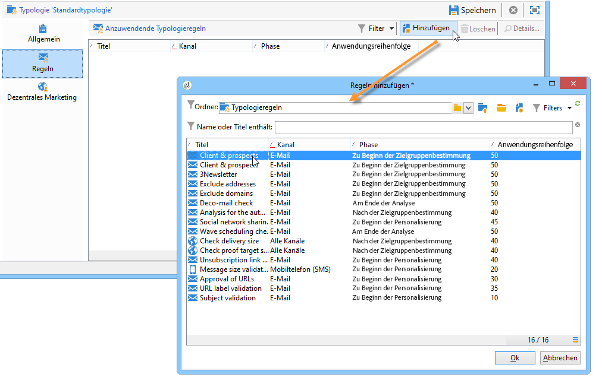
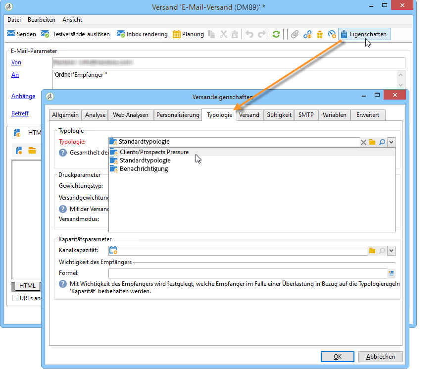
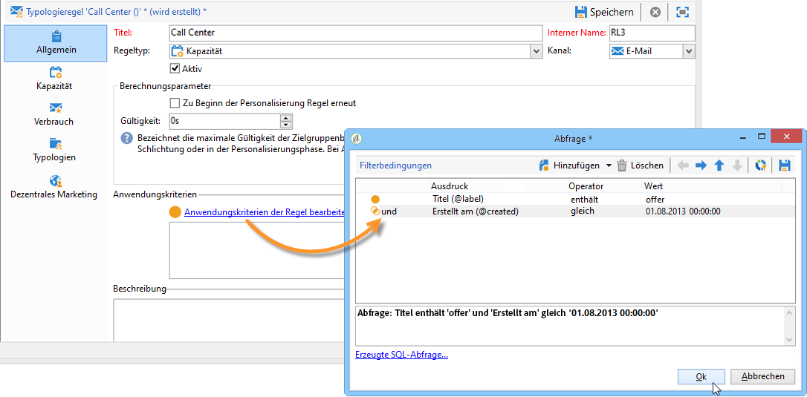
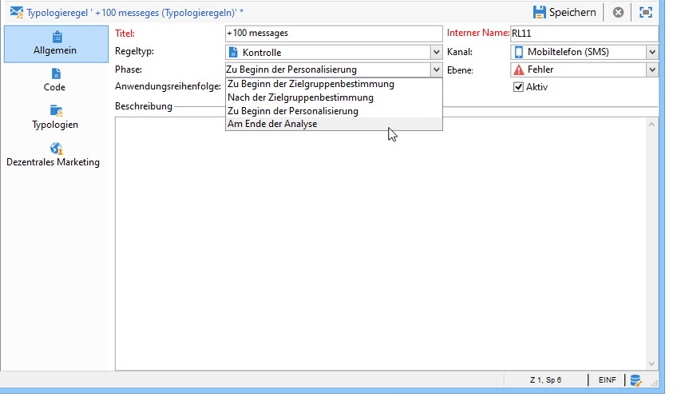
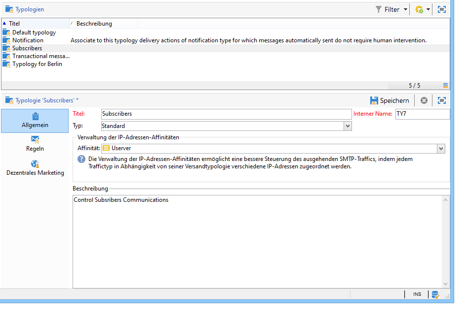
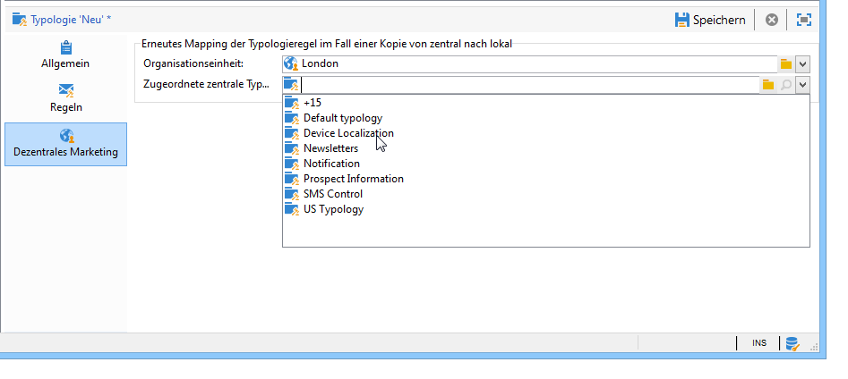

# Anwenden von Typologieregeln{#applying-rules}

## Anwenden von Typologien auf Sendungen {#apply-a-typology-to-a-delivery}

Um die von Ihnen erstellten Typologieregeln anzuwenden, verknüpfen Sie sie mit einer Typologie und referenzieren Sie diese Typologie in Ihrem Versand.

Gehen Sie dazu wie folgt vor:

1. Erstellen Sie eine Kampagnentypologie.

   Die Typologien befinden sich im Ordner **[!UICONTROL Administration > Kampagnen-Management > Typologieverwaltung]** > **[!UICONTROL Typologien]** des Campaign-Explorers.

1. Klicken Sie im Tab **[!UICONTROL Regeln]** auf die Schaltfläche **[!UICONTROL Hinzufügen]** und wählen Sie die Regeln aus, die im Rahmen dieser Typologie angewendet werden sollen.

   

1. Speichern Sie die Typologie, um sie der Liste der bereits vorhandenen Typologien hinzuzufügen.
1. Öffnen Sie den Versand, auf den Sie die Regeln anwenden möchten.
1. Navigieren Sie zu den Versandeigenschaften und öffnen Sie die Registerkarte **[!UICONTROL Typologie]**.
1. Wählen Sie die Typologie in der Dropdown-Liste aus.

   

   >[!NOTE]
   >
   >Die Typologie kann auf Ebene der Versandvorlage festgelegt werden, um sie automatisch auf alle mit der jeweiligen Vorlage erstellten Sendungen anzuwenden.

## Definieren der Anwendungsbedingungen {#define-application-conditions}

Es besteht die Möglichkeit, das Anwendungsfeld einer Regel Ihren Bedürfnissen entsprechend einzuschränken (mit Ausnahme von Kontrollregeln).

Typologieregeln können demnach so konfiguriert werden, dass sie nur bestimmte Sendungen, in denen sie referenziert sind, oder nur bestimmte Empfänger einer Sendung betreffen.

Um die Anwendungskriterien einer Regel zu bestimmen, klicken Sie auf den Link **[!UICONTROL Anwendungskriterien der Regel bearbeiten]** im Tab **[!UICONTROL Allgemein]**.

Verwenden Sie dann den [Abfrage-Editor](../../v8/start/query-editor.md), um Filterbedingungen zu definieren. Im folgenden Beispiel betrifft die Kapazitätsregel nur Sendungen, die das Wort „Angebot“ in ihrer Bezeichnung enthalten, oder Sendungen, die vor dem 1. April 2013 erstellt wurden.

>[!NOTE]
>
>Für Filterregeln kann der Anwendungskontext der Filterkriterien ausgewählt werden: Sie können versandabhängig oder entwurfsabhängig sein. [Weitere Informationen](filtering-rules.md#condition-a-filtering-rule).

## Anpassen der Berechnungsfrequenz {#adjust-calculation-frequency}

Schlichtungen werden jede Nacht automatisch über den Datenbankbereinigungs-Workflow erneut ausgeführt. Werte können jedoch über diesen Zeitraum hinaus gespeichert werden.

Einige Berechnungen verwenden nämlich Werte, die sich nicht täglich ändern. Es wäre daher überflüssig, die Daten täglich neu zu berechnen und die Datenbank unnötig zu überlasten. Wenn beispielsweise ein Prozess die Marketing-Datenbank wöchentlich mit der Tendenzauswertung und Kaufinformationen der Kundschaft anreichert, müssen die auf diesen Werten basierenden Daten nicht täglich neu berechnet werden.

Geben Sie hierzu im Feld **[!UICONTROL Frequenz]** der Registerkarte **[!UICONTROL Allgemein]** an, wie lange die Berechnungen höchstens beibehalten werden sollen. Der Standardwert **0s** veranlasst, dass die Berechnungen bis zur nächsten Ausführung der täglichen Neuschlichtung gültig bleiben.

Um die Ergebnisse über diese Begrenzung hinaus beizubehalten, geben Sie einen Wert von über 12h im Feld **[!UICONTROL Frequenz]** an: Wenn diese Frist abgelaufen ist, werden alle Regeln erneut angewandt.

Die Option **[!UICONTROL Zur Beginn der Personalisierung Regel erneut anwenden]** ermöglicht es, die Regel systematisch bei der Personalisierungsphase anzuwenden, auch wenn die im Feld **[!UICONTROL Frequenz]** angegebene Frist nicht abgelaufen ist.

## Phase der Regelanwendung auswählen {#selecting-the-rule-application-phase}

Typologieregeln werden in einer spezifischen Reihenfolge je nach Konfiguration zum Zeitpunkt der Zielgruppenbestimmung, Analyse bzw. Personalisierung des Versands angewendet.

### Anwendungsreihenfolge {#execution-order}

Im Standard-Ausführungsmodus werden die Regeln in der folgenden Reihenfolge ausgeführt:

1. Kontrollregeln, wenn sie zu Beginn der Zielgruppenbestimmung angewendet werden
1. Filterregeln:

   * Native Anwendungsregeln für die Adressqualifizierung: definierte Adresse / nicht verifizierte Adresse / Adresse auf der Blockierungsliste / Adresse in Quarantäne / Qualität der Adresse.
   * Vom Benutzer definierte Filterregeln
   * Regeln zur Adress- oder Kennungsdeduplizierung (bei Bedarf angewandt);

1. Druckregeln;
1. Kapazitätsregeln;
1. Kontrollregeln, wenn sie am Ende der Zielgruppenbestimmung angewendet werden
1. Kontrollregeln, wenn sie zu Beginn der Personalisierung angewendet werden Wenn die Benutzerregeln (Filter/Druck/Kapazität) abgelaufen sind und neu berechnet werden müssen, werden sie in diesem Schritt angewendet.
1. Kontrollregeln, wenn sie sich auf das Ende der Personalisierung beziehen.

>[!NOTE]
>
>Wenn Sie das Modul &quot;Interaction&quot; nutzen, werden die Eignungsregeln gleichzeitig mit den Filterregeln (für Angebote in Versandentwürfen) oder während der Personalisierungsphase beim Aufruf des Angebotsmoduls angewendet.

Sie können die Anwendungsreihenfolge von Regeln mit demselben Typ mithilfe des entsprechenden Felds auf der Registerkarte **[!UICONTROL Allgemein]** der Regel anpassen. Dies ist insbesondere interessant, wenn in der gleichen Verarbeitungsphase der Nachrichten mehrere Regeln zur Anwendung kommen.****

Beispielsweise wird eine Druckregel mit einer Anwendungsreihenfolge von 20 vor einer Druckregel mit einem Wert von 30 ausgeführt.

### Kontrollregeln {#control-rules}

Für **[!UICONTROL Kontrollregeln]** können Sie festlegen, zu welchem Zeitpunkt des Versandslebenszyklus die Regel angewendet wird: vor oder nach der Zielgruppenbestimmung, zu Beginn der Personalisierung, am Ende der Analyse. Wählen Sie den gewünschten Wert in der Dropdown-Liste des Felds **[!UICONTROL Phase]** auf der Registerkarte **[!UICONTROL Allgemein]** der Typologieregel aus.

Mögliche Werte:

* **[!UICONTROL Zu Beginn der Zielgruppenbestimmung]**

  Die Kontrollregel kann in dieser Phase angewandt werden, um im Falle eines Fehlers die Personalisierungsetappe nicht auszuführen.

* **[!UICONTROL Nach der Zielgruppenbestimmung]**

  Wenn Sie die Größe der Zielgruppe kennen müssen, um die Kontrollregel anzuwenden, wählen Sie diese Phase aus.

  Die Kontrollregel **[!UICONTROL Prüfung der Testversandgröße]** beispielsweise wird zwingend nach der Zielgruppenbestimmungsphase angewandt: Diese Regel verhindert eine Nachrichtenpersonalisierung, wenn die Zielgruppe des Testversands zu groß ist.

* **[!UICONTROL Zu Beginn der Personalisierung]**

  Diese Phase muss ausgewählt werden, wenn die Steuerung die Validierung der Nachrichtenpersonalisierung betrifft. Die Nachrichtenpersonalisierung erfolgt während der Analysephase.

* **[!UICONTROL Am Ende der Analyse]**

  Wenn für eine Überprüfung die Nachrichtenpersonalisierung abgeschlossen sein muss, wählen Sie diese Phase aus.

## Ergänzende Konfigurationen {#additional-configurations}

### Ausgehenden SMTP-Traffic steuern {#control-outgoing-smtp-traffic}

Als Option können Sie das Feld **[!UICONTROL Verwalten von IP-Adressen]** verwenden, um Sendungen mit dem Versand-Server (MTA) in dieser Affinität zu verknüpfen. Damit können Sie die Zustellung von E-Mails auf bestimmte Geräte oder IP-Adressen begrenzen.

>[!NOTE]
>
>Die Affinitätenverwaltung gilt nicht für **[!UICONTROL Filter]**-Typologien.

<!--
>Affinities are defined in the instance configuration file, on the Adobe Campaign server. For more on this, refer to [this section](../../installation/using/about-initial-configuration.md).
-->

### Kampagnenoptimierung und dezentrales Marketing {#campaign-optimization-and-distributed-marketing}

Auf **[!UICONTROL Registerkarte]** Verteiltes Marketing“ können Sie die Neuzuordnung von Typologien und/oder Regeln definieren, die bei der Bestellung und/oder Reservierung einer freigegebenen Kampagne angewendet werden. Typologien/Regeln, die für eine Lokalstelle definiert wurden (und mit denen verknüpft sind, die für die Zentralstelle definiert wurden), ersetzen Regeln/Typologien, die mit der Zentralstelle verknüpft sind. Durch die Neuzuordnung können Sie die Regeln der zentralen Entitäten an die Lokalstellen anpassen, die die Kampagne bestellen.

>[!NOTE]
>
>Im Zusammenhang mit den Typologien und Typologieregeln wird der Tab **[!UICONTROL Dezentrales Marketing]** angeboten, sofern Ihre Lizenz die Option Distributed Marketing beinhaltet. Überprüfen Sie Ihren Lizenzvertrag.\
>Weitere Informationen zum verteilten Marketing finden Sie in [diesem Abschnitt](../distributed-marketing/about-distributed-marketing.md).
