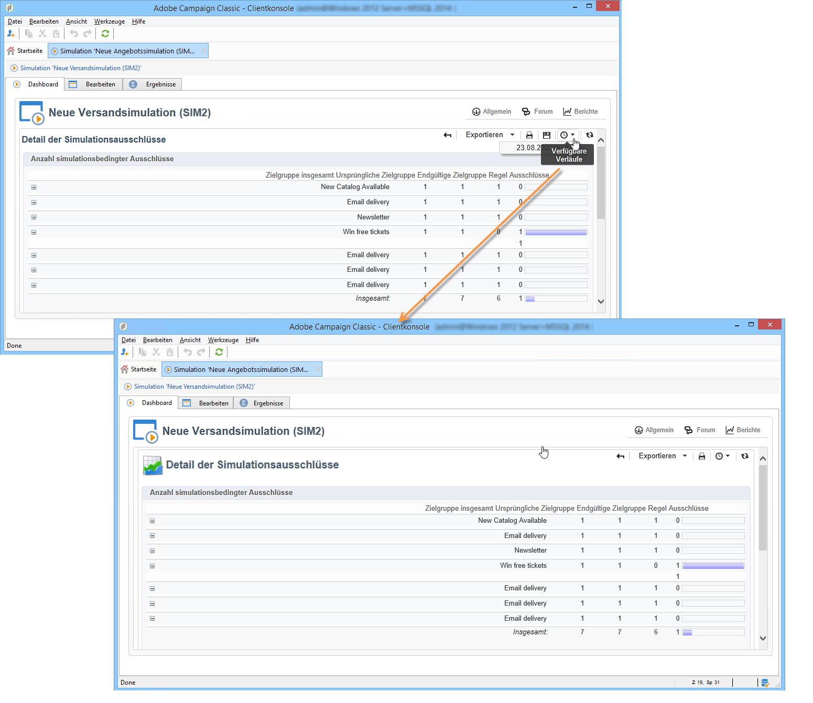

# Kampagnensimulationen{#campaign-simulations}

Campaign Optimization ermöglicht es, die Effizienz eines Kampagnenplans mithilfe von Simulationen zu testen. Sie haben so die Möglichkeit, den potenziellen Erfolg einer Kampagne im Detail einzuschätzen, beispielsweise die zu erwartenden Einnahmen, die Zielgruppengröße nach Anwendung der entsprechenden Typologieregeln etc.

Mithilfe der Simulation können die voraussichtlichen Auswirkungen von Sendungen miteinander verglichen werden.

## Einrichten einer Simulation {#set-up-a-simulation}

### Vorsicht

Sendungen, die im Modus **Test** vorbereitet wurden, beeinflussen sich gegenseitig nicht, z. B. bei der Auswertung einer Kampagne im verteilten Marketing oder solange die Sendungen nicht im vorläufigen Kalender eingeplant sind.

Das bedeutet, dass die Druck- und Kapazitätsregeln nur auf Sendungen im Modus **[!UICONTROL Zielgruppenschätzung und Nachrichtenpersonalisierung]** angewendet werden. Sendungen im Modus **[!UICONTROL Schätzung und Validierung der geplanten Zielgruppe]** und im Modus **[!UICONTROL Zielgruppenevaluierung]** werden nicht berücksichtigt.

Der Versandmodus wird in den Eigenschaften des jeweiligen Versands in der Registerkarte **[!UICONTROL Typologie]** ausgewählt.

### Erstellen einer Simulation {#create-a-simulation}

Folgen Sie den nachstehenden Schritten, um eine Simulation zu erstellen:

1. Öffnen Sie den Tab **[!UICONTROL Kampagnen]**, klicken Sie im Abschnitt **[!UICONTROL Erstellen]** auf den Link **[!UICONTROL Andere Optionen]** und wählen Sie **[!UICONTROL Simulation]** aus.

   

1. Wählen Sie eine Simulationsvorlage aus und geben Sie einen Titel an. Klicken Sie auf die Schaltfläche **[!UICONTROL Speichern]**, um die Simulation zu erstellen.

   

1. Klicken Sie auf den Tab **[!UICONTROL Bearbeiten]**, um sie zu konfigurieren.

   

1. Geben Sie im Tab **[!UICONTROL Perimeter]** die für diese Simulation zu berücksichtigenden Sendungen an. Klicken Sie hierfür auf die Schaltfläche **[!UICONTROL Hinzufügen]** und wählen Sie den gewünschten Modus aus.

   

   Sie können entweder jeden Versand einzeln oder alle zu einer bestimmten Kampagne, einem Programm oder einem Plan gehörenden Sendungen auswählen.

   >[!NOTE]
   >
   >Wenn Sie die Sendungen eines Plans, eines Programms oder einer Kampagne auswählen, kann Adobe Campaign automatisch die Liste der zu berücksichtigenden Sendungen bei jedem Simulationsstart aktualisieren. Kreuzen Sie dafür die Option **[!UICONTROL Versandauswahl bei jedem Simulationsstart aktualisieren]** an.
   >  
   >Andernfalls werden nur die zum Zeitpunkt der Simulationserstellung im Plan, Programm oder in der Kampagne vorhandenen Sendungen berücksichtigt: Später hinzugefügte Sendungen werden nicht beachtet.

   

1. Wählen Sie die dem Simulationsperimeter hinzuzufügenden Elemente aus. Mithilfe der Umschalt- und der Steuerung-Tasten können Sie mehrere Elemente auf einmal auswählen.

   

   Klicken Sie auf die Schaltfläche **[!UICONTROL Beenden]**, um die Auswahl zu bestätigen.

   Es besteht die Möglichkeit, manuell ausgewählte Sendungen mit solchen aus verschiedenen Plänen, Programmen oder Kampagnen zu kombinieren.

   

   Über den Link **[!UICONTROL Dynamische Bedingung bearbeiten]** können Sie eine dynamische Bedingung hinzufügen..

   Klicken Sie zur Bestätigung der Konfiguration auf die Schaltfläche **[!UICONTROL Speichern]**.

   >[!NOTE]
   >
   >In den Simulationsberechnungen werden nur die Sendungen berücksichtigt, deren Zielgruppe bereits berechnet wurde (Status **Zielbestimmung abgeschlossen** oder **Versandbereit**).

1. Wählen Sie im **[!UICONTROL Berechnungen]**-Tab eine Analysedimension, beispielsweise das Empfängerschema aus.

   

1. Im Anschluss können Sie Ausdrücke hinzufügen.

   

### Ausführungsparameter {#execution-settings}

Im Tab **[!UICONTROL Allgemein]** der Simulation können Sie ihre Ausführungsparameter eingeben:

* Die Option **[!UICONTROL Ausführung auf einen Zeitpunkt mit geringer Auslastung verschieben]** verschiebt die Simulation auf einen weniger ausgelasteten Zeitpunkt, entsprechend der gewählten Priorität. Da Simulationen umfangreiche Datenbankressourcen in Anspruch nehmen, sollten weniger dringende Simulationen zum Beispiel nachts ausgeführt werden.
* Die **[!UICONTROL Priorität]** entspricht der Dringlichkeit, die der Simulation zugeteilt wird, um sie schnellstmöglich durchzuführen oder ihren Start zu verzögern.
* Option **[!UICONTROL SQL-Abfragen im Protokoll speichern]**: SQL-Logs dienen dazu, fehlerhafte oder zu langsame Simulationen zu diagnostizieren. Die entsprechenden Logs sind nach der Simulation im Untertab **[!UICONTROL SQL-Logs]** des Tabs **[!UICONTROL Verfolgung]** verfügbar.

## Ausführen einer Simulation {#execute-a-simulation}

### Starten einer Simulation {#start-a-simulation}

Sobald der Perimeter der Simulation definiert wurde, kann sie ausgeführt werden.

Öffnen Sie das Simulations-Dashboard und klicken Sie auf die Schaltfläche **[!UICONTROL Simulation starten]**.

Öffnen Sie nach der Ausführung die Simulation und klicken Sie auf den Tab **[!UICONTROL Ergebnisse]**, um die für die Sendungen berechneten Zielgruppen anzuzeigen.

1. Im Untertab **[!UICONTROL Sendungen]** werden die von der Simulation berücksichtigten Sendungen in zwei Zählungen aufgelistet:

   * Die **[!UICONTROL Ursprüngliche Zählung]** entspricht der Schätzung der Zielgruppe auf Ebene des Versands;
   * Die **[!UICONTROL Endgültige Zählung]** zeigt die Anzahl der nach Ausführung der Simulation verbleibenden Empfänger an.

      Der Unterschied zwischen ursprünglicher und endgültiger Zählung spiegelt die vor der Simulation konfigurierten unterschiedlichen Regeln oder Filter wider.

      Gehen Sie in den Untertab **[!UICONTROL Ausschlüsse]**, um die Details der Berechnung anzusehen.

1. Die **[!UICONTROL Ausschlüsse]** werden nach Sendungen aufgestaffelt dargestellt.

   

1. Der Untertab **[!UICONTROL Warnungen]** fasst alle bei der Simulation erzeugten Warnnachrichten zusammen. Diese können den Benutzer bei Überschreitung der Kapazität benachrichtigen (wenn beispielsweise die Zielgruppe mehr Empfänger enthält, als die festgelegte Kapazität zulässt).
1. Im Untertab **[!UICONTROL Ausschlussanalyse]** kann eine Tabelle zur übersichtlichen Darstellung der Ergebnisse erstellt werden. Der Benutzer gibt die jeweiligen Variablen für die Abszissen- und Ordinatenachsen an.

   Ein Beispiel für die Erstellung einer Analysetabelle finden Sie am Ende [dieses Abschnitts](#explore-results).

### Anzeigen von Ergebnissen {#view-results}

#### Verfolgung {#audit}

Über den Tab **[!UICONTROL Verfolgung]** können Sie die Ausführung der Simulation überwachen. Insbesondere für erfahrene Benutzer ist hier der Unter-Tab **[!UICONTROL SQL-Logs]** hilfreich, auf dem die Ausführungs-Logs im SQL-Format aufgeführt werden. Damit die SQL-Logs angezeigt werden, muss vor Ausführung der Simulation im Tab **[!UICONTROL Allgemein]** die Option **[!UICONTROL SQL-Abfragen im Protokoll speichern]** aktiviert werden.

#### Analysieren von Ergebnissen {#explore-results}

Die Unter-Registerkarte **[!UICONTROL Ausschlussanalyse]** ermöglicht die Analyse der aus der Simulation resultierenden Daten.

<!--
Descriptive analysis is detailed in [this section](../../reporting/using/about-adobe-campaign-reporting-tools.md).
-->

## Ergebnisse einer Simulation {#results-of-a-simulation}

Die in den Tabs **[!UICONTROL Log]** und **[!UICONTROL Ergebnisse]** dargestellten Indikatoren geben einen ersten Einblick in das Ergebnis der Simulation. Im Tab **[!UICONTROL Berichte]** können Sie eine präzise Analyse der Informationen vornehmen.

### Berichte {#reports}

Um das Ergebnis einer Simulation zu analysieren, nutzen Sie die mit ihr verbundenen Berichte: Sie stellen die Simulationsausschlüsse und ihre Gründe dar.

Standardmäßig werden folgende Berichte angeboten:

* **[!UICONTROL Detail der Simulationsausschlüsse]**: Dieser Bericht bietet eine detaillierte Tabelle aller Ausschlussgründe für alle von dieser Simulation betroffenen Sendungen.
* **[!UICONTROL Simulationszusammenfassung]**: Dieser Bericht zeigt den Umfang der von der Simulation ausgeschlossenen Zielgruppen gestaffelt nach Sendungen an.
* **[!UICONTROL Zusammenfassung der simulationsbedingten Ausschlüsse]**: Dieser Bericht zeigt eine Tabelle der Ausschlüsse durch die Simlation an. Des weiteren werden die Typologieregeln aufgeführt, die zum Ausschluss geführt haben sowie ihr jeweiliger Anteil an den regelbedingten Ausschlüssen.

<!--
>[!NOTE]
>
>You can create new reports and add them to the ones offered. For more on this, refer to [this section](../../reporting/using/about-adobe-campaign-reporting-tools.md).
-->

Um Berichte zu öffnen, klicken Sie auf den für die jeweilige Simulation im Dashboard verfügbaren **[!UICONTROL Berichte]**-Link.

Klicken Sie auf den Link **[!UICONTROL Berichte]** auf dem Dashboard der entsprechenden Simulation, um auf die Berichte zuzugreifen.

### Vergleich von Simulationen {#compare-simulations-}

Bei wiederholter Ausführung einer Simulation wird das vorherige Ergebnis durch das neu berechnete Ergebnis ersetzt; die Ergebnisse unterschiedlicher Ausführungen können daher nicht angezeigt und miteinander verglichen werden.

Es besteht jedoch die Möglichkeit, sie mithilfe von Berichten zu vergleichen: Adobe Campaign kann einen Berichtsverlauf speichern, der im Nachhinein angezeigt werden kann. Dieser Verlauf wird über den gesamten Simulations-Lebenszyklus gespeichert.

**Beispiel:**

1. Erstellen Sie eine Simulation für einen Versand, der die Typologie **A** anwendet.
1. Öffnen Sie im Tab **[!UICONTROL Berichte]** einen der verfügbaren Berichte, zum Beispiel **[!UICONTROL Detail der simulationsbedingten Ausschlüsse]**.
1. Klicken Sie oben rechts auf das Symbol zur Erstellung eines neuen Verlaufs.

   

1. Schließen Sie diese Simulation und ändern Sie die Konfiguration der Typologie **A**.
1. Führen Sie die Simulation erneut aus und vergleichen Sie das Ergebnis mit dem in dem Bericht angezeigten Ergebnis, in dem zuvor ein Verlauf erstellt wurde.

   

   Es können beliebig viele Berichtsverläufe gespeichert werden.

### Berichtsachsen {#reporting-axes}

Auf der Registerkarte **[!UICONTROL Berechnungen]** können Sie Berichtsachsen bezüglich der Zielgruppe definieren. Diese Achsen werden während der [Ergebnisanalyse](#explore-results) verwendet.

>[!NOTE]
>
>Es ist empfehlenswert, die Berichtsachsen in einer Simulationsvorlage zu bestimmen und nicht in jeder einzelnen Simulation.\
>Die Simulationsvorlagen werden im Knoten **[!UICONTROL Ressourcen > Vorlagen > Simulationsvorlagen]** des Adobe-Campaign-Navigationsbaums gespeichert.

**Beispiel:**

Es soll eine zusätzliche Berichtsachse über den Empfängerstatus (&quot;Kunde&quot;, &quot;Interessent&quot; oder kein Status) erstellt werden.

1. Um eine Berichtsachse zu bestimmen, wählen Sie die Tabelle der zu nutzenden Informationen im Feld **[!UICONTROL Analysedimension]** aus.
1. An dieser Stelle wird das entsprechende Feld der Empfängertabelle ausgewählt.

   

1. Folgende Optionen stehen zur Verfügung:

   * **[!UICONTROL Statistiken der Zielgruppenüberschneidung erzeugen]**, um alle Überschneidungsstatistiken im Simulationsbericht zu erhalten. Die Überschneidung entspricht den Empfängern, die in mindestens zwei Sendungen einer Simulation der Zielgruppe angehören.

      >[!CAUTION]
      >
      >Die Auswahl dieser Option verlängert die Ausführungsdauer der Simulation beträchtlich.

   * **[!UICONTROL Simulationsarbeitstabelle beibehalten]**, um Spuren der Simulation zu speichern.

      >[!CAUTION]
      >
      >Die systematische Speicherung dieser Tabellen erfordert eine erhöhte Speicherkapazität: Stellen Sie sicher, dass Ihre Datenbank über entsprechenden Speicherplatz verfügt.

Bei der Anzeige der Simulationsergebnisse werden Informationen bezüglich des ausgewählten Ausdrucks im Untertab **[!UICONTROL Überschneidungen]** angezeigt.

Die Überschneidungen geben die Empfänger an, die in mindestens zwei verschiedenen Sendungen einer Simulation den Zielgruppen angehören.

>[!NOTE]
>
>Dieser Untertab wird nur angezeigt, wenn die Option **[!UICONTROL Statistiken der Zielgruppenüberschneidung erzeugen]** aktiviert wurde.

Informationen bezüglich der Berichtsachsen können in den Berichten der Ausschlussanalyse genutzt werden, die im Unter-Tab **[!UICONTROL Ausschlussanalyse]** erstellt werden. [Weitere Informationen](#explore-results).
