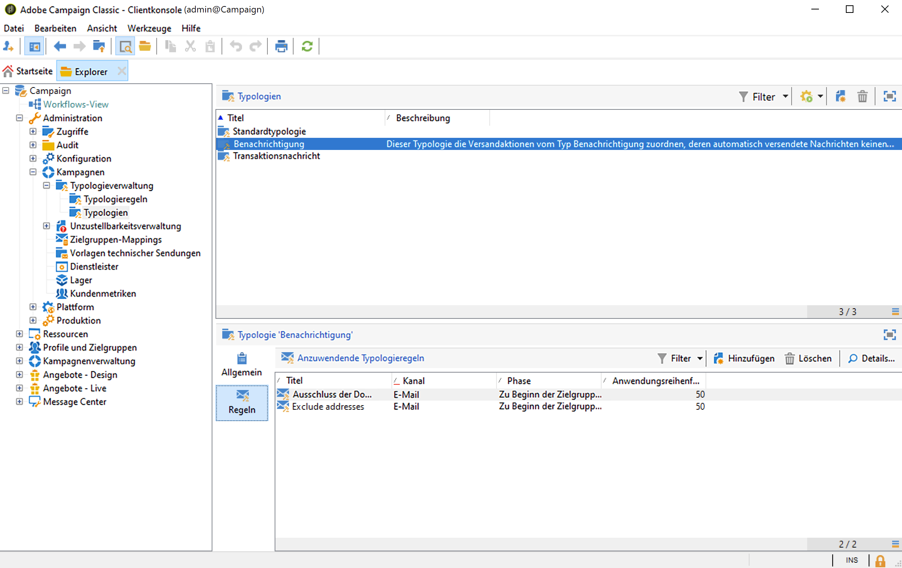

# Erste Schritte mit Kampagnentypologien{#about-campaign-typologies}

**Campaign Optimization** ist das Adobe Campaign-Modul, mit dem Sie die Durchführung von Sendungen steuern, filtern und überwachen können. Um Konflikte zwischen Kampagnen zu vermeiden, kann Adobe Campaign verschiedene Kombinationen durch Anwendung spezifischer Beschränkungsregeln testen. Auf diese Weise werden ein ideal auf Kundenbedürfnisse abgestimmter Nachrichtenversand sowie eine kohärente Unternehmenskommunikation sichergestellt.

 [Mehr zu dieser Funktion erfahren Sie im Video.](#typologies-video).

>[!NOTE]
>
>Je nach Angebot kann die Kampagnenoptimierung enthalten sein oder als Add-on hinzugefügt werden. Prüfen Sie diesbezüglich Ihren Lizenzvertrag.

## Typologieregeln und Typologien {#typology-rules}

Campaign verfügt standardmäßig über integrierte Typologien und Typologieregeln.

Bei einer Typologie handelt es sich um eine Reihe von Überprüfungsregeln, die bei der Versandanalyse auf alle Nachrichten angewendet werden.

Eine Kampagnentypologie kann mehrere Typologieregeln enthalten, ein Versand kann jedoch nur eine Typologie referenzieren.

Integrierte Typologieregeln und Typologien sind im Ordner **[!UICONTROL Administration > Kampagnenverwaltung > Typologieverwaltung]** des Campaign-Explorers verfügbar.

Für jede Typologie können Sie auf der Registerkarte **[!UICONTROL Regeln]** die anzuwendenden Typologieregeln hinzufügen, löschen oder anzeigen.

Nach ihrer Erstellung werden die Regeln in **Kampagnentypologien** gruppiert, die in den Sendungen zur Anwendung kommen. [Weitere Informationen](#apply-typologies).

Campaign verfügt über einen Satz von Standardregeln für **Filterung** und **Kontrolle**:

* **Filterregeln** erlauben es, einen Teil der Zielgruppe anhand von Kriterien auszuschließen. [Weitere Informationen](filtering-rules.md).
* **Kontrollregeln** erlauben es, die Gültigkeit von Nachrichten zu überprüfen, bevor sie gesendet werden. [Weitere Informationen](control-rules.md).

Das Add-on zur Kampagnenoptimierung bietet zwei zusätzliche Typen von **Typologieregeln**:

* **Druckregeln** erlauben es, die Marketing-Müdigkeit zu kontrollieren. [Weitere Informationen](pressure-rules.md).
* **Kapazitätsregeln** erlauben es, die Auslastung zu begrenzen, um optimale Verarbeitungsbedingungen zu gewährleisten. [Weitere Informationen](consistency-rules.md#controlling-capacity).

>[!NOTE]
>
>Wenn Sie das Modul **Interaktion** zur Verwaltung von Angeboten verwenden, können Sie auch Typologieregeln für die **Angebotsunterbreitung** erstellen, um den Fluss von Angebotsvorschlägen mithilfe von Unterbreitungsregeln zu kontrollieren. [Weitere Informationen](../../v8/interaction/interaction-offer.md#offer-presentation).

## Wichtige Schritte zum Erstellen und Verwenden von Typologien {#apply-typologies}

Gehen Sie wie folgt vor, um eine Typologie für Ihre Sendungen zu erstellen und zu verwenden:

1. Erstellen Sie Typologieregeln und eine Typologie, um die Regeln darin zu referenzieren.
Ausführliche Schritte dazu finden Sie im folgenden Abschnitt:

   * [Filterregeln](filtering-rules.md)
   * [Kontrollregeln](control-rules.md)
   * [Druckregeln](pressure-rules.md)
   * [Kapazitätsregeln](consistency-rules.md)

1. Konfigurieren Sie Ihren Versand so, dass er die von Ihnen erstellte Typologie verwendet. [Weitere Informationen](apply-rules.md#apply-a-typology-to-a-delivery).
1. Testen und steuern Sie das Verhalten mithilfe von Kampagnensimulationen. [Weitere Informationen](campaign-simulations.md).

Bei der Versandvorbereitung werden Empfänger ausgeschlossen, wenn das Kriterium erfüllt ist. In den Logs können Sie die Ausführung von Ausschlüssen überprüfen.

Anwendungsbeispiele zu Drucktypologieregeln finden Sie auf [dieser Seite](pressure-rules.md#use-cases-on-pressure-rules).

## Anleitungsvideos {#typologies-video}

### Einrichten der Ermüdungsverwaltung mithilfe von Typologieregeln

In diesem Video wird erläutert, wie die Ermüdungsverwaltung in Adobe Campaign mithilfe von Typologieregeln implementiert wird.

>[!VIDEO](https://video.tv.adobe.com/v/3448340?captions=ger&quality=12)

### Einrichten der Ermüdungsverwaltung mithilfe vordefinierter Filter

Die Ermüdungsverwaltung steuert die Häufigkeit und Anzahl von Nachrichten, um eine Überforderung der Empfänger zu vermeiden. Wenn Sie das Modul zur Kampagnenoptimierung nicht in Ihrer Kampagneninstanz haben, können Sie einen vordefinierten Filter konfigurieren, der die Zielpopulation nach der Anzahl der empfangenen Nachrichten filtert
In diesem Video wird erläutert, wie Sie die Ermüdungsverwaltung in Adobe Campaign mithilfe von Filtern implementieren.

>[!VIDEO](https://video.tv.adobe.com/v/3444609?captions=ger&quality=12)
