# Kohärenzregeln{#consistency-rules}

Adobe Campaign ermöglicht die Sicherstellung der Kohärenz Ihrer Marketing-Kommunikation mithilfe einer Reihe von in den Kampagnentypologien enthaltenen Regeln. Diese dienen dazu, die an die Empfänger übermittelten Sendungen in Bezug auf Volumen, Art, Relevanz etc. zu kontrollieren.

Mithilfe von **Kapazitätsregeln** kann etwa verhindert werden, dass die Plattform, die den Versand verarbeitet, überlastet wird. Zum Beispiel dürfen Sonderangebote mit einem Download-Link nicht an eine zu große Population gesendet werden, um den Server nicht zu überlasten, eine Telefonkampagne darf die Verarbeitungskapazität der Telefonzentrale nicht überschreiten usw.

## Kontrollieren der Kapazität {#control-capacity}

Stellen Sie vor dem Versand von Nachrichten sicher, dass Ihre physische Infrastruktur über ausreichende Kapazitäten verfügt, um sowohl ausgehende als auch eingehende Nachrichten (z. B. Antworten, Bounces, Anrufe im Callcenter etc.) verarbeiten zu können.

Erstellen Sie hierfür Typologieregeln vom Typ **[!UICONTROL Kapazität]**.

Im folgenden Beispiel wird eine Typologieregel für eine telefonische Treuekampagne erstellt. Die Regel soll die Anzahl der Nachrichten auf 20 pro Tag begrenzen, entsprechend der Verarbeitungskapazität eines Callcenters. Nachdem die Regel auf zwei Sendungen angewendet wurde, kann die Auslastung über die Logs abgelesen werden.

Gehen Sie wie folgt vor, um eine neue Kapazitätsregel zu erstellen:

1. Klicken Sie im Verzeichnisknoten **[!UICONTROL Administration > Kampagnenverwaltung > Typologieverwaltung > Typologieregeln]** auf **[!UICONTROL Neu]**.
1. Wählen Sie eine Regel vom Typ **[!UICONTROL Kapazität]** aus.

   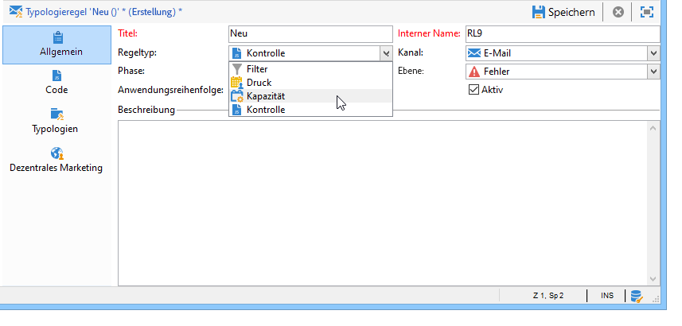

1. Erstellen Sie im Tab **[!UICONTROL Kapazität]** die Verfügbarkeitszeilen. In unserem Beispiel wären dies Zeiträume, in denen Anrufe getätigt werden können. Wählen Sie einen Zeitraum von 24 Stunden aus und geben Sie als Ursprungsmenge 150 ein, was bedeutet, dass das Callcenter 150 Anrufe pro Tag verarbeiten kann.

   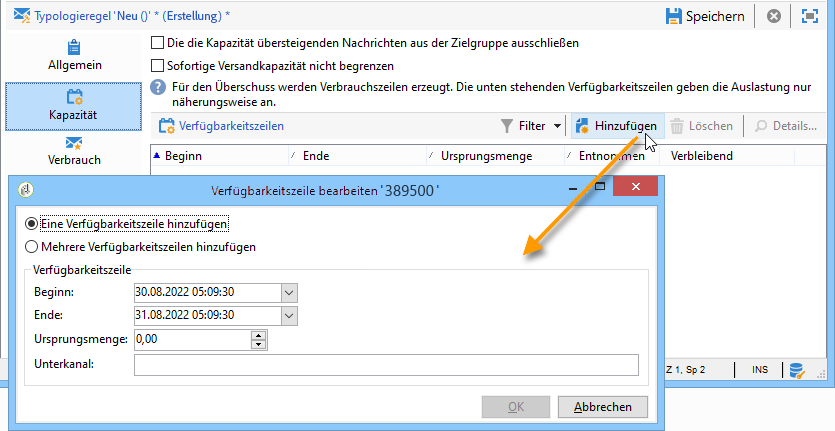

   >[!NOTE]
   >
   >Die Verfügbarkeitszeilen dienen nur als Richtwerte. Sie können bei Bedarf jedoch auch festlegen, dass bei Erreichen der Kapazitätsbegrenzung Nachrichten ausgeschlossen werden. Näheres hierzu finden Sie in [diesem Abschnitt](#exclude-messages-when-capacity-limit-reached).

1. Weisen Sie diese Regel einer Typologie zu und referenzieren Sie die Typologie in Ihrer Sendung, damit die Kapazitätsregel von dieser angewendet wird. Näheres hierzu finden Sie in [diesem Abschnitt](apply-rules.md#apply-a-typology-to-a-delivery).
1. Über die Tabs **[!UICONTROL Entnahmen]** und **[!UICONTROL Kapazität]** für diese Regel können Sie die Auslastung der Kapazitäten überwachen.

   Wenn eine Regel in einem Versand verwendet wird, zeigen die Spalten **[!UICONTROL Entnommen]** und **[!UICONTROL Verbleibend]** die verbrauchte Menge an, wie im unten stehenden Beispiel:

   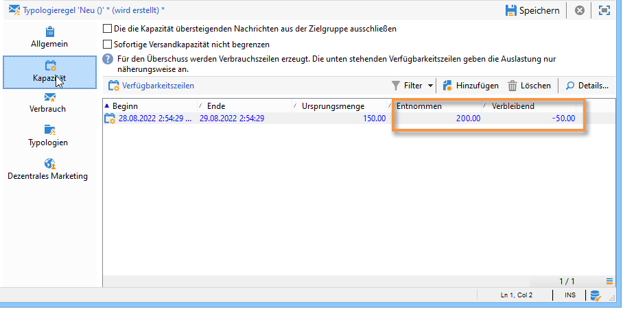

   Weiterführende Informationen hierzu finden Sie in [diesem Abschnitt](#monitor-consumption).

## Festlegen der maximalen Auslastung {#define-the-maximum-load}

Um die maximale Auslastung zu definieren, müssen Sie Verfügbarkeitszeilen festlegen. Dazu stehen zwei Optionen zur Verfügung: Sie können manuell [eine oder mehrere Verfügbarkeitszeilen erstellen](#add-availability-lines-one-by-one) oder ganze Verfügbarkeitsbereiche erstellen. Die Häufigkeit dieser Zeiträume kann automatisiert werden. [Weitere Informationen](#add-a-set-of-availability-lines).

### Verfügbarkeitszeilen einzeln hinzufügen {#add-availability-lines-one-by-one}

Um eine einzelne Verfügbarkeitszeile zu erstellen, klicken Sie auf die Schaltfläche **[!UICONTROL Hinzufügen]** und wählen Sie die Option **[!UICONTROL Eine Verfügbarkeitszeile hinzufügen]** aus. Geben Sie den Verfügbarkeitszeitraum und die verfügbare Menge an.

Sie können die Ihrer Verarbeitungskapazität entsprechende Anzahl an Zeilen hinzufügen.

### Mehrere Verfügbarkeitszeilen hinzufügen {#add-a-set-of-availability-lines}

Um Verfügbarkeitszeiträume in einem gegebenen Zeitraum festzulegen, klicken Sie auf die Schaltfläche **[!UICONTROL Hinzufügen]** und wählen Sie die Option **[!UICONTROL Mehrere Verfügbarkeitszeilen hinzufügen]**. Geben Sie die Dauer jedes Zeitraums und die Anzahl der zu erstellenden Zeiträume an.

Um die Zeitraumerstellung zu automatisieren, klicken Sie auf die Schaltfläche **[!UICONTROL Ändern]** und legen Sie die Planung der Zeiträume fest.

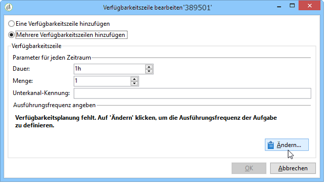

Zur Erstellung von Verfügbarkeitszeiträumen an Werktagen zwischen 9 und 17 Uhr mit einer Kapazität von 10 Anrufen pro Stunde, folgen Sie den nachstehenden Schritten:

1. Wählen Sie den Häufigkeitstyp und die Gültigkeitszeiträume aus:

   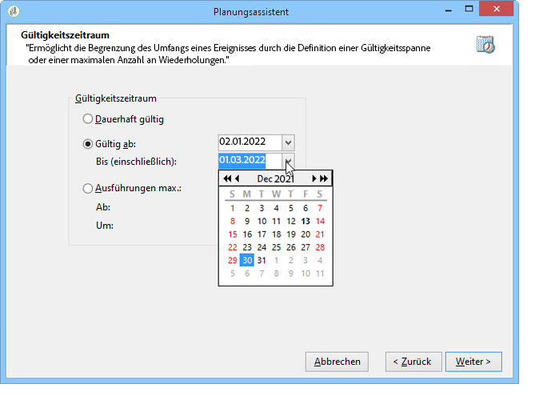

1. Geben Sie die Gültigkeitsdaten an:

   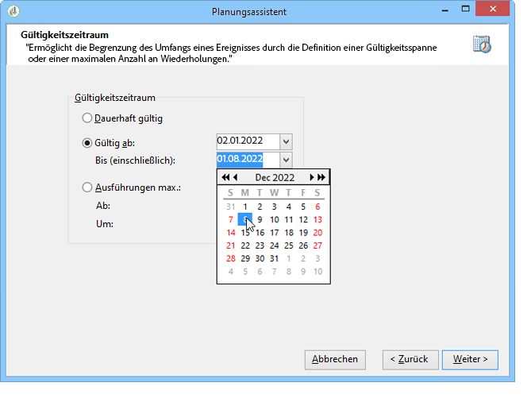

1. Überprüfen Sie die Konfiguration, bevor Sie sie beenden:

   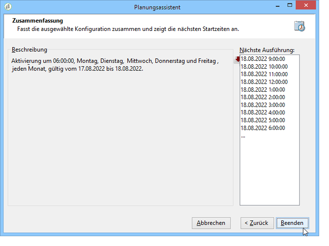

Der Workflow **[!UICONTROL Planungen]** erstellt automatisch alle entsprechenden Zeilen.

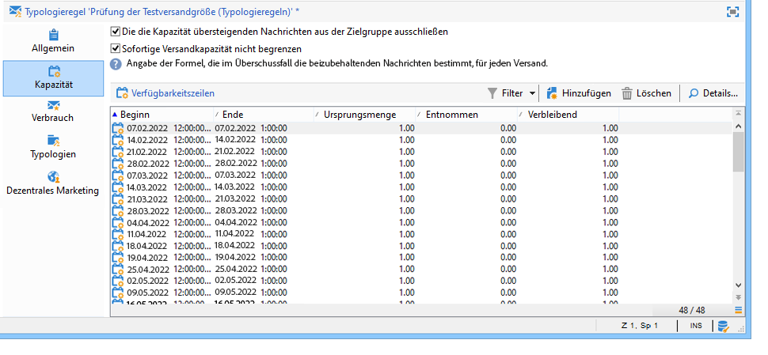

>[!NOTE]
>
>Es wird empfohlen, Verfügbarkeitszeilen über einen Dateiimport zu erstellen. Im Kapazität-Tab können die Verfügbarkeitszeilen anschließend eingesehen und überprüft werden.

## Nachrichten bei Erreichen des Kapazitätslimits ausschließen {#exclude-messages-when-capacity-limit-reached}

Die Verfügbarkeitszeilen dienen nur als Richtwerte. Um überschüssige Nachrichten auszuschließen, kreuzen Sie die Option **[!UICONTROL Die die Kapazität übersteigenden Nachrichten aus der Zielgruppe ausschließen]** an. Die Kapazität kann so nicht überschritten werden. Für die gleiche Population wie im vorhergehenden Beispiel können Verbrauch und verbleibende Kapazität die Ursprungsmenge nicht übersteigen.

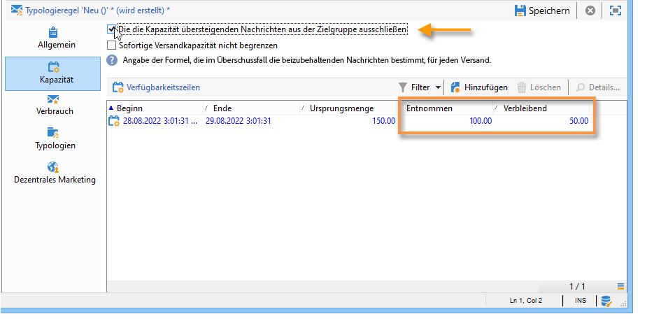

Die Anzahl der zu verarbeitenden Nachrichten ist gleichmäßig über den gesamten festgelegten Zeitraum verteilt. Dies ist insbesondere für Callcenter von Bedeutung, da die Anzahl der Anrufe, die diese pro Tag verarbeiten können, begrenzt ist. Im Fall von E-Mail-Sendungen können Sie mit der Option **[!UICONTROL Sofortige Versandkapazität nicht begrenzen]** diesen Zeitraum ignorieren und gleichzeitig Ihre E-Mails versenden.

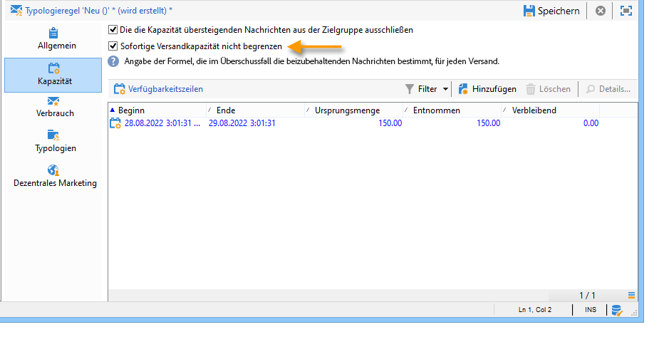

>[!NOTE]
>
>Bei Überlastung werden die beizubehaltenden Nachrichten nach einer in den Versandeigenschaften bestimmten Formel ausgewählt.

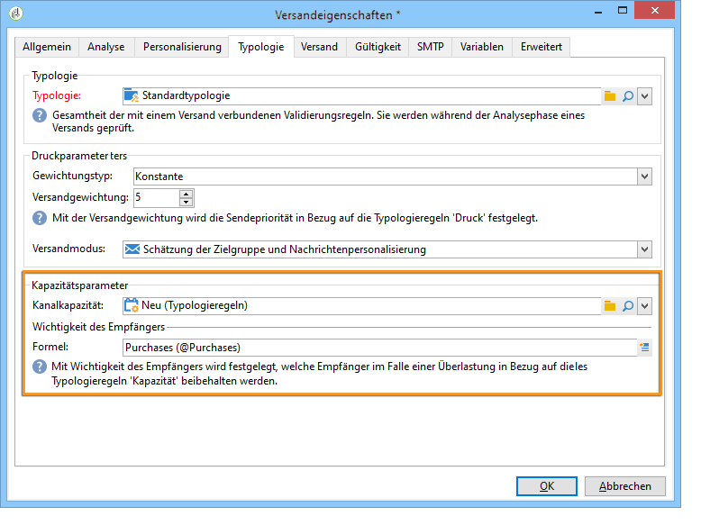

## Überwachen des Verbrauchs {#monitoring-consumption}

Kapazitätsregeln dienen standardmäßig lediglich Informationszwecken. Wählen Sie die Option **[!UICONTROL Die die Kapazität übersteigenden Nachrichten aus der Zielgruppe ausschließen]**, damit die festgelegte Menge nicht überschritten werden kann. Überschüssige Nachrichten werden dann automatisch von Sendungen ausgeschlossen, die diese Typologieregel anwenden.

Im Tab **[!UICONTROL Kapazität]** der Typologieregel haben Sie die Möglichkeit, in der **[!UICONTROL Verbraucht]**-Spalte die Inanspruchnahme der vorhandenen Ressourcen zu verfolgen.

Klicken Sie zur Ansicht der Verbrauchszeilen auf den Tab **[!UICONTROL Verbrauch]** der Regel.
