# Kohärenzregeln{#consistency-rules}

Adobe Campaign garantiert konsistente Kommunikation dank einer Reihe von Regeln, die in Kampagnentypologien enthalten sind. Sie dienen der Kontrolle der an Empfängerinnen und Empfänger gesendeten Sendungen, z. B. Menge, Art, Relevanz usw.

**Kapazitätsregeln** können beispielsweise verhindern, dass die vom Nachrichtenversand betroffene Plattform überlastet wird. Beispielsweise dürfen Sonderangebote mit einem Download-Link nicht an zu viele Personen gleichzeitig gesendet werden, um den Server nicht zu überlasten; Telefonkampagnen dürfen die Verarbeitungskapazität von Callcentern usw. nicht überschreiten.

## Kontrollieren der Kapazität {#control-capacity}

Stellen Sie vor dem Versand von Nachrichten sicher, dass Ihr Unternehmen über genügend Kapazitäten (physische Infrastruktur und Callcenter-Kapazität) verfügt, um beispielsweise den Versand, die durch den Versand möglicherweise erzeugten eingehenden Nachrichten und die Anzahl der Anrufe, die beispielsweise an Abonnierende zu richten sind, zu verarbeiten.

Erstellen Sie hierfür Typologieregeln vom Typ **[!UICONTROL Kapazität]**.

Im folgenden Beispiel erstellen wir eine Typologieregel für eine telefonische Treuekampagne. Wir beschränken die Anzahl der Nachrichten auf 20 pro Tag, was der täglichen Verarbeitungskapazität eines Callcenters entspricht. Nachdem die Regel auf zwei Sendungen angewendet wurde, können wir den Verbrauch über Logs überwachen.

Gehen Sie wie folgt vor, um eine neue Kapazitätsregel zu erstellen:

1. Klicken Sie im Ordner **[!UICONTROL Administration > Kampagnen-Verwaltung > Typologieverwaltung > Typologieregeln]** auf **[!UICONTROL Neu]**.
1. Wählen Sie eine Regel vom Typ **[!UICONTROL Kapazität]** aus.

   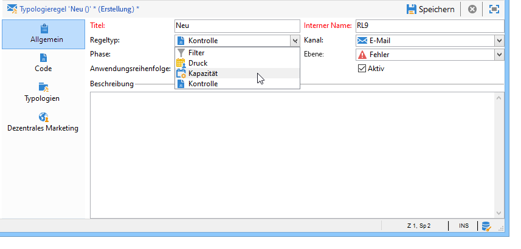

1. Erstellen Sie auf **[!UICONTROL Registerkarte]** Kapazität“ die Verfügbarkeitszeilen: In unserem Beispiel handelt es sich um Zeiträume, in denen Anrufe getätigt werden können. Wählen Sie einen Zeitraum von 24 Stunden aus und geben Sie 150 in die Anfangsmenge ein, was bedeutet, dass das Callcenter 150 Anrufe pro Tag verarbeiten kann.

   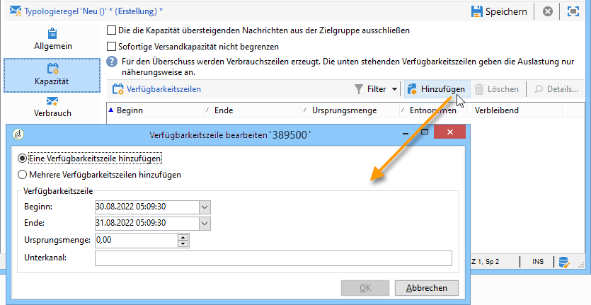

   >[!NOTE]
   >
   >Die Verfügbarkeitszeilen dienen nur als Richtwerte. Sie können bei Bedarf jedoch auch festlegen, dass bei Erreichen der Kapazitätsbegrenzung Nachrichten ausgeschlossen werden. Näheres hierzu finden Sie in [diesem Abschnitt](#exclude-messages-when-capacity-limit-reached).

1. Weisen Sie diese Regel einer Typologie zu und referenzieren Sie die Typologie in Ihrer Sendung, damit die Kapazitätsregel von dieser angewendet wird. Weiterführende Informationen hierzu finden Sie in [diesem Abschnitt](apply-rules.md#apply-a-typology-to-a-delivery).
1. Über die Tabs **[!UICONTROL Entnahmen]** und **[!UICONTROL Kapazität]** für diese Regel können Sie die Auslastung der Kapazitäten überwachen.

   Wenn eine Regel in einem Versand verwendet wird, zeigen die Spalten **[!UICONTROL Entnommen]** und **[!UICONTROL Verbleibend]** die verbrauchte Menge an, wie im unten stehenden Beispiel:

   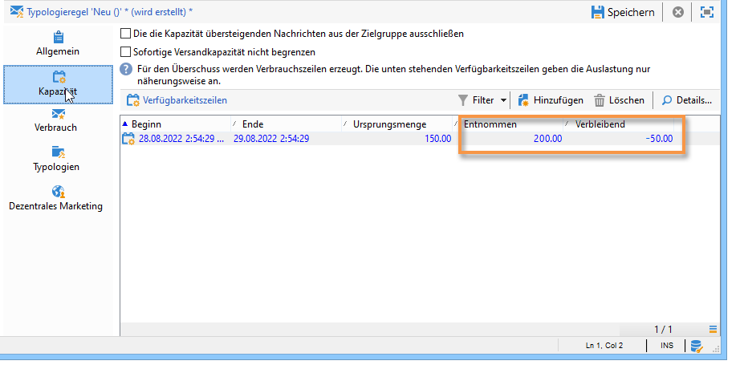

   Weiterführende Informationen hierzu finden Sie in [diesem Abschnitt](#monitor-consumption).

## Festlegen der maximalen Auslastung {#define-the-maximum-load}

Um die maximale Auslastung zu definieren, müssen Sie Verfügbarkeitszeilen festlegen. Dazu stehen zwei Optionen zur Verfügung: Sie können manuell [eine oder mehrere Verfügbarkeitszeilen erstellen](#add-availability-lines-one-by-one) oder ganze Verfügbarkeitsbereiche erstellen. Die Häufigkeit dieser Zeiträume kann automatisiert werden. [Weitere Informationen](#add-a-set-of-availability-lines).

### Verfügbarkeitszeilen einzeln hinzufügen {#add-availability-lines-one-by-one}

Um eine Verfügbarkeitszeile zu erstellen, klicken Sie auf die Schaltfläche **[!UICONTROL Hinzufügen]** und wählen Sie **[!UICONTROL Verfügbarkeitszeile hinzufügen]** aus. Geben Sie den Verfügbarkeitszeitraum und die verfügbare Last ein.

Sie können die Ihrer Verarbeitungskapazität entsprechende Anzahl an Zeilen hinzufügen.

### Mehrere Verfügbarkeitszeilen hinzufügen {#add-a-set-of-availability-lines}

Um Verfügbarkeitszeiträume für einen bestimmten Zeitraum festzulegen, klicken Sie auf die Schaltfläche **[!UICONTROL Hinzufügen]** und wählen Sie die Option **[!UICONTROL Mehrere Verfügbarkeitszeilen hinzufügen]** aus. Geben Sie eine Dauer für jeden Zeitraum und die Anzahl der zu erstellenden Zeiträume an.

Um die Zeitraumerstellung zu automatisieren, klicken Sie auf die Schaltfläche **[!UICONTROL Ändern]** und legen Sie die Planung der Zeiträume fest.

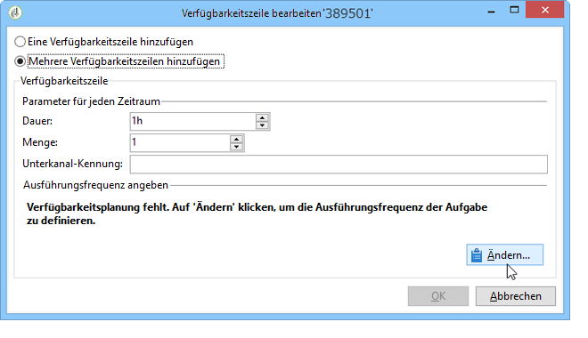

Definieren wir beispielsweise einen Zeitplan, um Verfügbarkeitszeiträume für alle Arbeitstage mit einer Rate von 10 Aufrufen pro Stunde zwischen 9 Uhr und 17 Uhr zu erstellen. Gehen Sie hierzu wie folgt vor:

1. Wählen Sie den Häufigkeitstyp und die Gültigkeitszeiträume aus:

   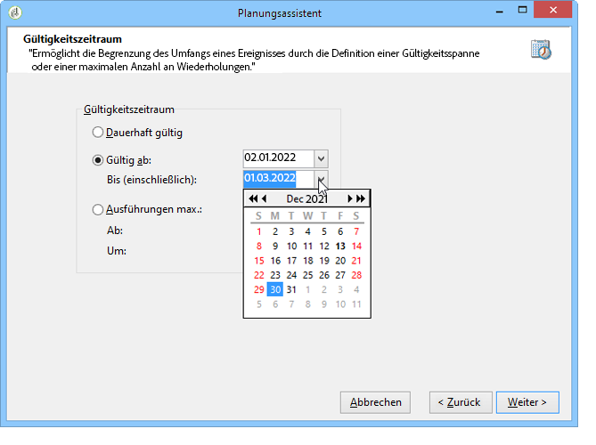

1. Geben Sie die Gültigkeitsdaten an:

   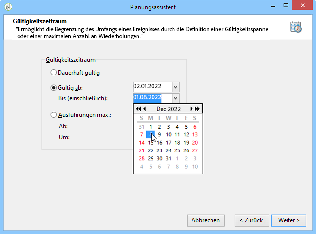

1. Überprüfen Sie die Konfiguration, bevor Sie sie beenden:

   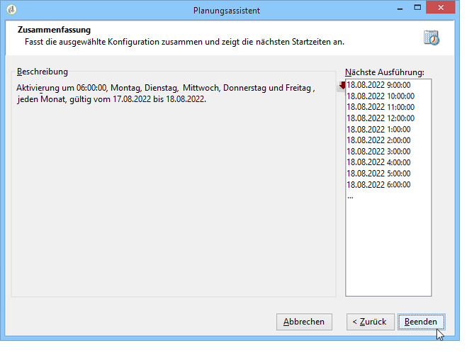

Der Workflow **[!UICONTROL Planungen]** erstellt automatisch alle entsprechenden Zeilen.

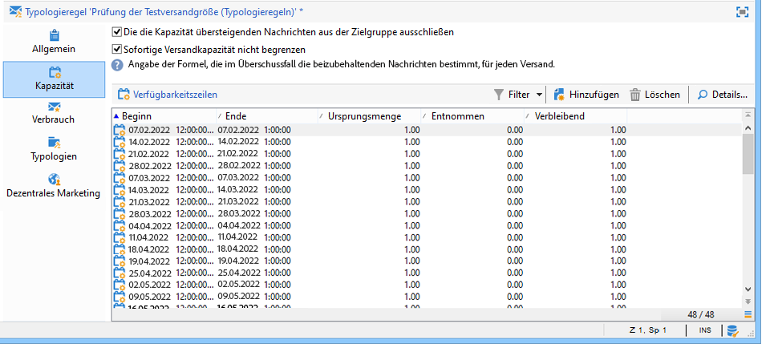

>[!NOTE]
>
>Wir empfehlen, Verfügbarkeitszeilen über Dateiimporte zu erstellen. Auf dieser Registerkarte können Sie Verbrauchszeilen anzeigen und überprüfen.

## Nachrichten bei Erreichen des Kapazitätslimits ausschließen {#exclude-messages-when-capacity-limit-reached}

Die Verfügbarkeitszeilen dienen nur als Richtwerte. Um überschüssige Nachrichten auszuschließen, aktivieren Sie die Option **[!UICONTROL Die die Kapazität übersteigenden Nachrichten aus der Zielgruppe ausschließen]**. Die Kapazität kann so nicht überschritten werden. Für dieselbe Population wie im vorherigen Beispiel dürfen Verbrauch und verbleibende Kapazität die ursprüngliche Menge nicht übersteigen:

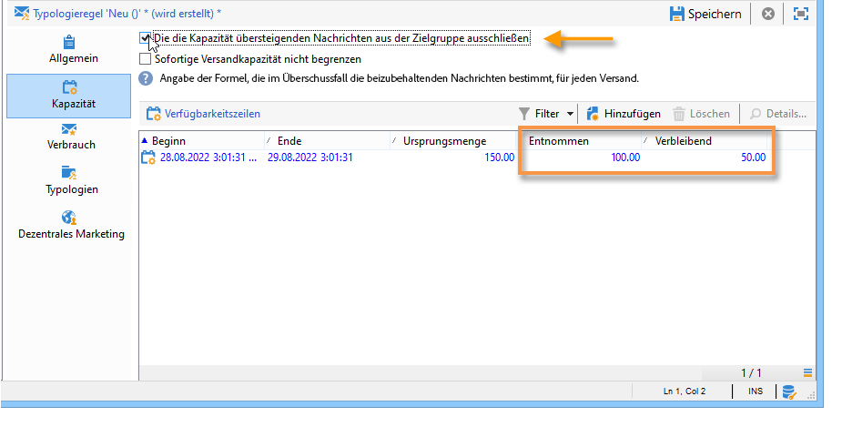

Die maximale Anzahl von Nachrichten, die verarbeitet werden können, ist gleichmäßig über den definierten Verfügbarkeitsbereich verteilt. Dies ist besonders für Callcenter von Bedeutung, da die Anzahl der Anrufe pro Tag begrenzt ist. Im Fall von E-Mail-Sendungen können Sie mit der Option **[!UICONTROL Sofortige Versandkapazität nicht begrenzen]** diesen Verfügbarkeitsbereich ignorieren und gleichzeitig Ihre E-Mails senden.

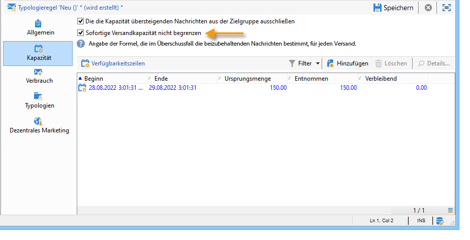

>[!NOTE]
>
>Bei Überlastung werden die beizubehaltenden Nachrichten nach einer in den Versandeigenschaften bestimmten Formel ausgewählt.

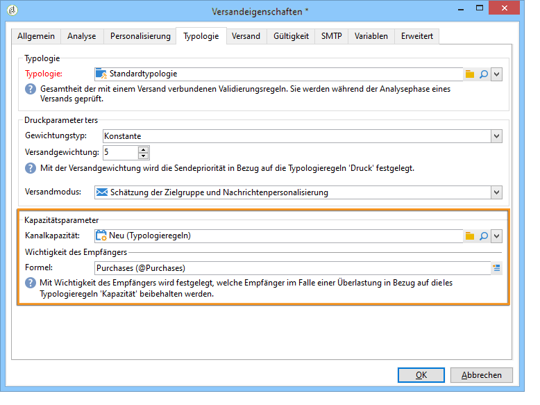

## Überwachen des Verbrauchs {#monitoring-consumption}

Kapazitätsregeln dienen standardmäßig lediglich Informationszwecken. Wählen Sie die Option **[!UICONTROL Die die Kapazität übersteigenden Nachrichten aus der Zielgruppe ausschließen]**, damit die festgelegte Menge nicht überschritten werden kann. Überschüssige Nachrichten werden dann automatisch von Sendungen ausgeschlossen, die diese Typologieregel anwenden.

Im Tab **[!UICONTROL Kapazität]** der Typologieregel haben Sie die Möglichkeit, in der **[!UICONTROL Verbraucht]**-Spalte die Inanspruchnahme der vorhandenen Ressourcen zu verfolgen.

Klicken Sie zur Ansicht der Verbrauchszeilen auf den Tab **[!UICONTROL Verbrauch]** der Regel.
