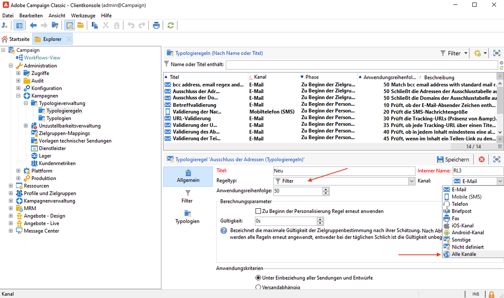
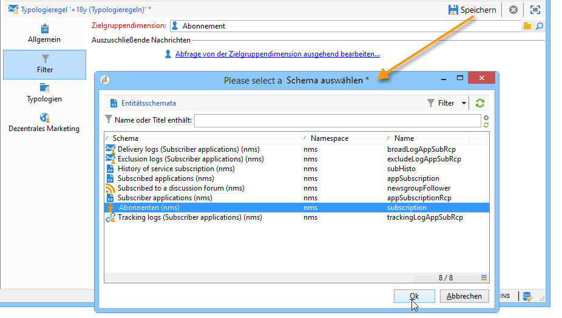
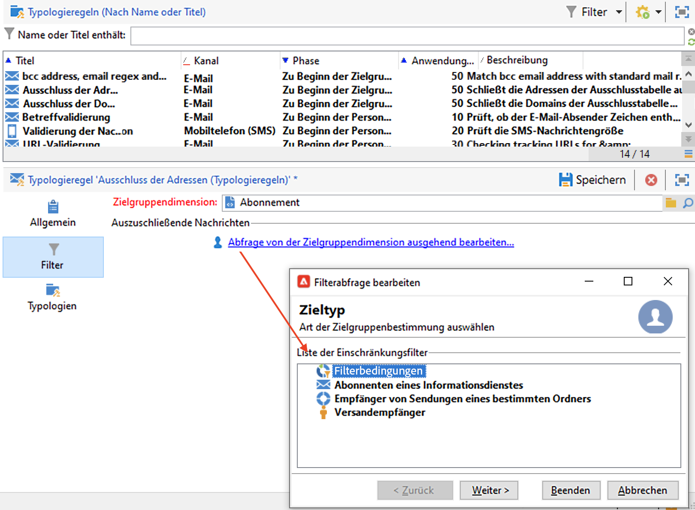
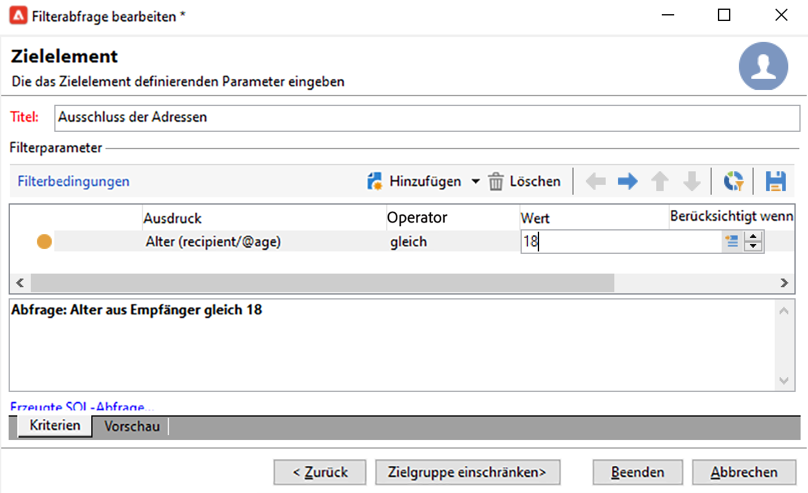
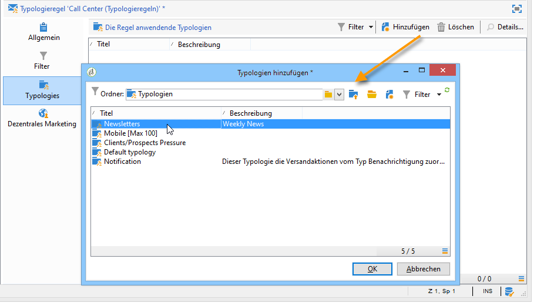
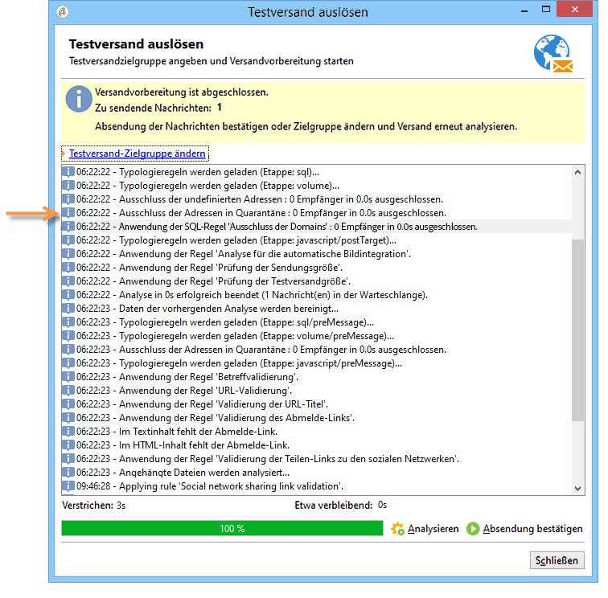
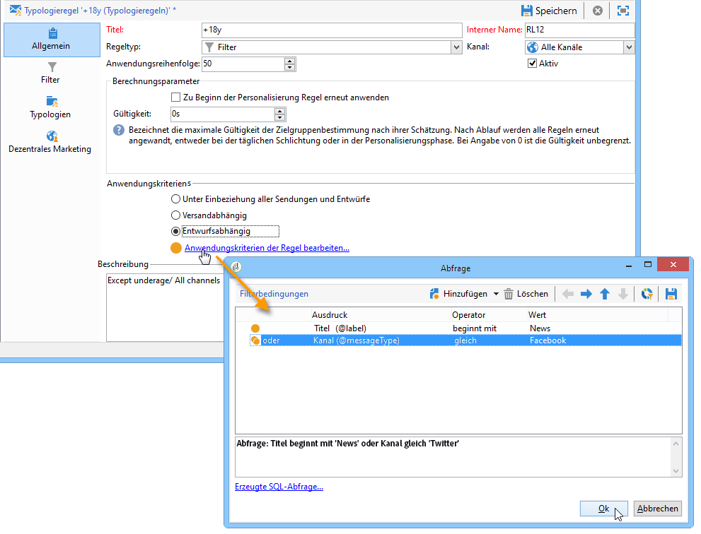
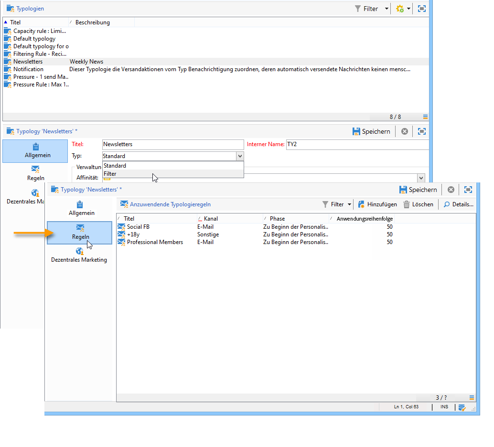
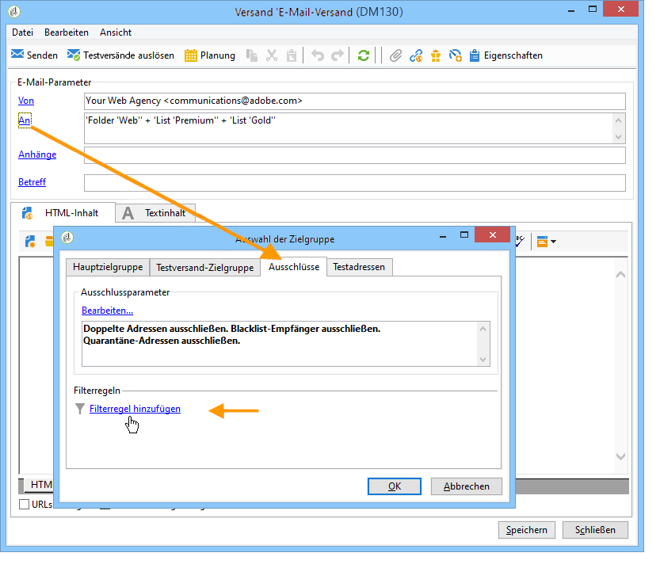
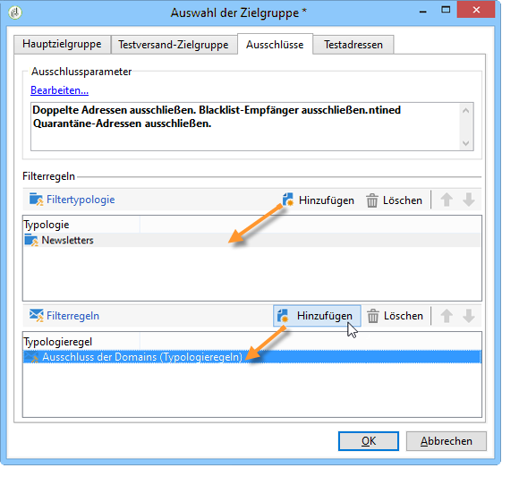

# Filterregeln{#filtering-rules}

Verwenden Sie Filterregeln, um auszuschließende Nachrichten anhand von in einer Abfrage definierten Kriterien auszuwählen. Diese Regeln sind mit einer Zielgruppendimension verknüpft.

Filterregeln können mit anderen Regeltypen (Kontrolle, Druck usw.) verknüpft werden in Typologien oder in einer eigenen Typologie **Filterung** zusammengefasst. [Weitere Informationen](#create-and-use-a-filtering-typology).

## Erstellen einer Filterregel {#create-a-filtering-rule}

Sie können beispielsweise die Abonnenten Ihrer Newsletter filtern, um keine Nachrichten an minderjährige Empfänger zu senden.

Gehen Sie wie folgt vor:

1. Navigieren Sie zum Ordner **[!UICONTROL Administration > Kampagnenverwaltung > Typologieverwaltung > Typologieregeln]** des Campaign-Explorers und klicken Sie auf das Symbol **Neu**, um eine Typologieregel zu erstellen.
1. Erstellen Sie eine Typologieregel **[!UICONTROL Filterung]**, die für alle Kanäle gilt.

   

1. Ändern Sie auf der **Filter**-Registerkarte die Standard-Zieldimension auf **Abonnements** (**nms:subscription**).

   

1. Erstellen Sie den Filter über den Link **[!UICONTROL Abfrage von der Zielgruppendimension ausgehend bearbeiten]**.

   

1. Filtern Sie nach Alter der Empfänger und speichern Sie die Filterbedingung.

   

1. Verknüpfen Sie auf der Registerkarte **Typologien** diese Regel mit einer Kampagnentypologie und speichern Sie sie.

   

Wenn diese Regel in einem Versand verwendet wird, werden minderjährige Abonnenten automatisch ausgeschlossen. Eine spezifische Nachricht gibt an, wann die Regel angewendet wird:

## Erstellen von Bedingungen für eine Filterregel {#condition-a-filtering-rule}

Die Anwendungskriterien einer Filterregel können dem verknüpften Versand oder Versandentwurf entsprechend eingeschränkt werden.

Gehen Sie dazu auf die Registerkarte **[!UICONTROL Allgemein]** der Typologieregel, wählen Sie die Art der anzuwendenden Beschränkung und erstellen Sie den Filter.
<!--

-->

In diesem Fall wird die Regel nur auf die Sendungen angewandt, die den Kriterien des Filters entsprechen, auch wenn die Regel mit allen Sendungen verbunden ist.

>[!NOTE]
>
>Typologien und Filterregeln können in einem Workflow über die Aktivität **[!UICONTROL Versandentwurf]** verwendet werden. [Weitere Informationen](../workflow/delivery-outline.md).

## Erstellen und Verwenden einer Filtertypologie {#create-and-use-a-filtering-typology}

Sie haben die Möglichkeit, Typologien zu erstellen, die nur Filterregeln enthalten.**&#x200B;**

Diese **[!UICONTROL Filtertypologien]** können bei der Zielgruppenbestimmung einem Versand zugeordnet werden: Klicken Sie im Versandassistent auf den Link **[!UICONTROL An]**, dann auf den Tab .

Wählen Sie dann die Filtertypologie aus, die auf den Versand angewendet werden soll. Klicken Sie dazu auf die Schaltfläche **[!UICONTROL Hinzufügen]** und wählen Sie die Typologien aus, die angewendet werden sollen.

Sie können Filterregeln auch direkt über diese Registerkarte verknüpfen, ohne sie in einer Typologie zu gruppieren. Verwenden Sie dazu den unteren Bereich des Fensters.

>[!NOTE]
>
>In diesem Auswahlfenster sind nur Filtertypologien und -regeln verfügbar.
>
>Diese Konfigurationen können in Versandvorlagen vorgenommen werden, um sie automatisch bei jedem mithilfe dieser Vorlagen erstellten Versand anzuwenden.
>

## Standardmäßige Ausschlussregeln für Zustellbarkeit {#default-deliverability-exclusion-rules}

Standardmäßig sind zwei Filterregeln verfügbar: **[!UICONTROL Adressen ausschließen]** ( **[!UICONTROL addressExclusions]** ) und **[!UICONTROL Domains ausschließen]** ( **[!UICONTROL domainExclusions]** ). Während der E-Mail-Analyse vergleichen diese Regeln die E-Mail-Adressen der Empfänger mit den unzulässigen Adressen oder Domain-Namen aus einer verschlüsselten globalen Unterdrückungsliste, die in der Zustellbarkeitsinstanz verwaltet wird. Im Falle einer Übereinstimmung wird die Nachricht nicht an den jeweiligen Empfänger gesendet.

Auf diese Weise soll das Hinzufügen zur Blockierungsliste aufgrund von schädlichen Aktivitäten, insbesondere durch die Verwendung von Spamtraps, vermieden werden. Wenn beispielsweise für die Anmeldung über ein Web-Formular eine Spamtrap verwendet wird, wird automatisch eine Bestätigungs-E-Mail an diese Spamtrap gesendet. Als Folge davon wird Ihre Adresse automatisch auf die Blockierungsliste gesetzt.

>[!NOTE]
>
>Die Adressen und Domain-Namen in der globalen Unterdrückungsliste sind verborgen. In den Versandanalyse-Logs wird nur die Anzahl der ausgeschlossen Empfänger angegeben.
