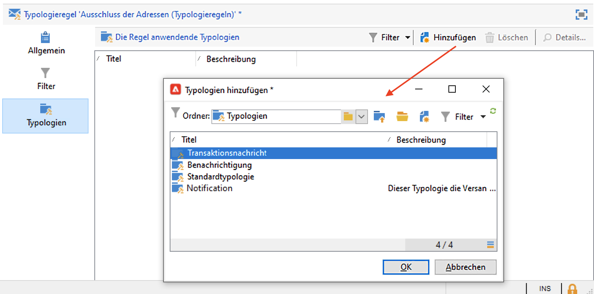

# Filterregeln{#filtering-rules}

Filterregeln ermöglichen es, auszuschließende Nachrichten nach in einer Abfrage definierten Kriterien zu bestimmen. Diese Regeln werden mit einer Zielgruppendimension verknüpft.

Filterregeln können mit anderen Regeltypen (Kontrolle, Druck usw.) in Typologien kombiniert oder in einer spezifischen **Filtertypologie** zusammengefasst werden. [Weitere Informationen](#create-and-use-a-filtering-typology).

## Erstellen einer Filterregel {#create-a-filtering-rule}

Sie können beispielsweise die Abonnenten Ihrer Newsletter filtern, um keine Nachrichten an minderjährige Empfänger zu senden.

Gehen Sie wie folgt vor:

1. Erstellen Sie eine Typologieregel vom Typ **[!UICONTROL Filter]**, die sich auf alle Kommunikationskanäle anwenden lässt.

   

1. Verändern Sie die Standard-Zielgruppenbestimmung und wählen Sie die Abonnements aus (**nms:subscription**).

   

1. Erstellen Sie den Filter über den Link **[!UICONTROL Abfrage von der Zieldimension ausgehend bearbeiten]**.

   

1. Verbinden Sie die Regel mit einer Kampagnentypologie und speichern Sie sie.

   

Bei Anwendung dieser Regel in einem Versand werden minderjährige Abonnenten automatisch ausgeschlossen. Eine spezifische Nachricht gibt die Anwendung der Regel an:

## Erstellen von Bedingungen für eine Filterregel {#condition-a-filtering-rule}

Die Anwendungskriterien einer Filterregel können dem Versand oder dem verknüpften Versandentwurf entsprechend eingeschränkt werden.

Gehen Sie hierzu in den Tab **[!UICONTROL Allgemein]** der Typologieregel, wählen Sie das Anwendungskriterium aus und erstellen Sie den Filter wie nachfolgend dargestellt:

In diesem Fall wird die Regel nur auf die Sendungen angewandt, die den Kriterien des Filters entsprechen, auch wenn die Regel mit allen Sendungen verbunden ist.

>[!NOTE]
>
>Typologien und Filterregeln können in einem Workflow über die Aktivität **[!UICONTROL Versandentwurf]** verwendet werden. [Weitere Informationen](../workflow/delivery-outline.md).

## Erstellen und Verwenden einer Filtertypologie {#create-and-use-a-filtering-typology}

Sie haben die Möglichkeit, Typologien zu erstellen, die nur Filterregeln enthalten.****

Diese **[!UICONTROL Filtertypologien]** können bei der Zielgruppenbestimmung einem Versand zugeordnet werden: Klicken Sie im Versandassistent auf den Link **[!UICONTROL An]**, dann auf den Tab .

Wählen Sie anschließend die beim Versand anzuwendende(n) Filtertypologie(n). Klicken Sie hierzu auf die Schaltfläche **[!UICONTROL Hinzufügen]** und wählen Sie die jeweilige Typologie aus.

Im unteren Bereich des gleichen Tabs können Sie zudem einzelne Filterregeln hinzufügen, die nicht in einer Typologie zusammengefasst sind.

>[!NOTE]
>
>In diesem Auswahlfenster sind nur Filtertypologien und -regeln verfügbar.
>
>Diese Konfigurationen können in Versandvorlagen vorgenommen werden, um sie automatisch bei jedem mithilfe dieser Vorlagen erstellten Versand anzuwenden.

## Standardmäßige Ausschlussregeln für Zustellbarkeit     {#default-deliverability-exclusion-rules}

Standardmäßig sind zwei Filterregeln verfügbar: **[!UICONTROL Ausschluss der Adressen]** (**[!UICONTROL addressExclusions]**) und **[!UICONTROL Ausschluss der Domains]** (**[!UICONTROL domainExclusions]**). Während der E-Mail-Analyse werden die E-Mail-Adressen der Empfänger anhand dieser Regeln mit den verbotenen Adressen oder Domain-Namen in einer verschlüsselten globalen in der Versandinstanz verwalteten Unterdrückungsliste verglichen. Wenn es eine Übereinstimmung gibt, wird die Nachricht nicht an den entsprechenden Empfänger gesendet.

Auf diese Weise soll das Hinzufügen zur Blockierungsliste aufgrund von schädlichen Aktivitäten, insbesondere durch die Verwendung von Spamtraps, vermieden werden. Wenn beispielsweise für die Anmeldung über ein Web-Formular eine Spamtrap verwendet wird, wird automatisch eine Bestätigungs-E-Mail an diese Spamtrap gesendet. Als Folge davon wird Ihre Adresse automatisch auf die Blockierungsliste gesetzt.

>[!NOTE]
>
>Die Adressen und Domain-Namen in der globalen Unterdrückungsliste sind verborgen. In den Versandanalyse-Logs wird nur die Anzahl der ausgeschlossen Empfänger angegeben.
