# Druckregeln{#pressure-rules}

Durch die Implementierung des Vertriebsdruck-Managements können Sie vermeiden, die Population in der Datenbank zu häufig anzufordern, was auch als Marketing-Müdigkeit bezeichnet wird. Zu diesem Zweck können Sie eine maximale Anzahl von Nachrichten pro Empfänger definieren. Außerdem können Sie zwischen Kampagnen Schlichtungsregeln implementieren, um die beste Nachricht an die ausgewählte Audience zu senden.

**Druckregeln** können beispielsweise dazu beitragen, der Marketing-Ermüdung entgegenzusteuern, indem die Zahl der an eine Zielpopulation versendeten Newsletter auf zwei begrenzt wird; unter den zur Auswahl stehenden Nachrichten diejenigen ausgewählt werden, die den Interessen der Abonnentengruppe bestmöglich entsprechen; keine Angebote per SMS an einen unzufriedenen Kunden gesendet werden etc.

Die Kampagnen werden entsprechend der festgelegten Schwellen und des jeweiligen Gewichts jeder Nachricht ausgewählt.

* Ein Schwellenwert ist die höchste Anzahl von Sendungen, die für eine bestimmte Empfängerin oder einen bestimmten Empfänger innerhalb eines bestimmten Zeitraums autorisiert wurde. Sie kann entweder festgelegt oder variabel sein. Sie wird in den Einstellungen der Typologieregel festgelegt oder berechnet. [Weitere Informationen](#maximum-number-of-messages).
* Die Versandgewichtung ermöglicht die Identifizierung von Sendungen mit der höchsten Priorität im Rahmen der Druckverwaltung. Nachrichten mit der höchsten Gewichtung haben Priorität. [Weitere Informationen](#message-weight).

Die Schlichtung besteht darin, sicherzustellen, dass geplante Kampagnen mit einer höheren Gewichtung als laufende Kampagnen kein übermäßiges Werben eines Profils auslösen: Ist dies der Fall, wird das Profil von der Versandaktion ausgeschlossen.

Die Schlichtungskriterien (Nachrichtengewichtung und/oder Schwelle der Nachrichtenanzahl) können nach zwei Informationstypen variieren:

* den Präferenzen der Empfänger, die deklarativen Informationen entsprechen: Newsletter-Abonnements, Empfängerstatus (Kunde oder potenzieller Kunde);
* dem Verhalten der Empfänger: Einkäufe, besuchte Links usw.

Die Schlichtungsregel zur Bestimmung der geeigneten Nachrichten wird in der Analyseetappe angewandt. Die Nachricht wird für jede Empfängerin und jeden Empfänger und den betroffenen Zeitraum versandt, wenn folgende Formel wahr ist: **(Anzahl gesendeter Nachrichten) + (Anzahl der Nachrichten mit einer größeren Gewichtung) &lt; Schwelle**

Andernfalls ist die Empfängerin bzw. der Empfänger **[!UICONTROL Ausgeschlossen nach Schlichtung]**. [Weitere Informationen](#exclusion-after-arbitration).

## Erstellen einer Druckregel {#create-a-pressure-rule}

Um eine Schlichtung zwischen Adobe Campaign-Kampagnen einzurichten, müssen zunächst Kampagnentypologien erstellt und die damit verbundenen Typologieregeln definiert werden.**&#x200B;**

>[!NOTE]
>
>Damit eine Druckregel korrekt angewendet werden kann, muss die Zielgruppendimension der Regel mit der Zielgruppendimension des Versand-Mappings übereinstimmen.

Um eine Typologieregel vom Typ **[!UICONTROL Druck]** zu erstellen und zu konfigurieren, durchlaufen Sie folgende Etappen:

1. Klicken Sie in der Liste der Kampagnentypologieregeln auf das Symbol **[!UICONTROL Neu]** oberhalb der Liste.

   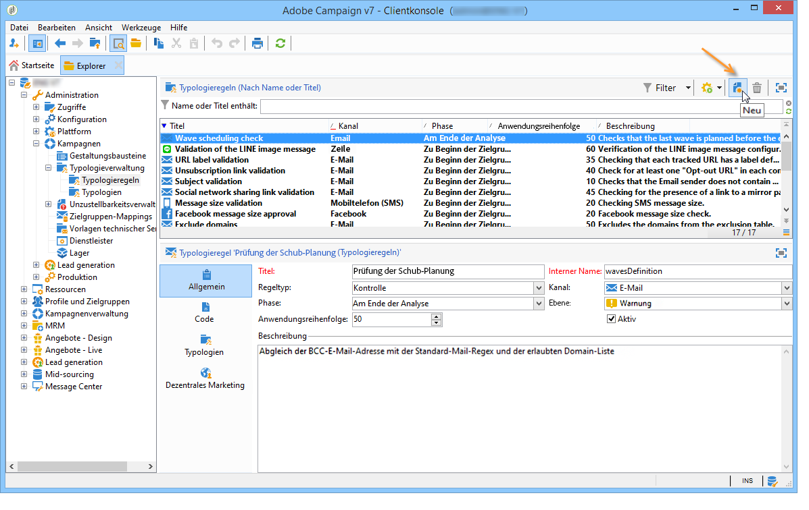

1. Wählen Sie auf der Registerkarte **[!UICONTROL Allgemein]** der neuen Regel den Regeltyp **Druck** aus und geben Sie einen Namen sowie eine Beschreibung ein.

   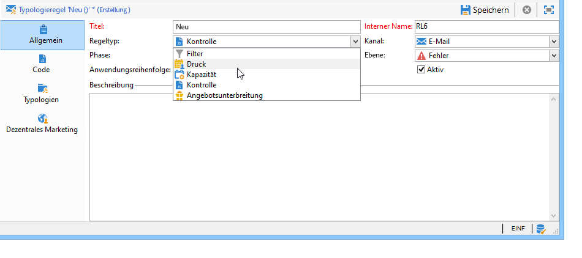

1. Sie können die Ausführungsreihenfolge nach Bedarf ändern. Wenn mehrere Typologieregeln in Form eines Sets von **[!UICONTROL Typologien]** angewendet werden, werden die Regeln mit der niedrigeren Reihenfolge zuerst angewendet. [Weitere Informationen](apply-rules.md#execution-order).
1. Definieren Sie im Bereich **[!UICONTROL Berechnungsparameter]** eine Frequenz, wenn Sie die Zielgruppenbestimmung über die nächste tägliche Neuschlichtung hinaus speichern möchten. [Weitere Informationen](apply-rules.md#adjust-calculation-frequency).
1. Gehen Sie in den Tab **[!UICONTROL Druck]** und wählen Sie den Zeitraum im Kalender aus, während dessen die Regel angewandt werden soll.

   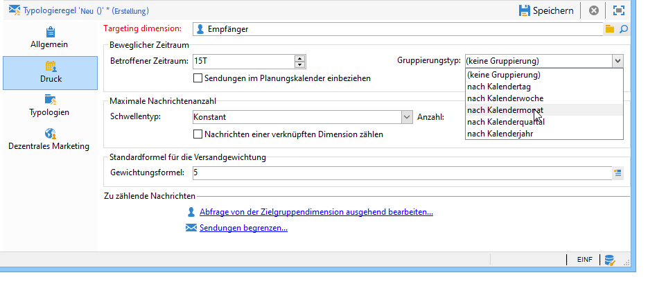

   Die Regel wird auf Sendungen angewandt, deren Kontaktdatum im betroffenen Zeitraum liegt.

   >[!NOTE]
   >
   >Im Kontext einer [Enterprise-Bereitstellung (FFDA)](../../v8/architecture/enterprise-deployment.md) von Campaign werden geplante Sendungen nicht berücksichtigt.

1. Geben Sie den Berechnungsmodus der maximalen Nachrichtenanzahl an.

   Die Schwelle stellt die maximale Anzahl der Nachrichten dar, die an einen Empfänger im betreffenden Zeitraum geschickt werden können.

   Die Schwelle ist standardmäßig konstant. Die von der Regel erlaubte maximale Nachrichtenanzahl muss festgelegt werden.

   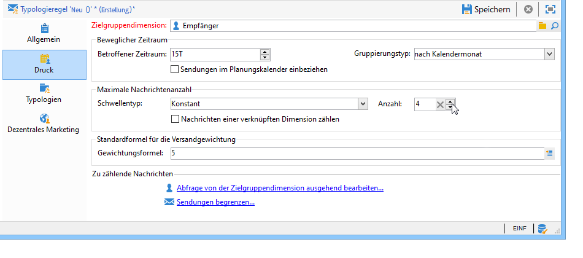

   Um eine variable Schwelle anzugeben, wählen Sie den Wert **[!UICONTROL Empfängerabhängig]** im Feld **[!UICONTROL Schwellentyp]** und öffnen Sie den Ausdruckseditor über das rechts vom Feld gelegene Symbol.

   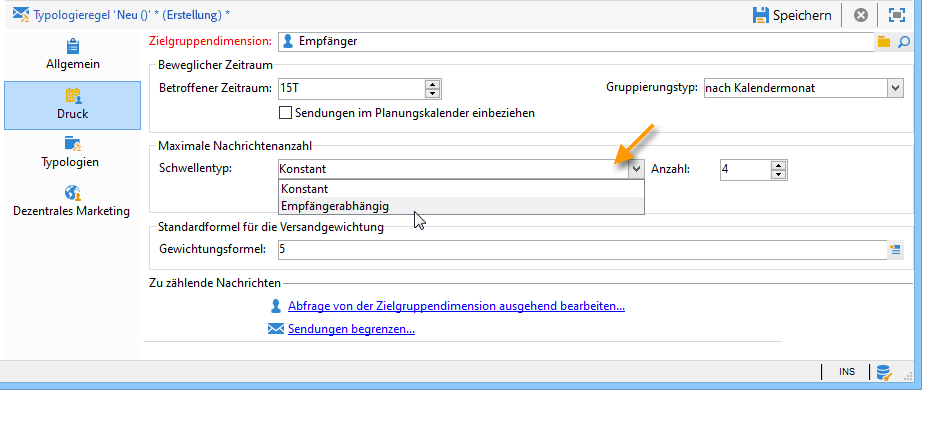

   Weitere Informationen hierzu finden Sie unter [Maximale Nachrichtenanzahl](#maximum-number-of-messages).

1. Geben Sie den Berechnungsmodus der Versandgewichtung an.

   Jeder Versand verfügt über eine Gewichtung, d. h. einen Wert, der die Prioritätsstufe angibt. Dies ermöglicht eine Schlichtung zwischen Kampagnen. Die Gewichtung wird anhand der Formel berechnet, die in der Typologieregel und/oder in ihren Eigenschaften definiert ist. [Weitere Informationen](#message-weight).

1. Standardmäßig werden bei der Schwellenberechnung alle Nachrichten berücksichtigt. Auf der Registerkarte **[!UICONTROL Einschränkung]** können Sie die von der Typologieregel betroffenen Nachrichten filtern:

   * Im oberen Bereich können die betroffenen Empfänger begrenzt werden.
   * Im unteren Bereich dieses Tabs können die zu zählenden Nachrichten gefiltert werden.

     Im folgenden Beispiel werden nur die im Ordner **NewContacts** gespeicherten Empfänger berücksichtigt und nur Sendungen, die mit **Newsletter** beginnen, sind betroffen.

   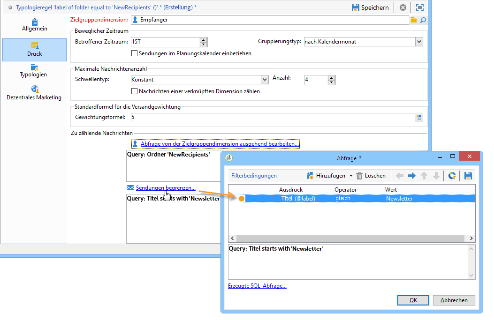

1. In der Registerkarte **[!UICONTROL Typologien]** können die Kampagnentypologien eingesehen werden, die diese Typologieregel anwenden. Zudem kann die Regel an dieser Stelle mit einer oder mehreren existierenden Typologien verknüpft werden. [Weitere Informationen](campaign-typologies.md#apply-typologies).

## Definieren von Schwellenwerten und Gewichtungen {#define-thresholds-and-weights}

### Maximale Nachrichtenanzahl {#maximum-number-of-messages}

Jede Druckregel definiert einen Schwellenwert, d. h. die maximale Anzahl von Nachrichten, die über einen bestimmten Zeitraum an einen Empfänger gesendet werden können. Sobald diese Schwelle erreicht ist, können keine Sendungen mehr durchgeführt werden, bis der Zeitraum abgelaufen ist. Auf diese Weise können Sie einen Empfänger automatisch vom Versand ausschließen, wenn eine Nachricht den festgelegten Schwellenwert überschreitet, um eine Überforderung zu vermeiden.

Schwellenwerte können entweder konstant sein oder durch eine Formel mit Variablen berechnet werden. Dies bedeutet, dass Schwellenwerte für einen bestimmten Zeitraum von einem Empfänger zum anderen oder sogar für denselben Empfänger variieren können.

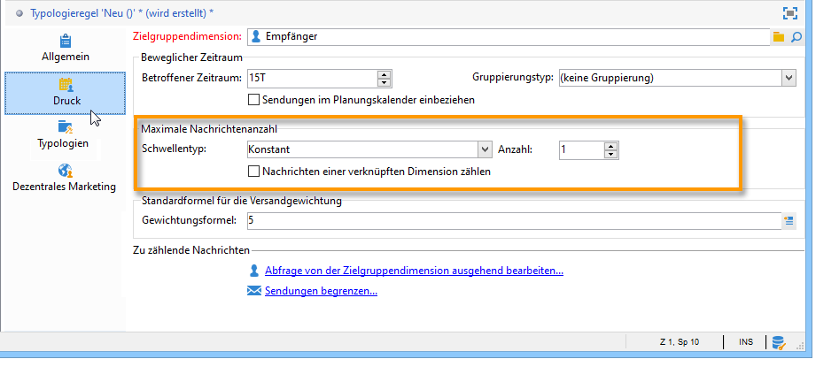

>[!CAUTION]
>
>Eine Schwelle von **0** verhindert jeglichen Versand an die Zielpopulation während des betroffenen Zeitraums.

**Beispiel:**

Sie können die Anzahl der autorisierten Nachrichten nach dem Segment indizieren, zu dem der Empfänger gehört. Das bedeutet, dass ein Empfänger, der zum Web-Segment gehört, möglicherweise mehr Nachrichten erhält als andere Empfänger. Mit einer Formel vom Typ **[!UICONTROL Iif (@origin=&#39;Web&#39;, 5, 3)]** wäre etwa der Versand von 5 Nachrichten an diese Empfangenden zulässig, für die Empfangende aus anderen Segmenten dagegen nur 3. Die Konfiguration ist wie folgt:

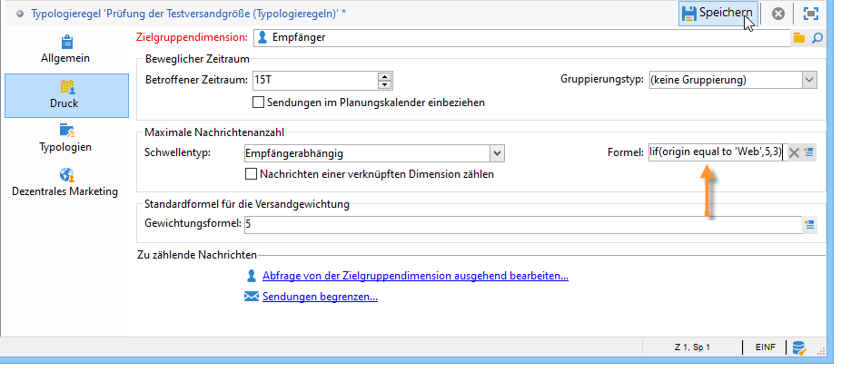

Um den Schwellenwert festzulegen, können Sie eine Dimension verwenden, die mit der Zielgruppendimension verknüpft ist: So können Sie beispielsweise Nachrichten einbeziehen, die an die in der [Besuchertabelle](../../v8/audiences/target-mappings.md) gespeicherten Empfängerprofile gesendet werden. Oder Sie können verhindern, dass mehr als eine Nachricht pro Woche an ein und denselben Haushalt (der sich auf mehrere E-Mail-Adressen beziehen kann) gesendet wird, der durch eine mit den Empfängern verknüpfte Dimension identifiziert wird.

Wählen Sie hierfür die Option **[!UICONTROL Nachrichten einer verknüpften Dimension zählen]**. Wählen Sie danach den Besucher oder die Kontakttabelle aus.

### Nachrichtengewichtung {#message-weight}

Jeder Versand verfügt über eine Gewichtung, die die jeweilige Priorität darstellt. Standardmäßig ist die Versandgewichtung auf 5 festgelegt. Mit Druckregeln können Sie die Gewichtung der Sendungen festlegen, auf die sie angewendet werden.

Die Gewichtung kann mithilfe einer Formel für Empfänger und Empfängerinnen festgelegt oder berechnet werden. Sie können beispielsweise die Versandgewichtung anhand der Empfängerinteressen definieren.

>[!CAUTION]
>
>Die in einer Regel festgelegte Gewichtung kann für jeden einzelnen Versand über den Tab **[!UICONTROL Eigenschaften]** des jeweiligen Versands überschrieben werden. Klicken Sie auf den **[!UICONTROL Typologie]**-Tab, um die Kampagnentypologie auszuwählen und bei Bedarf die anzuwendende Gewichtung anzugeben.\
>Eine in einer Typologieregel A festgelegte Gewichtung wird jedoch nicht in den Berechnungen einer Typologieregel B berücksichtigt: Die Gewichtung betrifft jeweils nur die Sendungen, die die Regel A anwenden.

**Beispiel:**

Im folgenden Beispiel möchten wir die Gewichtung von Newslettern bei Musik mit der Tendenzauswertung der Empfänger verknüpfen. Gehen Sie dazu wie folgt vor:

1. Erstellen Sie ein neues Feld, um die für die Neigung der Empfangenden ermittelten Werte festzuhalten. Dieses Feld, hier **@Music**, kann mit Antworten auf Online-Erhebungen und -Umfragen, erfassten Trackingdaten etc. angereichert werden.
1. Erstellen Sie eine Typologieregel, um die Nachrichtengewichtung auf diesem Feld basierend zu berechnen.

   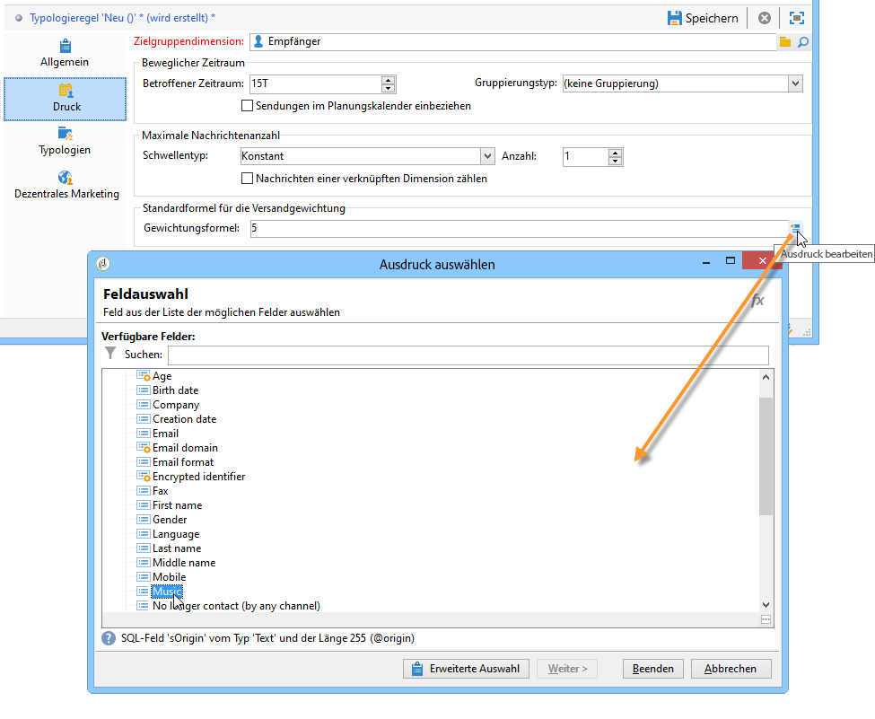

1. Wenden Sie diese Regel auf Nachrichten wie Newsletter, Sonderangebote etc. an. Die Gewichtung dieser Sendungen, also ihre Priorität, hängt folglich von den Neigungswerten des einzelnen Empfängers ab.

## Festlegen des Zeitraums {#setting-the-period}

Die Druckregeln werden für bewegliche Zeiträume von **n** Tagen bestimmt.

Der Zeitraum wird auf der Registerkarte **[!UICONTROL Druck]** der Regel konfiguriert. Sie können die Anzahl der Tage angeben und bei Bedarf den Typ der anzuwendenden Gruppierung auswählen (Tag, Woche, Monat, Quartal usw.).

Der Gruppierungstyp ermöglicht die Erweiterung des Werts im Feld **[!UICONTROL Betroffener Zeitraum]** auf den ganzen Tag, die Kalenderwoche, den Kalendermonat oder das Kalenderjahr des jeweiligen Zeitraums.

Beispielsweise verhindert eine Druckregel, die einen Schwellenwert von 2 Nachrichten pro Woche definiert, mit einer Gruppierung für jeden Kalendermonat, den Versand von mehr als 2 Nachrichten innerhalb derselben Woche UND innerhalb desselben Kalendermonats. Achtung: Wenn sich der Zeitraum mit zwei Monaten überschneidet, berücksichtigt die Berechnungsschwelle Sendungen aus diesen beiden Kalendermonaten und könnte daher alle neuen Sendungen im zweiten Monat verhindern.

>[!CAUTION]
>
>Bei der Berechnung des Schwellenwerts werden nur bereits durchgeführte Sendungen berücksichtigt.

Um die berücksichtigten Sendungen auf einen Zeitraum von 2 Wochen zu beschränken, geben Sie **15d** in das Feld **[!UICONTROL Betroffener Zeitraum]** ein. Dadurch werden Sendungen, die bis zu 15 Tage vor dem Datum des Versands gesendet wurden, auf den die Regel angewendet wird, bei der Berechnung berücksichtigt.

Das Startdatum des Zeitraums hängt von der Konfiguration der Datenbank ab.

Wenn Sie beispielsweise eine 15-Tage-Druckregel ohne Gruppierung auf einen Versand vom 12.11 anwenden, werden Sendungen zwischen dem 27.11.2012 und dem 12.12. berücksichtigt. Berücksichtigt die Druckregel die Sendungen im Planungskalender, so werden alle geplanten Sendungen zwischen 11/27 und 12/27 berücksichtigt. Wenn Sie in der Regel eine Gruppierung nach Kalendermonat konfigurieren, werden alle Sendungen im November und Dezember bei der Berechnung des Schwellenwerts berücksichtigt (vom 11.1. bis zum 31.12.).

**Häufiger Fall**

Um nur Sendungen der laufenden und keine der vorhergehenden Kalenderwoche in der Schwellenberechnung zu berücksichtigen, tragen Sie &#39;0&#39; in das Feld **[!UICONTROL Betroffener Zeitraum]** ein und wählen Sie den **[!UICONTROL Gruppierungstypen]** &#39;nach Kalenderwoche&#39;.

Wenn ein Zeitraum größer als 0 (z. B. 1) ist, kann der Berechnungsschwellenwert die Sendungen des Vortages berücksichtigen. Wenn also der vorherige Tag der vorherigen Kalenderwoche entspricht und der ausgewählte Periodentyp „Gruppierung pro Kalenderwoche“ ist, wird die gesamte vorherige Woche für die Berechnungsschwelle berücksichtigt.

**Beispiel:**

In diesem Beispiel wird eine Druckregel erstellt, die die Kundenansprache auf drei Nachrichten über einen Zeitraum von 15 Tagen hinweg begrenzt, mit einer Gruppierung nach Kalendermonat.

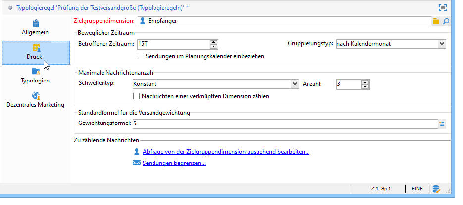

Nehmen wir an, es sind sechs Newsletter gleicher Gewichtung für die Daten 30.4., 3.5., 8.5., 12.5., 22.5. und 30.5. geplant.

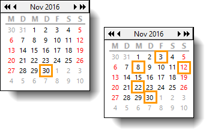

Die für den 12. und 30.5. geplanten Sendungen werden nicht verschickt: Die Sendung vom 12.5. würde die erlaubte Schwelle von drei Nachrichten in 15 Tagen überschreiten und die Sendung vom 30. würde die Schwelle der pro Monat erlaubten Nachrichten überschreiten.

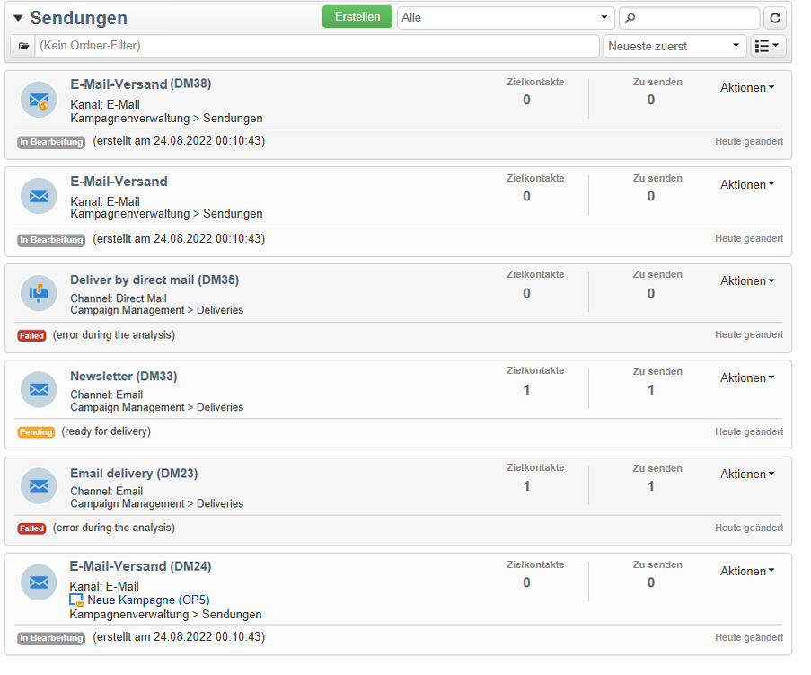

Alle Empfänger dieser Sendungen werden durch die Schlichtung während der Analysephase ausgeschlossen:

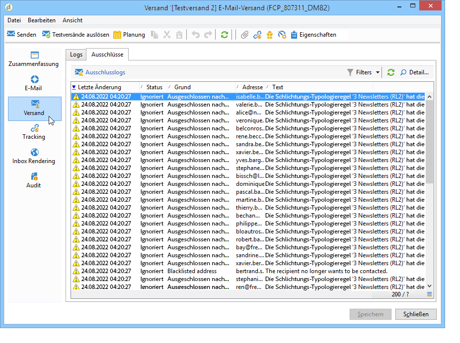

Gruppiert man für die gleiche Regel die Sendungen pro Quartal, werden die Empfänger des **5. Newsletters** ebenfalls ausgeschlossen und der Newsletter wird nicht versendet.

Wenn keine Gruppierung ausgewählt wird, wird nur der **4. Newsletter** nicht versendet, da er in den gleichen zwei Wochen geplant ist wie die ersten drei.

>[!NOTE]
>
>Bei Änderung der Definition einer Typologieregel können Sie eine **Simulation** erstellen, um ihren Einfluss auf die Sendungen, bei denen sie angewendet wird, zu kontrollieren, und die Auswirkungen der Sendungen untereinander zu überprüfen. [Weitere Informationen](campaign-simulations.md).

## Ausschließen nach Schlichtung {#exclusion-after-arbitration}

Die Schlichtung wird jede Nacht durch den technischen Workflow **[!UICONTROL Planungen]** und den Workflow **[!UICONTROL Kampagnenaufträge]** erneut durchgeführt.

Der **[!UICONTROL Prognosen]**-Workflow berechnet die Daten für den laufenden Zeitraum vorab (vom Startdatum bis zum aktuellen Datum), sodass Typologieregeln während der Analyse angewendet werden können. Außerdem werden die Ausschlusszähler für die Schlichtung jede Nacht neu berechnet.

Adobe Campaign stellt so für jeden Empfänger sicher, dass die Anzahl der zu sendenden Nachrichten die Schwelle nicht überschreitet, unter Berücksichtigung der Anzahl der bereits im betroffenen Zeitraum gesendeten Nachrichten. Diese Informationen sind nur **Indikatoren**, da die Berechnungen zum Zeitpunkt des Versands aktualisiert werden.

Bei Überschreiten der Schwelle werden die in der Kampagnentypologie bestimmten Schlichtungsregeln angewandt und die Empfänger werden durch die Schlichtung von Kampagnen mit geringerer Gewichtung ausgeschlossen.

>[!NOTE]
>
>Wenn mehrere Sendungen die gleiche Gewichtung aufweisen, wird die zeitlich nächstgelegene Kampagne geschickt.

## Anwendungsbeispiele für Druckregeln {#use-cases-on-pressure-rules}

### Anpassen des Schwellenwerts auf Basis von Kriterien {#adapt-the-threshold-based-on-criterion}

Das vorliegende Beispiel zeigt eine Typologieregel, die die Anzahl der wöchentlich gesendeten Nachrichten an Kunden auf vier und an Interessenten auf zwei begrenzt.

Zur Identifikation von Kunden und Interessenten wird das Feld **[!UICONTROL Status]** verwendet, das den Wert 0 für Interessenten und den Wert 1 für bereits bestehende Kunden enthält.

Befolgen Sie die nachstehenden Schritte, um die Regel zu konfigurieren:

1. Erstellen Sie eine neue Typologieregel vom Typ **Druck**.
1. Gehen Sie in den Tab **[!UICONTROL Druck]**, um im Abschnitt **[!UICONTROL Maximale Nachrichtenanzahl]** die Formel zur empfängerabhängigen Schwellenberechnung zu definieren. Wählen Sie daher in der Dropdown-Liste **[!UICONTROL Schwellentyp]** die Option **[!UICONTROL Empfängerabhängig]** aus und klicken Sie anschließend auf das Symbol **[!UICONTROL Ausdruck bearbeiten]**, das sich rechts vom Feld **[!UICONTROL Formel]** befindet.

   Klicken Sie auf die Schaltfläche **[!UICONTROL Erweiterte Auswahl]**, um die Formel zu erstellen.

   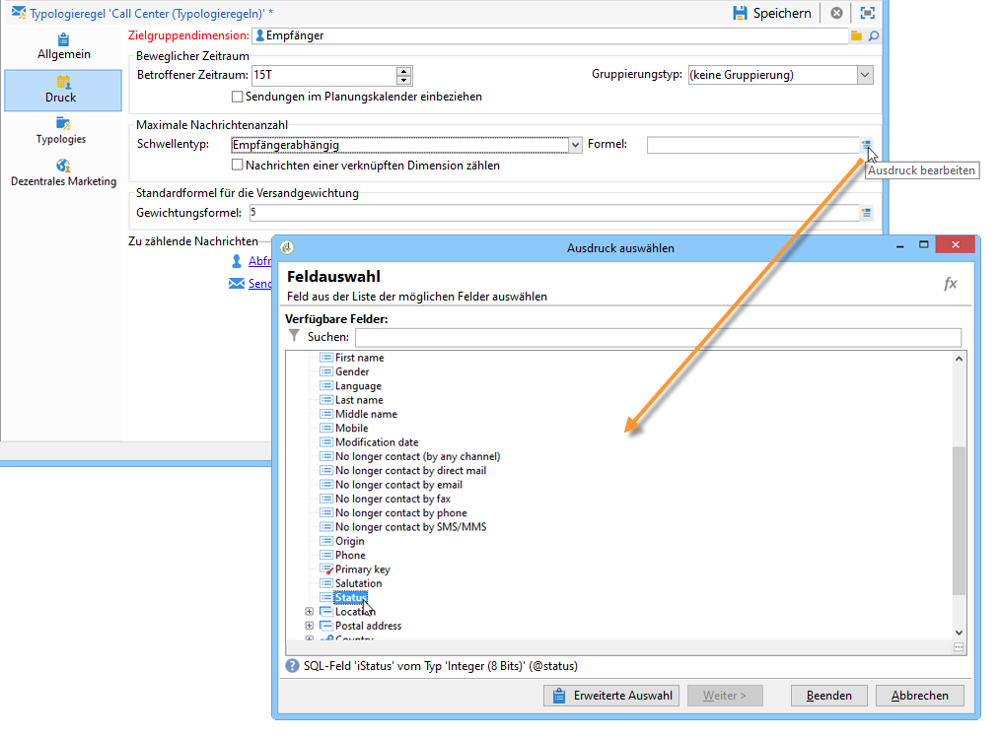

1. Wählen Sie die Option **[!UICONTROL Formel von einem Ausdruck ausgehend erstellen]** aus und klicken Sie auf **[!UICONTROL Weiter]**.

   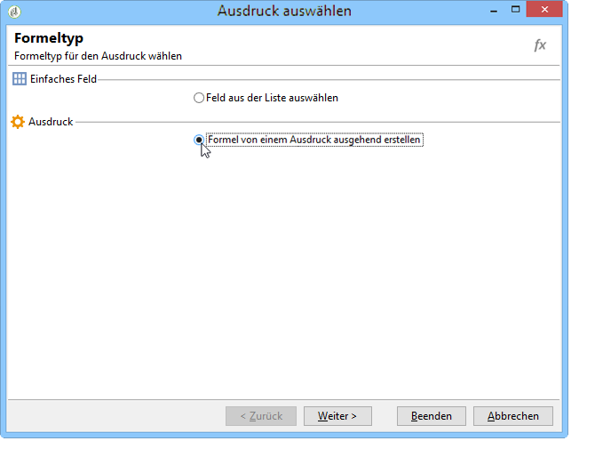

1. Wählen Sie in der Funktionsliste im Knoten **[!UICONTROL Sonstige]** mit einem Doppelklick die Funktion **Iif** aus.

   Wählen Sie anschließend den **Status** des Empfängers im Abschnitt **[!UICONTROL Verfügbare Felder]** aus.

   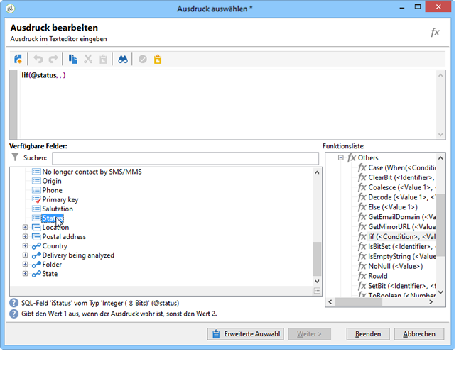

   Geben Sie die folgende Formel ein: **Iif(@status=0,2,4)**

   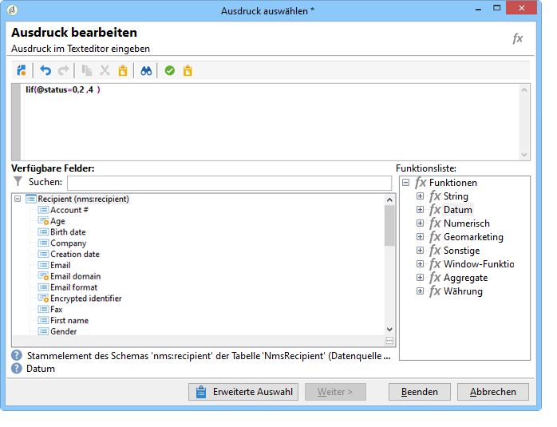

   Diese Formel ordnet einem Status gleich 0 den Wert 2 und jedem anderen Status den Wert 4 zu.

   Klicken Sie auf die Schaltfläche **[!UICONTROL Beenden]**, um die Formel zu bestätigen.

1. Geben Sie den Anwendungszeitraum der Regel an, hier 7 Tage.

   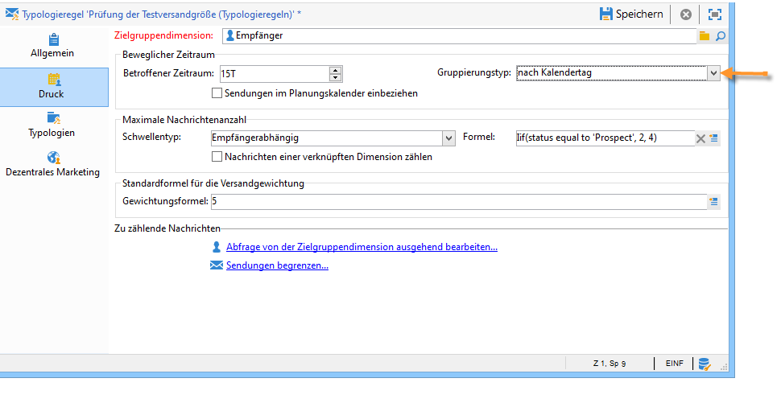

1. Speichern Sie die Regel, um ihre Erstellung zu bestätigen.

Verknüpfen Sie nun die soeben erstellte Regel mit einer Typologie, um sie auf Sendungen anzuwenden. Gehen Sie dazu wie folgt vor:

1. Erstellen Sie eine Kampagnentypologie.
1. Klicken Sie im Tab **[!UICONTROL Regeln]** auf die Schaltfläche **[!UICONTROL Hinzufügen]** und wählen Sie die zuvor erstellte Regel aus.

   

1. Speichern Sie die Typologie, um sie der Liste der bereits vorhandenen Typologien hinzuzufügen.

Um diese Typologie in Ihren Sendungen verwenden zu können, wählen Sie sie wie nachfolgend beschrieben im Tab **[!UICONTROL Typologie]** der jeweiligen Versandeigenschaften aus:

>[!NOTE]
>
>Die Typologie kann auf Ebene der Versandvorlage festgelegt werden, um sie automatisch auf alle mit der jeweiligen Vorlage erstellten Sendungen anzuwenden.

Bei der Versandanalyse werden die Versandempfänger je nach der Anzahl der ihnen bereits gesendeten Sendungen ggf. vom Versand ausgeschlossen. Um diese Informationen anzuzeigen, haben Sie folgende Möglichkeiten:

* das Ergebnis der Analyse ansehen:

  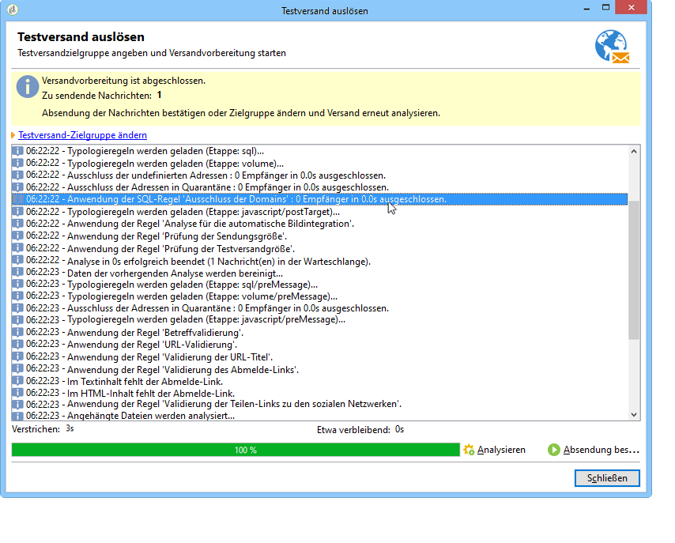

* den Versand öffnen und auf den Tab **[!UICONTROL Sendungen]** sowie den Untertab **[!UICONTROL Ausschlüsse]** klicken:

  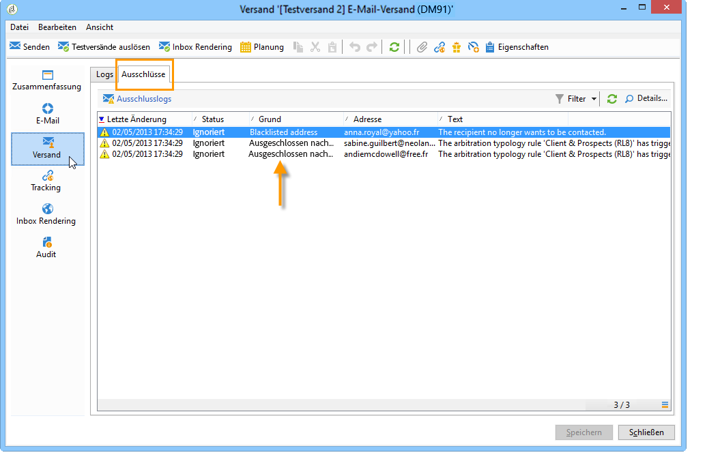

* auf den Tab **[!UICONTROL Verfolgung]** und anschließend den Untertab **[!UICONTROL Ausschlussgründe]** klicken, um die Anzahl der Ausschlüsse und die angewandten Typologieregeln anzeigen zu lassen:

  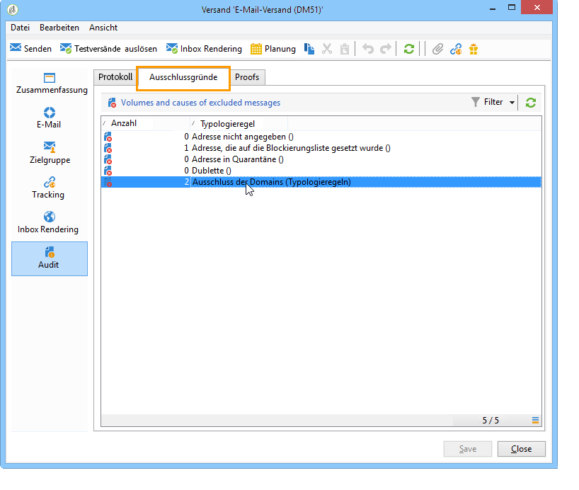

### Berechnen der Versandgewichtung basierend auf dem Empfängerverhalten {#calculate-the-delivery-weight-based-on-behavior}

Je nach Empfängerverhalten können Druckregeln definiert werden. So kann die Versandgewichtung an Kriterien angepasst werden, die von Empfänger zu Empfänger variieren. Sie können beispielsweise eine Nachricht senden, je nachdem, ob ein Empfänger Ihre Website besucht, in einem bestimmten Abschnitt des letzten Newsletters angeklickt, einen Informationsdienst abonniert hat oder ob er sogar Antworten auf eine Umfrage, ein Online-Spiel usw. erhält.

Im folgenden Beispiel möchten wir einen Versand mit der Gewichtung 5 erstellen. Diese Gewichtung wird mit Tendenz-Scores auf der Grundlage des Empfängerverhaltens angereichert: Kunden, die bereits auf dieser Website bestellt haben, erhalten einen Score von 5, während Kunden, die noch nie online bestellt haben, einen Score von 4 haben.

Um diesen Konfigurationstyp durchzuführen, müssen Sie eine Formel verwenden, um die Nachrichtengewichtung zu definieren. Informationen zu Tendenz-Scores und Umfrageantworten müssen im Datenmodell verfügbar sein. Im vorliegenden Beispiel wurde das Feld **Neigungen** hinzugefügt.

Befolgen Sie zur Konfiguration die nachstehenden Etappen:

1. Erstellen Sie eine neue Typologieregel vom Typ **Druck**.
1. Bearbeiten Sie die Registerkarte **[!UICONTROL Druck]**. Wir wollen eine empfängerabhängige Formel zur Schwellenwertberechnung erstellen, die auf jeder einzelnen Empfängerin bzw. jedem einzelnen Empfänger basiert: Klicken Sie auf das Symbol **[!UICONTROL Ausdruck bearbeiten]** rechts vom Feld **[!UICONTROL Gewichtungsformel]**.

   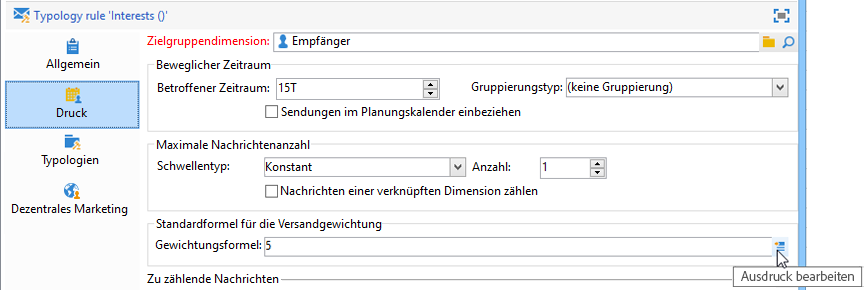

1. Im oberen Abschnitt des Ausdruckeditors wird standardmäßig der Wert **5** angegeben. Dieser Gewichtung soll nun der empfängerabhängige Neigungswert hinzugefügt werden. Positionieren Sie dafür den Zeiger der Maus rechts von der Ziffer 5, geben Sie das Zeichen **+** ein und wählen Sie das Feld **Neigungen** aus.

   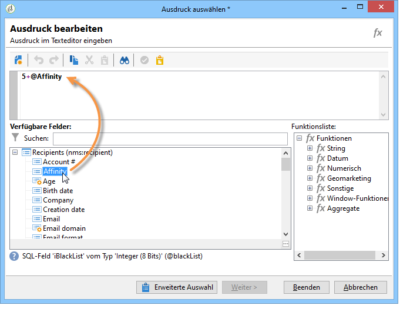

1. Fügen Sie dann einen höheren Wert für Empfänger hinzu, die bereits einen Kauf getätigt haben. Für sie muss das Gewicht der Lieferung um 5 erhöht werden, während für andere nur um 4 erhöht wird.

   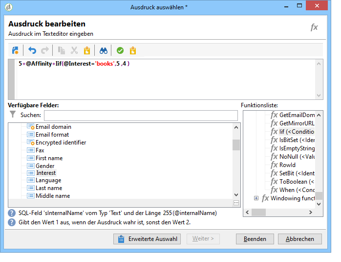

1. Klicken Sie auf die Schaltfläche **[!UICONTROL Beenden]** und speichern Sie die Regel.
1. Fügen Sie die erstellte Regel einer Kampagnentypologie hinzu und verweisen Sie in einem Versand auf die jeweilige Typologie, um ihre Funktionsweise zu überprüfen.

### Senden der Nachrichten mit der höchsten Gewichtung {#send-only-the-highest-weighted-messages}

Angenommen, Sie möchten an jeden Ihrer Empfänger pro Woche höchstens zwei Nachrichten senden, wobei pro Tag höchstens zwei Nachrichten verschickt werden sollen. Außerdem sollen nur höher gewichtete Nachrichten gesendet werden.

Zu diesem Zweck müssen Sie für denselben Empfänger mehrere Sendungen mit unterschiedlichen Gewichtungen festlegen und eine Druckregel definieren, um Sendungen mit niedrigerer Gewichtung auszuschließen.

Konfigurieren Sie zuerst die Druckregel.

1. Erstellen Sie eine Druckregel. [Weitere Informationen](#create-a-pressure-rule).
1. Wählen Sie im Tab **[!UICONTROL Allgemein]** die Option **[!UICONTROL Zu Beginn der Personalisierung Regel erneut anwenden]** aus.

   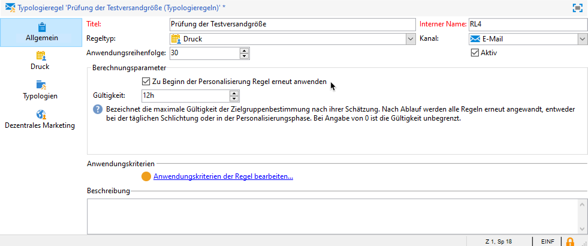

   Diese Option überschreibt den im Feld **[!UICONTROL Frequenz]** definierten Wert und wendet die Regel während der Personalisierung automatisch an. [Weitere Informationen](apply-rules.md#adjust-calculation-frequency).

1. Wählen Sie im Tab **[!UICONTROL Druck]** die Option **[!UICONTROL 7T]** als **[!UICONTROL Betroffener Zeitraum]** und **[!UICONTROL Nach Kalendertag]** als **[!UICONTROL Gruppierungstyp]** aus.
1. Verknüpfen Sie diese Regel im Tab **[!UICONTROL Typologien]** mit einer Kampagnen-Typologie.
1. Speichern Sie Ihre Änderungen.

Erstellen und konfigurieren Sie jetzt einen Workflow für jeden Versand, auf den die Druckregel angewendet werden soll.

1. Kampagne erstellen. [Weitere Informationen](../campaigns/marketing-campaign-create.md#create-a-campaign).
1. Fügen Sie auf der Registerkarte **[!UICONTROL Zielgruppenbestimmungen und Workflows]** Ihrer Kampagne eine **Abfrage-** Aktivität zu Ihrem Workflow hinzu. Weiterführende Informationen zur Verwendung dieser Aktivität finden Sie in [diesem Abschnitt](../workflow/query.md).
1. Fügen Sie zum Workflow die Aktivität **[!UICONTROL E-Mail-Versand]** hinzu und öffnen Sie ihn. Weiterführende Informationen zur Verwendung dieser Aktivität finden Sie in [diesem Abschnitt](../workflow/delivery.md).
1. Gehen Sie zum Tab **[!UICONTROL Validierungen]** der **[!UICONTROL Versandeigenschaften]** und deaktivieren Sie alle Validierungen.

   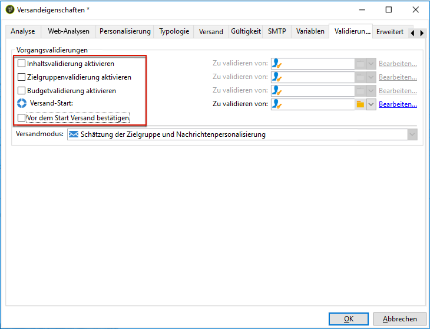

1. Referenzieren Sie auf **[!UICONTROL Registerkarte]** der Registerkarte **[!UICONTROL Versandeigenschaften]** die Kampagnentypologie, auf die die Regel angewendet werden soll. Definieren Sie eine Versandgewichtung.

   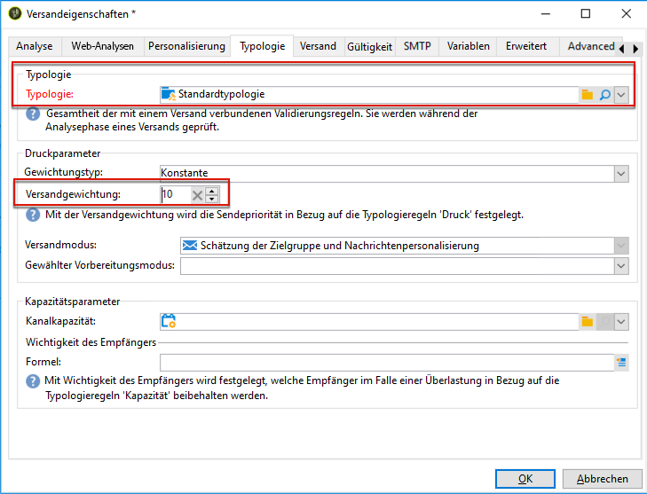

1. Wählen Sie im Versand die Option **[!UICONTROL Planung]** aus und danach **[!UICONTROL Versand planen (automatische Ausführung am geplanten Datum)]**. In unserem Beispiel müssen Sie die Option **[!UICONTROL Formel verwenden]** auswählen.
1. Legen Sie das Extraktionsdatum mit 10 Minuten fest (aktuelles Datum + 10 Minuten).
1. Legen Sie das Kontaktdatum mit dem nächsten Tag fest (aktueller Tag + 1 Tag).

   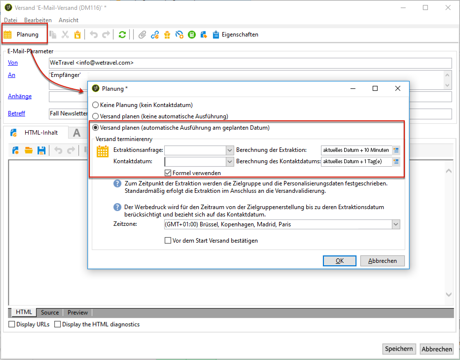

   Damit die Ausschlüsse für die Druckregel erfolgreich implementiert werden können, legen Sie das Extraktionszeitpunkt vor dem Kontaktzeitpunkt sowie vor der erneuten Durchführung der nächtlichen Schlichtung fest. [Weitere Informationen](#exclusion-after-arbitration).

1. Deselektieren Sie die Option **[!UICONTROL Vor dem Start Versand bestätigen]** und speichern Sie Ihre Änderungen.
1. Gehen Sie für jeden Versand, den Sie senden möchten, ähnlich vor. Stellen Sie sicher, dass Sie für jeden Versand die gewünschte Gewichtung festlegen.
1. Führen Sie die entsprechenden Workflows zur Vorbereitung und zum Versand der Nachrichten aus.

Bei Anwendung des nächtlichen Schlichtungsverfahrens werden die Sendungen mit den niedrigeren Gewichtungen für denselben Empfänger ausgeschlossen. Nur Sendungen mit der höchsten Gewichtung werden für den Versand berücksichtigt. [Weitere Informationen](#message-weight).

Angenommen, Anfang der Woche wurde den jeweiligen Empfängern schon eine E-Mail gesendet. In der unten stehenden Tabelle finden Sie ein Beispiel für die Konfiguration für zwei weitere Sendungen.

<table> 
 <thead> 
  <tr> 
   <th> Versand  </th> 
   <th> Validierungen  </th> 
   <th> Gewichtung  </th> 
   <th> Extraktionszeitpunkt  </th> 
   <th> Kontaktdatum  </th> 
   <th> Startdatum/-uhrzeit des Versands  </th> 
   <th> Zeitpunkt der Ausführung des Schlichtungs-Workflows  </th> 
   <th> Versandstatus  </th> 
   <th> Versandzeitpunkt  </th> 
  </tr> 
 </thead> 
 <tbody> 
  <tr> 
   <td> Versand 1  </td> 
   <td> Deaktiviert  </td> 
   <td> 5  </td> 
   <td> 15 Uhr  </td> 
   <td> 8 Uhr (nächster Tag)  </td> 
   <td> 14 Uhr  </td> 
   <td> Nachts  </td> 
   <td> Ausgeschlossen  </td> 
   <td> Ausgeschlossen  </td> 
  </tr> 
  <tr> 
   <td> Versand 2  </td> 
   <td> Deaktiviert  </td> 
   <td> 10  </td> 
   <td> 16 Uhr  </td> 
   <td> 9 Uhr (nächster Tag)  </td> 
   <td> 14 Uhr  </td> 
   <td> Nachts  </td> 
   <td> Gesendet  </td> 
   <td> 9 Uhr (nächster Tag)  </td> 
  </tr> 
 </tbody> 
</table>

Nachdem das Extraktionsdatum für die beiden Sendungen überschritten ist, wird die nächtliche Schlichtung vor den Kontaktdaten beider Sendungen erneut angewendet. Auf diese Weise können Sie alle bereits durchgeführten Sendungen (Empfänger, für die ein Versand verarbeitet wird, werden über die Broadlogs aufgezeichnet) oder die für den Versand geplanten Sendungen (Empfänger, die für einen Versand infrage kommen, werden über die Forecast-Logs aufgezeichnet) ermitteln.

Sobald alle durchgeführten und potenziellen Sendungen für den in der Druckregel definierten Zeitraum aufgelistet wurden, sortiert Adobe Campaign sie nach Gewichtung, wobei der gewichtete Wert zuerst angegeben wird. Wenn der in der Druckregel festgelegte Schwellenwert erreicht wird (in diesem Fall nicht mehr als zwei E-Mails innerhalb derselben Woche), werden die Empfänger vom Versand ausgeschlossen.
