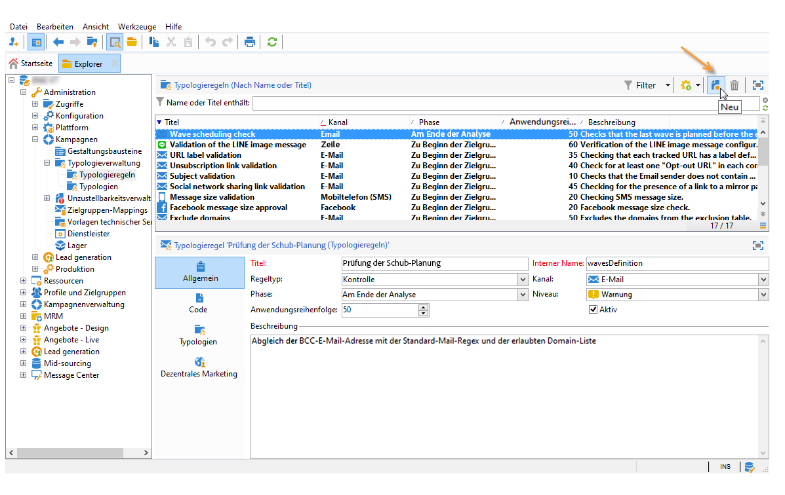
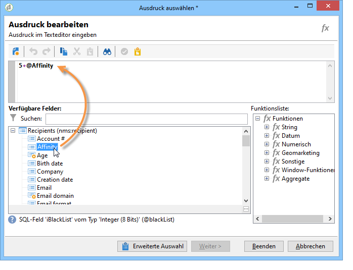
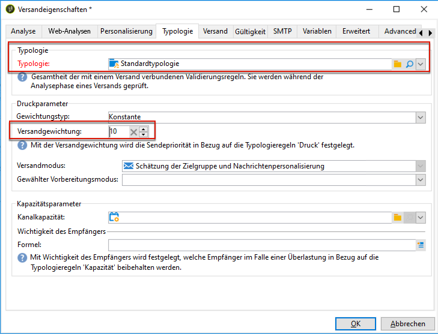

# Druckregeln{#pressure-rules}

Mithilfe der Werbedruckverwaltung stellen Sie sicher, dass Sie die Population der Datenbank nicht übermäßig oft ansprechen, was zur sogenannten &quot;Marketing-Müdigkeit&quot; führen könnte. Hierzu kann eine maximale Anzahl an Nachrichten pro Empfänger festgelegt werden. Zudem können zwischen den Kampagnen Schlichtungsregeln eingerichtet werden, auf deren Basis an die jeweilige Zielgruppe die für sie am besten geeignete Nachricht gesendet wird.

**Druckregeln** können beispielsweise dazu beitragen, der Marketing-Müdigkeit entgegenzusteuern, indem die Zahl der an eine Zielgruppe versendeten Newsletter auf zwei begrenzt wird; unter den zur Auswahl stehenden Nachrichten diejenigen ausgewählt werden, die den Interessen der Abonnentengruppe bestmöglich entsprechen; keine Angebote per SMS an einen unzufriedenen Kunden gesendet werden etc.

Die Kampagnen werden entsprechend der festgelegten Schwellen und des jeweiligen Gewichts jeder Nachricht ausgewählt.

* Eine Schwelle ist die maximale Anzahl an Sendungen, die in einem bestimmten Zeitraum für einen bestimmten Empfänger nicht überschritten werden darf. Sie kann konstant oder variabel sein. Sie wird über die Parameter der Typologieregel festgelegt oder berechnet. [Weitere Informationen](#maximum-number-of-messages).
* Die Versandgewichtung ermöglicht die Identifizierung der Sendungen, die im Kontext der Druckverwaltung prioritär sind. Die Nachrichten mit der höchsten Gewichtung haben Priorität. [Weitere Informationen](#message-weight).

Die Schlichtung besteht darin, sicherzustellen, dass geplante Kampagnen mit einer höheren Gewichtung als laufende Kampagnen kein übermäßiges Werben eines Profils auslösen: Ist dies der Fall, wird das Profil von der Versandaktion ausgeschlossen.

Die Schlichtungskriterien (Nachrichtengewichtung und/oder Schwelle der Nachrichtenanzahl) können nach zwei Informationstypen variieren:

* den Präferenzen der Empfänger, die deklarativen Informationen entsprechen: Newsletter-Abonnements, Empfängerstatus (Kunde oder potenzieller Kunde);
* dem Verhalten der Empfänger: Einkäufe, besuchte Links usw.

Die Schlichtungsregel zur Bestimmung der geeigneten Nachrichten wird in der Analyseetappe angewandt. Die Nachricht wird für jeden Empfänger und den betroffenen Zeitraum versandt, wenn folgende Formel wahr ist: **(Anzahl gesendeter Nachrichten) + (Anzahl der Nachrichten mit einer größeren Gewichtung) &lt; Schwelle**

Im gegensätzlichen Fall erscheint in den Logs der Hinweis **[!UICONTROL Ausgeschlossen nach Schlichtung]**. [Weitere Informationen](#exclusion-after-arbitration).

## Erstellen Sie eine Druckregel {#create-a-pressure-rule}

Um eine Schlichtung zwischen Adobe-Campaign-Kampagnen einzurichten, müssen zunächst Kampagnentypologien erstellt und die damit verbundenen Typologieregeln definiert werden.****

Um eine Typologieregel vom Typ **[!UICONTROL Druck]** zu erstellen und zu konfigurieren, durchlaufen Sie folgende Etappen:

1. Wählen Sie in der Liste der Kampagnentypologieregeln die **[!UICONTROL Neu]** oberhalb der Liste.

   

1. Wählen Sie im Tab **[!UICONTROL Allgemein]** der neuen Regel den Regeltyp **Druck** aus und geben Sie einen Namen und eine Beschreibung ein.

   

1. Sie können die Ausführungsreihenfolge nach Bedarf ändern. Wenn mehrere Typologieregeln in Form eines Sets von **[!UICONTROL Typologien]** angewendet werden, werden die Regeln mit der niedrigeren Reihenfolge zuerst angewendet. [Weitere Informationen](apply-rules.md#execution-order).
1. Definieren Sie im Bereich **[!UICONTROL Berechnungsparameter]** eine Frequenz, wenn Sie die Zielgruppenbestimmung über die nächste tägliche Neuschlichtung hinaus speichern möchten. [Weitere Informationen](apply-rules.md#adjust-calculation-frequency).
1. Gehen Sie in den Tab **[!UICONTROL Druck]** und wählen Sie den Zeitraum im Kalender aus, während dessen die Regel angewandt werden soll.

   

   Die Regel wird auf Sendungen angewandt, deren Kontaktdatum im betroffenen Zeitraum liegt.

   >[!NOTE]
   >
   >Geplante Sendungen werden nicht berücksichtigt.

1. Geben Sie den Berechnungsmodus der maximalen Nachrichtenanzahl an.

   Die Schwelle stellt die maximale Anzahl der Nachrichten dar, die an einen Empfänger im betreffenden Zeitraum geschickt werden können.

   Die Schwelle ist standardmäßig konstant. Die von der Regel erlaubte maximale Nachrichtenanzahl muss festgelegt werden.

   

   Um eine variable Schwelle anzugeben, wählen Sie den Wert **[!UICONTROL Empfängerabhängig]** im Feld **[!UICONTROL Schwellentyp]** und öffnen Sie den Ausdruckseditor über das rechts vom Feld gelegene Symbol.

   

   Weitere Informationen hierzu finden Sie unter [Maximale Nachrichtenanzahl](#maximum-number-of-messages).

1. Geben Sie den Berechnungsmodus der Versandgewichtung an.

   Jede Sendung hat eine Gewichtung, d. h. einen Wert, der ihrer Priorität entspricht: Dies ermöglicht eine Schlichtung zwischen den Kampagnen. Die Gewichtung wird entsprechend der Formel berechnet, die in der Typologieregel und/oder direkt in ihren Eigenschaften bestimmt wird. [Weitere Informationen](#message-weight).

1. Standardmäßig werden alle Nachrichten in der Schwellenberechnung berücksichtigt. Im Tab **[!UICONTROL Druck]** können von der Regel betroffene Empfänger und Nachrichten gefiltert werden:

   * Im oberen Bereich können die betroffenen Empfänger begrenzt werden.
   * Im unteren Bereich dieses Tabs können die zu zählenden Nachrichten gefiltert werden.

      Im folgenden Beispiel werden nur die im Ordner **NewContacts** gespeicherten Empfänger berücksichtigt und nur Sendungen, die mit **Newsletter** beginnen, sind betroffen.
   

1. Im Tab **[!UICONTROL Typologien]** können die Kampagnentypologien eingesehen werden, die diese Typologieregel anwenden. Zudem kann die Regel an dieser Stelle einer oder mehreren existierenden Typologien zugeordnet werden. [Weitere Informationen](campaign-typologies.md#apply-typologies).

## Definieren von Schwellenwerten und Gewichtungen {#define-thresholds-and-weights}

### Maximale Nachrichtenanzahl {#maximum-number-of-messages}

Mit jeder Druckregel wird eine Schwelle bestimmt, also eine maximale Anzahl an Nachrichten, die einem Empfänger über einen bestimmten Zeitraum gesendet werden können. Wenn diese Schwelle erreicht ist, wird dem Empfänger bis zum Ende des Zeitraums keine Kampagne mehr gesendet. Diese Funktionsweise ermöglicht den automatischen Ausschluss eines Empfängers aus einer Sendung, wenn der Versand der Nachricht die festgelegte Schwelle überschreiten und somit einen übermäßigen Werbedruck erzeugen würde.

Der Schwellwert kann konstant sein oder mithilfe einer Formel berechnet werden, die Variablen beinhalten kann. Für einen gegebenen Zeitraum kann sich die Schwelle so von einem Empfänger zum anderen und sogar für einen einzelnen Empfänger unterscheiden.

>[!CAUTION]
>
>Eine Schwelle von **0** verhindert jeglichen Versand an die Zielgruppe während des betroffenen Zeitraums.

**Beispiel:**

Beispiel: Die zulässige Anzahl von Nachrichten kann entsprechend dem Segment indexiert werden, zu dem der Empfänger gehört. Ein im Segment &quot;Web&quot; verzeichneter Empfänger kann so beispielsweise mehr Nachrichten als andere Empfänger erhalten. Mit einer Formel vom Typ **[!UICONTROL Iif (@origin=&#39;Web&#39;, 5, 3)]** wäre etwa der Versand von 5 Nachrichten an diese Empfänger zulässig, für die Empfänger aus anderen Segmenten dagegen nur 3. Dies erfordert folgende Konfiguration:

Um die Schwelle zu bestimmen, können Sie eine Dimension verwenden, die mit der Zielgruppendimension verknüpft ist: Um beispielsweise Nachrichten einzuschließen, die an die in der Besuchertabelle gespeicherten Empfängerprofile gesendet werden (weitere Informationen zur Besuchertabelle finden Sie in diesem Abschnitt) (Umfragen/using/use-case—creating-a-refera-friend-form.md) oder um zu verhindern, dass mehr als eine Nachricht pro Woche an denselben Haushalt gesendet wird (was sich auf mehrere E-Mail-Adressen beziehen kann), die in einer mit der Empfängerdimension verknüpften Dimension identifiziert wurden.

Wählen Sie hierfür die Option **[!UICONTROL Nachrichten einer verknüpften Dimension zählen]**.

### Nachrichtengewichtung {#message-weight}

Jeder Versand hat eine Gewichtung, die seine Priorität repräsentiert. Die Standardgewichtung beträgt 5. Die Druckregeln ermöglichen es, die Gewichtung der Sendungen festzulegen, auf die sie angewendet werden.

Die Gewichtung kann konstant sein oder mithilfe einer Formel empfängerabhängig berechnet werden. Beispielsweise kann die Gewichtung eines Versands den Interessen eines Empfängers entsprechend bestimmt werden.

>[!CAUTION]
>
>Die in einer Regel festgelegte Gewichtung kann für jeden einzelnen Versand über den Tab **[!UICONTROL Eigenschaften]** des jeweiligen Versands überschrieben werden. Klicken Sie auf den **[!UICONTROL Typologie]**-Tab, um die Kampagnentypologie auszuwählen und bei Bedarf die anzuwendende Gewichtung anzugeben.\
>Eine in einer Typologieregel A festgelegte Gewichtung wird jedoch nicht in den Berechnungen einer Typologieregel B berücksichtigt: Die Gewichtung betrifft jeweils nur die Sendungen, die die Regel A anwenden.

**Beispiel:**

Im folgenden Beispiel wird die Gewichtung von Musik-Newslettern abhängig von der Neigung der Empfänger zu diesem Thema berechnet.

1. Erstellen Sie ein neues Feld, um die für die Neigung der Empfänger ermittelten Werte festzuhalten. Dieses Feld, hier **@Music**, kann mit Antworten auf Online-Erhebungen und -Umfragen, erfassten Trackingdaten etc. angereichert werden.
1. Erstellen Sie eine Typologieregel, um die Nachrichtengewichtung auf diesem Feld basierend zu berechnen.

   

1. Wenden Sie diese Regel auf Nachrichten wie Newsletter, Sonderangebote etc. an. Die Gewichtung dieser Sendungen, also ihre Priorität, hängt folglich von den Neigungswerten des einzelnen Empfängers ab.

## Festlegen des Zeitraums {#setting-the-period}

Die Druckregeln werden für bewegliche Zeiträume von **n** Tagen bestimmt.

Der Zeitraum wird im **[!UICONTROL Druck]**-Tab der Regel konfiguriert. Sie können die Anzahl der Tage und bei Bedarf den anzuwendenden Gruppierungstyp auswählen (nach Kalendertag, -woche; -monat etc.).

Der Gruppierungstyp ermöglicht die Erweiterung des Werts im Feld **[!UICONTROL Betroffener Zeitraum]** auf den ganzen Tag, die Kalenderwoche, den Kalendermonat oder das Kalenderjahr des jeweiligen Zeitraums.

Eine Druckregel zum Beispiel, die eine Schwelle von 2 Nachrichten pro Woche und eine Gruppierung nach Kalendermonaten berechnet, verhindert den Versand von mehr als zwei Sendungen in der gleichen Woche UND im gleichen Kalendermonat für den gesamten betroffenen Zeitraum. Achtung: Wenn der Zeitraum zwei Monate übergreift, berücksichtigt die Schwellenberechnung alle Sendungen beider Kalendermonate. Dadurch könnten neue Sendungen während des zweiten Monats verhindert werden.

>[!CAUTION]
>
>Bei der Berechnung der Schwelle werden nur bereits versandte Sendungen berücksichtigt.

Um die berücksichtigten Sendungen auf einen Zeitraum von zwei Wochen zu beschränken, geben Sie **15 T** im **[!UICONTROL Betroffener Zeitraum]** -Feld: Sendungen, die bis zu zwei Wochen vor dem Datum des Versands, auf den die Regel angewendet wird, durchgeführt werden, werden bei der Berechnung berücksichtigt

Das Anfangsdatum des Zeitraums hängt von der Konfiguration der Datenbank ab.

Wenn man also auf einem Versand vom 12.11. eine Druckregel über einen Zeitraum von 15 Tagen ohne Gruppierung anwendet, werden Sendungen zwischen dem 27.10. und dem 12.11. berücksichtigt. Wenn die Druckregel Sendungen aus dem Planungskalender miteinberechnet, werden Sendungen zwischen dem 27.10. und dem 27.11. gezählt. Wenn man schließlich in der Regel eine Gruppierung nach Kalendermonat festlegt, werden alle Sendungen der Monate November und Dezember in der Schwellenberechnung miteinbezogen (vom 1.11. bis zum 31.12.).

**Häufiger Fall**

Um nur Sendungen der laufenden und keine der vorhergehenden Kalenderwoche in der Schwellenberechnung zu berücksichtigen, tragen Sie &#39;0&#39; in das Feld **[!UICONTROL Betroffener Zeitraum]** ein und wählen Sie den **[!UICONTROL Gruppierungstypen]** &#39;nach Kalenderwoche&#39;.

Bei einem Zeitraum über 0 (zum Beispiel 1) könnte die Berechnung die Sendungen des vorhergehenden Tages berücksichtigen: Wenn der vorhergehende Tag zugleich der vorhergehenden Woche angehört und es sich beim gewählten Gruppierungstypen um &#39;nach Kalenderwoche&#39; handelt, so wird die gesamte vorhergehende Woche in der Schwellenberechnung berücksichtigt.

**Beispiel:**

In diesem Beispiel wird eine Druckregel erstellt, die die Kundenansprache auf drei Nachrichten über einen Zeitraum von 15 Tagen hinweg begrenzt, mit einer Gruppierung nach Kalendermonat.

Nehmen wir an, es sind sechs Newsletter gleicher Gewichtung für die Daten 30.4., 3.5., 8.5., 12.5., 22.5. und 30.5. geplant.

Die für den 12. und 30.5. geplanten Sendungen werden nicht verschickt: Die Sendung vom 12.5. würde die erlaubte Schwelle von drei Nachrichten in 15 Tagen überschreiten und die Sendung vom 30. würde die Schwelle der pro Monat erlaubten Nachrichten überschreiten.

Alle Empfänger dieser Sendungen werden durch die Schlichtung während der Analysephase ausgeschlossen:

Gruppiert man für die gleiche Regel die Sendungen pro Quartal, werden die Empfänger des **5. Newsletters** ebenfalls ausgeschlossen und der Newsletter wird nicht versendet.

Wenn keine Gruppierung ausgewählt wird, wird nur der **4. Newsletter** nicht versendet, da er in den gleichen zwei Wochen geplant ist wie die ersten drei.

>[!NOTE]
>
>Bei Änderung der Definition einer Typologieregel können Sie eine **Simulation** erstellen, um ihren Einfluss auf die Sendungen, bei denen sie angewendet wird, zu kontrollieren, und die Auswirkungen der Sendungen untereinander zu überprüfen. [Weitere Informationen](campaign-simulations.md).

## Ausschließen nach Schlichtung {#exclusion-after-arbitration}

Die Schlichtung wird jede Nacht durch den technischen Workflow **[!UICONTROL Planungen]** und den Workflow **[!UICONTROL Kampagnenvorgänge]** erneut durchgeführt.

Der Workflow **[!UICONTROL Planungen]** berechnet die Daten über die (seit dem Beginn des Zeitraums bis zum jetzigen Zeitpunkt) verstrichene Zeitspanne, die zur Anwendung der Typologieregeln während der Analyse notwendig sind. Er berechnet zudem jede Nacht die Ausschlusszähler für die Schlichtungen neu.

Adobe Campaign stellt so für jeden Empfänger sicher, dass die Anzahl der zu sendenden Nachrichten die Schwelle nicht überschreitet, unter Berücksichtigung der Anzahl der bereits im betroffenen Zeitraum gesendeten Nachrichten. Diese Informationen sind nur **Indikatoren**, da die Berechnungen zum Zeitpunkt des Versands aktualisiert werden.

Bei Überschreiten der Schwelle werden die in der Kampagnentypologie bestimmten Schlichtungsregeln angewandt und die Empfänger werden durch die Schlichtung von Kampagnen mit geringerer Gewichtung ausgeschlossen.

>[!NOTE]
>
>Wenn mehrere Sendungen die gleiche Gewichtung aufweisen, wird die zeitlich nächstgelegene Kampagne geschickt.

## Anwendungsbeispiele für Druckregeln {#use-cases-on-pressure-rules}

### Anpassen des Schwellenwerts auf Basis von Kriterien {#adapt-the-threshold-based-on-criterion}

Das vorliegende Beispiel zeigt eine Typologieregel, die die Anzahl der wöchentlich gesendeten Nachrichten an Kunden auf vier und an Interessenten auf zwei begrenzt.

Zur Identifikation von Kunden und Interessenten wird das Feld **[!UICONTROL Status]** verwendet, das den Wert 0 für Interessenten und den Wert 1 für bereits bestehende Kunden enthält.

Befolgen Sie die nachstehenden Schritte, um die Regel zu konfigurieren:

1. Erstellen Sie eine neue Typologieregel vom Typ **Druck**.
1. Gehen Sie in den Tab **[!UICONTROL Druck]**, um im Abschnitt **[!UICONTROL Maximale Nachrichtenanzahl]** die Formel zur empfängerabhängigen Schwellenberechnung zu definieren. Wählen Sie daher in der Dropdown-Liste **[!UICONTROL Schwellentyp]** die Option **[!UICONTROL Empfängerabhängig]** aus und klicken Sie anschließend auf das Symbol **[!UICONTROL Ausdruck bearbeiten]**, das sich rechts vom Feld **[!UICONTROL Formel]** befindet.

   Klicken Sie auf die Schaltfläche **[!UICONTROL Erweiterte Auswahl]**, um die Formel zu erstellen.

   

1. Wählen Sie die Option **[!UICONTROL Formel von einem Ausdruck ausgehend erstellen]** aus und klicken Sie auf **[!UICONTROL Weiter]**.

   

1. Wählen Sie in der Funktionsliste im Knoten **[!UICONTROL Sonstige]** mit einem Doppelklick die Funktion **Iif** aus.

   Wählen Sie anschließend den **Status** des Empfängers im Abschnitt **[!UICONTROL Verfügbare Felder]** aus.

   

   Geben Sie die folgende Formel ein: **Iif(@status=0,2,4)**

   

   Diese Formel ordnet einem Status gleich 0 den Wert 2 und jedem anderen Status den Wert 4 zu.

   Klicken Sie auf die Schaltfläche **[!UICONTROL Beenden]**, um die Formel zu bestätigen.

1. Geben Sie den Anwendungszeitraum der Regel an, hier 7 Tage.

   

1. Speichern Sie die Regel, um ihre Erstellung zu bestätigen.

Fügen Sie die Regel einer Typologie hinzu, um sie im Zuge von Sendungen anwenden zu können. Gehen Sie hierfür wie folgt vor:

1. Erstellen Sie eine Kampagnentypologie.
1. Klicken Sie im Tab **[!UICONTROL Regeln]** auf die Schaltfläche **[!UICONTROL Hinzufügen]** und wählen Sie die zuvor erstellte Regel aus.

   

1. Speichern Sie die Typologie, um sie der Liste der bereits vorhandenen Typologien hinzuzufügen.

Um diese Typologie in Ihren Sendungen verwenden zu können, wählen Sie sie wie nachfolgend beschrieben im Tab **[!UICONTROL Typologie]** der jeweiligen Versandeigenschaften aus:

>[!NOTE]
>
>Die Typologie kann auf Ebene der Versandvorlage festgelegt werden, um sie automatisch auf alle mit der jeweiligen Vorlage erstellten Sendungen anzuwenden.

Bei der Versandanalyse werden Empfänger ausgeschlossen, wenn sie bereits eine bestimmte Anzahl an Sendungen erhalten haben. Diese Information erhalten Sie, indem Sie

* das Ergebnis der Analyse ansehen:

   

* den Versand öffnen und auf den Tab **[!UICONTROL Sendungen]** sowie den Untertab **[!UICONTROL Ausschlüsse]** klicken:

   

* auf den Tab **[!UICONTROL Verfolgung]** und anschließend den Untertab **[!UICONTROL Ausschlussgründe]** klicken, um die Anzahl der Ausschlüsse und die angewandten Typologieregeln anzeigen zu lassen:

   

### Berechnen der Versandgewichtung basierend auf dem Empfängerverhalten {#calculate-the-delivery-weight-based-on-behavior}

Druckregeln können dem Empfängerverhalten entsprechend festgelegt werden. Auf diese Weise kann die Gewichtung eines Versands von einem Empfänger zum anderen nuanciert werden. Der Versand einer bestimmten Nachricht kann beispielsweise bevorzugt werden, je nachdem, ob ein Empfänger Ihre Seite besucht, in eine bestimmte Rubrik des letzten Newsletters geklickt oder einen Informationsdienst abonniert hat oder nicht. Auch Antworten auf Umfragen oder Onlinespiele etc. können berücksichtigt werden.

Im folgenden Beispiel wird ein Versand mit einer Gewichtung von 5 erstellt. Dieser Gewichtung werden Neigungswerte entsprechend dem Empfängerverhalten hinzugefügt: Ein Kunde, der bereits eine Bestellung auf der Webseite aufgegeben hat, erhält einen Neigungswert von 5, während einem Kunde, der noch nie online bestellt hat, ein Neigungswert von 4 zugeordnet wird.

Für diese Art von Konfiguration muss mit einer Formel die Gewichtung der Nachrichten bestimmt werden. Auf Informationen bezüglich der Neigung und der Umfragenantworten muss über das Datenmodell Zugriff bestehen. Im vorliegenden Beispiel wurde das Feld **Neigungen** hinzugefügt.

Befolgen Sie zur Konfiguration die nachstehenden Etappen:

1. Erstellen Sie eine neue Typologieregel vom Typ **Druck**.
1. Im Tab **[!UICONTROL Druck]** wird nun eine empfängerabhängige Schwellenberechnungsformel erstellt: Klicken Sie auf das Symbol **[!UICONTROL Ausdruck bearbeiten]** rechts vom Feld **[!UICONTROL Gewichtungsformel]**.

   

1. Im oberen Abschnitt des Ausdruckeditors wird standardmäßig der Wert **5** angegeben. Dieser Gewichtung soll nun der empfängerabhängige Neigungswert hinzugefügt werden. Positionieren Sie dafür den Zeiger der Maus rechts von der Ziffer 5, geben Sie das Zeichen **+** ein und wählen Sie das Feld **Neigungen** aus.

   

1. Fügen Sie anschließend einen höheren Wert für die Empfänger ein, die bereits Bestellungen getätigt haben. Für diese soll die Versandgewichtung um 5, für die anderen nur um 4 erhöht werden.

   

1. Klicken Sie auf die Schaltfläche **[!UICONTROL Beenden]** und speichern Sie die Regel.
1. Fügen Sie die erstellte Regel einer Kampagnentypologie hinzu und verweisen Sie in einem Versand auf die jeweilige Typologie, um ihre Funktionsweise zu überprüfen.

### Senden der Nachrichten mit der höchsten Gewichtung {#send-only-the-highest-weighted-messages}

Angenommen, Sie möchten an jeden Ihrer Empfänger pro Woche höchstens zwei Nachrichten senden, wobei pro Tag höchstens zwei Nachrichten verschickt werden sollen. Außerdem sollen nur höher gewichtete Nachrichten gesendet werden.

Zu diesem Zweck müssen Sie für denselben Empfänger mehrere Sendungen mit unterschiedlichen Gewichtungen festlegen und eine Druckregel definieren, um Sendungen mit niedrigerer Gewichtung auszuschließen.

Konfigurieren Sie zuerst die Druckregel.

1. Erstellen Sie eine Druckregel. [Weitere Informationen](#create-a-pressure-rule).
1. Wählen Sie im Tab **[!UICONTROL Allgemein]** die Option **[!UICONTROL Zu Beginn der Personalisierung Regel erneut anwenden]** aus.

   

   Diese Option überschreibt den im Feld **[!UICONTROL Frequenz]** definierten Wert und wendet die Regel während der Personalisierung automatisch an. [Weitere Informationen](apply-rules.md#adjust-calculation-frequency).

1. Wählen Sie im Tab **[!UICONTROL Druck]** die Option **[!UICONTROL 7T]** als **[!UICONTROL Betroffener Zeitraum]** und **[!UICONTROL Nach Kalendertag]** als **[!UICONTROL Gruppierungstyp]** aus.
1. Verknüpfen Sie diese Regel im Tab **[!UICONTROL Typologien]** mit einer Kampagnen-Typologie.
1. Speichern Sie Ihre Änderungen.

Erstellen und konfigurieren Sie jetzt einen Workflow für jeden Versand, auf den die Druckregel angewendet werden soll.

1. Kampagne erstellen. [Weitere Informationen](../campaigns/marketing-campaign-create.md#create-a-campaign).
1. Fügen Sie im Tab **[!UICONTROL Zielgruppenbestimmungen und Workflows]** Ihrer Kampagne eine **Abfrage-** Aktivität zu Ihrem Workflow hinzu. Weiterführende Informationen zur Verwendung dieser Aktivität finden Sie in [diesem Abschnitt](../workflow/query.md).
1. Fügen Sie zum Workflow die Aktivität **[!UICONTROL E-Mail-Versand]** hinzu und öffnen Sie ihn. Weiterführende Informationen zur Verwendung dieser Aktivität finden Sie in [diesem Abschnitt](../workflow/delivery.md).
1. Gehen Sie zum Tab **[!UICONTROL Validierungen]** der **[!UICONTROL Versandeigenschaften]** und deaktivieren Sie alle Validierungen.

   

1. Wählen Sie im Tab **[!UICONTROL Typologie]** der **[!UICONTROL Versandeigenschaften]** die Kampagnentypologie aus, auf die die Regel angewendet werden soll. Definieren Sie eine Gewichtung für den Versand.

   

1. Wählen Sie im Versand die Option **[!UICONTROL Planung]** aus und danach **[!UICONTROL Versand planen (automatische Ausführung am geplanten Datum)]**. In unserem Beispiel müssen Sie die Option **[!UICONTROL Formel verwenden]** auswählen.
1. Legen Sie das Extraktionsdatum mit 10 Minuten fest (aktuelles Datum + 10 Minuten).
1. Legen Sie das Kontaktdatum mit dem nächsten Tag fest (aktueller Tag + 1 Tag).

   

   Damit die Ausschlüsse für die Druckregel erfolgreich implementiert werden können, legen Sie das Extraktionszeitpunkt vor dem Kontaktzeitpunkt sowie vor der erneuten Durchführung der nächtlichen Schlichtung fest. [Weitere Informationen](#exclusion-after-arbitration).

1. Deselektieren Sie die Option **[!UICONTROL Vor dem Start Versand bestätigen]** und speichern Sie Ihre Änderungen.
1. Gehen Sie für alle anderen Sendungen analog vor. Definieren Sie dabei die gewünschte Gewichtung für jeden Versand.
1. Führen Sie die entsprechenden Workflows zur Vorbereitung und zum Versand der Nachrichten aus.

Wenn die nächtliche Schlichtung angewendet wird, werden die Sendungen mit der niedrigeren Gewichtung für denselben Empfänger ausgeschlossen. Nur die Sendungen mit den höchsten Gewichtungen werden berücksichtigt. [Weitere Informationen](#message-weight).

Angenommen, Anfang der Woche wurde den jeweiligen Empfängern schon eine E-Mail gesendet. In der unten stehenden Tabelle finden Sie ein Beispiel für die Konfiguration für zwei weitere Sendungen.

<table> 
 <thead> 
  <tr> 
   <th> Versand  </th> 
   <th> Validierungen  </th> 
   <th> Gewichtung  </th> 
   <th> Extraktionszeitpunkt  </th> 
   <th> Kontaktdatum  </th> 
   <th> Startzeitpunkt des Versands  </th> 
   <th> Zeitpunkt der Ausführung des Schlichtungs-Workflows  </th> 
   <th> Versandstatus  </th> 
   <th> Versandzeitpunkt  </th> 
  </tr> 
 </thead> 
 <tbody> 
  <tr> 
   <td> Versand 1  </td> 
   <td> Deaktiviert  </td> 
   <td> 5  </td> 
   <td> 15 Uhr  </td> 
   <td> 8 Uhr (nächster Tag)  </td> 
   <td> 14 Uhr  </td> 
   <td> Nachts  </td> 
   <td> Ausgeschlossen  </td> 
   <td> Ausgeschlossen  </td> 
  </tr> 
  <tr> 
   <td> Versand 2  </td> 
   <td> Deaktiviert  </td> 
   <td> 10  </td> 
   <td> 16 Uhr  </td> 
   <td> 9 Uhr (nächster Tag)  </td> 
   <td> 14 Uhr  </td> 
   <td> Nachts  </td> 
   <td> Gesendet  </td> 
   <td> 9 Uhr (nächster Tag)  </td> 
  </tr> 
 </tbody> 
</table>

Nachdem das Extraktionsdatum für die zwei Sendungen verstrichen ist, wird die nächtliche Schlichtung vor den Kontaktzeitpunkten beider Sendungen erneut angewendet. Dies ermöglicht die Ermittlung aller bereits durchgeführten Sendungen (Empfänger, für die ein Versand verarbeitet und in den Broadlogs aufgezeichnet wurde) sowie der geplanten Sendungen (Empfänger, die für den Empfang einer Nachricht qualifiziert und in den Planungslogs aufgeführt sind).

Nachdem alle durchgeführten und geplanten Sendungen für den in der Druckregel definierten Zeitraum aufgelistet sind, werden sie von Adobe Campaign nach Gewichtung sortiert, wobei der am höchsten gewichtete Versand zuerst kommt. Wenn die in der Druckregel definierte Schwelle erreicht ist (in unserem Beispiel maximal zwei E-Mails pro Woche), werden die Empfänger vom Versand ausgeschlossen.
