# Einrichten und Verwalten des Validierungsprozesses {#approval-marketing-campaigns}

Welche Methoden und Personen an der Erstellung und Validierung von Marketing-Kampagnen beteiligt sind, hängt von der jeweiligen Organisation ab. Der Kampagnenvalidierungsprozess umfasst die Koordinierung mehrerer Stakeholder: Mit digitalem Marketing Befasste, Versand-Manager, Content-Manager und externe Verantwortliche wie Partner oder Lieferanten.

Mit Adobe Campaign können Sie einen Validierungsfluss für Ihre Kampagnen einrichten und Benutzende darüber informieren, wann eine Aktion erforderlich ist. Validierungen können für jeden Schritt eines Versands definiert werden: Zielgruppenbestimmung, Inhalt, Budget, Extraktion und Testversand. Während Ihre Kampagnensendungen die verschiedenen Validierungsschritte durchlaufen, erstellt Adobe Campaign ein Protokoll über die Änderungen und Genehmigungen, einschließlich Feedback, Änderungsanfragen und Kommentaren.

Die Personen, die als Verantwortliche für die Validierung in Adobe Campaign ernannt worden sind, werden mittels Benachrichtigungen über Validierungsanfragen informiert.

Sie können die Validierung auf verschiedene Weise vornehmen:

* Von der Benachrichtigungsmeldung aus. Durch den Link in der E-Mail erhält die Person über einen Webbrowser Zugriff auf Campaign. Nach dem Verbinden kann die validierungsverantwortliche Person den Inhalt validieren oder auch nicht.
   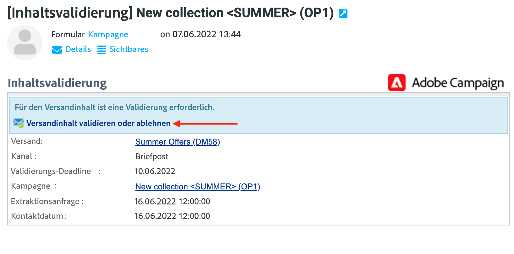

* Vom Kampagnen-Dashboard aus.
   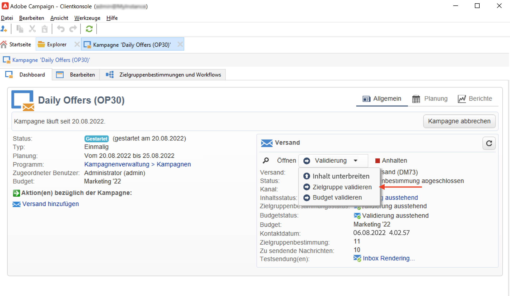

* Vom Versand-Dashboard aus.
   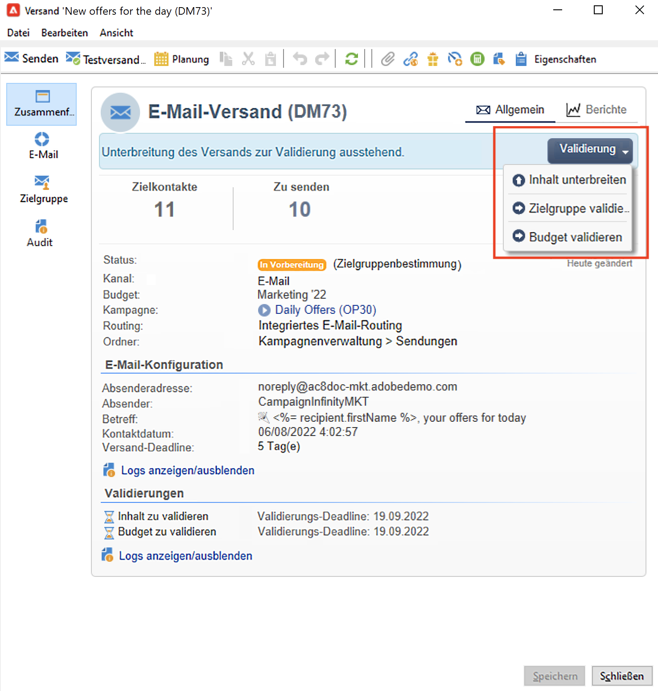

Benutzende können über das Validierungsfenster auf die Kampagne und den Versand zugreifen. Sie können auch einen Kommentar eingeben.

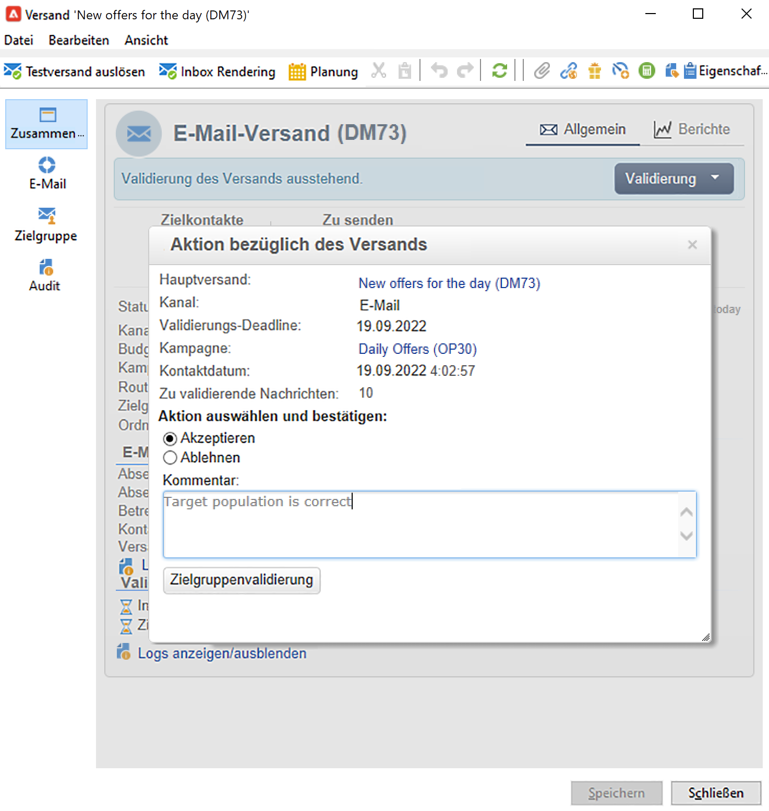

Wenn eine Validierung durchgeführt wird, werden die Informationen in den Kampagnen- und Versand-Dashboards sowie in den Protokollen angezeigt.

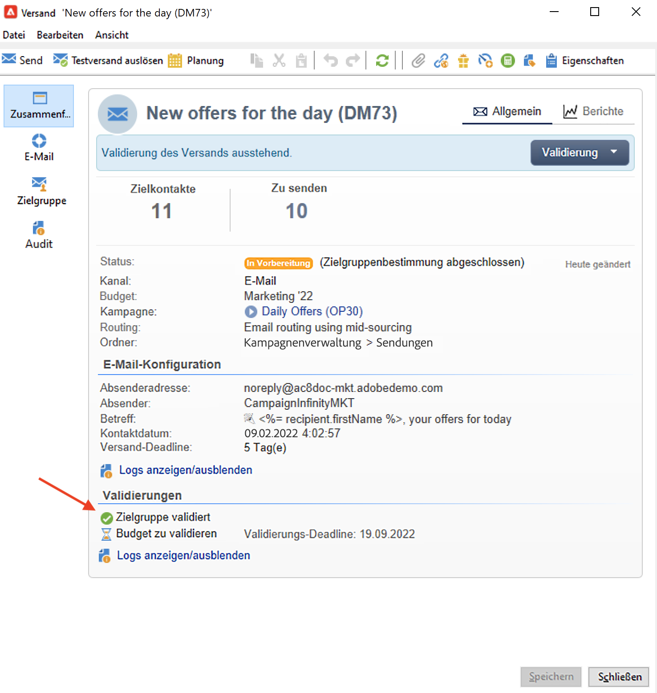

Diese Informationen sind auch in den Validierungsprotokollen des Versands und im Validierungsprotokoll der Kampagne verfügbar. Auf diese Protokolle kann über die Registerkarten **[!UICONTROL Bearbeiten > Audit > Validierungen]** zugegriffen werden.

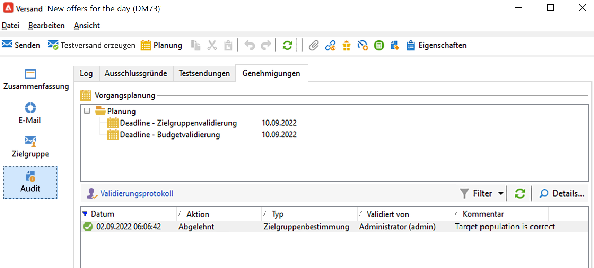

## Aktivieren von Validierungen{#enable-approvals}

Für jeden Prozess, für den eine Validierung aktiviert wurde, werden Benachrichtigungen über die Validierung an die entsprechenden Personen gesendet.

Diese Benachrichtigungen können für einzelne Kampagnenvorlagen, für einzelne Kampagnen oder für einen Versand aktiviert werden.

Alle Vorgänge, für die eine Validierung erforderlich ist, werden in der Kampagnenvorlage über die Registerkarte **[!UICONTROL Eigenschaften]** > **[!UICONTROL Erweiterte Kampagnenparameter...]** > **[!UICONTROL Validierungen]** ausgewählt. Auf dieser Registerkarte werden Validierungsverantwortliche oder Gruppen von Validierungsverantwortlichen ausgewählt. Diese Personen erhalten Benachrichtigungen, es sei denn, diese Option ist nicht aktiviert. [Weitere Informationen](#approving-processes).

Diese Einstellungen können für jede mit dieser Vorlage erstellte Kampagne sowie für jeden Versand einzeln überschrieben werden. Klicken Sie dazu auf die Schaltfläche **[!UICONTROL Eigenschaften]** des Versands, dann auf die Registerkarte **[!UICONTROL Validierungen]**.

Im nachfolgenden Beispiel erfordert der Inhalt des Briefpost-Versands keine Validierung:

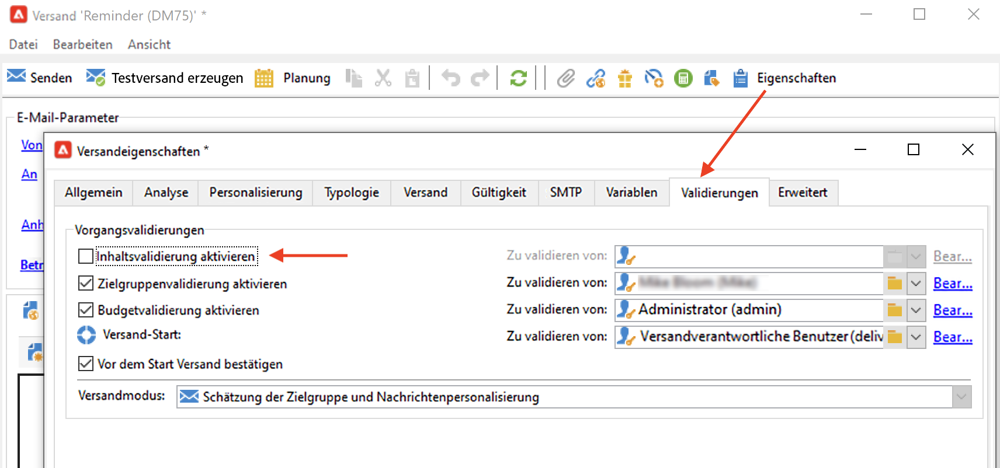

>[!CAUTION]
>
>Vergewissern Sie sich, dass die Validierungsverantwortlichen über die **erforderlichen Berechtigungen** zur Validierung verfügen und dass ihre Sicherheitszone korrekt definiert ist. [Weitere Informationen](#selecting-reviewers).

Der Validierungsprozess für Sendungen wird in [diesem Abschnitt](#review-and-approve-deliveries) ausführlich beschrieben.

## Auswahl von Validierungsverantwortlichen {#select-reviewers}

Für jeden Validierungstyp werden die für die Validierung verantwortlichen Benutzer oder Benutzergruppen aus der Dropdown-Liste im Versand ausgewählt. Weitere Benutzer können mit dem Link **[!UICONTROL Bearbeiten...]** hinzugefügt werden. In diesem Fenster können Sie auch die Validierungsfrist bearbeiten. Standardmäßig haben Validierungsverantwortliche ab dem Unterbreitungsdatum drei Tage Zeit, um einen Prozess zu validieren. Um eine automatische Erinnerung hinzuzufügen, können Sie den Link **[!UICONTROL Erinnerung hinzufügen]** verwenden.

Wenn keine Validierungsverantwortlichen angegeben werden, ist der/die Kampagnenverantwortliche für die Validierungen verantwortlich und erhält die Benachrichtigungen. Diese Person wird auf der Registerkarte **[!UICONTROL Bearbeiten > Eigenschaften]** der Kampagne angegeben:

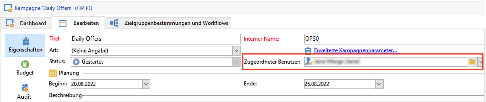

Alle anderen, die in Adobe Campaign über **[!UICONTROL Admin]**-Rechte verfügen, können ebenfalls Vorgänge validieren, erhalten jedoch keine Benachrichtigungen.

>[!NOTE]
>
>Standardmäßig kann der/die Kampagnenverantwortliche keine Validierung durchführen und auch nicht den Versand starten, wenn Validierungsverantwortliche festgelegt wurden. Als Administrator von Adobe Campaign können Sie dieses Verhalten ändern und es den Kampagnenverantwortlichen ermöglichen, Sendungen zu validieren/zu starten, indem Sie die Option **NmsCampaign_Activate_OwnerConfirmation** erstellen und auf **1** setzen.

Wenn eine Liste von Validierungsverantwortlichen definiert ist, ist ein Vorgang validiert, sobald ihn eine validierungsverantwortliche Person validiert hat. Der Validierungs-Link ist dann nicht mehr in den Kampagnen- und Versand-Dashboards verfügbar. Wenn das Senden von Benachrichtigungen aktiviert ist und ein anderer Validierungsverantwortlicher auf den Validierungs-Link in der Benachrichtigung klickt, wird ihm mitgeteilt, dass ein anderer Validierungsverantwortlicher den Vorgang bereits validiert hat.

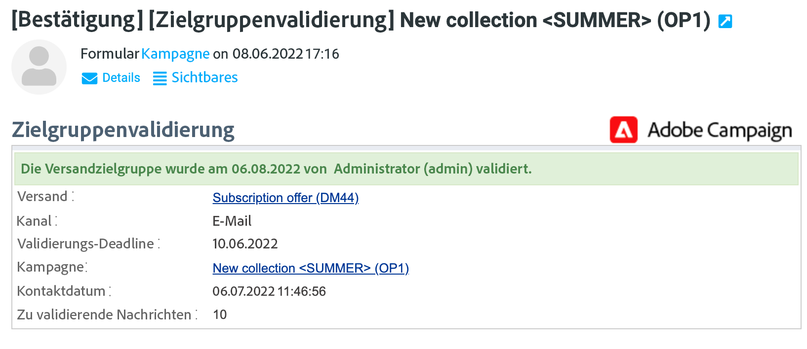

## Prüfen und Validieren von Sendungen {#review-and-approve-deliveries}

Für jede Kampagne können Sie die Zielgruppe eines Versands, [die Inhalte des Versands](#approving-content) und seine Kosten validieren lassen. Die für die Validierung zuständigen Adobe Campaign-Benutzer können per E-Mail benachrichtigt werden und eine Validierung über die Konsole oder eine Web-Schnittstelle annehmen oder ablehnen. [Weitere Informationen](#approving-processes).

Bei Briefpost-Versand können Adobe Campaign-Benutzer die Extraktionsdatei vor der Übermittlung an den Router einsehen. Bei Bedarf haben sie die Möglichkeit, das Format zu verändern und die Extraktion erneut zu starten. [Weitere Informationen](#approve-an-extraction-file).

Sobald diese Validierungsphasen beendet sind, kann der Versand gestartet werden. [Weitere Informationen](marketing-campaign-deliveries.md#starting-a-delivery).

>[!NOTE]
>
>Die Prozesse, für die eine Validierung erforderlich ist, können in der Kampagnenvorlage ausgewählt werden. [Weitere Informationen](marketing-campaign-templates.md).

### Schritte zur Validierung eines Versands {#approving-processes}

Die Phasen, für die eine Validierung erforderlich ist, werden im Kampagnen-Dashboard (über die Konsole oder die Web-Schnittstelle) angezeigt. Sie werden auch in der Versandverfolgungstabelle und im Versand-Dashboard angezeigt.

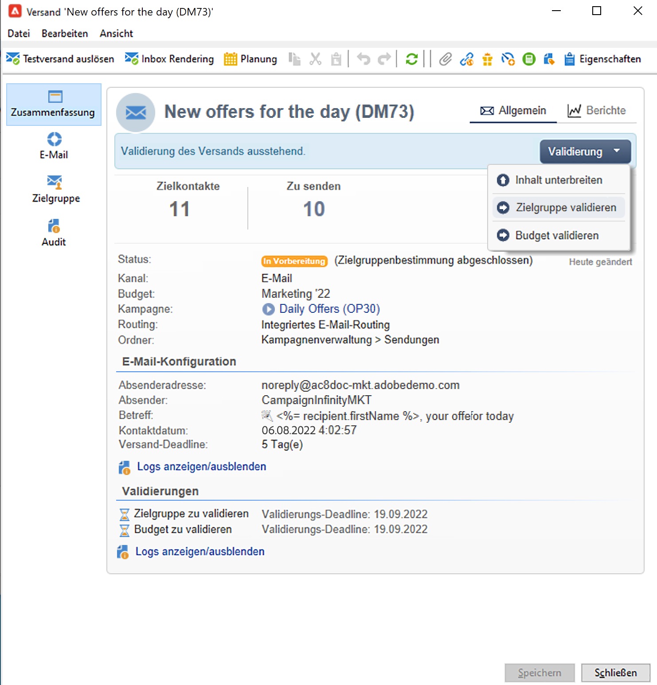

Folgende Validierungsvorgänge stehen für Kampagnensendungen zur Verfügung:

* **Validierung von Zielgruppe, Inhalt und Budget**

   Wenn die Optionen **[!UICONTROL Zielgruppenvalidierung aktivieren]**, **[!UICONTROL Inhaltsvalidierung aktivieren]** oder **[!UICONTROL Budgetvalidierung aktivieren]** im Fenster der Validierungseinstellungen ausgewählt sind, werden die entsprechenden Links in den Kampagnen- und Versand-Dashboards angezeigt.

   

   >[!NOTE]
   >
   >Die Budgetvalidierung ist nur verfügbar, wenn die Zielgruppenvalidierung im Fenster der Validierungseinstellungen aktiviert ist. Der Link zur Budgetvalidierung wird erst nach der Zielgruppenanalyse angezeigt.

   Wenn die Optionen **[!UICONTROL Inhaltsbearbeitung zuweisen]** oder **[!UICONTROL Externe Inhaltsvalidierung]** im Fenster der Validierungseinstellungen ausgewählt sind, werden im Dashboard die entsprechenden Links **[!UICONTROL Inhalt unterbreiten]** und **[!UICONTROL Externe Inhaltsvalidierung]** angezeigt.

   Die Inhaltsvaldiierung ermöglicht den Zugriff auf die durchgeführtenTestsendungen.

* **Validierung der Extraktion (Briefpost)**

   Wenn die Option **[!UICONTROL Extraktionsvalidierung aktivieren]** im Fenster der Validierungseinstellungen ausgewählt ist, muss die Extraktionsdatei validiert werden, bevor der Router benachrichtigt werden kann.

   Die Option **[!UICONTROL Datei validieren]** ist im Kampagnen- und Versand-Dashboard verfügbar.

   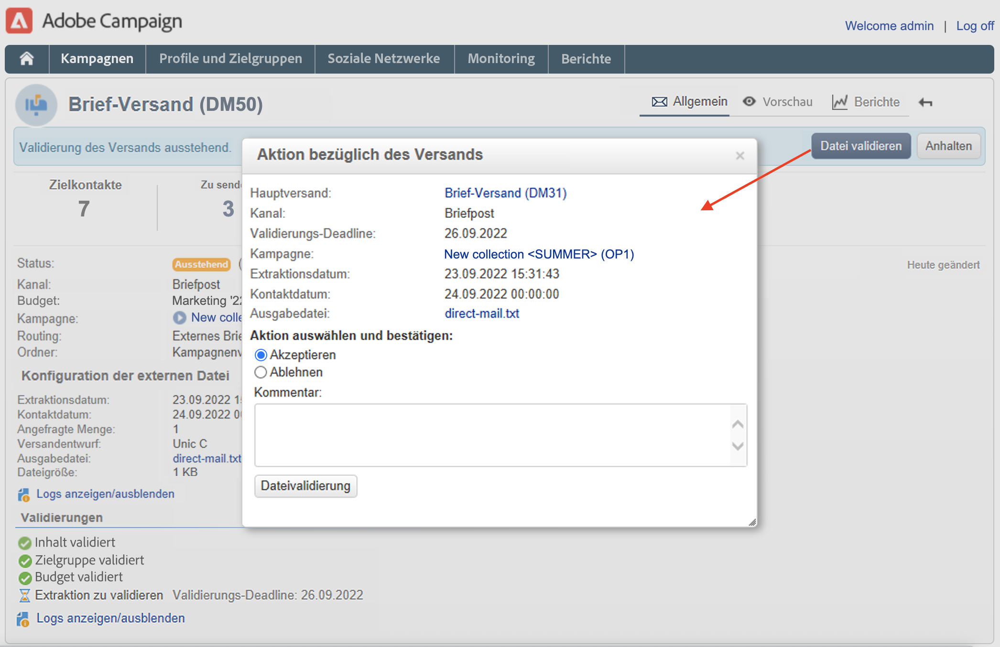

   Sie können vor der Validierung die Ausgabedatei in der Vorschau anzeigen. Die Vorschau der Extraktionsdatei zeigt nur eine Auswahl der Daten. Es wird nicht die gesamte Datei geladen.

* **Validierung der Sendungen**

   Die Option **[!UICONTROL Individuelle Validierung jedes zugeordneten Versands aktivieren]** wird für einen primären Versand verwendet, der mit sekundären Sendungen verknüpft ist. Standardmäßig ist diese Option nicht aktiviert, sodass eine Gesamtvalidierung des Hauptversands durchgeführt werden kann. Wenn diese Option aktiviert ist, muss jeder Versand einzeln validiert werden.

   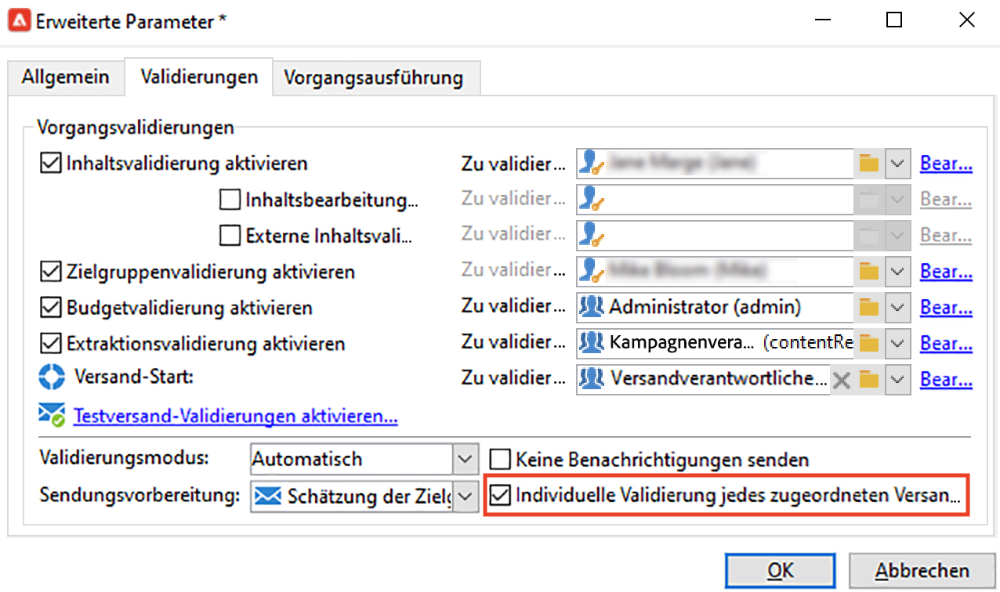

>[!NOTE]
>
>Wenn in einem Zielgruppen-Workflow während der Nachrichtenvorbereitung ein Konfigurationsfehler auftritt, wird der Link **[!UICONTROL Nachrichtenvorbereitung neu starten]** im Dashboard angezeigt. Korrigieren Sie den Fehler und verwenden Sie diesen Link, um die Nachrichtenvorbereitung neu zu starten, wobei der Schritt der Zielgruppenbestimmung übersprungen wird.

### Validieren eines Inhalts {#approve-content}

>[!CAUTION]
>
>Zur Validierung eines Inhalts ist ein Testversandzyklus obligatorisch. Mit Testsendungen können Sie die Anzeige von Informationen sowie Personalisierungsdaten validieren und die Funktionsfähigkeit von Links überprüfen.
>
>Die im Folgenden beschriebenen Funktionen für die Inhaltsvalidierung beziehen sich auf den Testversand.

Es ist möglich, einen Validierungszyklus für Inhalte zu konfigurieren. Wählen Sie dazu im Fenster mit den Validierungseinstellungen die Option **[!UICONTROL Inhaltsvalidierung aktivieren]**. Die Inhaltsvalidierung gliedert sich in folgende Schritte:

1. Nach der Erstellung eines neuen Versands klickt der Kampagnenverantwortliche auf den Link **[!UICONTROL Inhalt unterbreiten]** im Kampagnen-Dashboard, um den Zyklus der Inhaltsvalidierung zu starten.

   >[!NOTE]
   >
   >Wenn im Fenster der Validierungseinstellungen die Option **[!UICONTROL Testversand aktivieren]** (für einen E-Mail-Versand) oder die Option **[!UICONTROL Testversandvalidierung]** (für einen Briefpost-Versand) aktiviert ist, erfolgt der Testversand automatisch.

1. Der Inhaltsverantwortliche wird daraufhin per E-Mail benachrichtigt und entscheidet, ob er den Inhalt validiert oder nicht:

   * über die Benachrichtigungs-E-Mail: Die Benachrichtigungs-E-Mail enthält einen Link zu den bereits erfolgten Testsendungen und möglicherweise zu einer Darstellung der Nachricht für die verschiedenen Webmails, sofern das Add-on **Zustellbarkeit** für diese Instanz aktiviert ist.

   * über die Konsole oder die Web-Schnittstelle, in der Versandverfolgung oder dem Kampagnen- oder Versand-Dashboard. Im Kampagnen-Dashboard kann die Liste der durchgeführten Testsendungen durch Öffnen des Links **[!UICONTROL Inbox Rendering...]** angezeigt werden. Klicken Sie auf das Symbol **[!UICONTROL Details]** rechts von der Liste, um ihren Inhalt anzuzeigen.

1. Der Kampagnenverantwortliche wird per E-Mail darüber benachrichtigt, ob der Inhalt validiert wurde oder nicht. Der Kampagnenverantwortliche kann zu jedem Zeitpunkt den Zyklus der Inhaltsvaldierung neu starten. Öffnen Sie hierzu den Link oberhalb der Zeile **[!UICONTROL Inhaltsstatus]** im Kampagnen-Dashboard (auf Ebene des Versands) und klicken Sie auf **[!UICONTROL Inhaltsvalidierung zurücksetzen, um sie erneut durchzuführen]**.

#### Inhaltsbearbeitung zuweisen {#assign-content-editing}

Diese Option ermöglicht die Bestimmung eines Verantwortlichen für die Inhaltsbearbeitung, zum Beispiel einen Webmaster. Wenn die Option **[!UICONTROL Inhaltsbearbeitung zuweisen]** im Fenster der Validierungseinstellungen aktiviert ist, werden zwischen der Versanderstellung und dem Benachrichtigungsversand an den Inhaltsverantwortlichen mehrere Validierungsetappen hinzugefügt:

1. Nach Erstellung eines neuen Versands klickt der Kampagnenverantwortliche auf den Link **[!UICONTROL Inhaltsbearbeitung unterbreiten]** im Kampagnen-Dashboard, um den Inhaltsbearbeitungszyklus zu starten.

1. Der Verantwortliche der Inhaltsbearbeitung erhält daraufhin eine E-Mail, die ihn über die Inhaltsfreigabe informiert.

1. Er kann sich dann mit der Konsole verbinden, um den Versand zu öffnen und diesen mittels eines vereinfachten Assistenten zu bearbeiten, der die Änderung des Betreffs, der HTML- und Textinhalte sowie die Durchführung von Testsendungen ermöglicht.

   >[!NOTE]
   >
   >Wenn im Fenster der Validierungseinstellungen die Option **[!UICONTROL Testversand aktivieren]** (für einen E-Mail-Versand) oder die Option **[!UICONTROL Testversandvalidierung]** (für einen Briefpost-Versand) aktiviert ist, erfolgt der Testversand automatisch.

1. Nach Beendigung der Bearbeitung kann der Verantwortliche der Inhaltsbearbeitung den Inhalt zur Verfügung stellen.

   Hierfür gibt es folgende Möglichkeiten:

   * den Link **[!UICONTROL Verfügbare Inhalte]** in der Adobe Campaign-Konsole.
   * den Link in der Benachrichtigung.
Der Benutzer kann der Validierung einen Kommentar hinzufügen, bevor er den Inhalt dem Kampagnenverantwortlichen unterbreitet.
Über die Benachrichtigungs-E-Mail kann der Kampagnenverantwortliche den ihm unterbreiteten Inhalt akzeptieren oder ablehnen.

#### Externe Inhaltsvalidierung {#external-content-approval}

Diese Option ermöglicht die Bestimmung eines externen Inhaltsverantwortlichen, der die Darstellung (z. B. die Kohärenz der Kommunikation der Marke oder die angekündigten Tarife) des Versands validiert. Wenn die Option **[!UICONTROL Externe Inhaltsvalidierung]** im Fenster der Validierungseinstellungen aktiviert ist, werden zwischen der Inhaltsvalidierung durch den Inhaltsverantwortlichen und dem Benachrichtigungsversand an den Kampagnenverantwortlichen mehrere Validierungsetappen hinzugefügt:

1. Der externe Inhaltsverantwortliche wird per E-Mail benachrichtigt, sobald der Inhalt intern validiert wurde und die externe Validierung erfolgen muss.
1. Die Benachrichtigungs-E-Mail enthält Links zu den Testsendungen, die der Überprüfung der Darstellung des Versandinhalts dienen, und eine Schaltfläche, über die der Versandinhalt validiert oder abgelehnt werden kann.

Diese Links sind nur verfügbar, wenn eine oder mehrere Testsendungen durchgeführt wurden. Die Darstellung des Versandinhalts kann andernfalls nur über die Konsole oder die Webschnittstelle überprüft werden.

### Validieren einer Extraktionsdatei {#approve-an-extraction-file}

Für Offline-Sendungen erzeugt Adobe Campaign eine Extraktionsdatei, die, je nach Konfiguration, dem Router übermittelt wird. Der Inhalt der Datei hängt von der verwendeten Exportvorlage ab.

Sobald Inhalt, Zielgruppe und Budget validiert sind, erhält der Versand den Status **[!UICONTROL Extraktion ausstehend]**, bis der Extraktions-Workflow für Kampagnen gestartet wird.

Wenn das Datum der Extraktionsanfrage erreicht ist, wird die Extraktionsdatei erstellt und der Versandstatus wird zu **[!UICONTROL Datei zu validieren]**.

Sie können den Inhalt der Extraktionsdatei ansehen, indem Sie auf ihren Titel klicken. Über die verschiedenen Links im Dashboard haben Sie zudem die Möglichkeit, die Datei zu validieren oder bei Bedarf ihr Format zu verändern und die Extraktion erneut durchzuführen.

Nachdem die Datei validiert wurde, können Sie die Benachrichtigungs-E-Mail an den Router senden. [Weitere Informationen](marketing-campaign-deliveries.md#start-an-offline-delivery).

## Validierungsmodi {#approval-modes}

Vorgänge können im Kampagnen-Dashboard, in der Registerkarte zum Versand-Tracking, im Versand-Dashboard oder über die an die Validierungsverantwortlichen gesendete E-Mail-Benachrichtigung validiert werden.

### Im Dashboard validieren {#approval-via-the-dashboard}

Klicken Sie auf den entsprechenden Link im Kampagnen-Dashboard, um einen Vorgang über die Konsole oder die Web-Schnittstelle zu validieren.

Beispielsweise nach Ausführung der Versandanalyse:

1. Wählen Sie **[!UICONTROL Zielgruppe validieren]**.

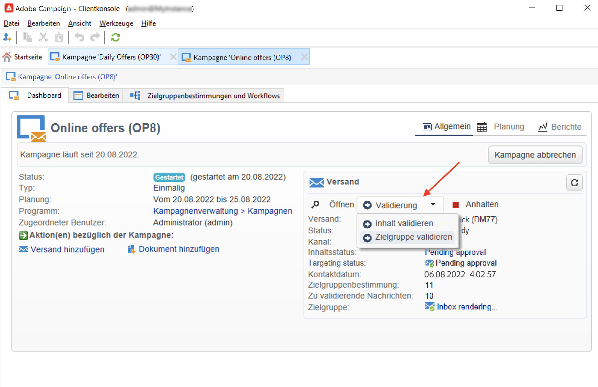

1. Überprüfen Sie im Popup-Fenster die zu validierenden Informationen.
1. Wählen Sie **[!UICONTROL Akzeptieren]** oder **[!UICONTROL Ablehnen]** und verfassen Sie gegebenenfalls einen Kommentar. Dieser Kommentar wird in den Validierungsprotokollen angezeigt.
1. Bestätigen Sie Ihre Auswahl mit der Schaltfläche **[!UICONTROL Zielgruppenvalidierung]**.

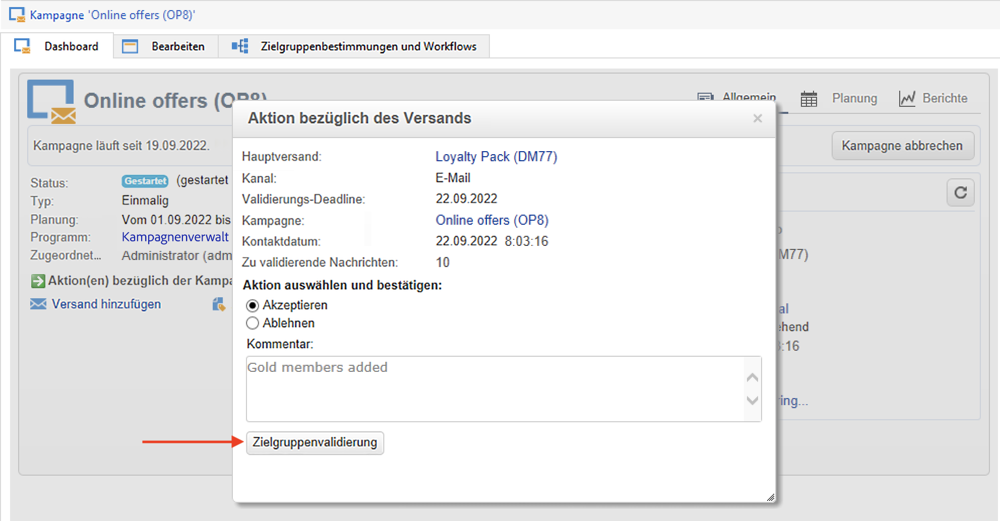

Wenn ein Vorgang bereits von einem anderen Benutzer validiert wurde, ist der Validierungs-Link nicht mehr verfügbar.

Wenn ein Prozess abgelehnt wurde, werden die Informationen im Versand-Dashboard wie folgt angezeigt:

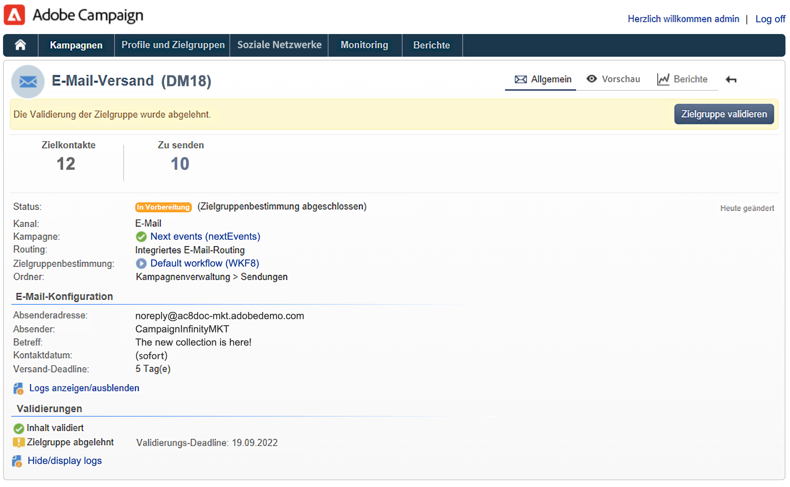

### Über eine Benachrichtigung validieren {#approval-via-notification-messages}

So validieren Sie einen Vorgang über die [Benachrichtigung](#notifications):

1. Klicken Sie auf den Link in der Benachrichtigung.
1. Melden Sie sich bei Adobe Campaign an.
1. Überprüfen Sie die zu validierenden Informationen.
1. Wählen Sie **[!UICONTROL Akzeptieren]** oder **[!UICONTROL Ablehnen]** und verfassen Sie gegebenenfalls einen Kommentar.
1. Validieren Sie den Inhalt. Ihre Auswahl und Ihr Kommentar werden in den Validierungsprotokollen angezeigt.

>[!NOTE]
>
>Wenn der Vorgang Warnungen erzeugt hat, erscheint in der Benachrichtigung ein Warnhinweis.

### Validierung nachverfolgen{#approval-tracking}

In der Benutzeroberfläche sind Validierungsprotokolle verfügbar:

* Im Validierungsprotokoll der Kampagne, Unterregisterkarte **[!UICONTROL Validierungen]** der Registerkarte **[!UICONTROL Bearbeiten > Audit]**:

   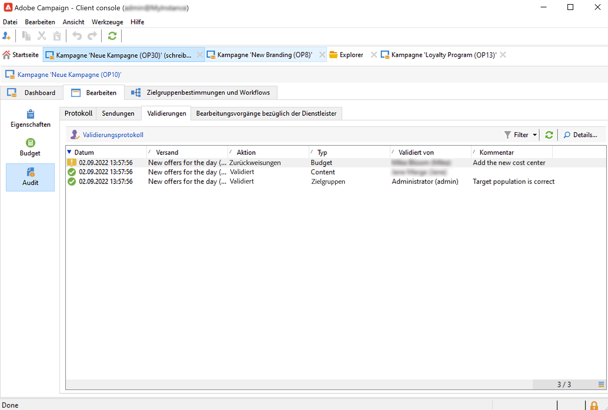

* Im Versandprotokoll der Kampagne, Unterregisterkarte **[!UICONTROL Sendungen]** der Registerkarte **[!UICONTROL Bearbeiten > Audit]**:

   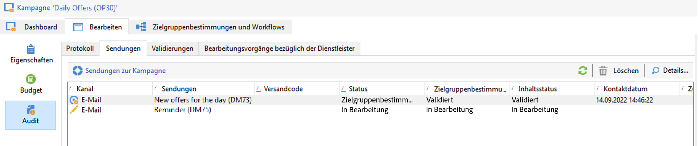

* Der Validierungsstatus jedes Versands kann durch Klicken auf die Option **[!UICONTROL Protokolle ausblenden/anzeigen]** auf der Registerkarte **[!UICONTROL Zusammenfassung]** angezeigt werden.

   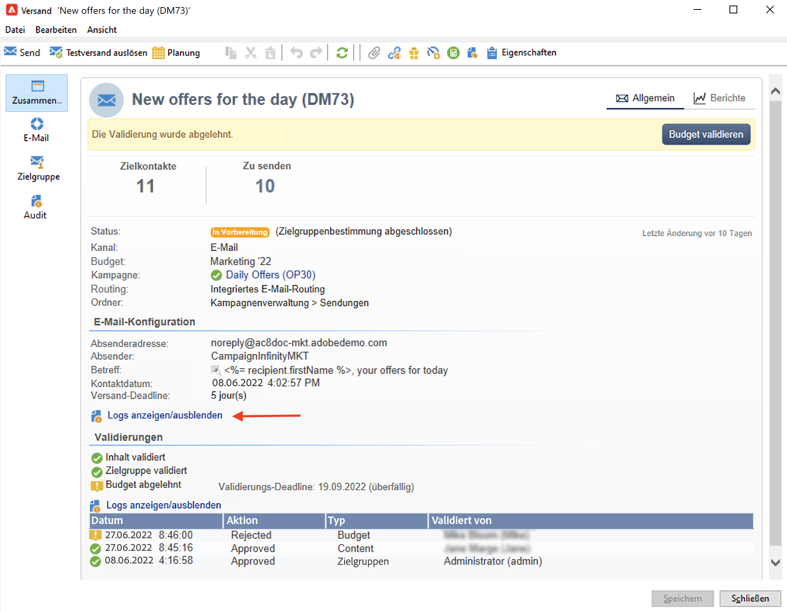

* Diese Informationen sind zudem über die Registerkarte **[!UICONTROL Audit > Validierungen]** jedes Versands zugänglich.

   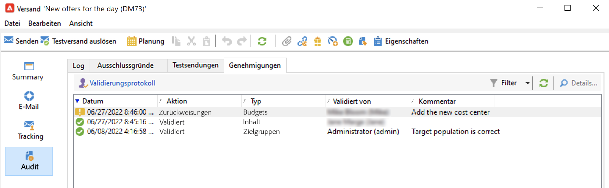

>[!NOTE]
>
>Nachdem ein Vorgang genehmigt oder abgelehnt wurde, können die anderen Validierungsverantwortlichen ihn nicht mehr ändern.

### Automatische/manuelle Validierungen {#automatic-and-manual-approval}

Wenn bei der Erstellung eines Zielgruppen-Workflows die Validierung automatisch erfolgt (Standardmodus), zeigt Adobe Campaign den Validierungs-Link an oder sendet eine Benachrichtigung, sobald eine Validierung erforderlich ist.

Um den Validierungsmodus (manuell oder automatisch) auszuwählen, klicken Sie auf die Registerkarte **[!UICONTROL Bearbeiten > Eigenschaften]** der Kampagne oder der Kampagnenvorlage, dann auf **[!UICONTROL Erweiterte Kampagnenparameter...]** und schließlich auf die Registerkarte **[!UICONTROL Validierungen]**.
par

>[!NOTE]
>
>Der gewählte Validierungsmodus wird auf alle Sendungen der Kampagne angewandt.

Die manuelle Validierung hingegen verhindert bei der Erstellung eines Zielgruppen-Workflows die automatische Generierung von Validierungslinks und den automatischen Versand von Benachrichtigungen. Im Dashboard der Kampagne wird daraufhin der Link **[!UICONTROL Zielgruppe zur Validierung unterbreiten]** verfügbar, um die Validierung manuell zu starten.

Über eine Bestätigungsnachricht können die Validierungen der ausgewählten Prozesse für diesen Versand erlaubt werden.

Daraufhin werden die Validierungsschaltflächen im Dashboard der Kampagne (für diesen Versand), im Dashboard des Versands sowie in der Versandverfolgung angezeigt. Wenn die Benachrichtigungen aktiviert wurden, werden diese parallel versendet.

Diese Art der Validierungsaktivierung ermöglicht es, die Zielbestimmungsrecherchen zu bearbeiten, ohne die validierenden Benutzer fälschlicherweise zu benachrichtigen.

## Benachrichtigungen {#notifications}

Benachrichtigungen sind spezifische E-Mails, die den validierungsverantwortlichen Benutzern gesendet werden, um diese über auf Validierung wartende Prozesse zu informieren. Der in der Nachricht enthaltene Link führt zu einer Webschnittstelle, in der sich der Benutzer identifizieren muss. Nach der Anmeldung kann er die betreffenden Elemente einsehen, den Prozess validieren oder nicht und seine Entscheidung mit einem Kommentar begründen.

Der Inhalt der E-Mail-Benachrichtigungen kann angepasst werden. Siehe [Inhalt der Benachrichtigungen](#notification-content).

### Aktivieren/Deaktivieren von Benachrichtigungen {#enabling-disabling-notification}

Benachrichtigungs-E-Mails werden automatisch versendet, wenn die Validierung des entsprechenden Vorgangs in der Kampagnenvorlage, der Kampagne selbst oder dem betreffenden Versand aktiviert wurde. Die Benachrichtigungen können jedoch auch deaktiviert werden, um nur Validierungen über die Konsole zu erlauben.

Öffnen Sie hierzu das Fenster der Validierungseinstellungen der Kampagne oder der betreffenden Kampagnenvorlage (Registerkarte **[!UICONTROL Bearbeiten > Eigenschaften]** > **[!UICONTROL Erweiterte Kampagnenparameter...]** > **[!UICONTROL Validierungen]**) und wählen Sie **[!UICONTROL Keine Benachrichtigungen senden]**.

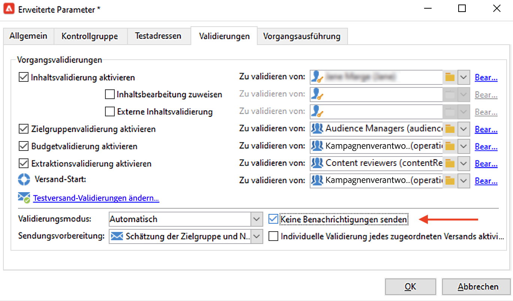

### Inhalt der Benachrichtigungen {#notification-content}

Der Benachrichtigungsinhalt wird in der Vorlage **[!UICONTROL Validierungsbenachrichtigung bezüglich einer Marketingkampage]** festgelegt. Sie können im Ordner **[!UICONTROL Administration > Kampagnen > Vorlagen technischer Sendungen]** des Adobe Campaign-Explorers darauf zugreifen.
