# Verwalten von Assets und Dokumenten {#manage-assets-documents}

Sie können einer Kampagne verschiedene Dokumente zuordnen: Berichte, Fotos, Webseiten, Diagramme usw. Diese Dokumente können in jedem beliebigen Format vorliegen.

In einer Kampagne können Sie auch auf andere Elemente verweisen, z. B. Werbegutscheine, Sonderangebote für eine bestimmte Marke oder einen bestimmten Store usw. Wenn diese Elemente in einem Versandentwurf enthalten sind, können sie mit einem Briefpost-Versand verknüpft werden. [Weitere Informationen](#associating-and-structuring-resources-linked-via-a-delivery-outline).

>[!CAUTION]
>
>Diese Funktion ist für kleine Assets und Dokumente vorgesehen.

<!--
>[!NOTE]
>
>If you are using Campaign Marketing Resource Management module, you can also manage a library of marketing resources that are available for several users for collaborative work. [Learn more](../../mrm/using/managing-marketing-resources.md).
-->

## Dokumente hinzufügen {#add-documents}

Dokumente können auf Kampagnenebene (kontextuelle Dokumente) oder Programmebene (allgemeine Dokumente) zugeordnet werden.

Für eine Kampagne enthält die Registerkarte **[!UICONTROL Dokumente]**:

* Die Liste aller für den Inhalt erforderlichen Dokumente (Vorlage, Bilder usw.) die von Adobe Campaign-Benutzern mit entsprechenden Berechtigungen lokal heruntergeladen werden können,
* Informationen für den Router enthaltende Dokumente, wenn vorhanden.

Die Dokumente werden über den Tab **[!UICONTROL Bearbeiten > Dokumente]** einem Programm oder einer Kampagne zugeordnet.

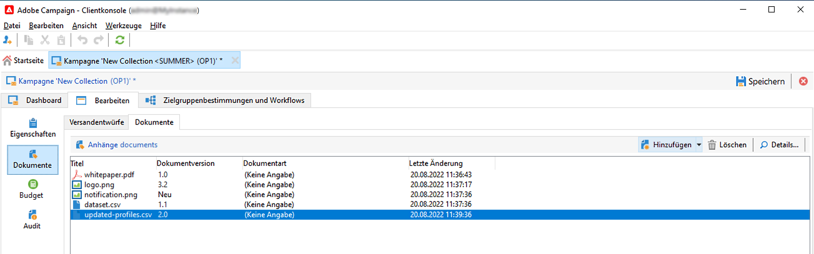

Es besteht darüber hinaus die Möglichkeit, Dokumente über den entsprechenden Link im Dashboard zu einer Kampagne hinzuzufügen.

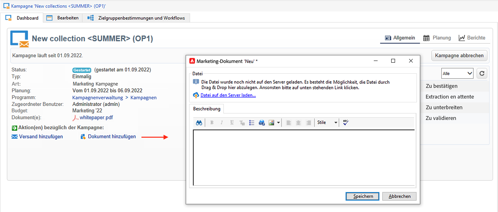

Klicken Sie auf das Symbol **[!UICONTROL Detail...]**, um den Inhalt einer Datei anzusehen und ergänzende Informationen hinzuzufügen.

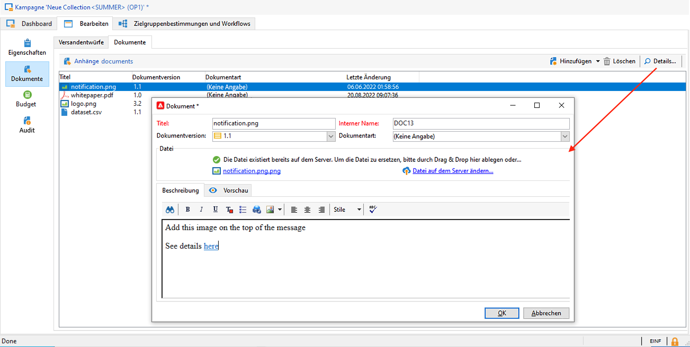

Im Abschnitt **[!UICONTROL Dokument(e)]** des Kampagnen-Dashboards werden alle der Kampagne zugeordneten Dokumente aufgelistet, wie im folgenden Beispiel:

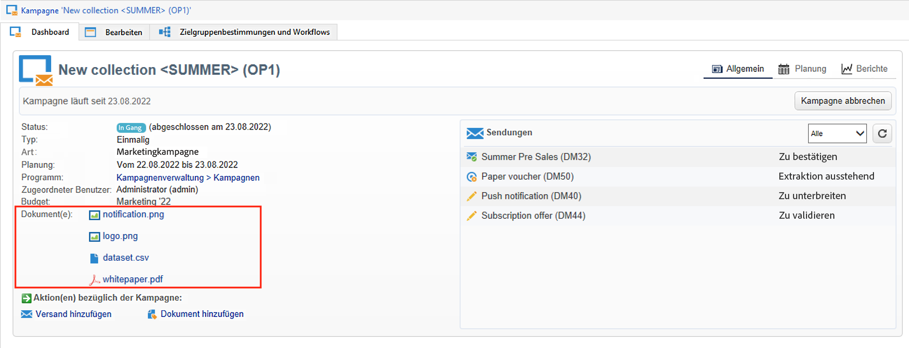

Über die Links können die Dokumente geöffnet und bearbeitet werden.

## Verwenden von Versandentwürfen {#delivery-outlines}

Ein Versandentwurf besteht aus einem strukturierten Satz von Elementen (Dokumente, Geschäfte, Werbegutscheine usw.), vom Unternehmen und für eine bestimmte Kampagne erstellt. Er wird im Zusammenhang mit Briefpost-Sendungen verwendet.

Diese Elemente sind in Versandentwürfen gruppiert und jedem Versandentwurf wird ein Versand zugeordnet. Auf diesen Versand wird in der an den **Dienstleister** gesendeten Extraktionsdatei verwiesen, um an den Versand angehängt zu werden. Sie können beispielsweise einen Versandentwurf erstellen, der sich auf eine Unternehmenseinheit und die von ihr verwendeten Marketing-Prospekte bezieht.

Versandentwürfe ermöglichen es, für eine Kampagne externe Elemente zu strukturieren und nach bestimmten Kriterien zu einem Versand hinzuzufügen: entsprechende Filiale, Sonderangebot, Einladung zu einem lokalen Event usw.

>[!CAUTION]
>
>Versandentwürfe sind auf Briefpost-Kampagnen beschränkt.

### Erstellen eines Versandentwurfs {#create-an-outline}

Um einen Versandentwurf zu erstellen, klicken Sie auf die Unterregisterkarte **[!UICONTROL Versandentwürfe]** auf der Registerkarte **[!UICONTROL Bearbeiten > Dokumente]** der betreffenden Kampagne.

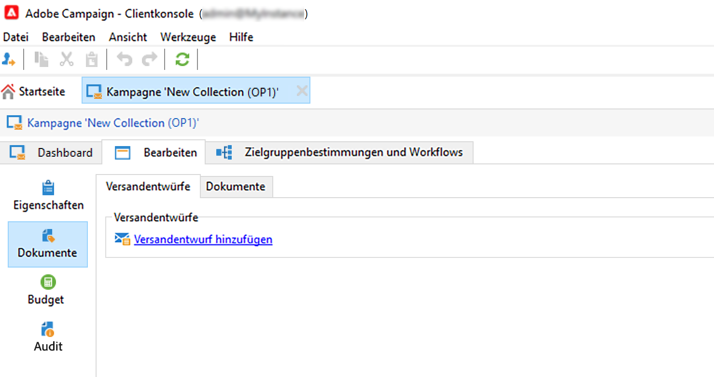

>[!NOTE]
>
>Wenn diese Registerkarte nicht angezeigt wird, ist diese Funktion für diese Kampagne nicht verfügbar oder der Briefpost-Versand ist in Ihrer Instanz nicht aktiviert. Weitere Informationen finden Sie im Abschnitt [Kampagnenvorlagenkonfiguration](marketing-campaign-templates.md#campaign-templates) oder in Ihrem Lizenzvertrag.

Klicken Sie anschließend auf **[!UICONTROL Versandentwurf hinzufügen]**. Es wird ein Navigationsbaum für die Kampagne erstellt:

1. Machen Sie einen Rechtsklick auf den Wurzelknoten und wählen Sie **[!UICONTROL Neu > Versandentwürfe]** aus, um einen neuen Versandentwurf hinzuzufügen.
1. Machen Sie einen Rechtsklick auf den soeben erstellten Versandentwurf und wählen Sie beispielsweise **[!UICONTROL Neu > Artikel]** oder **[!UICONTROL Neu > Personalisierungsfelder]** aus.

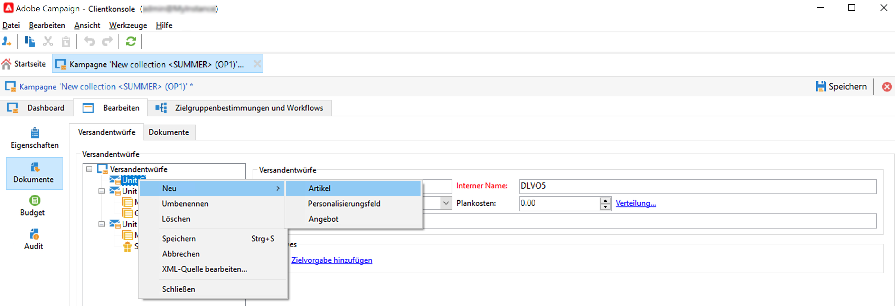

Ein Versandentwurf kann Artikel, Personalisierungsfelder und Angebote enthalten:

* Artikel sind beispielsweise physische Dokumente, die an dieser Stelle referenziert und beschrieben und schließlich dem Versand angehängt werden.
* Personalisierungsfelder ermöglichen es Ihnen, Personalisierungselemente zu erstellen, die sich auf Sendungen und nicht auf Empfangende beziehen. So ist es möglich, Werte zu erstellen, die in Sendungen für eine bestimmte Zielgruppe verwendet werden (Willkommensangebot, Rabatt usw.) Sie werden in Adobe Campaign erstellt und über den Link **[!UICONTROL Personalisierungsfelder importieren…]** in den Versandentwurf importiert.

  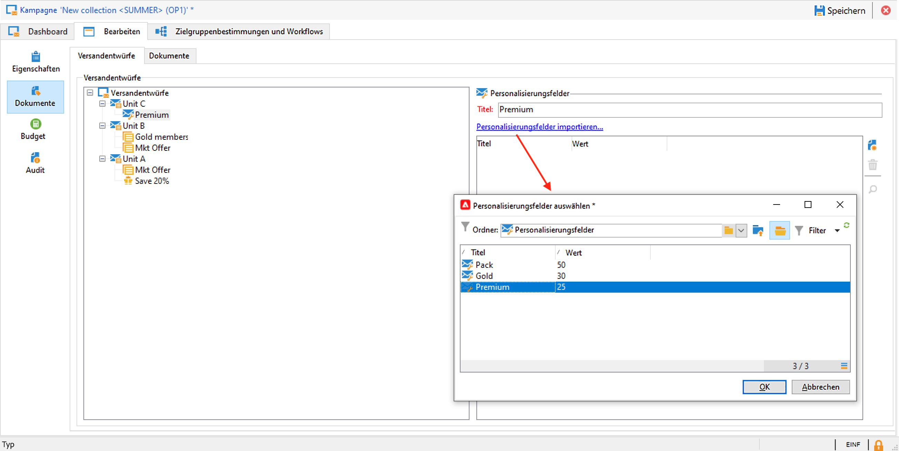

  Über das Symbol **[!UICONTROL Hinzufügen]** rechts vom Bereich der Liste können in dem Entwurf auch direkt Personalisierungselemente erstellt werden.

  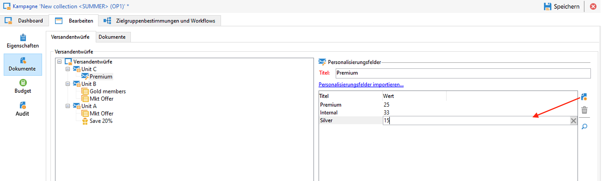

### Auswählen eines Versandentwurfs {#select-an-outline}

Sie können für jeden Versand über den Bereich der Extraktionskonfiguration einen Entwurf auswählen, wie im folgenden Beispiel:

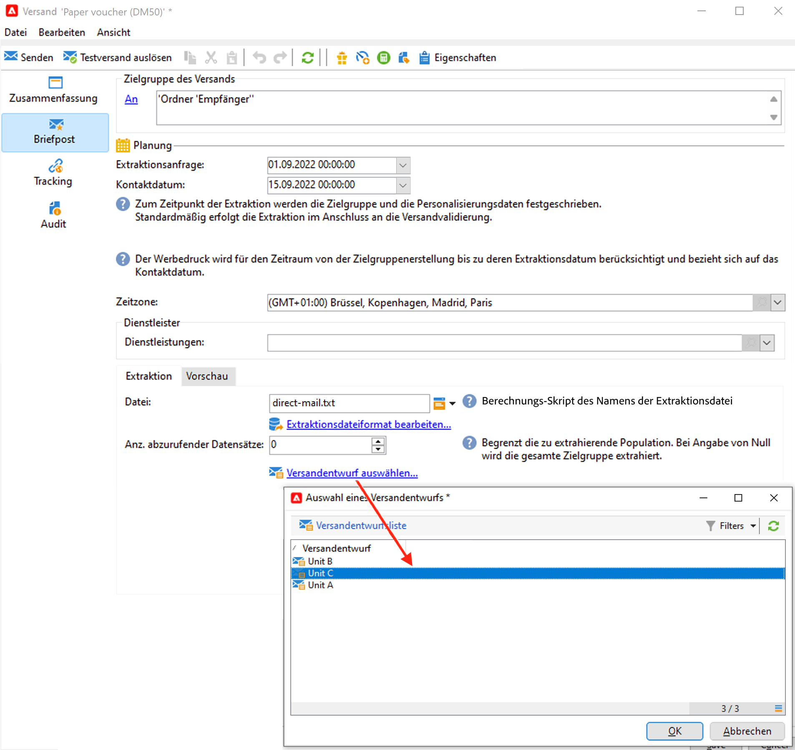

Der ausgewählte Umriss wird dann im unteren Bereich des Fensters angezeigt. Sie kann über das Symbol rechts neben dem Feld oder über die Dropdown-Liste bearbeitet werden:

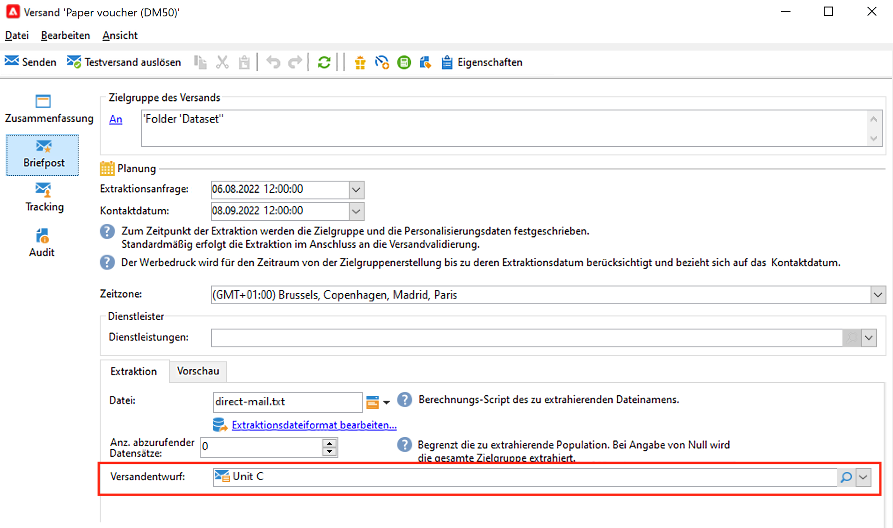

Diese Information wird ebenfalls im Tab **[!UICONTROL Zusammenfassung]** des Versands angezeigt:

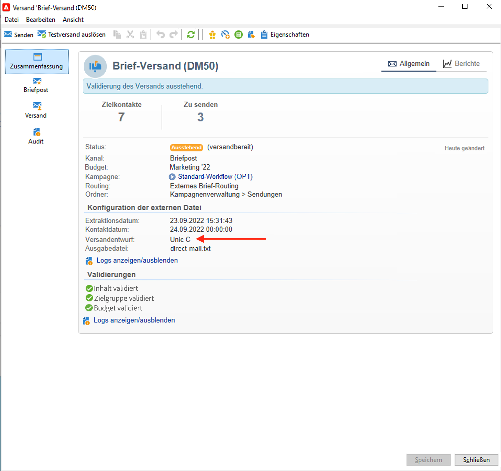

### Extraktionsergebnis {#extraction-result}

in der extrahierten und an den Dienstleister gesendeten Datei den Namen des Versandentwurfs und gegebenenfalls seine Merkmale (Kosten, Beschreibung usw.) werden dem Inhalt entsprechend den Informationen in der Exportvorlage hinzugefügt, die mit dem Dienstleister verknüpft ist.

Im folgenden Beispiel werden der Titel, die Plankosten sowie die Beschreibung des dem Versand zugeordneten Entwurfs der Extraktionsdatei hinzugefügt.

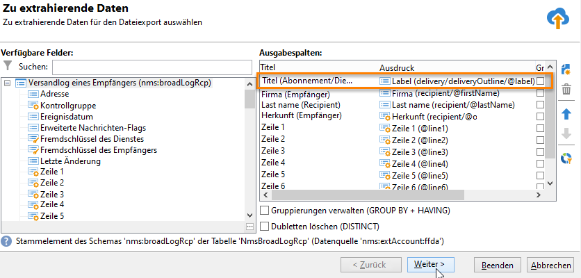

Die Exportvorlage muss dem gewählten Dienstleister für den betreffenden Versand zugeordnet sein. Siehe [diesen Abschnitt](providers-stocks-and-budgets.md#creating-service-providers-and-their-cost-structures).
