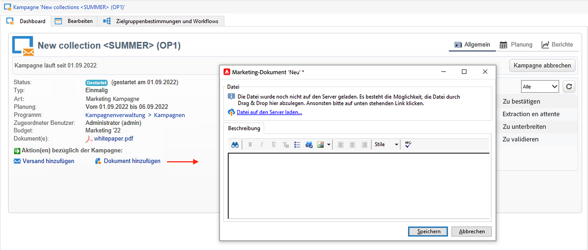

# Verwalten von Assets und Dokumenten {#manage-assets-documents}

Sie können einer Kampagne verschiedene Dokumente zuordnen: Berichte, Fotos, Webseiten, Diagramme usw. Diese Dokumente können in jedem beliebigen Format vorliegen.

In einer Kampagne können Sie auch auf andere Elemente verweisen, wie z. B. Werbegutscheine oder Sonderangebote in Bezug auf eine bestimmte Marke oder ein bestimmtes Geschäft usw. Wenn diese Elemente in einem Entwurf enthalten sind, können sie einem Briefpost-Versand zugeordnet werden. [Weitere Informationen](#associating-and-structuring-resources-linked-via-a-delivery-outline).

>[!CAUTION]
>
>Diese Funktion wurde für kleine Assets und Dokumente entwickelt.

<!--
>[!NOTE]
>
>If you are using Campaign Marketing Resource Management module, you can also manage a library of marketing resources that are available for several users for collaborative work. [Learn more](../../mrm/using/managing-marketing-resources.md).
-->

## Dokumente hinzufügen {#add-documents}

Dokumente können einer Kampagne (kontextrelevante Dokumente) oder einem Programm (allgemeine Dokumente) zugeordnet werden.

Bei Kampagnen wird die Variable **[!UICONTROL Dokumente]** enthält:

* die Liste aller für den Inhalt notwendigen Dokumente (Vorlagen, Bilder usw.), die von berechtigten Adobe-Campaign-Benutzern lokal heruntergeladen werden können;
* Informationen für den Router enthaltende Dokumente, wenn vorhanden.

Die Dokumente werden über den Tab **[!UICONTROL Bearbeiten > Dokumente]** einem Programm oder einer Kampagne zugeordnet.

Sie können einer Kampagne auch über den entsprechenden Link im Dashboard ein Dokument hinzufügen.

Klicken Sie auf **[!UICONTROL Detail..]** -Symbol, um den Inhalt einer Datei anzuzeigen und Informationen hinzuzufügen:

Im Abschnitt **[!UICONTROL Dokument(e)]** des Kampagnen-Dashboards werden alle der Kampagne zugeordneten Dokumente aufgelistet, wie im folgenden Beispiel:

Über die Links können die Dokumente geöffnet und bearbeitet werden.

## Versandentwürfe verwenden {#delivery-outlines}

Ein Versandentwurf ist strukturiert aus Elementen (Dokumenten, Geschäften, Gutscheinen usw.) der vom Unternehmen für eine bestimmte Kampagne erstellt wurde. Sie wird im Zusammenhang mit Briefpost-Sendungen verwendet.

Diese Elemente sind in Versandentwürfen gruppiert und jedem Versandentwurf wird ein Versand zugeordnet. Auf diesen Versand wird in der an den **Dienstleister** gesendeten Extraktionsdatei verwiesen, um an den Versand angehängt zu werden. Sie können beispielsweise einen Versandentwurf erstellen, der sich auf eine Einheit und die verwendeten Marketingbroschüren bezieht.

Versandentwürfe ermöglichen es, für eine Kampagne externe Elemente zu strukturieren, die dem Versand nach bestimmten Kriterien zugeordnet werden: verwandte Einheit, erteiltes Werbeangebot, Einladung zu einer lokalen Veranstaltung usw.

>[!CAUTION]
>
>Versandentwürfe sind auf Briefpost-Kampagnen beschränkt.

### Versandentwurf erstellen {#create-an-outline}

Um einen Versandentwurf zu erstellen, klicken Sie auf die Schaltfläche **[!UICONTROL Versandentwürfe]** Unterregisterkarte im **[!UICONTROL Bearbeiten > Dokumente]** der betreffenden Kampagne.

>[!NOTE]
>
>Wenn dieser Tab nicht angezeigt wird, ist diese Funktion für diese Kampagne nicht verfügbar oder der Briefpost-Versand ist in Ihrer Instanz nicht aktiviert. Siehe Abschnitt [Kampagnenvorlagenkonfiguration](marketing-campaign-templates.md#campaign-templates) oder Ihrem Lizenzvertrag.

Klicken Sie anschließend auf **[!UICONTROL Versandentwurf hinzufügen]**. Es wird ein Navigationsbaum für die Kampagne erstellt:

1. Machen Sie einen Rechtsklick auf den Wurzelknoten und wählen Sie **[!UICONTROL Neu > Versandentwürfe]** aus, um einen neuen Versandentwurf hinzuzufügen.
1. Machen Sie einen Rechtsklick auf den soeben erstellten Versandentwurf und wählen Sie beispielsweise **[!UICONTROL Neu > Artikel]** oder **[!UICONTROL Neu > Personalisierungsfelder]** aus.

Ein Entwurf kann Elemente, Personalisierungsfelder und Angebote enthalten:

* Artikel sind beispielsweise physische Dokumente, die an dieser Stelle referenziert und beschrieben und schließlich dem Versand angehängt werden.
* Personalisierungsfelder ermöglichen die Erstellung von mit Sendungen (und nicht Empfängern) verbundenen Personalisierungselementen. So können Werte erstellt werden, die in Sendungen mit einer spezifischen Zielgruppe verwendet werden (z. B. Willkommensangebot, prozentuale Ermäßigung). Sie werden in Adobe Campaign erstellt und über den Link **[!UICONTROL Personalisierungsfelder importieren...]** in den jeweiligen Entwurf importiert.

   

   Über das Symbol **[!UICONTROL Hinzufügen]** rechts vom Bereich der Liste können dem Entwurf auch direkt Personalisierungselemente hinzugefügt werden.

   

### Auswählen eines Versandentwurfs {#select-an-outline}

Sie können für jeden Versand über den Bereich der Extraktionskonfiguration einen Entwurf auswählen, wie im folgenden Beispiel:

Der ausgewählte Entwurf wird daraufhin im unteren Abschnitt des Fenster angezeigt. Er kann über das rechts vom Feld gelegene Lupensymbol geöffnet oder über die Dropdown-Liste durch einen anderen ersetzt werden:

Diese Information wird ebenfalls im Tab **[!UICONTROL Zusammenfassung]** des Versands angezeigt:

### Extraktionsergebnis {#extraction-result}

In der dem Dienstleister übermittelten Extraktionsdatei werden der Name des Entwurfs sowie gegebenenfalls seine Eigenschaften (Kosten, Beschreibung usw.) dem Inhalt hinzugefügt, entsprechend der Informationen in der Exportvorlage, die dem Dienstleister zugeordnet wurde.

Im folgenden Beispiel werden der Titel, die Plankosten sowie die Beschreibung des dem Versand zugeordneten Entwurfs der Extraktionsdatei hinzugefügt.

Die Exportvorlage muss dem gewählten Dienstleister für den betreffenden Versand zugeordnet sein. Siehe [diesen Abschnitt](providers--stocks-and-budgets.md#creating-service-providers-and-their-cost-structures).
