# Erstellen von Programmen und Kampagnen{#create-programs-and-campaigns}

Komponenten für die Kampagnenorchestrierung finden Sie auf der Registerkarte **[!UICONTROL Kampagnen]**. Hier können Sie einen Überblick über die Marketing-Programme und -Kampagnen und die damit verbundenen Elemente erhalten.

Ein Marketing-Programm besteht aus Kampagnen, die aus Sendungen, Ressourcen usw. zusammengesetzt sind. In der Kampagne werden alle Informationen zu Sendungen, Budgets, Validierungsverantwortlichen und verknüpften Dokumenten zusammengefasst.

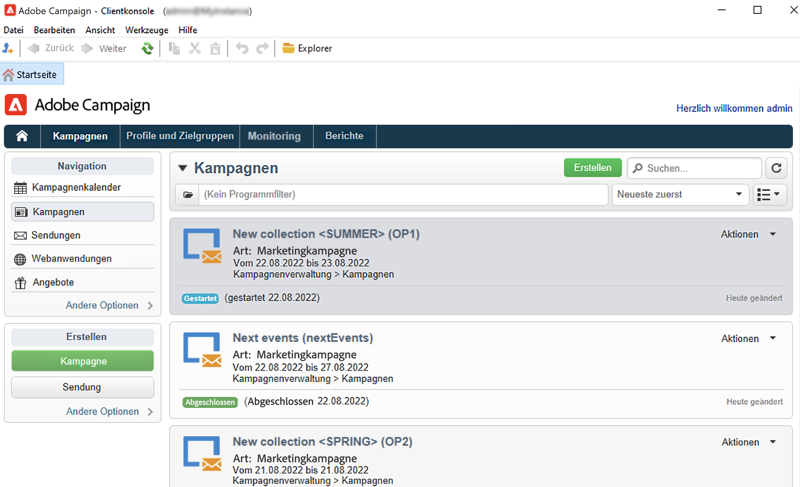

 [Entdecken Sie Programme und Kampagnen im Video](#video)

## Arbeiten mit Programmen und Plänen{#work-with-plan-and-program}

### Erstellen der Plan- und Programmhierarchie {#create-plan-and-program}

Jede Kampagne gehört zu einem Programm, das wiederum zu einem Plan gehört. Der Zugriff auf Pläne, Programme und Kampagnen erfolgt über das Menü **[!UICONTROL Kampagnenkalender]** im Tab **Kampagnen**.

Bevor Sie mit der Erstellung Ihrer Kampagnen und Sendungen beginnen, konfigurieren Sie Ihre Ordnerhierarchie für Marketing-Pläne und -Programme.

1. Klicken Sie auf das **Explorer-** Symbol auf der Startseite.
1. Klicken Sie mit der rechten Maustaste auf den Ordner, in dem Sie Ihren Plan erstellen möchten.
1. Wählen Sie **Ordner hinzufügen > Kampagnenverwaltung > Plan** aus.

   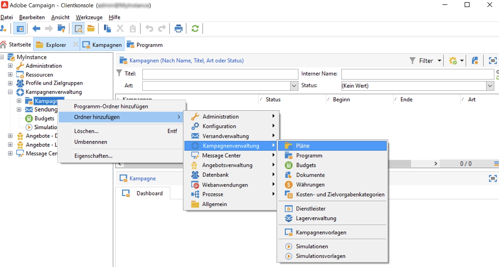

1. Benennen Sie den Plan.
1. Klicken Sie mit der rechten Maustaste auf den neu erstellen Plan und wählen Sie **Eigenschaften...**.
1. Passen Sie im Tab **Allgemein** die Option **Interner Name** an, um bei Package-Exporten Duplikate zu vermeiden.

   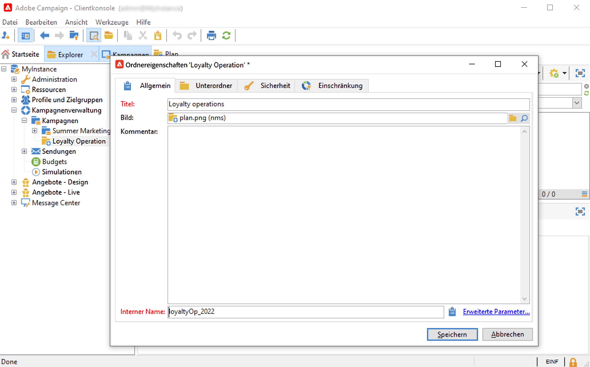

1. Wählen Sie **Speichern** aus.
1. Klicken Sie mit der rechten Maustaste auf den neu erstellen Plan und wählen Sie **Programm-Ordner hinzufügen**.

   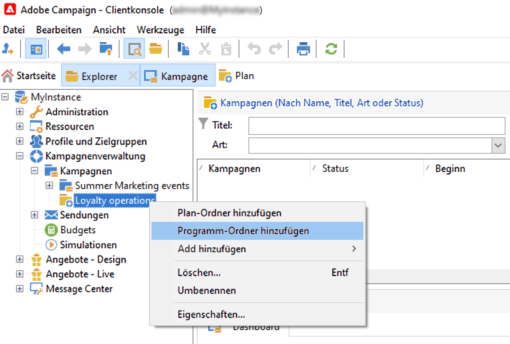

1. Wiederholen Sie die obigen Schritte, um Ihren neuen Programmordner und seinen internen Namen umzubenennen.

### Konfigurieren eines Programms {#edit-a-program}

Zur Konfiguration und Bearbeitung eines Programms stehen die folgenden Registerkarten zur Verfügung:

* In der Registerkarte **Planung** können Sie den Programmkalender nach Monat, Woche oder Tag anzeigen lassen, indem Sie auf den jeweiligen Tab klicken. Auf dieser Seite können Sie eine Kampagne, ein Programm oder eine Aufgabe erstellen. [Weitere Informationen](#campaign-calendar)

* Über die Registerkarte **Bearbeiten** kann das Programm konfiguriert und verändert werden (Name, Beginn und Ende, Budget, verknüpfte Dokumente usw.).

   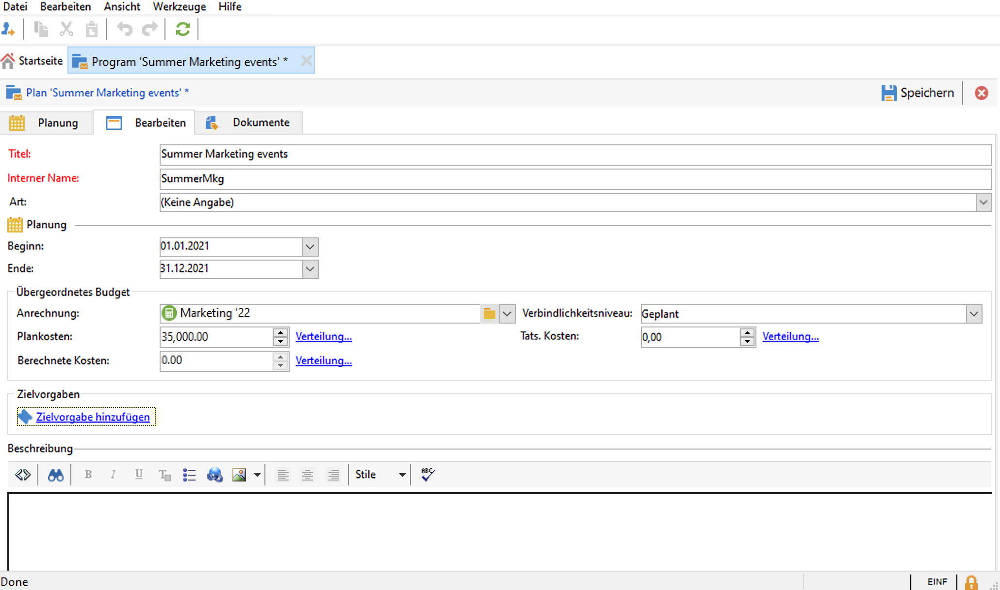

## Arbeiten mit Kampagnen{#work-with-campaigns}

### Erstellen einer Kampagne {#create-a-campaign}

Sie können eine Kampagne über die Kampagnenliste erstellen. Um diese Ansicht anzuzeigen, wählen Sie das Menü **[!UICONTROL Kampagnen]** im **[!UICONTROL Kampagnen]**-Dashboard und klicken Sie auf **[!UICONTROL Erstellen]**.

Im Feld **[!UICONTROL Programm]** können Sie das Programm auswählen, dem die Kampagne zugeordnet werden soll. Diese Information muss angegeben werden.

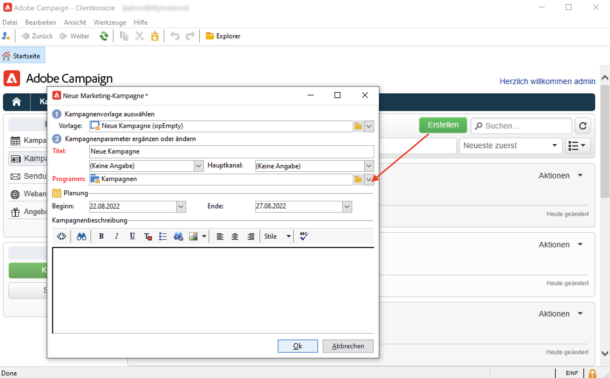

Kampagnen können auch über den Kampagnen- oder Programmkalender erstellt werden. [Weitere Informationen](#campaign-calendar)

Wählen Sie im Fenster zur Kampagnenerstellung die Kampagnenvorlage aus und fügen Sie einen Namen und eine Beschreibung der Kampagne hinzu. Sie können auch das Anfangs- und Enddatum der Kampagne angeben.

Klicken Sie auf **[!UICONTROL OK]**, um die Kampagne zu erstellen. Sie wird zum Programmkalender und zur Kampagnenliste hinzugefügt.

Sie können anschließend die soeben erstellte Kampagne bearbeiten und ihre Parameter festlegen. Um diese Kampagne zu öffnen und zu konfigurieren, haben Sie folgende Möglichkeiten:

1. Über den Kampagnenkalender können Sie die gewünschte Kampagne auswählen und auf den Link **[!UICONTROL Öffnen]** klicken.
1. Durchsuchen Sie die Registerkarte **[!UICONTROL Zeitplan]** des Programms, wählen Sie die Kampagne aus und öffnen Sie sie.
1. Durchsuchen Sie die Kampagnenliste und klicken Sie auf den Namen der zu bearbeitenden Kampagne.

Mit all diesen Aktionen gelangen Sie jeweils zum Kampagnen-Dashboard.

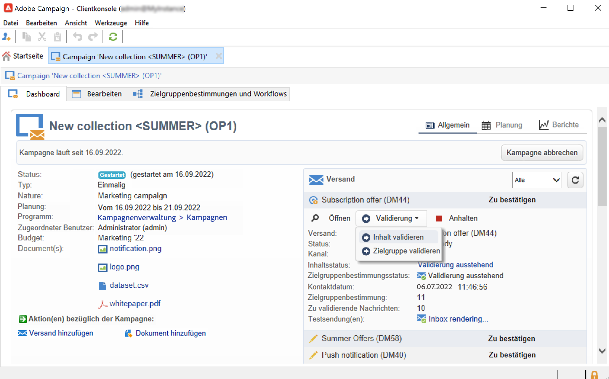

In den folgenden Abschnitten erfahren Sie, wie Sie Ihre Kampagne konfigurieren:

* [Hinzufügen von Sendungen](marketing-campaign-deliveries.md)
* [Verwalten von Assets und Dokumenten](marketing-campaign-assets.md)
* [Erstellen der Zielgruppe](marketing-campaign-target.md)
* [Einrichten des Validierungsprozesses](marketing-campaign-approval.md)
* [Verwalten von Lagern und Budgets](providers--stocks-and-budgets.md)

### Bearbeiten von Kampagneneinstellungen {#campaign-settings}

Kampagnen werden über Kampagnenvorlagen erstellt. Sie können wiederverwendbare Vorlagen verwenden, in denen einige Optionen ausgewählt werden können und andere Einstellungen bereits gespeichert sind.

Für jede Kampagne stehen folgende Funktionen zur Verfügung:

* Referenzdokumente und -ressourcen: Sie können die Kampagne mit Dokumenten verknüpfen (Kurzbeschreibung, Bericht, Bilder etc.). Alle Dokumentenformate werden unterstützt. [Weitere Informationen](marketing-campaign-deliveries.md#manage-associated-documents).
* Kosten definieren: Adobe Campaign ermöglicht es, für jede Kampagne Kosteneinträge und Kostenberechnungsstrukturen zu definieren, die bei der Erstellung der Marketing-Kampagne verwendet werden können. Beispiel: Druckkosten, Nutzung einer externen Agentur, Raummiete usw. [Weitere Informationen](providers--stocks-and-budgets.md#defining-cost-categories).
* Definition von Zielen: Sie können quantifizierbare Ziele für eine Kampagne definieren, z. B. die Anzahl der Abonnenten, das Geschäftsvolumen etc. Diese Informationen werden später in Kampagnenberichten verwendet.
* Verwalten Sie Testadressen und Kontrollgruppen. [Weitere Informationen](marketing-campaign-deliveries.md#defining-a-control-group).
* Validierungsverwaltung: Sie können die zu validierenden Vorgänge sowie bei Bedarf validierungsverantwortliche Benutzer oder Benutzergruppen auswählen. [Weitere Informationen](marketing-campaign-approval.md#checking-and-approving-deliveries).

>[!NOTE]
>
>Um auf die Kampagneneinstellungen zuzugreifen und sie zu aktualisieren, navigieren Sie auf der Registerkarte **[!UICONTROL Bearbeiten]** zu **[!UICONTROL Erweiterte Kampagnenparameter...]**.

### Überwachen einer Kampagne {#monitor-a-campaign}

Für jede Kampagne werden Vorgänge, Ressourcen und Sendungen in einem Dashboard zusammengefasst dargestellt. Auf dieser Benutzeroberfläche können Sie Marketing-Aktionen verwalten und koordinieren.

Adobe Campaign ermöglicht den Einsatz kollaborativer Prozesse zur Ausführung und Validierung der unterschiedlichen Etappen Ihrer Kampagnen, darunter die Budget-, Zielgruppen- und Inhaltsvalidierung. Diese Orchestrierung wird in [diesem Abschnitt](marketing-campaign-approval.md) genau beschrieben.

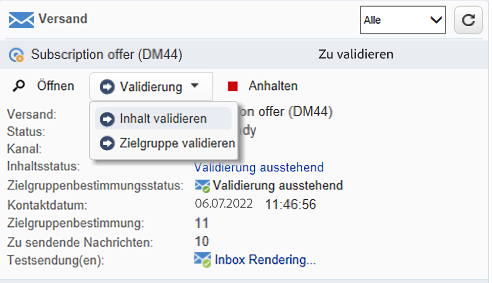

>[!NOTE]
>
>Welche Komponenten in einer Kampagne verfügbar sind, hängt von ihrer Vorlage ab. Die Konfiguration von Kampagnenvorlagen wird in [diesem Abschnitt](marketing-campaign-templates.md#campaign-templates) erläutert.

Sobald die Kampagne abgeschlossen ist, können Sie über den Link **[!UICONTROL Berichte]** auf die Kampagnenberichte zugreifen.

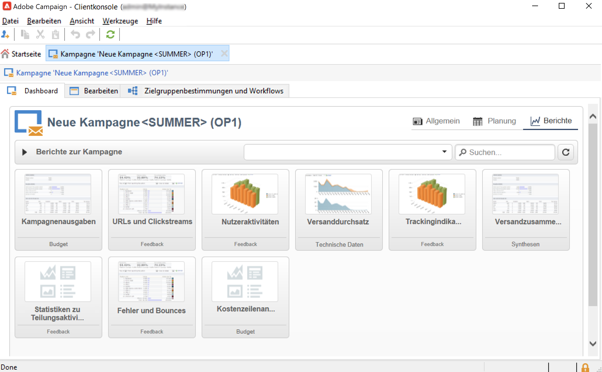

## Kampagnenkalender {#campaign-calendar}

Der Kampagnenkalender zeigt alle Programme, Pläne, Kampagnen und Sendungen an.

Um einen Plan, ein Programm, eine Kampagne oder einen Versand zu bearbeiten, navigieren Sie im Kalender zu dem entsprechenden Namen und verwenden Sie dann den Link **[!UICONTROL Öffnen]**. Es öffnet sich eine neue Registerkarte, die folgendermaßen aussieht:

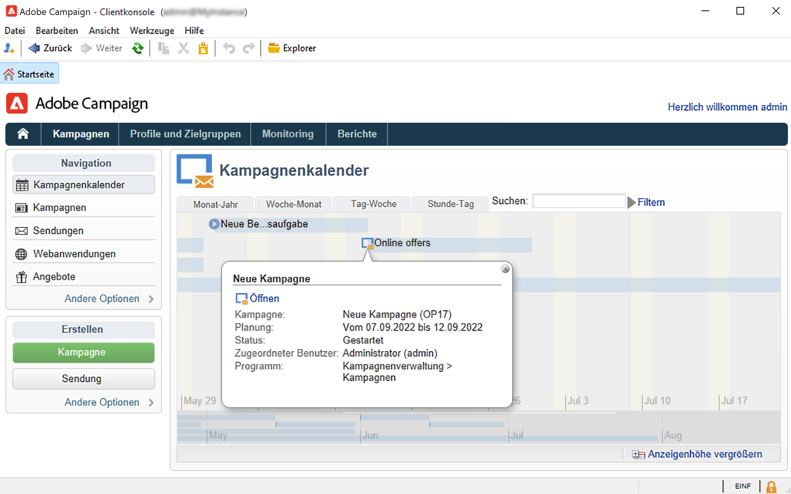

Sie haben die Möglichkeit, die im Kampagnenkalender angezeigten Informationen zu filtern. Klicken Sie hierzu auf den Link **[!UICONTROL Filtern]** und wählen Sie die gewünschten Kriterien aus.

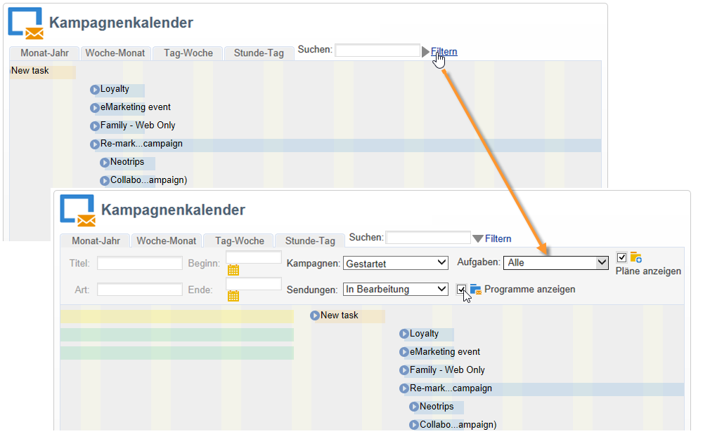

>[!NOTE]
>
>Wenn Sie nach einem Datum filtern, werden alle Kampagnen angezeigt, deren Startdatum nach dem angegebenen Datum liegt und/oder deren Enddatum vor dem angegebenen Datum liegt. Datumsangaben werden in den Kalendern rechts von jedem Feld ausgewählt.

Sie können zur Filterung der angezeigten Elemente auch das Feld **[!UICONTROL Suchen]** verwenden.

Die den Elementen zugeordneten Symbole geben Auskunft über ihren jeweiligen Status: Abgeschlossen, In Gang, In Bearbeitung usw.

Um nur bestimmte Kampagnen anzuzeigen, klicken Sie auf **[!UICONTROL Filtern]** und wählen Sie den Status der gesuchten Kampagnen aus.

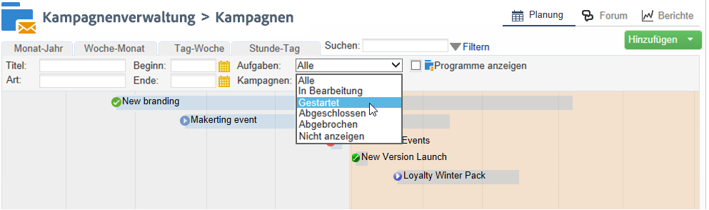

Beim Durchsuchen des Kalenders können Sie auch ein Programm oder eine Kampagne erstellen.

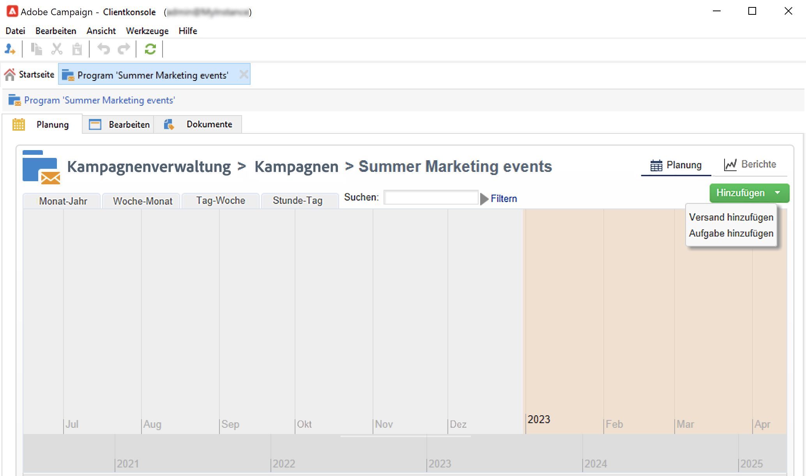

Wenn Sie eine Kampagne im Tab **[!UICONTROL Planung]** eines Programms erstellen, wird die Kampagne dem jeweiligen Programm automatisch hinzugefügt. Das Feld **[!UICONTROL Programm]** wird in diesem Fall ausgeblendet.

## Verwenden der Web-Schnittstelle {#use-the-web-interface-}

Sie haben die Möglichkeit, über einen Webbrowser auf die Adobe-Campaign-Konsole zuzugreifen, um alle Kampagnen und ihre Sendungen sowie Berichte und Informationen bezüglich der Profile Ihrer Datenbank einzusehen. Über den Webzugriff können keine Datensätze erstellt werden. Sie können jedoch eingesehen und entsprechend der jeweiligen Benutzerberechtigungen weiterverarbeitet werden. So können beispielsweise Inhalte und Zielgruppen der Kampagnen validiert oder Sendungen unterbrochen werden.

1. Melden Sie sich wie gewohnt über https://`<your instance>:<port>/view/home` an.
1. Über die unterschiedlichen Rubriken besteht Zugriff auf Listen und weitere Navigationselemente.

   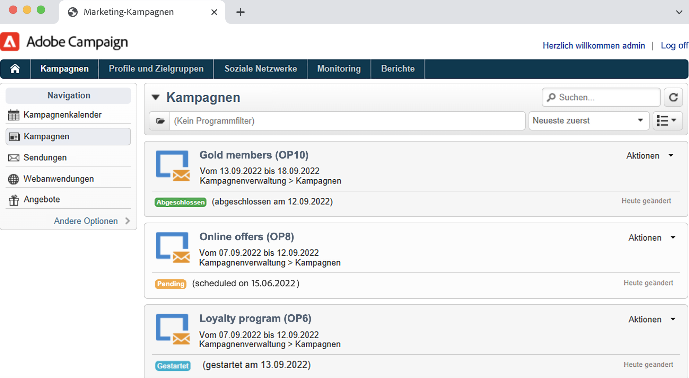

Neben dem Navigieren durch und Ansehen von Kampagnen können Sie auch die folgenden Aufgaben ausführen:

* Überwachen von Aktivitäten in einer Instanz
* Teilnahme an Validierungsprozessen, beispielsweise an der Validierung von Versandinhalten
* Durchführen anderer Schnellaktionen, z. B. Pausieren eines Workflows
* Zugriff auf alle Reporting-Funktionen
* Teilnahme an Forumsdiskussionen

Diese Tabelle fasst die Aktionen zusammen, die Sie über einen Browser für Kampagnen durchführen können:

| Seite  | Aktion |
| --- | --- |
| Liste der Kampagnen, Sendungen, Angebote usw. | Löschen von Listenelementen |
| Kampagne | Abbrechen einer Kampagne |
| Versand | Inhalt und Zielgruppe des Versands validieren Versandinhalt übermitteln Versand bestätigen Versand anhalten und stoppen |
| Web-Programm | Web-Programm erstellen Bearbeiten des Programminhalts und der Eigenschaften Programminhalt als Vorlage speichern Programm veröffentlichen |
| Angebot | Inhalt und Eignung des Angebots validieren Online-Angebot deaktivieren |
| Aufgabe | Aufgabe abschließen Aufgabe abbrechen |
| Marketing-Ressourcen | Ressource validieren Ressource sperren und entsperren |
| Kampagnenkit | Kit zur Genehmigung einreichen Kit genehmigen oder ablehnen Kit abbrechen |
| Kampagnenbestellung | Erstellen einer Bestellung Annehmen oder Ablehnen einer Bestellung |
| Lager | Lagerposition löschen |
| Angebotssimulation | Simulation starten und stoppen |
| Zielgruppenbestimmungs-Workflow | Workflow starten, pausieren und stoppen |
| Bericht | Aktuelle Daten im Berichtsverlauf speichern |
| Forum | Diskussion hinzufügen Eine Nachricht in einer Diskussion beantworten Einer Diskussion folgen und das Abonnement beenden |

### Verwalten von Validierungen

Validierungen einer Zielgruppe oder des Inhalts eines Versands können über den Web-Zugriff erfolgen.

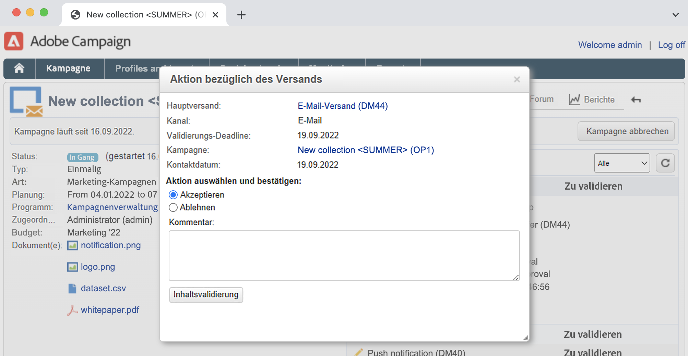

Sie können auch den in den Benachrichtigungsinhalten enthaltenen Link verwenden. Weiterführende Informationen hierzu finden Sie in [diesem Abschnitt](marketing-campaign-approval.md#checking-and-approving-deliveries).

## Anleitungsvideo {#video}

In diesem Video wird erklärt, wie man einen Marketing-Plan, Programme und Kampagnen erstellt.

>[!VIDEO](https://video.tv.adobe.com/v/333810?quality=12)
