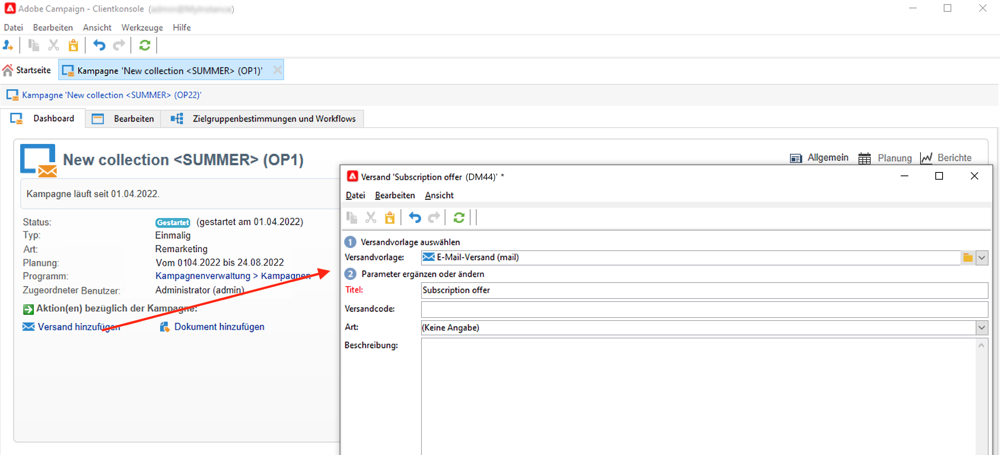
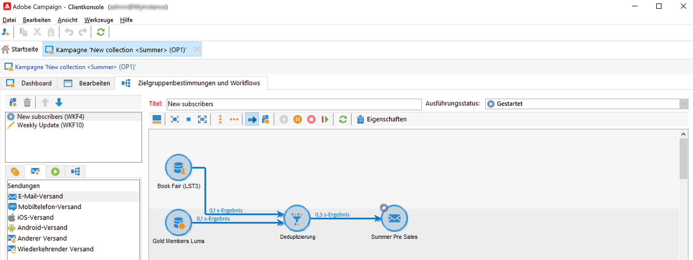
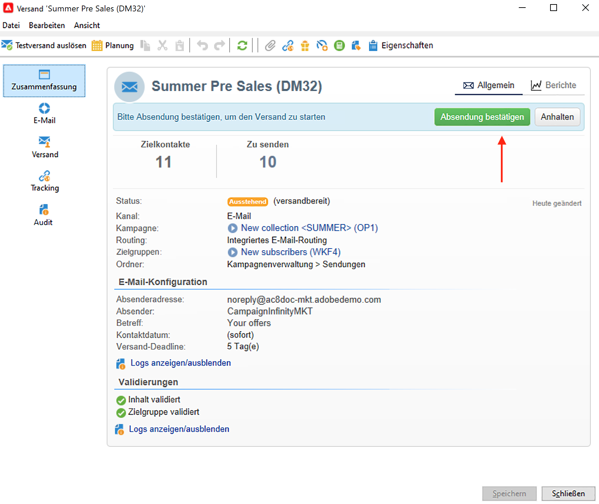
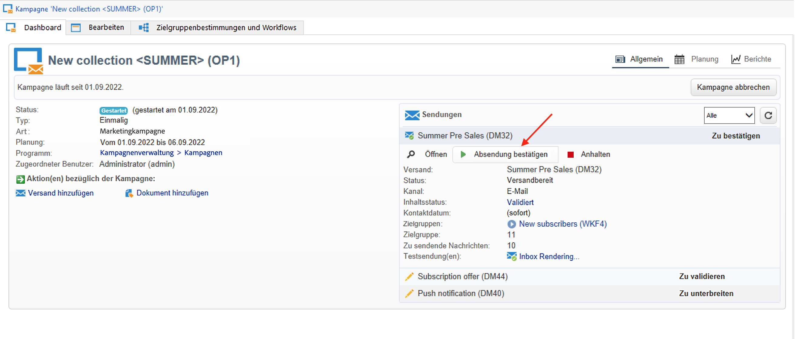
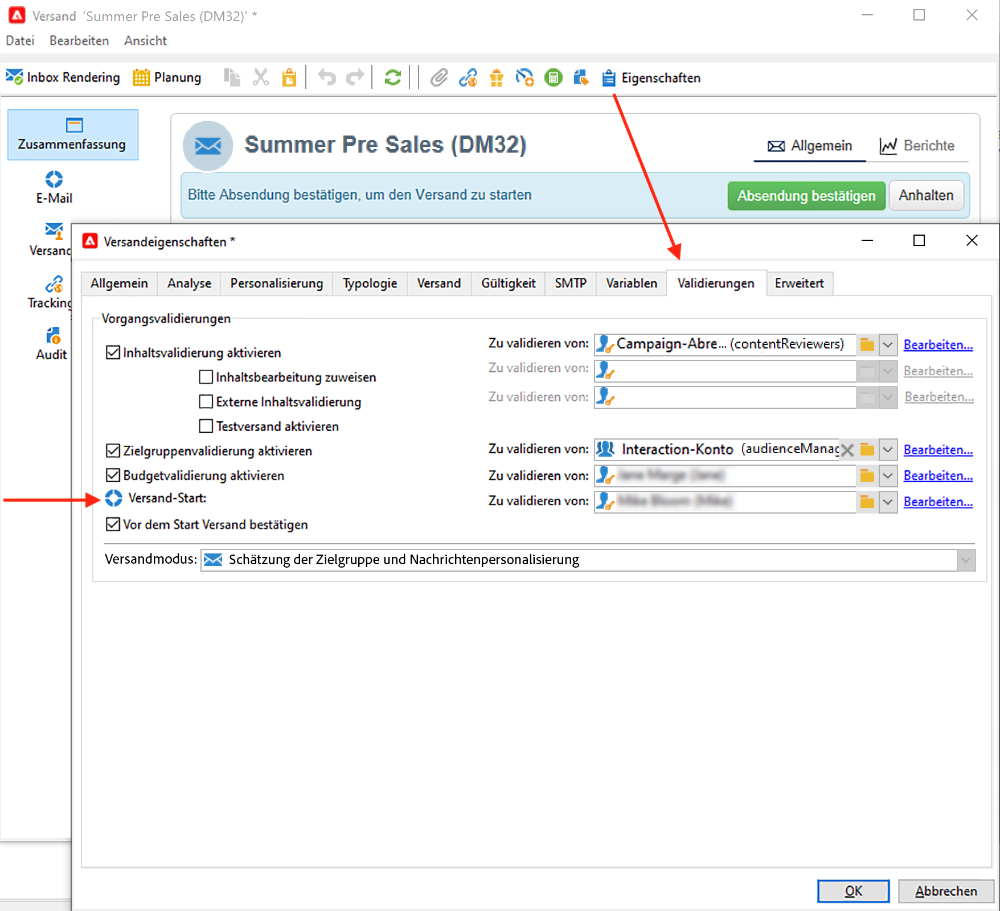
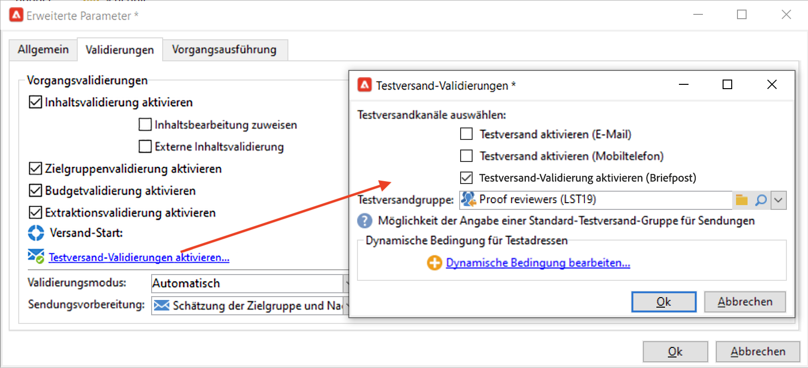
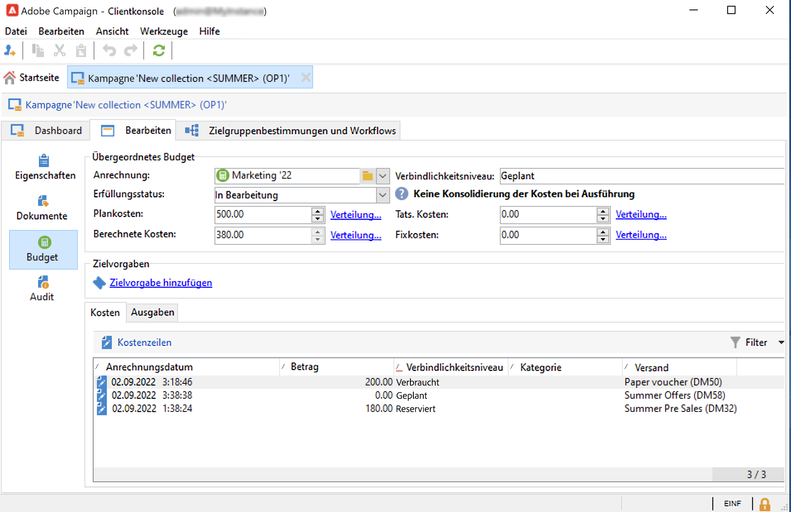
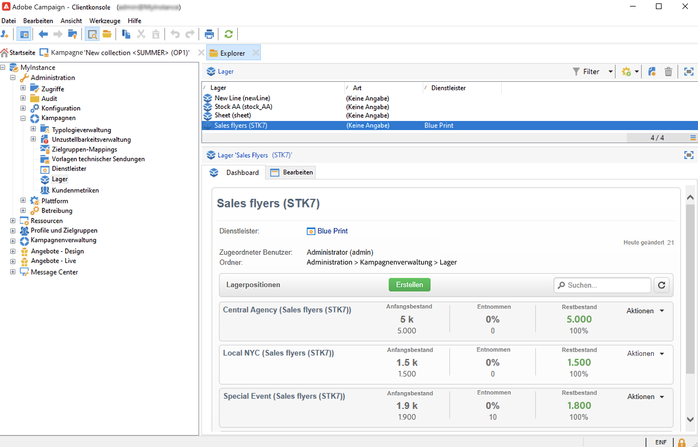
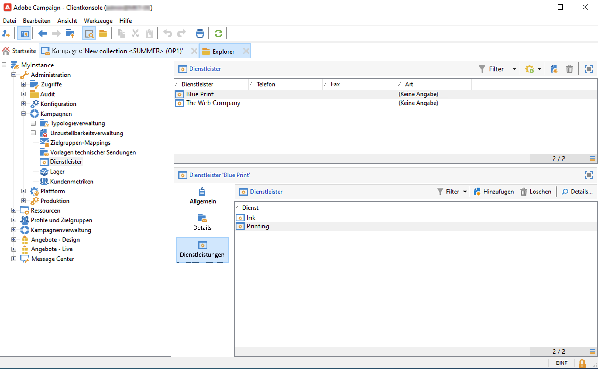

# Sendungen für eine Marketing-Kampagne {#marketing-campaign-deliveries}

Orchestrieren Sie Ihre kanalübergreifenden Sendungen in Ihren Kampagnen: Optimieren Sie mit Adobe Campaign Ihre Kommunikation durch personalisierte E-Mails, SMS, Push-Benachrichtigungen und In-App-Nachrichten. Sie können Rich Media wie Videos, Emojis oder GIFs verwenden und direkt integrieren.

Sendungen können über das Dashboard einer Kampagne, einen Kampagnen-Workflow oder direkt über die Versandübersicht erstellt werden. Wenn Sendungen in einer Kampagne erstellt werden, werden sie mit dieser Kampagne verknüpft und auf Kampagnenebene zusammengefasst.

## Erstellen von Sendungen {#create-deliveries}

Sie haben zwei Möglichkeiten, Sendungen zu Ihren Marketing-Kampagnen hinzuzufügen:

* Über den Link **[!UICONTROL Versand hinzufügen]** im Kampagnen-Dashboard.

Nach der Speicherung wird der Versand zum Kampagnen-Dashboard hinzugefügt.

* Über einen Kampagnen-Workflow auf der Registerkarte **[!UICONTROL Zielgruppenbestimmungen und Workflows]** durch Hinzufügen des Versands.

   

   Nach dem Start des Workflows wird der Versand zum Kampagnen-Dashboard hinzugefügt.

Informationen darüber, wie Sie die Versandvalidierung einrichten und ausführen, finden Sie [auf dieser Seite](marketing-campaign-approval.md).

## Starten eines Versands {#start-a-delivery}

Ein Versand kann durchgeführt werden, sobald alle Validierungen erteilt wurden. Der Ausführungsprozess des Versands hängt vom Kanal ab.

* Informationen zu Sendungen per E-Mail oder über einen mobilen Kanal finden Sie in [diesem Abschnitt](#start-an-online-delivery)

* Informationen zu Briefpost-Sendungen finden Sie in [diesem Abschnitt](#start-an-offline-delivery).

### Starten eines E-Mail- oder Mobile-Versands {#start-an-online-delivery}

Sobald alle Validierungsanfragen bestätigt wurden, erhält der Versand den Status **[!UICONTROL Zu bestätigen]** und kann gestartet werden. Validierungsverantwortliche, die den Versand starten können, werden darüber informiert, dass ein Versand startbereit ist.

Diese Information wird ebenfalls im Dashboard der Kampagne angezeigt. Über den Link **[!UICONTROL Versand bestätigen]** kann der Versand gestartet werden.

Die Validierung des Versands ist auf Administratoren sowie auf Benutzende oder Benutzergruppen beschränkt, die in den Versand- oder Kampagneneigenschaften ausdrücklich genannt werden. Wenn keine Benutzenden erstellt wurden, können Administratoren und der Kampagnenverantwortliche die Validierung vornehmen.

Sie können jedoch auch zulassen, dass der/die Kampagnenverantwortliche den Versand bestätigt, selbst wenn in den Versand- oder Kampagneneigenschaften spezifische Validierungsverantwortliche definiert wurden. Erstellen Sie dazu als Administrator die Option **NmsCampaign_Activate_OwnerConfirmation** und legen Sie sie auf **1** fest. Die Verwaltung der Optionen erfolgt über den Knoten **[!UICONTROL Administration]** > **[!UICONTROL Plattform]** > **[!UICONTROL Optionen]** im Adobe Campaign-Explorer.

### Starten eines Briefpostversands {#start-an-offline-delivery}

Sobald alle Validierungen erteilt wurden, ändert sich der Versandstatus in **[!UICONTROL Extraktion ausstehend]**. Die Extraktionsdateien werden über einen speziellen [technischen Workflow](../workflow/technical-workflows.md) erstellt, der in einer Standardkonfiguration automatisch gestartet wird, wenn ein Briefpostversand auf die Extraktion wartet. Wenn ein Prozess in Bearbeitung ist, wird er im Dashboard angezeigt und kann über seinen Link bearbeitet werden.

Wenn der Extraktions-Workflow korrekt ausgeführt wurde, muss die Extrationsdatei validiert werden (sofern die Validierung der Extraktionsdatei in der Versandkonfiguration aktiviert wurde). [Weitere Informationen](marketing-campaign-approval.md#approving-an-extraction-file).

Gehen Sie wie folgt vor, um den Inhalt zu validieren und die Datei an den Provider zu senden:

1. Nachdem die Extraktionsdatei validiert wurde, kann der Testversand der Benachrichtigungs-E-Mail an den Router erzeugt werden. Diese E-Mail wird auf der Grundlage einer Versandvorlage erstellt und muss validiert werden.

   Dieser Schritt ist nur verfügbar, wenn die Option **[!UICONTROL Testversandvalidierung aktivieren aktivieren (Briefpost)]** auf der Registerkarte **[!UICONTROL Genehmigungen]** der erweiterten Kampagnenparameter aktiviert wurde.

   

1. Klicken Sie auf die Schaltfläche **[!UICONTROL Testversand]**, um Testsendungen zu erstellen.

   Zunächst muss die Zielgruppe der Testsendungen bestimmt werden.

   Sie können so viele Testsendungen erstellen wie nötig. Auf die durchgeführten Testsendungen besteht Zugriff über den Link **[!UICONTROL Briefpost...]** in den Versanddetails.

1. Der Versand erhält nun den Status **[!UICONTROL Zu unterbreiten]**. Klicken Sie auf die Schaltfläche **[!UICONTROL Testsendungen unterbreiten]** um den Validierungsprozess zu starten.

1. Der Versandstatus wird daraufhin zu **[!UICONTROL Testversand zu validieren]**. Über die entsprechende Schaltfläche kann die Validierung erfolgen.

   Im Validierungs-Pop-up können Sie die Validierung akzeptieren oder ablehnen oder zur Extraktionsetappe zurückkehren.

1. Sobald der Testversand validiert wurde, wird die Extraktionsdatei an den Router gesendet und der Versand ist abgeschlossen.

### Budget- und Kostenberechnung {#compute-costs-and-stocks}

Die Dateiextraktion startet zwei Prozesse: Budgetberechnung und Bestandsberechnung. Die Budgeteinträge werden aktualisiert.

* Die Registerkarte **[!UICONTROL Budget]** ermöglicht die Budgetverwaltung der Kampagne. Die Summe der Kosteneinträge wird im Feld **[!UICONTROL Berechnete Kosten]** der Hauptregisterkarte der Kampagne und des Programms, zu dem sie gehört, angezeigt. Die Beträge werden auch im Kampagnenbudget angezeigt.

   

   Die tatsächlichen Kosten werden am Ende entsprechend der vom Router kommunizierten Informationen berechnet: Nur die tatsächlich versendeten Briefe werden fakturiert.

* Die Lagerbestände werden im Knoten **[!UICONTROL Administration > Kampagnenverwaltung > Lager]** des Baums definiert.

   

   Kostenstrukturen im Knoten **[!UICONTROL Administration > Kampagnenverwaltung > Dienstleister]**.

   

   Lagerpositionen können im Lager-Bereich angezeigt werden. Öffnen Sie eine Lagerposition, um den Anfangsbestand festzulegen. Der Bestand verringert sich mit jedem Versand. Sie haben die Möglichkeit, eine Alarmstufe und Benachrichtigungen zu konfigurieren.

   >[!NOTE]
   >
   >Weitere Informationen über Budgets finden Sie [in diesem Abschnitt](providers--stocks-and-budgets.md).
