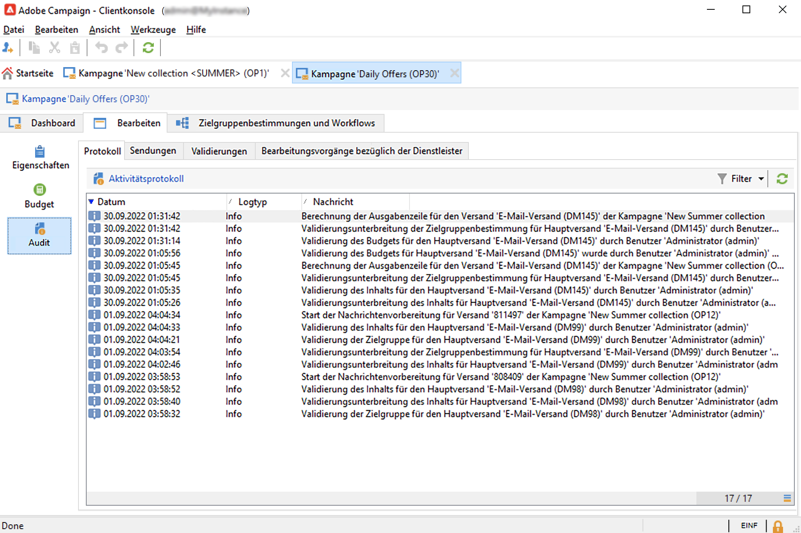
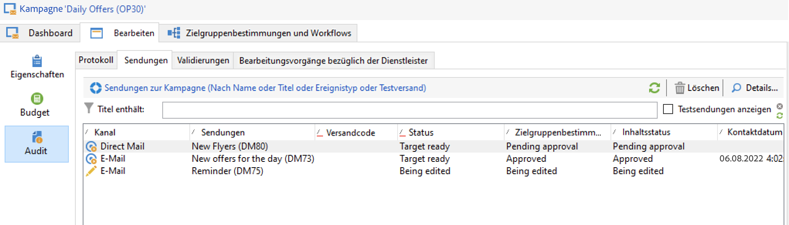
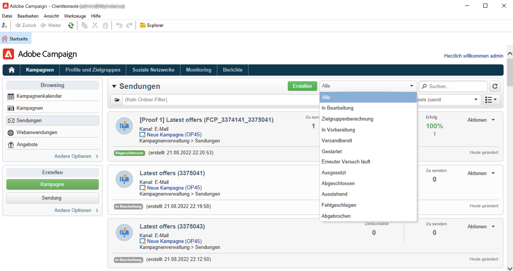

# Überwachen von Marketing-Kampagnen {#monitor-marketing-campaigns}

## Verfolgen einer Kampagne {#tracking-a-campaign}

Für jede Kampagne zeigt die Registerkarte **[!UICONTROL Tracking]** alle Vorgänge und deren Status an.

Über diese Unterregisterkarte kann auf folgende Informationen zugegriffen werden:

* Die Unterregisterkarte **[!UICONTROL Audit]** zeigt das Aktivitätenprotokoll an. Es enthält die für die Kampagne ausgeführten Vorgänge: Erstellung oder Start eines Workflows, Validierung, Extraktion, Lagerverwaltung usw.

   

* Die Unterregisterkarte **[!UICONTROL Sendungen]** enthält alle Sendungen der Kampagne. Sie können in dieser Ansicht bearbeitet werden. Wählen Sie dazu einen Versand aus und klicken Sie auf das Symbol **[!UICONTROL Details]**.

   

* Die Unterregisterkarte **[!UICONTROL Validierungen]** enthält den gesamten Validierungsprozess für die Kampagne. Sie können Details und Kommentare überprüfen.

* Die Workflows, die zur Generierung der Nachrichten an Dienstleister erstellt werden, werden in der Unterregisterkarte **[!UICONTROL Bearbeitungsvorgänge bezüglich der Dienstleister]** aufgelistet. Klicken Sie auf das Symbol **[!UICONTROL Details]**, um den ausgewählten Workflow anzuzeigen.

## Tracken von Sendungen {#delivery-tracking}

Eine Liste der Sendungen ist über die gleichnamige Schaltfläche in der Kampagnen-Rubrik verfügbar.****

In dieser Liste werden die Schlüsselindikatoren jedes Versands angezeigt: Status, Zielkontakte, übergeordnete Kampagne usw.

Um den Status eines Versands zu überprüfen, öffnen Sie diesen. Im Dashboard und den verschiedenen Tabs finden Sie alle notwendigen Informationen.

<!--
>[!NOTE]
>
>Information concerning delivery details is available in [this section](../../delivery/using/about-message-tracking.md) section.
-->

## Verfolgen der Ausführung {#execution-tracking}

Sie können den Status der Sendungen einsehen, indem Sie auf der Startseite von Adobe Campaign auf **[!UICONTROL Sendungen]** klicken.

Details über die in einer Kampagne ausgeführten Prozesse werden in der Registerkarte **[!UICONTROL Bearbeiten > Audit]** der Kampagne erfasst. Sie können die Liste der Sendungen in der Kampagne anzeigen. [Weitere Informationen](#tracking-a-campaign).
