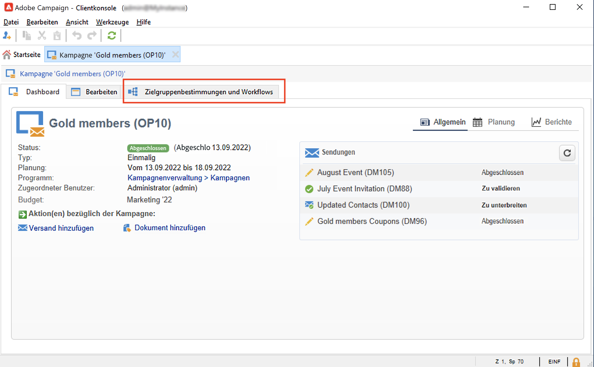

# Auswählen der Audience für Ihre Kampagnen {#marketing-campaign-deliveries}

In einer Marketing-Kampagne können Sie für jeden Versand Folgendes definieren:

* Die Zielgruppe. Sie können Nachrichten an eine [Empfängerliste](#send-to-a-group) oder erstellen Sie eine [Zielgruppe in einem Workflow](#build-the-main-target-in-a-workflow)
* Eine Kontrollgruppe. Sie können [Kontrollgruppe hinzufügen](#add-a-control-group) zur Überwachung des Empfängerverhaltens nach dem Nachrichtenversand
<!--
* Seed addresses - Learn more in [this section](../../delivery/using/about-seed-addresses.md).-->

Einige dieser Informationen werden von der [Kampagnenvorlage](marketing-campaign-templates.md#campaign-templates) übernommen.

<!--
To build the delivery target, you can define filtering criteria for the recipients in the database. This recipient selection mode is presented in [this section](../../delivery/using/steps-defining-the-target-population.md).
-->

## Versand an eine Gruppe{#send-to-a-group}

Sie haben die Möglichkeit, eine Population in eine Liste zu importieren und diese Liste als Zielgruppe eines Versands zu verwenden. Gehen Sie dazu wie folgt vor:

1. Bearbeiten Sie den Versand und klicken Sie auf die Schaltfläche **[!UICONTROL nach]** -Link, um die Zielpopulation zu ändern.
1. Markieren Sie im Tab **[!UICONTROL Hauptzielgruppe]** die Option **[!UICONTROL Von der Datenbank ausgehend bestimmt]** und klicken Sie auf **[!UICONTROL Hinzufügen]**, um Empfänger auszuwählen.

   

1. Auswählen **[!UICONTROL Empfängerliste]**.

   

1. Klicken **[!UICONTROL Nächste]** , um die Liste auszuwählen.

   

   Sie können die Zielgruppe verfeinern, indem Sie neue Filterkriterien hinzufügen.

1. Klicken **[!UICONTROL Beenden]** Nachdem alle Kriterien definiert wurden, speichern Sie die Hauptzielgruppe.

## Erstellen der Audience in einem Campaign-Workflow {#build-the-main-target-in-a-workflow}

Die Hauptzielgruppe eines Versands kann auch über einen Campaign-Workflow definiert werden: Die grafische Umgebung ermöglicht die Erstellung einer Zielgruppe mithilfe von Abfragen, Tests und Funktionen wie Vereinigungen, Deduplizierungen, Aufspaltungen usw.

>[!IMPORTANT]
>
>Sie können einer Kampagne nicht mehr als 28 Workflows hinzufügen. Jenseits dieses Grenzwerts werden keine zusätzlichen Workflows mehr in der Benutzeroberfläche angezeigt und können Fehler hervorrufen.

### Erstellen eines Workflows {#create-a-targeting-workflow}

Die Zielgruppenbestimmung kann mithilfe einer Kombination von Filterkriterien erfolgen, die in einem Workflow grafisch verdeutlicht wird. So ist es möglich, je nach Bedarf Gruppen oder Untergruppen zu erstellen und als Zielpopulation zu verwenden. Klicken Sie zum Öffnen des Workflow-Editors auf den Tab **[!UICONTROL Zielbestimmungen und Workflows]** der entsprechenden Kampagne.

Die Zielpopulation wird über eine oder mehrere in einem Workflow platzierte Abfragen aus der Adobe-Campaign-Datenbank extrahiert. Erfahren Sie, wie Sie eine Abfrage erstellen in [diesem Abschnitt](../workflow/query.md).

Sie können Abfragen starten und die resultierenden Populationen über Aktivitäten wie Vereinigung, Schnittmenge, Aufspaltung, Ausschluss weiter einschränken oder vergrößern.

Wählen Sie die gewünschten Aktivitäten aus den links vom Arbeitsbereich liegenden Menüs aus und reihen Sie diese aneinander, um die Zielgruppe zu erstellen.

Verbinden Sie die zur Zielgruppenerstellung notwendigen Zielbestimmungs- und Steuerungsaktivitäten im Diagramm miteinander: Sie können die Zielgruppenbestimmung bereits während ihrer Erstellung ausführen, um die aus der Datenbank extrahierte Population zu überprüfen.

>[!NOTE]
>
>Beispiele und Verfahren zum Definieren von Abfragen finden Sie unter [diesem Abschnitt](../workflow/query.md).

Im linken Bereich des Editors befindet sich eine Bibliothek grafischer Objekte, die Aktivitäten repräsentieren. Der erste Tab enthält Aktivitäten zur Zielgruppenbestimmung, der zweite Aktivitäten zur Steuerung. Letztere werden gelegentlich zur Koordinierung der Zielgruppenbestimmungs-Aktivitäten verwendet.

Über die Symbolleiste des Workflow-Editors besteht Zugriff auf Funktionen zur Formatierung und Ausführung des Zielgruppen-Workflows.

>[!NOTE]
>
>Die zum Erstellen des Diagramms verfügbaren Aktivitäten sowie alle Anzeige- und Layoutfunktionen werden im Abschnitt [diesem Abschnitt](../workflow/about-workflows.md).

Es besteht die Möglichkeit, mehrere Zielgruppen-Workflows für eine einzelne Kampagne zu erstellen. Gehen Sie wie folgt vor, um einen Workflow hinzuzufügen:

1. Positionieren Sie den Mauszeiger im linken oberen Abschnitt des Workflow-Editors, machen Sie einen Rechtsklick und wählen Sie **[!UICONTROL Hinzufügen]** aus. Sie können auch die Schaltfläche **[!UICONTROL Neu]** oberhalb dieses Bereichs nutzen.

   

1. Wählen Sie die Workflow-Vorlage **[!UICONTROL Neuer Workflow]** aus und benennen Sie den Workflow.
1. Klicken Sie auf **[!UICONTROL OK]**, um die Workflow-Erstellung zu bestätigen, und entwerfen Sie das Diagramm des Workflows.

### Ausführen eines Workflows {#execute-a-workflow}

Benutzer mit entsprechenden Berechtigungen können Zielgruppen-Workflows manuell über die Schaltfläche **[!UICONTROL Starten]** in der Symbolleiste ausführen.

Die Zielgruppenbestimmung kann so konfiguriert werden, dass sie entsprechend einer Planungsaktivität (Planungsassistent) oder abhängig von einem Ereignis (externes Signal, Dateiimport usw.) automatisch ausgeführt wird.

Bei Aktionen bezüglich der Ausführung des Zielgruppen-Workflows (Start, Stopp, Pause etc.) handelt es sich um **asynchrone** Prozesse: Der jeweilige Befehl wird gespeichert und wird ausgeführt, sobald der Server verfügbar ist.

Über die Symbolleiste hingegen kann die Ausführung des Zielgruppen-Workflows unmittelbar gesteuert werden.

* Starten oder neu starten

   * Bei Klick auf das Symbol **[!UICONTROL Starten]** werden alle Aktivitäten des Zielgruppen-Workflows aktiviert, die über keine eingehende Verbindung verfügen (außer Sprünge vom Typ &quot;Ziel&quot;).

      

      Die Anfrage wird vom Server erfasst, was sich im Ausführungsstatus widerspiegelt: **[!UICONTROL Schnellstmöglicher Start]**.

   * Sie können den Zielgruppen-Workflow über das entsprechende Symbolleistensymbol neu starten. Dieser Befehl kann nützlich sein, wenn die **[!UICONTROL Starten]** -Symbol nicht verfügbar ist, z. B. wenn der Workflow zur Zielgruppenbestimmung angehalten wird. Klicken Sie in diesem Fall auf die **[!UICONTROL Neu starten]** -Symbol, um den Neustart vorherzusehen. Der Server berücksichtigt die Anfrage, da ihr Status Folgendes anzeigt: **[!UICONTROL Neu angefordert]**.

* Anhalten oder aussetzen

   * Über die Symbolleiste kann die Ausführung des Zielgruppen-Workflows angehalten oder ausgesetzt werden.

      Bei Klick auf das Symbol **[!UICONTROL Aussetzen]** werden laufende Prozesse **[!UICONTROL nicht]** abgebrochen, es wird jedoch bis zur Wiederaufnahme keine andere Aktivität gestartet.

      

      Die Anfrage wird vom Server erfasst und vom Ausführungsstatus angezeigt: **[!UICONTROL Soll ausgesetzt werden]**.

      Ein Zielgruppen-Workflow kann auch automatisch ausgesetzt werden, wenn die Ausführung eine bestimmte Aktivität erreicht: Machen Sie hierzu einen Rechtsklick auf die Aktivität, ab der der Workflow ausgesetzt werden soll, und klicken Sie auf **[!UICONTROL Aktivieren, aber nicht ausführen]**.

      

      Die Konfiguration wird von einem spezifischen Symbol in der Grafik repräsentiert.

      

      >[!NOTE]
      >
      >Diese Option erweist sich insbesondere in Entwurfs- und Testphasen einer Zielbestimmung als nützlich.

      Klicken Sie auf **[!UICONTROL Starten]**, um die Ausführung wieder aufzunehmen.

   * Klicken Sie auf das Symbol **[!UICONTROL Anhalten]**, um die Ausführung zu stoppen.

      

      Die Anfrage wird vom Server erfasst und vom Ausführungsstatus angezeigt: **[!UICONTROL Wartet auf Stopp]**.
   Ein Zielgruppen-Workflow kann auch automatisch angehalten werden, wenn die Ausführung eine bestimmte Aktivität erreicht: Machen Sie hierzu einen Rechtsklick auf die Aktivität, ab der der Workflow angehalten werden soll, und klicken Sie auf **[!UICONTROL Nicht aktivieren]**.

   

   Die Konfiguration wird von einem spezifischen Symbol in der Grafik repräsentiert.

   

   >[!NOTE]
   >
   >Diese Option erweist sich insbesondere in Entwurfs- und Testphasen einer Zielbestimmung als nützlich.

* Unbedingter Stopp

   Wählen Sie im Explorer **[!UICONTROL Administration > Betreibung > Automatisch erstellte Objekte > Kampagnen-Workflows]** aus, um auf einen beliebigen Campaign-Workflow zuzugreifen und diesen zu steuern.

   Sie können Ihren Workflow stoppen, indem Sie das Symbol **[!UICONTROL Aktionen]** und danach **[!UICONTROL Unbedingter Stopp]** auswählen. Damit wird Ihr Kampagnen-Workflow sofort angehalten.

   

## Hinzufügen einer Kontrollgruppe {#add-a-control-group}

Bei der Kontrollgruppe handelt es sich um eine Population, die den Versand nicht erhält. Sie erlaubt es, Verhaltensunterschiede im Vergleich zu den Empfängern der Zielgruppe, die den Versand erhält, und somit die Auswirkungen einer Kampagne zu messen.

Die Kontrollgruppe kann aus der Hauptzielgruppe extrahiert werden und/oder aus einer speziellen Abfrage hervorgehen.

### Aktivieren der Kontrollgruppe für eine Kampagne {#activate-the-control-group-for-a-campaign}

Sie können eine Kontrollgruppe auf Kampagnenebene erstellen: In letzterem Fall wird die erstellte Kontrollgruppe für alle Sendungen der betreffenden Kampagne angewandt.

1. Bearbeiten Sie die betreffende Kampagne; klicken Sie dazu auf den Tab **[!UICONTROL Bearbeiten]**.
1. Klicken **[!UICONTROL Erweiterte Kampagnenparameter...]**.

   

1. Wählen Sie die Option **[!UICONTROL Kontrollgruppe aktivieren und konfigurieren]**.
1. Klicken Sie auf **[!UICONTROL Bearbeiten...]**, um die Kontrollgruppe zu konfigurieren.

   

Das vollständige Verfahren wird im Abschnitt [diesem Abschnitt](#extract-the-control-group-from-the-main-target). Weitere Informationen zu Kontrollgruppen finden Sie in [diesem Abschnitt](#add-a-population).

### Aktivieren der Kontrollgruppe für einen Versand {#activate-the-control-group-for-a-delivery}

Sie können eine Kontrollgruppe auf Versandebene erstellen: In letzterem Fall wird die erstellte Kontrollgruppe für alle Sendungen der betreffenden Kampagne angewandt.

Die in einer Kampagne vorgenommene Konfiguration einer Kontrollgruppe gilt standardmäßig für jeden Versand dieser Kampagne. Sie kann jedoch für einzelne Sendungen angepasst werden.

>[!NOTE]
>
>Wenn Sie eine Kontrollgruppe für eine Kampagne bestimmt haben und eine andere für einen Versand dieser Kampagne konfigurieren, so wird nur die für den Versand bestimmte Kontrollgruppe angewandt.

1. Bearbeiten Sie den betreffenden Versand und klicken Sie auf die Schaltfläche **[!UICONTROL nach]** Link.
1. Klicken Sie auf den Tab **[!UICONTROL Kontrollgruppe]** und wählen Sie dann **[!UICONTROL Kontrollgruppe aktivieren und konfigurieren]**.

   

1. Klicken Sie auf **[!UICONTROL Bearbeiten...]**, um die Kontrollgruppe zu konfigurieren..

Das vollständige Verfahren wird im Abschnitt [diesem Abschnitt](#extract-the-control-group-from-the-main-target).

### Verwenden einer neuen Population als Kontrollgruppe {#add-a-population}

Sie können eine bestimmte Population für die Kontrollgruppe verwenden. Wählen Sie in diesem Fall die Liste aus, die als Kontrollgruppe im entsprechenden Feld verwendet werden soll.

Diese Population kann aus einer Empfängerliste stammen oder über eine spezifische Abfrage definiert werden.

>[!NOTE]
>
>Der Abfrageeditor von Adobe Campaign wird in [diesem Abschnitt](../workflow/query.md) beschrieben.

### Extrahieren der Kontrollgruppe aus der Hauptzielgruppe {#extract-the-control-group-from-the-main-target}

Sie können auch Empfänger aus der Hauptzielgruppe des Versands extrahieren. In diesem Fall werden die Empfänger aus der Zielgruppe der von dieser Konfiguration betroffenen Versandaktionen übernommen. Diese Extraktion kann zufällig oder durch Sortieren der Empfänger erfolgen.

Um eine Kontrollgruppe zu extrahieren, aktivieren Sie diese auf Kampagnen- oder Versandniveau und wählen Sie eine der folgenden Optionen: **[!UICONTROL Zufallsauswahl aktivieren]** oder **[!UICONTROL Die ersten, aus einer Sortierung hervorgehenden Elemente beibehalten]**.

* Verwenden Sie die **[!UICONTROL Zufallsauswahl aktivieren]** Option, um eine Zufallsauswahl auf die Empfänger in der Hauptpopulation anzuwenden. Wenn Sie dann den Schwellenwert auf 100 setzen, besteht die Kontrollgruppe aus 100 zufällig aus der Zielpopulation ausgewählten Empfängern. Die zufällige Auswahl hängt von der Datenbank-Engine ab.
* Verwenden Sie die **[!UICONTROL Nur die ersten Datensätze nach der Sortierung beibehalten]** -Option, um eine Begrenzung basierend auf einer oder mehreren Sortierreihenfolgen zu definieren. Wenn Sie die **[!UICONTROL Alter]** als Sortierungskriterium und definieren Sie dann 100 als Schwellenwert. Die Kontrollgruppe setzt sich aus den 100 jüngsten Empfängern zusammen. Es könnte beispielsweise interessant sein, eine Kontrollgruppe zu definieren, die Empfänger enthält, die nur wenige Käufe tätigen, oder Empfänger, die häufig Käufe tätigen, und ihr Verhalten mit dem der kontaktierten Empfänger zu vergleichen.

Klicken Sie auf **[!UICONTROL Weiter]**, um (bei Bedarf) die Sortierreihenfolge festzulegen und die Empfängerbegrenzung zu bestimmen.

Diese Konfiguration entspricht einer **[!UICONTROL Aufspaltung]** -Aktivität in Teilmengen unterteilen. Die Kontrollgruppe ist eine dieser Teilmengen.

#### Anleitungsvideo {#create-email-video}

In diesem Video wird das Erstellen einer Kampagne und einer E-Mail in Adobe Campaign beschrieben.

>[!VIDEO](https://video.tv.adobe.com/v/25604?quality=12)

Weitere Anleitungsvideos zu Campaign finden Sie [hier](https://experienceleague.adobe.com/docs/campaign-classic-learn/tutorials/overview.html?lang=de).
