# Erstellen und Konfigurieren von Kampagnenvorlagen {#campaign-templates}

Alle Marketing-Kampagnen basieren auf einer Vorlage, in der die Hauptmerkmale und -funktionen gespeichert sind. Campaign verfügt über eine integrierte Vorlage zum Erstellen von Kampagnen. Für diese Vorlage sind alle Funktionen aktiviert: Dokumente, Testadressen, Validierungen, Versandentwürfe usw.

Welche Funktionen verfügbar sind, hängt von Ihren Berechtigungen, Add-ons und der Konfiguration Ihrer Adobe Campaign-Plattform ab.

>[!NOTE]
>
>Um den Navigationsbaum anzuzeigen, klicken Sie auf das Symbol **[!UICONTROL Explorer]** auf der Startseite.

Es wird eine native Vorlage bereitgestellt, mit der Sie eine Kampagne erstellen können, für die keine bestimmte Konfiguration definiert wurde. Sie können Ihre Kampagnenvorlagen erstellen und konfigurieren und dann Kampagnen aus diesen Vorlagen erstellen.

## Erstellen einer Kampagnenvorlage {#create-a-campaign-template}

Gehen Sie wie folgt vor, um eine Kampagnenvorlage zu erstellen:

1. Öffnen Sie den **Explorer** von Campaign und gehen Sie zu **Ressourcen > Vorlagen > Kampagnenvorlagen**.
1. Klicken Sie in der Symbolleiste oberhalb der Vorlagenliste auf **Neu**.

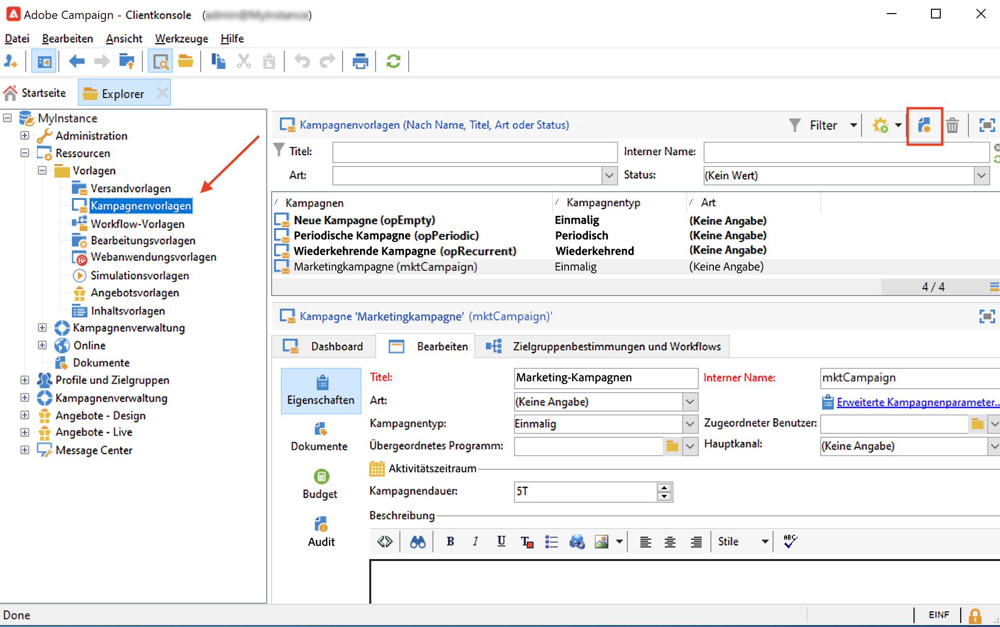

Sie können die integrierte Vorlage auch **duplizieren**, um ihre Konfiguration wiederzuverwenden und anzupassen. Klicken Sie dazu mit der rechten Maustaste auf die Vorlage und wählen Sie **Duplizieren**.

1. Geben Sie den Titel der neuen Kampagnenvorlage ein.
1. Klicken Sie auf **Speichern** und öffnen Sie die Vorlage erneut.
1. Definieren Sie auf der Registerkarte **Bearbeiten** die Eigenschaften der Vorlage.
1. Wählen Sie den Link **Erweiterte Kampagnenparameter...**, um einen Workflow zu Ihrer Kampagnenvorlage hinzuzufügen.

   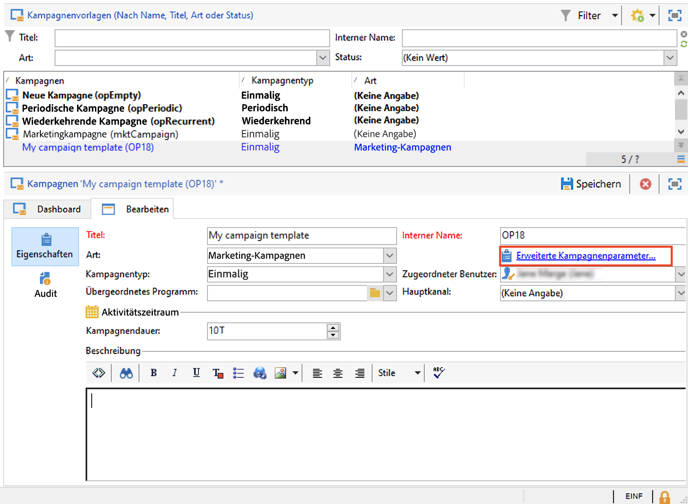

1. Ändern Sie den Wert für **Zielgruppenbestimmungen und Workflows** auf **Ja** und bestätigen Sie diesen. Wie Sie Funktionen hinzufügen können, erfahren Sie in [diesem Abschnitt](#typology-of-enabled-modules).
1. Die Registerkarte **Zielgruppenbestimmungen und Workflows** wird zur Vorlage hinzugefügt. Klicken Sie auf **Workflow hinzufügen...**, geben Sie einen **Titel** ein und klicken Sie auf **OK**.
1. Erstellen Sie Ihren Workflow entsprechend Ihren Anforderungen.

   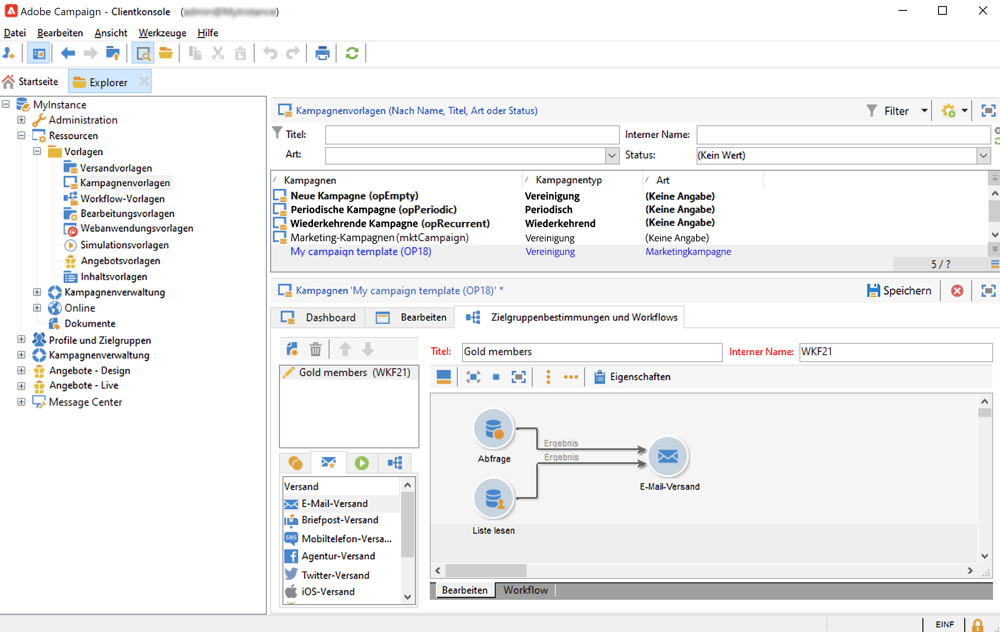

1. Wählen Sie **Speichern** aus. Ihre Vorlage kann jetzt zur Erstellung einer neuen Kampagne verwendet werden.

Die unterschiedlichen Registerkarten und Unterregisterkarten der Kampagnenvorlage ermöglichen den Zugriff auf die Einstellungen. Sie werden im Abschnitt [Allgemeine Konfiguration](#general-configuration) beschrieben.

## Auswählen von Modulen {#select-modules}

Über den Link **[!UICONTROL Erweiterte Kampagnenparameter...]** können Sie Vorgänge für die auf dieser Vorlage basierenden Kampagnen aktivieren und deaktivieren. Wählen Sie die Funktionen aus, die Sie in den über diese Vorlage erstellten Kampagnen aktivieren möchten.

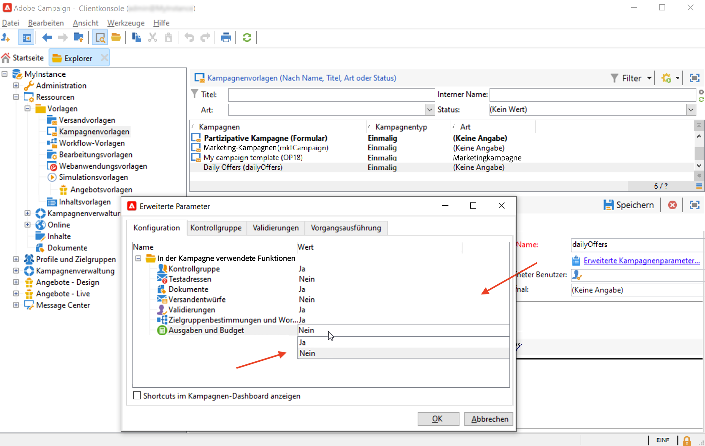

Wenn eine Funktion nicht ausgewählt ist, werden die den Prozess betreffenden Elemente (Menüs, Symbole, Optionen, Registerkarten, Unterregisterkarten usw.) nicht in der Benutzeroberfläche der Vorlage oder in den auf dieser Vorlage basierenden Kampagnen angezeigt. Die Registerkarten auf der linken Seite der Kampagnendetails und die verfügbaren Registerkarten entsprechen den in der Vorlage ausgewählten Funktionen. Wenn zum Beispiel die Funktion **Ausgaben und Ziele** nicht aktiviert ist, wird die entsprechende Registerkarte **[!UICONTROL Budget]** in Kampagnen, die auf dieser Vorlage basieren, nicht angezeigt.

Im Dashboard der Kampagne werden zudem Verknüpfungen zu den Konfigurationsfenstern hinzugefügt: Wenn eine Funktionalität aktiviert ist, können Sie über einen Link im Dashboard direkt darauf zugreifen.

### Konfigurationsbeispiele

* Beispielsweise mit den folgenden Einstellungen:

   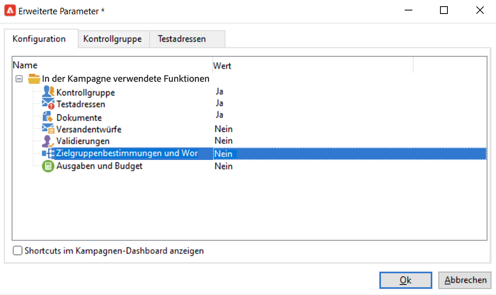

   Das Kampagnen-Dashboard zeigt Folgendes an:

   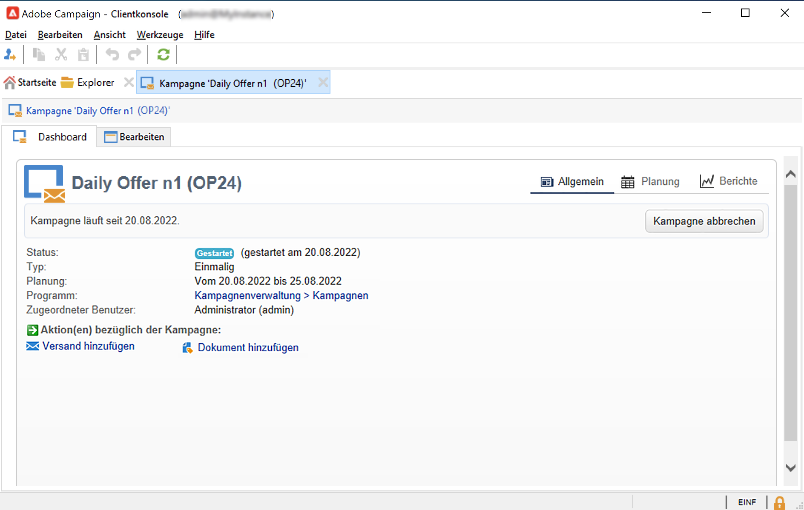

   Beachten Sie, dass die Registerkarte **[!UICONTROL Zielgruppenbestimmungen und Workflows]** fehlt.

   Folgende Funktionen stehen zur Verfügung:

   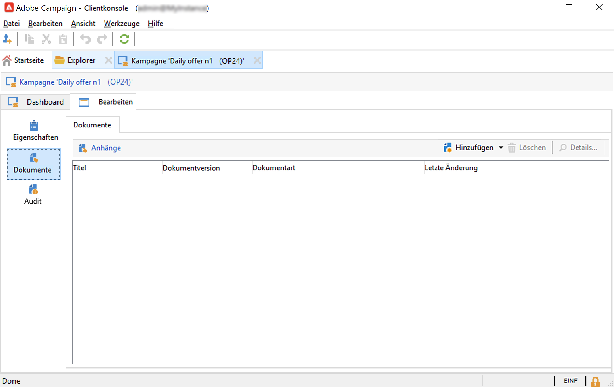

   Beachten Sie, dass die Registerkarte **[!UICONTROL Budget]** fehlt.

   Die erweiterten Einstellungen der Kampagne spiegeln diese Konfiguration ebenfalls wider.

   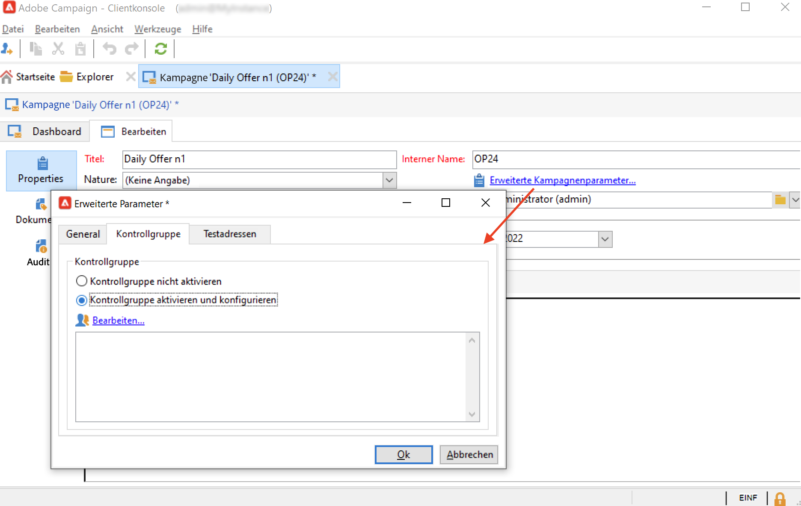

   Beachten Sie, dass die Registerkarte **[!UICONTROL Genehmigungen]** nicht verfügbar ist.

* Mit dieser Konfiguration:
   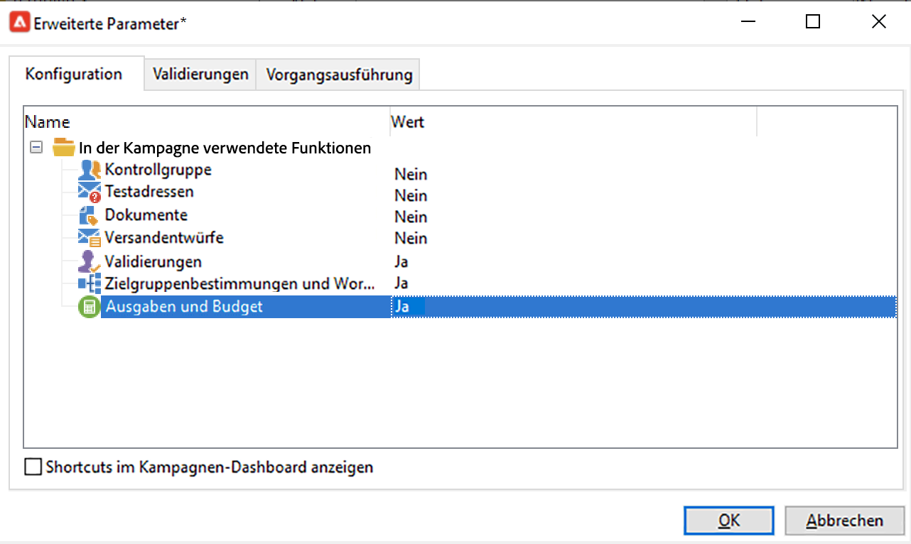

   Das Kampagnen-Dashboard zeigt Folgendes an:

   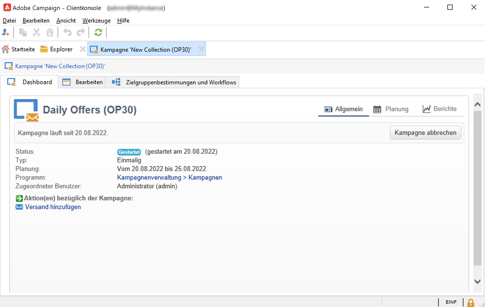

   Beachten Sie, dass die Registerkarte **[!UICONTROL Zielgruppenbestimmungen und Workflows]** verfügbar ist, aber der Link **Dokument hinzufügen** fehlt.

   Folgende Funktionen stehen zur Verfügung:

   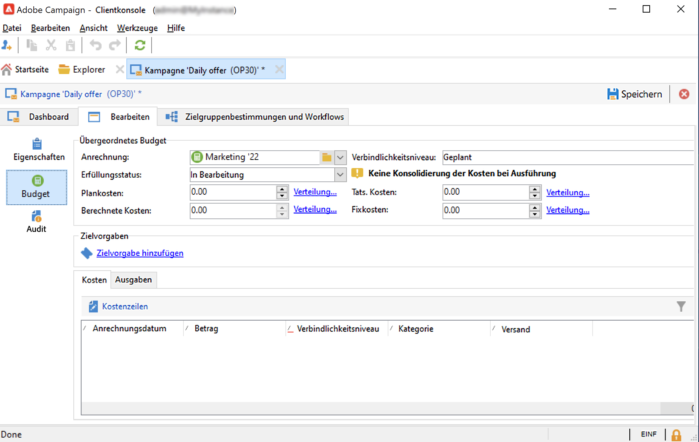

   Beachten Sie, dass die Registerkarte **[!UICONTROL Budget]** verfügbar ist.

   Die erweiterten Einstellungen der Kampagne spiegeln diese Konfiguration ebenfalls wider.

   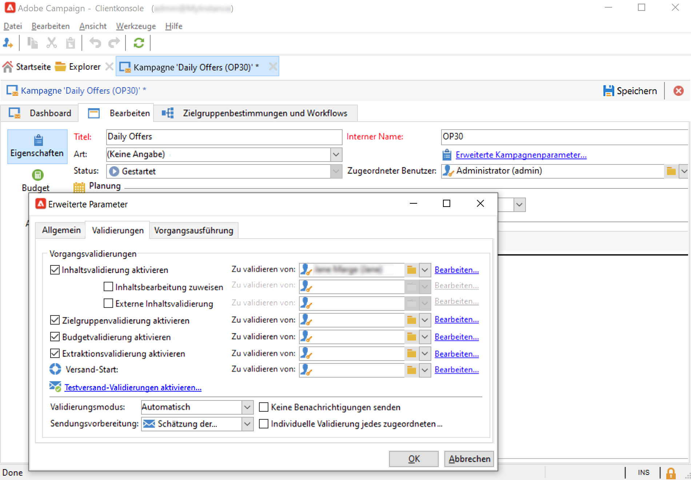

   Beachten Sie, dass die Registerkarte **[!UICONTROL Genehmigungen]** verfügbar ist, aber die Registerkarten **[!UICONTROL Kontrollpopulation]** und **[!UICONTROL Testadressen]** nicht aktiviert sind.

## Typologie von Modulen {#typology-of-enabled-modules}

* **Kontrollgruppe**

   Wenn dieses Modul ausgewählt wird, wird ein zusätzlicher Tab in den erweiterten Parametern der Vorlage und der auf dieser Vorlage basierenden Kampagnen hinzugefügt. Die Konfiguration kann in der Vorlage oder direkt in den einzelnen Kampagnen erfolgen. Weitere Informationen zu Kontrollgruppen finden Sie in [diesem Abschnitt](marketing-campaign-deliveries.md#defining-a-control-group).

   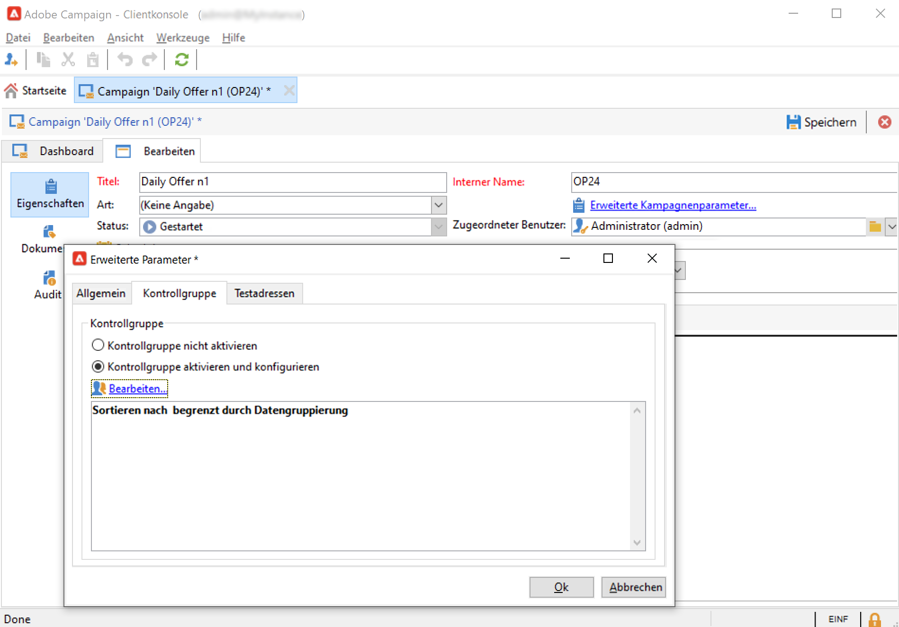

* **Testadressen**

   Wenn dieses Modul ausgewählt wird, wird ein zusätzlicher Tab in den erweiterten Parametern der Vorlage und der auf dieser Vorlage basierenden Kampagnen hinzugefügt. Die Konfiguration kann in der Vorlage oder direkt in den einzelnen Kampagnen erfolgen.

   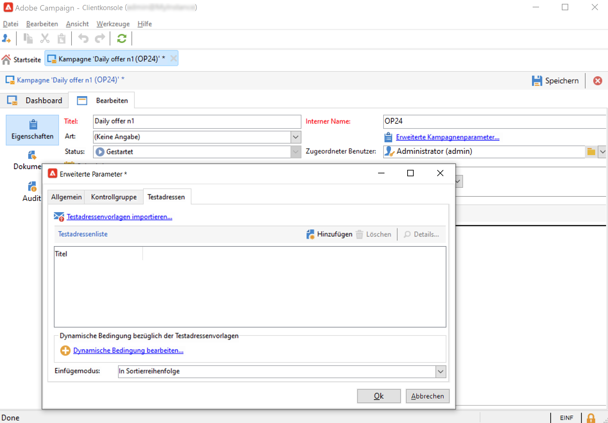

* **Dokumente**

   Wenn dieses Modul ausgewählt wird, wird eine zusätzliche Registerkarte zur Registerkarte **[!UICONTROL Bearbeiten]** der Vorlage und der auf dieser Vorlage basierenden Kampagnen hinzugefügt. Anhänge können für jede Kampagne in der Vorlage oder einzeln hinzugefügt werden. Weitere Informationen zu Dokumenten finden Sie in [diesem Abschnitt](marketing-campaign-deliveries.md#manage-associated-documents).

   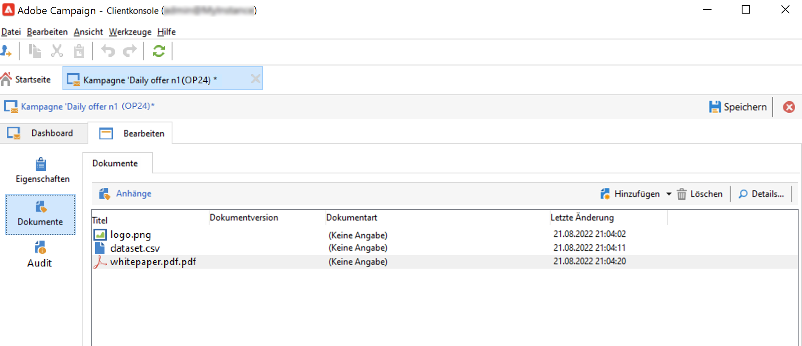

* **Versandentwurf**

   Wenn dieses Modul ausgewählt wird, wird dem Tab **[!UICONTROL Dokumente]** der Unter-Tab **[!UICONTROL Versandentwürfe]** hinzugefügt, um für die Kampagne unterschiedliche Versandentwürfe zu erstellen. Weitere Informationen zu Versandentwürfen finden Sie in [diesem Abschnitt](marketing-campaign-assets.md#delivery-outlines).

   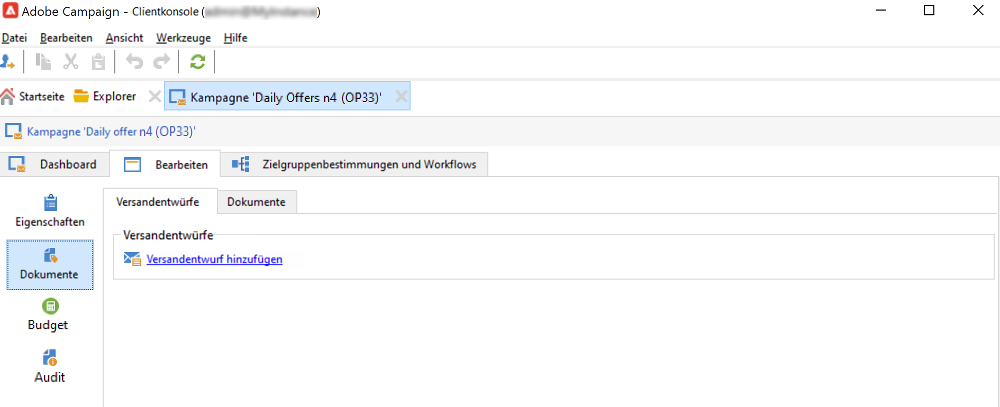

* **Zielgruppenbestimmungen und Workflows**

   Wenn das Modul **[!UICONTROL Zielgruppenbestimmungen und Workflows]** ausgewählt wird, wird ein Tab zum Erstellen eines oder mehrerer Workflows für Kampagnen hinzugefügt, die auf dieser Vorlage basieren. Workflows können auch auf Basis dieser Vorlage einzeln für jede Kampagne konfiguriert werden. Weitere Informationen zu Kampagnen-Workflows finden Sie in [diesem Abschnitt](marketing-campaign-deliveries.md#build-the-main-target-in-a-workflow).

   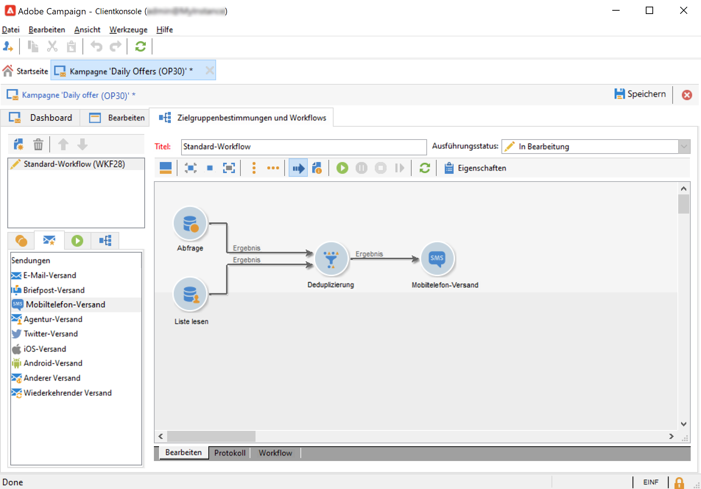

   Wenn dieses Modul aktiviert ist, wird die Registerkarte **[!UICONTROL Vorgänge]** zu den erweiterten Einstellungen der Kampagne hinzugefügt, um die Reihenfolge der Prozessausführung zu definieren.

* **Validierungen**

   Wenn Sie die **[!UICONTROL Validierungen]** aktivieren, können Sie die zu genehmigenden Prozesse und die für die Genehmigungen zuständigen Personen auswählen. Weitere Informationen zu Validierungen finden Sie in [diesem Abschnitt](marketing-campaign-approval.md#select-reviewers).

   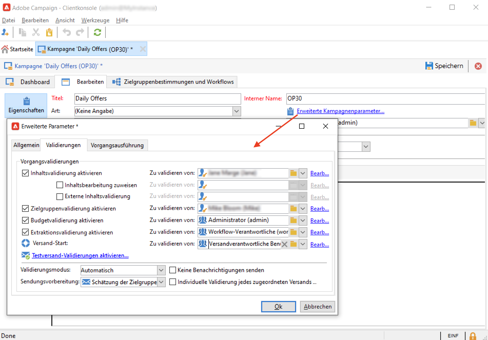

   Sie können wählen, ob Sie die Prozessvalidierung über die Registerkarte **[!UICONTROL Genehmigungen]** im Abschnitt mit den erweiterten Einstellungen der Vorlagen aktivieren möchten oder nicht.

* **Ausgaben und Budget**

   Wenn dieses Modul ausgewählt wird, wird der Tab **[!UICONTROL Budget]** den Details der Vorlage und der auf dieser Vorlage basierenden Kampagnen hinzugefügt, damit das zugehörige Budget ausgewählt werden kann.

   

## Vorlageneigenschaften {#template-properties}

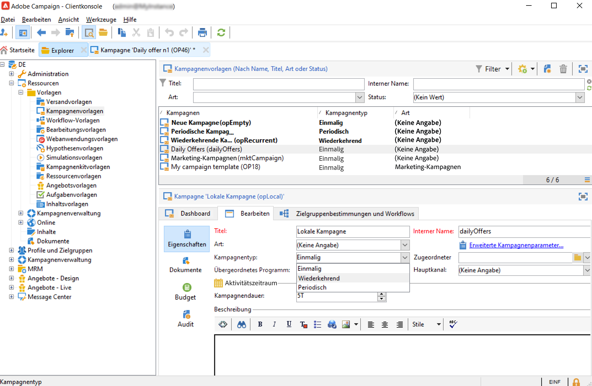

Bei der Erstellung einer Kampagnenvorlage ist die Angabe folgender Informationen notwendig:

* Geben Sie den **Titel** der Vorlage ein: Der Titel ist obligatorisch und wird als Standardbtitel für alle auf dieser Vorlage basierenden Kampagnen verwendet.
* **Kampagnenart**: Die in der Dropdown-Liste angebotenen Werte entsprechen den in der Aufzählung **[!UICONTROL natureOp]** gespeicherten Werten.

In der [Dokumentation zu Campaign Classic v7](https://experienceleague.adobe.com/docs/campaign-classic/using/getting-started/administration-basics/managing-enumerations.html?lang=de) erfahren Sie, wie Sie auf Ihre Aufzählungen zugreifen und sie konfigurieren können{target=&quot;_blank&quot;}.

* Wählen Sie den **Kampagnentyp**: einmalig, wiederkehrend oder periodisch. Standardmäßig sind in Kampagnenvorlagen einmalige Kampagnen festgelegt. Wiederkehrende und periodische Kampagnen werden in [diesem Abschnitt](recurring-periodic-campaigns.md) beschrieben.
* Dauer der Kampagne an: Gemeint ist der Zeitraum, über den sich die Kampagne erstrecken wird. Bei Erstellung einer auf einer Vorlage basierenden Kampagne werden Beginn und Ende somit automatisch ausgefüllt.

   Handelt es sich um eine wiederkehrende Kampagne, müssen Beginn und Ende direkt in der Vorlage angegeben werden.

* Geben Sie das mit der Vorlage **verknüpfte Programm** an: Kampagnen, die auf dieser Vorlage basieren, sind mit dem ausgewählten Programm verknüpft.

<!--
## Track campaign execution{#campaign-reverse-scheduling}

You can create a schedule for a campaign and track accomplishments, for instance to prepare an event schedule for a specific date. Campaign templates now let you calculate the start date of a task based on the end date of a campaign.

In the task configuration box, go to the **[!UICONTROL Implementation schedule]** area and check the **[!UICONTROL The start date is calculated based on the campaign end date]** box. (Here, "start date" is the task start date). Go to the **[!UICONTROL Start]** field and enter an interval: the task will start this long before the campaign end date. If you enter a period which is longer than the campaign is set to last, the task will begin before the campaign.

When you create a campaign using this template, the task start date will be calculated automatically. However, you can always change it later.-->
