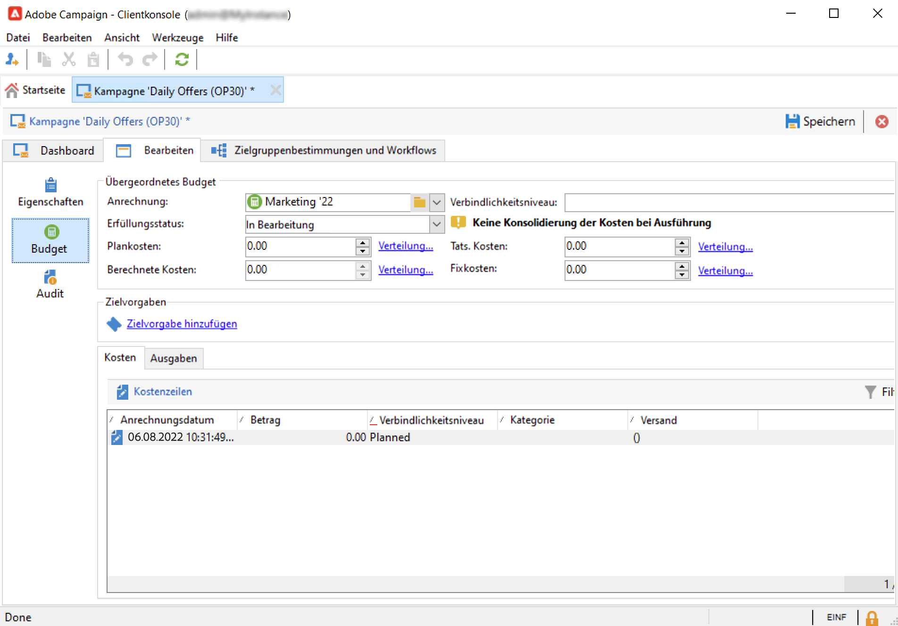

# Erstellen und Konfigurieren von Kampagnenvorlagen {#campaign-templates}

Alle Marketing-Kampagnen basieren auf einer Vorlage, in der die Hauptmerkmale und -funktionen gespeichert sind. Campaign verfügt über eine integrierte Vorlage zum Erstellen von Kampagnen. Für diese Vorlage sind alle Funktionen aktiviert: Dokumente, Testadressen, Validierungen, Versandentwürfe usw.

Die verfügbaren Funktionen hängen von Ihren Berechtigungen, Add-ons und der Konfiguration Ihrer Adobe Campaign-Plattform ab.

>[!NOTE]
>
>Um den Navigationsbaum anzuzeigen, klicken Sie auf das Symbol **[!UICONTROL Explorer]** auf der Startseite.

Es wird eine native Vorlage bereitgestellt, mit der Sie eine Kampagne erstellen können, für die keine bestimmte Konfiguration definiert wurde. Sie können Ihre Kampagnenvorlagen erstellen und konfigurieren und dann Kampagnen aus diesen Vorlagen erstellen.

## Erstellen einer Kampagnenvorlage {#create-a-campaign-template}

Gehen Sie wie folgt vor, um eine Kampagnenvorlage zu erstellen:

1. Kampagne öffnen **Explorer** und navigieren Sie zu **Ressourcen > Vorlagen > Kampagnenvorlagen**.
1. Klicken **Neu** in der Symbolleiste oberhalb der Vorlagenliste.

Sie können auch **Duplikat** die integrierte Vorlage zur Wiederverwendung und Anpassung ihrer Konfiguration. Klicken Sie dazu mit der rechten Maustaste auf die Vorlage und wählen Sie **Duplizieren**.

1. Geben Sie den Titel der neuen Kampagnenvorlage ein.
1. Klicken Sie auf **Speichern** und öffnen Sie die Vorlage erneut.
1. Im **Bearbeiten** definieren Sie die Vorlageneigenschaften.
1. Auswählen **Erweiterte Kampagnenparameter...** -Link, um Ihrer Kampagnenvorlage einen Workflow hinzuzufügen.

   

1. Ändern Sie die **Zielbestimmungen und Workflows** Wert zu **Ja**. und bestätigen Sie. Erfahren Sie, wie Sie Funktionen hinzufügen in [diesem Abschnitt](#typology-of-enabled-modules).
1. Die **Zielbestimmungen und Workflows** der Vorlage hinzugefügt. Klicken **Workflow hinzufügen...**, geben Sie einen **Titel** und klicken Sie auf **Ok**.
1. Erstellen Sie Ihren Workflow entsprechend Ihren Anforderungen.

   

1. Wählen Sie **Speichern** aus. Ihre Vorlage kann jetzt zur Erstellung einer neuen Kampagne verwendet werden.

Die unterschiedlichen Tabs und Unter-Tabs der Kampagnenvorlage ermöglichen den Zugriff auf die Einstellungen. Sie werden im Abschnitt [Allgemeine Konfiguration](#general-configuration) beschrieben.

## Auswählen von Modulen {#select-modules}

Die **[!UICONTROL Erweiterte Kampagnenparameter...]** -Link ermöglicht die Aktivierung und Deaktivierung von Aufträgen für die auf dieser Vorlage basierenden Kampagnen. Wählen Sie die Funktionen aus, die Sie in den über diese Vorlage erstellten Kampagnen aktivieren möchten.

Wenn eine Funktion nicht ausgewählt ist, die das Verfahren betreffenden Elemente (Menüs, Symbole, Optionen, Registerkarten, Unterregisterkarten usw.) nicht in der Vorlagenoberfläche oder in auf dieser Vorlage basierenden Kampagnen angezeigt werden. Die Tabs links neben den Kampagnendetails und die verfügbaren Tabs entsprechen den in der Vorlage ausgewählten Funktionen. Beispiel: die **Ausgaben und Ziele** nicht aktiviert ist, wird die entsprechende **[!UICONTROL Budget]** nicht in auf dieser Vorlage basierenden Kampagnen angezeigt werden.

Im Dashboard der Kampagne werden zudem Verknüpfungen zu den Konfigurationsfenstern hinzugefügt: Wenn eine Funktionalität aktiviert ist, besteht über einen Link im Dashboard direkter Zugriff auf diese.

### Konfigurationsbeispiele

* Beispielsweise mit den folgenden Einstellungen:

   

   Das Kampagnen-Dashboard zeigt Folgendes an:

   

   Beachten Sie Folgendes: **[!UICONTROL Zielbestimmungen und Workflows]** fehlt.

   Folgende Funktionen sind verfügbar:

   

   Beachten Sie Folgendes: **[!UICONTROL Budget]** fehlt.

   Die erweiterten Einstellungen der Kampagne spiegeln diese Konfiguration ebenfalls wider.

   

   Beachten Sie Folgendes: **[!UICONTROL Genehmigungen]** nicht verfügbar ist.

* Mit dieser Konfiguration:
   

   Das Kampagnen-Dashboard zeigt Folgendes an:

   

   Beachten Sie Folgendes: **[!UICONTROL Zielbestimmungen und Workflows]** -Tab verfügbar, aber die **Dokument hinzufügen** -Link fehlt.

   Folgende Funktionen sind verfügbar:

   

   Beachten Sie Folgendes: **[!UICONTROL Budget]** verfügbar ist.

   Die erweiterten Einstellungen der Kampagne spiegeln diese Konfiguration ebenfalls wider.

   

   Beachten Sie Folgendes: **[!UICONTROL Genehmigungen]** -Tab verfügbar, aber die **[!UICONTROL Kontrollpopulation]** und **[!UICONTROL Testadressen]** Registerkarten sind nicht aktiviert.

## Typologie von Modulen {#typology-of-enabled-modules}

* **Kontrollgruppe**

   Wenn dieses Modul ausgewählt wird, wird ein zusätzlicher Tab in den erweiterten Parametern der Vorlage und der auf dieser Vorlage basierenden Kampagnen hinzugefügt. Die Konfiguration kann in der Vorlage oder direkt in den einzelnen Kampagnen erfolgen. Weitere Informationen zu Kontrollgruppen finden Sie in [diesem Abschnitt](marketing-campaign-deliveries.md#defining-a-control-group).

   

* **Testadressen**

   Wenn dieses Modul ausgewählt wird, wird ein zusätzlicher Tab in den erweiterten Parametern der Vorlage und der auf dieser Vorlage basierenden Kampagnen hinzugefügt. Die Konfiguration kann in der Vorlage oder direkt in den einzelnen Kampagnen erfolgen.

   

* **Dokumente**

   Wenn dieses Modul ausgewählt wird, wird eine zusätzliche Registerkarte zum **[!UICONTROL Bearbeiten]** der Vorlage und der auf dieser Vorlage basierenden Kampagnen. Anhänge können aus der Vorlage oder einzeln für jede Kampagne hinzugefügt werden. Weitere Informationen zu Dokumenten finden Sie in [diesem Abschnitt](marketing-campaign-deliveries.md#manage-associated-documents).

   

* **Versandentwurf**

   Wenn dieses Modul ausgewählt wird, wird dem Tab **[!UICONTROL Dokumente]** der Unter-Tab **[!UICONTROL Versandentwürfe]** hinzugefügt, um für die Kampagne unterschiedliche Versandentwürfe zu erstellen. Weitere Informationen zu Versandentwürfen finden Sie in [diesem Abschnitt](marketing-campaign-assets.md#delivery-outlines).

   

* **Zielgruppenbestimmungen und Workflows**

   Wenn das Modul **[!UICONTROL Zielgruppenbestimmungen und Workflows]** ausgewählt wird, wird ein Tab zum Erstellen eines oder mehrerer Workflows für Kampagnen hinzugefügt, die auf dieser Vorlage basieren. Workflows können auch auf Basis dieser Vorlage einzeln für jede Kampagne konfiguriert werden. Weitere Informationen zu Kampagnen-Workflows finden Sie in [diesem Abschnitt](marketing-campaign-deliveries.md#build-the-main-target-in-a-workflow).

   

   Wenn dieses Modul aktiviert ist, wird ein **[!UICONTROL Aufträge]** den erweiterten Parametern der Kampagne hinzugefügt werden, um die Ausführungsreihenfolge des Prozesses zu definieren.

* **Validierungen**

   Wenn Sie die **[!UICONTROL Genehmigungen]** können Sie die zu validierenden Prozesse und die für die Validierungen verantwortlichen Benutzer auswählen. Weitere Informationen zu Validierungen finden Sie in [diesem Abschnitt](marketing-campaign-approval.md#select-reviewers).

   

   Sie können festlegen, ob die Prozessvalidierung über die **[!UICONTROL Genehmigungen]** im Abschnitt mit den erweiterten Einstellungen der Vorlagen.

* **Ausgaben und Budget**

   Wenn dieses Modul ausgewählt wird, wird der Tab **[!UICONTROL Budget]** den Details der Vorlage und der auf dieser Vorlage basierenden Kampagnen hinzugefügt, damit das zugehörige Budget ausgewählt werden kann.

   

## Vorlageneigenschaften {#template-properties}

Bei der Erstellung einer Kampagnenvorlage ist die Angabe folgender Informationen notwendig:

* Geben Sie die **label** der Vorlage: Der Titel ist obligatorisch und die Standardbeschriftung für alle auf dieser Vorlage basierenden Kampagnen.
* **Kampagnenart**: Die in der Dropdown-Liste angebotenen Werte entsprechen den in der Auflistung **[!UICONTROL natureOp]** gespeicherten Werten.
   <!--
  >[!NOTE]
  >
  >For more information on enumerations, refer to the [Getting Started](../../platform/using/managing-enumerations.md) section.-->

* Wählen Sie den **Kampagnentyp**: einmalig, wiederkehrend oder periodisch. Standardmäßig gelten Kampagnenvorlagen für einmalige Kampagnen. Wiederkehrende und periodische Kampagnen werden in [diesem Abschnitt](recurring-periodic-campaigns.md) beschrieben.
* Dauer der Kampagne an: Gemeint ist der Zeitraum, über den sich die Kampagne erstrecken wird. Bei Erstellung einer auf einer Vorlage basierenden Kampagne werden Beginn und Ende somit automatisch ausgefüllt.

   Handelt es sich um eine wiederkehrende Kampagne, müssen Beginn und Ende direkt in der Vorlage angegeben werden.

* Geben Sie die **verwandtes Programm** der Vorlage: Kampagnen, die auf dieser Vorlage basieren, sind mit dem ausgewählten Programm verknüpft.

<!--
## Track campaign execution{#campaign-reverse-scheduling}

You can create a schedule for a campaign and track accomplishments, for instance to prepare an event schedule for a specific date. Campaign templates now let you calculate the start date of a task based on the end date of a campaign.

In the task configuration box, go to the **[!UICONTROL Implementation schedule]** area and check the **[!UICONTROL The start date is calculated based on the campaign end date]** box. (Here, "start date" is the task start date). Go to the **[!UICONTROL Start]** field and enter an interval: the task will start this long before the campaign end date. If you enter a period which is longer than the campaign is set to last, the task will begin before the campaign.

When you create a campaign using this template, the task start date will be calculated automatically. However, you can always change it later.-->
