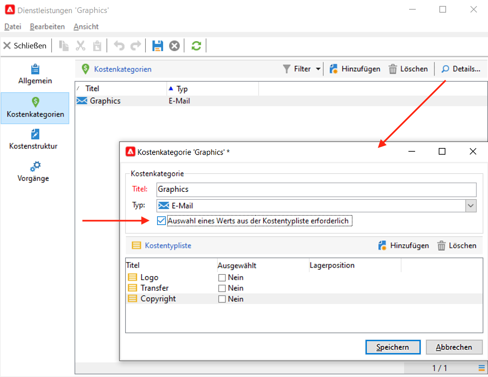

# Dienstleister, Lager und Budgets{#providers-stocks-and-budgets}

In Adobe Campaign haben Sie die Möglichkeit, Dienstleister zu bestimmen, die an der Ausführung bestimmter Vorgänge der Kampagnen beteiligt sind. Informationen bezüglich dieser Dienstleister und der ihnen zugeordneten Kostenstrukturen werden vom Adobe Campaign-Administrator über die allgemeine Übersicht festgelegt. Der Dienstleister wird auf Versandebene referenziert: Seine Kostenstrukturen ermöglichen die Berechnung der mit dem jeweiligen Versand verbundenen Kosten sowie die Verwaltung der betroffenen Lager.

## Erstellen von Dienstleistern und deren Kostenstrukturen {#create-service-providers-and-their-cost-structures}

Jeder Dienstleister wird in einer Datei gespeichert, die seine Kontaktdaten, Dienstleistungsvorlagen und verbundene Vorgänge enthält.

Dienstleister werden im Knoten **[!UICONTROL Administration > Kampagnen > Dienstleister]** des Navigationsbaums konfiguriert.

Diverse, in Sendungen zu realisierende Vorgänge werden von Dienstleistern ausgeführt, insbesondere solche, die Briefpost und mobile Kanäle betreffen. Diese Dienstleister kommen beispielsweise in Druckvorgängen oder bei der Zustellung von Nachrichten zum Einsatz. Diese Vorgänge erfordern dienstleisterspezifische Einstellungen und verursachen Kosten. Die Konfiguration von Dienstleistern erfolgt in vier Schritten:

1. Erstellung des Dienstleisters in Adobe Campaign.. [Weitere Informationen](#add-a-service-provider)

1. Bestimmung der Kostenstellen und -strukturen der zugehörigen Dienstleistungsvorlagen. [Weitere Informationen](#define-cost-categories)

1. Konfiguration von Prozessen. [Weitere Informationen](#configure-processes-associated-with-a-service).

1. Referenzierung des Dienstleisters auf Kampagnenebene. [Weitere Informationen](#associate-a-service-with-a-campaign).

### Erstellen eines Dienstleisters und seiner Kostenstellen {#create-a-service-provider-and-its-cost-categories}

#### Hinzufügen eines Dienstleisters {#add-a-service-provider}

Sie können so viele Dienstleister erstellen, wie für Ihre Sendungen notwendig sind. Gehen Sie wie folgt vor, um einen Dienstleister hinzuzufügen:

1. Klicken Sie auf **[!UICONTROL Neu]** oberhalb der Liste der Dienstleister.
1. Geben Sie im unteren Abschnitt des Fensters Namen und Kontaktdaten des Dienstleisters an.

   

1. Klicken Sie auf die Schaltfläche **[!UICONTROL Speichern]**, um ihn der Liste hinzuzufügen.

#### Kostenstellen definieren {#define-cost-categories}

Sie können jetzt Dienstvorlagen mit jedem Dienstleister verknüpfen. In diesen Vorlagen müssen Sie zunächst die Kostenstellen und bei Bedarf den betreffenden Bestand identifizieren. Anschließend können Sie über die Kostenstrukturen die Kostenberechnungsregeln für jede Kategorie erstellen. [Weitere Informationen](#define-the-cost-structure).

Eine Kostenstelle ist eine Einheit mit einer Reihe von Kosten, die für einen bestimmten Versandtyp infrage kommen (E-Mail, Briefpost, SMS usw.). Kostenstellen werden in den mit den Dienstleistern verknüpften Dienstleistungsvorlagen gruppiert. Jeder Dienstleister kann auf eine oder mehrere Dienstleistungsvorlagen verweisen.

Gehen Sie wie folgt vor, um eine Dienstvorlage zu erstellen und deren Inhalt zu definieren:

1. Im **[!UICONTROL Dienste]** auf die Registerkarte des Dienstleisters klicken Sie auf das **[!UICONTROL Hinzufügen]** und geben Sie den Namen der Dienstvorlage ein.

   

1. Erstellen Sie Kostenkategorien für jeden Vorgangstyp (z. B. Direkt-Mail- oder E-Mail-Versand, Aufgabe etc.). Klicken Sie dazu auf die Registerkarte **[!UICONTROL Kostenkategorien]** und dann auf die Schaltfläche **[!UICONTROL Hinzufügen]** und geben Sie die Parameter der einzelnen Kostenkategorie ein.

   

   * Geben Sie einen Titel für diese Kostenstelle an und wählen Sie den betreffenden Vorgangstyp aus: **[!UICONTROL Briefpost]**, **[!UICONTROL Email]**, **[!UICONTROL Mobile]**, usw.
   * Klicken Sie auf die Schaltfläche **[!UICONTROL Hinzufügen]**, um die mit dieser Kostenkategorie verbunden Kostentypen zu bestimmen.
   * Bei Bedarf können Sie jedem Kostentyp eine Lagerposition hinzufügen, um den bestehenden Lagern automatisch die verwendeten Mengen anzurechnen.

      >[!NOTE]
      >
      >Die Lagerpositionen werden im Knoten **[!UICONTROL Lagerverwaltung]** definiert. [Weitere Informationen](#stock-and-order-management).

1. Sie können einen Wert für diese Kostenstelle vorab auswählen. Dies ist der Standardwert in den Kostenstellen des Dienstleisters (anstelle eines leeren Werts). Aktivieren Sie dazu die **Ja** in der **[!UICONTROL Ausgewählt]** Spalte für die betreffende Kategorie:

   

   Auf Ebene des Versand wird der Wert standardmäßig vorgeschlagen.

### Kostenstruktur definieren {#define-the-cost-structure}

Für jeden Kostentyp gibt die Kostenstruktur die anzuwendenden Berechnungsregeln an.

Klicken Sie auf den Tab **[!UICONTROL Kostenstruktur]**, um die Kostenberechnung für jede Kostenkategorie und jeden Kostentyp zu konfigurieren. Klicken Sie auf **[!UICONTROL Hinzufügen]** und erfassen Sie die Kostenstruktur.

* Um die Kostenstruktur zu erstellen, wählen Sie in den Dropdown-Listen den Nachrichtentyp, die betreffende Kostenkategorie sowie den Kostentyp aus, auf den die Berechnungsregel angewandt wird. Der Inhalt dieser Dropdown-Listen übernimmt die im Tab **[!UICONTROL Kostenkategorien]** angegebenen Informationen.

   Die Kostenstruktur muss benannt werden. Standardmäßig setzt sich ihr Titel wie folgt zusammen: **Kostenkategorie - Kostentyp**.

   Dieser kann jedoch angepasst werden: Erfassen Sie den gewünschten Wert direkt im Feld **[!UICONTROL Titel]**.

* Die Formel zur Berechnung der Kosten wird im unteren Abschnitt des Fensters definiert.

   Diese Formel kann unabhängig von der Nachrichtenanzahl festgelegt oder entsprechend der Nachrichtenanzahl berechnet werden.

   Wenn die Formel von der Nachrichtenanzahl abhängt, kann die Struktur der Kostenberechnung **[!UICONTROL Linear]**, **[!UICONTROL Linear mit Schwellen]** oder **[!UICONTROL Pauschal mit Schwellen]** sein.

#### Lineare Struktur {#linear-structure}

Wenn es sich unabhängig von der Gesamtzahl von Nachrichten immer um den gleichen Betrag für eine Nachricht (oder eine Gruppe von Nachrichten) handelt, wählen Sie den Strukturtyp **[!UICONTROL Linear]** aus und geben Sie die Kosten pro Nachricht an.

Wenn der Betrag auf eine bestimmte Anzahl an Nachrichten angewandt wird, geben Sie diese im Feld **[!UICONTROL für]** an.

#### Lineare Struktur mit Schwellen {#linear-structure-by-threshold}

Wenn der Betrag nach Schwellen für jede Nachricht angewandt wird, muss eine Berechnungsstruktur **[!UICONTROL Linear mit Schwellen]** festgelegt werden. Nach dieser Art von Kostenstruktur kostet zum Beispiel jede Nachricht 0,13, wenn die Gesamtzahl von Nachrichten zwischen 1 und 100 liegt, 0,12 bei zwischen 100 und 1000 versendeten Nachrichten und 0,11 jenseits von 1000 Nachrichten.

Die Konfiguration sieht wie folgt aus:

Klicken Sie auf die Schaltfläche **[!UICONTROL Hinzufügen]** rechts von der Liste, um eine neue Schwelle zu definieren.

#### Konstante Struktur mit Schwellen {#constant-structure-by-threshold}

Sie haben zudem die Möglichkeit, die Kosten für eine bestimmte Nachrichtenanzahl pauschal zu berechnen. Dies geschieht mithilfe der Berechnungsstruktur **[!UICONTROL Pauschal mit Schwellen]**. Zum Beispiel können die Kosten folgendermaßen festgelegt werden: Eine Pauschale von 12,00 bei zwischen 1 und 100 Nachrichten; 100,00 für Sendungen von zwischen 101 und 1000 Nachrichten und 500,00 für jeden Versand jenseits von 1000 Nachrichten, unabhängig von der Gesamtzahl.

### Konfigurieren von mit einem Dienst verknüpften Aufträgen {#configure-processes-associated-with-a-service}

Sie können Informationen zu den mit dem Dienstleister verbundenen Prozessen über die **[!UICONTROL Aufträge]** Registerkarte. In diesem Abschnitt können Sie den Informationsversand an den Router konfigurieren.

* Im Abschnitt **[!UICONTROL Dateiextraktion]** wird die Exportvorlage angegeben, die vom Versand bei Auswahl dieser Dienstleistung verwendet wird. Sie können den Namen der Ausgabedatei im Feld **[!UICONTROL Exktraktionsdatei]** bestimmen. Die rechts vom Feld liegende Schaltfläche ermöglicht das Einfügen von Variablen.

* Im Abschnitt **[!UICONTROL Benachrichtigungs-E-Mail]** können Sie die Vorlage für die Benachrichtigung von Dienstanbietern nach dem Versand von Dateien angeben. Wählen Sie die Vorlage, mit der die Benachrichtigung erstellt werden soll, und die Gruppe der Empfänger.

   Die Versandvorlagen der Benachrichtigungen werden standardmäßig im Knoten **[!UICONTROL Administration > Kampagnen > Vorlagen technischer Sendungen]** des Explorers gespeichert.

* Im Abschnitt **[!UICONTROL Anschlussvorgang]** wird der nach der Versandvalidierung zu startende Workflow ausgewählt. Wenn eine Workflow-Vorlage angegeben wird, wird nach beendeter Validierung automatisch eine Workflow-Instanz erstellt und gestartet. Dieser Workflow kann beispielsweise die Extraktionsdatei zur Verarbeitung an einen externen Dienstleister senden.

### Verknüpfen eines Dienstes mit einer Kampagne {#associate-a-service-with-a-campaign}

Dienstleister sind mit Kampagnensendungen verknüpft. Sie werden in Versandvorlagen referenziert, um ihre Dienste in den mithilfe dieser Vorlage erstellten Sendungen anzubieten.

Wenn ein Service ausgewählt wird, werden die dem Versandtyp (Direkt-Mail, E-Mail usw.) entsprechenden Kostenkategorien automatisch in der zentralen Tabelle angegeben, ebenso wie die bereits definierten Vorgangsoptionen.

>[!NOTE]
>
>Sollte bei der Auswahl eines Service keine Kostenkategorie angezeigt werden, bedeutet dies, dass keine Kostenkategorie für diesen Vorgangstyp festgelegt wurde. Wenn beispielsweise keine Kostenkategorie vom Typ **[!UICONTROL E-Mail]** bestimmt wurde, wird keine Kategorie angezeigt und die Auswahl des Service hat keine Auswirkungen.

* In Direkt-Mail-Sendungen können Sie den Service über das Konfigurationsfenster auswählen.

   

* In Mobile- oder Telefonsendungen werden Dienstleistungen auf die gleiche Weise wie bei Briefpost-Sendungen ausgewählt.
* In E-Mail-Sendungen werden Dienstleistungen über den Tab **[!UICONTROL Erweitert]** der Eigenschaften des jeweiligen Versands ausgewählt, wie im folgenden Beispiel:

   

Über die Spalte **[!UICONTROL Zu belastender Betrag]** können Kosten für diese Stelle im Kontext des betreffenden Versands oder der Aufgabe hinzugefügt werden.

Sie können bei der Bestimmung der Kostenstellen eines Versands eine Auswahl eines Kostentyps obligatorisch definieren. Wählen Sie dazu **[!UICONTROL Auswahl eines Kostentyps]**.

## Verwaltung von Lagern und Lagerergänzungen {#stock-and-order-management}

Kostentypen können Lagerpositionen zugeordnet werden, um Bestandsmeldungen zu verwalten, Lagerergänzungen zu verfolgen und Bestellungen zu tätigen.

Um die Verwaltung von Lagern und Lagerergänzungen in Adobe Campaign einzusetzen und Benutzern für die Durchführung eines Versands unzureichende Bestände zu melden, ist die Einhaltung folgender Schritte erforderlich:

1. Erstellung von Lagern und Referenzierung von zugeordneten Dienstleistern.. [Weitere Informationen](#create-a-stock).

1. Hinzufügen von Lagerpositionen. [Weitere Informationen](#add-stock-lines).

1. Benachrichtigung der Benutzer im Fall einer Warnung. [Weitere Informationen](#alert-operators).

1. Bestellungen und Lieferungen; [Weitere Informationen](#orders).

### Lagerverwaltung {#stock-management}

Adobe Campaign kann eine Benutzergruppe benachrichtigen, wenn das Lager leer ist oder einen Mindestbestand erreicht hat. Auf die Lagerbestände kann über den Link **[!UICONTROL Lager]** im Tab **[!UICONTROL Kampagnen]** über den Link **[!UICONTROL Andere Auswahlmöglichkeiten]** des Navigationsbereichs zugegriffen werden.

#### Erstellen eines Lagers {#creating-a-stock}

Folgen Sie den nachstehenden Etappen, um ein neues Lager zu erstellen:

1. Klicken Sie auf die Schaltfläche **[!UICONTROL Erstellen]** oberhalb der Liste der existierenden Lager.
1. Geben Sie den Titel des Lagers an und wählen Sie in der Dropdown-Liste den zugehörigen Dienstleister aus. [Weitere Informationen](#create-service-providers-and-their-cost-structures).

#### Hinzufügen von Lagerpositionen {#add-stock-lines}

Ein Lager setzt sich aus unterschiedlichen Lagerpositionen zusammen. Eine Lagerposition enthält eine Anfangsmenge der Ressourcen, die von den Sendungen verbraucht werden. Jede Position enthält außerdem die verbrauchte Menge, den Restbestand sowie die bestellte Menge.

Klicken Sie bei der Erstellung eines Lagers auf den Tab **[!UICONTROL Lagerpositionen]**, um neue Positionen hinzuzufügen.

Nachdem der Lager erstellt wurde, verwenden Sie sein Dashboard, um Lagerpositionen zu erstellen und zu überwachen.

Klicken Sie auf **[!UICONTROL Erstellen]** Schaltfläche zum Hinzufügen neuer Lagerpositionen.

* Geben Sie die Anfangsmenge des Lager im Feld **[!UICONTROL Anfangsbestand]** ein. Die Felder **[!UICONTROL Entnommen]** und **[!UICONTROL Restbestand]** werden automatisch berechnet und mit Ausführung der Kampagnen aktualisiert.

   

* Geben Sie im Feld **[!UICONTROL Meldebestand]** die Schwelle an, bei der die Benutzer von einer notwendigen Lagerergänzung benachrichtigt werden sollen. Mit Erreichen des Meldebestands wird im Validierungsfenster der Sendungen, die auf dieses Lager zugreifen, ein Warnhinweis angezeigt.

#### Lagerpositionen mit Kostenstellen zuordnen {#associate-a-stock-with-cost-categories}

Folgendes Beispiel zeigt, wie Lagerpositionen in Dienstleistungen über die Kostenkategorien zugeordnet werden können:

### Lagerverfolgung {#stock-tracking}

#### Warnhinweis-Benutzer {#alert-operators}

Bei einem Versand, der auf eine Lagerposition mit unzureichendem Bestand zugreift, wird ein Warnhinweis angezeigt. Das unten stehende Beispiel zeigt die Meldung, die bei Validierung einer Extraktionsdatei erscheint:

#### Lagerergänzungen {#orders}

Im Untertab **[!UICONTROL Lagerergänzungen]** werden die laufenden Bestellungen angezeigt und neue Ergänzungen gespeichert.

Um eine neue Ergänzung zu speichern, öffnen Sie die entsprechende Lagerposition, klicken Sie auf die Schaltfläche **[!UICONTROL Hinzufügen]** und geben Sie das Lieferdatum sowie die bestellte Menge an.

>[!NOTE]
>
>Mit Erreichen des Lieferdatums verschwindet die Lagerergänzungszeile automatisch und die im Feld **[!UICONTROL Menge]** angegebene Ergänzung wird im Tab **[!UICONTROL Verfolgung]** angezeigt. Sie wird zudem automatisch dem Bestand hinzugefügt.

Der Tab **[!UICONTROL Entnahmen]** enthält die pro Kampagne verbrauchten Mengen. Diese Informationen werden automatisch entsprechend der ausgeführten Sendungen angegeben. Klicken Sie auf die Schaltfläche **[!UICONTROL Bearbeiten]**, um die betreffende Kampagne zu öffnen.

## Budgets berechnen {#calculate-budgets}

### Funktionsprinzip {#principle}

Sie haben die Möglichkeit, Kosten für Sendungen oder Kampagnen zu verwalten und diese auf zuvor definierte Budgets anzurechnen.

Die Versandkosten einer Kampagne werden in der jeweiligen Kampagne, die Kosten aller Kampagnen eines Programms im jeweiligen Programm konsolidiert. Dedizierte Berichte ermöglichen die Verfolgung der Budgets für die gesamte Plattform oder für jeden Plan und jedes Programm.

### Implementierung {#implementation}

Wenn Sie in einer Kampagne ein Budget auswählen, müssen Sie den Ausgangsbetrag angeben. Die berechneten Kosten werden automatisch aktualisiert, entsprechend dem Verbindlichkeitsniveau der angegebenen Beträge (realisierte, geplante, reservierte, eingesetzte Ausgaben).

<!--
See [Calculating amounts](../../mrm/using/controlling-costs.md#calculating-amounts).

>[!NOTE]
>
>The procedure for creating budgets is presented in [Creating a budget](../../mrm/using/controlling-costs.md#creating-a-budget).
-->
