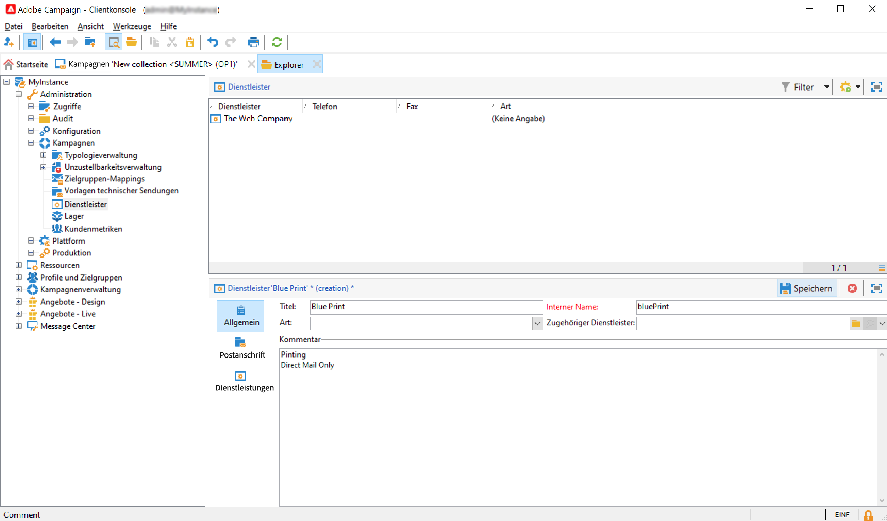
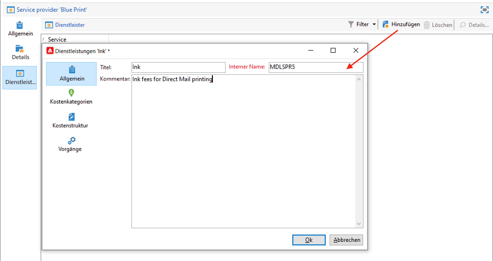
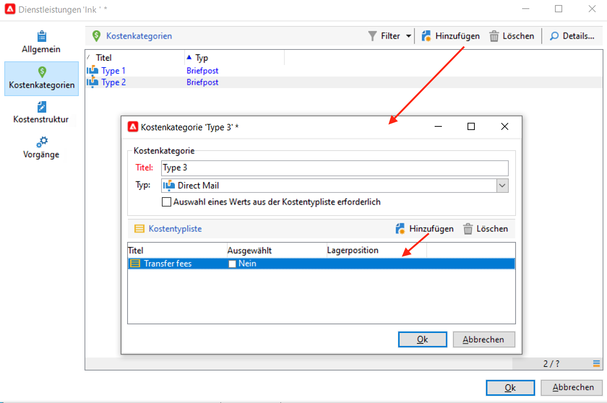
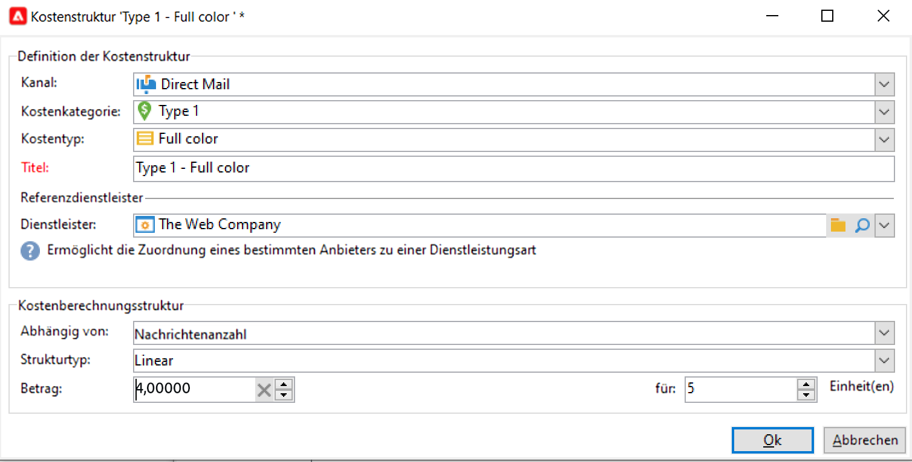
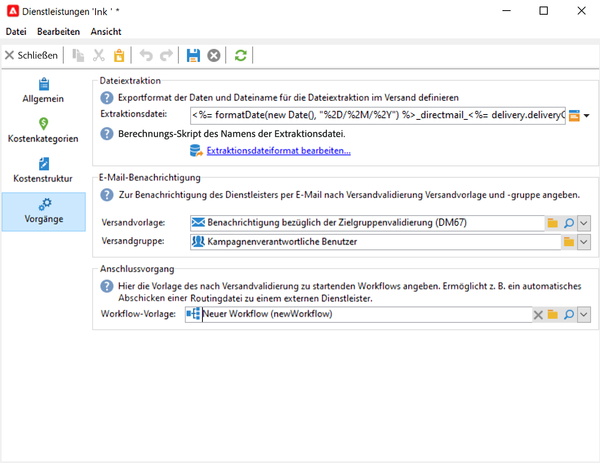
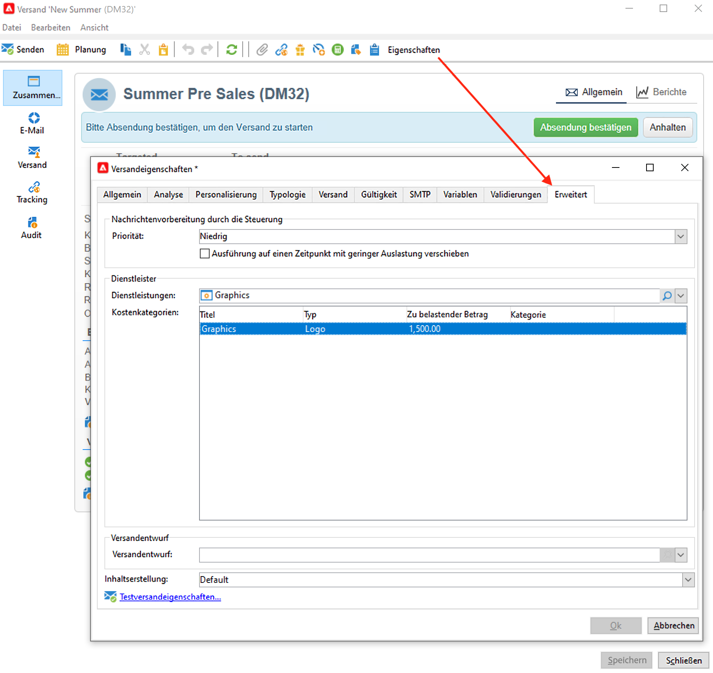
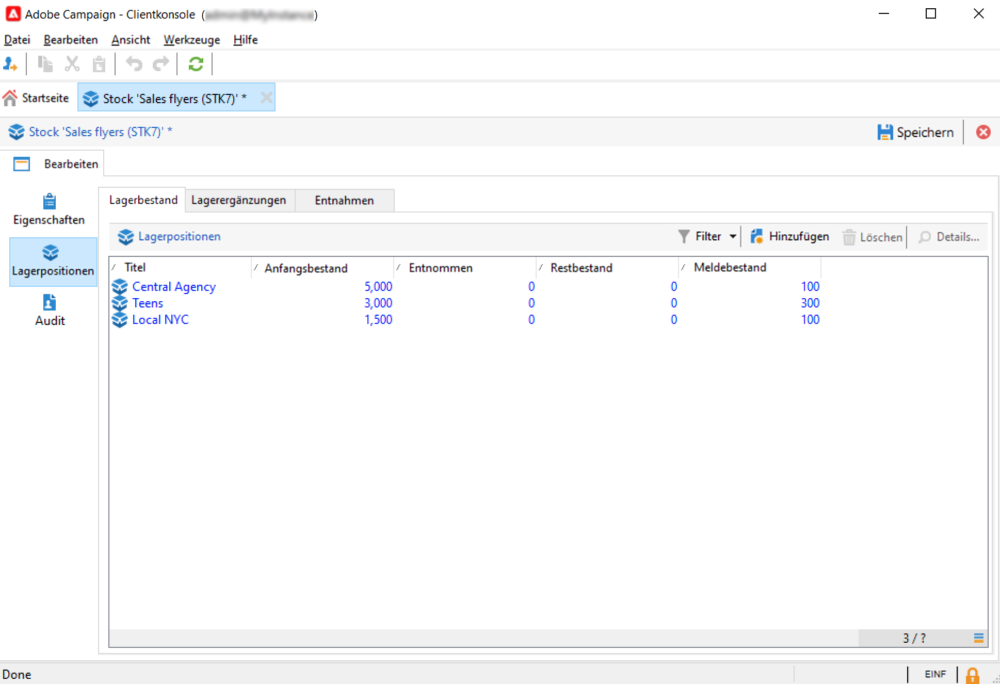
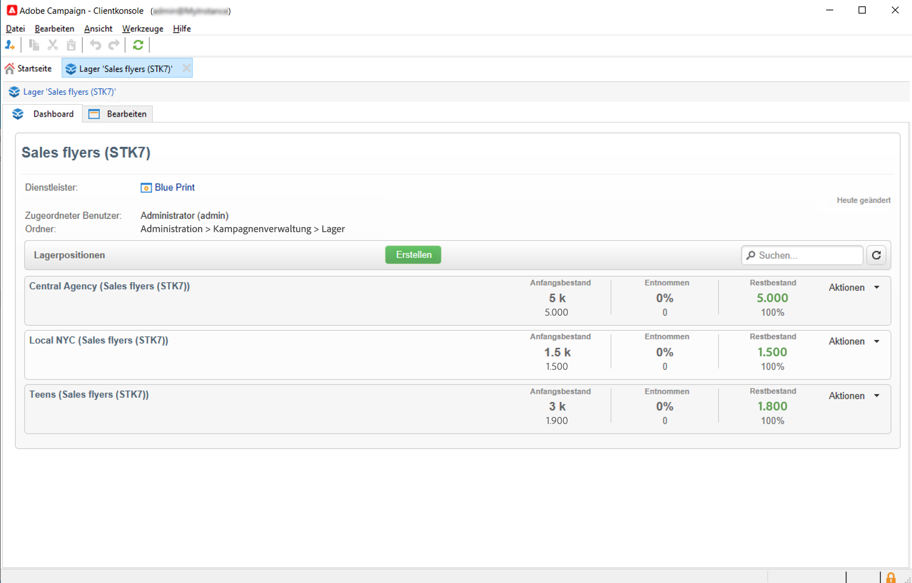
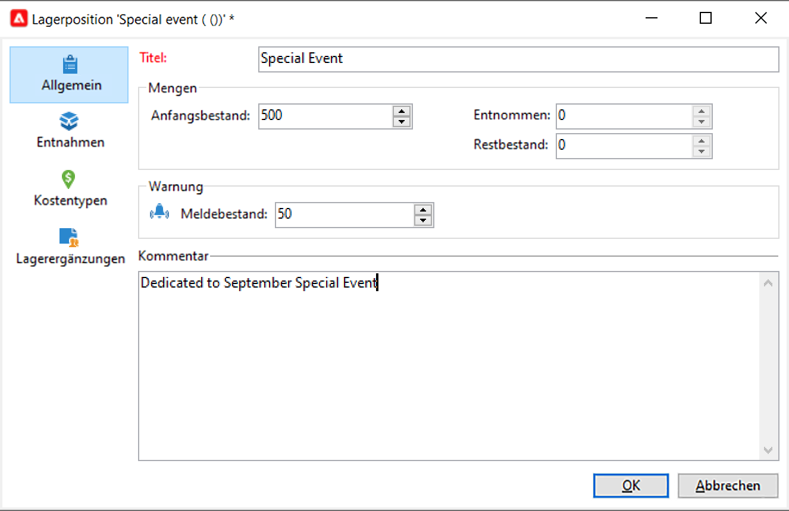

# Dienstleister, Lager und Budgets{#providers-stocks-and-budgets}

In Adobe Campaign haben Sie die Möglichkeit, Dienstleister zu bestimmen, die an der Ausführung bestimmter Vorgänge der Kampagnen beteiligt sind. Informationen bezüglich dieser Dienstleister und der ihnen zugeordneten Kostenstrukturen werden vom Adobe Campaign-Administrator über die allgemeine Übersicht festgelegt. Der Dienstleister wird auf Versandebene referenziert: Seine Kostenstrukturen ermöglichen die Berechnung der mit dem jeweiligen Versand verbundenen Kosten sowie die Verwaltung der betroffenen Lager.

## Erstellung von Dienstleistern und deren Kostenstrukturen {#create-service-providers-and-their-cost-structures}

Jeder Dienstleister wird in einer Datei gespeichert, die seine Kontaktdaten, Dienstleistungsvorlagen und verbundene Vorgänge enthält.

Dienstleister werden im Ordner **[!UICONTROL Administration > Kampagnen-Management]** des Campaign-Explorers konfiguriert.

Diverse, in Sendungen zu realisierende Vorgänge werden von Dienstleistern ausgeführt, insbesondere solche, die Briefpost und mobile Kanäle betreffen. Diese Dienstleister kommen beispielsweise in Druckvorgängen oder bei der Zustellung von Nachrichten zum Einsatz. Diese Vorgänge erfordern dienstleisterspezifische Einstellungen und verursachen Kosten. Die Konfiguration von Dienstleistern erfolgt in vier Schritten:

1. Erstellung eines Dienstleisters in Adobe Campaign. [Weitere Informationen](#add-a-service-provider)

1. Definition der Kostenstellen und -strukturen der entsprechenden Dienstleistungsvorlagen. [Weitere Informationen](#define-cost-categories)

1. Konfiguration der Vorgänge. [Weitere Informationen](#configure-processes-associated-with-a-service).

1. Referenzierung des Dienstleisters auf Kampagnenebene. [Weitere Informationen](#associate-a-service-with-a-campaign).

### Erstellen eines Dienstleisters und seiner Kostenkategorien {#create-a-service-provider-and-its-cost-categories}

#### Hinzufügen eines Dienstleisters {#add-a-service-provider}

Sie können so viele Dienstleister erstellen, wie für Ihre Sendungen notwendig sind. Gehen Sie wie folgt vor, um einen Dienstleister hinzuzufügen:

1. Klicken Sie auf die Schaltfläche **[!UICONTROL Neu]** oberhalb der Liste der Dienstleister.
1. Geben Sie im unteren Abschnitt des Fensters Namen und Kontaktdaten des Dienstleisters an.

   

1. Klicken Sie auf die Schaltfläche **[!UICONTROL Speichern]**, um ihn der Liste hinzuzufügen.

#### Definieren der Kostenstellen {#define-cost-categories}

Sie können jetzt Dienstleistungsvorlagen mit jedem Dienstleister verknüpfen. In diesen Vorlagen müssen Sie zunächst die Kostenstellen und bei Bedarf den betreffenden Bestand festlegen. Anschließend können Sie über die Kostenstrukturen die Kostenberechnungsregeln für jede Kategorie erstellen. [Weitere Informationen](#define-the-cost-structure).

Eine Kostenkategorie ist eine Gruppe verschiedener Kosten, die für einen bestimmten Versandtyp (E-Mail, Briefpost, SMS usw.) verwendet werden können. Kostenstellen sind in den mit den Dienstleistern verknüpften Dienstleistungsvorlagen zusammengefasst. Jeder Dienstleister kann auf eine oder mehrere Dienstleistungsvorlagen verweisen.

Um eine Dienstleistungsvorlage zu erstellen und ihren Inhalt zu bestimmen, gehen Sie wie folgt vor:

1. Klicken Sie auf der Registerkarte **[!UICONTROL Services]** des Dienstleisters auf die Schaltfläche **[!UICONTROL Hinzufügen]** und geben Sie den Namen der Dienstleistungsvorlage ein.

   

1. Erstellen Sie die Kostenstellen für jeden Prozesstyp (Briefpost/E-Mail/etc. oder Aufgabe). Klicken Sie dazu auf die Schaltfläche **[!UICONTROL Kostenstellen]** und dann die **[!UICONTROL Hinzufügen]** und geben Sie die Parameter jeder Kostenstelle an.

   

   * Geben Sie eine Bezeichnung für diese Kostenkategorie ein und wählen Sie den betreffenden Vorgangstyp aus: **[!UICONTROL Briefpost]**, **[!UICONTROL E-Mail]**, **[!UICONTROL Mobilgerät]** usw.
   * Klicken Sie auf die Schaltfläche **[!UICONTROL Hinzufügen]**, um die mit dieser Kostenkategorie verbunden Kostentypen zu bestimmen.
   * Bei Bedarf können Sie jedem Kostentyp eine Lagerposition hinzufügen, um den bestehenden Lagern automatisch die verwendeten Mengen anzurechnen.

     >[!NOTE]
     >
     >Die Lagerpositionen werden im Knoten **[!UICONTROL Lagerverwaltung]** definiert. [Weitere Informationen](#stock-and-order-management).

1. Sie können einen Wert für diese Kostenstelle vorab auswählen. Dieser wird dann der Standardwert in den Kostenstellen des Dienstleisters (anstelle eines leeren Werts). Aktivieren Sie dazu in der Spalte **[!UICONTROL Ausgewählt]** für den betreffende Kategorietyp die Option **Ja**:

   

   Auf Versandebene wird der Wert standardmäßig vorgeschlagen.

### Definieren der Kostenstruktur {#define-the-cost-structure}

Eine Kostenstruktur spezifiziert für jede Kostenkategorie die anzuwendenden Berechnungsregeln.

Klicken Sie auf **[!UICONTROL Kostenstruktur]** um die Kostenberechnung für jede Kostenstelle und jeden Kostentyp zu konfigurieren. Klicks **[!UICONTROL Hinzufügen]** und geben Sie die Kostenstruktur an.

* Um die Kostenstruktur zu erstellen, wählen Sie in den Dropdown-Listen den Nachrichtentyp, die betreffende Kostenstelle sowie den Kostentyp aus, auf den die Berechnungsregel angewendet werden soll. Der Inhalt dieser Dropdown-Listen stammt aus den Informationen, die über die **[!UICONTROL Kostenstellen]** Registerkarte.

  Sie müssen der Kostenstruktur einen Titel zuweisen. Standardmäßig hat sie den folgenden Versandentwurf: **Kostenstelle - Kostentyp**.

  Dieser kann jedoch angepasst werden: Erfassen Sie den gewünschten Wert direkt im Feld **[!UICONTROL Titel]**.

* Die Formel zur Berechnung der Kosten wird im unteren Abschnitt des Fensters definiert.

  Diese Formel kann unabhängig von der Nachrichtenanzahl festgelegt oder entsprechend der Nachrichtenanzahl berechnet werden.

  Wenn die Formel von der Nachrichtenanzahl abhängt, kann die Struktur der Kostenberechnung **[!UICONTROL Linear]**, **[!UICONTROL Linear mit Schwellen]** oder **[!UICONTROL Pauschal mit Schwellen]** sein.

#### Lineare Struktur {#linear-structure}

Wenn es sich unabhängig von der Gesamtzahl von Nachrichten immer um den gleichen Betrag für eine Nachricht (oder eine Gruppe von Nachrichten) handelt, wählen Sie den Strukturtyp **[!UICONTROL Linear]** aus und geben Sie die Kosten pro Nachricht an.

Wenn der Betrag auf eine bestimmte Anzahl an Nachrichten angewandt wird, geben Sie diese im Feld **[!UICONTROL für]** an.

#### Lineare Struktur mit Schwellen {#linear-structure-by-threshold}

Wenn der Betrag entsprechend dem Schwellenwert für jede Nachricht angewandt wird, muss die Berechnungsstruktur **[!UICONTROL Linear mit Schwellen]** festgelegt werden. Mit dieser Art von Kostenstruktur kostet zum Beispiel jede Nachricht 0,13, wenn die Gesamtzahl der Nachrichten zwischen 1 und 100 liegt, 0,12 bei zwischen 100 und 1.000 versendeten Nachrichten und 0,11 jenseits von 1.000 Nachrichten.

Die entsprechende Konfiguration sieht wie folgt aus:

Klicken Sie auf die Schaltfläche **[!UICONTROL Hinzufügen]** rechts von der Liste, um einen neuen Schwellenwert zu definieren.

#### Konstante Struktur mit Schwellen {#constant-structure-by-threshold}

Schließlich können Sie eine Kostenberechnung entsprechend der Gesamtzahl der Nachrichten konfigurieren. Wählen Sie dazu eine **[!UICONTROL Konstante durch Schwelle]** Berechnungsstruktur. Beispielsweise werden die Kosten für 1 bis 100 Nachrichten auf einen festen Betrag von 12,00 gesetzt, für 1 bis 100 Nachrichten auf 100,00 für einen Versand von 101 bis 1000 Nachrichten und 500,00 für einen Versand über 1000 Nachrichten, unabhängig von der Gesamtzahl.

### Konfigurieren von mit einem Service verknüpften Vorgängen {#configure-processes-associated-with-a-service}

Über die Registerkarte **[!UICONTROL Vorgänge]** können Sie Informationen über die mit dem Dienstleister verbundenen Prozesse zuordnen. In diesem Bereich können Sie den Informationsversand an den Router konfigurieren.

* Die **[!UICONTROL Dateiextraktion]** gibt die Exportvorlage an, die bei Auswahl dieses Dienstes für den Versand verwendet wird. Sie können den Namen der Ausgabedatei im **[!UICONTROL Extraktionsdatei]** -Feld. Die rechts vom Feld gelegene Schaltfläche ermöglicht das Einfügen von Variablen.

* Im Abschnitt **[!UICONTROL Benachrichtigungs-E-Mail]** können Sie die Vorlage für die Benachrichtigung von Dienstanbietern nach dem Versand von Dateien angeben. Wählen Sie die Vorlage, mit der die Benachrichtigung erstellt werden soll, und die Gruppe der Empfänger.

  Die Versandvorlagen für Benachrichtigungen werden standardmäßig im Ordner **[!UICONTROL Administration > Kampagnen-Management > Vorlagen technischer Sendungen]** gespeichert, auf den über die allgemeine Ansicht zugegriffen werden kann.

* Im Abschnitt **[!UICONTROL Anschlussvorgang]** können Sie den Workflow auswählen, der nach der Genehmigung des Versands gestartet werden soll. Wenn eine Workflow-Vorlage angegeben wird, wird nach beendeter Validierung automatisch eine Workflow-Instanz erstellt und gestartet. Dieser Workflow kann beispielsweise die Extraktionsdatei zur Verarbeitung an einen externen Dienstleister senden.

### Zuordnen von Services zu Kampagnen {#associate-a-service-with-a-campaign}

Dienstleister sind mit dem Kampagnenversand verknüpft. Sie werden in Versandvorlagen referenziert, damit sie ihre Dienstleistungen in den mithilfe dieser Vorlagen erstellten Sendungen anbieten können.

Wenn ein Service ausgewählt wird, werden die dem Versandtyp (Direkt-Mail, E-Mail usw.) entsprechenden Kostenkategorien automatisch in der zentralen Tabelle angegeben, ebenso wie die bereits definierten Vorgangsoptionen.

>[!NOTE]
>
>Wenn bei der Auswahl einer Dienstleistung keine Kostenstelle angezeigt wird, bedeutet dies, dass für diese Art von Prozess keine Kostenstelle definiert wurde. Beispiel: Bei einem E-Mail-Versand, falls nicht **[!UICONTROL Email]** Kostenstelle wurde definiert, es wird keine Kategorie angezeigt und die Auswahl des Dienstes hat keine Auswirkungen.

* In Direkt-Mail-Sendungen können Sie den Service über das Konfigurationsfenster auswählen.

  

* In Mobile- oder Telefonsendungen werden Dienstleistungen auf die gleiche Weise wie bei Briefpost-Sendungen ausgewählt.
* In E-Mail-Sendungen werden Dienstleistungen über den Tab **[!UICONTROL Erweitert]** der Eigenschaften des jeweiligen Versands ausgewählt, wie im folgenden Beispiel:

  

Über die Spalte **[!UICONTROL Zu belastender Betrag]** können Kosten für diese Stelle im Kontext des betreffenden Versands oder der Aufgabe hinzugefügt werden.

Bei der Bestimmung der Kostenstellen eines Versands können Sie eine obligatorische Auswahl eines Kostentyps definieren. Wählen Sie dazu **[!UICONTROL Auswahl eines Werts aus der Kostentypliste erforderlich]**.

## Verwaltung von Lagern und Lagerergänzungen {#stock-and-order-management}

Kostentypen können Lagerpositionen zugeordnet werden, um Bestandsmeldungen zu verwalten, Lagerergänzungen zu verfolgen und Bestellungen zu tätigen.

Um die Verwaltung von Lagern und Lagerergänzungen in Adobe Campaign einzusetzen und Benutzern für die Durchführung eines Versands unzureichende Bestände zu melden, ist die Einhaltung folgender Schritte erforderlich:

1. Erstellung von Lagern und Referenzierung von zugeordneten Dienstleistern. [Weitere Informationen](#create-a-stock).

1. Hinzufügen von Lagerpositionen. [Weitere Informationen](#add-stock-lines).

1. Benachrichtigung der Benutzenden im Falle eines Warnhinweises. [Weitere Informationen](#alert-operators).

1. Bestellungen und Lieferungen. [Weitere Informationen](#orders).

### Lagerverwaltung {#stock-management}

Adobe Campaign kann eine Benutzergruppe benachrichtigen, wenn das Lager leer ist oder einen Mindestbestand erreicht hat. Auf die Lagerbestände kann über den Link **[!UICONTROL Lager]** im Tab **[!UICONTROL Kampagnen]** über den Link **[!UICONTROL Andere Auswahlmöglichkeiten]** des Navigationsbereichs zugegriffen werden.

#### Erstellen eines Lagers {#creating-a-stock}

Folgen Sie den nachstehenden Etappen, um ein neues Lager zu erstellen:

1. Klicken Sie auf die Schaltfläche **[!UICONTROL Erstellen]** oberhalb der Liste der existierenden Lager.
1. Geben Sie den Titel des Lagers an und wählen Sie in der Dropdown-Liste den zugehörigen Dienstleister aus. [Weitere Informationen](#create-service-providers-and-their-cost-structures).

#### Hinzufügen von Lagerpositionen {#add-stock-lines}

Ein Lager setzt sich aus unterschiedlichen Lagerpositionen zusammen. Eine Lagerposition enthält eine Anfangsmenge der Ressourcen, die von den Sendungen verbraucht werden. Jede Position enthält außerdem die verbrauchte Menge, den Restbestand sowie die bestellte Menge.

Klicken Sie bei der Erstellung eines Lagers auf den Tab **[!UICONTROL Lagerpositionen]**, um neue Positionen hinzuzufügen.

Nachdem das Lager erstellt wurde, können Sie sein Dashboard verwenden, um Lagerpositionen zu erstellen und zu überwachen.

Klicken Sie auf die Schaltfläche **[!UICONTROL Erstellen]**, um neue Lagerpositionen hinzuzufügen.

* Geben Sie die Anfangsmenge des Lagerbestands im **[!UICONTROL Anfangsbestand]** -Feld. Die **[!UICONTROL Entnommen]** und **[!UICONTROL Auf Lager]** -Felder werden automatisch berechnet und mit dem Fortschritt der Kampagnen aktualisiert.

  

* Geben Sie im Feld **[!UICONTROL Meldebestand]** die Schwelle an, bei der die Benutzer von einer notwendigen Lagerergänzung benachrichtigt werden sollen. Mit Erreichen des Meldebestands wird im Validierungsfenster der Sendungen, die auf dieses Lager zugreifen, ein Warnhinweis angezeigt.

#### Zuordnen einer Lagerposition zu Kostenkategorien {#associate-a-stock-with-cost-categories}

Folgendes Beispiel zeigt, wie Lagerpositionen in Dienstleistungen über die Kostenkategorien zugeordnet werden können:

### Lagerverfolgung {#stock-tracking}

#### Warnen von Benutzenden {#alert-operators}

Bei einem Versand, der auf eine Lagerposition mit unzureichendem Bestand zugreift, wird ein Warnhinweis angezeigt. Das unten stehende Beispiel zeigt die Meldung, die bei Validierung einer Extraktionsdatei erscheint:

#### Lagerergänzungen {#orders}

Im Untertab **[!UICONTROL Lagerergänzungen]** werden die laufenden Bestellungen angezeigt und neue Ergänzungen gespeichert.

Um eine neue Ergänzung zu speichern, öffnen Sie die entsprechende Lagerposition, klicken Sie auf die Schaltfläche **[!UICONTROL Hinzufügen]** und geben Sie das Lieferdatum sowie die bestellte Menge an.

>[!NOTE]
>
>Mit Erreichen des Lieferdatums verschwindet die Lagerergänzungszeile automatisch und die im Feld **[!UICONTROL Menge]** angegebene Ergänzung wird im Tab **[!UICONTROL Verfolgung]** angezeigt. Sie wird zudem automatisch dem Bestand hinzugefügt.

Die **[!UICONTROL Verbrauch]** enthält das pro Kampagne verbrauchte Volumen. Die Informationen in diesem Tab werden entsprechend den durchgeführten Sendungen automatisch angegeben. Klicken Sie auf **[!UICONTROL Bearbeiten]** -Schaltfläche, um die betreffende Kampagne zu öffnen.

## Berechnen von Budgets {#calculate-budgets}

### Funktionsprinzip {#principle}

Sie haben die Möglichkeit, Kosten für Sendungen oder Kampagnen zu verwalten und diese auf zuvor definierte Budgets anzurechnen.

Die Versandkosten einer Kampagne werden in der jeweiligen Kampagne, die Kosten aller Kampagnen eines Programms im jeweiligen Programm konsolidiert. Dedizierte Berichte ermöglichen die Verfolgung der Budgets für die gesamte Plattform oder für jeden Plan und jedes Programm.

### Implementierung {#implementation}

Wenn Sie in einer Kampagne ein Budget auswählen, müssen Sie den Ausgangsbetrag angeben. Die berechneten Kosten werden automatisch aktualisiert, entsprechend dem Verbindlichkeitsniveau der angegebenen Beträge (realisierte, geplante, reservierte, eingesetzte Ausgaben).

<!--
See [Calculating amounts](../../mrm/using/controlling-costs.md#calculating-amounts).

>[!NOTE]
>
>The procedure for creating budgets is presented in [Creating a budget](../../mrm/using/controlling-costs.md#creating-a-budget).
-->
