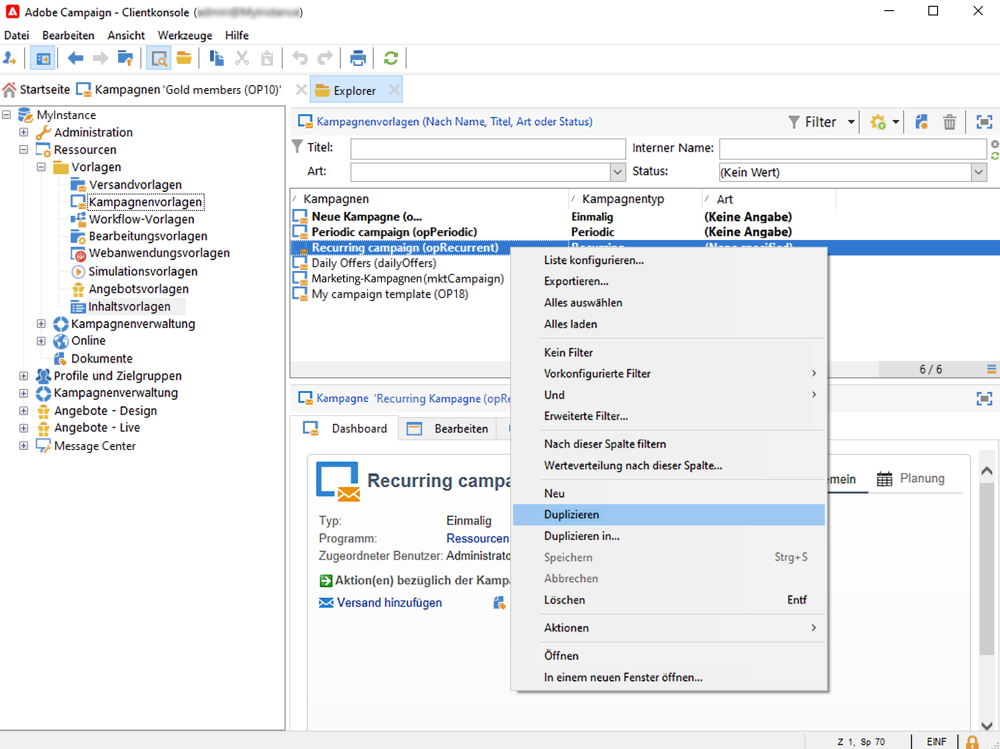
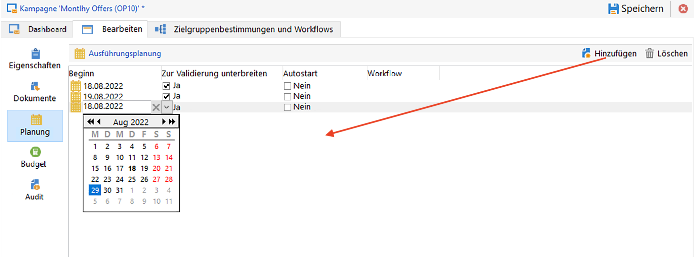
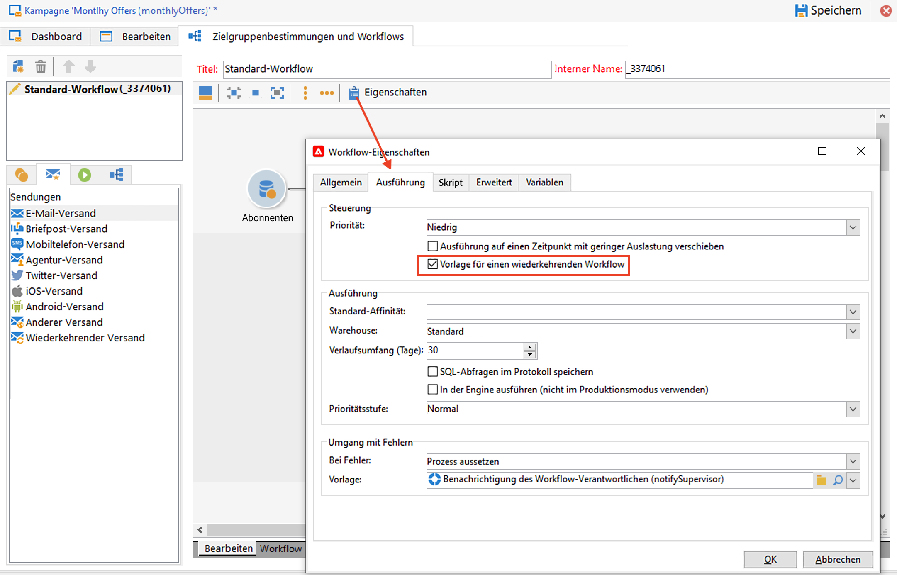
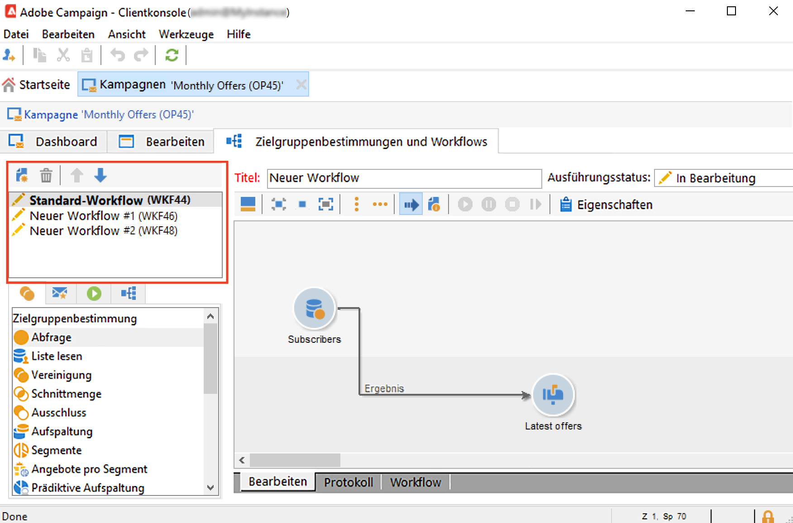
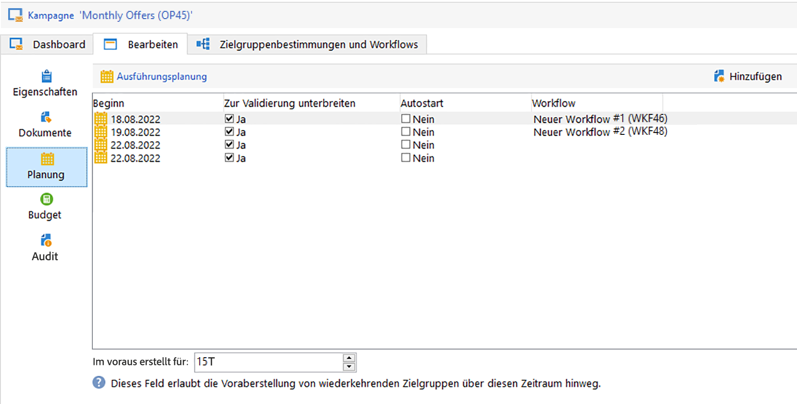

# Wiederkehrende und periodische Kampagnen {#recurring-and-periodic-campaigns}

A **wiederkehrende Kampagne** ist eine auf einer bestimmten Vorlage basierende Kampagne, deren Workflows so konfiguriert sind, dass sie entsprechend einem verknüpften Zeitplan ausgeführt werden. Die Zielgruppenbestimmung wird bei jeder Ausführung dupliziert und die unterschiedlichen Prozesse und Zielgruppen werden verfolgt.  Nach der Konfiguration erstellen wiederkehrende Kampagnen automatisch einen neuen Workflow (durch Duplizieren der Workflow-Vorlage) und führen ihn aus. Wenn Sie beispielsweise monatliche Erinnerungen an ein Zielgruppensegment senden möchten, konfigurieren Sie eine wiederkehrende Kampagne, sodass zu Beginn jedes Jahres zwölf Workflows erstellt werden, eine pro Monat. [Weitere Informationen](#create-a-recurring-campaign)

A **periodische Kampagne** ist eine auf einer bestimmten Vorlage basierende Kampagne, mit der Sie Kampagneninstanzen basierend auf einem Ausführungsplan erstellen können. Kampagneninstanzen werden automatisch basierend auf einer periodischen Kampagnenvorlage erstellt, je nach der im Vorlagenplan festgelegten Häufigkeit. [Weitere Informationen](#create-a-periodic-campaign)

## Erstellen einer wiederkehrenden Kampagne {#create-a-recurring-campaign}

Wiederkehrende Kampagnen werden anhand einer bestimmten Vorlage erstellt, die die auszuführende Workflow-Vorlage und die Ausführungsplanung definiert.

### Erstellen einer Vorlage für wiederkehrende Kampagnen {#create-the-campaign-template}

Gehen Sie wie folgt vor, um eine Vorlage für wiederkehrende Kampagnen zu erstellen:

1. Öffnen Sie den Campaign-Explorer und navigieren Sie zu **[!UICONTROL Ressourcen > Vorlagen > Kampagnenvorlagen]**.
1. Duplizieren Sie das integrierte **[!UICONTROL Wiederkehrende Kampagne]** Vorlage.
   
1. Geben Sie den Titel der Vorlage sowie die Dauer der Kampagne an.
1. Legen Sie im für diesen Kampagnentyp vorgesehenen Tab **[!UICONTROL Planung]** die Zeitpunkte der wiederholten Ausführungen fest. Definieren Sie in diesem Tab die Ausführungsdaten der auf dieser Vorlage basierenden Kampagnen.
   

   Der Konfigurationsmodus der Ausführungsplanung entspricht dem **[!UICONTROL Planung]** -Objekt des Workflows. [Weitere Informationen](../workflow/scheduler.md).

   >[!CAUTION]
   >
   >Die Konfiguration der Ausführungsplanung muss sorgfältig durchgeführt werden. Wiederkehrende Kampagnen duplizieren die Workflows ihrer Vorlage entsprechend dem festgelegten Zeitplan. Dieser Vorgang kann Ihre Datenbank überlasten.

1. Geben Sie u. U. einen Wert im Feld **[!UICONTROL Im Voraus erstellen für]** an, um die entsprechenden Workflows für den angegebenen Zeitraum zu erstellen.
1. Im **[!UICONTROL Zielbestimmungen und Workflows]** erstellen Sie die Workflow-Vorlage, die in auf dieser Vorlage basierenden Kampagnen verwendet werden soll. Dieser Workflow enthält in der Regel die Zielgruppenbestimmungsparameter sowie einen oder mehrere Sendungen.

   >[!NOTE]
   >
   >Dieser Workflow muss als Vorlage für einen wiederkehrenden Workflow gespeichert werden. Öffnen Sie hierzu die Eigenschaften des Workflows und wählen Sie die Option **[!UICONTROL Vorlage für einen wiederkehrenden Workflow]** im Tab **[!UICONTROL Ausführung]** aus.

   

### Erstellen einer wiederkehrenden Kampagne {#create-the-recurring-campaign}

Um die wiederkehrende Kampagne zu erstellen und ihre Workflows gemäß dem in der Vorlage festgelegten Zeitplan auszuführen, müssen Sie:

1. Erstellen Sie eine neue Kampagne basierend auf Ihrer Vorlage für wiederkehrende Kampagnen.
1. Füllen Sie die Ausführungsplanung für den Workflow im **[!UICONTROL Zeitplan]** Registerkarte. Die Kampagnenplanung ermöglicht es, jeweils ein Datum anzugeben, an dem der Workflow automatisch erstellt oder gestartet wird.

   Für jede Zeile können die folgenden ergänzenden Optionen hinzugefügt werden:

   * Aktivieren Sie die **[!UICONTROL Zu genehmigen]** -Option, um die Validierungsanfragen für den Versand im Workflow zu erzwingen.
   * Aktivieren Sie die **[!UICONTROL Erste Schritte]** , um den Workflow bei Erreichen des Anfangsdatums zu starten.

   Das Feld **[!UICONTROL Im Voraus erstellen für]** ermöglicht es, alle Workflows für den angegebenen Zeitraum zu erstellen.

   Bei Ausführung des **[!UICONTROL Kampagnenvorgänge]**-Workflows werden die dedizierten Workflows entsprechend der zuvor festgelegten Kampagnenplanung erstellt, d. h. ein Workflow für jedes Ausführungsdatum.

1. Wiederkehrende Workflows werden automatisch über die Workflow-Vorlage in der Kampagne erstellt. Sie werden im Tab **[!UICONTROL Zielbestimmungen und Workflows]** der Kampagne angezeigt.

   

   Der Titel der Instanz eines wiederkehrenden Workflows setzt sich aus dem Titel seiner Vorlage sowie der Workflow-Nummer zusammen, getrennt durch eine Raute.

   Die basierend auf der Planung erstellten Workflows werden dieser automatisch in der Spalte **[!UICONTROL Workflow]** des Tabs **[!UICONTROL Planung]** zugeordnet.

   

   Jeder Workflow kann von diesem Tab aus bearbeitet werden.

   >[!NOTE]
   >
   >Das Anfangsdatum der dem Workflow zugeordneten Planungszeile ist über eine Variable des Workflows mit der folgenden Syntax verfügbar:\
   >`$date(instance/vars/@startPlanningDate)`

## Erstellen einer periodischen Kampagne {#create-a-periodic-campaign}

Eine periodische Kampagne ist eine auf einer bestimmten Vorlage basierende Kampagne, mit der Sie Kampagneninstanzen auf der Grundlage einer Ausführungsplanung erstellen können. Kampagneninstanzen werden automatisch auf Basis einer Vorlage für periodische Kampagnen und abhängig von der in der Vorlagenplanung definierten Häufigkeit erstellt.

### Erstellen der Kampagnenvorlage {#create-the-campaign-template-1}

1. Öffnen Sie den Campaign-Explorer und navigieren Sie zu **[!UICONTROL Ressourcen > Vorlagen > Kampagnenvorlagen]**.
1. Duplizieren Sie das integrierte **[!UICONTROL Regelmäßige Kampagne]** Vorlage.
1. Konfigurieren Sie die Vorlage.

   >[!NOTE]
   >
   >Der Benutzer, dem die Vorlage zugewiesen wurde, muss über die entsprechenden Berechtigungen zum Erstellen von Kampagnen im ausgewählten Programm verfügen.

1. Erstellen Sie den mit dieser Vorlage verknüpften Workflow. Dieser Workflow wird in jeder periodischen Kampagne dupliziert, die von der Vorlage erstellt wird.

   >[!NOTE]
   >
   >Es handelt sich hier um eine Workflow-Vorlage. Der eigentliche Workflow kann nicht von der Kampagnenvorlage aus gestartet werden.

1. Gehen Sie zur Eingabe der Ausführungsplanung wie in der Vorlage für wiederkehrende Kampagnen vor: Klicken Sie auf die Schaltfläche **[!UICONTROL Hinzufügen]** und bestimmen Sie Anfang und Ende oder ergänzen Sie die Ausführungsplanung über den entsprechenden Link.

   >[!CAUTION]
   >
   >Vorlagen für periodische Kampagnen erstellen neue Kampagnen entsprechend der zuvor festgelegten Planung. Die Konfiguration der Ausführungsplanung muss mit Vorsicht erfolgen, um die Adobe-Campaign-Datenbank nicht zu überlasten.

1. Mit Erreichen des Ausführungsbeginns wird die jeweilige Kampagne automatisch erstellt. Sie übernimmt alle in der Vorlage festgelegten Parameter.

   Jede Kampagne kann über die Ausführungsplanung in der Vorlage bearbeitet werden.

   Jede periodische Kampagne enthält die gleichen Elemente und wird nach der Erstellung wie eine Standardkampagne verwaltet.
