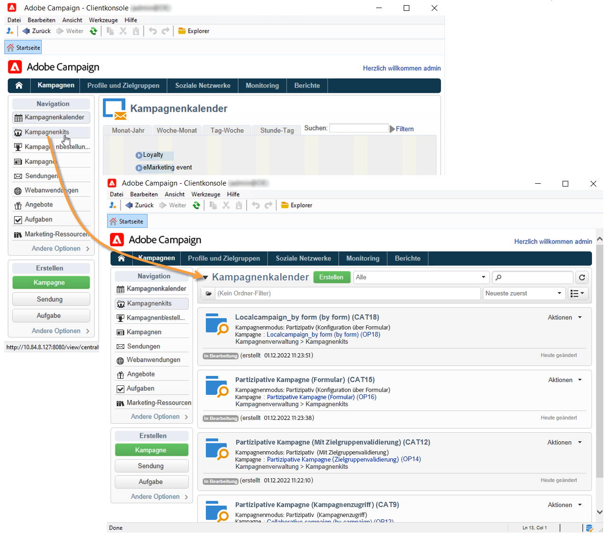
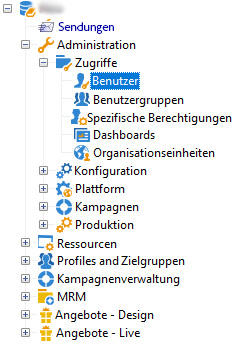
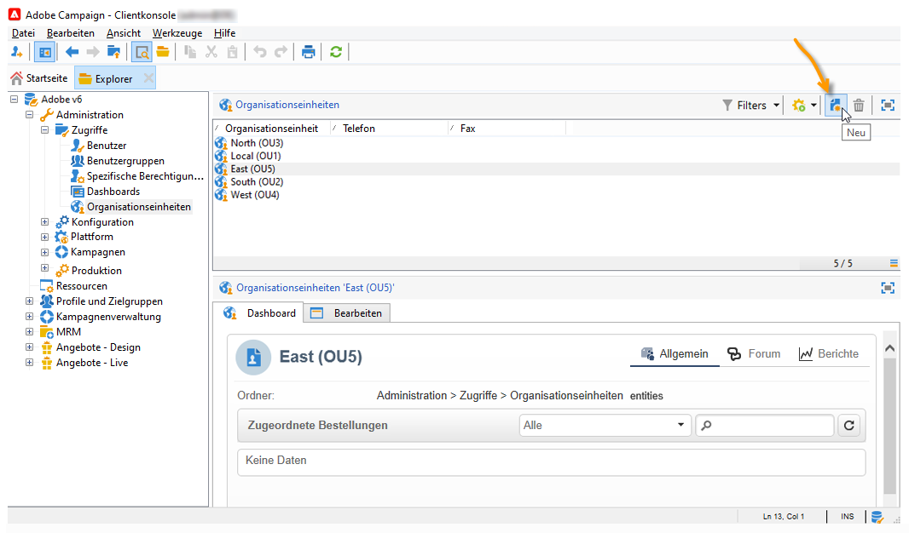
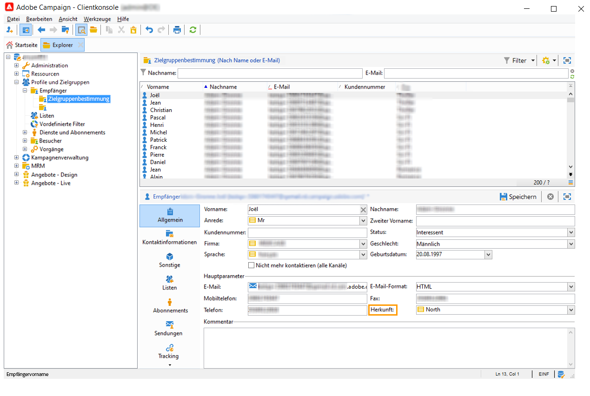

# Erste Schritte mit dezentralem Marketing{#about-distributed-marketing}

Die Option **Distributed Marketing** von Adobe Campaign ermöglicht es, partizipative Kampagnen zwischen Zentralstellen (z. B. dem Unternehmenssitz, der Marketing-Abteilung etc.) und Lokalstellen (z. B. Verkaufsstellen, regionalen Zweigstellen etc.) einzurichten. Die Zusammenarbeit basiert auf einem kollaborativen Arbeitsbereich, der **[!UICONTROL Kampagnenkit-Liste]**, an dem Kampagnenmodelle und -instanzen, die von Zentralstellen erstellt wurden, Lokalstellen zur Verfügung gestellt werden.

Kampagnen präsentieren sich in Form von sogenannten Kits, welche auf eine lokale oder eine partizipative Nutzung ausgelegt sein können. Zur Teilnahme müssen die Lokalstellen die gewünschten Kampagne bestellen. Diese werden erst durch die Validierung der Bestellung seitens der Zentralstelle tatsächlich verfügbar.

>[!CAUTION]
>
>Distributed Marketing ist eine Option von **Campaign**. Bitte überprüfen Sie Ihren Lizenzvertrag.

## Terminologie {#terminology}

* **Zentralstelle**

   Zentralstellen bestehen aus den Benutzern der Plattform, die die Marketingkommunikation festlegen und die Lokalstellen bei der Erstellung und Ausführung ihrer Kampagnen begleiten.

   Mithillfe des dezentralen Marketings können Zentralstellen:

   * Lokalstellen Kampagnenkits zur Verfügung stellen;
   * Freiräume definieren, innerhalb derer Lokalstellen die Kommunikation mit Kunden und Interessenten in Bezug auf Zielgruppen und Inhalte bestimmen können;
   * Kosten verwalten und begrenzen;
   * die Durchführung von Kampagnen niederlassungsübergreifend koordinieren.

* **Lokalstelle**

   Lokalstellen sind beispielsweise Agenturen, Verkaufsstellen oder bestimmte lokale Benutzergruppen (Verantwortliche eines Landes oder einer Region, Verantwortliche einer Marke).

   Dezentrales Marketing ermöglicht Lokalstellen eine größere Unabhängigkeit sowie eine Optimierung der Ausführungskosten.

* **Lokale Anpassung**

   Lokalstellen haben die Möglichkeit, ihnen zur Verfügung stehende Kampagnen an lokale Gegebenheiten anzupassen. Der Umfang der Anpassungsmöglichkeiten hängt vom Kampagnentyp ab und kann von der Zielgruppen- bis zur Inhaltsänderung reichen.

* **Kampagnenkit-Liste**

   Die Kampagnenkit-Liste enthält die Kampagnen, die für Lokalstellen zur Verfügung stehen.

* **Kampagnenkit**

   Vorlage oder Kampagneninstanz, die von der Zentralstelle erstellt und den Lokalstellen zur Verfügung gestellt wird.

* **Lokale Kampagnen**

   Eine lokale Kampagne ist eine über eine in der **[!UICONTROL Kampagnenkit]**-Liste verzeichnete Vorlage erstellte Kampagneninstanz mit einer **spezifischen Ausführungsplanung** bei jeder Bestellung der Lokalstelle. Lokale Kampagnen ermöglichen es, mit einer von der Zentralstelle formalisierten und konfigurierten Vorlage auf lokale Bedürfnisse zu antworten.

   Der Umfang der Anpassungsmöglichkeiten für die Lokalstelle ist abhängig von der gewählten Kampagnenart.

   Siehe [Erstellung einer lokalen Kampagne](creating-a-local-campaign.md).

* **Partizipative Kampagnen**

   Eine partizipative Kampagne ist eine Kampagne, deren **Ausführungsplanung von der Zentralstelle festgelegt** wird. Die Lokalstellen können frei entscheiden, ob sie teilnehmen oder nicht. Abhängig von der Konfiguration der Kampagne können Zielgruppe und Inhalt von der Lokalstelle angepasst werden. Es gibt verschiedene Arten partizipativer Kampagnen:

   * **[!UICONTROL Partizipative Kampagne (Formular)]**: eignet sich für Kampagnen für bis zu 300 Lokalstellen. Die Lokalstelle kann vordefinierte Parameter zur Zielgruppe und Inhaltspersonalisierung in einem Web-Formular erfassen. Es kann sowohl ein Adobe Campaign-Formular als auch ein externes Formular (Kunden-Extranet) verwendet werden. Die Definition und Konfiguration des Formulars können von einem funktionellen Administrator auf Basis einer vom Systemintegrator definierten Formularvorlage erfolgen. Zur Bestellung der Kampagne benötigt die Lokalstelle in diesem Fall nur Web-Zugriff.
   * **[!UICONTROL Partizpative Kampagne (Kampagnenzugriff)]**: eignet sich für Kampagnen für einige Dutzend Lokalstellen. Dieser Kampagnentyp erstellt untergeordnete Kampagnen für jede Lokalstelle. Wenn die Bestellung einer **[!UICONTROL Partizipativen Kampagne mit Kampagnenzugriff]** von der Zentralstelle validiert wurde, wird die Kampagne der Lokalstelle zur Verfügung gestellt und kann von dieser angepasst werden. Die Ausführung von über- und untergeordneten Kampagnen wird automatisch synchronisiert. Die Lokalstelle benötigt Zugriff zu einer Instanz, um die Kampagne zu bestellen und ausführen zu können.
   * **[!UICONTROL Partizipative Kampagne (Zielgruppenvalidierung)]**: eignet sich für Kampagnen für mehrere Tausend Lokalstellen. Die Lokalstellen erhalten eine von der Zentralstelle ausgewählte Kontaktliste. Sie haben dank eines Web-Formulars die Möglichkeit, je nach Inhalt der Kampagne Kontakte herauszustreichen. Die teilnehmenden Lokalstellen werden von der ausgewählten Kontaktliste abgeleitet. Die Lokalstelle benötigt lediglich einen Web-Zugriff, um an der Kampagne teilnehmen zu können.
   * **[!UICONTROL Partizipative Kampagne ohne Konfiguration]**: Dieser Modus stellt die Kompatibilität mit dezentralen Kampagnen aus vorhergehenden Versionen sicher.

   Weitere Informationen finden Sie unter [Partizipative Kampagne erstellen](creating-a-collaborative-campaign.md).

**Kampagnenkit-Bestellung**

Um an einer Kampagne teilnehmen zu können, bestellt die Lokalstelle den entsprechenden Kampagnenkit und gibt hierbei sämtliche für die lokale Anpassung erforderlichen Informationen an.

## Arbeitsbereich      {#workspace}

Die Kampagnenkit-Liste ist über den Tab **Kampagnen** zugänglich: Klicken Sie dort auf **[!UICONTROL Kampagnenkits]**.

Dieses Fenster ermöglicht jedem lokalen Benutzer, die für seine Agentur verfügbaren Kampagnen einzusehen.

Für zentrale Agenturen besteht hier Zugriff auf alle verfügbaren Kampagnenkits.

## Benutzer und Organisationseinheiten {#operators-and-entities}

Bestimmen Sie zunächst die Akteure der Zentral- und Lokalstellen im Ordner **[!UICONTROL Zugriffsverwaltung]**.

### Benutzer {#operators}

Es müssen zentrale und lokale Benutzer erstellt werden.

Die zentralen Benutzer müssen der Gruppe **[!UICONTROL Zentrale Verwaltung]** angehören oder über die Berechtigung **[!UICONTROL ZENTRAL]** verfügen.

Lokale Benutzer müssen der Benutzergruppe **[!UICONTROL Lokale Verwaltung]** zugeordnet sein oder über die spezifische Berechtigung **[!UICONTROL LOKAL]** verfügen. Sie müssen zudem mit ihrer Lokalstelle verbunden sein.

### Organisationseinheiten {#organizational-entities}

Um eine Organisationseinheit zu erstellen, klicken Sie auf den Verzeichnisknoten **[!UICONTROL Administration > Zugriffe > Organisationseinheiten]** und auf das Symbol **[!UICONTROL Neu]** oberhalb der Liste der Einheiten.

Jede Organisationseinheit enthält Identifikationsdaten (Titel, interner Name, Adresse etc.) und die an der Bestellvalidierung beteiligten Benutzergruppen. Diese werden im Abschnitt **[!UICONTROL Benachrichtigungen und Validierungen]** des Tabs **[!UICONTROL Allgemein]** bestimmt.

* Definieren Sie eine Benachrichtigungsgruppe, die bei Aktionen bezüglich der Kampagnenkits informiert wird: Alle Benutzer dieser Gruppe erhalten eine Benachrichtigung, wenn der Kampagnenkit-Liste ein neuer Kit hinzugefügt wird und wenn eine Kampagne verfügbar wird.
* Wählen Sie anschließend die Benutzergruppe aus, die dafür verantwortlich ist, die Kampagnenbestellungen der Lokalstelle zu validieren.
* Legen Sie schließlich fest, welche Benutzergruppe die lokale Kampagne (Zielgruppe, Inhalt, Budget etc.) validieren soll. Diese Gruppe kann bei der Bestellung einer Kampagne verändert werden, sofern die jeweilige Vorlage dies zulässt.

>[!NOTE]
>
>Der Validierungsprozess wird im Abschnitt [Validierungsprozess](creating-a-local-campaign.md#approval-process) beschrieben.

## Umsetzung {#implementation}

Dezentrale Marketingkampagnen werden von der Zentralstelle erstellt und veröffentlicht. Anschließend können sie je nach Bedarf von Zentral- und Lokalstellen genutzt werden.

Die Implementierungsetappen hängen vom gewählten Kittyp und dem Umfang der lokalen Verantwortung ab.

### Aufgaben des Systemintegrators {#integrator-side}

1. Erstellen Sie die Lokalstellen.
1. Ordnen Sie die Empfänger den für die jeweiligen Lokalstellen verantwortlichen Benutzern zu.

   

1. Legen Sie Berechtigungen und Navigationsregeln für die Lokalstellen fest.
1. Geben Sie die Felder an, die zur lokalen Anpassung der Kampagnen notwendig sind:

   * Bestimmung der Zielgruppe sowie ihrer Maximalgröße;
   * Definition des Inhalts;
   * Ausführungsplanung (Kontakt- und Extraktionsdatum), **nur für lokale Kampagnen**;
   * Erweiterung des Schema der Bestellungen mit allen notwendigen zusätzlichen Felder.

1. Erstellen Sie eine Web-Formular-Vorlage (über Adobe Campaign oder das Kunden-Extranet), die es ermöglicht, die Parameter der lokalen Anpassung anzuzeigen, Zielgruppe und Budget zu evaluieren, den Inhalt in einer Vorschau zu überprüfen und die Bestellung zu validieren.

   Erstellen Sie für **partizipative Kampagnen mit Zielgruppenvalidierung** die Tabelle, in der die Validierungen für jede Lokalstelle gespeichert werden.

### Aufgaben des funktionellen Administrators {#functional-administrator-side}

Die folgenden Etappen müssen bei jeder Kampagnenerstellung durchlaufen werden.

1. Aktualisieren Sie das Formular mit den für die Kampagnenlokalisierung verwendeten Feldern.
1. Erstellen Sie eine Instanz basierend auf der geeigneten Vorlage (partizipative Kampagne) oder duplizieren Sie die Kampagnenvorlage (lokale Kampagne).
1. Konfigurieren Sie die Kampagne mit den Feldern der lokalen Anpassung und dem Formularverweis.
1. Veröffentlichen Sie die Kampagne.

### Aufgaben lokaler Benutzer {#local-operator-side}

Die folgenden Etappen müssen bei jeder Kampagne durchlaufen werden.

1. Legen Sie bei Erhalt der Benachrichtigung zur Verfügbarkeit eines Kampagnenkits gegebenenfalls die Parameter der lokalen Anpassung der Kampagne fest.
1. Evaluieren Sie Zielgruppe, Budget etc.
1. Überprüfen Sie die Vorschau des Kampagneninhalts.
1. Bestellen Sie die Kampagne.
