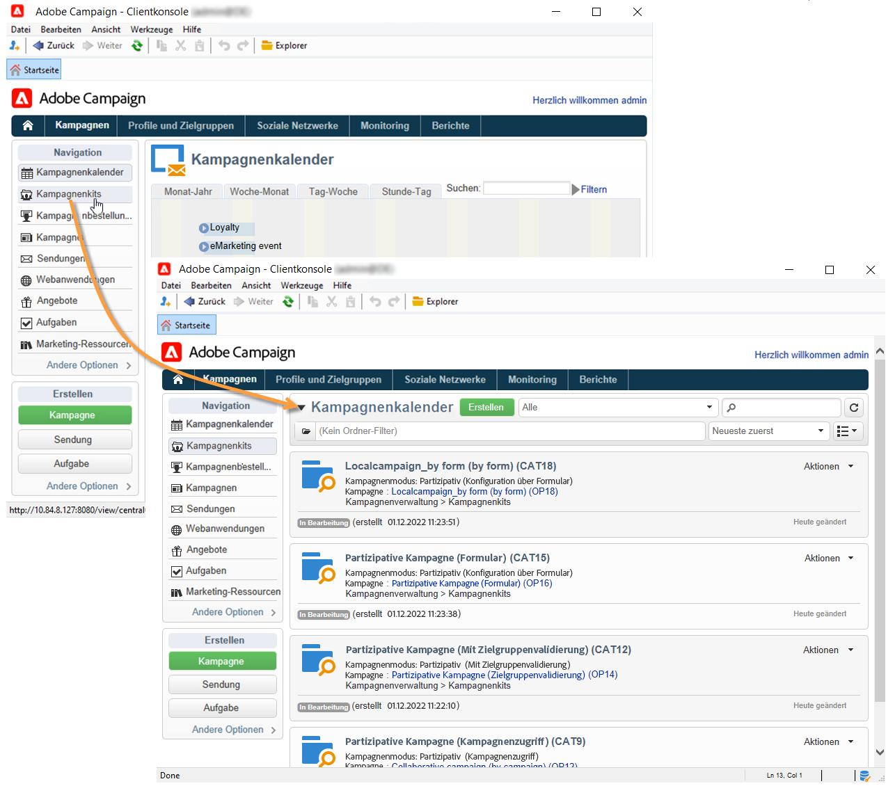
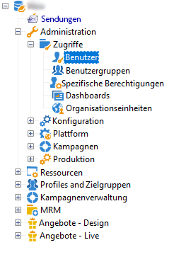
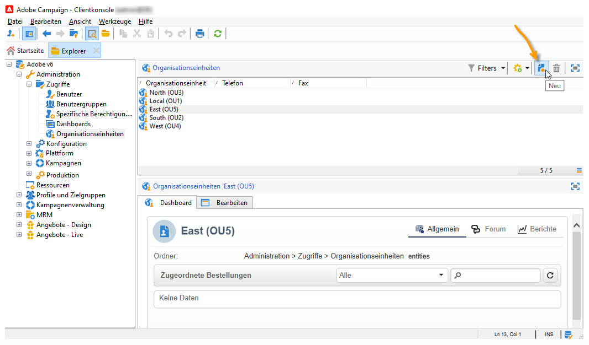
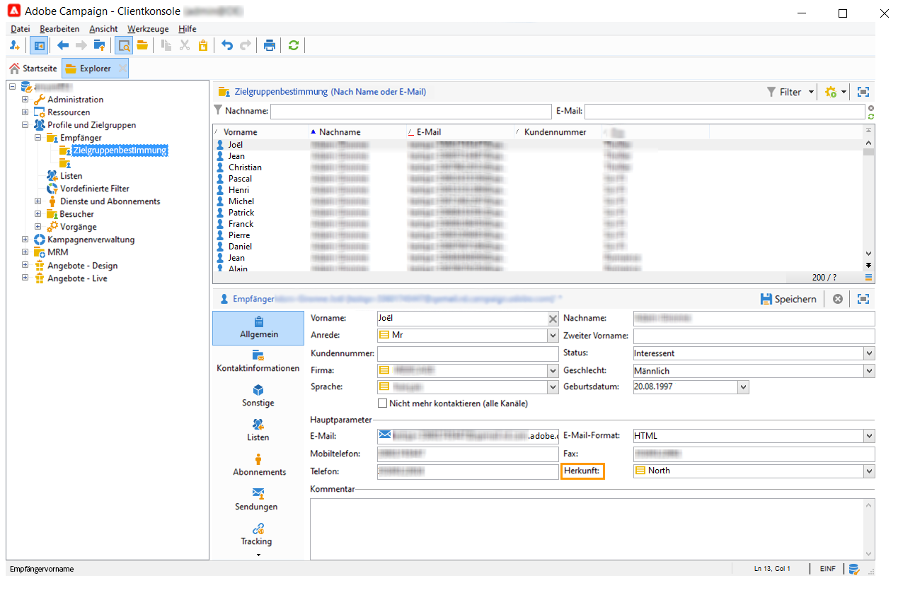

# Erste Schritte mit verteiltem Marketing{#about-distributed-marketing}

Adobe Campaign bietet eine **dezentrales Marketing**-Anwendung zur Implementierung von Kooperationskampagnen zwischen Zentralstellen (Hauptsitz, Marketing-Abteilungen usw.) und lokalen Stellen (Verkaufsstellen, regionale Agenturen usw.). Diese Zusammenarbeit basiert auf einem gemeinsamen Arbeitsbereich, auch Kampagnenkit-**[!UICONTROL genannt,]** dem den lokalen Entitäten die zentral erstellten Kampagnenvorlagen und Instanzen angeboten werden.

Die Zentralstelle stellt Kampagnen bereit, die Lokalstellen nutzen können. Kampagnen werden durch Pakete materialisiert, die entweder lokale oder partizipative Kampagnen darstellen. Um eine Kampagne verwenden zu können, muss sie von der Lokalstelle bestellt und anschließend genehmigt werden.

>[!CAUTION]
>
>Das Modul Dezentrales Marketing ist eine Option **Kampagne**. Prüfen Sie diesbezüglich Ihren Lizenzvertrag.

## Terminologie {#terminology}

* **Zentralstelle**

  Zentralstellen bestehen aus den Benutzern der Plattform, die die Marketing-Kommunikation festlegen und die Lokalstellen bei der Erstellung und Ausführung ihrer Kampagnen begleiten.

  Mithillfe des dezentralen Marketings können Zentralstellen:

   * Lokalstellen Kampagnenkits zur Verfügung stellen;
   * Freiräume definieren, innerhalb derer Lokalstellen die Kommunikation mit Kunden und Interessenten in Bezug auf Zielgruppenbestimmung und Inhalte bestimmen können;
   * Kosten verwalten und begrenzen;
   * die Durchführung von Kampagnen niederlassungsübergreifend koordinieren.

* **Lokalstelle**

  Lokalstellen sind beispielsweise Agenturen, Verkaufsstellen oder bestimmte lokale Benutzergruppen (Verantwortliche eines Landes oder einer Region, Verantwortliche einer Marke).

  Dezentrales Marketing ermöglicht Lokalstellen eine größere Unabhängigkeit sowie eine Optimierung der Ausführungskosten.

* **Lokale Anpassung**

  Lokalisierung bedeutet, dass eine Lokalstelle die Zielgruppe und den Inhalt einer Kampagne ändern kann. Der mögliche Umfang der Lokalisierung hängt von der Art der Kampagne und ihrer Implementierung ab.

* **Kampagnenkit-Liste**

  Die Kampagnenkit-Liste enthält die Kampagnen, die für Lokalstellen zur Verfügung stehen.

* **Kampagnenkit**

  Vorlage oder Kampagneninstanz, die von der Zentralstelle erstellt und den Lokalstellen zur Verfügung gestellt wird.

* **Lokale Kampagnen**

  Eine lokale Kampagne ist eine Instanz, die aus einer Vorlage erstellt wird, auf die in der Liste der **[!UICONTROL Kampagnenkits]** mit einer **Ausführungsplanung verwiesen**. Ziel ist es, den lokalen Kommunikationsbedarf mithilfe einer Kampagnenvorlage zu decken, die von der Zentralstelle eingerichtet und konfiguriert wurde.

  Der Umfang der Anpassungsmöglichkeiten für die Lokalstelle ist abhängig von der gewählten Kampagnenart.

  Siehe [Erstellung einer lokalen Kampagne](creating-a-local-campaign.md).

* **Partizipative Kampagnen**

  Eine partizipative Kampagne ist eine Kampagne **deren Ausführungsplanung von der Zentralstelle festgelegt**, die von der Lokalstelle genutzt werden kann. Der Inhalt bleibt für jede Lokalstelle gleich, die Kosten werden jedoch geteilt. Um sich zu beteiligen, können sich Lokalstellen für die partizipative Kampagne anmelden.

   * **[!UICONTROL Partizipative Kampagne (Formular)]** empfohlen für Kampagnen mit bis zu 300 lokalen Entitäten. Die Lokalstellen können vordefinierte Parameter für das Targeting und die Personalisierung von Inhalten in ein Web-Formular eingeben. Das Formular kann ein Adobe Campaign-Formular oder ein externes Formular (Extranet-Client) sein. Ein funktionaler Administrator kann das Formular basierend auf einer vom Integrator definierten Formularvorlage definieren und konfigurieren. Um die Kampagne zu bestellen, benötigt die Lokalstelle nur Web-Zugriff.
   * **[!UICONTROL Partizipative Kampagne (mit Kampagnen)]** Wird für Kampagnen empfohlen, die sich an Dutzende von Lokalstellen richten. Dieser Kampagnentyp erstellt für jede Lokalstelle untergeordnete Kampagnen. Wenn die Bestellung einer **[!UICONTROL Partizipativen Kampagne mit Kampagnenzugriff]** von der Zentralstelle validiert wurde, wird die Kampagne der Lokalstelle zur Verfügung gestellt und kann von dieser angepasst werden. Die Ausführung von über- und untergeordneten Kampagnen wird automatisch synchronisiert. Die Lokalstelle benötigt Zugriff zu einer Instanz, um die Kampagne zu bestellen und ausführen zu können.
   * **[!UICONTROL Partizipative Kampagne (Zielgruppenvalidierung)]** Wird für Kampagnen empfohlen, die sich an mehrere Tausend Lokalstellen richten. Die Lokalstelle erhält eine Kontaktliste, die von der Zentralstelle vordefiniert wurde. Die Lokalstelle entscheidet anhand des Kampagneninhalts über ein Web-Formular, ob bestimmte Kontakte beibehalten werden. Lokalstellen werden aus der Liste der ausgewählten Kontakte abgeleitet. Um an der Kampagne teilnehmen zu können, benötigt die Lokalstelle lediglich den Web-Zugriff.
   * **[!UICONTROL Partizipative Kampagne ohne Konfiguration]**: Dieser Modus stellt die Kompatibilität mit dezentralen Kampagnen aus vorhergehenden Versionen sicher.

  Weitere Informationen finden Sie unter [Partizipative Kampagne erstellen](creating-a-collaborative-campaign.md).

**Kampagnenkit-Bestellung**

Um an einer Kampagne teilnehmen zu können, bestellt die Lokalstelle den entsprechenden Kampagnenkit und gibt hierbei sämtliche für die lokale Anpassung erforderlichen Informationen an.

## Arbeitsbereich {#workspace}

Die Kampagnenkit-Liste ist über den Tab **Kampagnen** zugänglich: Klicken Sie dort auf **[!UICONTROL Kampagnenkits]**.

Dieses Fenster ermöglicht jedem lokalen Benutzer, die für seine Agentur verfügbaren Kampagnen einzusehen.

Für zentrale Agenturen besteht hier Zugriff auf alle verfügbaren Kampagnenkits.

## Benutzer und Organisationseinheiten {#operators-and-entities}

Bestimmen Sie zunächst die Akteure der Zentral- und Lokalstellen im Ordner **[!UICONTROL Zugriffsverwaltung]**.

### Benutzer {#operators}

Es müssen zentrale und lokale Benutzer erstellt werden.

Die zentralen Benutzer müssen der Gruppe **[!UICONTROL Zentrale Verwaltung]** angehören oder über die Berechtigung **[!UICONTROL ZENTRAL]** verfügen.

Lokale Benutzer müssen zur Benutzergruppe **[!UICONTROL Lokale Verwaltung]** gehören oder über die spezifische Berechtigung **[!UICONTROL LOCAL]** verfügen. Sie müssen auch mit ihrer Lokalstelle verbunden sein.

### Organisationseinheiten {#organizational-entities}

Um eine Organisationseinheit zu erstellen, klicken Sie auf den Ordner **[!UICONTROL Administration > Zugriffsverwaltung > Organisationseinheiten]** und dann auf das Symbol **[!UICONTROL Neu]** oberhalb der Liste der Einheiten.

Jede Organisationseinheit enthält Identifizierungsinformationen (Titel, interner Name, Kontaktinformationen usw.) und Gruppen, die am Prozess der Bestellvalidierung beteiligt sind. Diese werden im Abschnitt **[!UICONTROL Benachrichtigungen und Validierungen]** der Registerkarte **[!UICONTROL Allgemein]** bestimmt.

* Definieren Sie eine Benachrichtigungsgruppe, die bei Aktionen bezüglich der Kampagnenkits informiert wird: Alle Benutzer dieser Gruppe erhalten eine Benachrichtigung, wenn der Kampagnenkit-Liste ein neuer Kit hinzugefügt wird und wenn eine Kampagne verfügbar wird.
* Wählen Sie anschließend die Benutzergruppe aus, die dafür verantwortlich ist, die Kampagnenbestellungen der Lokalstelle zu validieren.
* Wählen Sie abschließend die Gruppe der Validierungsverantwortlichen aus, die für die Validierung der lokalen Kampagne (Zielgruppe, Inhalt, Budget usw.) zuständig sind. Diese Gruppe kann bei der Bestellung einer Kampagne je nach Vorlage hinzugefügt werden.

>[!NOTE]
>
>Der Validierungsprozess wird im Abschnitt [Validierungsprozess](creating-a-local-campaign.md#approval-process) beschrieben.

## Umsetzung {#implementation}

Verteilte Marketing-Kampagnen werden von der Zentralstelle erstellt und veröffentlicht. Sie können bei Bedarf sowohl von lokalen als auch von zentralen Stellen verwendet werden.

Die Implementierungsetappen hängen vom gewählten Kampagnenkittyp und dem Umfang der lokalen Verantwortung ab.

### Aufgaben des Systemintegrators {#integrator-side}

1. Erstellen Sie die Lokalstellen.
1. Ordnen Sie die Empfänger den für die jeweiligen Lokalstellen verantwortlichen Benutzern zu.

   

1. Legen Sie Berechtigungen und Navigationsregeln für die Lokalstellen fest.
1. Geben Sie die Felder an, die zur lokalen Anpassung der Kampagnen notwendig sind:

   * Bestimmung der Zielgruppe sowie ihrer Maximalgröße;
   * Definition des Inhalts;
   * Ausführungsplanung (Kontakt- und Extraktionsdatum), **nur für lokale Kampagnen**;
   * Erweiterung des Schema der Bestellungen mit allen notwendigen zusätzlichen Felder.

1. Erstellen Sie eine Web-Formular-Vorlage (über Adobe Campaign oder das Kunden-Extranet), die es ermöglicht, die Parameter der lokalen Anpassung anzuzeigen, Zielgruppe und Budget auszuwerten, den Inhalt in einer Vorschau zu überprüfen und die Bestellung zu validieren.

   Erstellen Sie für **partizipative Kampagnen mit Zielgruppenvalidierung** die Tabelle, in der die Validierungen für jede Lokalstelle gespeichert werden.

### Aufgaben des funktionellen Administrators {#functional-administrator-side}

Die folgenden Etappen müssen bei jeder Kampagnenerstellung durchlaufen werden.

1. Aktualisieren Sie das Formular mit den für die Kampagnenlokalisierung verwendeten Feldern.
1. Erstellen Sie eine Instanz basierend auf der geeigneten Vorlage (partizipative Kampagne) oder duplizieren Sie die Kampagnenvorlage (lokale Kampagne).
1. Konfigurieren Sie die Kampagne mit den Feldern der lokalen Anpassung und dem Formularverweis.
1. Veröffentlichen Sie die Kampagne.

### Aufgaben lokaler Benutzer {#local-operator-side}

Die folgenden Etappen müssen bei jeder Kampagne durchlaufen werden.

1. Legen Sie bei Erhalt der Benachrichtigung zur Verfügbarkeit eines Kampagnenkits gegebenenfalls die Parameter der lokalen Anpassung der Kampagne fest.
1. Werten Sie Zielgruppe, Budget etc. aus
1. Überprüfen Sie die Vorschau des Kampagneninhalts.
1. Bestellen Sie die Kampagne.
