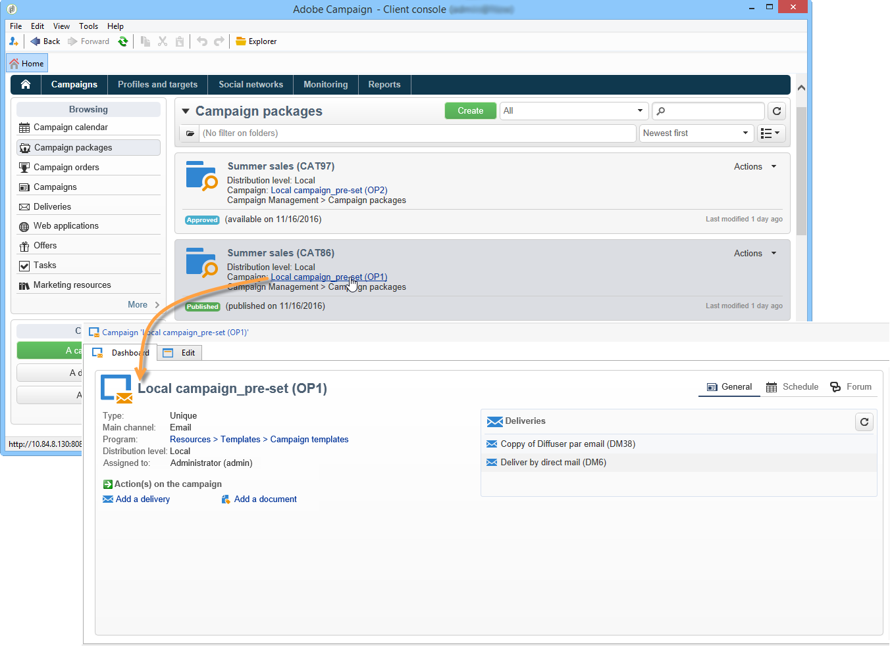

# Zugriff auf Kampagnen{#accessing-campaigns}

Sobald eine Kampagne bestellt, die Bestellung validiert und das Verfügbarkeitsdatum erreicht wurde, kann sie ausgeführt werden.

Je nach Kampagnentyp und ausgewählten Optionen geschieht dies auf zentraler oder lokaler Ebene.

## Zugriff auf eine Kampagne {#accessing-the-campaign}

Sobald die Bestellung genehmigt ist und das Verfügbarkeitsdatum erreicht ist, wird die Kampagne lokal erstellt und kann verwendet werden. Lokale Betreiber werden über die Verfügbarkeit informiert.

Er wird den Details der entsprechenden Reihenfolge hinzugefügt und kann bearbeitet werden. Das vollständige Dashboard ermöglicht die lokale Verwaltung.

Auch über die Kampagnenübersicht in der Rubrik **[!UICONTROL Kampagnen]** besteht Zugriff auf die jeweilige Kampagne.

## Verfügbare Parameter {#available-settings}

Lokalstellen können den Kampagneninhalt unter Verwendung aller Elemente des Kampagnen-Dashboards an ihre Bedürfnisse anpassen. Ihre Hauptaufgabe besteht darin, den Zielgruppenbestimmungs-Workflow anzupassen und möglicherweise die Versandinhalte zu personalisieren.

## Kampagnenausführung {#campaign-execution}

Jede Lokalstelle kann den Kampagnen-Workflow ausführen und entsprechend der Validierungskonfiguration in der Kampagnen-Vorlage die jeweiligen Validierungen vornehmen.
