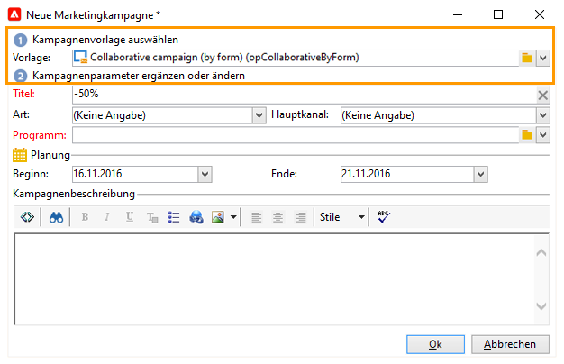
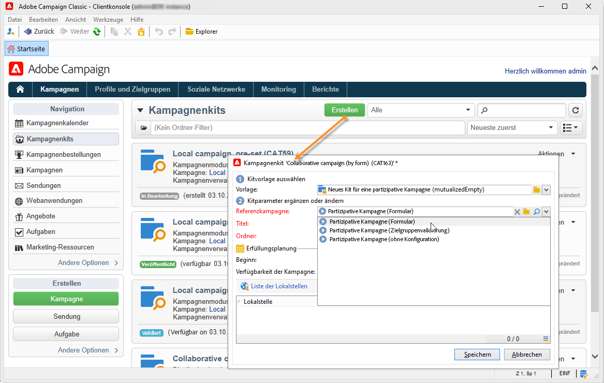
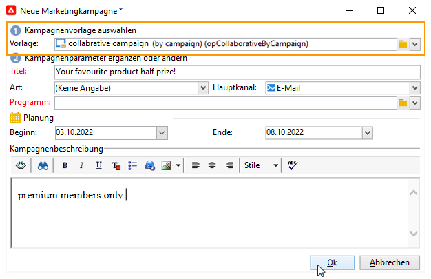
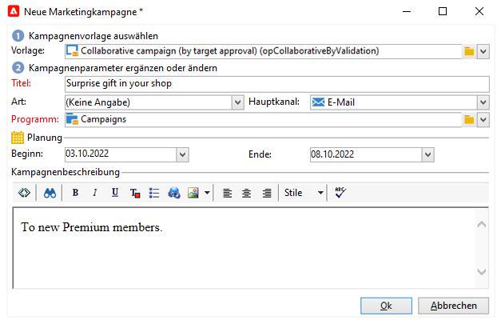
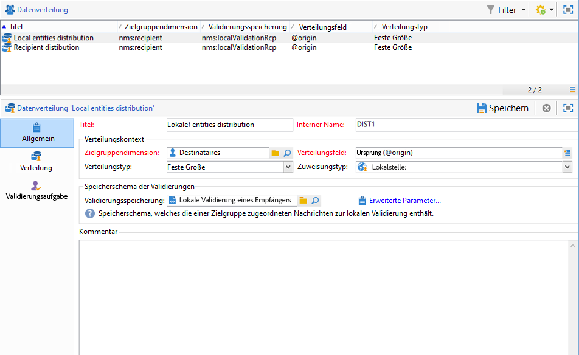
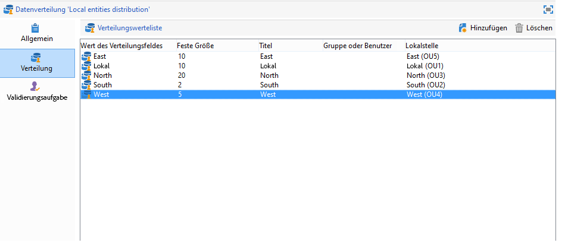
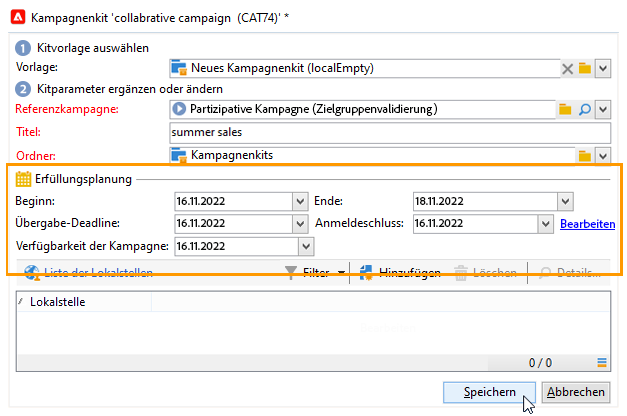
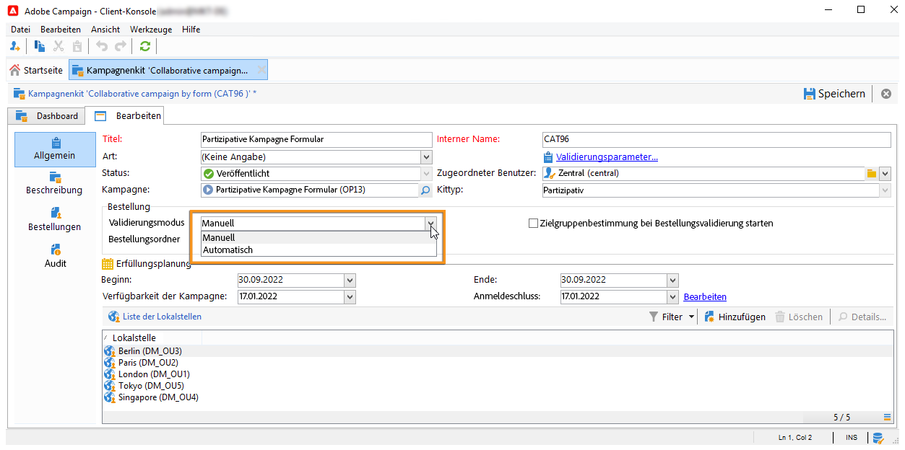

# Erstellen einer partizipativen Kampagne{#creating-a-collaborative-campaign-intro}

Partizipative Kampagnen werden von der Zentralstelle auf Basis der Kampagnenvorlagen des **verteilten Marketings** erstellt. Lesen Sie hierzu [diese Seite](about-distributed-marketing.md#collaborative-campaign).

## Erstellen einer partizipativen Kampagne {#creating-a-collaborative-campaign}

Partizipative Kampagnen beruhen jeweils auf einer Referenzkampagne, die von der Zentralstelle zu erstellen ist. Dies geschieht ausgehend vom Knoten **[!UICONTROL Kampagnenverwaltung > Kampagnen]** durch Klick auf das **[!UICONTROL Neu]**-Symbol.

>[!NOTE]
>
>Mit Ausnahme der **[!UICONTROL partizipativen Kampagnen mit Kampagnenzugriff]** können die Kampagnen über eine Webschnittstelle konfiguriert und ausgeführt werden.

Die Basiskonfiguration einer partizipativen Kampagne gleicht der der Vorlage einer lokalen Kampagne. Die Besonderheiten der unterschiedlichen partizipativen Kampagnentypen werden nachstehend beschrieben.

### Partizipative Kampagne (Formular) {#by-form}

Wählen Sie die Vorlage **[!UICONTROL Partizipative Kampagne (Formular) (opCollaborativeByForm)]** aus, um diese Kampagne zu erstellen.

Klicken Sie auf der Registerkarte **[!UICONTROL Bearbeiten]** auf den Link **[!UICONTROL Erweiterte Kampagnenparameter...]**, um die Registerkarte **Verteiltes Marketing** aufzurufen.

Wählen Sie den Web-Schnittstellentyp **Standardformular** aus. Dieser Schnittstellentyp ermöglicht die Erstellung von Personalisierungsfeldern, die von den Lokalstellen bei der Kampagnenbestellung genutzt werden können. Siehe [Lokale Kampagne erstellen (Standardformular)](examples.md#creating-a-local-campaign--by-form-).

Speichern Sie Ihre Kampagne. Sie steht Ihnen nun in der Ansicht **Kampagnenkits** im Tab **Kampagnen** zur Verfügung, indem Sie auf die Schaltfläche **[!UICONTROL Erstellen]** klicken.

Die **[!UICONTROL Kampagnenkit]**-Liste ermöglicht Ihnen die Verwendung von lokalen Kampagnenvorlagen (native oder duplizierte) sowie Referenzkampagnen für partizipative Kampagnen. So können Sie Kampagnen für unterschiedliche Unternehmenseinheiten erstellen.

### Partizipative Kampagne (Kampagnenzugriff) {#by-campaign}

Wählen Sie die Vorlage **[!UICONTROL Partizipative Kampagne (Kampagnenzugriff) (opCollaborativeByCampaign)]** aus.

Die Lokalstelle kann bei der Kampagnenbestellung die von der Zentralstelle festgelegten Kriterien erfassen und die Kampagne vor der Bestellung evaluieren.

Wenn die Bestellung einer **Partizipativen Kampagne mit Kampagnenzugriff** von der Zentraleinheit validiert wurde, wird eine untergeordnete Kampagne für die Lokalstelle erstellt. Sobald diese der Lokalstelle zur Verfügung steht, kann die Lokalstelle folgende Parameter verändern:

* Kampagnenworkflow,
* Typologieregeln,
* Personalisierungsfelder.

Die untergeordnete Kampagne wird von der Lokalstelle, die übergeordnete Kampagne von der Zentralstelle ausgeführt.

Über den Link **Liste der verknüpften Kampagnen...** im Kampagnen-Dashboard kann die Zentralstelle alle untergeordneten Kampagnen der **[!UICONTROL partizipativen Kampagne mit Kampagnenzugriff]** einsehen.

### Partizipative Kampagne (Zielgruppenvalidierung) {#by-target-approval}

Wählen Sie die Vorlage **[!UICONTROL Partizipative Kampagne (Zielgruppenvalidierung) (opCollaborativeByValidation)]** aus.

>[!NOTE]
>
>In diesem Modus muss die Zentralstelle keine Lokalstellen angeben.

Der Kampagnenworkflow muss die Aktivität **Lokale Validierung** beinhalten. Diese hat folgende Parameter:

* **[!UICONTROL Auszuführende Aktion]**: Benachrichtigung zur Zielgruppenvalidierung;
* **[!UICONTROL Verteilungskontext]**: Explizit;
* **[!UICONTROL Datenverteilung]**: Lokalstellen-Datenverteilung.

Erstellen Sie eine Datenverteilung vom Typ **Lokalstellen-Datenverteilung**. Mit der Datenverteilungsvorlage können Sie die Anzahl der Datensätze aus einer Liste von Gruppierungswerten begrenzen. Klicken Sie unter **[!UICONTROL Ressourcen > Kampagnen-Management > Datenverteilung]** auf das Symbol **[!UICONTROL Neu]**, um eine neue **[!UICONTROL Datenverteilung]** zu erstellen. Für weitere Informationen zur Datenverteilung

Geben Sie die **[!UICONTROL Zielgruppendimension]** sowie das **[!UICONTROL Verteilungsfeld]** an. Wählen Sie als **Zuweisungstyp** **Lokalstelle** aus.

Fügen Sie im Tab **[!UICONTROL Verteilung]** ein Feld für jede Lokalstelle hinzu und geben Sie den jeweiligen Wert an.

Es besteht die Möglichkeit, der **Versand**-Aktivität eine zweite **Zielgruppenvalidierung**-Aktivität anzuschließen, um einen Bericht über letztere zu konfigurieren.

In der Bestätigungs-E-Mail der Kampagnenerstellung erhält die Lokalstelle eine Liste mit Kontakten, die von den von der Zentralstelle bestimmten Parametern abhängt.

Der Lokalstelle steht es frei, je nach Kampagneninhalt bestimmte Kontakte zu entfernen.

### Partizipative Kampagne (ohne Konfiguration) {#simple}

Um eine einfache partizipative Kampagne zu erstellen, wählen Sie die Vorlage **[!UICONTROL Partizipative Kampagne (ohne Konfiguration)]** aus.

## Partizipative Kampagnenkits erstellen {#creating-a-collaborative-campaign-package}

Um die Kampagne den Lokalstellen zur Verfügung zu stellen, muss die Zentralstelle ein Kampagnenkit erstellen.

Gehen Sie wie folgt vor:

1. Klicken Sie im Menü **[!UICONTROL Navigation]** der Rubrik **Kampagnen** auf den Link **[!UICONTROL Kampagnenkits]**.
1. Wählen Sie die **[!UICONTROL Erstellen]**-Schaltfläche aus.
1. Wählen Sie im oberen Bereich des Assistenten die Kampagnenvorlage **[!UICONTROL Neues Kit für eine partizipative Kampagne (mutualizedEmpty)]** aus.
1. Geben Sie die Referenzkampagne an.
1. Bestimmen Sie Titel und Speicherort des Kampagnenkits und legen Sie die Ausführungsplanung fest.

### Datum-Funktionen        {#dates}

Beginn- und Enddatum bestimmen die Dauer der Sichtbarkeit der Kampagne in der Kampagnenkit-Liste.

Für **partizipative Kampagnen** muss die Zentralstelle einen Anmeldeschluss und gegebenenfalls eine Übergabe-Deadline angeben.

>[!NOTE]
>
>Lokalstellen kann die Möglichkeit eingeräumt werden, der Zentralstelle für die endgültige Konfiguration der Kampagne nützliche Dokumente (Tabellen, Grafiken o. Ä.) zu übermitteln. In diesem Fall legt die Zentralstelle eine **[!UICONTROL Übergabe-Deadline]** fest. Sollten die Dokumente bis zu diesem Zeitpunkt nicht übermittelt worden sein, wird die Kampagne trotz allem wie geplant ausgeführt.

### Audience {#audience}

Die Zentralstelle muss für die Teilnahme an der Kampagne vorgesehenen Lokalstellen bei der Erstellung der partizipativen Kampagne angeben, außer bei Kampagnen mit Zielgruppenvalidierung.

>[!CAUTION]
>
>**[!UICONTROL Partizipative Kampagnenkits ohne Konfiguration, mit Formular oder mit Kampagnenzugriff]** können nicht validiert werden, sofern die vorgesehenen Lokalstellen nicht angegeben wurden.

### Validierungsmodi {#approval-modes}

In **partizipativen Kampagnen** kann der Validierungsmodus für Bestellungen ausgewählt werden:

Im manuellen Modus muss sich die Lokalstelle für die Kampagne anmelden, um teilnehmen zu können.

Im automatischen Modus wird die Lokalstelle automatisch für die Kampagne angemeldet. Sie kann sich abmelden oder die Konfiguration der Kampagne verändern, ohne dass eine Validierung der Zentralstelle notwendig ist.

### Benachrichtigungen {#notifications}

Die Konfiguration der Benachrichtigungen entspricht der für lokale Kampagnen. Siehe hierzu [diesen Abschnitt](creating-a-local-campaign.md#notifications).

## Bestellen einer Kampagne {#ordering-a-campaign}

Wenn der Kampagnenkit-Liste eine partizipative Kampagne hinzugefügt wird, werden die Lokalstellen, die dem von der Zentralstelle bestimmten Publikum angehören, hiervon per E-Mail informiert (**partizipative Kampagnen mit Zielgruppenvalidierung** haben kein vordefiniertes Publikum). Die Benachrichtigungs-E-Mail enthält einen Link zur Bestellung der Kampagne, wie im folgenden Beispiel:

In der Nachricht können die Lokalstellen die vom zentralen Benutzer verfasste Beschreibung des Kits sowie gegebenenfalls die der Kampagne zugeordneten Dokumente ansehen. Diese Dokumente stellen zusätzliche Informationen zur Kampagne bereit, sind jedoch kein Teil der Kampagne.

Durch Zugriff auf die Webschnittstelle kann die Lokalstelle Informationen über gewünschte Anpassungen der partizipativen Kampagne geben, die sie bestellen möchte:

Nach Speicherung der Bestellung erhält der validierungsverantwortliche Benutzer der Lokalstelle eine Benachrichtigungs-E-Mail zur Validierung der Bestellung.

Weitere Informationen hierzu finden Sie im Abschnitt [Validierungsprozess](creating-a-local-campaign.md#approval-process).

## Validieren einer Bestellung {#approving-an-order}

Die Validierung der Bestellung eines partizipativen Kampagnen-Kits entspricht der von lokalen Kampagnen. Siehe hierzu [diesen Abschnitt](creating-a-local-campaign.md#approving-an-order).
