# Erstellen einer partizipativen Kampagne{#creating-a-collaborative-campaign-intro}

Partizipative Kampagnen werden von der Zentralstelle auf Basis der Kampagnenvorlagen **Verteiltes Marketing** erstellt. Mehr dazu erfahren Sie auf [dieser Seite](about-distributed-marketing.md#collaborative-campaign).

## Erstellen einer partizipativen Kampagne {#creating-a-collaborative-campaign}

Um eine partizipative Kampagne zu erstellen, klicken Sie auf den Ordner **[!UICONTROL Kampagnenverwaltung > Kampagnen]** und dann auf das Symbol **[!UICONTROL Neu]**.

>[!NOTE]
>
>Mit Ausnahme der **[!UICONTROL partizipativen Kampagnen mit Kampagnenzugriff]** können die Kampagnen über eine Webschnittstelle konfiguriert und ausgeführt werden.

Der Konfigurationsprozess für eine partizipative Kampagnendatenbank entspricht dem einer lokalen Kampagnenvorlage. Die Spezifikationen der verschiedenen Arten von partizipativen Kampagnen werden nachfolgend beschrieben.

### Partizipative Kampagne (Formular) {#by-form}

Wählen Sie die Vorlage **[!UICONTROL Partizipative Kampagne (Formular) (opCollaborativeByForm)]** aus, um diese Kampagne zu erstellen.

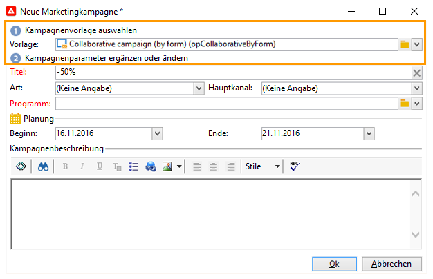

Klicken Sie auf der Registerkarte **[!UICONTROL Bearbeiten]** auf den Link **[!UICONTROL Erweiterte Kampagnenparameter...]**, um die Registerkarte **Verteiltes Marketing** aufzurufen.

Wählen Sie die Web **Benutzeroberfläche &quot;** Formular“. Auf diese Weise können Sie Personalisierungsfelder erstellen, die von Lokalstellen bei der Kampagnenbestellung verwendet werden. Siehe [Lokale Kampagne erstellen (Standardformular)](examples.md#creating-a-local-campaign--by-form-).

Speichern Sie Ihre Kampagne. Sie steht Ihnen nun in der Ansicht **Kampagnenkits** im Tab **Kampagnen** zur Verfügung, indem Sie auf die Schaltfläche **[!UICONTROL Erstellen]** klicken.

Die **[!UICONTROL Kampagnenkit]**-Liste ermöglicht Ihnen die Verwendung von lokalen Kampagnenvorlagen (native oder duplizierte) sowie Referenzkampagnen für partizipative Kampagnen. So können Sie Kampagnen für unterschiedliche Unternehmenseinheiten erstellen.

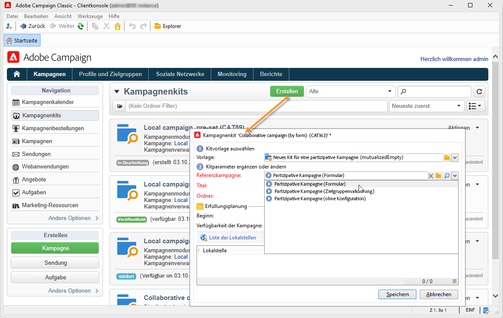

### Partizipative Kampagne (Kampagnenzugriff) {#by-campaign}

Wählen Sie die Vorlage **[!UICONTROL Partizipative Kampagne (Kampagnenzugriff) (opCollaborativeByCampaign)]** aus.

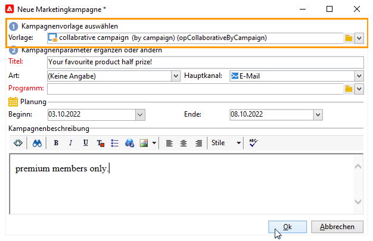

Die Lokalstelle kann bei der Kampagnenbestellung die von der Zentralstelle festgelegten Kriterien erfassen und die Kampagne vor der Bestellung auswerten.

Sobald eine Bestellung für eine **Partizipative Kampagne (nach Kampagne)** von der Zentralstelle genehmigt wurde, wird eine untergeordnete Kampagne für die Lokalstelle erstellt. Sobald sie ihnen zur Verfügung stehen, kann die Lokalstelle Folgendes ändern:

* Kampagnenworkflow,
* Typologieregeln,
* Personalisierungsfelder.

Die untergeordnete Kampagne wird von der Lokalstelle ausgeführt. Die übergeordnete Kampagne wird von der Zentralstelle ausgeführt.

Über den Link **Liste der verknüpften Kampagnen...** im Kampagnen-Dashboard kann die Zentralstelle alle untergeordneten Kampagnen der **[!UICONTROL partizipativen Kampagne mit Kampagnenzugriff]** einsehen.

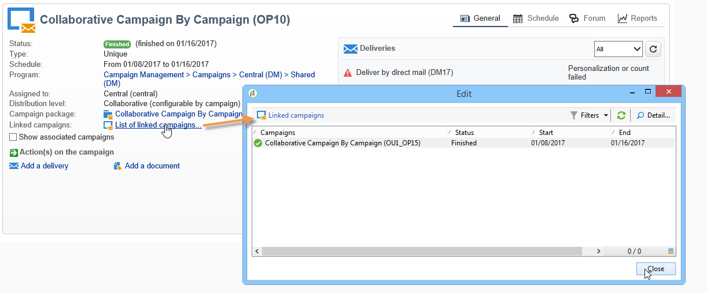

### Partizipative Kampagne (Zielgruppenvalidierung) {#by-target-approval}

Wählen Sie die Vorlage **[!UICONTROL Partizipative Kampagne (Zielgruppenvalidierung) (opCollaborativeByValidation)]** aus.

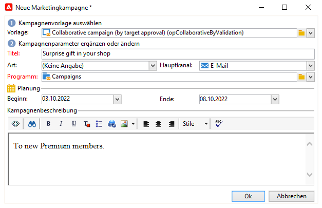

>[!NOTE]
>
>In diesem Modus muss die Zentralstelle keine Lokalstellen angeben.

Der Kampagnen-Workflow muss die Aktivität **Lokale Validierung** enthalten. Die Aktivitätsparameter lauten wie folgt:

* **[!UICONTROL Auszuführende Aktion]**: Benachrichtigung zur Zielgruppenvalidierung.
* **[!UICONTROL Verteilungskontext]**: Explizit.
* **[!UICONTROL Datenverteilung]**: Lokalstellen-Datenverteilung.

**Datenverteilung vom** „Lokalstellen-Verteilung“ muss erstellt werden. Mit der Datenverteilungsvorlage können Sie die Anzahl der Datensätze aus einer Liste von Gruppierungswerten begrenzen. Klicken Sie unter **[!UICONTROL Ressourcen > Kampagnen-Management > Datenverteilung]** auf das Symbol **[!UICONTROL Neu]**, um eine neue **[!UICONTROL Datenverteilung]** zu erstellen. Für weitere Informationen zur Datenverteilung,

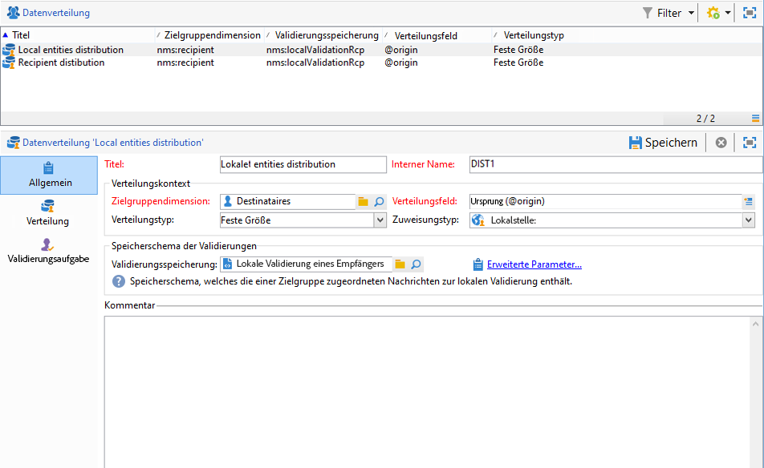

Geben Sie die **Zielgruppendimension** sowie das **[!UICONTROL Verteilungsfeld]** an. Wählen Sie als **[!UICONTROL Zuweisungstyp]** die Option **Lokalstelle** aus.

Fügen Sie im Tab **[!UICONTROL Verteilung]** ein Feld für jede Lokalstelle hinzu und geben Sie den jeweiligen Wert an.

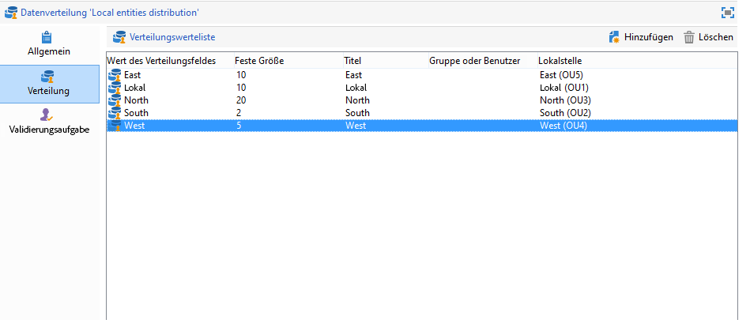

Es besteht die Möglichkeit, der **Versand**-Aktivität eine zweite **Zielgruppenvalidierung**-Aktivität anzuschließen, um einen Bericht über letztere zu konfigurieren.

In der Bestätigungs-E-Mail der Kampagnenerstellung erhält die Lokalstelle eine Liste mit Kontakten, die von den von der Zentralstelle bestimmten Parametern abhängt.

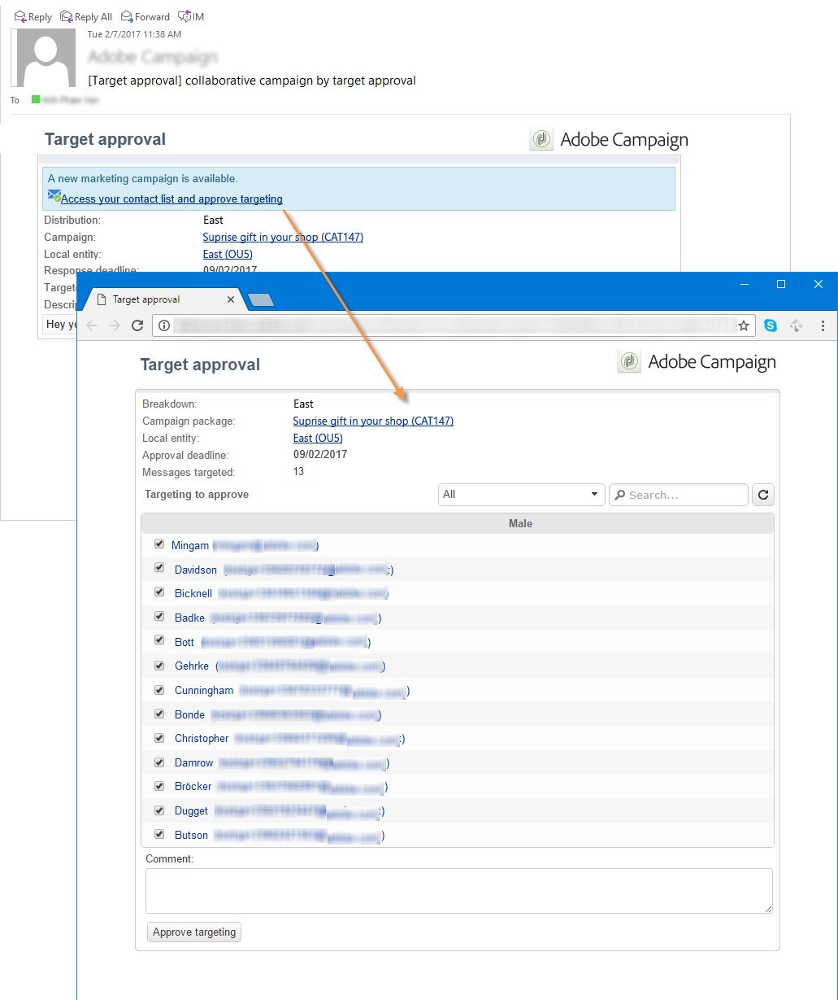

Der Lokalstelle steht es frei, je nach Kampagneninhalt bestimmte Kontakte zu entfernen.

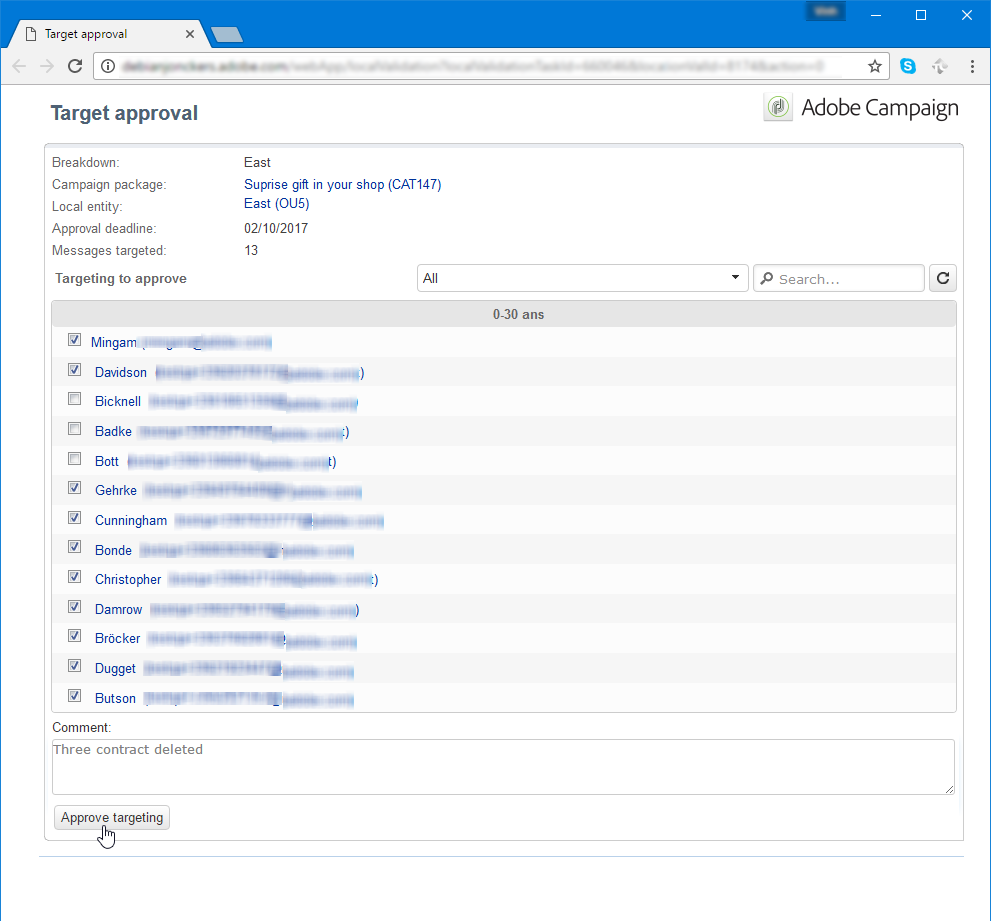

### Partizipative Kampagne (ohne Konfiguration) {#simple}

Um eine einfache partizipative Kampagne zu erstellen, wählen Sie die Vorlage **[!UICONTROL Partizipative Kampagne (ohne Konfiguration)]** aus.

## Partizipative Kampagnenkits erstellen {#creating-a-collaborative-campaign-package}

Um die Kampagne den Lokalstellen zur Verfügung zu stellen, muss die Zentralstelle ein Kampagnenkit erstellen.

Gehen Sie wie folgt vor:

1. Klicken Sie im Menü **[!UICONTROL Navigation]** der Rubrik **Kampagnen** auf den Link **[!UICONTROL Kampagnenkits]**.
1. Wählen Sie die **[!UICONTROL Erstellen]**-Schaltfläche aus.
1. Wählen Sie im oberen Bereich des Assistenten die Kampagnenvorlage **[!UICONTROL Neues Kit für eine partizipative Kampagne (mutualizedEmpty)]** aus.
1. Geben Sie die Referenzkampagne an.
1. Bestimmen Sie Titel und Speicherort des Kampagnenkits und legen Sie die Ausführungsplanung fest.

### Datum-Funktionen {#dates}

Beginn- und Enddatum bestimmen die Dauer der Sichtbarkeit der Kampagne in der Kampagnenkit-Liste.

Für **partizipative Kampagnen** muss die Zentralstelle einen Anmeldeschluss und gegebenenfalls eine Übergabe-Deadline angeben.

>[!NOTE]
>
>Mit der Frist **[!UICONTROL Personalization]** kann die Zentralstelle eine Frist festlegen, bis zu der die Lokalstellen die für die Kampagnenkonfiguration zu verwendenden Dokumente (Kalkulationstabellen, Bilder) bereitgestellt haben müssen. Dies ist keine obligatorische Option. Wird dieses Datum ausgelagert, hat dies keine Auswirkungen auf die Kampagnenimplementierung.

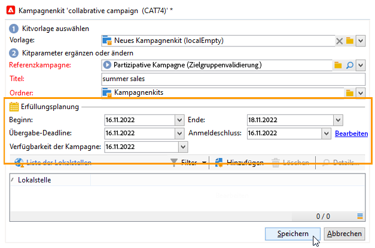

### Zielgruppe {#audience}

Die Zentralstelle muss für die Teilnahme an der Kampagne vorgesehenen Lokalstellen bei der Erstellung der partizipativen Kampagne angeben, außer bei Kampagnen mit Zielgruppenvalidierung.

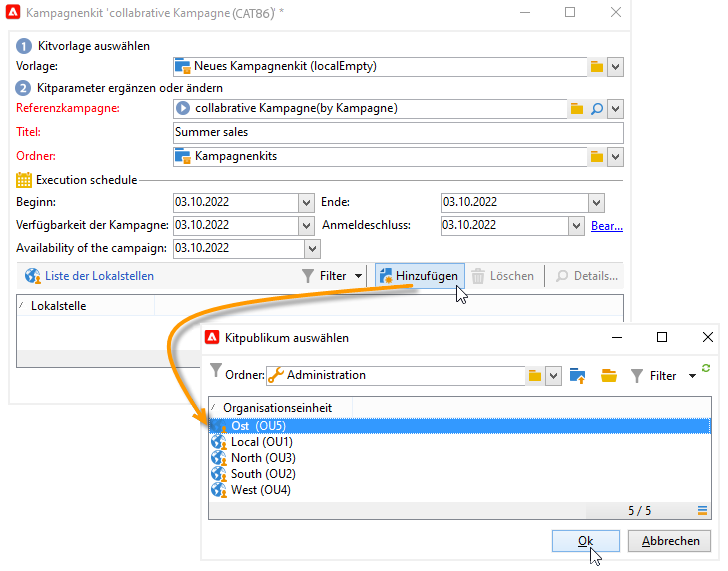

>[!CAUTION]
>
>**[!UICONTROL Partizipative Kampagnenkits ohne Konfiguration, mit Formular oder mit Kampagnenzugriff]** können nicht validiert werden, sofern die vorgesehenen Lokalstellen nicht angegeben wurden.

### Validierungsmodi {#approval-modes}

In **partizipativen Kampagnen** kann der Validierungsmodus für Bestellungen ausgewählt werden:

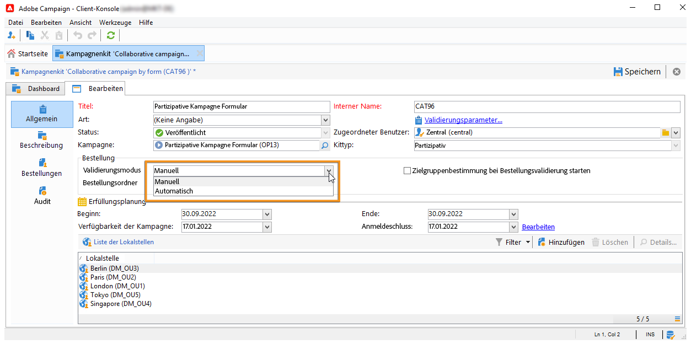

Im manuellen Modus muss sich die Lokalstelle für die Kampagne anmelden, um teilnehmen zu können.

Im automatischen Modus hat die Lokalstelle die Kampagne im Voraus abonniert. Es kann das Kampagnenabonnement kündigen oder seine Parameter ändern, ohne die Genehmigung der Zentralstelle zu benötigen.

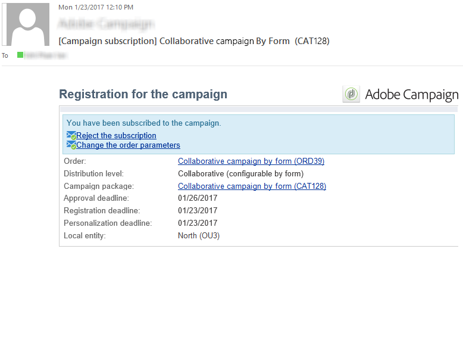

### Benachrichtigungen {#notifications}

Die Konfiguration der Benachrichtigungen entspricht der für lokale Kampagnen. Weitere Informationen finden Sie in [diesem Abschnitt](creating-a-local-campaign.md#notifications).

## Bestellen einer Kampagne {#ordering-a-campaign}

Wenn eine partizipative Kampagne zur Kampagnenkit-Liste hinzugefügt wird, werden die Lokalstellen der von der Zentralstelle definierten Audience benachrichtigt (die **partizipativen Kampagnen (mit Zielgruppenvalidierung)** verfügen über keine vordefinierte Audience). Die gesendete Nachricht enthält einen Link, über den Sie sich für die Kampagne registrieren können, wie unten dargestellt:

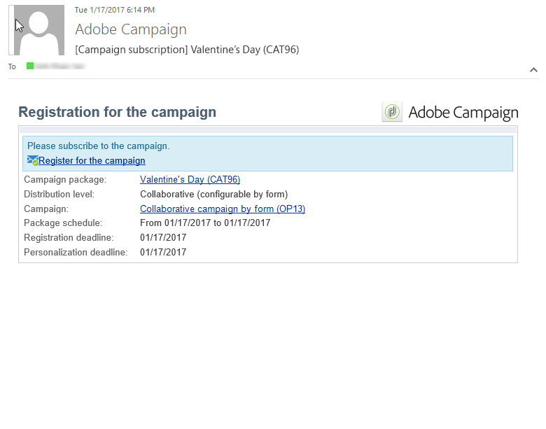

Diese Nachricht ermöglicht auch Lokalstellen die Anzeige der vom Zentralbenutzer, der das Package erstellt hat, eingegebenen Beschreibung sowie der mit der Kampagne verknüpften Dokumente. Diese gehören nicht zur Kampagne selbst, stellen jedoch zusätzliche Informationen dazu bereit.

Durch Zugriff auf die Webschnittstelle kann die Lokalstelle Informationen über gewünschte Anpassungen der partizipativen Kampagne geben, die sie bestellen möchte:

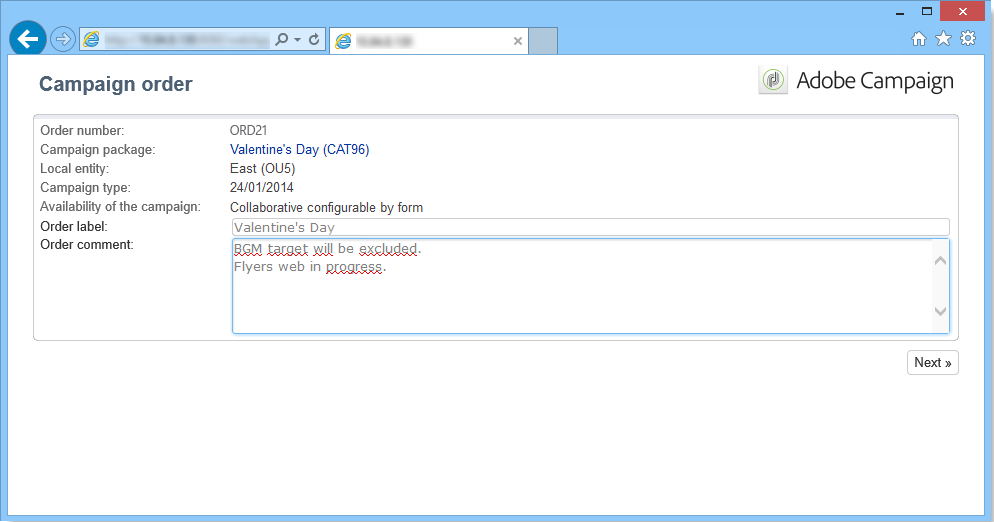

Nach Speicherung der Bestellung erhält der validierungsverantwortliche Benutzer der Lokalstelle eine Benachrichtigungs-E-Mail zur Validierung der Bestellung.

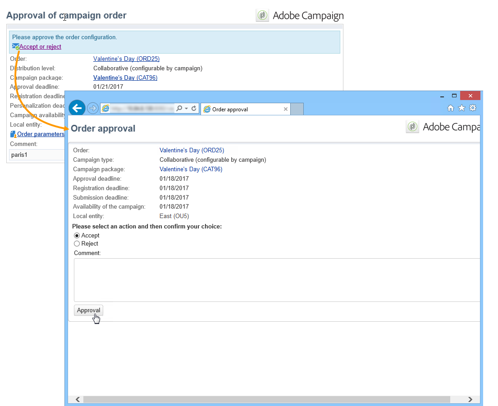

Weitere Informationen hierzu finden Sie im Abschnitt [Validierungsprozess](creating-a-local-campaign.md#approval-process).

## Validieren einer Bestellung {#approving-an-order}

Die Validierung der Bestellung eines partizipativen Kampagnen-Kits entspricht der von lokalen Kampagnen. Weitere Informationen finden Sie in [diesem Abschnitt](creating-a-local-campaign.md#approving-an-order).
