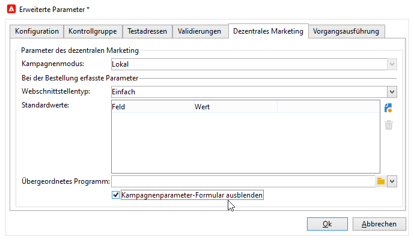

# Erstellen einer lokalen Kampagne{#creating-a-local-campaign}

Lokale Kampagnen sind Kampagneninstanzen, die bei jeder Bestellung basierend auf einem **[!UICONTROL Kampagnenkit]** erstellt werden. Sie verfügen jeweils über eine **spezifische Ausführungsplanung**. Ziel ist es, lokalen Kommunikationsbedürfnissen entsprechen zu können, hierbei jedoch zentral festgelegten Standards zu folgen. Letzteres wird durch die von der Zentralstelle konfigurierten Kampagnenvorlagen sichergestellt.

**Zentralstellenseitig**

1. Erstellen Sie eine Vorlage für eine lokale Kampagne.
1. Erstellen Sie anhand dieser ein Kampagnenkit.
1. Veröffentlichen Sie das Kampagnenkit.
1. Validieren Sie die Bestellungen.

**Lokalstellenseitig**

1. Bestellen Sie die Kampagne.
1. Führen Sie die Kampagne aus.

## Erstellen Sie eine Vorlage für eine lokale Kampagne {#creating-a-local-campaign-template}

Um ein Kamapgnenkit zu erstellen, muss zunächst eine **Kamapgnenvorlage** im Navigationsknoten **[!UICONTROL Ressourcen > Vorlagen]** erstellt werden.

Um eine neue Vorlage für eine lokale Kampagne zu erstellen, duplizieren Sie die Standard-Vorlage **[!UICONTROL Lokale Kampagne (opLocal)]**.

Benennen Sie die Kampagnenvorlage und erfassen Sie die verfügbaren Felder.

Klicken Sie im Kampagnenfenster auf die Registerkarte **[!UICONTROL Bearbeiten]** und dann auf den Link **[!UICONTROL Erweiterte Kampagnenparameter...]**.

### Web-Schnittstelle {#web-interface}

Im Tab **Dezentrales Marketing** können Sie den Typ der Web-Schnittstelle sowie die Standardwerte und die erweiterten Parameter festlegen, die bei der Bestellung durch eine Lokalstellen einzugeben sind.

Die Web-Schnittstelle stellt ein Formular dar, dass von der Lokalstelle bei der Kampagnenbestellung auszufüllen ist.

Wählen Sie den Web-Schnittstellentyp aus, der für die auf dieser Vorlage basierenden Kampagnen angewandt werden soll:

Es stehen vier unterschiedliche Web-Schnittstellentypen zur Verfügung:

* **[!UICONTROL Briefing]**: Die Lokalstelle beschreibt die gewünschten Kampagnenparameter bei der Bestellung. Sobald die Bestellung validiert wurde, konfiguriert die Zentralstelle die Kampagne und führt sie aus.

   

* **[!UICONTROL Standardformular]**: Die Lokalstelle hat Zugriff auf ein Web-Formular, in dem sie beispielsweise Inhalt, Zielgruppe, maximale Zielgruppengröße sowie Erstellungs- und Extraktionsdaten mithilfe von Personalisierungsfeldern bearbeiten kann. Zudem hat die Lokalstelle über dieses Web-Formular die Möglichkeit, die Zielgruppe zu evaluieren und den Inhalt in einer Vorschau zu überprüfen.

   

   Das angebotene Formular wird in einer Web-Anwendung definiert, die in der Vorlage unter dem Link **[!UICONTROL Erweiterte Kampagnenparameter...]** in der Dropdown-Liste des Felds **[!UICONTROL Web-Schnittstelle]** ausgewählt werden muss. Siehe [Lokale Kampagne erstellen (Standardformular)](examples.md#creating-a-local-campaign--by-form-).

   >[!NOTE]
   >
   >Bei der hier verwendeten Web-Anwendung handelt es sich nur um ein Beispiel. Um ein Formular verwenden zu können, muss vorab eine spezifische Web-Anwendung erstellt werden. Siehe hier.

   

* **[!UICONTROL Externes Formular]**: Die Lokalstelle hat Zugriff auf die Parameter der Kampagne über ihr Extranet (nicht über Adobe Campaign). Die Parameter sind identisch mit denen einer lokalen Kampagne mit Webschnittstellentyp **Standardformular**.
* **[!UICONTROL Einfach]**: Die Lokalstelle bestellt die Kampagne über das Standardformular, ohne sie zu lokalisieren.

   

### Standardwerte {#default-values}

Wählen Sie die **[!UICONTROL Standardwerte]** aus, die von den Lokalstellen angegeben werden sollen. Zum Beispiel:

* Kontakt- und Extraktionsdatum,
* Zielgruppeneigenschaften (Altersgruppe etc.).

Wählen Sie **[!UICONTROL Zugehörigkeitsprogamm]** und **[!UICONTROL Budget]** (Anrechnung) aus.

### Validierungen {#approvals}

Über den Link **[!UICONTROL Erweiterte Kampagnenerfassungs-Parameter...]** kann die maximale Anzahl an Validierungsverantwortlichen festgelegt werden.

Die Validierer werden von der Lokalstelle bei der Kampagnenbestellung angegeben.

Wenn keine Angabe validierungsverantwortlicher Benutzer für die Kampagnen gewünscht ist, muss die Anzahl auf 0 gesetzt werden.

### Dokumente {#documents}

Sie können den Benutzern der Lokalstelle ermöglichen, der lokalen Kampagne bei der Bestellung Dokumente hinzuzufügen (Textdateien, Tabellen, Grafiken, Beschreibung der Kampagne etc.). Über den Link **[!UICONTROL Erweiterte Kampagnenerfassungs-Parameter...]** kann im Feld **[!UICONTROL Anzahl Dokumente]** die maximale Anzahl an Dokumenten festgelegt werden.

Bei der Bestellung eines Kampagnenkits bietet das Eingabeformular die Möglichkeit, so viele Dokumente wie im entsprechenden Feld angegeben hinzuzufügen.

Wenn Sie das Hochladen von Dokumenten nicht zulassen möchten, geben Sie im Feld **[!UICONTROL Anzahl Dokumente]** den Wert **[!UICONTROL 0]** an.

>[!NOTE]
>
>Der Zugriff auf die **[!UICONTROL Erweiterten Kampagnenerfassungs-Parameter]** kann per Klick auf **[!UICONTROL Kampagnenparameter-Formular ausblenden]** deaktiviert werden.

### Workflow {#workflow}

Erstellen Sie auf der Registerkarte **[!UICONTROL Zielgruppenbestimmungen und Workflows]** den Kampagnen-Workflow, der die Sendungen erstellt und dabei die **[!UICONTROL Standardwerte]** verwendet, die unter **[!UICONTROL Erweiterte Kampagnenparameter...]** angegeben sind.

Doppelklicken Sie auf die Aktivität **[!UICONTROL Abfrage]**, um diese entsprechend den festgelegten **[!UICONTROL Standardwerten]** zu konfigurieren.

### Versand {#delivery}

Klicken Sie im Tab **[!UICONTROL Verfolgung]** auf das Symbol **[!UICONTROL Details]**, um auf die **[!UICONTROL Planung]** des gewählten Versands zuzugreifen.

Im Fenster der **[!UICONTROL Planung]** können Kontakt- und Ausführungsdatum des Versands festgelegt werden.

Konfigurieren Sie bei Bedarf die Maximalgröße des Versands:

Passen Sie nun die HTML-Version des Versands den lokalen Bedürfnissen an. Gehen Sie beispielsweise in **[!UICONTROL Versand > Aktuelle Bestellung > Zusätzliche Felder]** und nutzen Sie das Feld **[!UICONTROL Altersgruppen]**, um eine altersabhängige Kampagne zu schalten.

Speichern Sie Ihre Kampagnenvorlage. Sie steht Ihnen nun in der Ansicht **[!UICONTROL Kampagnenkits]** im Tab **[!UICONTROL Kampagnen]** zur Verfügung, indem Sie auf die Schaltfläche **[!UICONTROL Erstellen]** klicken.

>[!NOTE]
>
>Kampagnenvorlagen und ihre allgemeine Konfiguration werden hier beschrieben:

## Kampagnenkit erstellen {#creating-the-campaign-package}

Um die Kampagnenvorlage den Lokalstellen zur Verfügung zu stellen, muss sie der Liste hinzugefügt werden. Hierzu muss die Zentralstelle ein neues Kit erstellen.

Gehen Sie wie folgt vor:

1. Klicken Sie im Menü **[!UICONTROL Navigation]** der Rubrik **Kampagnen** auf den Link **[!UICONTROL Kampagnenkits]**.
1. Wählen Sie die **[!UICONTROL Erstellen]**-Schaltfläche aus.

   

1. Im oberen Bereich des Fensters kann die [zuvor](#creating-a-local-campaign-template) definierte Kampagnenkit-Vorlage ausgewählt werden.

   Die Vorlage **[!UICONTROL Neues Kampagnenkit (localEmpty)]** kann standardmäßig für lokale Kampagnen genutzt werden.

1. Bestimmen Sie Titel und Speicherort des Kampagnenkits und legen Sie die Ausführungsplanung fest.

### Datum-Funktionen        {#dates}

Beginn- und Enddatum bestimmen die Dauer der Sichtbarkeit der Kampagne in der Kampagnenkit-Liste.

Ab dem Verfügbarkeitsdatum können die Lokalstellen die Kampagne bestellen.

>[!CAUTION]
>
>Um an einer Kampagne teilnehmen zu können, muss diese vor dem Anmeldeschluss von der Lokalstelle bestellt werden.

Diese und andere Informationen sind über den Link in der den Lokalstellen gesendeten Benachrichtigungs-E-Mail zugänglich:

### Audience {#audience}

Für eine lokale Kampagne kann die Zentralstelle die teilnehmenden Lokalstellen durch Ankreuzen der Option **[!UICONTROL Kampagnenkit auf gewisse Lokalstellen beschränken]** festlegen.

### Ergänzende Konfigurationen {#additional-settings}

Nach der Speicherung kann die Zentralstelle das Kit über den **[!UICONTROL Bearbeiten]**-Tab verändern.

Im Tab **[!UICONTROL Allgemein]** kann die Zentralstelle:

* den oder die Validierungsverantwortlichen des Kampagnenkits über den Link **[!UICONTROL Validierungsparameter...]** bestimmen,
* die Erfüllungsplanung überprüfen,
* Lokalstellen hinzufügen oder entfernen.

>[!NOTE]
>
>Standardmäßig kann jede Lokalstelle eine **lokale Kampagne** nur ein einziges Mal bestellen.
>   
>Kreuzen Sie die Option **[!UICONTROL Multiple Erstellung zulassen]** an, um einer Lokalstelle die Erstellung mehrerer lokaler Kampagnen auf Basis des Kampagnenkits zu ermöglichen.

### Benachrichtigungen {#notifications}

Wenn eine Kampagne verfügbar ist oder der Anmeldeschluss erreicht ist, erhalten die Benutzer der lokalen Benachrichtigungsgruppe eine Nachricht. Weitere Informationen hierzu finden Sie unter [Organisationseinheiten](about-distributed-marketing.md#organizational-entities).

## Kampagne bestellen {#ordering-a-campaign}

Kampagnenkits werden für Lokalstellen verfügbar, sobald sie validiert wurden und ihr Ausführungszeitraum begonnen hat. Lokale Akteure werden per E-Mail informiert, wenn ein neues Kampagnenkit verfügbar ist (sobald dessen Verfügbarkeitsdatum erreicht ist).

>[!NOTE]
>
>Wenn bei der Erstellung des Kampagnenkits bestimmte Lokalstellen angegeben wurden, erhalten nur diese eine Benachrichtigung. Andernfalls werden alle Lokalstellen benachrichtigt.

Um eine von der Zentralstelle angebotene Kampagne nutzen zu können, muss die Lokalstelle den entsprechenden Kit bestellen.

Gehen Sie wie folgt vor:

1. Klicken Sie auf den Link **[!UICONTROL Kampagne bestellen]** in der Benachrichtigungs-E-Mail oder klicken Sie auf die entsprechende Schaltfläche in Ihrer Adobe-Campaign-Konsole.

   Geben Sie Ihre Kennung und Ihr Passwort ein, um die Bestellung vorzunehmen. Sie werden zu der Webanwendung weitergeleitet, die das von der Zentralstelle konfigurierte Formular enthält.

   >[!NOTE]
   >
   >Web-Anwendungen werden hier beschrieben:

1. Geben Sie auf der ersten Seite Informationen wie Bestelltitel und Kommentar ein und klicken Sie auf **[!UICONTROL Weiter]**.

   

1. Konfigurieren Sie die verfügbaren Parameter und bestätigen Sie die Bestellung.

1. Der Verantwortliche der der bestellenden Lokalstelle übergeordneten Organisationseinheit wird per E-Mail zur Validierung der Bestellung aufgefordert.

   

1. Die Information wird zu Lokal- und Zentralstelle weitergeleitet. Während jede Lokalstelle nur ihre eigenen Bestellungen sieht, kann die Zentralstelle alle Bestellungen aller Lokalstellen einsehen, wie im folgenden Beispiel:

   

   Die Benutzer können Details der Bestellung anzeigen lassen:

   

   Der Tab **[!UICONTROL Allgemein]** enthält alle von der Lokalstelle bei der Bestellung angegebenen Informationen:

   

1. Zum endgültigen Abschluss der Bestellung muss diese nun auch von der Zentralstelle validiert werden.

   

   Weitere Informationen hierzu finden Sie im Abschnitt [Validierungsprozess](#approval-process).

1. Der lokale Benutzer wird daraufhin über die Verfügbarkeit der Kampagne informiert: Sie ist über die Liste der Kampagnenkits im Tab **Kampagnen** zugänglich. Die Kampagne kann dann verwendet werden. Weitere Informationen hierzu finden Sie unter [Auf Kampagnen zugreifen](accessing-campaigns.md).

   Die Option **[!UICONTROL Zielgruppenbestimmung bei Bestellvalidierung starten]** ermöglicht es der Lokalstelle, die Kampagne auszuführen, sobald die Bestellung validiert wurde.

   

## Bestellung bestätigen {#approving-an-order}

Um die Bestellung einer Kampagne zu bestätigen, muss die Zentralstelle diese validieren.

Die über den entsprechenden Link im Tab **Kampagnen** zugängliche Übersicht **[!UICONTROL Kampagnenbestellungen]** informiert über den Status der Bestellungen und ermöglicht deren Validierung.

>[!NOTE]
>
>Solange eine Bestellung noch nicht validiert wurde, kann sie von lokalen Benutzern verändert werden.

### Validierungsprozess {#approval-process}

#### E-Mail-Benachrichtigung {#email-notification}

Wenn eine Lokalstelle eine Kampagne bestellt hat, werden die validierungsverantwortlichen Benutzer der Lokalstelle per E-Mail benachrichtigt, wie im folgenden Beispiel:

>[!NOTE]
>
>Die Auswahl der Validierungsverantwortlichen wird im Abschnitt [Validierungsverantwortliche](#reviewers) beschrieben. Sie können die Bestellung annehmen oder ablehnen.

#### Validierung über die Adobe Campaign-Konsole {#approving-via-the-adobe-campaign-console}

Die Bestellungsvalidierung kann auch in die Konsole über die Übersicht der Kampagnenbestellungen erfolgen. Um eine Bestellung zu validieren, wählen Sie diese aus und klicken Sie auf die Schaltfläche **[!UICONTROL Anmeldung validieren]**.

>[!NOTE]
>
>Die Kampagne kann bis zu ihrem Verfügbarkeitsdatum jederzeit bearbeitet und ihre Parameter verändert werden. Die Lokalstelle hat auch die Möglichkeit, die Kampagne über die Schaltfläche **[!UICONTROL Abbrechen]** zu annulieren.

#### Kampagnen erstellen         {#creating-a-campaign}

Wenn eine Bestellung validiert wurde, kann es von der Lokalstelle konfiguriert und ausgeführt werden.

Weitere Informationen hierzu finden Sie unter [Auf Kampagnen zugreifen](accessing-campaigns.md).

### Ablehnung einer Validierung {#rejecting-an-approval}

Ein validierungsverantwortlicher Benutzer kann die Validierung eines Kampagnenkits oder einer Bestellung ablehnen.

Wenn der validierungsverantwortliche Benutzer eine Bestellung ablehnt, werden die betroffenen Lokalstellen hiervon automatisch per E-Mail benachrichtigt. Die E-Mail enthält gegebenenfalls einen Kommentar des Validierers.

Die Ablehnung wird in der Liste der Kampagnenkits oder der Kampagnenbestellungen angezeigt. Für Lokalstellen mit Zugriff auf die Adobe-Campaign-Konsole ist dies eine weitere Möglichkeit, über Ablehnungen informiert zu werden.

Der Kommentar kann im Tab **[!UICONTROL Bearbeiten > Verfolgung]** des Kits eingesehen werden.

### Validierung {#reviewers}

Die validierungsverantwortlichen Benutzer werden per E-Mail benachrichtigt, wenn eine Validierung erforderlich ist.

Für jede Lokalstelle werden Validierungsverantwortliche für die Kampagnenbestellungsvalidierung und die Kampagnenvalidierung ausgewählt. Weitere Informationen zur Auswahl lokaler Validierungsverantwortlicher finden Sie unter [Organisationseinheiten](about-distributed-marketing.md#organizational-entities).

>[!NOTE]
>
>Die Auswahl der validierungsverantwortlichen Benutzer ist nur möglich, wenn die Bestellung noch nicht validiert wurde.

### Abbruch einer Bestellung {#canceling-an-order}

Die Zentralstelle hat die Möglichkeit, eine Bestellung über die entsprechende Schaltfläche im Dashboard der Bestellung zu löschen und damit abzubrechen.****

Die Kampagne wird daraufhin aus der Liste der **[!UICONTROL Kampagnenbestellungen]** entfernt.
