# Beispiele für verteiltes Marketing{#distributed-marketing-samples}


## Erstellen einer lokalen Kampagne (Formular) {#creating-a-local-campaign--by-form-}

Der Web-Schnittstellentyp **Formular** beinhaltet die Nutzung einer **Web-Anwendung**. Diese kann entsprechend ihrer Konfiguration unterschiedliche definierte personalisierte Elemente enthalten. Beispielsweise besteht die Möglichkeit, Links zur Evaluierung von Zielgruppe, Budget und Inhalt über dedizierte APIs zur Verfügung zu stellen.

>[!NOTE]
>
>Die APIs werden in einem eigenen Dokument beschrieben.  .
>
>Die in diesem Beispiel verwendete Web-Anwendung ist nicht standardmäßig in Adobe Campaign vorhanden. Um in einer Kampagne ein Formular benutzen zu können, muss vorab die entsprechende Web-Anwendung erstellt werden.

Klicken Sie beim Erstellen der Kampagnenvorlage auf das Symbol **[!UICONTROL Zoom]** in der Option **[!UICONTROL Web-Schnittstelle]** des Links **[!UICONTROL Erweiterte Kampagnenparameter...]**, um auf Details der Web-Anwendung zuzugreifen.

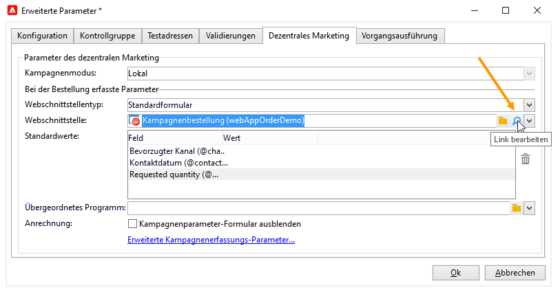

>[!NOTE]
>
>Die Konfiguration der Webanwendung kann nur in der Kampagnenvorlage vorgenommen werden.

Wählen Sie im Tab **[!UICONTROL Bearbeiten]** die Aktivität **Kampagnenbestellung** aus und öffnen Sie sie, um auf ihren Inhalt zuzugreifen.

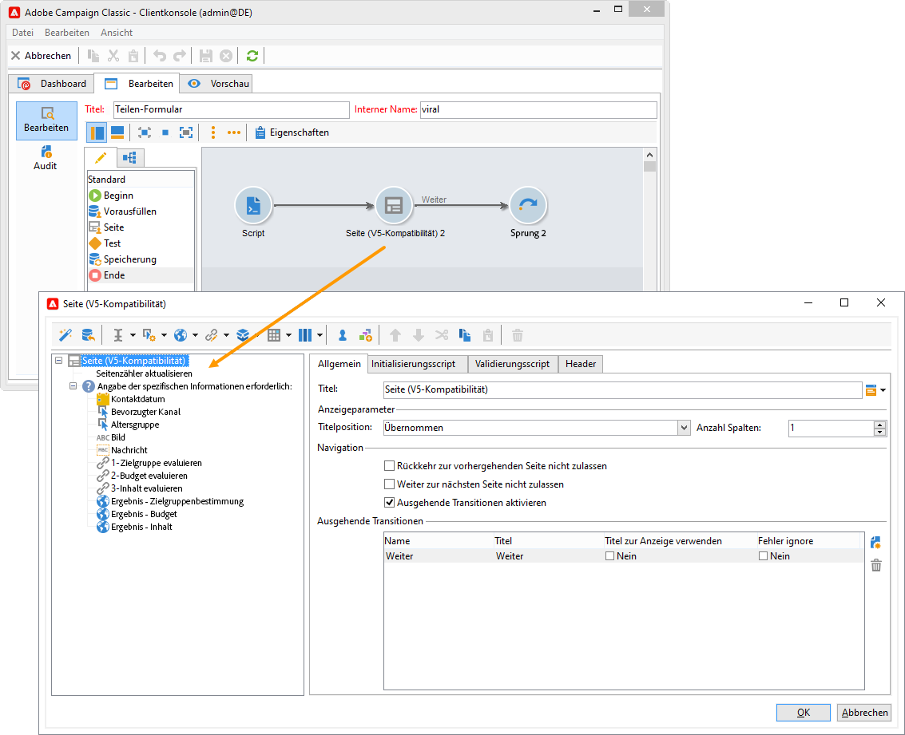

Im vorliegenden Beispiel enthält die Aktivität **Kampagnenbestellung**:

* Felder, die von der Lokalstelle bei der Bestellung angegeben werden;

   

* Links, die der Lokalstelle die Evaluierung der Kampagne ermöglichen (z. B. Zielgruppe, Budget, Inhalt etc.);

   

* Scripts, die die Berechnung und Anzeige der Ergebnisse der vorhergenden Evaluierungen ermöglichen.

   

Im vorliegenden Beispiel werden die folgenden APIs verwendet:

* Zur Zielgruppen-Evaluierung:

   ```
   var res = nms.localOrder.EvaluateTarget(ctx.localOrder);
   ```

* Zur Budget-Evaluierung:

   ```
   var res = nms.localOrder.EvaluateDeliveryBudget(ctx.@deliveryId, NL.XTK.parseNumber(ctx.@compt));
   ```

* Zur Inhalts-Evaluierung:

   ```
   var res = nms.localOrder.EvaluateContent(ctx.localOrder, ctx.@deliveryId, "html", resSeed.@id);
   ```

## Erstellen einer partizipativen Kampagne (mit Zielgruppenvalidierung) {#creating-a-collaborative-campaign--by-target-approval-}

### Einleitung {#introduction}

Sie sind Marketingleiter einer großen Bekleidungsmarke, die über einen Onlineshop und mehrere Filialen in ganz Deutschland verfügt. Zum Frühlingsanfang möchten Sie Ihre besten Kunden von einem Sonderangebot profitieren lassen: 50 % Rabatt auf die Sommerkleidung des Katalogs.

Dieses Angebot soll nur den Kunden unterbreitet werden, die seit Jahresbeginn für mehr als 300 € in einer Ihrer Filialen eingekauft haben.

Sie entschließen sich daher, mithilfe der Distributed-Marketing-Option eine partizipative Kampagne mit Zielgruppenvalidierung zu erstellen: Diese ermöglicht es Ihnen, die zuvor beschriebenen besten Kunden Ihrer Filialen je nach Region auszuwählen und ihnen das entsprechende Angebot zukommen zu lassen.

Der erste Teil des Beispiels stellt die Perspektive der Lokalstellen dar: Sie erhalten bei der Erstellung der Kampagne eine Benachrichtigungs-E-Mail, über die sie die Kampagne konfigurieren, evaluieren und bestellen können.

Der zweite Teil detailliert, wie diese Kampagnenart von der Zentralstelle erstellt wird.

Zusammenfassend sind folgende Etappen zu durchlaufen:

**Lokalstellenseitig**

1. Rufen Sie über die Benachrichtigung bezüglich der Erstellung der Kampagne die von der Zentralstelle ausgewählte Kontaktliste auf.
1. Wählen Sie die gewünschten Kontakte aus und validieren Sie Ihre Teilnahme an der Kampagne.

**Zentralstellenseitig**

1. Erstellen Sie eine **[!UICONTROL Datenverteilung]**.
1. Erstellen Sie die partizipative Kampagne.
1. Veröffentlichen Sie die Kampagne.

### Teilnehmende Lokalstellen {#local-entity-side}

1. Die zur Teilnahme an der Kampagne ausgewählten Lokalstellen erhalten per E-Mail eine Benachrichtigung.

   

1. Über den in der Benachrichtigung enthaltenen Link **[!UICONTROL Kontaktliste aufrufen und Zielgruppe validieren]** hat die Lokalstelle per Web-Schnittstelle Zugriff auf die Liste ihrer für die Kampagne ausgewählten Kontakte.

   

1. Die Lokalstelle entnimmt der Liste die Kontakte, die vor Kurzem bereits ein ähnliches Angebot erhalten haben.

   

Nach den Validierungen kann die Kampagne automatisch beginnen.

### Zuständige Zentralstelle {#central-entity-side}

#### Erstellen einer Datenverteilungs-Aktivität {#creating-a-data-distribution-activity}

1. Um eine partizipative Kampagne mit Zielgruppenvalidierung zu implementieren, muss zunächst eine **[!UICONTROL Datenverteilung]** erstellt werden. Klicken Sie im Knoten **[!UICONTROL Ressourcen > Kampagnenverwaltung > Datenverteilung]** auf das Symbol **[!UICONTROL Neu]**.

   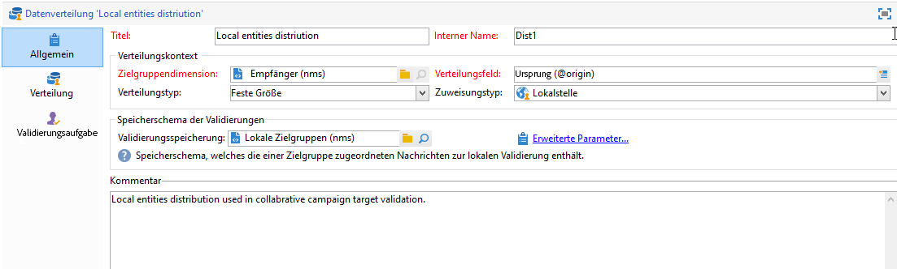

1. Geben Sie im Tab **[!UICONTROL Allgemein]** folgende Parameter an:

   * die **[!UICONTROL Zielgruppendimension]**: Die **Datenverteilung** erfolgt hier für die **Empfänger**;
   * den **[!UICONTROL Verteilungstyp]**: Sie können eine **Feste Größe** oder eine **Größe in Prozent** auswählen;
   * den **[!UICONTROL Zuweisungstyp]**: Wählen Sie **Lokalstelle** aus;
   * das **[!UICONTROL Verteilungsfeld]**: Das Feld **[!UICONTROL Herkunft (@origin)]** aus der Empfängertabelle ermöglicht es hier, die Relation zwischen Kontakt und Lokalstelle zu identifizieren.
   * das Feld **[!UICONTROL Validierungsspeicherung]**: Wählen Sie die Option **Lokale Validierung eines Empfängers**.

1. Geben Sie im Tab **[!UICONTROL Verteilung]** folgende Parameter an:

   * den **[!UICONTROL Wert des Verteilungsfelds]**, der den an der vorgesehenen Kampagne beteiligten Lokalstellen entspricht;
   * den **[!UICONTROL Titel]** der Lokalstelle;
   * die gewählte **[!UICONTROL Größe]** (fest oder in Prozent): Der **Standardwert 0** bewirkt eine Auswahl aller mit der jeweiligen Lokalstelle in Verbindung stehender Empfänger.

   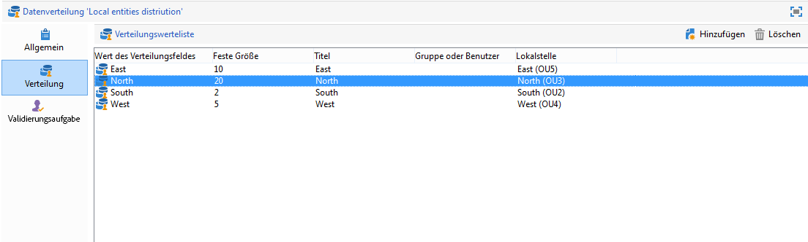

1. Speichern Sie die neue Datenverteilung.

#### Erstellen einer partizipativen Kampagne {#creating-a-collaborative-campaign}

1. Erstellen Sie vom Knoten **[!UICONTROL Kampagnenverwaltung > Kampagnen]** aus eine neue Referenzkampagne unter Verwendung der Vorlage **[!UICONTROL Partizipative Kampagne (Zielgruppenvalidierung)]**.
1. Erstellen Sie im Tab **[!UICONTROL Zielbestimmungen und Workflows]** einen Workflow für die Kampagne. Dieser muss eine Aktivität vom Typ **Aufspaltung** enthalten, deren **[!UICONTROL Begrenzung der Anzahl von Datensätzen]** durch die **[!UICONTROL Datenverteilung]** festgelegt wird.

   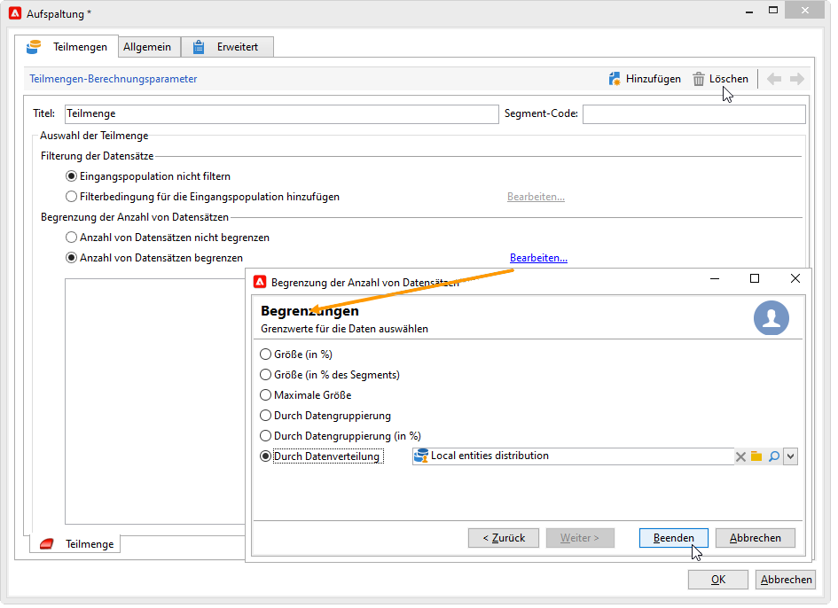

1. Fügen Sie eine Aktivität **[!UICONTROL Lokale Validierung]** hinzu, in der Sie folgende Parameter festlegen können:

   * den Inhalt der Benachrichtigung, die die Lokalstellen erhalten;
   * die Validierungserinnerung;
   * die vorgezogene Bearbeitung der Kampagne nach Validierung..

   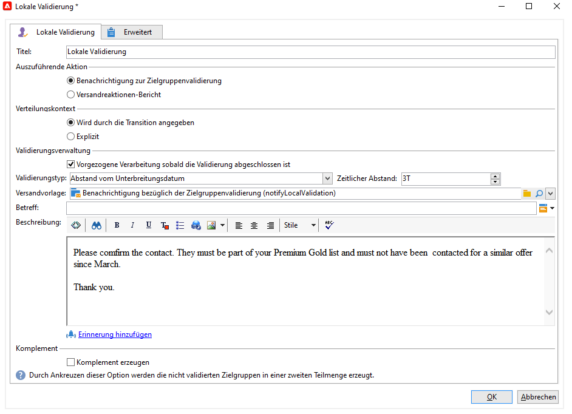

1. Speichern Sie die Kampagne.

#### Veröffentlichen der Kampagne {#publishing-the-campaign}

Fügen Sie nun über den Tab **[!UICONTROL Kampagnen]** ein **Kampagnenkit** hinzu.

1. Wählen Sie Ihre **[!UICONTROL Referenzkampagne]** aus. Im Tab **[!UICONTROL Bearbeiten]** des Kits können Sie den **[!UICONTROL Validierungsmodus]** für Ihre Kampagne wählen:

   * im Modus **Manuell** nehmen die Lokalstellen an der Kampagne teil, wenn Sie die Einladung der Zentralstelle akzeptieren. Sie können bei Bedarf die vorausgewählten Kontakte löschen. Eine Validierung der Teilnahme durch einen Vorgesetzten ist zwingend erforderlich.
   * im Modus **Automatisch** sind die Lokalstellen verpflichtet, an der Kampagne teilzunehmen, sofern sie sich nicht manuell abmelden. Sie können Kontakte löschen, ohne dass eine weitere Validierung erforderlich ist.

   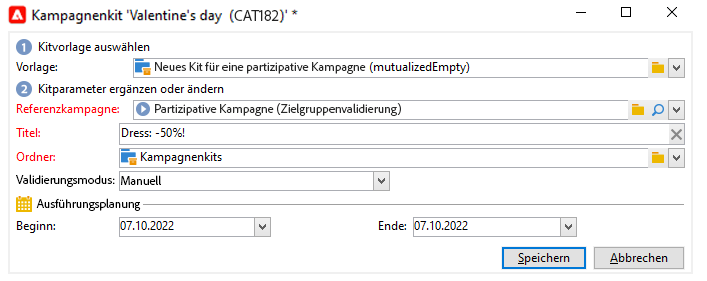

1. Im Tab **[!UICONTROL Beschreibung]** können Sie eine Beschreibung der Kampagne hinzufügen und Dokumente anhängen, die den Lokalstellen übermittelt werden.

   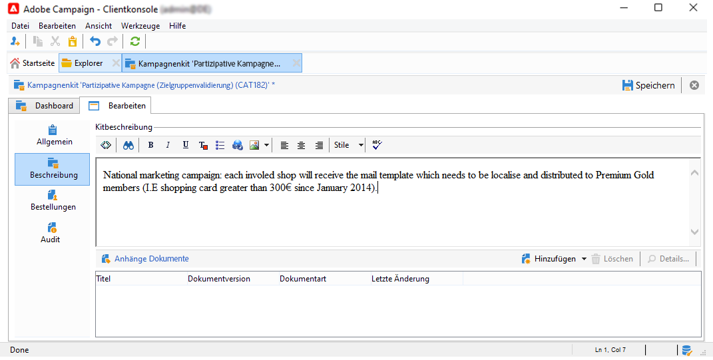

1. Validieren Sie das Kit und starten Sie den Workflow, um das Kit zu veröffentlichen und es für die Lokalstellen in der Kampagnenkit-Liste zur Verfügung zu stellen.

   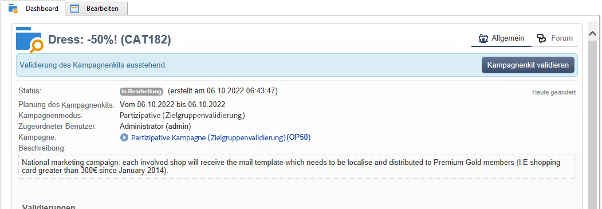

## Erstellen einer partizipativen Kampagne (Formular) {#creating-a-collaborative-campaign--by-form-}

### Einleitung {#introduction-1}

Sie sind Marketingleiter einer großen Kosmetikmarke, die über einen Onlineshop und mehrere Filialen in ganz Deutschland verfügt. Um Ihr Lager zu räumen, möchten Sie ein Sonderangebot für zwei unterschiedliche Kundenkategorien erstellen: Die erste Kategorie enthält alle Kunden, die älter als 30 sind und Produkte für reifere Haut angeboten bekommen sollen. Die zweite Kategorie enthält Kunden unter 30 Jahren, die Angebote für Produkte erhalten sollen, die für unreine oder normale Haut geeignet sind.

Sie entschließen sich daher, mithilfe der Distributed-Marketing-Option eine partizipative Kampagne mit Formular zu erstellen: Diese ermöglicht es Ihnen, die Kunden der unterschiedlichen Filialen nach Altersgruppen auszuwählen. Die Kunden erhalten einen entsprechend ihrem Alter personalisierten E-Mail-Versand mit dem jeweiligen Sonderangebot.

Der erste Teil des Beispiels stellt die Perspektive der Lokalstellen dar: Sie erhalten bei der Erstellung der Kampagne eine Benachrichtigungs-E-Mail, über die sie die Kampagne konfigurieren, evaluieren und bestellen können.

Der zweite Teil detailliert, wie diese Kampagnenart von der Zentralstelle erstellt wird.

Zusammenfassend sind folgende Etappen zu durchlaufen:

**Lokalstellenseitig**

1. Rufen Sie über die Benachrichtigung bezüglich der Erstellung der Kampagne das Online-Formular auf.
1. Passen Sie die lokal Kampagne an, indem Sie Zielgruppe, Inhalt und Versandumfang angeben.
1. Evaluieren Sie die lokale Anpassung und überarbeiten Sie sie, sofern notwendig.
1. Validieren Sie Ihre Teilnahme.
1. Der Manager (der Lokal- oder Zentralstelle) genehmigt Konfiguration und Teilnahme.

**Zentralstellenseitig**

1. Erstellen Sie die partizipative Kampagne.
1. Konfigurieren Sie die **[!UICONTROL Erweiterten Kampagnenparameter...]** so, wie Sie es für eine lokale Kampagne tun würden.
1. Konfigurieren Sie den Kampagnen- sowie den Versand-Workflow wie für eine lokale Kampagne.
1. Aktualisieren Sie das Webformular.
1. Erstellen und veröffentlichen Sie das Kampagnenkit.

### Teilnehmende Lokalstellen {#local-entity-side-1}

1. Die zur Teilnahme an der Kampagne ausgewählten Lokalstellen werden per E-Mail über die Veröffentlichung der Kampagne benachrichtigt.

   

1. Jede Lokalstelle füllt das personalisierte Formular aus und:

   * evaluiert Zielgruppe und Budget,
   * überprüft die Vorschau des Versandinhalts,
   * validiert ihre Teilnahme.

      

1. Der für die Validierung der Bestellungen verantwortliche Benutzer genehmigt die Teilnahme.

   

### Zuständige Zentralstelle {#central-entity-side-1}

1. Um eine partizipative Kampagne mit Formular zu erstellen, muss zunächst eine Referenzkampagne mithilfe der Vorlage **Partizipative Kampagne (Formular) (opCollaborativeByForm)** erstellt werden.

   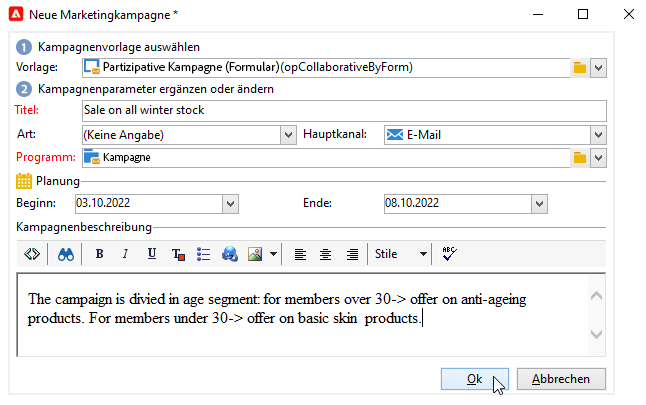

1. Klicken Sie auf der Registerkarte **[!UICONTROL Bearbeiten]** der Kampagne auf den Link **[!UICONTROL Erweiterte Kampagnenparameter...]**, um die Kampagne wie eine lokale Kampagne zu konfigurieren. Siehe [Erstellung einer lokalen Kampagne (Standardformular)](#creating-a-local-campaign--by-form-).

   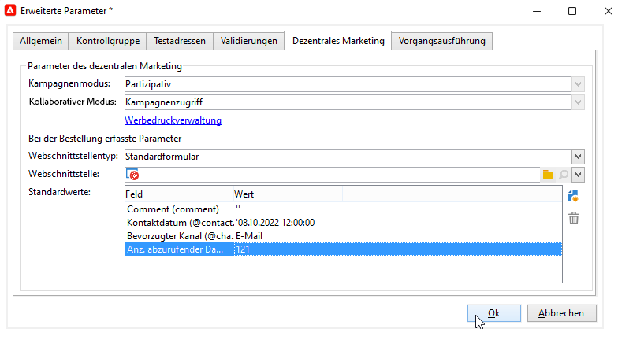

1. Konfigurieren Sie den Kampagnen-Workflow und das Webformular. Siehe [Erstellung einer lokalen Kampagne (Standardformular)](#creating-a-local-campaign--by-form-).
1. Erstellen Sie das Kampagnenkit. Geben Sie hierbei die Ausführungsplanung sowie die betroffenen Lokalstellen an.

   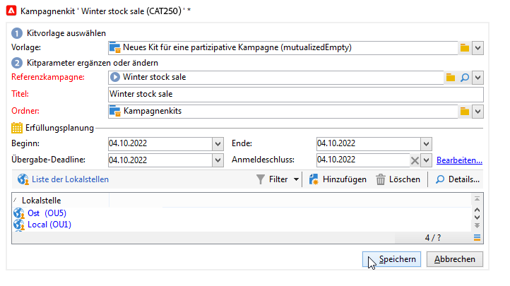

1. Schließen Sie die Konfiguration des Kits mit der Auswahl des Validierungsmodus im Tab **[!UICONTROL Bearbeiten]** ab.

   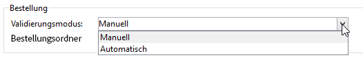

1. Erfassen Sie bei Bedarf im Tab **[!UICONTROL Beschreibung]** nähere Hinweise zu der geplanten Kampagne. Diese Beschreibung ist in der Benachrichtigung enthalten, die die Lokalstellen bei der Veröffentlichung des Kits erhalten. An dieser Stelle können dem Kit zudem relevante Dokumente angehängt werden.

   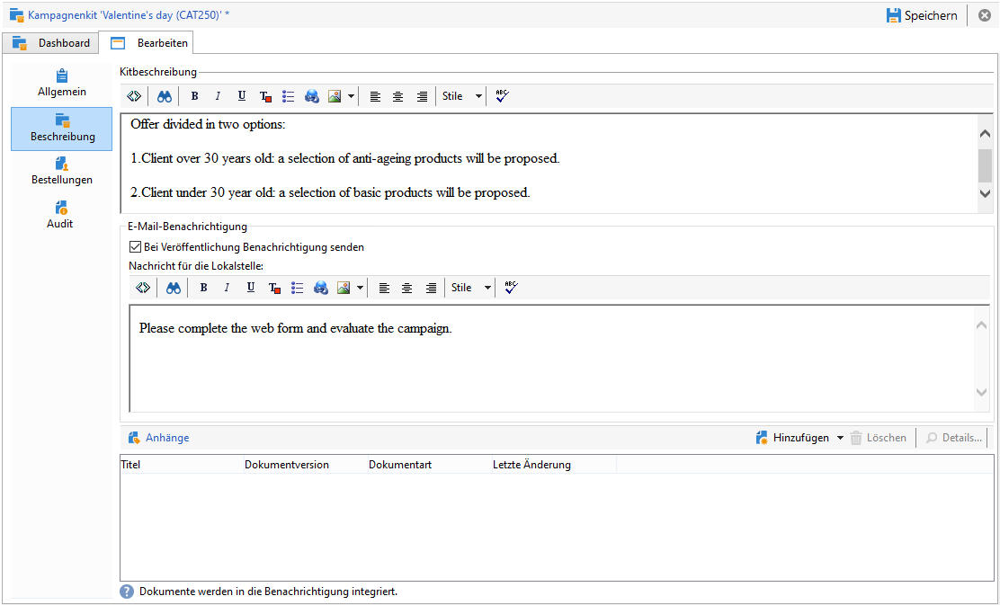

1. Validieren Sie das Kit, um es in der Kampagnenkit-Liste zu veröffentlichen.

   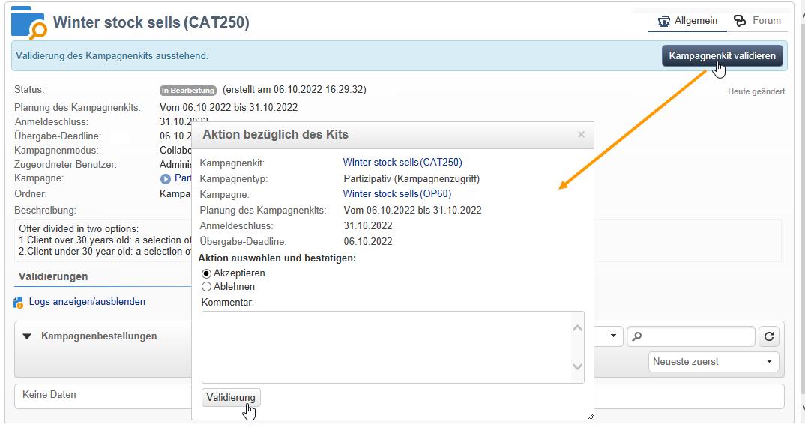
