# Beispiele für verteiltes Marketing{#distributed-marketing-samples}


## Erstellen einer lokalen Kampagne (Formular) {#creating-a-local-campaign--by-form-}

Die Web **Schnittstelle vom Typ &quot;**&quot; umfasst die Verwendung einer **Web-Anwendung**. Je nach Konfiguration kann diese Web-Anwendung jeden Typ definierter personalisierter Elemente enthalten. Sie können beispielsweise Links vorschlagen, um die Zielgruppe, das Budget, den Inhalt usw. über dedizierte APIs auszuwerten.

>[!NOTE]
>
>Die in diesem Beispiel verwendete Web-Anwendung ist keine in Adobe Campaign vorkonfigurierte Web-Anwendung. Um ein Formular in einer Kampagne verwenden zu können, müssen Sie die entsprechende Web-Anwendung erstellen.

Klicken Sie beim Erstellen der Kampagnenvorlage auf das Symbol **[!UICONTROL Zoom]** in der Option **[!UICONTROL Web-Schnittstelle]** des Links **[!UICONTROL Erweiterte Kampagnenparameter...]**, um auf Details der Web-Anwendung zuzugreifen.

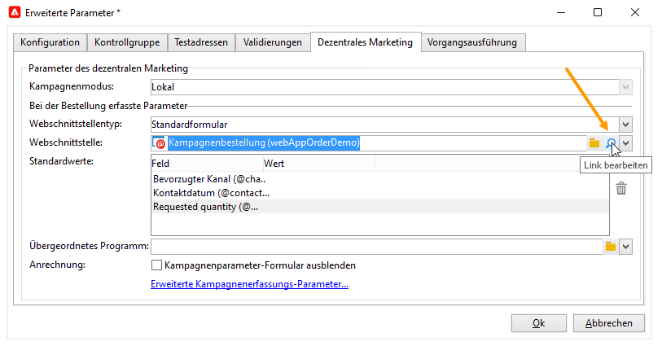

>[!NOTE]
>
>Die Konfiguration der Webanwendung kann nur in der Kampagnenvorlage vorgenommen werden.

Wählen Sie im Tab **[!UICONTROL Bearbeiten]** die Aktivität **Kampagnenbestellung** aus und öffnen Sie sie, um auf ihren Inhalt zuzugreifen.

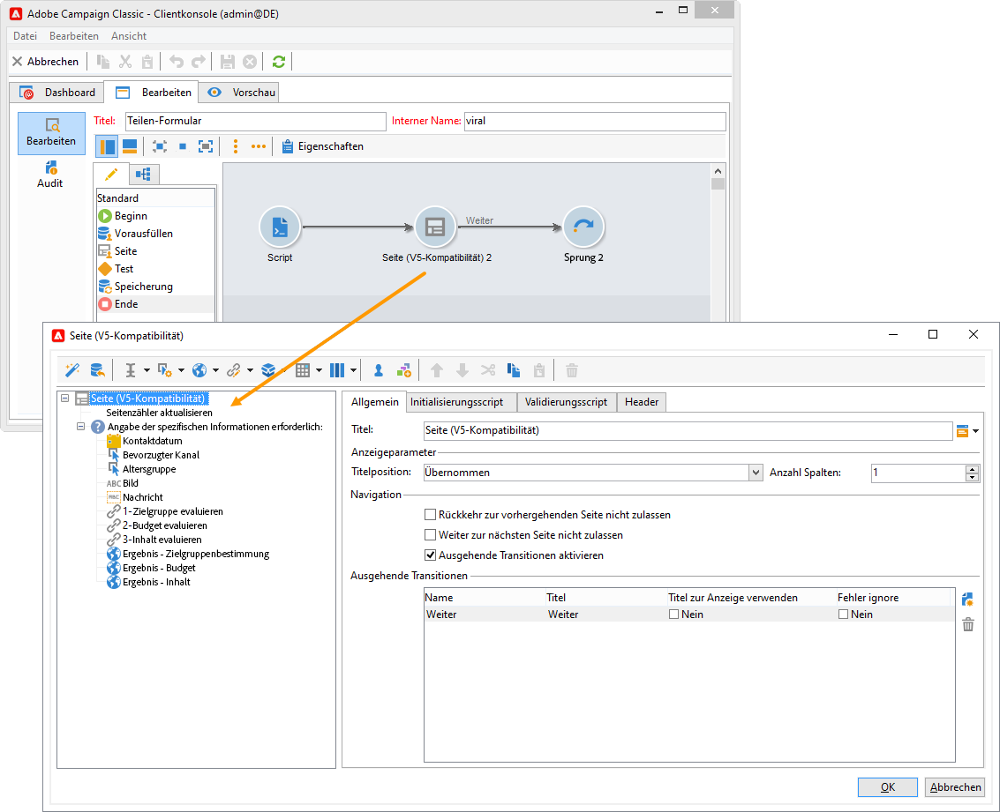

Im vorliegenden Beispiel enthält die Aktivität **Kampagnenbestellung**:

* Felder, die von der Lokalstelle bei der Bestellung angegeben werden;

  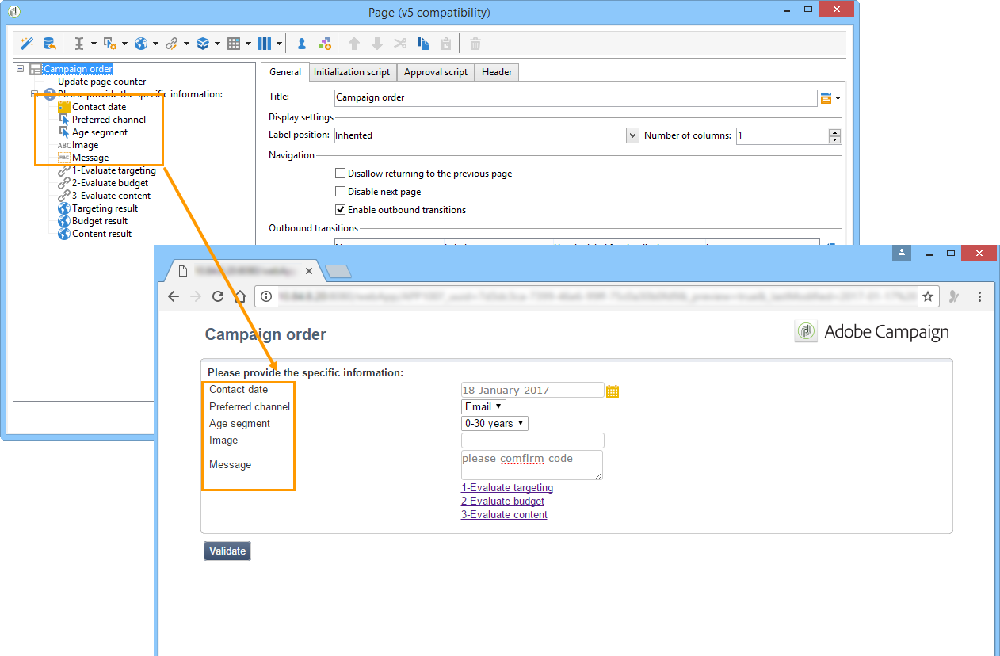

* Links, die der Lokalstelle die Auswertung der Kampagne ermöglichen (z. B. Zielgruppe, Budget, Inhalt etc.);

  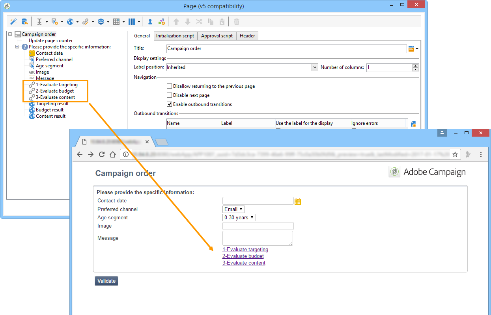

* Scripts, die die Berechnung und Anzeige der Ergebnisse der vorhergehenden Auswertungen ermöglichen.

  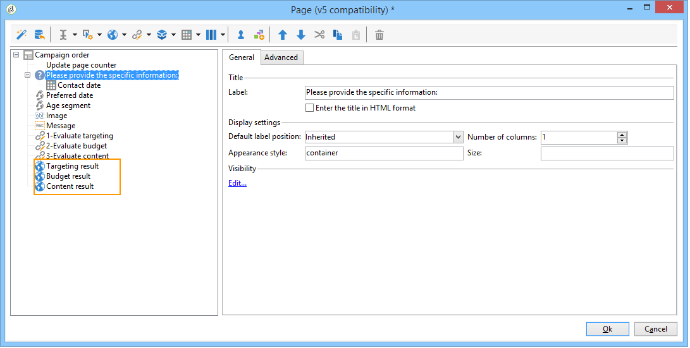

Im vorliegenden Beispiel werden die folgenden APIs verwendet:

* Zur Zielgruppenauswertung:

  ```
  var res = nms.localOrder.EvaluateTarget(ctx.localOrder);
  ```

* Zur Budgetauswertung:

  ```
  var res = nms.localOrder.EvaluateDeliveryBudget(ctx.@deliveryId, NL.XTK.parseNumber(ctx.@compt));
  ```

* Zur Inhaltsauswertung:

  ```
  var res = nms.localOrder.EvaluateContent(ctx.localOrder, ctx.@deliveryId, "html", resSeed.@id);
  ```

## Erstellen einer partizipativen Kampagne (mit Zielgruppenvalidierung) {#creating-a-collaborative-campaign--by-target-approval-}

### Einleitung {#introduction}

Sie sind Marketing Manager für eine große Bekleidungsmarke, die einen Online-Shop und mehrere Boutiquen in den gesamten USA hat. Jetzt, da der Frühling gekommen ist, entscheiden Sie sich, ein spezielles Angebot zu erstellen, das Ihren besten Kunden 50% Rabatt auf alle Kleider in Ihrem Katalog gibt.

Dieses Angebot soll nur den Kunden unterbreitet werden, die seit Jahresbeginn für mehr als 300 € in einer Ihrer Filialen eingekauft haben.

Sie entschließen sich daher, mithilfe der Distributed-Marketing-Option eine partizipative Kampagne mit Zielgruppenvalidierung zu erstellen: Diese ermöglicht es Ihnen, die zuvor beschriebenen besten Kunden Ihrer Filialen je nach Region auszuwählen und ihnen das entsprechende Angebot zukommen zu lassen.

Der erste Teil des Beispiels stellt die Perspektive der Lokalstellen dar: Sie erhalten bei der Erstellung der Kampagne eine Benachrichtigungs-E-Mail, über die sie die Kampagne konfigurieren, auswerten und bestellen können.

Der zweite Teil detailliert, wie diese Kampagnenart von der Zentralstelle erstellt wird.

Zusammenfassend sind folgende Etappen zu durchlaufen:

**Lokalstellenseitig**

1. Rufen Sie über die Benachrichtigung bezüglich der Erstellung der Kampagne die von der Zentralstelle ausgewählte Kontaktliste auf.
1. Wählen Sie die gewünschten Kontakte aus und validieren Sie Ihre Teilnahme an der Kampagne.

**Zentralstellenseitig**

1. Erstellen Sie eine **[!UICONTROL Datenverteilung]**.
1. Erstellen Sie die partizipative Kampagne.
1. Veröffentlichen Sie die Kampagne.

### Teilnehmende Lokalstellen {#local-entity-side}

1. Die zur Teilnahme an der Kampagne ausgewählten Lokalstellen erhalten per E-Mail eine Benachrichtigung.

   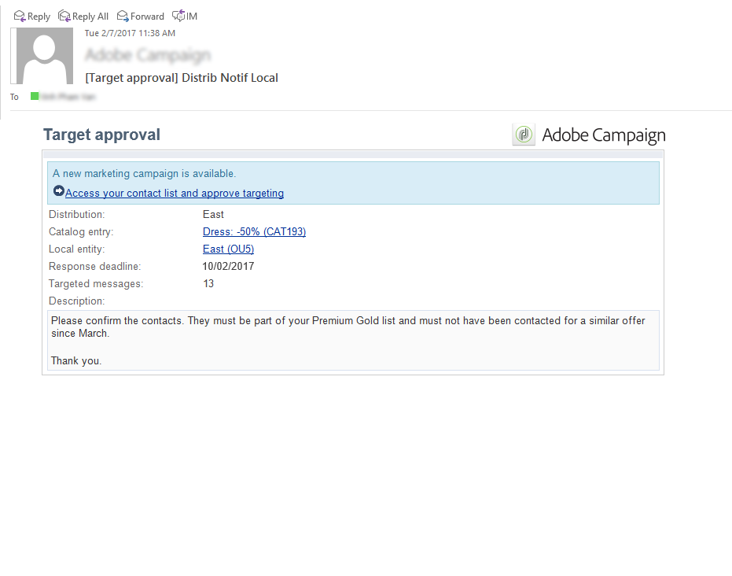

1. Über den in der Benachrichtigung enthaltenen Link **[!UICONTROL Kontaktliste aufrufen und Zielgruppenbestimmung validieren]** hat die Lokalstelle per Web-Schnittstelle Zugriff auf die Liste ihrer für die Kampagne ausgewählten Kontakte.

   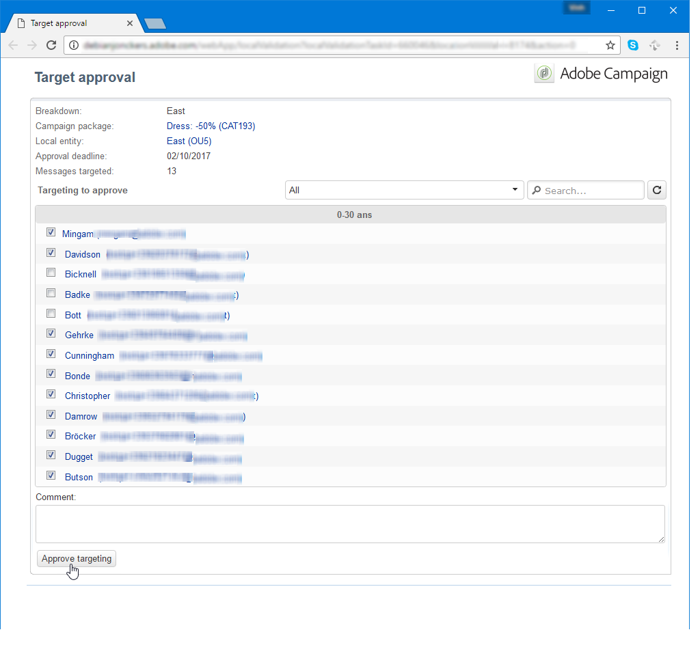

1. Die Lokalstelle entnimmt der Liste die Kontakte, die vor Kurzem bereits ein ähnliches Angebot erhalten haben.

   

Nach den Validierungen kann die Kampagne automatisch beginnen.

### Zuständige Zentralstelle {#central-entity-side}

#### Erstellen einer Datenverteilungs-Aktivität {#creating-a-data-distribution-activity}

1. Zur Einrichtung einer partizipativen Kampagne (mit Zielgruppenvalidierung) müssen Sie zunächst eine **[!UICONTROL Datenverteilungs-Aktivität]** erstellen. Klicken Sie dafür im Ordner **[!UICONTROL Ressourcen > Kampagnenverwaltung > Datenverteilung]** des Campaign-Explorers auf das Symbol **[!UICONTROL Neu]**.

   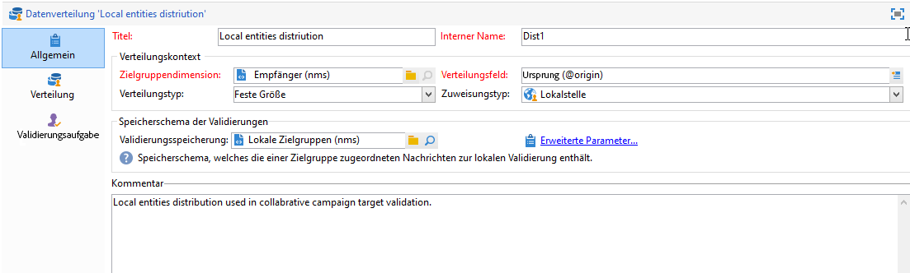

1. Geben Sie im Tab **[!UICONTROL Allgemein]** folgende Parameter an:

   * die **[!UICONTROL Zielgruppendimension]**. Die **Datenverteilung** erfolgt hier für die **Empfänger**.
   * den **[!UICONTROL Verteilungstyp]** Sie können eine **Feste Größe** oder eine **Größe in Prozent** auswählen.
   * den **[!UICONTROL Zuweisungstyp]**. Wählen Sie die Option **Lokalstelle**.
   * den **[!UICONTROL Verteilungstyp]** Das Feld **[!UICONTROL Herkunft (@origin)]** aus der Empfängertabelle ermöglicht es hier, die Relation zwischen Kontakt und Lokalstelle zu identifizieren.
   * Das Feld **[!UICONTROL Validierungsspeicherung]**. Wählen Sie die Option **Lokale Validierung eines Empfängers**.

1. Geben Sie im Tab **[!UICONTROL Aufschlüsselung]** folgende Parameter an:

   * den **[!UICONTROL Wert des Verteilungsfelds]**, der den an der vorgesehenen Kampagne beteiligten Lokalstellen entspricht;
   * den **[!UICONTROL Titel]** der Lokalstelle;
   * die **[!UICONTROL Größe]** (fest oder in Prozent). Der **Standardwert 0** bewirkt eine Auswahl aller mit der jeweiligen Lokalstelle in Verbindung stehender Empfänger.

   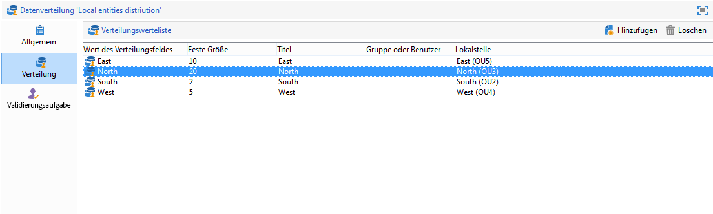

1. Speichern Sie die neue Datenverteilung.

#### Erstellen einer partizipativen Kampagne {#creating-a-collaborative-campaign}

1. Erstellen Sie vom Ordner **[!UICONTROL Kampagnenverwaltung > Kampagnen]** des Campaign-Explorers aus eine neue **[!UICONTROL partizipative Kampagne (mit Zielgruppenvalidierung)]**.
1. Erstellen Sie auf der Registerkarte **[!UICONTROL Zielgruppenbestimmungen und Workflows]** einen Workflow für die Kampagne. Dieser muss eine Aktivität vom Typ **Aufspaltung** enthalten, deren **[!UICONTROL Begrenzung der Anzahl von Datensätzen]** durch die **[!UICONTROL Datenverteilung]** festgelegt wird.

   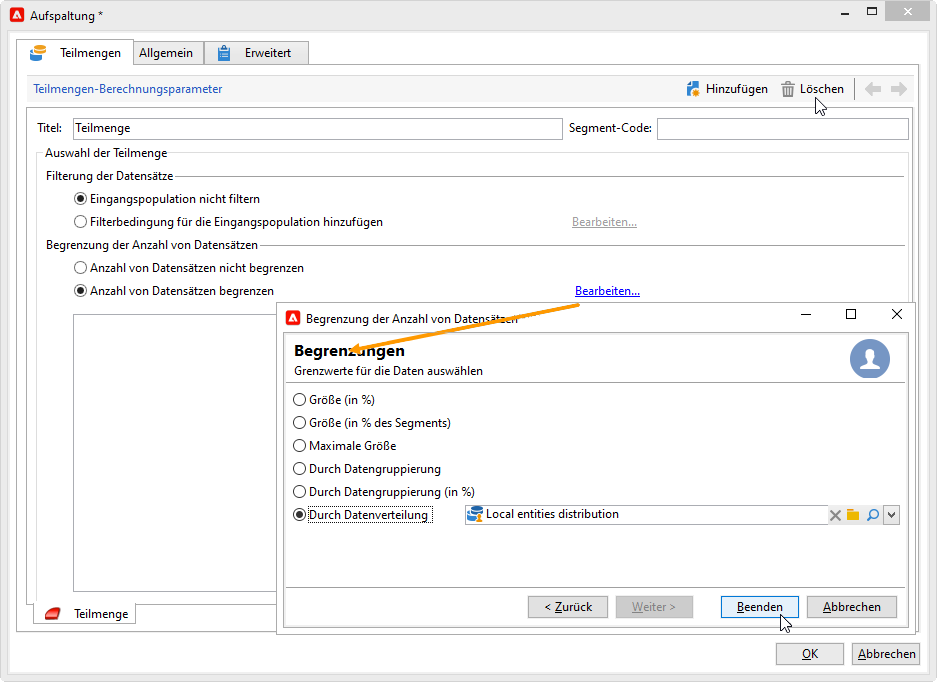

1. Fügen Sie eine Aktivität **[!UICONTROL Lokale Validierung]** hinzu, in der Sie folgende Parameter festlegen können:

   * den Inhalt der Benachrichtigung, die die Lokalstellen erhalten;
   * die Validierungserinnerung;
   * die erwartete Bearbeitung der Kampagne.

   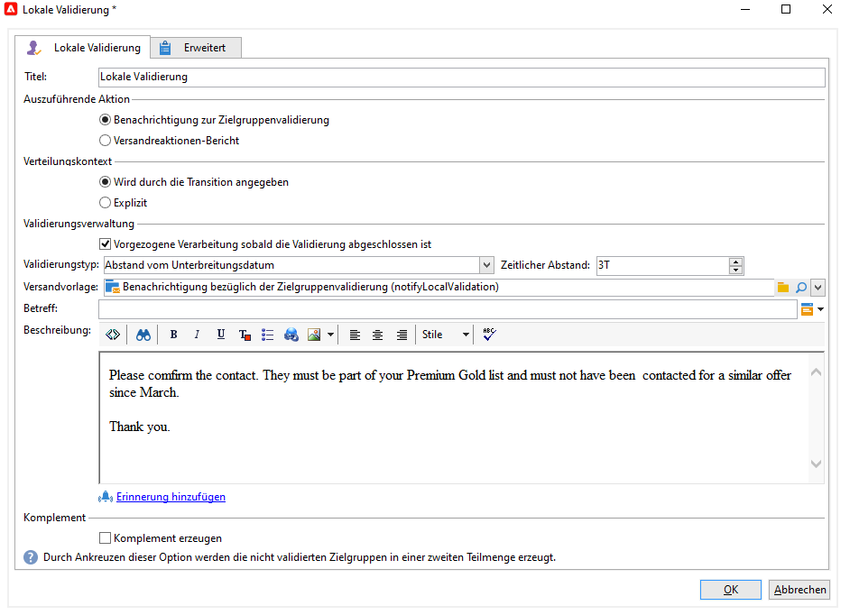

1. Speichern Sie die Kampagne.

#### Veröffentlichen der Kampagne {#publishing-the-campaign}

Fügen Sie nun über den Tab **[!UICONTROL Kampagnen]** ein **Kampagnenkit** hinzu.

1. Wählen Sie **[!UICONTROL Referenzkampagne]**. Auf der Registerkarte **[!UICONTROL Bearbeiten]** des Kits können Sie den **[!UICONTROL Validierungsmodus]** für Ihre Kampagne wählen:

   * Im **Manuell**-Modus nehmen die Lokalstellen an der Kampagne teil, wenn sie die Einladung der Zentralstelle annehmen. Er kann vorab ausgewählte Kontakte löschen, wenn er dies wünscht. Die Zustimmung des Managers ist erforderlich, um seine Teilnahme an der Kampagne zu bestätigen.
   * Im **Automatisch**-Modus müssen die Lokalstellen an der Kampagne teilnehmen, es sei denn, sie heben ihre Registrierung für die Kampagne auf. Kontakte können gelöscht werden, ohne dass eine Genehmigung erforderlich ist.

   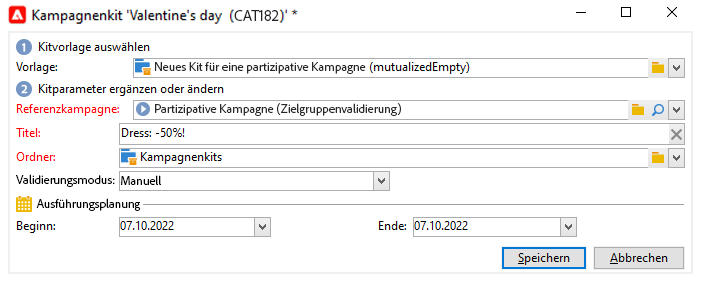

1. Im Tab **[!UICONTROL Beschreibung]** können Sie eine Beschreibung der Kampagne hinzufügen und Dokumente anhängen, die den Lokalstellen übermittelt werden.

   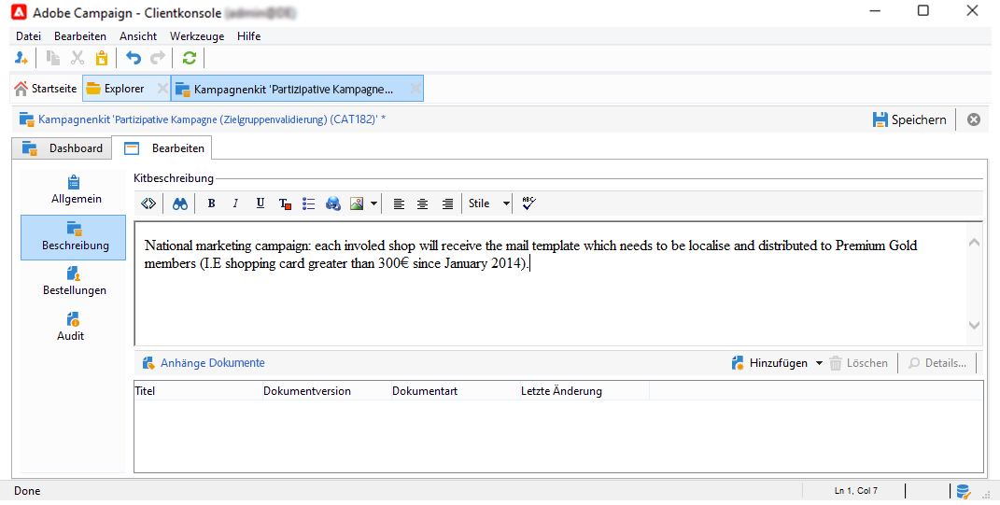

1. Validieren Sie das Kit und starten Sie den Workflow, um das Kit zu veröffentlichen und es für die Lokalstellen in der Kampagnenkit-Liste zur Verfügung zu stellen.

   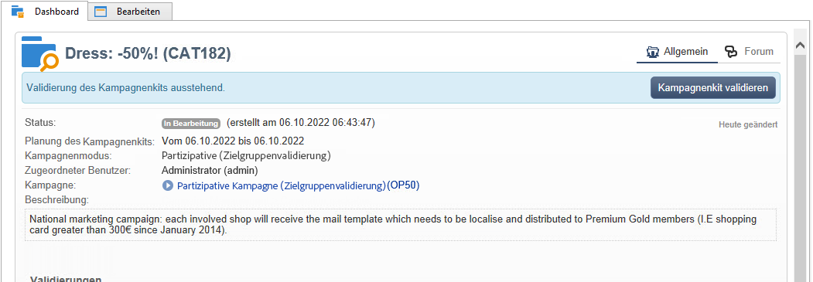

## Erstellen einer partizipativen Kampagne (Formular) {#creating-a-collaborative-campaign--by-form-}

### Einleitung {#introduction-1}

Sie sind Marketing Manager für eine große Make-up-Marke, die einen Online-Shop und mehrere Boutiquen in den gesamten USA hat. Um Ihren Wintervorrat zu entladen und Platz für Ihren neuen Vorrat zu schaffen, erstellen Sie ein spezielles Angebot, das zwei Kundenkategorien anspricht: die über 30er Jahre, denen Sie altersempfindliche Hautpflegeprodukte anbieten, und die unter 30er Jahre, denen Sie die einfacheren Hautpflegeprodukte anbieten werden.

Sie entscheiden sich daher für das verteilte Marketing, um eine partizipative Kampagne (mit Formular) zu erstellen, mit der Sie Kunden aus Ihren verschiedenen Geschäften nach Altersgruppen auswählen können. Diese Kunden erhalten einen E-Mail-Versand mit einem speziellen Angebot, das entsprechend ihrer Altersgruppe personalisiert wurde.

Der erste Teil des Beispiels stellt die Perspektive der Lokalstellen dar: Sie erhalten bei der Erstellung der Kampagne eine Benachrichtigungs-E-Mail, über die sie die Kampagne konfigurieren, auswerten und bestellen können.

Der zweite Teil detailliert, wie diese Kampagnenart von der Zentralstelle erstellt wird.

Zusammenfassend sind folgende Etappen zu durchlaufen:

**Lokalstellenseitig**

1. Rufen Sie über die Benachrichtigung bezüglich der Erstellung der Kampagne das Online-Formular auf.
1. Passen Sie die lokal Kampagne an, indem Sie Zielgruppe, Inhalt und Versandumfang angeben.
1. Evaluieren Sie die lokale Anpassung und überarbeiten Sie sie, sofern notwendig.
1. Validieren Sie Ihre Teilnahme.
1. Der Manager (der Lokal- oder Zentralstelle) genehmigt Konfiguration und Teilnahme.

**Zentralstellenseitig**

1. Erstellen Sie die partizipative Kampagne.
1. Konfigurieren Sie die **[!UICONTROL Erweiterten Kampagnenparameter...]** so, wie Sie es für eine lokale Kampagne tun würden.
1. Konfigurieren Sie den Kampagnen- sowie den Versand-Workflow wie für eine lokale Kampagne.
1. Aktualisieren Sie das Webformular.
1. Erstellen und veröffentlichen Sie das Kampagnenkit.

### Teilnehmende Lokalstellen {#local-entity-side-1}

1. Die zur Teilnahme an der Kampagne ausgewählten Lokalstellen werden per E-Mail über die Veröffentlichung der Kampagne benachrichtigt.

   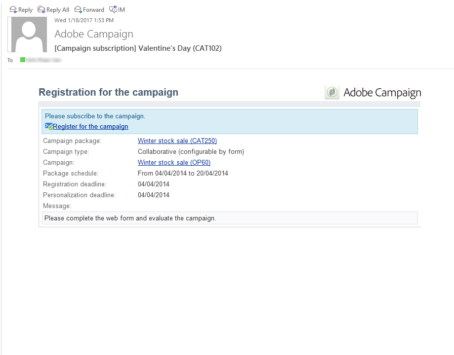

1. Jede Lokalstelle füllt das personalisierte Formular aus und:

   * wertet Zielgruppe und Budget aus,
   * überprüft die Vorschau des Versandinhalts,
   * validiert ihre Teilnahme.

     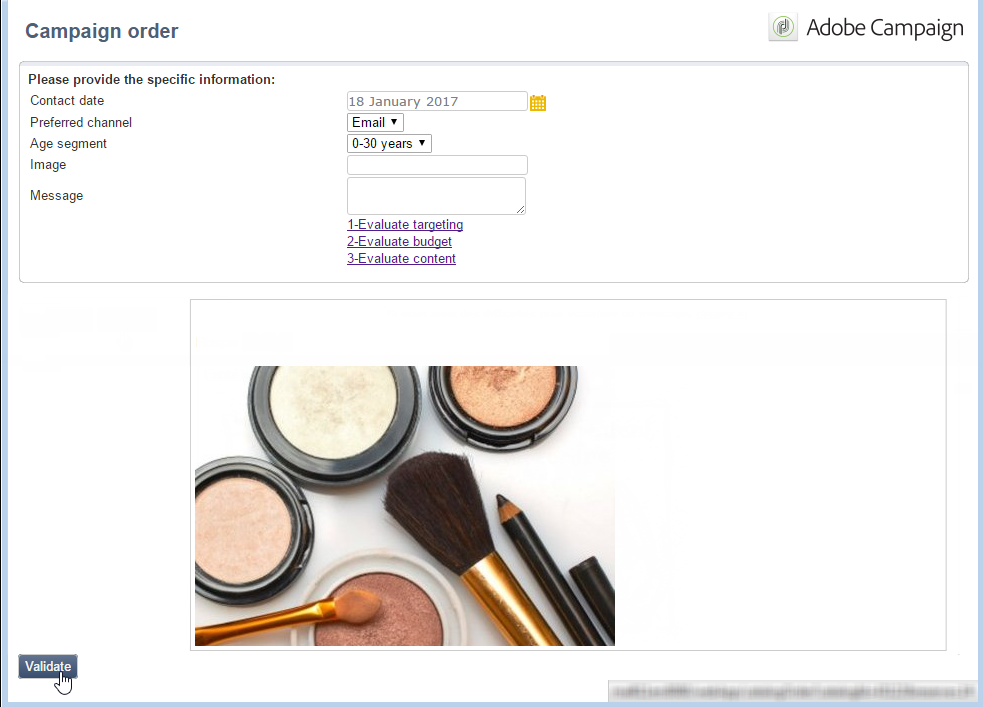

1. Der für die Validierung der Bestellungen verantwortliche Benutzer genehmigt die Teilnahme.

   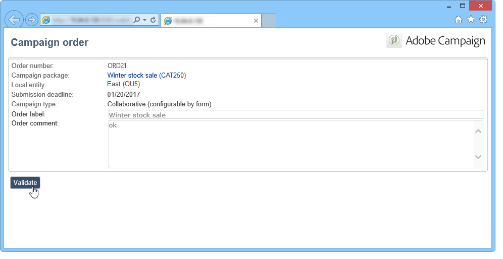

### Zuständige Zentralstelle {#central-entity-side-1}

1. Um eine partizipative Kampagne mit Formular zu erstellen, muss zunächst eine Referenzkampagne mithilfe der Vorlage **Partizipative Kampagne (Formular) (opCollaborativeByForm)** erstellt werden.

   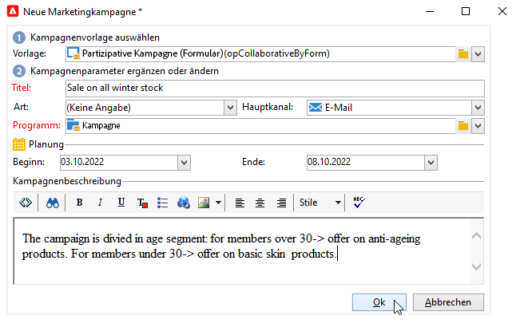

1. Klicken Sie auf der Registerkarte **[!UICONTROL Bearbeiten]** der Kampagne auf den Link **[!UICONTROL Erweiterte Kampagnenparameter...]**, um die Kampagne wie eine lokale Kampagne zu konfigurieren. Siehe [Erstellung einer lokalen Kampagne (Standardformular)](#creating-a-local-campaign--by-form-).

   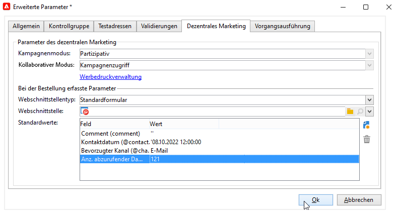

1. Konfigurieren Sie den Kampagnen-Workflow und das Webformular. Siehe [Erstellung einer lokalen Kampagne (Standardformular)](#creating-a-local-campaign--by-form-).
1. Erstellen Sie das Kampagnenkit. Geben Sie hierbei die Ausführungsplanung sowie die betroffenen Lokalstellen an.

   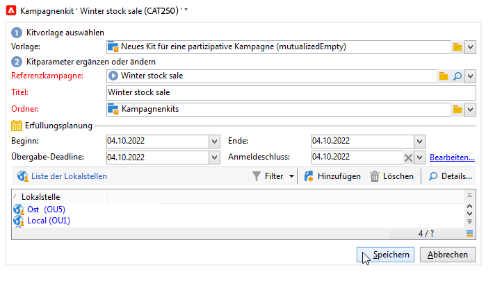

1. Schließen Sie die Konfiguration des Kits mit der Auswahl des Validierungsmodus im Tab **[!UICONTROL Bearbeiten]** ab.

   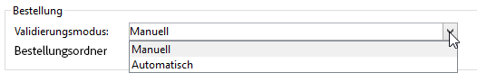

1. Erfassen Sie bei Bedarf auf der Registerkarte **[!UICONTROL Beschreibung]** nähere Hinweise zu der geplanten Kampagne. Diese Beschreibung ist in der Benachrichtigung enthalten, die die Lokalstellen bei der Veröffentlichung des Kits erhalten. An dieser Stelle können dem Kampagnenkit zudem relevante Dokumente angehängt werden.

   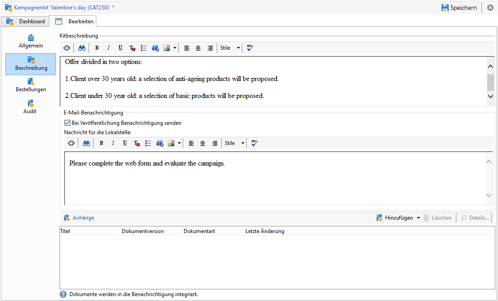

1. Validieren Sie das Kit, um es in der Kampagnenkit-Liste zu veröffentlichen.

   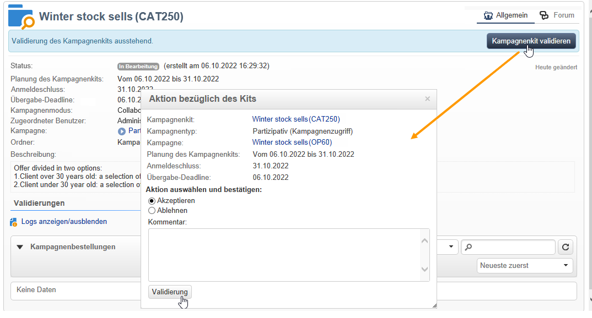
