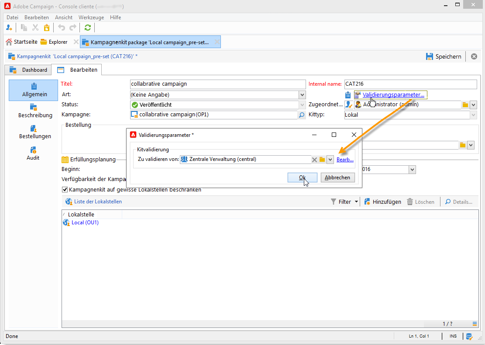
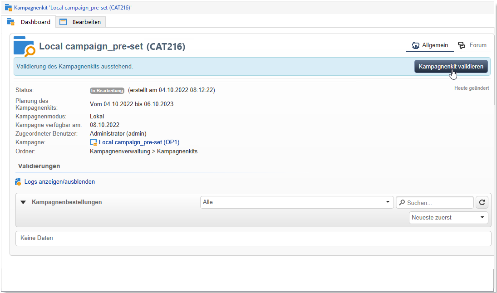
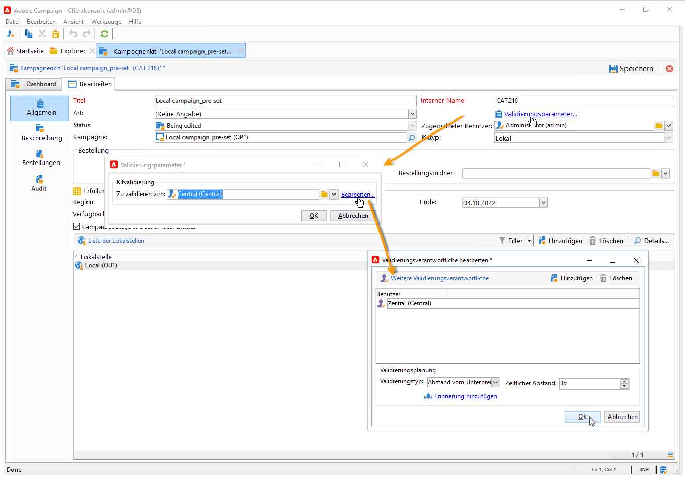
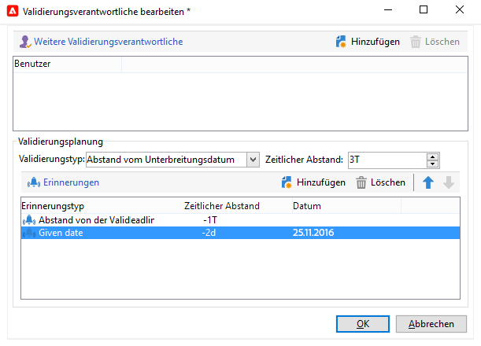
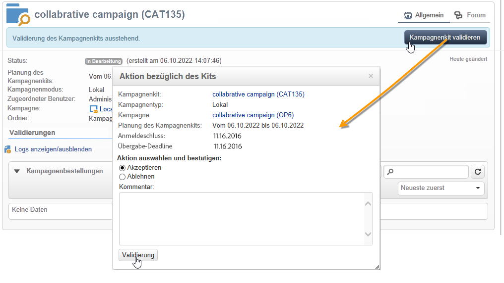

# Veröffentlichen des Kampagnenkits{#publishing-the-campaign-package}

Die Benutzenden der Zentralstelle veröffentlichen in der **[!UICONTROL Liste der Kampagnen-Kits]** die Kits, die den Lokalstellen zur Verfügung gestellt werden sollen.

Bevor sie in der Liste der Kampagnen-Kits veröffentlicht werden können, müssen die Kampagnen-Kits von der Zentralstelle genehmigt werden. Zu diesem Zweck können Sie Validierungsverantwortliche oder Gruppen von Validierungsverantwortlichen über den Link **[!UICONTROL Validierungsparameter]** im Kampagnen-Kit festlegen.

## Validierungsverantwortliche Person zuweisen {#assigning-a-reviewer}

Um den Validierer anzugeben, klicken Sie auf den Link **[!UICONTROL Validierungsparameter...]** des Kampagnenkits und wählen Sie den jeweiligen Benutzer in der Dropdown-Liste aus.

Um den Validierungsprozess zu starten, klicken Sie auf die Schaltfläche **[!UICONTROL Zur Validierung unterbreiten]**.

Der validierungsverantwortliche Benutzer erhält daraufhin eine Benachrichtigung, um die Verfügbarkeit des Kampagnenkits zu bestätigen. Über einen in der Nachricht enthaltenen Link kann er per Web-Zugriff die Validierung akzeptieren oder ablehnen.

>[!NOTE]
>
>Auf Organisationseinheitsebene können Sie auch validierende Benutzer angeben, um Bestellungen zu validieren. Weitere Informationen hierzu finden Sie unter [Organisationseinheiten](about-distributed-marketing.md#organizational-entities).

## Hinzufügen weiterer validierungsverantwortlicher Personen {#adding-other-reviewers}

Über den Link **[!UICONTROL Bearbeiten...]** im Tab **[!UICONTROL Validierungsparameter...]** des Kampagnenkits können weitere validierungsverantwortliche Benutzende hinzugefügt werden.

## Validierungs-Timeline {#approval-periods}

Wenn nicht anders angegeben, muss die Validierung innerhalb von drei Tagen ab dem Unterbreitungsdatum erfolgen.

Im Fenster „Validierungsverantwortliche bearbeiten“ können Sie auch Erinnerungen einstellen, um eine oder mehrere Nachrichten zu senden, wenn ein Kampagnen-Kit nicht genehmigt wurde. Klicken Sie dazu zunächst auf den Link **[!UICONTROL Erinnerung hinzufügen]** und dann auf die Schaltfläche **[!UICONTROL Hinzufügen]**.

Erinnerungen können entweder an einem bestimmten Datum und/oder **x** Tage nach dem Übermittlungsdatum gesendet werden. Die Art der Erinnerung kann in der ersten Spalte der Erinnerungen-Tabelle konfiguriert werden. Im folgenden Beispiel erhalten die validierungsverantwortlichen Personen am 11.01.2023 eine Erinnerungsnachricht, also zwei Tage vor dem in der Variablen **[!UICONTROL Datum]** ausgewählten Datum. Sie erhalten eine zweite Erinnerung einen Tag vor Ablauf des Validierungszeitraums, d. h. zwei Tage nach dem Datum der Übermittlung zur Validierung.

Sobald er definiert ist und das Paket zur Validierung eingereicht wurde, wird der Ausführungsplan auf der Registerkarte **[!UICONTROL Audit]** angezeigt. Er enthält die Bearbeitungsfrist, die auf der Grundlage der vorherigen Konfiguration berechnet wurde, sowie die Termine aller konfigurierten Mahnungen.

## Genehmigen über die Client-Konsole {#approving-via-the-adobe-campaign-console}

Wenn kein Validierungsverantwortlicher bestimmt wurde oder keiner der benachrichtigten Benutzer das Kit validiert hat, kann die Validierung direkt über die Schaltfläche **[!UICONTROL Kampagnenkit validieren]** des **[!UICONTROL Dashboards]** des Kampagnenkits oder über die Übersicht der Kits erfolgen.

Sobald die Kampagne validiert ist wird sie automatisch veröffentlicht, d. h. sie wird der Liste der Kampagnenkits hinzugefügt. Ab ihrem Verfügbarkeitsdatum kann sie von den Lokalstellen genutzt werden. Sofern bei der Kampagnenerstellung teilnehmende Lokalstellen bestimmt wurden, werden die Benutzer der Gruppe „Benachrichtigung bezüglich Kampagnenkits“ über die Verfügbarkeit der Kampagne benachrichtigt. Ist dies nicht der Fall, ist die Kampagne standardmäßig für alle Lokalstellen zugänglich. Weitere Informationen hierzu finden Sie unter [Organisationseinheiten](about-distributed-marketing.md#organizational-entities).
