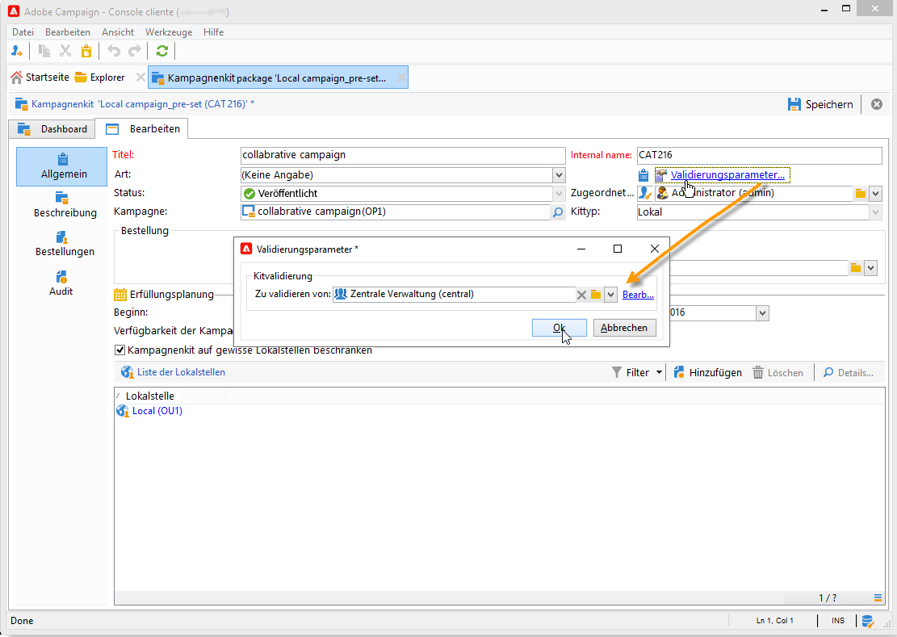
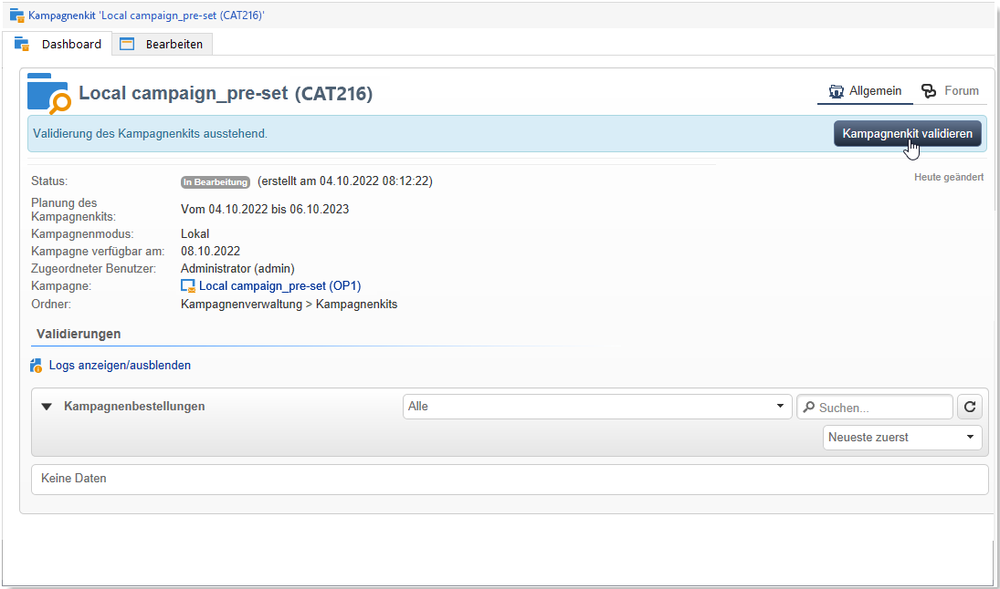
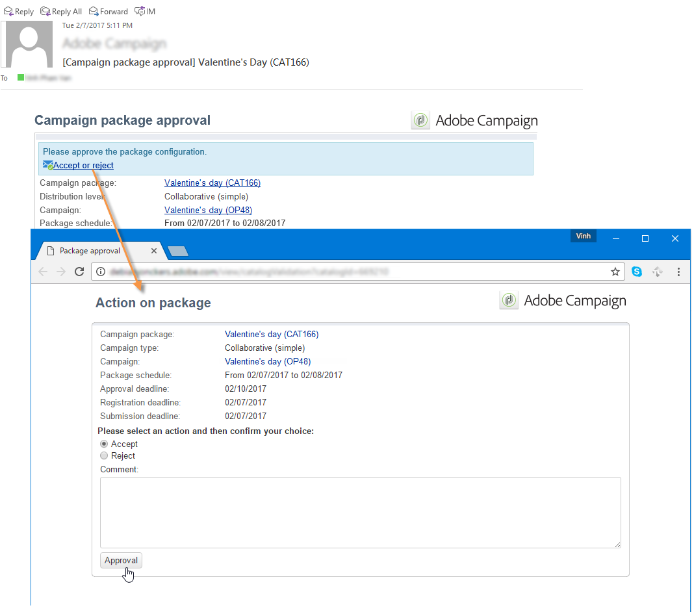
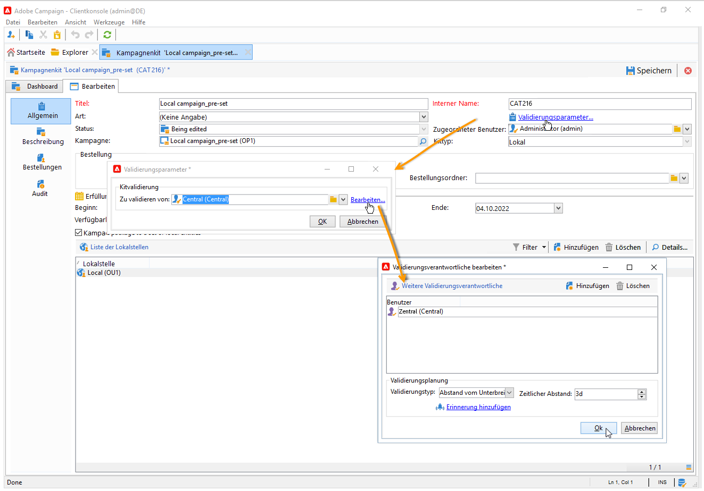
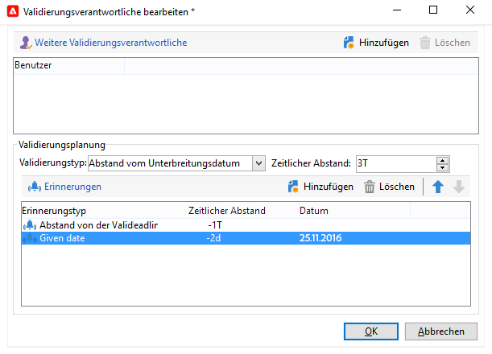
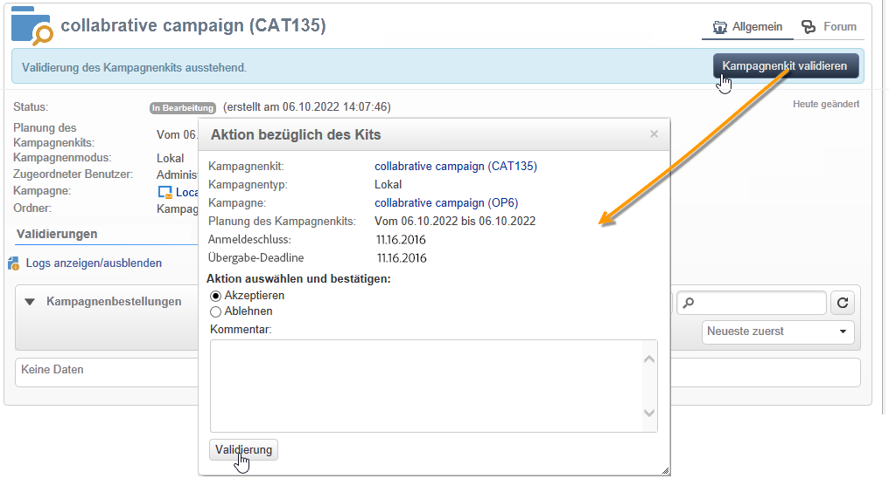

# Veröffentlichen des Kampagnenkits{#publishing-the-campaign-package}

Die Benutzenden der Zentralstelle veröffentlichen in der **[!UICONTROL Liste der Kampagnenkits]** die Kits, die den Lokalstellen zur Verfügung gestellt werden sollen.

Bevor sie in der Liste der Kampagnenkits veröffentlicht werden können, müssen die Kampagnenkits von der Zentralstelle genehmigt werden. Zu diesem Zweck können Sie Validierungsverantwortliche oder Gruppen von Validierungsverantwortlichen über den Link **[!UICONTROL Validierungsparameter]** im Kampagnenkit festlegen.

## Validierungsverantwortliche Person zuweisen {#assigning-a-reviewer}

Um den Validierer anzugeben, klicken Sie auf den Link **[!UICONTROL Validierungsparameter...]** des Kampagnenkits und wählen Sie den jeweiligen Benutzer in der Dropdown-Liste aus.

Um den Validierungsprozess zu starten, klicken Sie auf die Schaltfläche **[!UICONTROL Zur Validierung unterbreiten]**.

Der Validierungsverantwortliche erhält dann eine Benachrichtigung, mit der er die Verfügbarkeit dieses Kampagnenkits bestätigt. Die Nachricht enthält einen Link zum Akzeptieren oder Ablehnen der Validierung über den Web-Zugriff.

>[!NOTE]
>
>Auf Organisationseinheitsebene können Sie auch validierende Benutzer angeben, um Bestellungen zu validieren. Weitere Informationen hierzu finden Sie unter [Organisationseinheiten](about-distributed-marketing.md#organizational-entities).

## Hinzufügen weiterer validierungsverantwortlicher Personen {#adding-other-reviewers}

Über den Link **[!UICONTROL Bearbeiten...]** im Tab **[!UICONTROL Validierungsparameter...]** des Kampagnenkits können weitere validierungsverantwortliche Benutzer hinzugefügt werden.

## Validierungs-Timeline {#approval-periods}

Wenn nicht anders angegeben, muss die Validierung innerhalb von drei Tagen ab dem Unterbreitungsdatum erfolgen.

Im Fenster „Validierungsverantwortliche bearbeiten“ können Sie auch Erinnerungen einstellen, um eine oder mehrere Nachrichten zu senden, wenn ein Kampagnenkit nicht genehmigt wurde. Klicken Sie dazu zunächst auf den Link **[!UICONTROL Erinnerung hinzufügen]** und dann auf die Schaltfläche **[!UICONTROL Hinzufügen]**.

Erinnerungen können entweder an einem bestimmten Datum und/oder **x** Tage nach dem Übermittlungsdatum gesendet werden. Die Art der Erinnerung kann in der ersten Spalte der Erinnerungstabelle konfiguriert werden. Im folgenden Beispiel erhalten die validierungsverantwortlichen Personen am 11.01.2023 eine Erinnerungsnachricht, also zwei Tage vor dem in der Variablen **[!UICONTROL Datum]** ausgewählten Datum. Sie erhalten eine zweite Erinnerung einen Tag vor Ablauf des Validierungszeitraums, d. h. zwei Tage nach dem Datum der Übermittlung zur Validierung.

Sobald er definiert ist und das Paket zur Genehmigung eingereicht wurde, wird der Ausführungsplan auf der Registerkarte **[!UICONTROL Audit]** angezeigt. Darin werden die auf der Grundlage der vorherigen Konfiguration berechnete Verarbeitungsfrist sowie die Daten aller konfigurierten Mahnungen angezeigt.

## Genehmigen über die Client-Konsole {#approving-via-the-adobe-campaign-console}

Wenn kein Validierungsverantwortlicher bestimmt wurde oder keiner der benachrichtigten Benutzer das Kit validiert hat, kann die Validierung direkt über die Schaltfläche **[!UICONTROL Kampagnenkit validieren]** des **[!UICONTROL Dashboards]** des Kampagnenkits oder über die Übersicht der Kits erfolgen.

Nach der Validierung wird die Kampagne veröffentlicht und der Liste hinzugefügt. Sobald das Verfügbarkeitsdatum erreicht ist, können Lokalstellen sie verwenden. Wenn die Lokalstellen bei der Erstellung der Kampagne angegeben wurden, wird eine Nachricht an die Benutzenden in der Benachrichtigungsgruppe gesendet, um sie darüber zu informieren, dass die Kampagne verfügbar ist. Wenn zuvor keine Entität angegeben wurde, ist die Kampagne standardmäßig für alle Lokalstellen verfügbar. Weitere Informationen hierzu finden Sie unter [Organisationseinheiten](about-distributed-marketing.md#organizational-entities).
