# Nachverfolgen einer Kampagne{#tracking-a-campaign}

Zentrale Benutzer haben die Möglichkeit, die Bestellungen und Evaluierungen der angebotenen Kampagnenkits zu verfolgen.

Folgende Funktionen stehen ihnen hierzu zur Verfügung:

* [Filtern von Kits](#filter-packages),
* [Bearbeiten von Kits](#edit-packages),
* [Abbrechen von Kits](#cancel-a-package),
* [Zurücksetzen eines Packages](#reinitializing-a-package).

## Filtern von Kits {#filter-packages}

Im Tab **[!UICONTROL Kampagnen]** können Sie die Liste der **[!UICONTROL Kampagnenkits]** anzeigen, in der alle vorhandenen dezentralen Marketing-Kampagnen neu gruppiert werden können. Sie können diese Liste so filtern, dass nur Kampagnen angezeigt werden, die entweder veröffentlicht, verspätet, mit ausstehender Genehmigung usw. sind. Klicken Sie dazu auf die Links im oberen Abschnitt dieser Ansicht oder verwenden Sie den Link **[!UICONTROL Filterliste]** und wählen Sie den Status des Kampagnenkits aus.

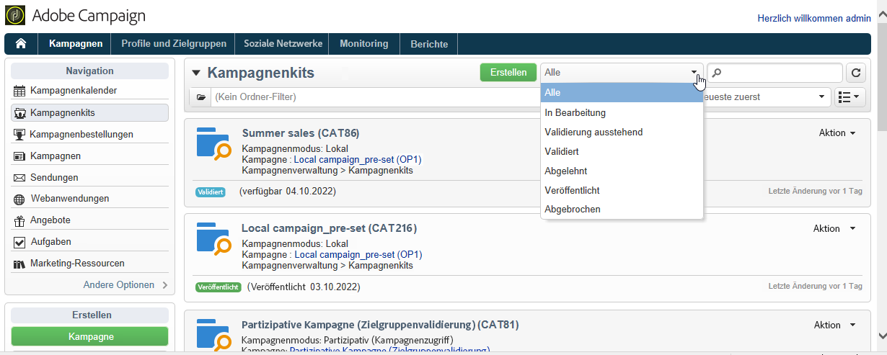

## Bearbeiten von Kits {#edit-packages}

Die Liste der **[!UICONTROL Kampagnenkits]** zeigt eine kurze Zusammenfassung jedes Kits.

Sie enthält folgende Informationen: Titel, Kampagnentyp, Referenzkampagne des Kits sowie sein Speicherordner.

Klicken Sie auf den Paketnamen, um ihn zu bearbeiten. Sie können Bestellungen auch nach Lokalstellen und Status anzeigen.

Diese Informationen werden auch in der Übersicht **[!UICONTROL Kampagnenbestellungen]** angezeigt, die alle erfolgten Bestellungen auflistet.

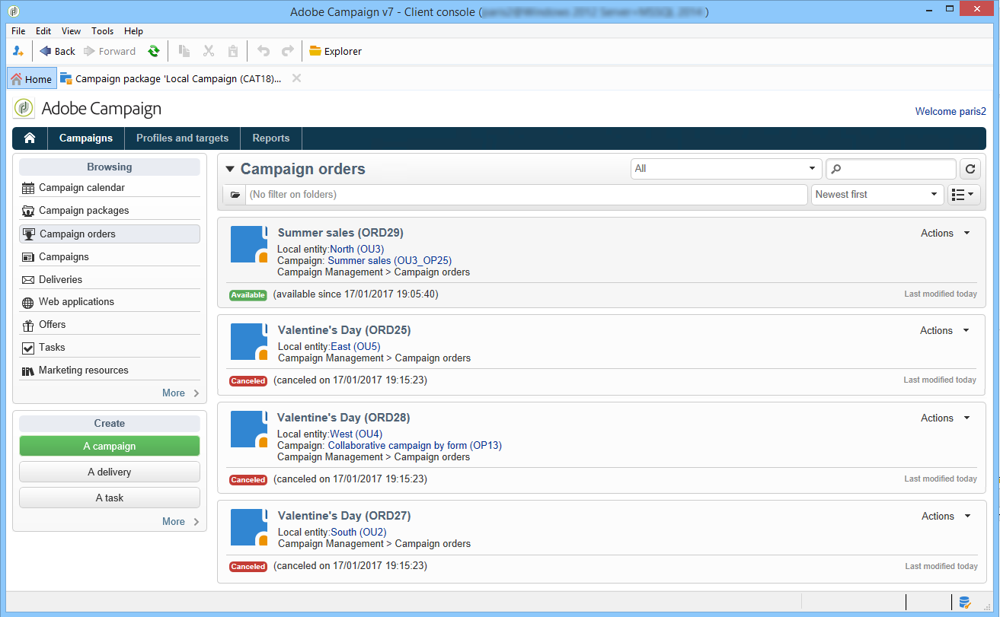

Der zentrale Benutzer kann die Reihenfolge bearbeiten. Dazu gibt es zwei Möglichkeiten:

1. Sie können auf den Titel der Bestellung klicken, um sie zu öffnen. Daraufhin werden Bestelldetails angezeigt.

   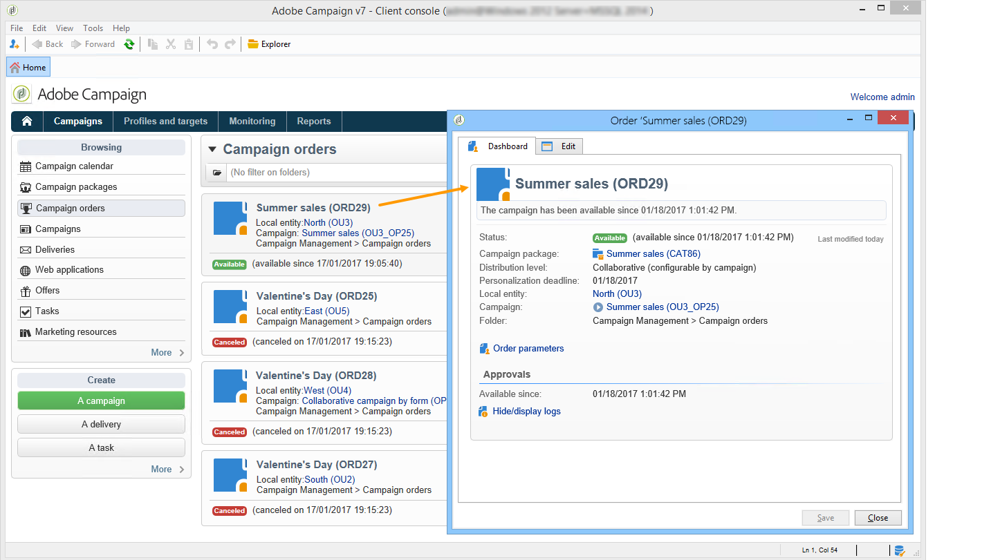

   Über den Tab **[!UICONTROL Bearbeiten > Allgemein]** können die von der Lokalstelle bei der Bestellung erfassten Informationen eingesehen werden.

   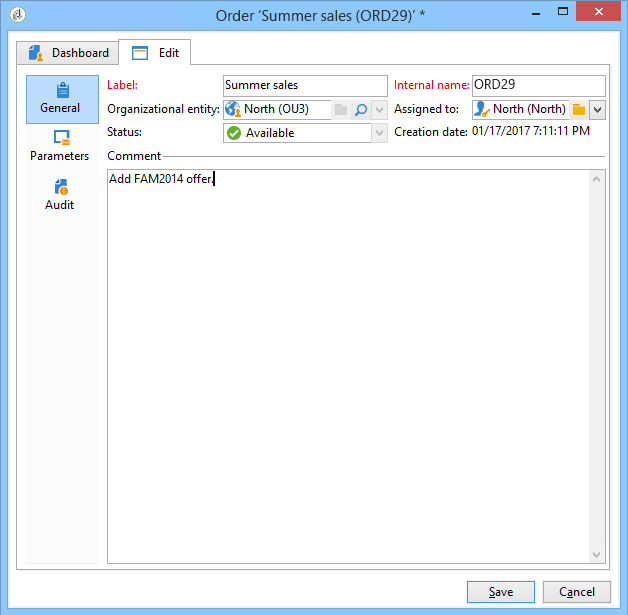

1. Der Benutzer kann auf den Titel des Kampagnenkits klicken, um ihn zu öffnen und gegebenenfalls bestimmte Parameter zu verändern.

   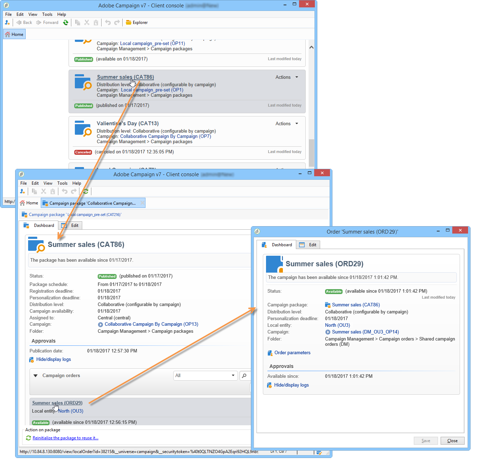

## Abbrechen von Kits {#cancel-a-package}

Die Zentralstelle kann ein Kampagnenkit jederzeit abbrechen.

Klicken Sie hierzu auf die Schaltfläche **[!UICONTROL Abbrechen]** im **[!UICONTROL Dashboard]** des Kampagnenkits.

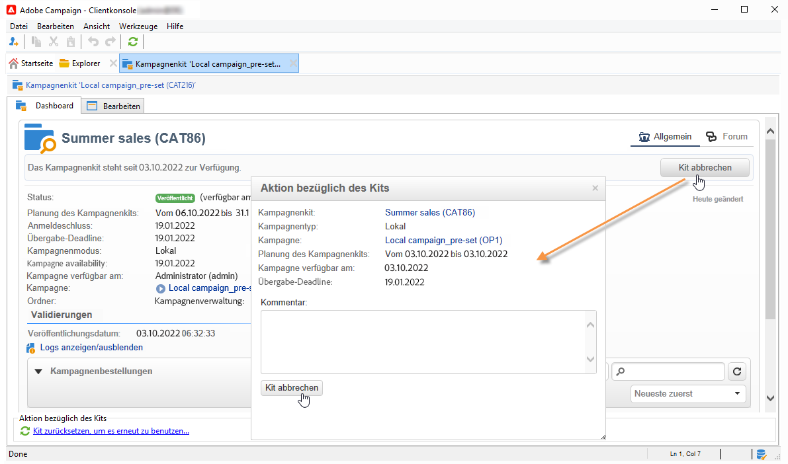

Sie haben die Möglichkeit, den Abbruch im Feld **[!UICONTROL Kommentar]** zu begründen.

Auf Niveau einer **lokalen Kampagne** löscht der Abbruch eines Kits diesen aus der Liste der für die Lokalstellen verfügbaren Kampagnen.

Auf Niveau einer **partizipativen Kampagne** hat der Abbruch eines Kits folgende Auswirkungen:

1. Abbruch aller mit diesem Kit verbundenen Bestellungen;

   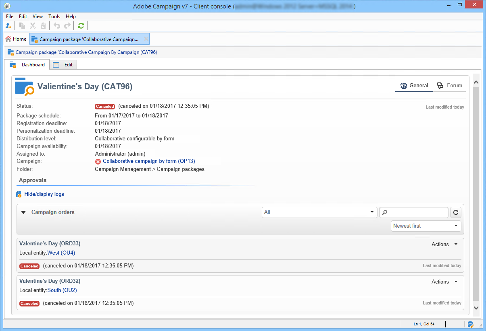

1. Abbruch der Hauptkampagne und Anhalten aller aktiven Vorgänge (Workflows, Sendungen);

   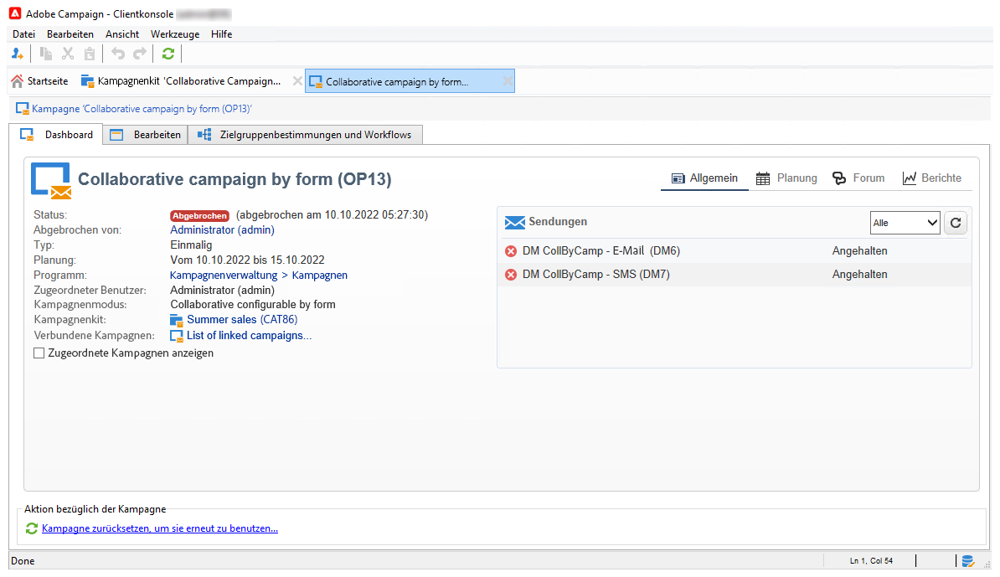

1. Versand einer Benachrichtigung an alle betroffenen Lokalstellen.

   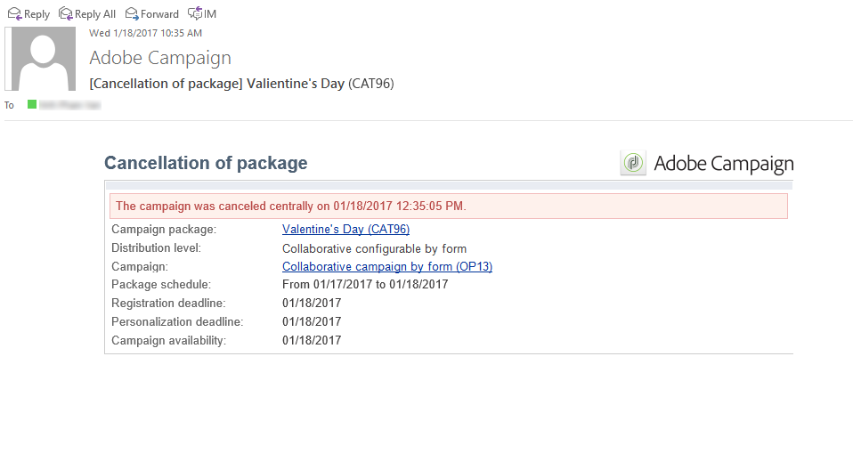

Abgebrochene Pakete können weiterhin von der Zentralstelle aufgerufen und bei Bedarf neu initialisiert werden (siehe unten). Sie werden erst dann wieder den lokalen Entitäten angeboten, wenn sie genehmigt und gestartet wurden. Der Prozess zur Paketneuinitialisierung wird unten angezeigt.

## Zurücksetzen eines Packages {#reinitializing-a-package}

Das Zurücksetzen eines bereits veröffentlichten Kampagnenkits dient dazu, dieses zu bearbeiten und anschließend den Lokalstellen erneut zur Verfügung zu stellen.

1. Öffnen Sie hierzu das entsprechende Kit.
1. Öffnen Sie den Link **[!UICONTROL Kit zurücksetzen, um es erneut zu benutzen...]** und klicken Sie auf **[!UICONTROL OK]**.

   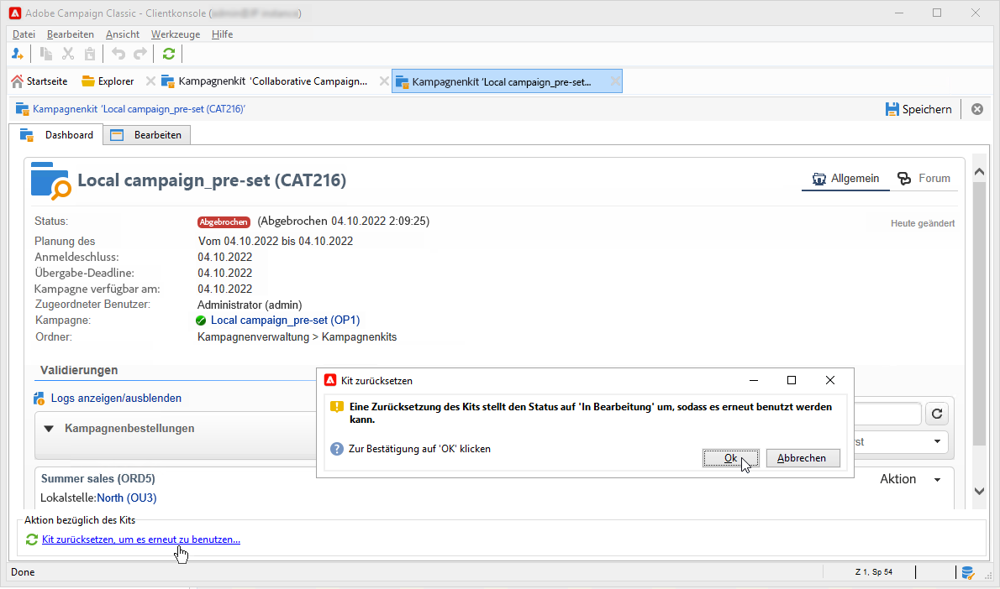

1. Klicken Sie auf die Schaltfläche **[!UICONTROL Speichern]**, um die Zurücksetzung zu bestätigen.

   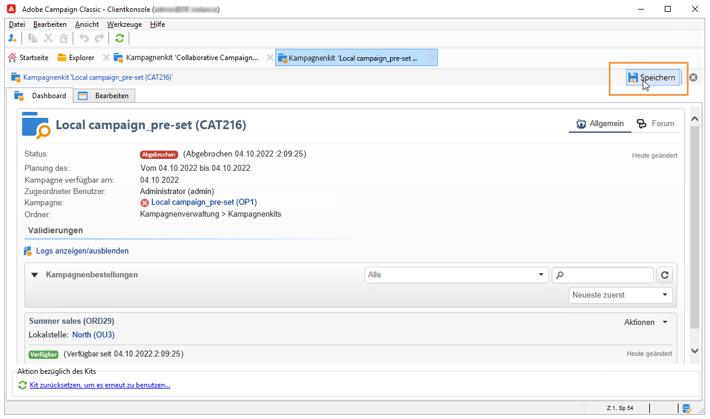

1. Der Paketstatus ändert sich in **[!UICONTROL In Bearbeitung]**. Ändern, genehmigen und erneut veröffentlichen, um sie in der Liste des Kampagnenkits wiederherzustellen.

>[!NOTE]
>
>Sie haben auch die Möglichkeit, ein abgebrochenes Kampagnenkit zurückzusetzen.
