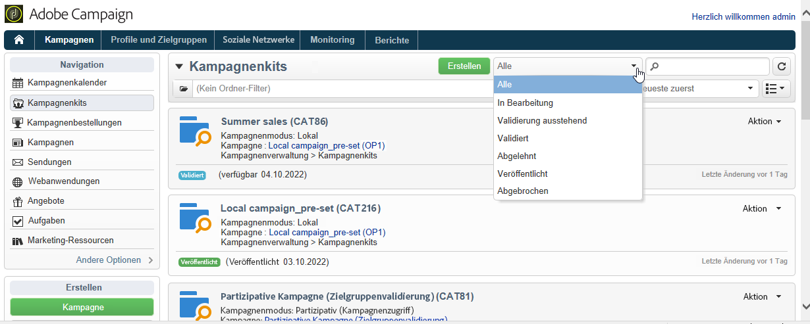
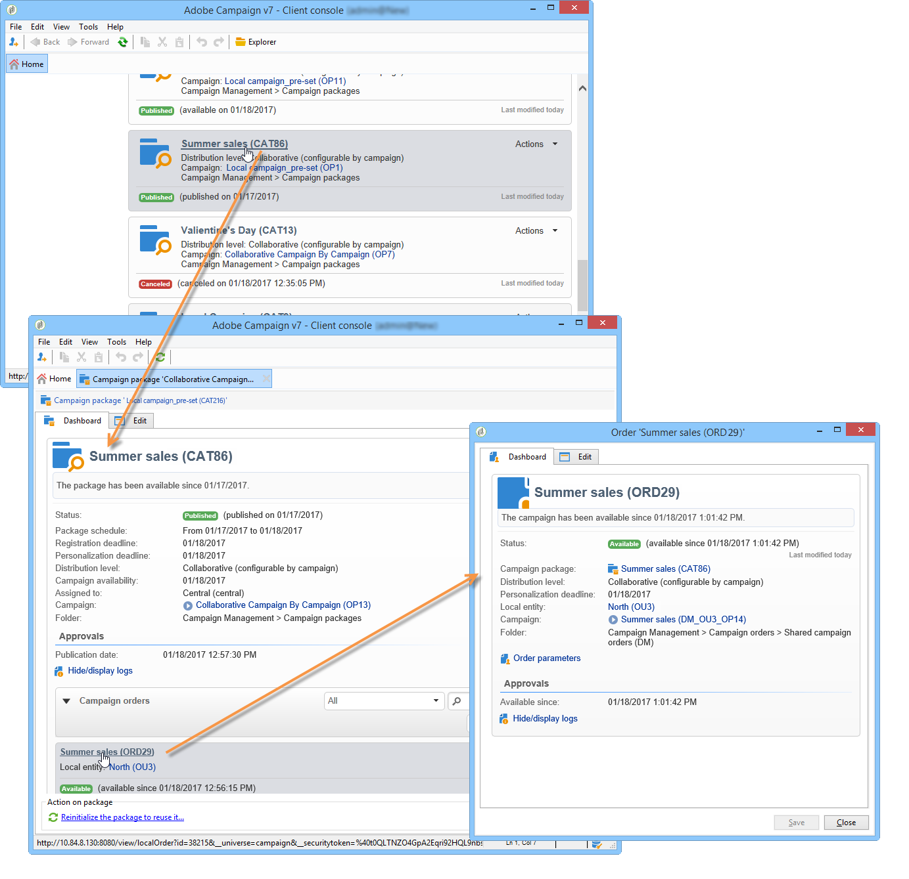
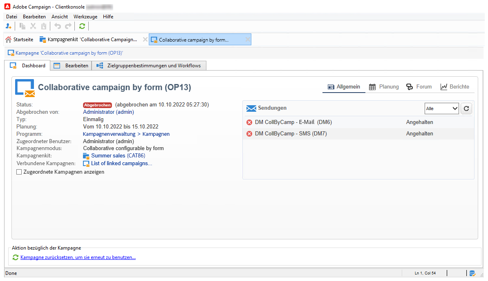
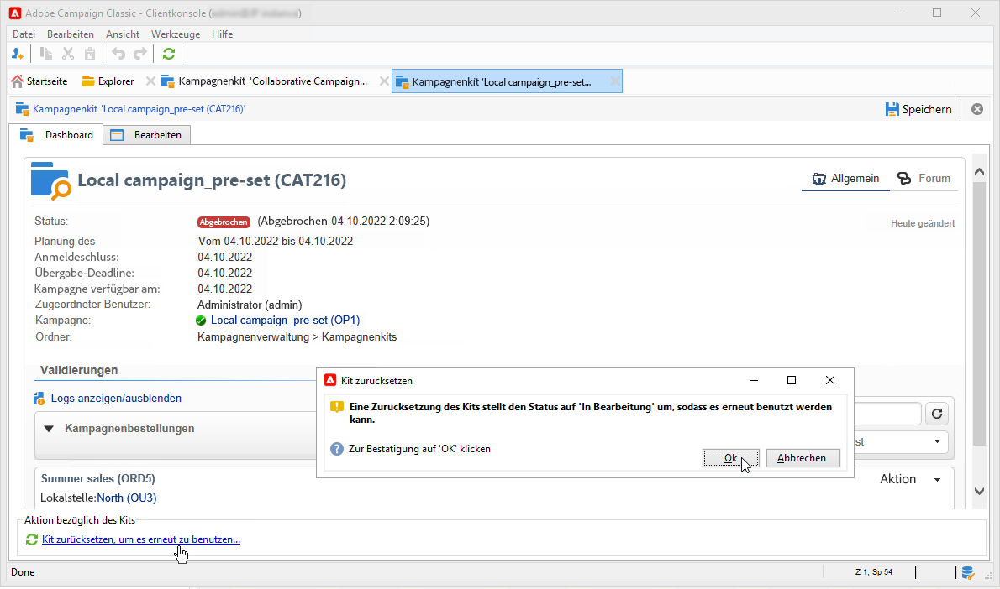
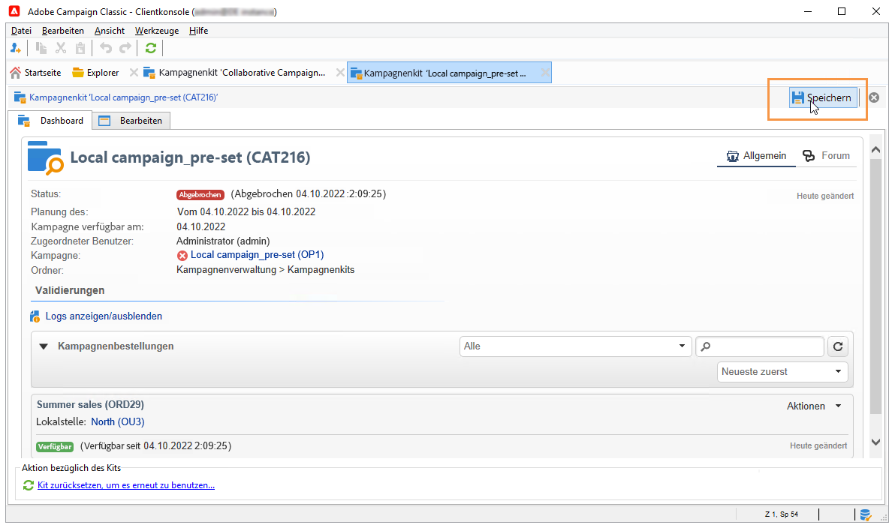

# Nachverfolgen einer Kampagne{#tracking-a-campaign}

Zentrale Benutzer haben die Möglichkeit, die Bestellungen und Evaluierungen der angebotenen Kampagnenkits zu verfolgen.

Folgende Funktionen stehen ihnen hierzu zur Verfügung:

* [Filtern von Kits](#filter-packages),
* [Bearbeiten von Kits](#edit-packages),
* [Abbrechen von Kits](#cancel-a-package),
* [Zurücksetzen eines Packages](#reinitializing-a-package).

## Filtern von Kits {#filter-packages}

Im Tab **[!UICONTROL Kampagnen]** können Sie die Liste der **[!UICONTROL Kampagnenkits]** anzeigen, in der alle vorhandenen dezentralen Marketing-Kampagnen neu gruppiert werden können. Sie können diese Liste so filtern, dass nur Kampagnen angezeigt werden, die entweder veröffentlicht, überfällig, zur Validierung ausstehend usw. sind. Klicken Sie dazu auf die Links im oberen Bereich dieser Ansicht oder verwenden Sie den Link **[!UICONTROL Liste filtern]** und wählen Sie den Kampagnenkit-Status aus, der angezeigt werden soll.

## Bearbeiten von Kits {#edit-packages}

Die Liste der **[!UICONTROL Kampagnenkits]** zeigt eine kurze Zusammenfassung jedes Kits.

Sie enthält folgende Informationen: Titel, Kampagnentyp, Referenzkampagne des Kits sowie sein Speicherordner.

Klicken Sie zum Öffnen des Kits auf seinen Titel. Daraufhin werden die von den Lokalstellen ausgeführten Bestellungen und ihr Status angezeigt.

Diese Informationen werden auch in der Übersicht **[!UICONTROL Kampagnenbestellungen]** angezeigt, die alle erfolgten Bestellungen auflistet.

Zentrale Benutzer verfügen über zwei unterschiedliche Möglichkeiten, eine Bestellung zu bearbeiten:

1. Sie können auf den Titel der Bestellung klicken, um sie zu öffnen. Daraufhin werden Bestelldetails angezeigt.

   

   Über den Tab **[!UICONTROL Bearbeiten > Allgemein]** können die von der Lokalstelle bei der Bestellung erfassten Informationen eingesehen werden.

   

1. Der Benutzer kann auf den Titel des Kits klicken, um ihn zu öffnen und gegebenenfalls bestimmte Parameter zu verändern.

   

## Abbrechen von Kits {#cancel-a-package}

Die Zentralstelle kann ein Kampagnenkit jederzeit abbrechen.

Klicken Sie hierzu auf die Schaltfläche **[!UICONTROL Abbrechen]** im **[!UICONTROL Dashboard]** des Kampagnenkits.

Sie haben die Möglichkeit, den Abbruch im Feld **[!UICONTROL Kommentar]** zu begründen.

Auf Niveau einer **lokalen Kampagne** löscht der Abbruch eines Kits diesen aus der Liste der für die Lokalstellen verfügbaren Kampagnen.

Auf Niveau einer **partizipativen Kampagne** hat der Abbruch eines Kits folgende Auswirkungen:

1. Abbruch aller mit diesem Kit verbundenen Bestellungen;

   

1. Abbruch der Hauptkampagne und Anhalten aller laufenden Vorgänge (Workflows, Sendungen);

   

1. Versand einer Benachrichtigung an alle betroffenen Lokalstellen.

   

Die Zentralstelle kann nach dem Abbruch immer noch auf das Kit zugreifen und es bei Bedarf zurücksetzen. Damit das Kit den Lokalstellen wieder zur Verfügung gestellt werden kann, muss es erneut validiert und gestartet werden. Die Zurücksetzung eines Kampagnenkits wird im Folgenden beschrieben.

## Zurücksetzen eines Packages {#reinitializing-a-package}

Das Zurücksetzen eines Kampagnenkits dient dazu, dieses zu bearbeiten und anschließend den Lokalstellen erneut zur Verfügung zu stellen.

1. Öffnen Sie hierzu das entsprechende Kit.
1. Öffnen Sie den Link **[!UICONTROL Kit zurücksetzen, um es erneut zu benutzen...]** und klicken Sie auf **[!UICONTROL OK]**.

   

1. Klicken Sie auf die Schaltfläche **[!UICONTROL Speichern]**, um die Zurücksetzung zu bestätigen.

   

1. Das Kit erhält den Status **[!UICONTROL In Bearbeitung]**. Es kann nun bearbeitet, validiert und neu in der Kampagnenkit-Liste veröffentlicht werden.

>[!NOTE]
>
>Sie haben auch die Möglichkeit, ein abgebrochenes Kampagnenkit zurückzusetzen.
