# Kosten kontrollieren{#controlling-costs}

Adobe Campaign ermöglicht mit dem MRM-Modul die Kontrolle der geplanten, eingesetzten und berechneten Marketing-Kosten sowie ihre Aufschlüsselung nach Kategorien.

Die für die unterschiedlichen Kampagnenvorgänge anfallenden Kosten werden einem zuvor festgesetzten Budget zugeteilt. Die Beträge können in verschiedene Kategorien verteilt werden, um eine bessere Lesbarkeit und detailliertere Berichte der Marketingkosten zu ermöglichen.

Die Budgetverwaltung und -verfolgung sind in einem dedizierten Knoten des Adobe-Campaign-Navigationsbaums zentralisiert. Von hier aus können Sie alle Budgets sowie die zugeteilten, reservierten, eingesetzten und verbrauchten Beträge kontrollieren.

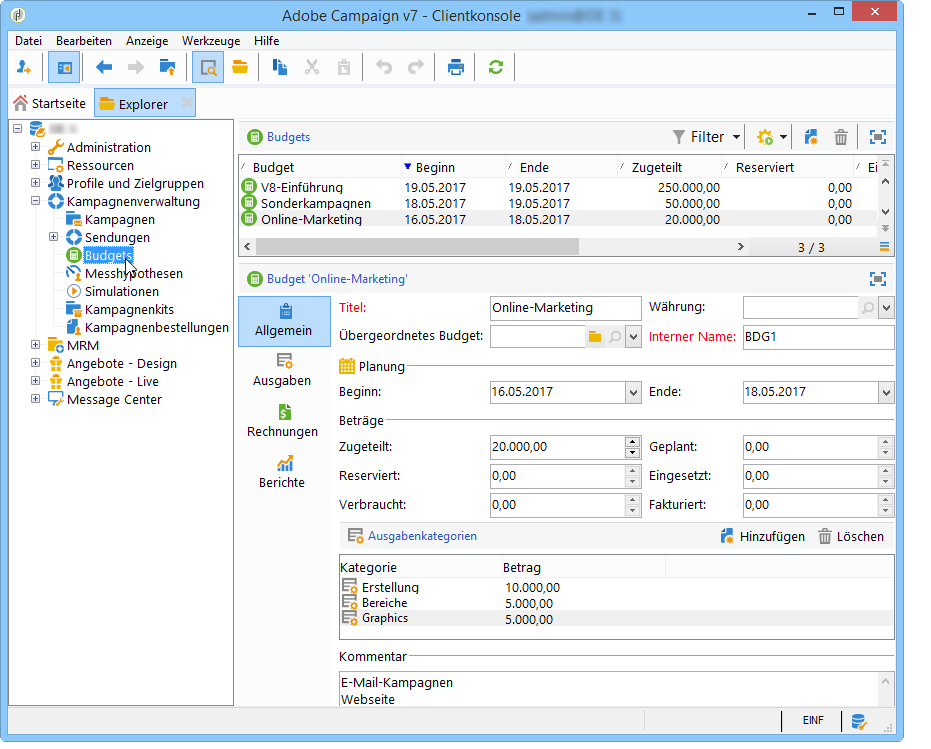

Zur Nutzung der Budget-Verwaltung mit MRM sind folgende Etappen umzusetzen:

1. Definieren Sie das Budget. [Weitere Informationen](#creating-a-budget).

1. Definieren Sie die Kostenberechnungsmethode: Für die Dienstleister werden Kostenstrukturen definiert. [Weitere Informationen](../campaigns/providers--stocks-and-budgets.md).

1. Definieren Sie die Kosten der Kampagne (Sendungen/Aufgaben): Die durch Sendungen und Aufgaben anfallenden Kosten werden einzeln oder pauschal in der Kampagnenvorlage angegeben. [Weitere Informationen](../campaigns/marketing-campaign-deliveries.md#compute-costs-and-stocks).

1. Konsolidieren Sie: Gemäß dem Fortschrittsstatus der Aufgaben, Sendungen und Kampagnen werden die Kosten berechnet und das entsprechende Budget wird damit belastet. Wenn die Erstellung der Kampagne ausreichend fortgeschritten ist, kann der Erfüllungsstatus des Kampagnenbudgets in **[!UICONTROL Angegeben]** geändert werden. Die berechneten Kosten des Programms werden daraufhin automatisch mit den berechneten Kosten der Kampagnen konsolidiert. [Weitere Informationen](#cost-commitment--calculation-and-charging).

## Erstellen eines Budgets {#creating-a-budget}

Gehen Sie wie folgt vor, um ein Budget zu erstellen:

1. Navigieren Sie zum Knoten **[!UICONTROL Kampagnen-Management > Budgets]** des Campaign-Explorers.
1. Klicken Sie auf das Symbol **[!UICONTROL Neu]**, benennen und speichern Sie das Budget.
1. Anfangsbetrag eingeben: geben Sie im entsprechenden Feld den zugewiesenen Betrag an. Die anderen Beträge werden automatisch angegeben. [Weitere Informationen](#calculating-amounts).
1. Definieren Sie den Gültigkeitszeitraum durch Eingabe des Start- und Enddatums. Diese Informationen sind lediglich als Hinweis zu verstehen.
1. Erstellen Sie die Ausgabenkategorien, denen die für Kampagnen, Sendungen, Aufgaben usw. anfallenden Kosten in diesem Budget zugeordnet werden können. [Weitere Informationen](#expense-categories).

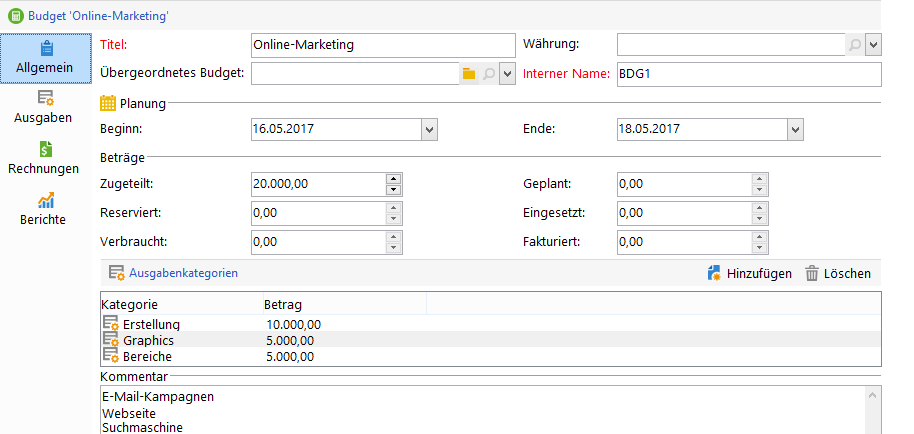

>[!NOTE]
>
>Sie können ein übergeordnetes Budget auswählen. Weiterführende Informationen hierzu finden Sie in [diesem Abschnitt](#linking-a-budget-to-another).

### Beträge berechnen {#calculating-amounts}

Der Anfangsbestand eines Budgets verringert sich im Zuge der ihm zugeordneten Kampagnen, Sendungen oder Aufgaben um die anfallenden Kosten, sobald diese geplant oder realisiert wurden. Der Status der Beträge (Geplant, Reserviert, Eingesetzt, Verbraucht, Fakturiert) hängt vom Kostentyp und dem Verbindlichkeitsniveau ab, die in der Kamapgne, der Sendung oder der Aufgabe festgelegt wurden.

>[!NOTE]
>
>Die in den Kategorien eingetragenen Beträge müssen dem im Feld **[!UICONTROL Zugeteilt]** angegebenen Gesamtbudget entsprechen.

In Kampagnen können je nach Verbindlichkeitsniveau Kosten für eine zukünftige Aktion geplant, eingesetzt oder reserviert werden.

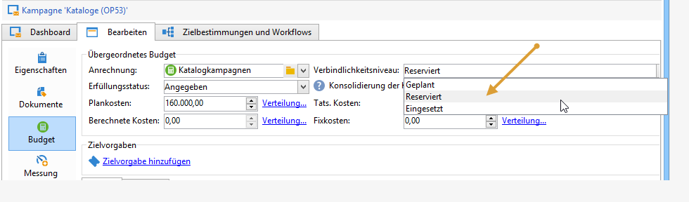

>[!CAUTION]
>
>Bei der Erstellung einer Kampagne muss im **[!UICONTROL Budget]**-Tab der Erfüllungsstatus **[!UICONTROL Angegeben]** sein, damit die Kosten bei der Ausführung berücksichtigt werden. Wenn der Status **[!UICONTROL In Bearbeitung]** ist, werden die Kosten nicht konsolidiert.
>   
>Die Option **[!UICONTROL Verbindlichkeitsniveau]** stellt eine Schätzung der zukünftigen Kosten dar, bevor diese dem Budget angerechnet werden. Entsprechend dem Fortschritt einer Kampagne, einer Aufgabe oder eines Versands kann mithilfe der Dropdown-Liste ein höheres oder niedrigeres Niveau zugewiesen werden (1. Geplant, 2. Reserviert, 3. Eingesetzt).

Beispiel: Die Kosten einer Web-Kampagne werden auf 45 000 Euro geschätzt.

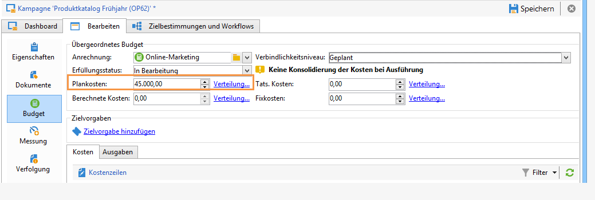

Wenn der Erfüllungsstatus des Budgets in der Kampagne **[!UICONTROL Angegeben]** ist, werden die tatsächlichen Kosten der Kampagne (oder, wenn nicht angegeben, die berechneten Kosten) in die Budgetbeträge übertragen.

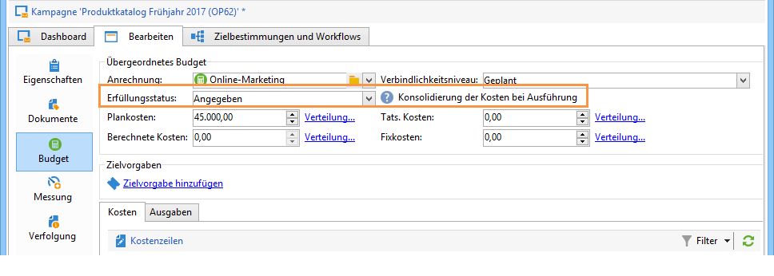

Je nach Verbindlichkeitsniveau der Kampagne wird der Betrag in das Feld **[!UICONTROL Geplant]**, **[!UICONTROL Reserviert]** oder **[!UICONTROL Eingesetzt]** übertragen.

Das Verbindlichkeitsniveau kann geändert werden:

* in einer **Kampagne** im Fenster **[!UICONTROL Budget]** des **[!UICONTROL Bearbeiten]**-Tabs. Hier werden insbesondere Budgets, Kosten und Ausgaben konfiguriert.
* in einer **Aufgabe** im Fenster **[!UICONTROL Ausgaben und Einnahmen]**.

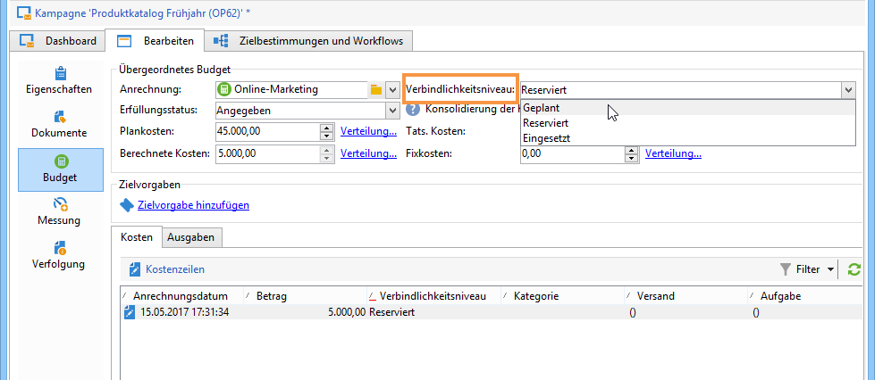

Sobald ein Budget **[!UICONTROL Reserviert]** ist, wird automatisch das zugeteilte Budget aktualisiert.

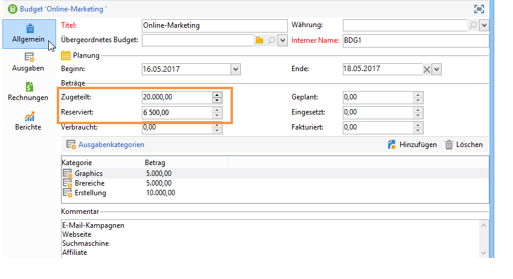

Der Ablauf entspricht dem der Aufgaben:

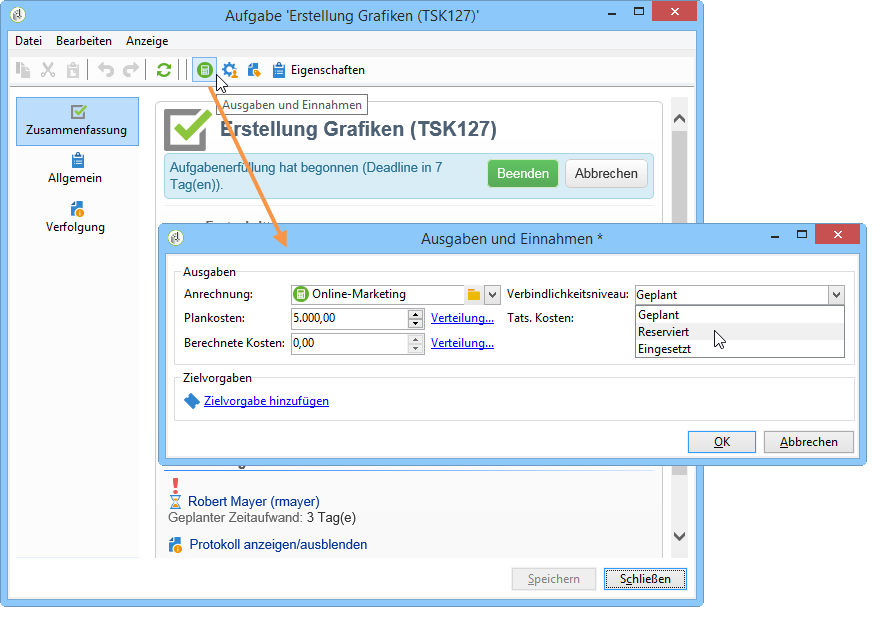

Wenn eine Ausgabe in Rechnung gestellt und diese Rechnung beglichen wird, wird der jeweilige Betrag im Feld **[!UICONTROL Fakturiert]** eintragen.

### Ausgabenkategorien {#expense-categories}

Kostenbeträge können in verschiedene Ausgabenkategorien verteilt werden, um eine bessere Lesbarkeit und detaillierte Berichte über Marketingkosten zu erhalten. Ausgabenkategorien werden bei der Budgeterstellung über den Knoten **[!UICONTROL Budgets]** des Navigationsbaums bestimmt.

Klicken Sie auf die Schaltfläche **[!UICONTROL Hinzufügen]** im unteren Abschnitt des Fensters, um eine Kategorie hinzuzufügen.

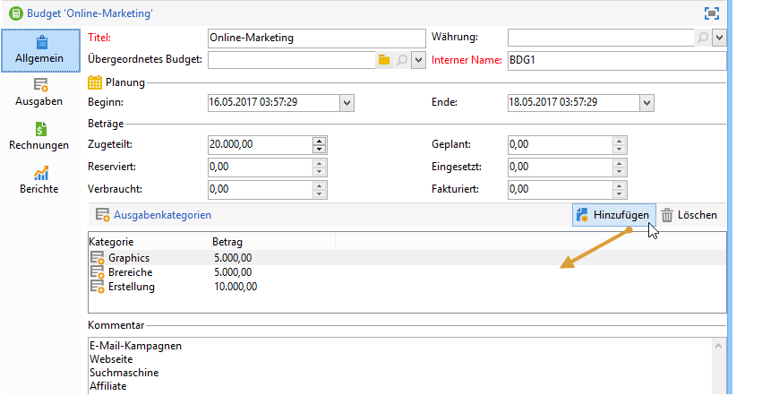

Sie können eine der existierenden Kategorien auswählen oder eine neue definieren, indem Sie sie direkt in das Feld eingeben. Bei der Bestätigung Ihrer Eingabe wird Ihnen ermöglicht, die Kategorie der Liste der existierenden Kategorien hinzuzufügen und sie bei Bedarf einer Art zuzuordnen. Diese Informationen werden in den Budgetberichten ausgewertet.

### Zuordnung von Budgets untereinander {#linking-a-budget-to-another}

Sie können ein Budget einem Hauptbudget zuordnen. Wählen Sie dieses im Feld **[!UICONTROL Übergeordnetes Budget]** der untergeordneten Budgets aus.

Dem Hauptbudget wird daraufhin ein Tab zur Auflistung der untergeordneten Budgets hinzugefügt.

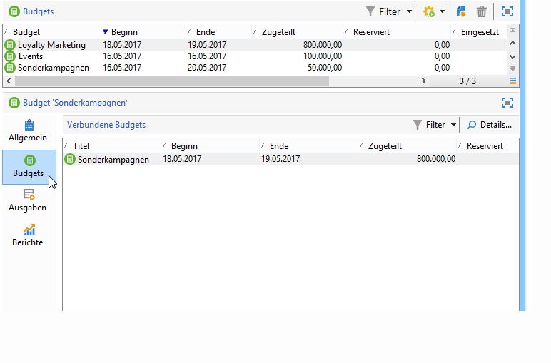

Diese Informationen werden in den Budgetberichten ausgewertet.

## Ausgabenzeilen hinzufügen {#adding-expense-lines}

Ausgabezeilen werden dem Budget automatisch hinzugefügt. Sie werden bei der Versandanalyse und beim Abschluss einer Aufgabe erstellt.

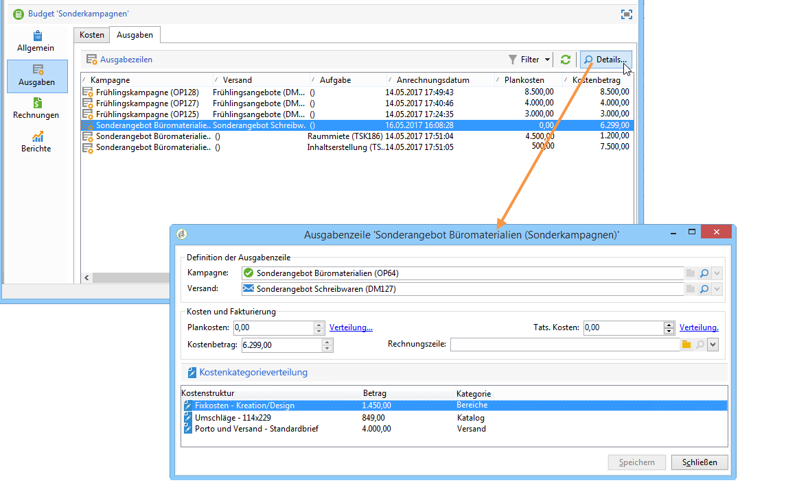

Die für Kampagnen, Sendungen oder Aufgaben anfallenden Kosten werden in den Ausgabenzeilen des Budgets, dem sie zugeteilt sind, zusammengefasst. Diese Ausgabenzeilen werden abhängig von den Kostenkategorien des beteiligten Dienstleisters erstellt und ausgehend von den verbundenen Kostenstrukturen berechnet.

Damit enthält jede Ausgabenzeile folgende Informationen:

* die Kampagne und Sendung oder Aufgabe, der sie zugeordnet ist;
* den ausgehend von den Kostenstrukturen oder den Plankosten berechneten Betrag;
* die tatsächlichen Kosten der Sendung oder der betreffenden Aufgabe;
* die entsprechende Rechnungszeile (ausschließlich in MRM);
* die Liste der berechneten Kosten je Kostenkategorie (wenn eine Kostenstruktur existiert).

Im unten stehenden Beispiel entspricht die bearbeitete Ausgabenzeile den für den Versand **Sonderangebot Schreibwaren** der Kampagne **Sonderangebot Büromaterialien** berechneten Kosten. Wenn der Versand geöffnet wird, kann im **[!UICONTROL Briefpost]**-Tab der Berechnungsmodus der Ausgabenzeile eingesehen werden.

Als Grundlage der Kostenberechnung für diesen Versand dienen die für den betroffenen Dienstleister ausgewählten Kostenkategorien.

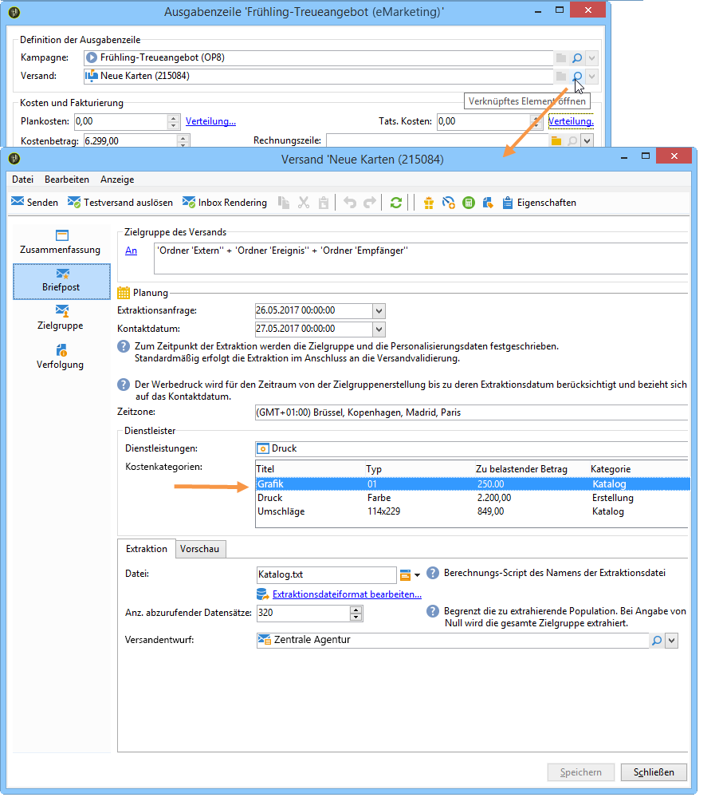

Abhängig von diesen Kostenkategorien werden die entsprechenden Kostenstrukturen zur Berechnung der Ausgabenzeilen angewandt. Im vorliegenden Beispiel handelt es sich um folgenden Kostenstrukturen für den betroffenen Dienstleister:

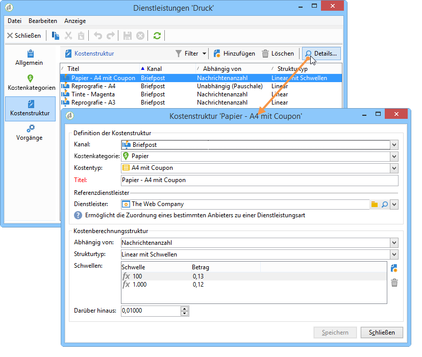

>[!NOTE]
>
>Die Kostenstellen und -strukturen werden auf [dieser Seite](../campaigns/providers--stocks-and-budgets.md#create-a-service-provider-and-its-cost-categories) dargestellt.

## Entstehung, Berechnung und Anrechnung von Kosten {#cost-commitment--calculation-and-charging}

Kosten können in Sendungen und Aufgaben entstehen. Abhängig vom Bearbeitungsfortschritt des jeweiligen Vorgangs wird der Kostenstatus aktualisiert.

### Kostenarten {#cost-calculation-process}

Kosten werden in drei Kategorien eingeteilt:

1. Plankosten

   Die Plankosten entsprechen der Kostenschätzung für Kampagnenvorgänge. Solange sich das Budget in Bearbeitung befindet, werden die erfassten Beträge nicht konsolidert. Erst wenn der Status auf **[!UICONTROL Angegeben]** gesetzt wird, werden die erfassten Beträge in den Berechnungen berücksichtigt.

   Der Betrag wird manuell eingegeben und kann über unterschiedliche Ausgabenkategorien verteilt werden. Um einen Kostenbetrag zu verteilen, klicken Sie auf den Link **[!UICONTROL Verteilung...]** und anschließend auf die Schaltfläche **[!UICONTROL Hinzufügen]**, um einen neuen Betrag zu bestimmen.

   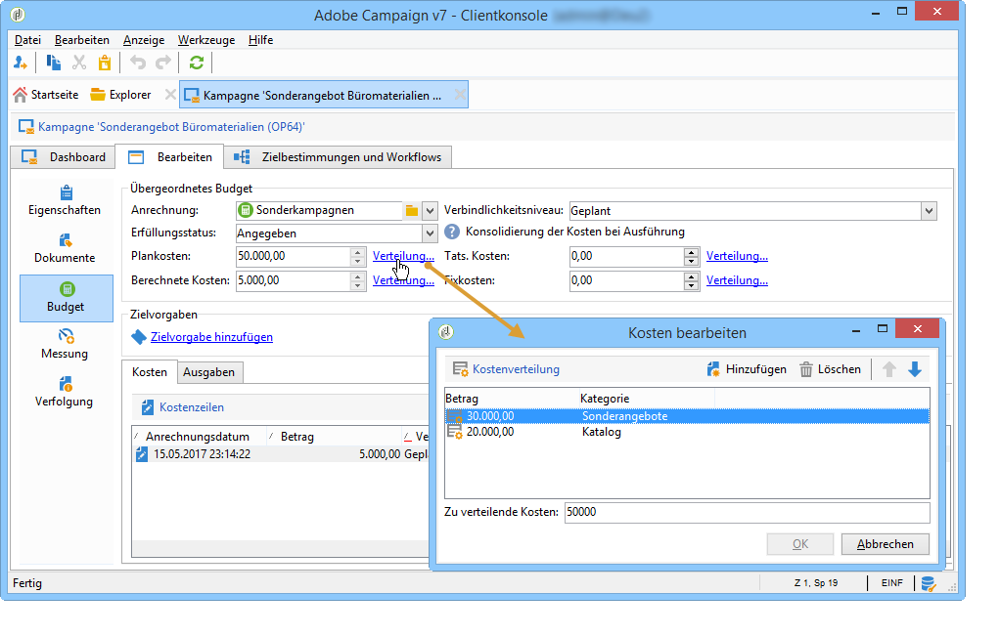

   Jeder Kostenbetrag kann einer Kategorie zugeordnet werden. Dies ermöglicht eine Übersicht der Kostenverteilung nach Ausgabenkategorien im übergeordneten Budget sowie in den Budgetberichten.

1. Berechnete Kosten

   Die berechneten Kosten hängen vom betroffenen Element (Kampagne, Versand, Aufgabe etc.) und seinem Status ab (In Bearbeitung, In Gang, Abgeschlossen). Sobald die tatsächlichen Kosten angegeben sind, wird dieser Betrag grundsätzlich von den berechneten Kosten übernommen.

   Wenn die tatsächlichen Kosten nicht angegeben sind, gelten folgende Regeln:

   * In einer sich in Bearbeitung befindenden Kampagne entsprechen die berechneten Kosten dem Betrag der Plankosten der Kampagne. Wenn diese nicht global für die Kampagne angegeben wurden, setzen sich die berechneten Kosten aus der Summe der Plankosten der einzelnen Sendungen und Aufgaben der Kampagne zusammen. Nach Abschluss der Kampagne entsprechen die berechneten Kampagnenkosten der Summe aller berechneten Kosten.
   * In einem noch nicht analysierten Versand entsprechen die berechneten Kosten dem Betrag der Plankosten. Wenn die Analyse bereits stattgefunden hat, setzen sich die berechneten Kosten aus den basierend auf den Kostenstrukturen des Dienstleisters und der Anzahl der ausgewählten Empfänger berechneten Beträgen zusammen.
   * In einer gestarteten Aufgabe werden die Plankosten als berechnete Kosten verwendet. Nach Abschluss der Aufgabe entsprechen die berechneten Kosten der Summe aller basierend auf den Kostenstrukturen des Dienstleisters und - falls zutreffend - der Anzahl an insgesamt benötigten Tagen berechneten Kosten.
   * Sowohl für Marketingpläne als auch für Programme entsprechen die berechneten Kosten der Summe der für die verknüpften Kampagnen berechneten Kosten. Wenn diese nicht angegeben sind, werden die Plankosten anstelle der berechneten Kosten verwendet.

   >[!NOTE]
   >
   >Über den **[!UICONTROL Verteilung]**-Link der berechneten Kosten können Details der Berechnung sowie das Datum der letzten Kostenberechnung eingesehen werden.

1. Tatsächliche Kosten

   Tats. Kosten werden manuell erfasst und bei Bedarf zwischen unterschiedlichen Ausgabenkategorien verteilt.

### Anrechnung auf Budgets {#calculation-and-charging}

Kosten werden mithilfe der Kostenstrukturen berechnet und auf die in den betroffenen Kampagnen, Sendungen oder Aufgaben ausgewählten Budgets angerechnet.

Über die Budget-Validierung können die in Kampagnen anfallenden Beträge geprüft werden. Zusätzlich ist die Erstellung von Kontrollaufgaben ein weiteres Mittel, um einzelne Bereiche einer Kampagne zur Validierung zu unterbreiten. Siehe [Aufgabenarten](creating-and-managing-tasks.md#types-of-task).

### Beispiel {#example}

Im Folgenden wird eine Kampagne mit folgenden Elementen erstellt:

* Briefpost-Versand mit Kostenstrukturen eines Dienstleisters
* Aufgabe mit Fixkosten
* Aufgabe mit Tageskosten

#### Schritt 1: Budget erstellen {#step-1---creating-the-budget}

1. Erstellen Sie ein neues Budget über den Knoten **[!UICONTROL Kampagnenverwaltung > Budgets]**.

1. Bestimmen Sie ein Gesamtbudget von 10.000 Euro im Feld **[!UICONTROL Zugeteilt]** des Abschnitts **[!UICONTROL Beträge]**. Fügen Sie drei Ausgabenkategorien im unteren Abschnitt des Fensters hinzu:

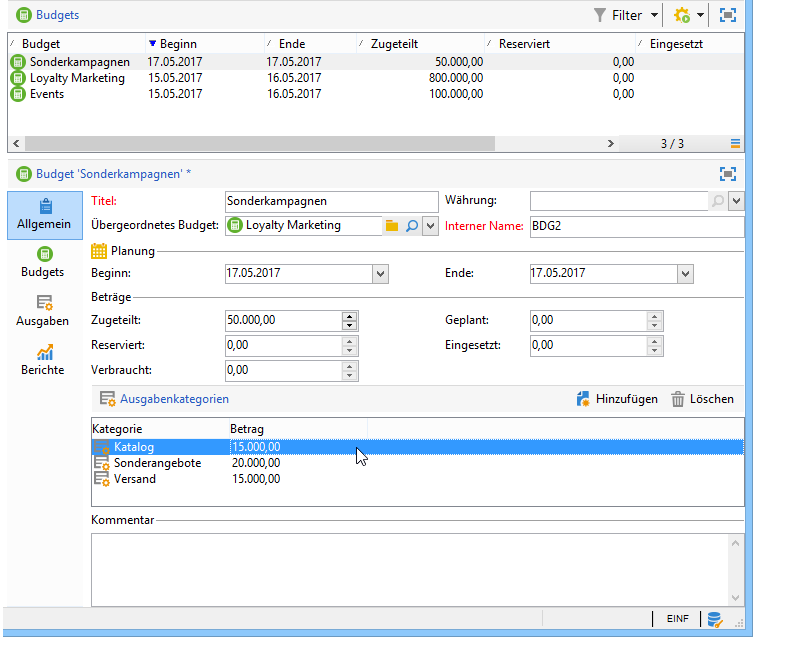

#### Schritt 2: Dienstleister konfigurieren und Kostenstrukturen festlegen {#step-2---configuring-the-service-provider-and-defining-the-cost-structures}

1. Erstellen Sie einen Dienstleister sowie eine Dienstleistungsvorlage mit Kostenstruktur über den Knoten **[!UICONTROL Administration > Kampagnen > Dienstleister]**. Weiterführende Informationen hierzu finden Sie in [diesem Abschnitt](../campaigns/providers--stocks-and-budgets.md#create-a-service-provider-and-its-cost-categories).

   Erstellen Sie für die Briefpost-Sendungen **[!UICONTROL Briefumschläge]**-Kostenkategorien (Typen 114x229 und 162x229), **[!UICONTROL Porto und Versand]** und **[!UICONTROL Farbdruck]** (Typen A3 und A4). Erstellen Sie dann die folgenden Kostenstrukturen:

   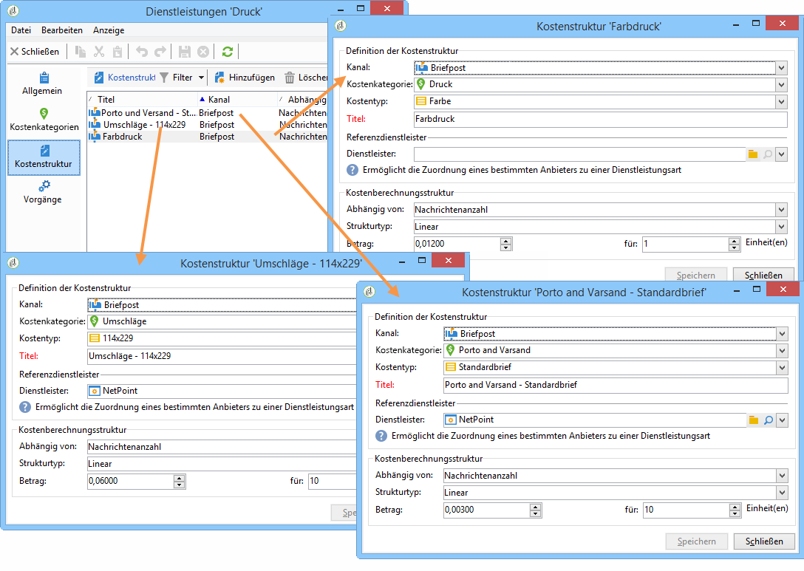

1. Fügen Sie in den Kostenkategorien Fixkosten vom Typ &quot;Festpreis&quot; hinzu, deren Betrag in der entsprechenden Kostenstruktur leer ist. (Dieser wird einzeln für jeden Versand angegeben.)

   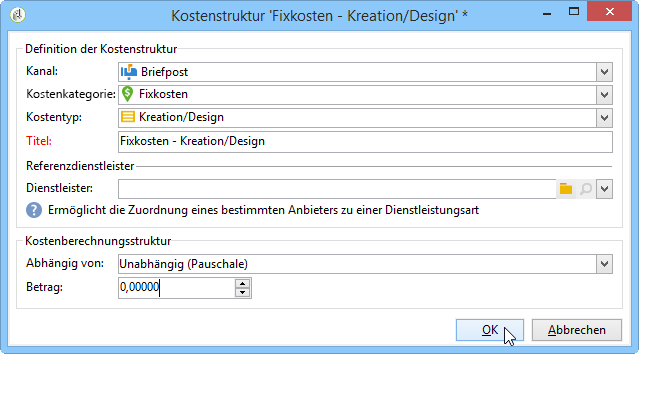

   Erstellen Sie für die Aufgaben die folgenden zwei Kostenkategorien:

   * **[!UICONTROL Raumreservierung]** (Typen Kleiner Saal und Großer Saal) mit einer **Pauschale** von 300 und 500 Euro.

   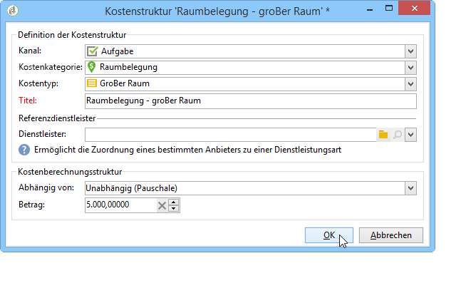

   * **[!UICONTROL Erstellung]** (Typ **Inhaltsvorlage**) mit von der **Dauer in Tagen** abhängigen Kosten in Höhe von 300 Euro:

   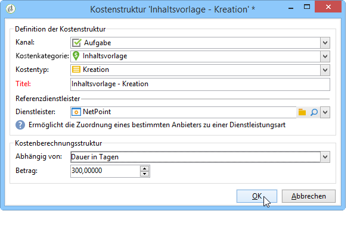

#### Schritt 3: Anfallende Kosten auf das Kampagnenbudget anrechnen {#step-3---charging-the-budget-in-the-campaign}

1. Erstellen Sie eine Kampagne und wählen Sie das im 1. Schritt erstellte Budget aus.

   >[!NOTE]
   >
   >Das im Programm ausgewählte Budget wird standardmäßig für alle Kampagnen des Programms angewandt.

   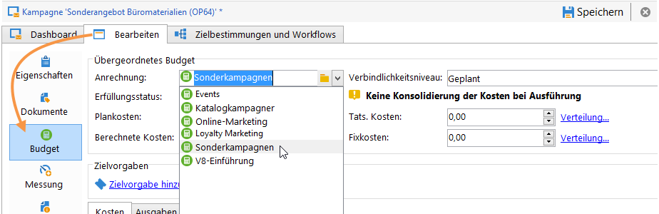

1. Geben Sie die Plankosten mit Verteilung an:

   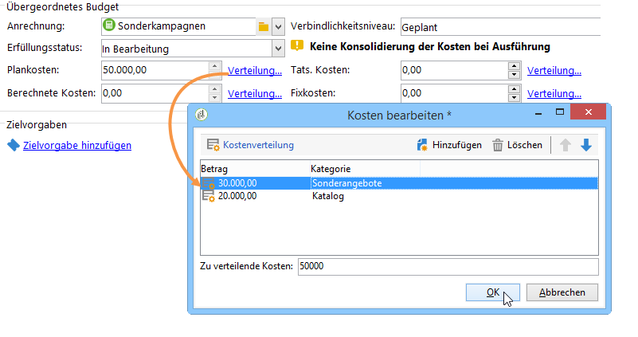

1. Klicken Sie zur Speicherung dieser Daten auf **[!UICONTROL OK]** und dann auf **[!UICONTROL Speichern]**. Die berechneten Kosten der Kampagne werden daraufhin mit den Plankosten aktualisiert.

#### Schritt 4: Briefpost-Versand erstellen {#step-4---creating-the-direct-mail-delivery}

1. Erstellen einen Kampagnen-Workflow mit einer Abfrage zur Zielgruppenbestimmung. Stellen Sie sicher, dass die Postadresse der ausgewählten Empfänger angegeben ist.

1. Erstellen Sie nun einen Briefpost-Versand und wählen Sie den im zweiten Schritt erstellten Dienstleister aus: Die Kostenkategorien werden automatisch angezeigt.

1. Überschreiben Sie die Kosten der Briefumschläge und fügen Sie Fixkosten hinzu. Wählen Sie zudem die von diesen Kosten betroffenen Kategorien aus.

   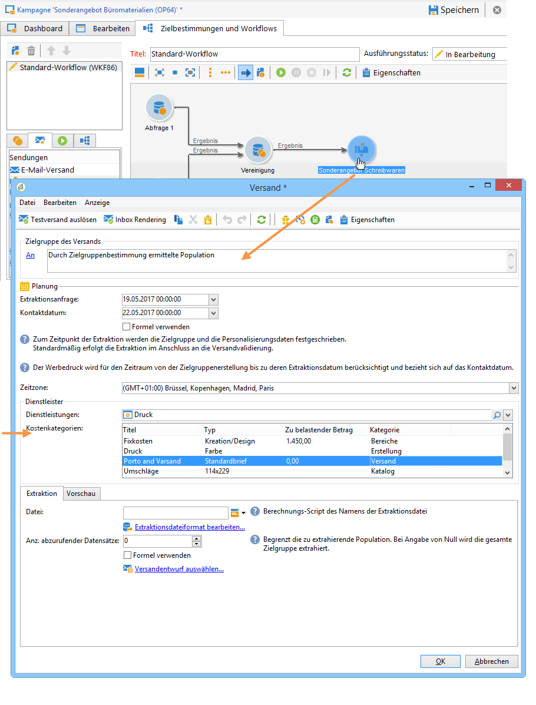

   >[!NOTE]
   >
   >Wenn eine der Kostenkategorien nicht verwendet wird, fallen durch diese keinerlei Ausgaben an.

1. Starten Sie den gerade erstellten Workflow, um die Analyse zu beginnen und die Kosten zu berechnen.

   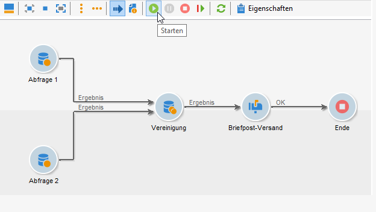

1. Wenn die Budgetvalidierung für diese Kampagne aktiviert wurde, validieren Sie das Budget über das Dashboard. Sie können an dieser Stelle auch die Validierung der Kostenkategorien überprüfen.

   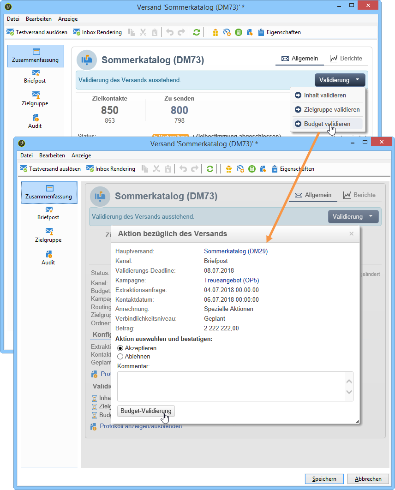

Die den Versand betreffende Ausgabenzeile wird im Tab **[!UICONTROL Bearbeiten > Budget]** der Kampagne hinzugefügt. Klicken Sie auf Details..., um genauere Informationen zu erhalten.

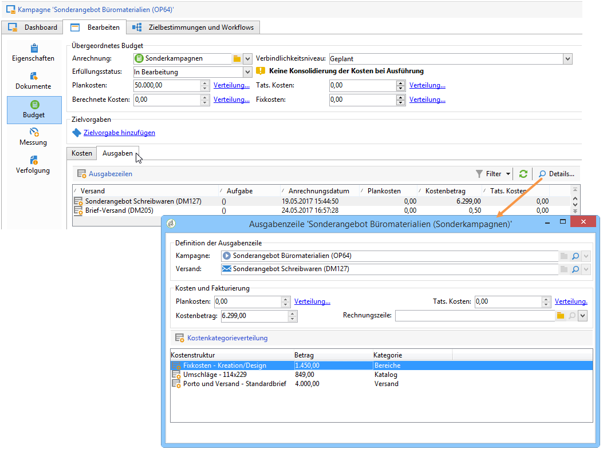

Auf Versandniveau werden die berechneten Kosten mit folgenden Daten aktualisiert:

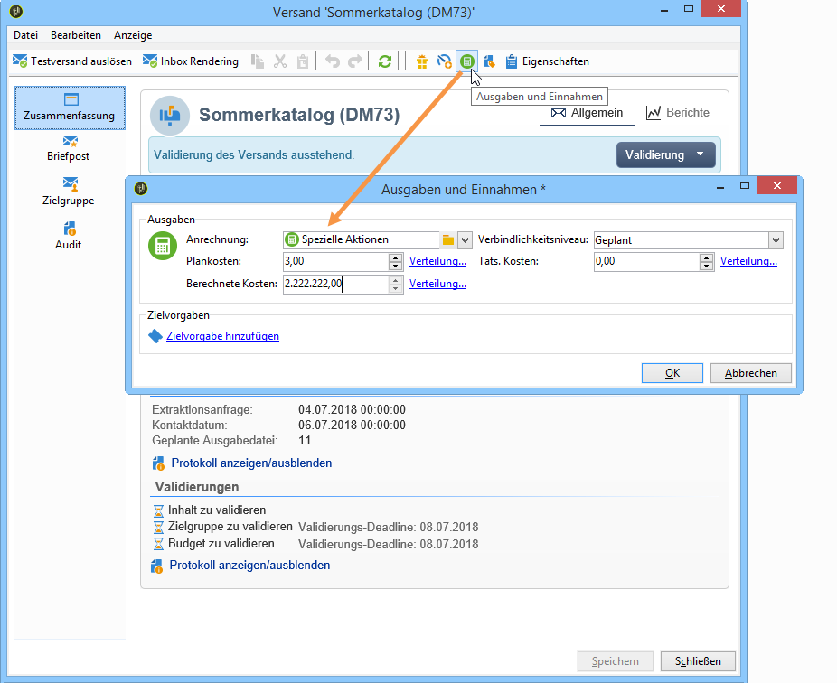

Beim Bearbeiten der berechneten Kosten können Sie die Kostenverteilung sowie Status und Datum der Kostenberechnung überprüfen.

#### Schritt 5: Aufgaben erstellen {#step-5---creating-tasks}

Zu dieser Kampagne fügen wir die beiden Aufgaben hinzu, für die die Kostenstrukturen [früher erstellt](#step-2---configuring-the-service-provider-and-defining-the-cost-structures) wurden.

Klicken Sie dazu im Kampagnen-Dashboard auf die Schaltfläche **[!UICONTROL Aufgabe hinzufügen]**. Benennen Sie die Aufgabe und klicken Sie auf **[!UICONTROL Speichern]**.

1. Konfigurieren Sie sie wie folgt:

1. Klicken Sie auf **[!UICONTROL Eigenschaften]**, um die Dienstleistung sowie die entsprechende Kostenkategorie auszuwählen:

   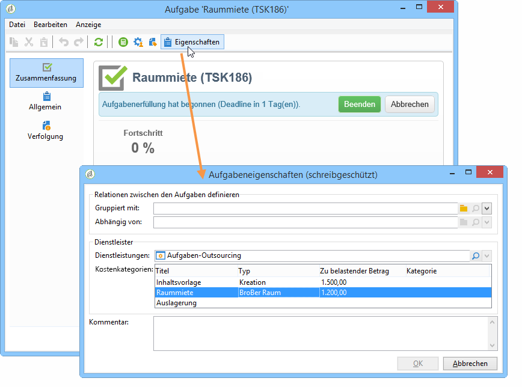

1. Öffnen Sie anschließend die **[!UICONTROL Ausgaben und Einnahmen]** der Aufgabe und geben Sie ihre Plankosten an.

   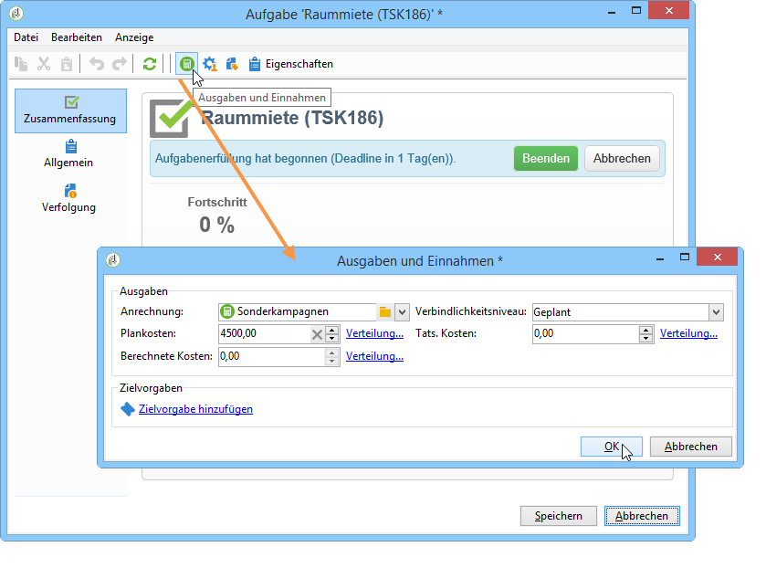

   Mit Speicherung der Aufgabe übernehmen die berechneten Kosten den für die Plankosten angegebenen Wert.

   Nach Beendung der Aufgabe (Status **[!UICONTROL Abgeschlossen]**) werden die berechneten Kosten automatisch mit den Kosten des Großen Saals aktualisiert (entsprechend der Angabe in seiner Kostenstruktur). Diese Kosten werden ebenfalls der Kategorie zugeordnet.

1. Erstellen Sie auf die gleiche Weise eine zweite Aufgabe mit einer Planung über fünf Tage und verbinden Sie sie mit der zuvor erstellen Kostenstruktur.

   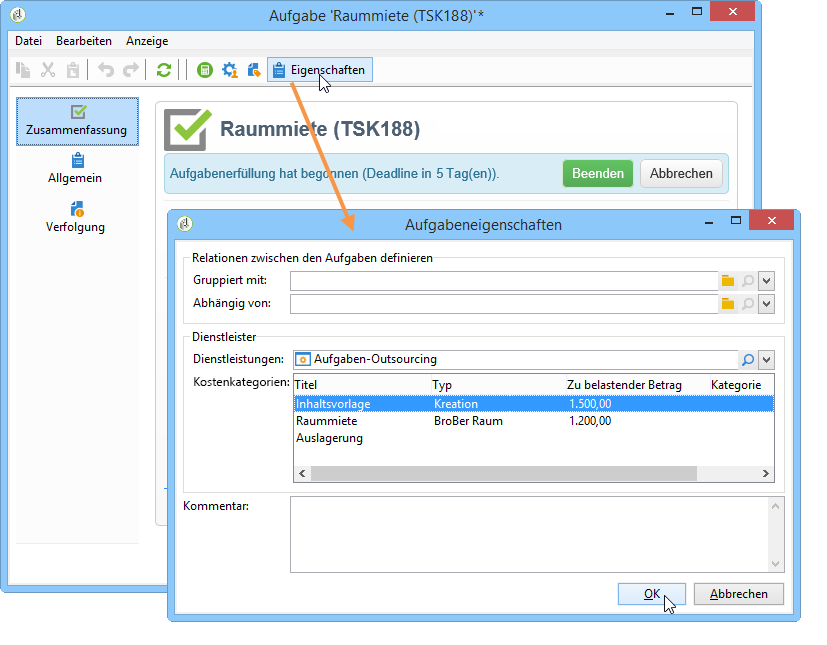

   Nach Abschluss der Aufgabe übernehmen die berechneten Kosten den aus der Kostenstruktur stammenden Wert, in unserem Beispiel also 1500 Euro (5 Tage x 300 Euro).

   

#### Schritt 6: Status des Kampagnenbudgets aktualisieren {#step-6---update-the-campaign-budget-status}

Der Status eines konfigurierten Budgets kann aktualisiert werden: Setzen Sie hierzu den Status auf **[!UICONTROL Angegeben]**. Im Feld der berechneten Kosten der Kampagne wird daraufhin die Summe der für den Versand und die Aufgaben der Kampagne berechneten Kosten angezeigt.

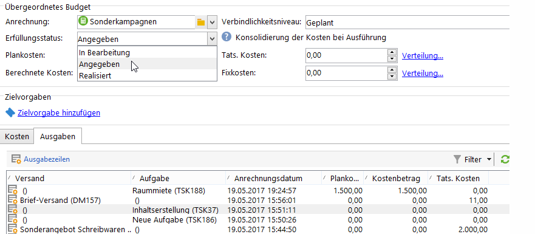

#### Validierung von Budgets {#budget-approval}

Bei aktivierter Validierung kann das Budget über einen speziellen Link im Kampagnen-Dashboard validiert werden. Der Link wird angezeigt, sobald der Zielgruppenbestimmungs-Workflow gestartet wurde und ein Direkt-Mail-Versand validiert werden muss.

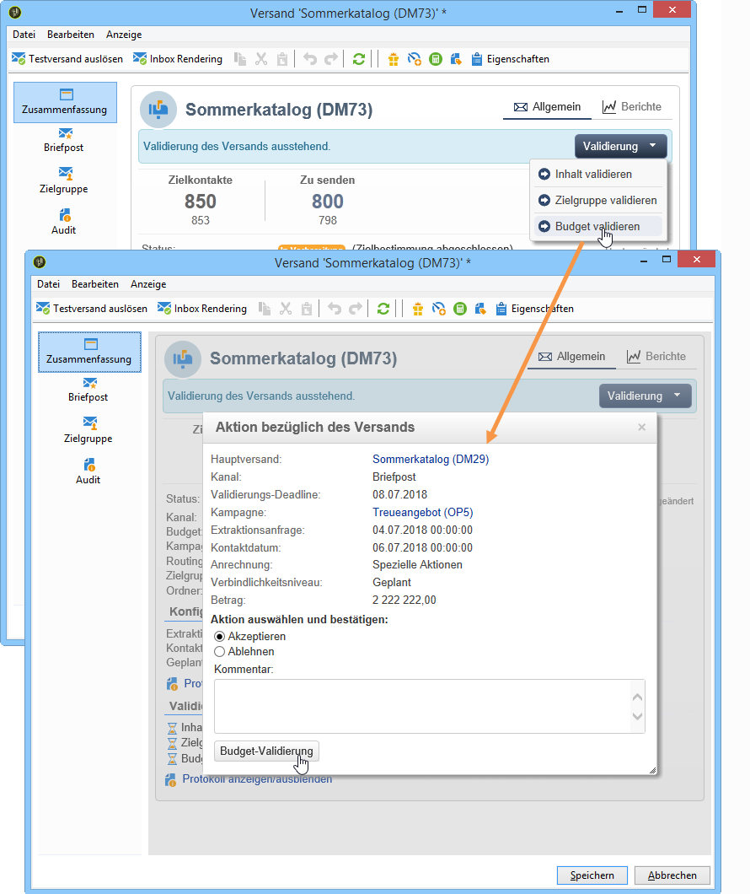

Sie können dann die Validierung über diesen Link akzeptieren oder ablehnen. Wenn Benachrichtigungen für die Kampagne aktiviert wurden, können Sie den Link auch in der Benachrichtigungs-E-Mail verwenden.

Nach Budgetvalidierung und Abschluss des Versands werden die Kosten automatisch über einen speziellen technischen Workflow weiter verarbeitet.

## Lagerergänzungen und Rechnungen {#orders-and-invoices}

Im Kontext von MRM können Sie bei Dienstleistern aufgebebene Bestellungen und zugehörige Rechnungen erfassen. Der gesamte Kreislauf von Bestellungen, Wareneingängen und Rechnungen kann über Adobe Campaign verwaltet werden.

### Lagerergänzungen {#order-creation}

Um eine Lagerergänzung zu erfassen, gehen Sie zum Knoten **[!UICONTROL MRM > Lagerergänzungen]** des Navigationsbaums und klicken Sie auf die Schaltfläche **[!UICONTROL Neu]**.

Geben Sie die Nummer der Lagerergänzung, den entsprechenden Dienstleister sowie die Gesamtkosten für die Lagerergänzung an.

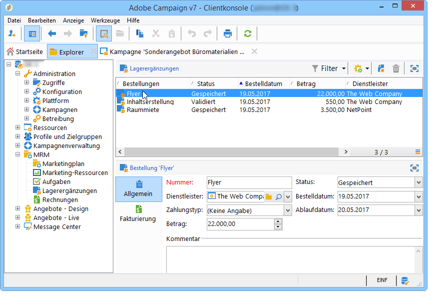

### Rechnungen erstellen und verfolgen {#issuing-and-tracking-invoices}

Sie können für jeden Dienstleister Rechnungen speichern und ihren Status sowie das betroffene Budget angeben.

Rechnungen werden im Knoten **[!UICONTROL MRM > Rechnungen]** des Adobe-Campaign-Navigationsbaums erstellt.

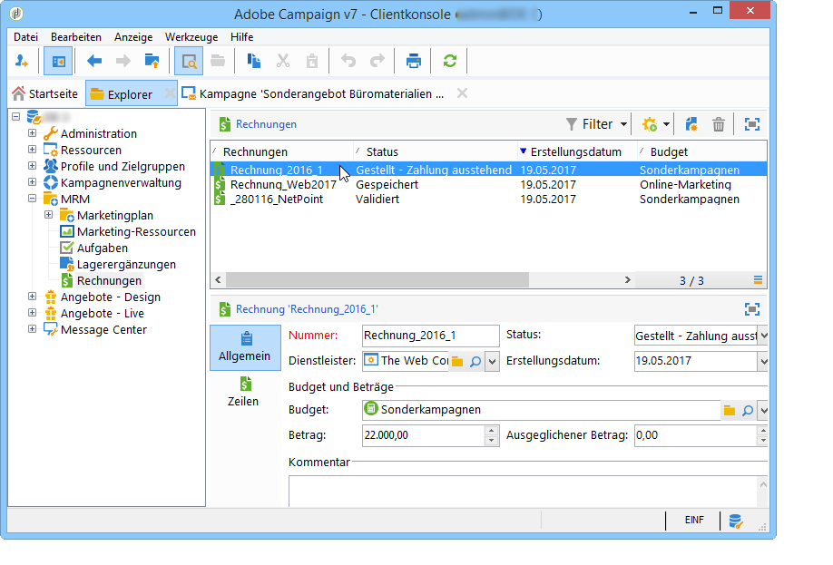

Eine Rechnung besteht aus Rechnungszeilen, deren Summe automatisch den Rechnungsbetrag ergibt. Sie werden manuell im **[!UICONTROL Rechnungszeilen]**-Tab erstellt. Sie können mit einer Lagerergänzung verknüpft werden, um eine automatische Informationsweiterleitung zu ermöglichen.

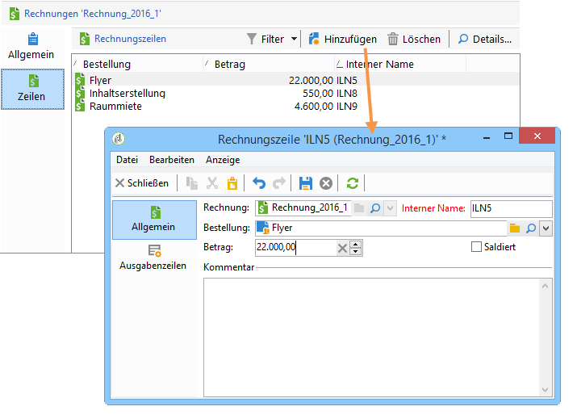

Die Rechnungen jeden Dienstleisters werden im **[!UICONTROL Rechnungen]**-Tab seines Profils angezeigt:

Im **[!UICONTROL Details]**-Tab kann der Inhalt der jeweiligen Rechnung eingesehen werden.

Klicken Sie auf **[!UICONTROL Hinzufügen]**, um eine neue Rechnung zu erstellen.
