# Kosten kontrollieren{#controlling-costs}

Adobe Campaign ermöglicht mit dem MRM-Modul die Kontrolle der geplanten, eingesetzten und berechneten Marketing-Kosten sowie ihre Aufschlüsselung nach Kategorien.

Die für die verschiedenen Prozesse einer Kampagne gebundenen Kosten werden auf ein Budget angerechnet, das vorab von der Marketing-Abteilung festgelegt wurde. Die Beträge können in verschiedene Kategorien unterteilt werden, um die Informationen lesbarer zu gestalten und eine detailliertere Berichterstattung über Marketinginvestitionen zu ermöglichen.

Die Budgetverwaltung und -verfolgung wird in einem dedizierten Knoten der Adobe Campaign-Struktur zentralisiert. Auf diese Weise können Sie die zugewiesenen, reservierten, gebundenen und ausgegebenen Beträge in derselben Ansicht und für alle Budgets überwachen.

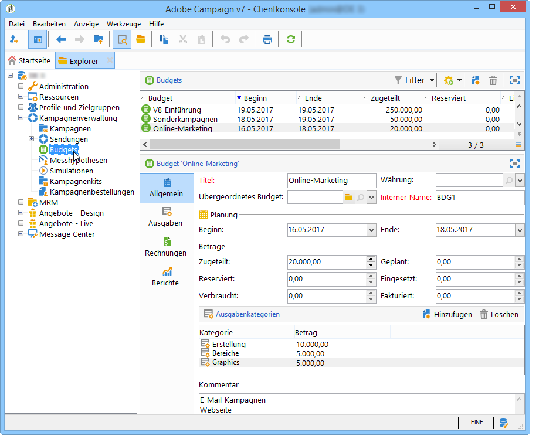

Zur Nutzung der Budget-Verwaltung mit MRM sind folgende Etappen umzusetzen:

1. Definieren Sie das Budget. [Weitere Informationen](#creating-a-budget).

1. Definieren Sie die Kostenberechnungsmethode: Für die Dienstleister werden Kostenstrukturen definiert. [Weitere Informationen](../campaigns/providers-stocks-and-budgets.md).

1. Definieren Sie die Kosten der Kampagne (Sendungen/Aufgaben): Die durch Sendungen und Aufgaben anfallenden Kosten werden einzeln oder pauschal in der Kampagnenvorlage angegeben. [Weitere Informationen](../campaigns/marketing-campaign-deliveries.md#compute-costs-and-stocks).

1. Konsolidieren Sie: Gemäß dem Fortschrittsstatus der Aufgaben, Sendungen und Kampagnen werden die Kosten berechnet und das entsprechende Budget wird damit belastet. Wenn die Erstellung der Kampagne ausreichend fortgeschritten ist, kann der Fortschrittsstatus des Kampagnenbudgets in &quot;**[!UICONTROL &quot;]** werden. Die berechneten Kosten des Programms werden dann automatisch mit den berechneten Kosten der Kampagne erfasst. [Weitere Informationen](#cost-commitment--calculation-and-charging).

## Erstellen eines Budgets {#creating-a-budget}

Gehen Sie wie folgt vor, um ein Budget zu erstellen:

1. Navigieren Sie zum Knoten **[!UICONTROL Kampagnen-Management > Budgets]** des Campaign-Explorers.
1. Klicken Sie auf das Symbol **[!UICONTROL Neu]**, benennen und speichern Sie das Budget.
1. Anfangsbetrag eingeben: geben Sie im entsprechenden Feld den zugewiesenen Betrag an. Die anderen Beträge werden automatisch angegeben. [Weitere Informationen](#calculating-amounts).
1. Definieren Sie den Gültigkeitszeitraum durch Eingabe des Start- und Enddatums. Diese Informationen sind lediglich als Hinweis zu verstehen.
1. Erstellen Sie die Ausgabenkategorien, denen die für Kampagnen, Sendungen, Aufgaben usw. anfallenden Kosten in diesem Budget zugeordnet werden können. [Weitere Informationen](#expense-categories).

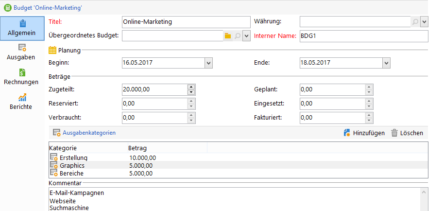

>[!NOTE]
>
>Sie können ein übergeordnetes Budget auswählen. Weiterführende Informationen hierzu finden Sie in [diesem Abschnitt](#linking-a-budget-to-another).
>

### Beträge berechnen {#calculating-amounts}

Jedes Budget ist durch einen Ausgangsbetrag definiert, der sich von den Kosten der verschiedenen Kampagnen, Sendungen oder Aufgaben, die mit ihnen in Verbindung stehen, nach ihrer Planung oder Durchführung verringert. Der Status der Beträge (geplant, reserviert, gebunden, ausgegeben oder fakturiert) hängt von der Art der Kosten und dem Umfang der Verpflichtung ab, die in der Kampagne, dem Versand oder der Aufgabe definiert wurden.

>[!NOTE]
>
>Die in den Kategorien eingetragenen Beträge müssen dem im Feld **[!UICONTROL Zugeteilt]** angegebenen Gesamtbudget entsprechen.

In Kampagnen können je nach Verbindlichkeitsniveau Kosten für eine zukünftige Aktion geplant, eingesetzt oder reserviert werden.

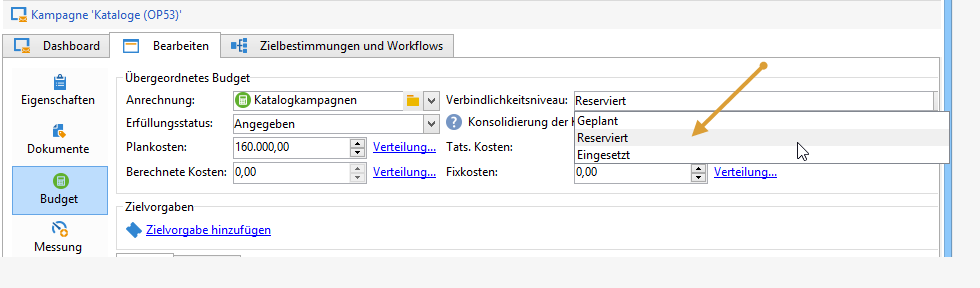

>[!CAUTION]
>
>Bei der Erstellung einer Kampagne muss der Fortschrittsstatus im **[!UICONTROL Budget]** auf **[!UICONTROL Angegeben]** eingestellt sein, damit die Kosten bei der Ausführung berücksichtigt werden. Wenn der Status **[!UICONTROL In Bearbeitung]** ist, werden die Kosten nicht konsolidiert.
>   
>Die Option **[!UICONTROL Verpflichtungsgrad]** stellt eine Prognose der Kosten für die Zukunft dar, bevor sie dem Haushalt angelastet werden. Je nach Fortschritt einer Kampagne, Aufgabe oder eines Versands können Sie festlegen, ob eine höhere oder eine niedrigere Verbindlichkeitsstufe zugewiesen wird (1. Geplant, 2. Reserviert, 3. Übergeben) mithilfe des Kombinationsfelds an.

Beispiel: Die Kosten einer Web-Kampagne werden auf 45 000 Euro geschätzt.

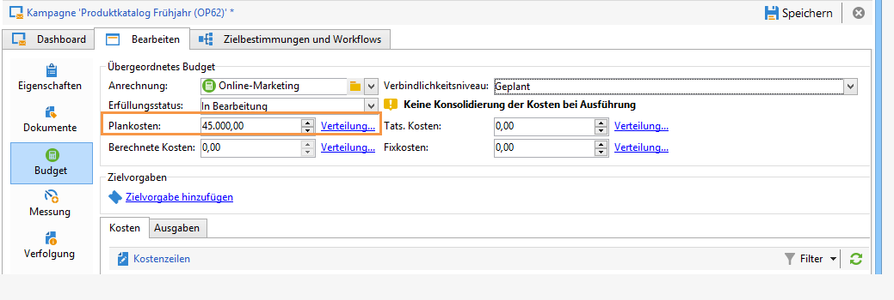

Wenn der Erfüllungsstatus des Budgets in der Kampagne **[!UICONTROL Angegeben]** ist, werden die tatsächlichen Kosten der Kampagne (oder, wenn nicht angegeben, die berechneten Kosten) in die Budgetbeträge übertragen.

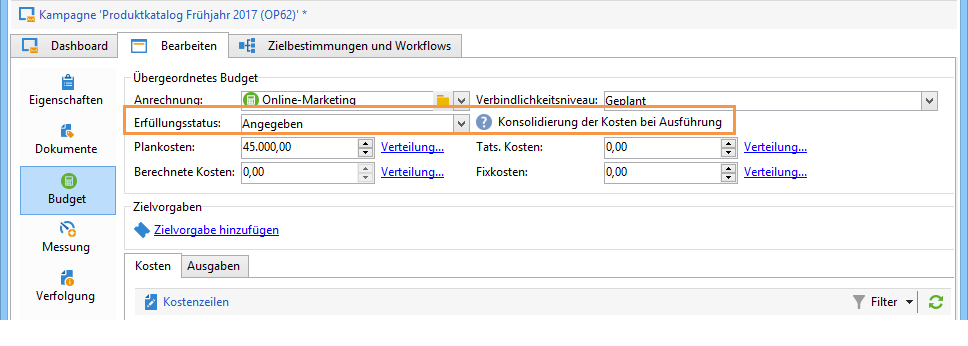

Je nach Verbindlichkeitsniveau der Kampagne wird der Betrag in das Feld **[!UICONTROL Geplant]**, **[!UICONTROL Reserviert]** oder **[!UICONTROL Eingesetzt]** übertragen.

Das Verbindlichkeitsniveau kann geändert werden:

* auf **Ebene** Kampagne) im Fenster **[!UICONTROL Budget]** auf der Registerkarte **[!UICONTROL Bearbeiten]**. Hier werden Budgets, Kosten und Ausgaben konfiguriert.
* in einer **Aufgabe** im Fenster **[!UICONTROL Ausgaben und Einnahmen]**.

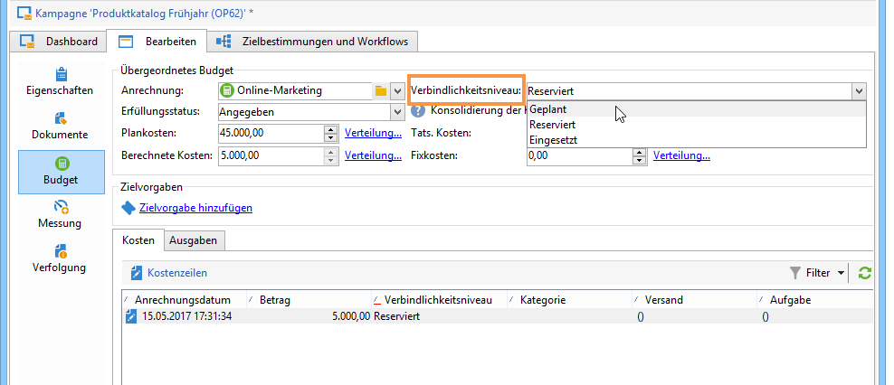

Sobald ein Budget **[!UICONTROL Reserviert]** ist, wird automatisch das zugeteilte Budget aktualisiert.

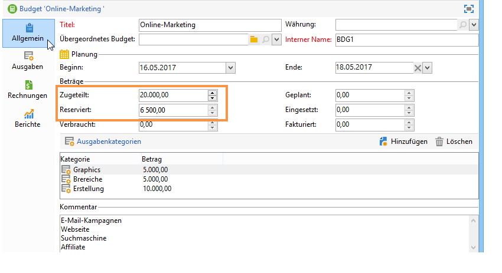

Der Ablauf entspricht dem der Aufgaben:

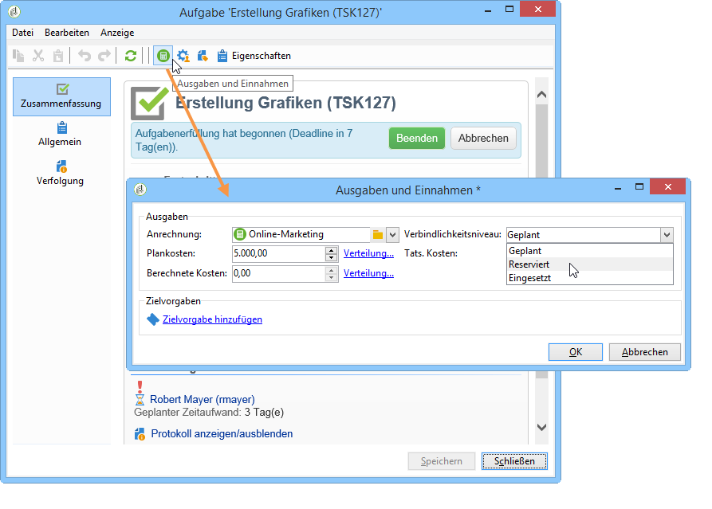

Wenn eine Ausgabe in Rechnung gestellt und diese Rechnung beglichen wird, wird der jeweilige Betrag im Feld **[!UICONTROL Fakturiert]** eintragen.

### Ausgabenkategorien {#expense-categories}

Die Beträge können in verschiedene Ausgabenkategorien verteilt werden, um eine bessere Lesbarkeit der Daten und eine detailliertere Berichterstattung über Marketing-Investitionen zu erreichen. Die Ausgabenkategorien werden bei der Budgeterstellung über den Knoten **[!UICONTROL Budgets]** des Baums definiert.

Klicken Sie auf die Schaltfläche **[!UICONTROL Hinzufügen]** im unteren Abschnitt des Fensters, um eine Kategorie hinzuzufügen.

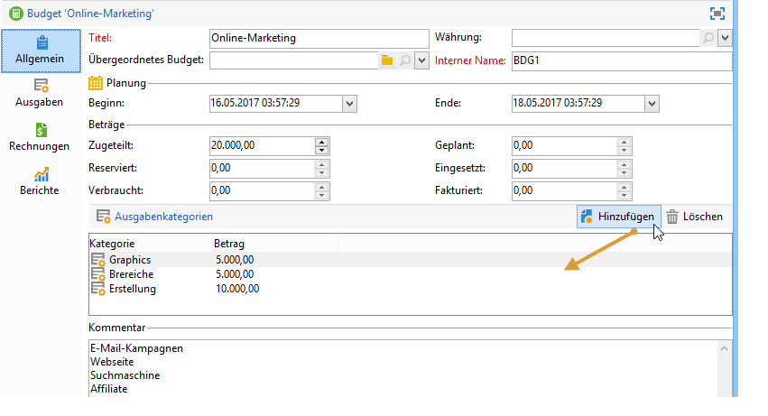

Sie können eine Kategorie aus den vorhandenen auswählen oder eine neue Kategorie definieren, indem Sie sie direkt in das Feld eingeben. Wenn Sie Ihre Eingabe bestätigen, können Sie diese Kategorie mit einer Bestätigungsmeldung zur Liste der vorhandenen Kategorien hinzufügen und sie bei Bedarf mit einer Art verknüpfen. Diese Informationen werden in den Haushaltsberichten verwendet.

### Zuordnung von Budgets untereinander {#linking-a-budget-to-another}

Sie können ein Budget mit einem Hauptbudget verknüpfen. Wählen Sie dazu das Hauptbudget im Feld **[!UICONTROL Übergeordnetes Budget]** der sekundären Budgets aus.

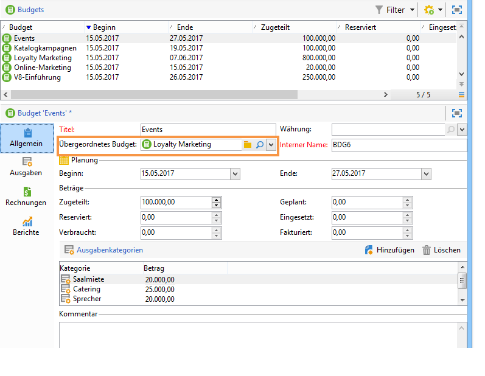

Dem Hauptbudget wird daraufhin ein Tab zur Auflistung der untergeordneten Budgets hinzugefügt.

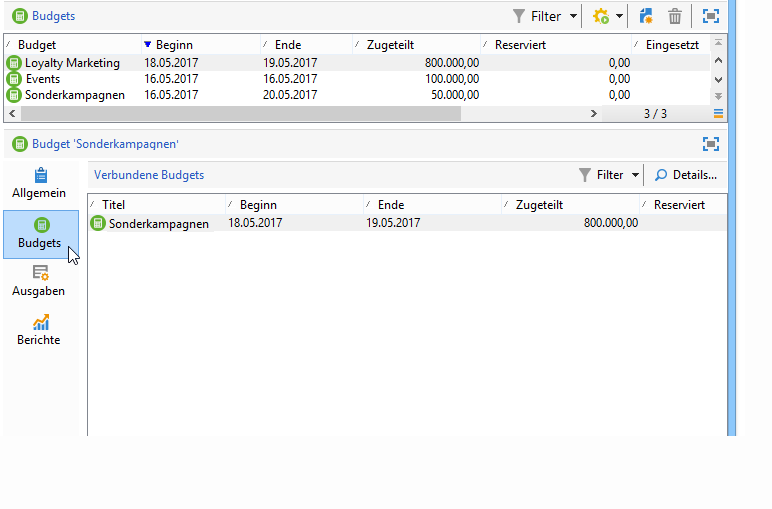

Diese Informationen werden in den Budgetberichten ausgewertet.

## Ausgabenzeilen hinzufügen {#adding-expense-lines}

Ausgabenzeilen werden automatisch zum Budget hinzugefügt. Sie werden bei der Versandanalyse und nach Abschluss einer Aufgabe erstellt.

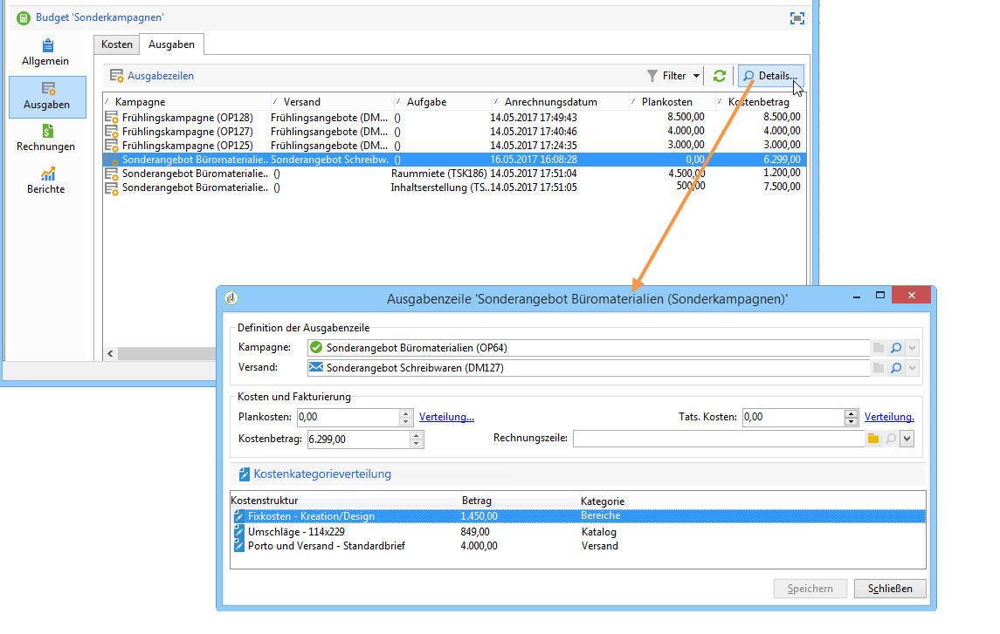

Für jede Kampagne, jeden Versand oder jede Aufgabe werden die generierten Kosten in den Ausgabenzeilen des Budgets gruppiert, dem sie belastet werden. Diese Ausgabenzeilen werden entsprechend den Kostenzeilen des betreffenden Dienstleisters erstellt und über die zugehörigen Kostenstrukturen berechnet.

Damit enthält jede Ausgabenzeile folgende Informationen:

* die Kampagne und Sendung oder Aufgabe, der sie zugeordnet ist;
* den ausgehend von den Kostenstrukturen oder den Plankosten berechneten Betrag;
* die tatsächlichen Kosten der Sendung oder der betreffenden Aufgabe;
* die entsprechende Rechnungszeile (ausschließlich in MRM);
* die Liste der berechneten Kosten je Kostenkategorie (wenn eine Kostenstruktur existiert).

Im obigen Beispiel enthält die bearbeitete Ausgabenzeile die berechneten Kosten für den Versand **Neue Karten** für die Kampagne **Loyalty Spring Pack**. Bei der Bearbeitung des Versands zeigt die Registerkarte **[!UICONTROL Briefpost]** an, wie die Ausgabenzeile berechnet wird.

Als Grundlage der Kostenberechnung für diesen Versand dienen die für den betroffenen Dienstleister ausgewählten Kostenkategorien.

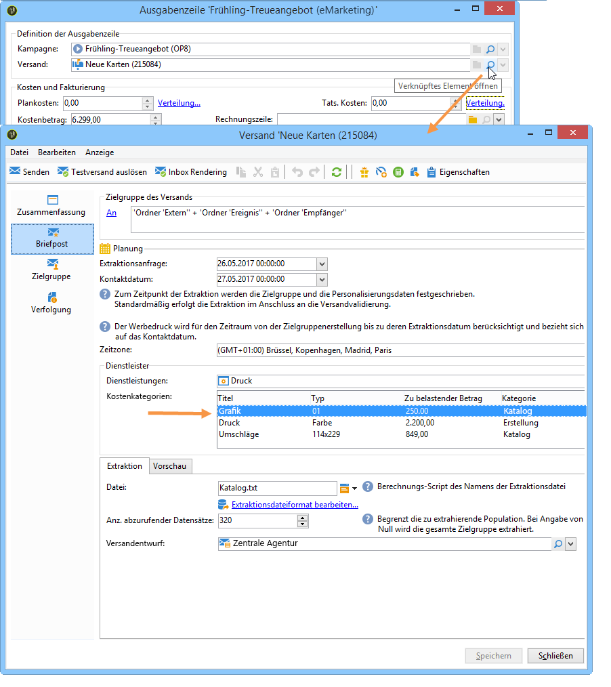

Je nach den ausgewählten Kostenkategorien werden die entsprechenden Kostenstrukturen zur Berechnung der Kostenzeilen angewendet. In diesem Beispiel sind für den betroffenen Dienstleister die Kostenstrukturen wie folgt:

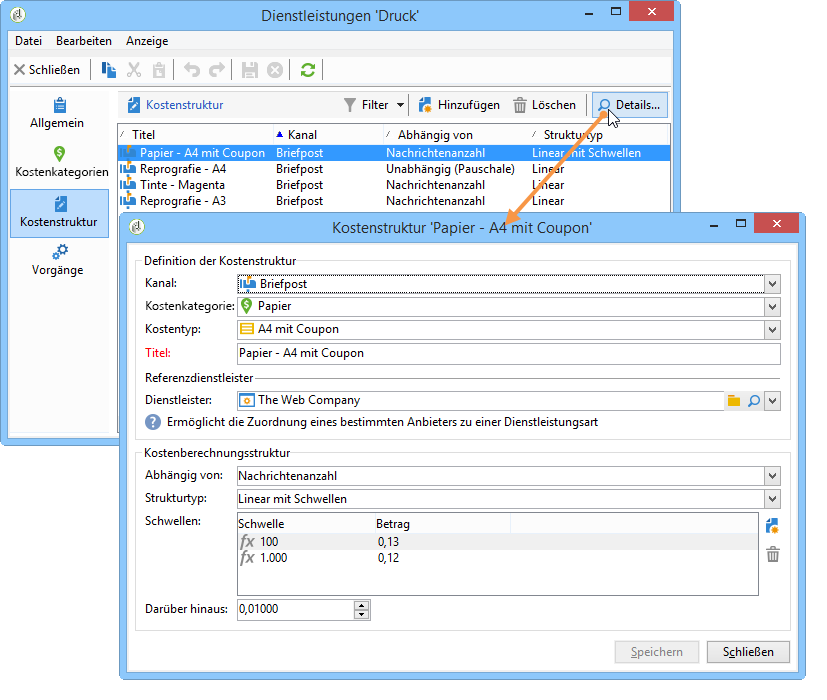

>[!NOTE]
>
>Die Kostenstellen und -strukturen werden auf [dieser Seite](../campaigns/providers-stocks-and-budgets.md#create-a-service-provider-and-its-cost-categories) dargestellt.

## Entstehung, Berechnung und Anrechnung von Kosten {#cost-commitment--calculation-and-charging}

Kosten können für Sendungen und Aufgaben entstehen. Je nach Fortschritt des Prozesses, mit dem er verbunden ist, wird der Status der Kosten aktualisiert.

### Kostenarten {#cost-calculation-process}

Kosten werden in drei Kategorien eingeteilt:

1. Plankosten

   Die geschätzten vorläufigen Kosten sind eine Schätzung der Kosten für die Prozesse der Kampagne. Solange sie bearbeitet wird, werden die Eingabebeträge nicht konsolidiert. Der Status **[!UICONTROL Angegeben]** ist hier nötig, damit die eingegebenen Beträge in den Berechnungen berücksichtigt werden.

   Dieser Betrag wird manuell eingegeben und kann in mehrere Ausgabenkategorien unterteilt werden. Klicken Sie zum Aufschlüssen von Kosten auf den Link **[!UICONTROL Aufschlüsselung…]** und dann auf die Schaltfläche **[!UICONTROL Hinzufügen]**, um einen neuen Betrag zu definieren.

   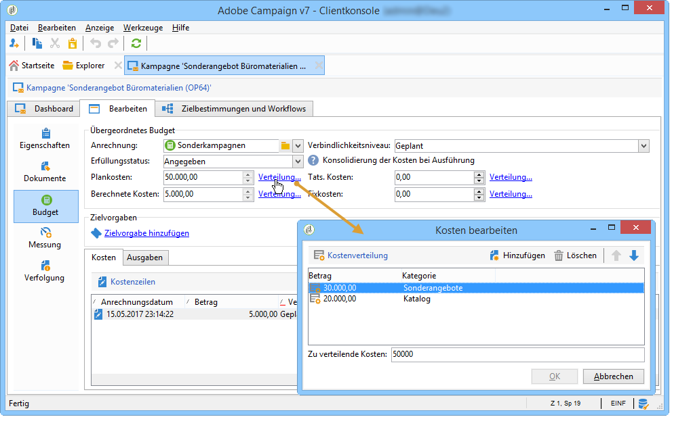

   Jeder Kostenbetrag kann einer Kategorie zugeordnet werden. Dies ermöglicht eine Aufschlüsselung der Kosten nach Ausgabenkategorien im übergeordneten Budget sowie in den Budgetberichten.

1. Berechnete Kosten

   Die berechneten Kosten hängen von den jeweiligen Elementen ab (Kampagne, Versand, Aufgabe usw.) und dessen Status (in Bearbeitung, in Bearbeitung, in Bearbeitung, abgeschlossen). Wenn die tatsächlichen Kosten angegeben werden, verwenden die berechneten Kosten in jedem Fall diesen Betrag.

   Wenn die tatsächlichen Kosten nicht angegeben sind, gelten folgende Regeln:

   * Für eine bearbeitete Kampagne entsprechen die berechneten Kosten den geschätzten vorläufigen Kosten der Kampagne. Wenn diese Kosten nicht definiert sind, entsprechen die berechneten Kosten der Summe aller vorläufigen Kosten der Sendungen und Aufgaben der Kampagne. Ist die Kampagne abgeschlossen, entsprechen die berechneten Kosten der Kampagne der Summe aller berechneten Kosten.
   * Bei einem Versand, der noch nicht analysiert wurde, entsprechen die berechneten Kosten den geschätzten vorläufigen Kosten. Wenn die Analyse bereits durchgeführt wurde, entsprechen die berechneten Kosten der Summe aller aus den Kostenstrukturen der Dienstleister berechneten Kosten und der Anzahl der Zielgruppenempfänger.
   * Für eine laufende Aufgabe verwenden die berechneten Kosten die geschätzten vorläufigen Kosten. Wenn die Aufgabe abgeschlossen ist, entsprechen die berechneten Kosten der Summe aller aus den Kostenstrukturen des Dienstleisters berechneten Kosten und der Anzahl der abgeschlossenen Tage.
   * Für den Marketing-Plan sind die berechneten Kosten wie für das Programm die Summe der für die Kampagnen berechneten Kosten. Wenn diese Kosten nicht angegeben werden, werden die geschätzten vorläufigen Kosten für die berechneten Kosten verwendet.

   >[!NOTE]
   >
   >Über den **[!UICONTROL Aufschlüsselung]**-Link der berechneten Kosten können Details der Berechnung sowie das Datum der letzten Kostenberechnung eingesehen werden.

1. Tatsächliche Kosten

   Tats. Kosten werden manuell erfasst und bei Bedarf zwischen unterschiedlichen Ausgabenkategorien verteilt.

### Anrechnung auf Budgets {#calculation-and-charging}

Kosten werden mithilfe der Kostenstrukturen berechnet und auf die in den betroffenen Kampagnen, Sendungen oder Aufgaben ausgewählten Budgets angerechnet.

Über die Budgetvalidierung kann eine Prüfung der an Kampagnen gebundenen Beträge durchgeführt werden. In einer Kampagne können zusätzliche Checkpoint-artige Aufgaben erstellt werden, um andere Validierungen einzurichten. Siehe [Aufgabenarten](creating-and-managing-tasks.md#types-of-task).

### Beispiel {#example}

Im Folgenden wird eine Kampagne mit folgenden Elementen erstellt:

* Briefpost-Versand mit Kostenstrukturen eines Dienstleisters
* Aufgabe mit Fixkosten
* Aufgabe mit Tageskosten

#### Schritt 1: Budget erstellen {#step-1---creating-the-budget}

1. Erstellen Sie ein neues Budget über den Knoten **[!UICONTROL Kampagnenverwaltung > Budgets]**.

1. Definieren Sie ein Budget von 10.000 Euro im Feld **[!UICONTROL Zugeteilt]** des Abschnitts **[!UICONTROL Beträge]**. Fügen Sie im unteren Bereich des Fensters zwei Ausgabenkategorien hinzu:

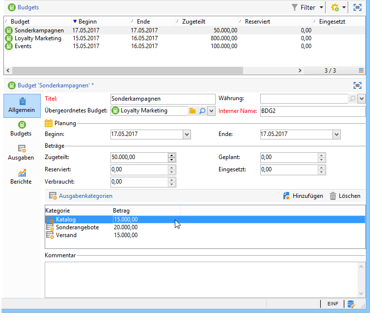

#### Schritt 2: Dienstleister konfigurieren und Kostenstrukturen festlegen {#step-2---configuring-the-service-provider-and-defining-the-cost-structures}

1. Erstellen Sie einen Dienstleister sowie eine Dienstleistungsvorlage mit Kostenstruktur über den Knoten **[!UICONTROL Administration > Kampagnen > Dienstleister]**. Weiterführende Informationen hierzu finden Sie in [diesem Abschnitt](../campaigns/providers-stocks-and-budgets.md#create-a-service-provider-and-its-cost-categories).

   Erstellen Sie für die Briefpost-Sendungen Kostenkategorien **[!UICONTROL Briefumschläge]** (Typen 114x229 und 162x229), **** und **[!UICONTROL Drucken]** (Typen A3 und A4). Erstellen Sie dann die folgenden Kostenstrukturen:

   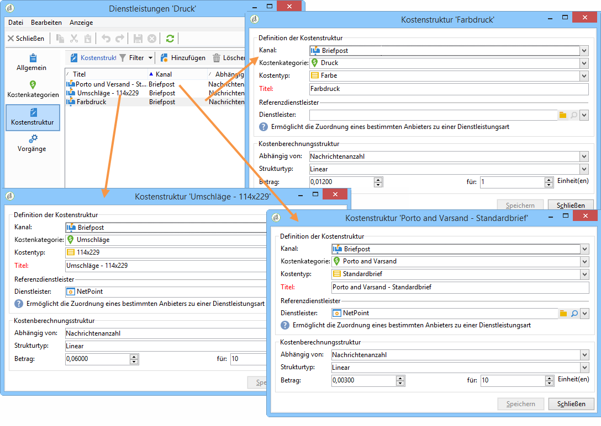

1. Fügen Sie in den Kostenkategorien Fixkosten vom Typ &quot;Festpreis&quot; hinzu, deren Betrag in der entsprechenden Kostenstruktur leer ist. (Dieser wird einzeln für jeden Versand angegeben.)

   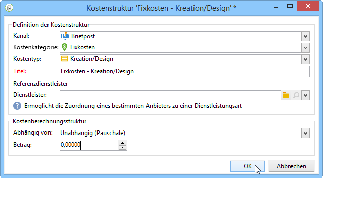

   Erstellen Sie für die Aufgaben die folgenden zwei Kostenkategorien:

   * **[!UICONTROL Raumreservierung]** (Typen Kleiner Saal und Großer Saal) mit einer **Pauschale** von 300 und 500 Euro.

   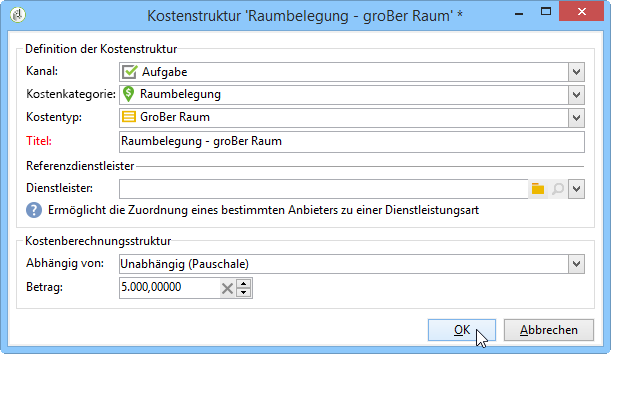

   * **[!UICONTROL Erstellung]** (Typ **Inhaltsvorlage**) mit von der **Dauer in Tagen** abhängigen Kosten in Höhe von 300 Euro:

   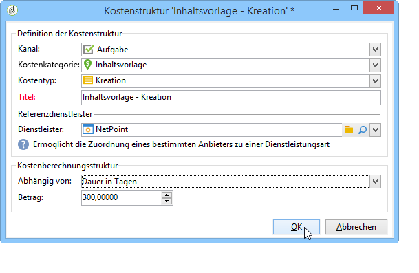

#### Schritt 3: Anfallende Kosten auf das Kampagnenbudget anrechnen {#step-3---charging-the-budget-in-the-campaign}

1. Erstellen Sie eine Kampagne und wählen Sie das im 1. Schritt erstellte Budget aus.

   >[!NOTE]
   >
   >Das im Programm ausgewählte Budget wird standardmäßig für alle Kampagnen des Programms angewandt.

   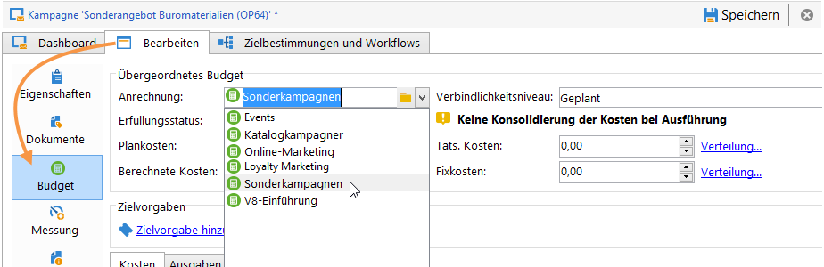

1. Geben Sie die Plankosten mit Aufschlüsselung an:

   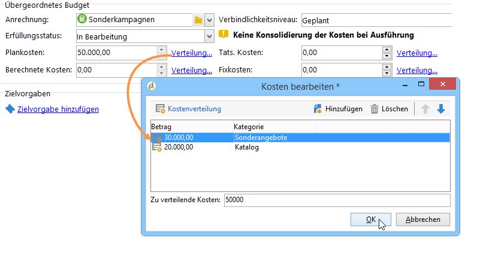

1. Klicken Sie auf **[!UICONTROL OK]** und dann **[!UICONTROL Speichern]**, um diese Informationen zu bestätigen. Die berechneten Kosten der Kampagne werden dann mit den geschätzten vorläufigen Kosten aktualisiert.

#### Schritt 4: Briefpost-Versand erstellen {#step-4---creating-the-direct-mail-delivery}

1. Erstellen einen Kampagnen-Workflow mit einer Abfrage zur Zielgruppenbestimmung. Stellen Sie sicher, dass die Postadresse der ausgewählten Empfänger angegeben ist.

1. Erstellen Sie nun einen Briefpost-Versand und wählen Sie den im zweiten Schritt erstellten Dienstleister aus: Die Kostenkategorien werden automatisch angezeigt.

1. Überschreiben Sie die Kosten der Umschläge und fügen Sie Fixkosten hinzu. Wählen Sie auch die von diesen Kosten betroffenen Kategorien aus.

   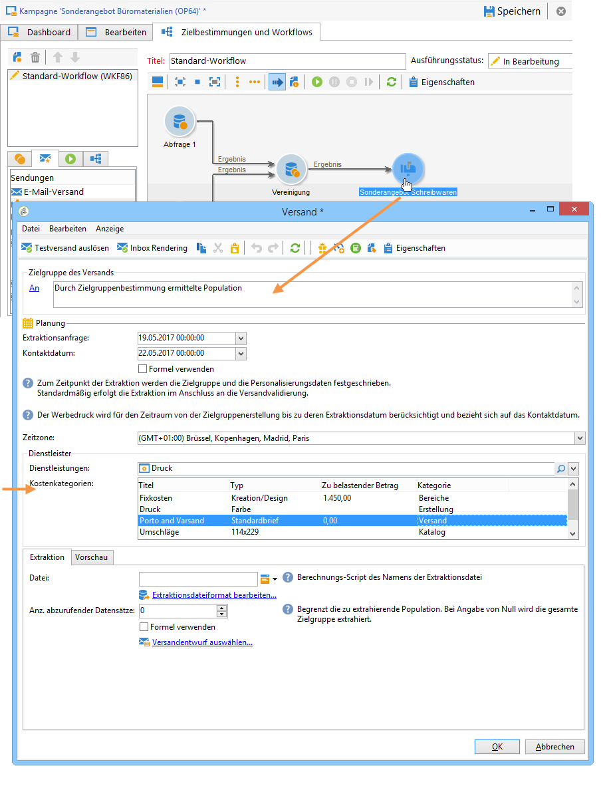

   >[!NOTE]
   >
   >Wenn eine der Kostenkategorien nicht verwendet wird, fallen durch diese keinerlei Ausgaben an.

1. Starten Sie den gerade erstellten Workflow, um die Analyse zu beginnen und die Kosten zu berechnen.

   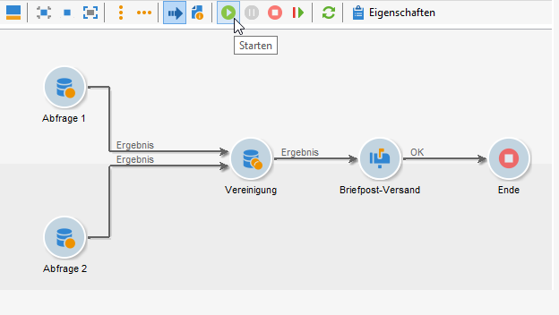

1. Wenn die Budgetvalidierung für diese Kampagne aktiviert ist, validieren Sie das Budget über das Dashboard. Sie können die Validierung der Kostenkategorien überprüfen.

   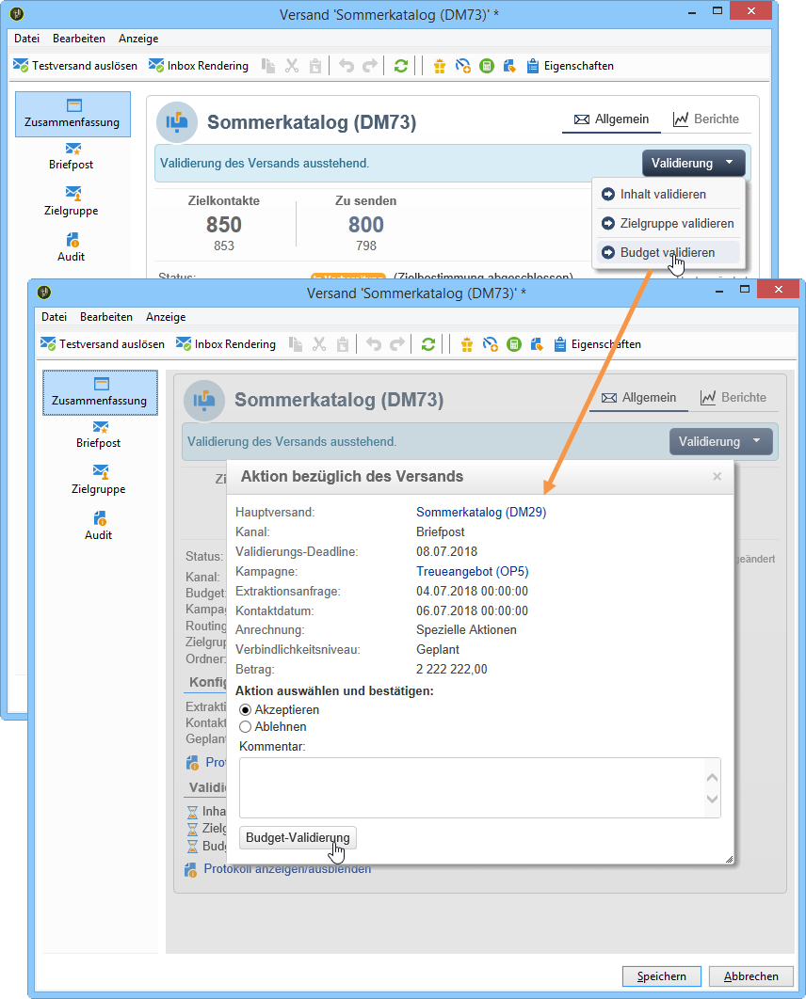

Die den Versand betreffende Ausgabenzeile wird der Registerkarte **[!UICONTROL Bearbeiten > Budget]** der Kampagne hinzugefügt. Bearbeiten Sie ihn, um die Details der Berechnung anzuzeigen.

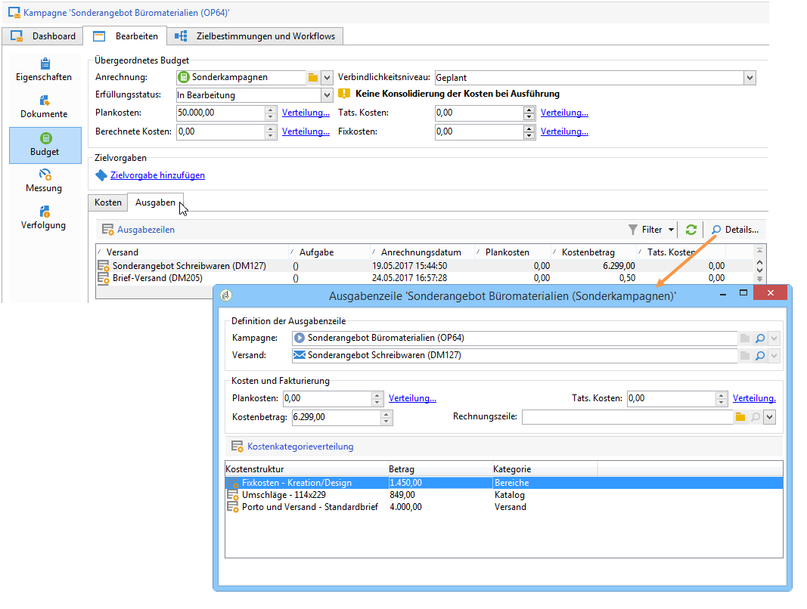

Auf Versandniveau werden die berechneten Kosten mit folgenden Daten aktualisiert:

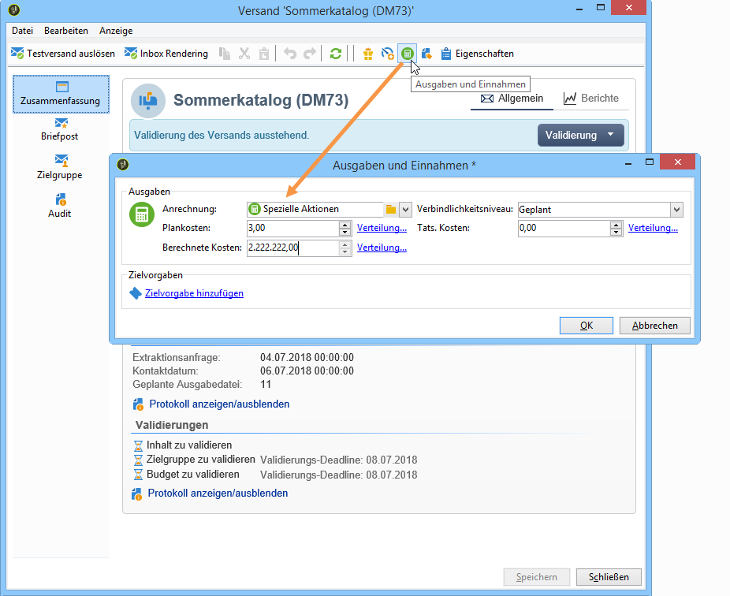

Beim Bearbeiten der berechneten Kosten können Sie die Aufschlüsselung der Kosten sowie Status und Datum der Kostenberechnung überprüfen.

#### Schritt 5: Aufgaben erstellen {#step-5---creating-tasks}

Zu dieser Kampagne fügen wir die beiden Aufgaben hinzu, für die die Kostenstrukturen [früher erstellt](#step-2---configuring-the-service-provider-and-defining-the-cost-structures) wurden.

Klicken Sie dazu im Kampagnen-Dashboard auf die Schaltfläche **[!UICONTROL Aufgabe hinzufügen]**. Benennen Sie die Aufgabe und klicken Sie auf **[!UICONTROL Speichern]**.

1. Die Aufgabe wird dann der Aufgabenliste hinzugefügt. Sie müssen sie bearbeiten, um sie zu konfigurieren.

1. Klicken Sie auf **[!UICONTROL Eigenschaften]**, um die Dienstleistung sowie die entsprechende Kostenkategorie auszuwählen:

   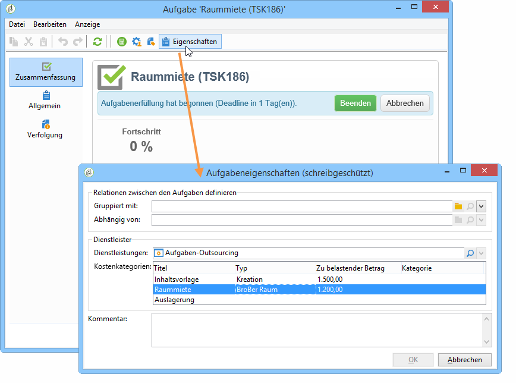

1. Öffnen Sie anschließend die **[!UICONTROL Ausgaben und Einnahmen]** der Aufgabe und geben Sie ihre Plankosten an.

   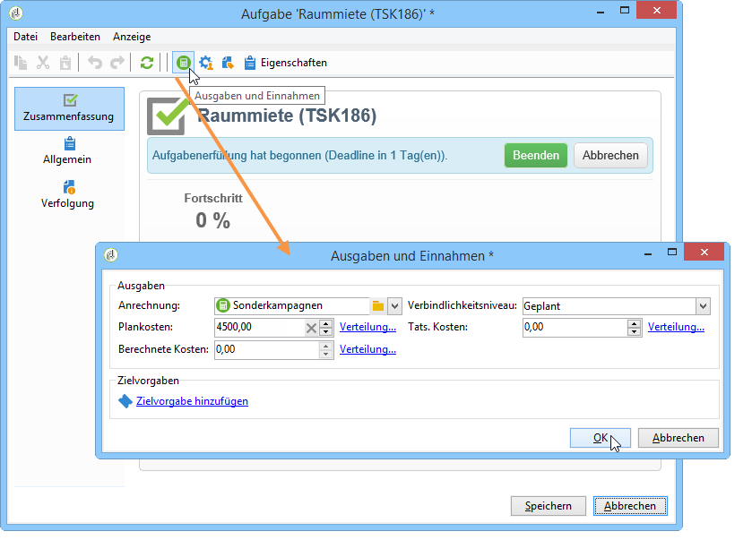

   Mit Speicherung der Aufgabe übernehmen die berechneten Kosten den für die Plankosten angegebenen Wert.

   Wenn die Aufgabe abgeschlossen ist (Status **[!UICONTROL Abgeschlossen]** ), werden die berechneten Kosten automatisch mit den Kosten des großen Raums aktualisiert, wie sie in der Kostenstruktur angegeben sind. Diese Kosten werden auch in dieser Kategorie in der Aufschlüsselung angezeigt.

1. Erstellen Sie auf die gleiche Weise eine zweite Aufgabe mit einer Planung über fünf Tage und verbinden Sie sie mit der zuvor erstellen Kostenstruktur.

   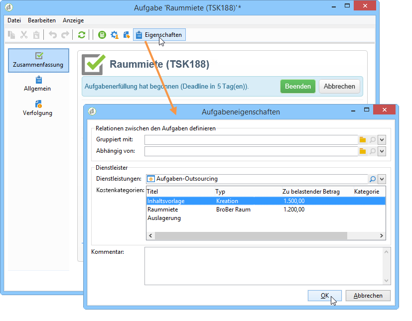

   Nach Abschluss der Aufgabe übernehmen die berechneten Kosten den aus der Kostenstruktur stammenden Wert, in unserem Beispiel also 1500 Euro (5 Tage x 300 Euro).

   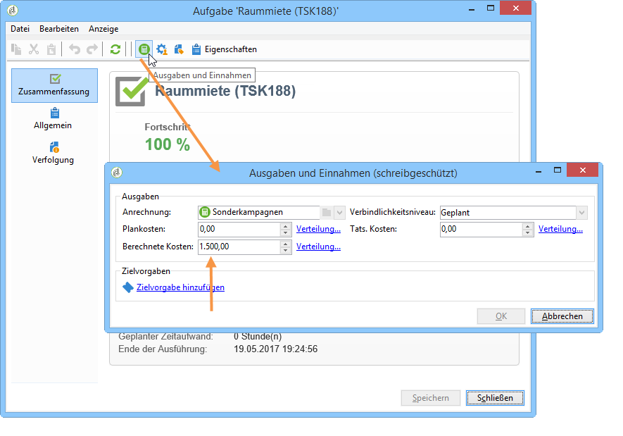

#### Schritt 6: Status des Kampagnenbudgets aktualisieren {#step-6---update-the-campaign-budget-status}

Wenn die Kampagne konfiguriert ist, kann ihr Status aktualisiert werden, indem sie auf &quot;**[!UICONTROL &quot;]**. Die berechneten Kosten der Kampagne geben dann die Summe der berechneten Kosten des Versands und der Aufgaben der Kampagne an:

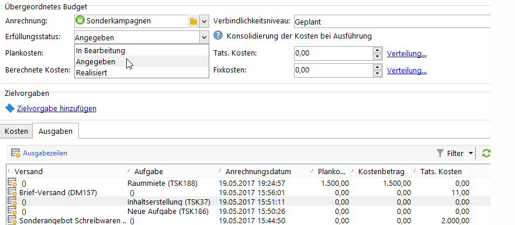

#### Validierung von Budgets {#budget-approval}

Wenn die Validierung aktiviert ist, können Sie über einen speziellen Link das Budget im Kampagnen-Dashboard validieren. Dieser Link wird angezeigt, wenn der Zielgruppenbestimmungs-Workflow gestartet wurde und ein Briefpost-Versand genehmigt werden muss.

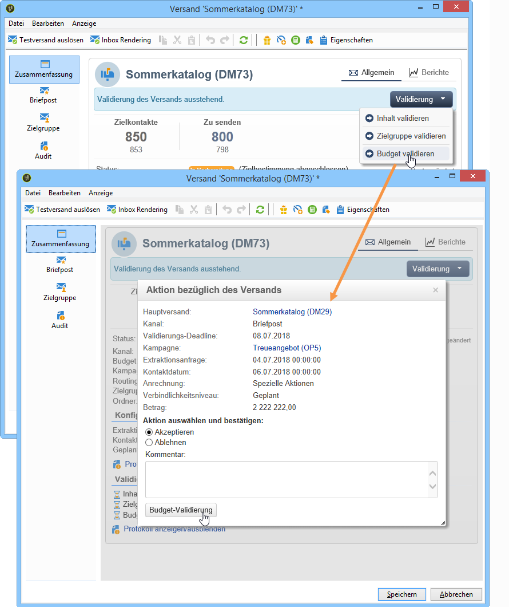

Sie können dann die Validierung über diesen Link akzeptieren oder ablehnen. Wenn Benachrichtigungen für die Kampagne aktiviert wurden, können Sie den Link auch in der Benachrichtigungs-E-Mail verwenden.

Nach Budgetvalidierung und Abschluss des Versands werden die Kosten automatisch über einen speziellen technischen Workflow weiter verarbeitet.

## Lagerergänzungen und Rechnungen {#orders-and-invoices}

Im Kontext von MRM können Sie Bestellungen bei einem Dienstleister speichern und Rechnungen ausstellen. Der gesamte Lebenszyklus dieser Bestellungen und Rechnungen kann über die Benutzeroberfläche von Adobe Campaign verwaltet werden.

### Lagerergänzungen {#order-creation}

Um eine Lagerergänzung zu erfassen, gehen Sie zum Knoten **[!UICONTROL MRM > Lagerergänzungen]** des Navigationsbaums und klicken Sie auf die Schaltfläche **[!UICONTROL Neu]**.

Geben Sie die Nummer der Lagerergänzung, den entsprechenden Dienstleister sowie die Gesamtkosten für die Lagerergänzung an.

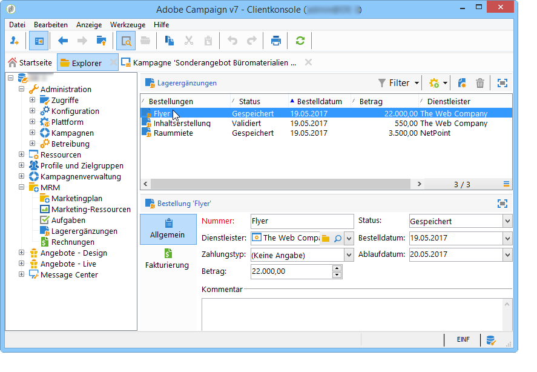

### Rechnungen erstellen und verfolgen {#issuing-and-tracking-invoices}

Sie können für jeden Dienstleister Rechnungen speichern und ihren Status sowie das betroffene Budget angeben.

Rechnungen werden im Knoten **[!UICONTROL MRM > Rechnungen]** des Adobe Campaign-Navigationsbaums erstellt.

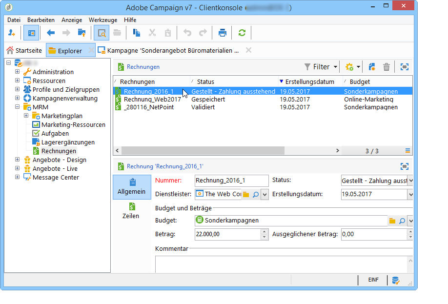

Eine Rechnung besteht aus Rechnungszeilen, deren Summe die automatische Berechnung des Betrags ermöglicht. Diese Zeilen werden manuell über die Registerkarte **[!UICONTROL Rechnungszeilen]** erstellt. Sie können einer Bestellung zugeordnet werden, um die Informationen in die Bestellungen hochzuladen.

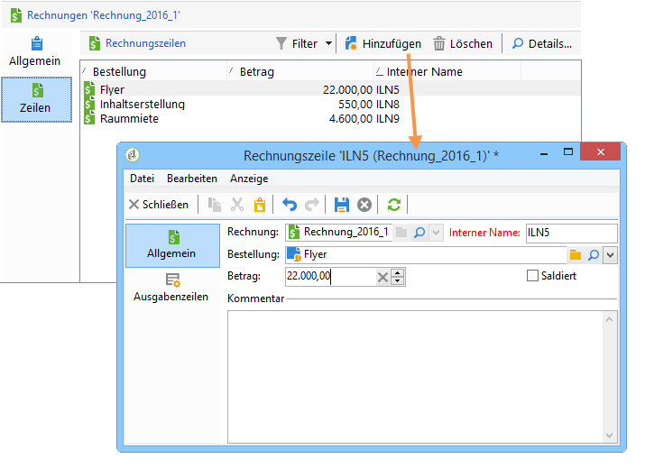

Die Rechnungen jeden Dienstleisters werden im **[!UICONTROL Rechnungen]**-Tab seines Profils angezeigt:

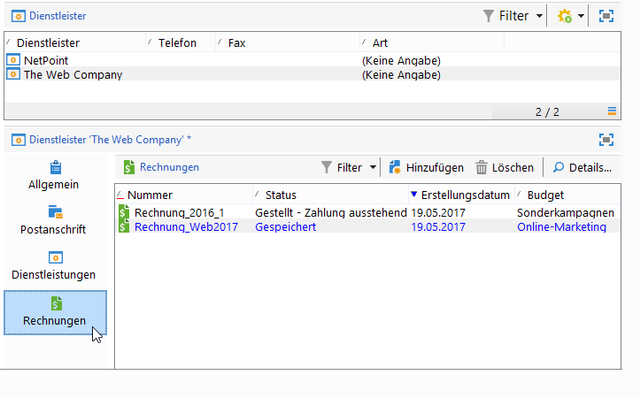

Im **[!UICONTROL Details]**-Tab kann der Inhalt der jeweiligen Rechnung eingesehen werden.

Klicken Sie auf **[!UICONTROL Hinzufügen]**, um eine neue Rechnung zu erstellen.
