# Aufgaben erstellen und verwalten{#creating-and-managing-tasks}

Mit Adobe Campaign können Aufgaben erstellt und deren gesamter Lebenszyklus direkt im Programm verwaltet werden. Die Programm- und Kampagnenimplementierung kann in Aufgaben unterteilt werden, die Adobe Campaign-Benutzenden oder externen Dienstleistern zugewiesen sind. Mit diesem Betriebsmodus können Sie eine offene Umgebung für die Zusammenarbeit erstellen, die alle Programmteilnehmer und externen Teilnehmer umfasst.

Aufgaben können über die Aufgabenliste oder das Kampagnen-Dashboard erstellt, angezeigt und überwacht werden. Sie können auch in den Zeitplänen des Marketing-Plans, der Programme und der Kampagnen angezeigt und verfolgt werden.

Aufgaben sind an eine Kampagne angehängt und können Abhängigkeiten aufweisen, d. h. verknüpfte Aufgaben. Jede Aufgabe verfügt über einen Status, eine Priorität, eine geschätzte Auslastung und zugehörige Kosten.

Alle Aufgaben sind in einer Liste gruppiert, auf die über den Tab **Kampagnen** zugegriffen werden kann. Weitere Informationen hierzu finden Sie unter [Zugriff auf Aufgaben](#accessing-tasks).

Sie können auch im Kalender des Programms, dem sie angehören, angezeigt werden.

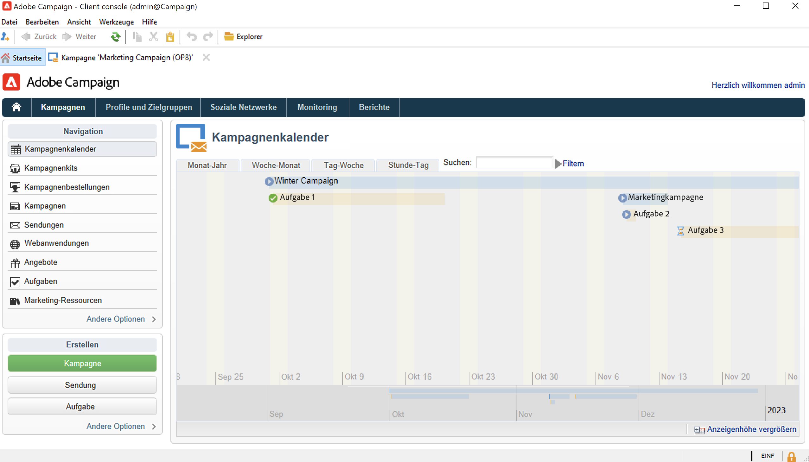

## Zugriff auf Aufgaben {#accessing-tasks}

### Aufgaben anzeigen {#displaying-tasks}

Eine Liste der Aufgaben kann über den Tab **[!UICONTROL Kampagnen]** angezeigt werden.

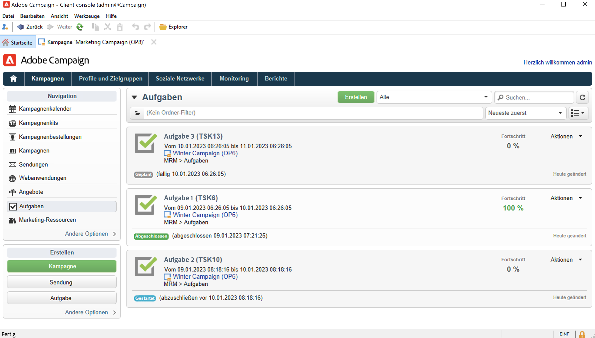

Hier werden alle Aufgaben des aktuellen Benutzers aufgeführt.

Weitere Informationen hierzu finden Sie unter [Ausführungsstatus einer Aufgabe](#execution-status-of-a-task) und [Fortschrittsstatus einer Aufgabe &#x200B;](#progress-status-of-a-task).

### Aufgaben filtern {#filtering-tasks}

Wenn Sie diese Ansicht anzeigen, wird sie automatisch gefiltert, um nur die **aktuelle Benutzeraufgaben** anzuzeigen. Sie können die Aufgaben auch mithilfe der Felder im oberen Bereich des Fensters filtern.

### Aufgaben bearbeiten {#editing-tasks}

Klicken Sie auf eine Aufgabe, um sie zu bearbeiten.

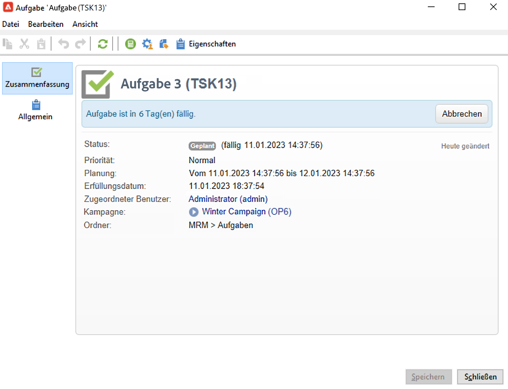

## Neue Aufgabe erstellen {#creating-a-new-task}

Gehen Sie wie folgt vor, um eine Aufgabe zu erstellen:

1. Navigieren Sie zum Link **[!UICONTROL Aufgaben]** in der Registerkarte **[!UICONTROL Kampagnen]** und klicken Sie auf **[!UICONTROL Erstellen]**.

   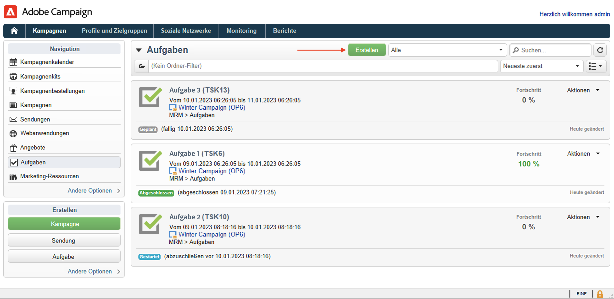

1. Geben Sie den Namen der Aufgabe ein und wählen Sie die Kampagne aus, mit der sie verknüpft ist.
1. Legen Sie das Start- und Enddatum fest.
1. Klicken Sie anschließend auf **[!UICONTROL Speichern]**, um die Aufgabe zu erstellen.

   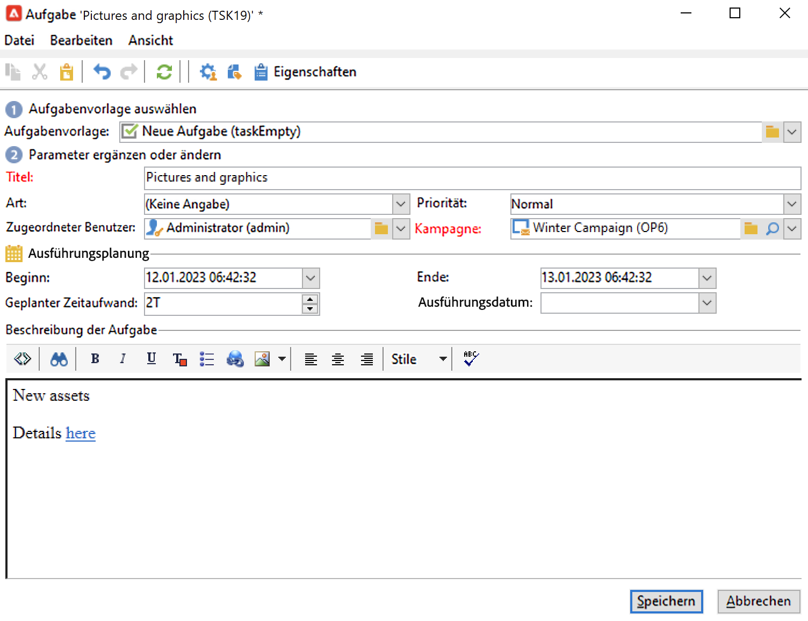

Aufgaben können zudem über das Dashboard einer Kampagne erstellt werden: In diesem Fall werden sie automatisch der Kampagne zugeordnet, über die sie erstellt wurden.

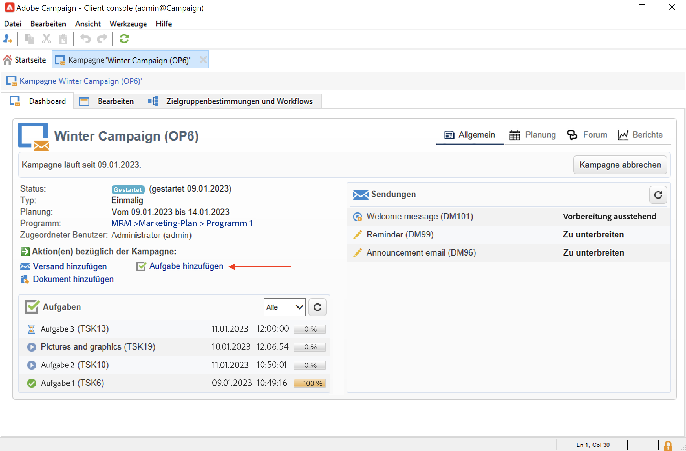

Nachdem eine Aufgabe erstellt wurde, wird sie zum Kampagnenkalender, zum Kampagnen-Dashboard und zur Aufgabenliste hinzugefügt. Um eine Aufgabe zu bearbeiten, klicken Sie in der Aufgabenliste auf ihren Namen oder wählen Sie sie im Zeitplan- oder Kampagnen-Dashboard aus und klicken Sie auf **[!UICONTROL Öffnen]**.

Nach der Erstellung können Sie die Aufgabe konfigurieren, indem Sie Folgendes definieren:

* Manager und Teilnehmende. [Weitere Informationen](#manager-and-participants)
* Erstellungsplan. [Weitere Informationen](#execution-schedule)
* Mittelbindungen. [Weitere Informationen](#expenses-and-revenues)

Sie können auch [Validierungsverantwortliche](#reviewers) und [Referenzdokumente](#documents-referenced) hinzufügen.

Der Lebenszyklus einer Aufgabe wird in [diesem Abschnitt](#life-cycle) vorgestellt.

### Verantwortlicher und Teilnehmer {#manager-and-participants}

Die Aufgabe wird standardmäßig dem Benutzer zugewiesen, der sie erstellt hat. Dieser Benutzer wird benachrichtigt, wenn für diese Aufgabe eine Aktion erforderlich ist.

Sie können einen anderen Benutzer aus der Dropdown-Liste **[!UICONTROL Zugewiesen an]** auswählen.

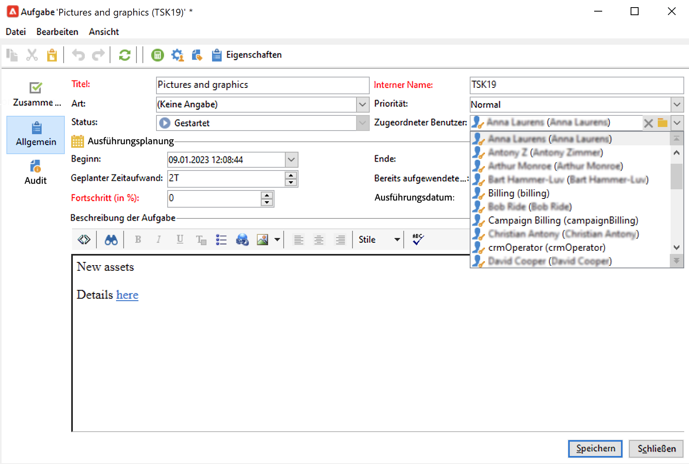

>[!NOTE]
>
>Die Benutzerverwaltung wird in [diesem Abschnitt](../../v8/start/gs-permissions.md) beschrieben.
>
>Der für eine Aufgabe verantwortliche Benutzer ist als Einziger dazu berechtigt, die Aufgabe zu schließen.

Sie können mehr Benutzer angeben, die an der Ausführung der Aufgabe beteiligt sind. Diese Benutzer dürfen die Aufgabe nicht schließen: sie dürfen nur die ihnen zugewiesene Aufgabe genehmigen.

Gehen Sie wie folgt vor, um Aufgabenbenutzer hinzuzufügen:

1. Klicken Sie auf **[!UICONTROL Ressourcen]** in der Aufgabensymbolleiste.

   

1. Klicken Sie auf **[!UICONTROL Hinzufügen]** und wählen Sie die betroffenen Benutzer aus.
1. Geben Sie die Nutzungsrate ein: Dies entspricht dem Arbeitsaufwand, der dem Benutzer für die Dauer der Aufgabenausführung zugewiesen wurde. Dieser Satz ist nur ein Hinweis und wird in Prozent ausgedrückt.

   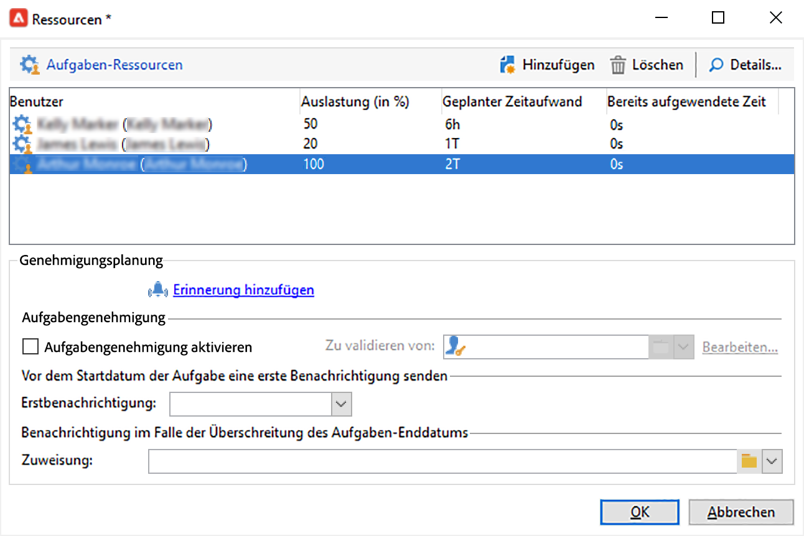

   Beispiel: Für eine Aufgabe wird eine Erfüllungsplanung von 10 Tagen festgelegt und einem Benutzer eine Auslastung von 50 % zugewiesen. Der Benutzer wird demnach für eine Dauer von 10 Tagen während der Hälfte seiner Arbeitszeit für die Aufgabenerfüllung eingesetzt.

   Für jeden Benutzer können Sie einen geplanten und einen tatsächlichen Arbeitsaufwand eingeben. Diese Fristen dienen auch nur zu Informationszwecken.

1. Sie können eine Erinnerung über den Link **[!UICONTROL Erinnerung hinzufügen...]** konfigurieren. Vor dem Enddatum der Aufgabe wird eine E-Mail-Benachrichtigung an alle an der Aufgabe beteiligten Benutzer gesendet.

   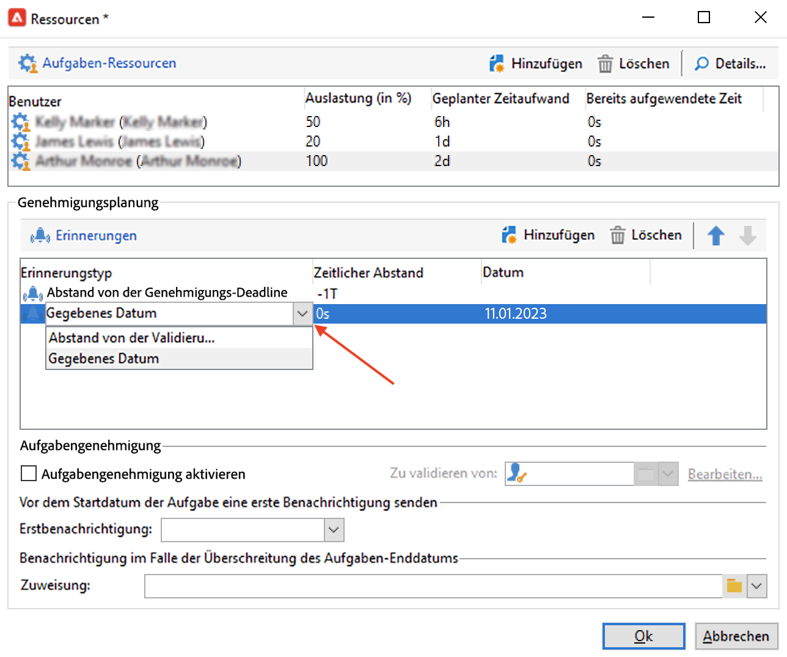

1. Sie können auch eine Benachrichtigung senden, bevor die Aufgabe gestartet wird. Um dies einzurichten, wählen Sie das Datum im Feld **[!UICONTROL Erstbenachrichtigung]** aus.
1. Wenn das Enddatum erreicht ist und die Aufgabe nicht geschlossen wird, kann eine Benachrichtigung an den Bevollmächtigten oder die Gruppe von Bevollmächtigten gesendet werden, die in der Dropdown-Liste **[!UICONTROL Zugewiesene Benutzer]** ausgewählt sind.

Über das Benutzer-Dashboard kann dessen Arbeitslast, d.h. seine anderen Aufgaben, eingesehen werden.

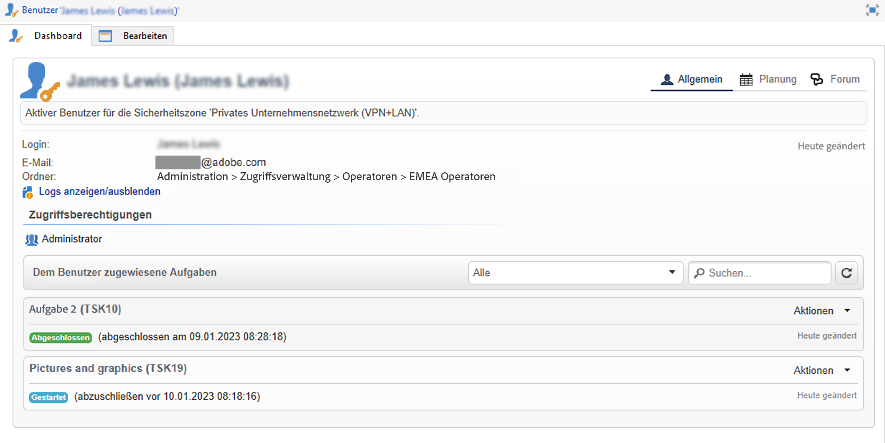

### Aufgabenvalidierung {#reviewers}

Neben den Teilnehmern können Sie auch Benutzer definieren, die die Aufgabe nach Abschluss überprüfen.

Klicken Sie dazu auf die Schaltfläche **[!UICONTROL Aufgabenvalidierung aktivieren]** im unteren Bereich des Fensters **[!UICONTROL Ressourcen]**. Dabei kann es sich um einen einzelnen Benutzer, eine Benutzergruppe oder eine Benutzerliste handeln.

Um eine Benutzerliste zu erstellen, klicken Sie auf den Link **[!UICONTROL Bearbeiten...]** rechts von dem Feld, in dem der erste Validierungsverantwortliche angegeben wird. Fügen Sie nun so viele zusätzliche Benutzer wie nötig hinzu, wie im folgenden Beispiel:

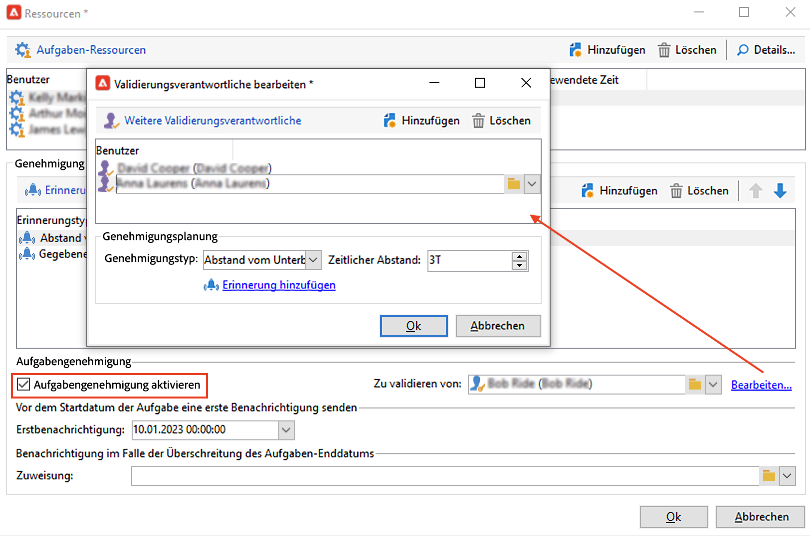

Im unteren Bereich des Konfigurationsfensters können Sie einen Validierungsplan für die Aufgabe definieren. Standardmäßig haben Validierungsverantwortliche ab dem Unterbreitungsdatum drei Tage Zeit, um die Aufgabe zu genehmigen. Sie können auch eine Erinnerung hinzufügen, die den betroffenen Benutzern automatisch vor Ablauf der Validierungsfrist zugeschickt wird.

Der Aufgabenverantwortliche kann sich die Validierung selbst zuweisen, auch wenn andere Benutzer bereits damit beauftragt wurden. Wenn kein Validierungsverantwortlicher bestimmt wurde, werden die Benachrichtigungen an den Verantwortlichen der Aufgabe gesendet. Alle anderen Adobe Campaign-Benutzenden mit **[!UICONTROL Admin]**-Berechtigungen können die Aufgabe ebenfalls genehmigen. Sie erhalten jedoch keine Benachrichtigungen.

### Referenzierte Dokumente {#documents-referenced}

Sie können einer Aufgabe [Dokumente und Marketing-Ressourcen](managing-marketing-resources.md) hinzufügen.

Um dies durchzuführen:

1. Öffnen Sie die Aufgabe und klicken Sie in der Aufgabensymbolleiste auf das Symbol **[!UICONTROL Dokumente]**.

   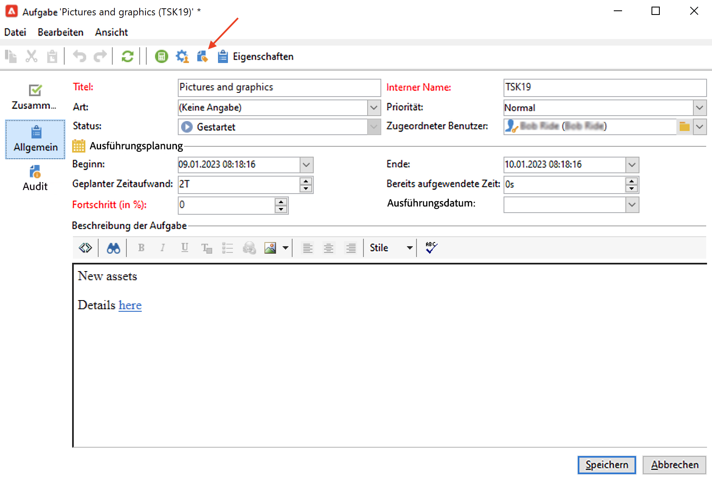

1. Klicken Sie **[!UICONTROL Hinzufügen]** und wählen Sie das Dokument aus, das Sie Ihrer Aufgabe hinzufügen möchten. Wenden Sie denselben Prozess für Marketing-Ressourcen an.

Referenzierte Dokumente werden den Benachrichtigungen hinzugefügt, die an die an der Aufgabe beteiligten Benutzer gesendet werden. Sie werden auch zum Aufgaben-Dashboard hinzugefügt.

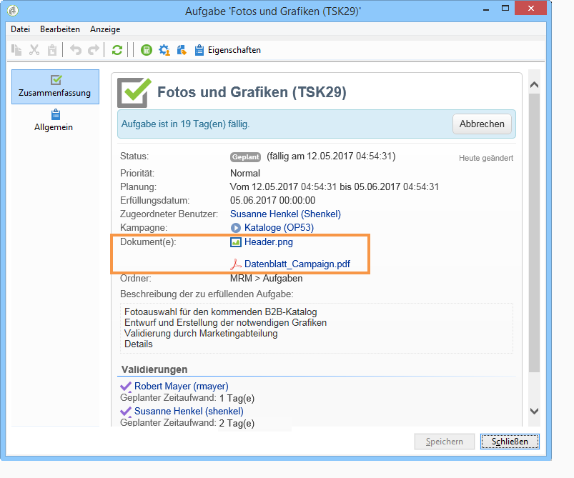

### Planung {#execution-schedule}

Der Gültigkeitszeitraum einer Aufgabe wird in den Feldern **[!UICONTROL Start]** und **[!UICONTROL Ende]** angegeben. Die geplante Belastung drückt die Arbeitslast aus, die während des Zeitraums ausgeführt werden soll. Sie wird in Tagen oder Stunden angegeben.

>[!NOTE]
>
>Der Lebenszyklus einer Aufgabe wird im Abschnitt [Lebenszyklus](#life-cycle) beschrieben.

Im Feld **[!UICONTROL Bereits aufgewendete Zeit]** kann der Fortschritt der Arbeitslast im Vergleich zum geplanten Zeitaufwand manuell aktualisiert werden. Die Angabe erfolgt ebenfalls in Stunden oder Tagen.

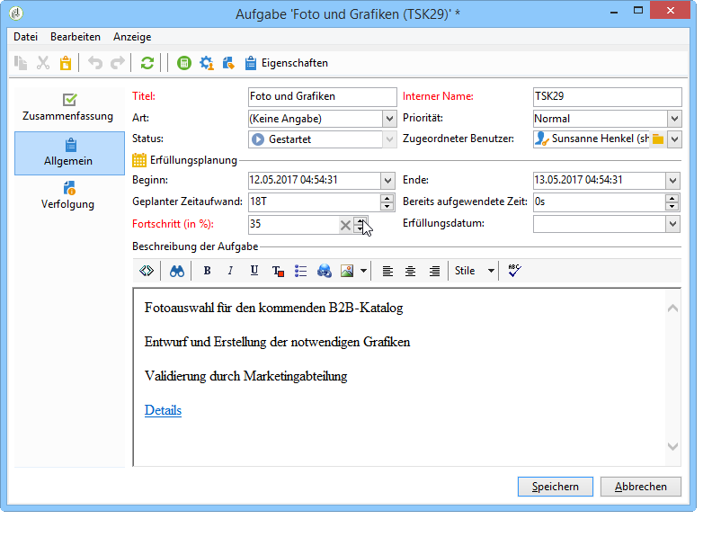

Der **[!UICONTROL Fortschrittsstatus]** der Aufgabe, ausgedrückt in Prozent, wird automatisch auf der Grundlage der Aufgaben der beteiligten Benutzer aktualisiert. Sie kann manuell eingegeben werden.

Der Fortschritt wird im Aufgaben-Dashboard angezeigt.

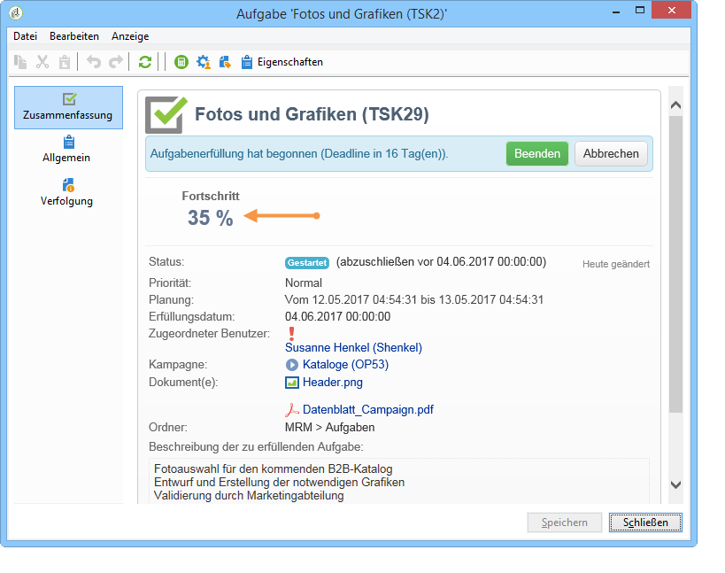

Die gleiche Information ist auch dem Kampagnen-Dashboard zu entnehmen.

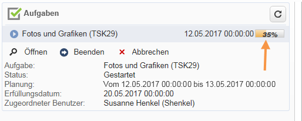

Wenn das Enddatum der Aufgabenausführungsplanung erreicht wurde, die Aufgabe jedoch nicht abgeschlossen wurde, lautet die Aufgabe **[!UICONTROL spät]**. Außerdem wird eine Warnmeldung angezeigt, die den Benutzer informiert.

Weitere Informationen hierzu finden Sie unter [Fortschritt einer Aufgabe](#progress-status-of-a-task).

### Ausgaben und Einnahmen {#expenses-and-revenues}

Für jede Aufgabe können Sie zugehörige Ausgaben und prognostizierten Umsatz definieren. Diese werden für die Kampagne, der die Aufgabe zugeordnet ist, berechnet und dann konsolidiert.

Klicken Sie zur Angabe dieser Informationen auf das Symbol **[!UICONTROL Ausgaben und Einnahmen]** in der Menüleiste der Aufgabe.

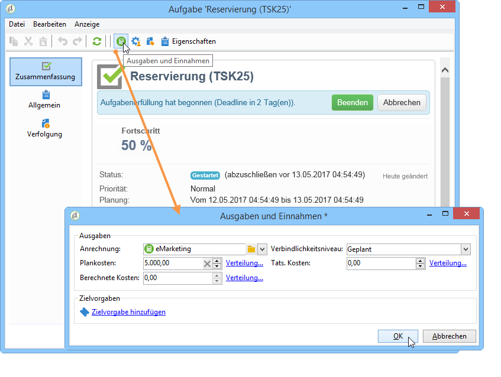

Standardmäßig wird das Budget der Kampagne belastet, der die Aufgabe zugeordnet ist. Er wird in den Aufgabendetails angezeigt.

>[!NOTE]
>
>Weitere Informationen zu Ausgaben und Budgets finden Sie in [diesem Abschnitt](../campaigns/providers-stocks-and-budgets.md#cost-commitment--calculation-and-charging).

In diesem Fenster können Sie auch die zu erreichenden Ziele definieren. Die Ziele werden in Form von prognostizierten Einnahmen für die Aufgabe ausgedrückt.

### Dienstleister {#service-providers}

Auch die Beteiligung externer Dienstleister an der Aufgabenverwaltung kann verzeichnet werden.

Bearbeiten Sie dazu die Aufgabeneigenschaften und wählen Sie den betreffenden Dienstleister aus. Die mit dem Dienstleister verbundenen Kostenkategorien werden automatisch im mittleren Bereich des Fensters aufgelistet.

Wählen Sie die Kostenkategorien für die Ausführung der Aufgabe aus. Wählen Sie dazu den Kostentyp aus und fügen Sie bei Bedarf einen zu belastenden Betrag hinzu.

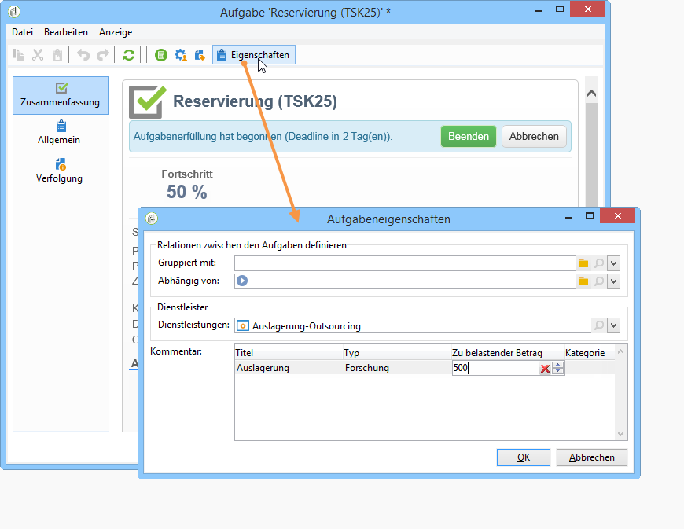

>[!NOTE]
>
>Die Verwaltung und Kontrolle von Budgets und Kosten wird im Abschnitt [Kosten kontrollieren](controlling-costs.md) beschrieben.

Jeder ausgewählte Dienstleister wird im Aufgaben-Dashboard angezeigt.

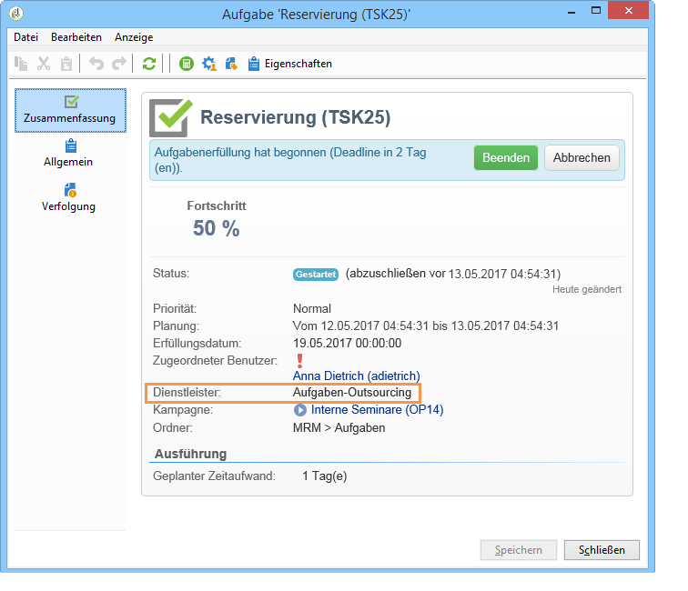

### Überfällige Aufgaben {#late-tasks}

Eine Aufgabe ist zu spät, wenn sie ihr Enddatum erreicht hat, ohne dass sich ihr Status in &quot;**[!UICONTROL &quot;]**. Standardmäßig wird kein Benutzer gewarnt, wenn eine Aufgabe in Verzug ist. Sie können den Versand einer Benachrichtigungs-E-Mail konfigurieren: Alle Benutzer können benachrichtigt werden, selbst wenn sie nicht an der Aufgabe beteiligt sind.

Wechseln Sie zum Feld **[!UICONTROL Ressourcen]** und fügen Sie den Operator zum Feld **[!UICONTROL Zuweisung]** hinzu. Um mehrere Personen zu benachrichtigen, wählen Sie eine Benutzergruppe aus.

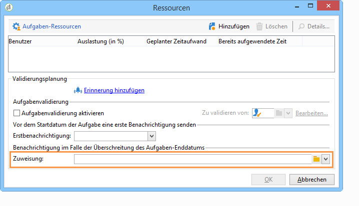

### Erstbenachrichtigungen {#initial-notifications}

Wenn Sie eine Aufgabe erstellen oder verändern, deren Beginn in der Zukunft liegt, bietet Adobe Campaign die Möglichkeit, den Verantwortlichen der Aufgabe zum gegebenen Zeitpunkt per E-Mail zu informieren.

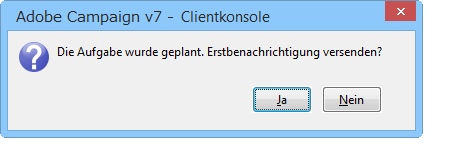

Wenn die Aufgabe, die Sie erstellen, jedoch weit entfernt ist, empfiehlt es sich möglicherweise, die Benachrichtigung zu planen, bevor die Aufgabe gestartet wird. Wenn die Aufgabe beispielsweise in einem Monat beginnt, können Sie den Verantwortlichen eine Woche vor dem Beginn benachrichtigen.

Verwenden Sie zur Programmierung dieser E-Mail das Feld **[!UICONTROL Erstbenachrichtigung]** im **[!UICONTROL Ressourcen]**-Fenster.

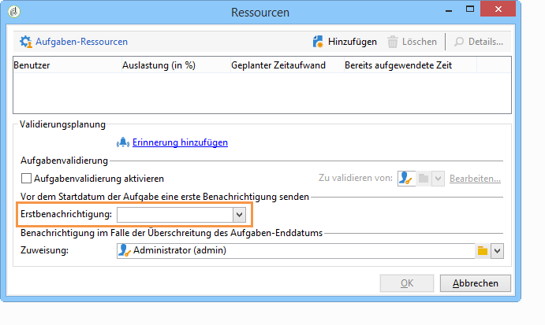

* Für Aufgaben in Kampagnen sind Datum und Uhrzeit genau festzulegen.
* Für Aufgaben in Kampagnenvorlagen wird der Benachrichtigungszeitpunkt in Form des zeitlichen Abstands vom Startdatum der Aufgabe angegeben (wenn Sie beispielsweise 2T im Feld **[!UICONTROL Erstbenachrichtigung]** eingeben, wird die E-Mail 2 Tage vor Beginn der Aufgabe gesendet).

Wenn Sie eine Benachrichtigung geplant haben, bietet Adobe Campaign beim Speichern der Aufgabe weiterhin an, eine Benachrichtigung sofort zu senden. Sie können sich entscheiden, sie zu senden, aber die geplante Benachrichtigung wird dadurch nicht ersetzt.

### Mit einem Programm verknüpfte Aufgabe {#task-linked-to-a-program}

Sie können Aufgaben direkt in einem Programm erstellen, um Aktionen zu verwalten, die sich auf ihre gesamte Organisation und nicht auf eine bestimmte Kampagne beziehen (z. B. eine Besprechung, in der das Thema bevorstehender Kampagnen innerhalb des Programms diskutiert wird). Die Aufgabe wird in der Programmplanung angezeigt.

Um eine direkt mit einem Programm verknüpfte Aufgabe zu erstellen, gehen Sie wie folgt vor:

1. Öffnen Sie den Zeitplan des Programms: Gehen Sie auf der Startseite zu **[!UICONTROL Kampagnen > Durchsuchen > Andere Optionen > Programme]**. Der gesamte Programmplan wird im rechten Bereich des Fensters geöffnet.
1. Klicken Sie im Kalender auf das gewünschte Programm. Es erscheint ein Fenster mit der Beschreibung des Programms.
1. Klicken Sie in diesem Fenster auf **[!UICONTROL Öffnen]**. Der Programmplan wird geöffnet.
1. Klicken Sie auf die Schaltfläche **[!UICONTROL Hinzufügen]** rechts über dem Kalender und wählen Sie **[!UICONTROL Aufgabe hinzufügen]** aus.

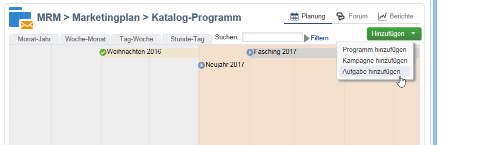

### Verfügbarkeit der Benutzer {#operator-availability}

Im Aufgaben-Dashboard zeigt ein Symbol neben dem Namen des Benutzers an, dass er während des von der Aufgabe abgedeckten Zeitraums bereits an einer anderen Aufgabe oder einem anderen Ereignis arbeitet. Die Aufgabe, für die der Benutzer verantwortlich ist oder an der er beteiligt ist, wird im Feld **[!UICONTROL Zugeordneter Benutzer]** oder im Feld **[!UICONTROL Ressourcen]** der Aufgabe angezeigt.

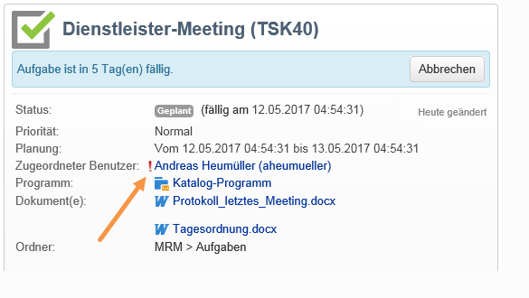

### Aufgabe in einem Workflow {#task-in-a-workflow}

Die Nutzung einer **[!UICONTROL Aufgabe]** in einem Kampagnenworkflow ermöglicht zwei unterschiedliche Szenarien, abhängig davon, ob die Aufgabe validiert wurde oder nicht.

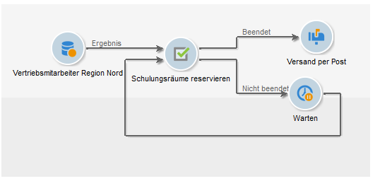

Die **[!UICONTROL Aufgabe]**-Aktivität befindet sich im Tab **[!UICONTROL Steuerung]** der Kampagnenworkflows.

## Aufgabenarten {#types-of-task}

Wenn Sie Aufgaben über eine Kampagne erstellen, können Sie bestimmte Aufgaben erstellen. Der Aufgabentyp wird in der ausgewählten Vorlage definiert.

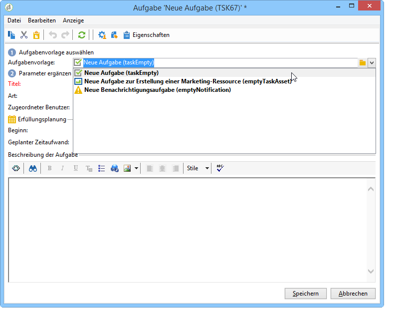

Folgende Arten von Aufgaben können geplant werden:

* [Kontrollaufgaben](#control-tasks),
* [Gruppierungsaufgaben](#grouping-task),
* [Gruppierungsaufgaben](#grouping-task),
* [Benachrichtigungsaufgaben](#notification-task).

>[!NOTE]
>
>**[!UICONTROL Kontrollaufgaben]** und **[!UICONTROL Gruppierungsaufgaben]** können **nur** über das Kampagnen-Dashboard erstellt werden.\
>Sie werden in der Aufgabenübersicht des ihnen zugeordneten Benutzers angezeigt. Siehe [Zugriff auf Aufgaben](#accessing-tasks).

### Kontrollaufgaben {#control-tasks}

**[!UICONTROL Kontrollaufgaben]** sind mit der Validierung eines Versands verbunden. Diese beinhaltet die Targeting-, Inhalts-, Extraktionsdatei-, Budget- und BAT-Validierung.

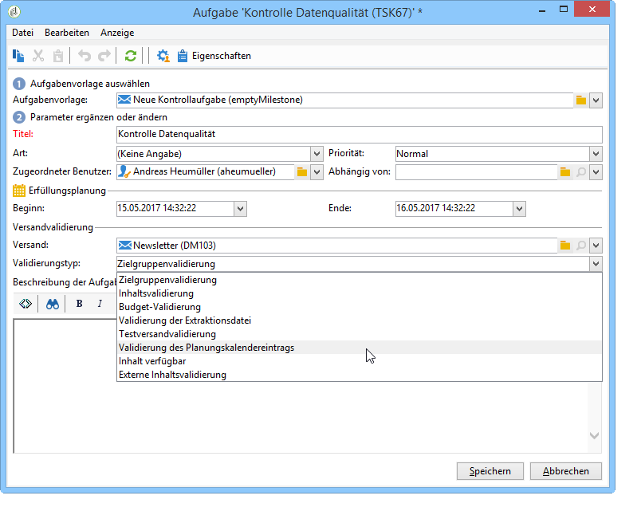

Die erstellte Aufgabe wird dem Kampagnen-Dashboard hinzugefügt.

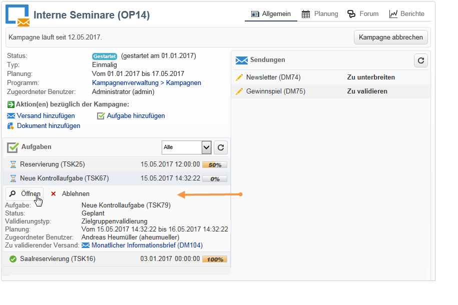

Von hier aus kann die Aufgabe konfiguriert und bearbeitet werden.

### Aufgaben zur Erstellung von Marketing-Ressourcen {#marketing-resource-creation-task}

Eine Aufgabe zur Erstellung einer Marketing-Ressource kann verwendet werden, um die Erstellung und Veröffentlichung einer Marketing-Ressource zu verwalten. Wenn Sie eine Ressource über eine Aufgabe und nicht über die Ressource selbst verwalten, können Sie:

* den Erstellungsprozess der Ressource von einer Kampagne aus steuern;
* den Erstellungsprozess der Ressource in einem Kalender verfolgen;
* die Erstellungsplanung der Ressource verwalten (Erinnungen, Benachrichtigungen);
* die mit der Erarbeitung der Ressource verbundenen Kosten erfassen und kontrollieren;
* die Ressource über die Aufgabe validieren und veröffentlichen (sofern die entsprechende Option aktiviert ist).

#### Zusammenspiel von Aufgaben und ihnen zugeordneten Ressourcen {#interaction-between-the-task-and-its-linked-resource}

Die Aufgabe zur Erstellung von Marketing-Ressourcen interagiert mit der zugehörigen Ressource. Dies bedeutet:

* Die Erarbeitungsplanung einer Ressource und die mit ihr verbundenen Kosten werden über die Aufgabe verwaltet, der sie zugordnet ist.
* Die Benutzer können wie gewohnt mit der Ressource weiterarbeiten (sie down- und uploaden, sperren und entsperren), ohne dass sich dies auf die Aufgabe auswirkt.
* Die Ressourcenvalidierung und -veröffentlichung kann über die Aufgabe durchgeführt werden: Wenn die Option **[!UICONTROL Marketing-Ressource veröffentlichen]** aktiviert ist, wird die Ressource nach Abschluss der Aufgabe automatisch genehmigt und veröffentlicht. Wenn die Option nicht aktiviert ist, interagieren die Aufgabe und die Ressource nicht: Das Handeln auf einer Seite wirkt sich nicht auf die andere aus.

  Sie können eine Reihe miteinander verbundener Aufgaben verwenden, um einen vollständigen Validierungszyklus festzulegen. Überprüfen Sie die Option **[!UICONTROL Marketing-Ressource veröffentlichen]** nur für die letzte Aufgabe: Alle Aufgaben müssen abgeschlossen sein, damit die Ressource veröffentlicht werden kann. Wenn Sie außerdem eine untergeordnete Marketing-Ressourcenaufgabe erstellen, wird die Ressource automatisch in der untergeordneten Aufgabe ausgewählt.

   * **Über die Ressource**: Wenn die Ressource validiert oder zur Validierung unterbreitet wird, hat dies keinerlei Auswirkung auf die Aufgabe.
   * **Über die Aufgabe**: Wenn die Option **[!UICONTROL Marketing-Ressource veröffentlichen]** in der Aufgabe aktiviert ist, wird die Ressource nach Abschluss der Aufgabe automatisch genehmigt und veröffentlicht (siehe oben). Wenn die Option nicht aktiviert ist, interagieren die Aufgabe und die Ressource nicht: Das Handeln auf einer Seite wirkt sich nicht auf die andere aus.

#### Aufgabe zur Erstellung einer Marketing-Ressource konfigurieren {#configuring-a-marketing-resource-creation-task}

Die Prüfung der Aufgabe und die des Inhalts der Ressource müssen nicht durch die gleiche Person erfolgen. Wenn die Option **[!UICONTROL Marketing-Ressource veröffentlichen]** aktiviert wurde (siehe unten), ist die Prüferin bzw. der Prüfer der Aufgabe berechtigt, den Inhalt der Ressource zu validieren, da beim Abschluss der Aufgabe die Ressource automatisch validiert wird. Wenn keine Prüferin und kein Prüfer bestimmt ist, fällt die Validierung der verantwortlichen Person der Aufgabe zu.

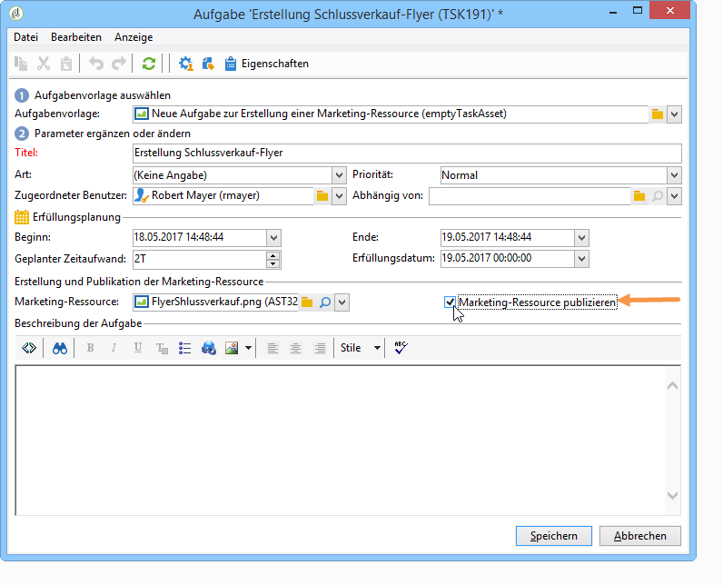

Definieren **[!UICONTROL im Feld]** Marketing-Ressource“ die Ressource, die Sie über diese Aufgabe verwalten möchten. Sie haben folgende Möglichkeiten:

* eine bereits existierende Ressource auszuwählen. Die Dropdown-Liste schlägt alle Ressourcen mit dem Status **[!UICONTROL In Bearbeitung]** vor.
* eine Ressource zu erstellen. Klicken Sie hierzu auf das Symbol **[!UICONTROL Verknüpftes Element auswählen]** und anschließend auf das Symbol **[!UICONTROL Erstellen]**.

Die Option **[!UICONTROL Marketing-Ressource veröffentlichen]** ermöglicht die automatische Veröffentlichung einer Ressource: Wenn die Aufgabe **[!UICONTROL Abgeschlossen]** ist, ändert sich der Status der Ressource automatisch in **[!UICONTROL Veröffentlicht]**, auch wenn diese weder validiert noch zur Validierung unterbreitet wurde. Dies gilt auch dann, wenn der Validierer der Aufgabe nicht dem Validierer des Ressourceninhalts entspricht.

Die Schaltfläche **[!UICONTROL Ressource veröffentlichen]** ist verfügbar und der Validierer für die Veröffentlichung der Ressource erhält eine Benachrichtigungs-E-Mail, die ihn darüber informiert, dass die Ressource zur Veröffentlichung bereit ist. Auf der Registerkarte **[!UICONTROL Bearbeiten > Tracking]** werden die Überprüfung und Veröffentlichung durch den Aufgabenvalidierer angezeigt. Wenn ein Nachbearbeitungs-Workflow für Ressourcen definiert wurde, wird er jetzt ausgeführt.

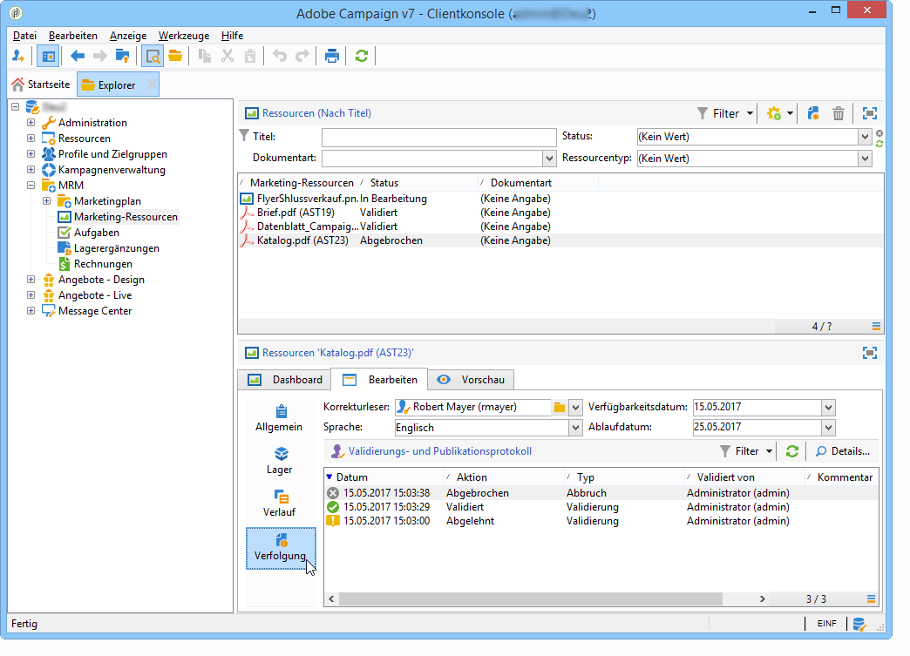

### Gruppenaufgabe {#grouping-task}

**[!UICONTROL Gruppierungsaufgaben]** ermöglichen es, die Verwaltung des Fortschritts und der Validierung verschiedener Aufgaben zu synchronisieren.

Gruppierungsaufgaben haben weder Ausgaben noch mit ihnen verbundene Ressourcen.

Alle Aufgaben, die zu einer Gruppierungsaufgabe gruppiert sind, werden in ihrem eigenen Dashboard angezeigt. Auf diese Weise können Sie die Liste der Aufgaben so filtern, dass nur die Aufgaben angezeigt werden, die Sie interessieren.

Gruppierungsaufgaben verfügen über einen Link, der die Erstellung von enthaltenen Aufgaben erleichtert.

Um innerhalb einer Gruppierungsaufgabe direkt weitere Aufgaben zu erstellen, klicken Sie im Kampagnen-Dashboard auf die Schaltfläche **[!UICONTROL Aufgabe hinzufügen]**.

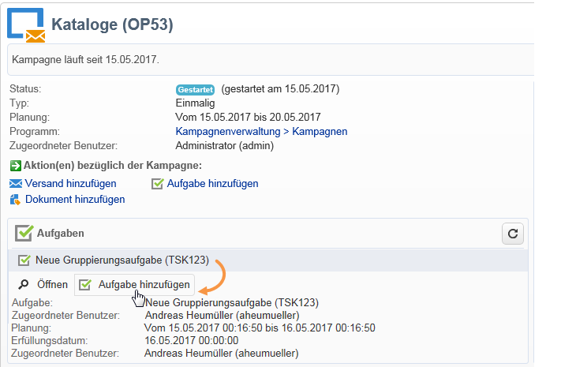

Eine bereits erstellte Aufgabe kann einer Gruppierungsaufgabe über das Feld **[!UICONTROL Gruppiert mit]** im Fenster **[!UICONTROL Eigenschaften]** der zu gruppierenden Aufgabe zugeordnet werden.

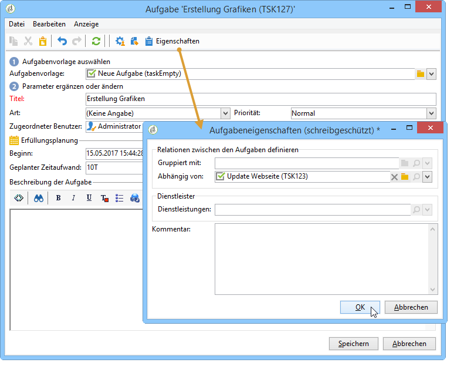

### Benachrichtigungsaufgaben {#notification-task}

Mit Benachrichtigungsaufgaben können Sie den Versand von E-Mails (an einen Benutzer, eine Benutzergruppe, einen Dienstleister usw.) planen. Auf diese Weise können Sie Erinnerungen planen, um beispielsweise jemanden zu benachrichtigen, dass eine Kampagne bald beendet wird, oder Dokumente senden, bevor eine Kampagne gestartet wird, damit die Benutzer sie vorbereiten können. Auf diese Weise können Sie Ihre Nachrichten innerhalb Ihrer Kampagne oder Ihres Programms verfolgen und die durchgeführten Aktionen genauer im Auge behalten.

#### Lebenszyklus {#life-cycle}

Benachrichtigungsaufgaben erfordern keine Genehmigung. Dies bedeutet, dass ihr Lebenszyklus einfacher ist als der einer Standardaufgabe:

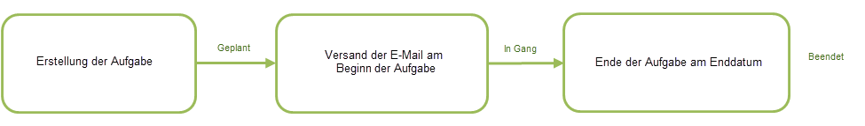

Eine Benachrichtigungsaufgabe kann folgende Status haben:

* **[!UICONTROL Geplant]**, wenn die E-Mail noch nicht versandt wurde;
* **[!UICONTROL Gestartet]**, wenn die E-Mail versandt, das Enddatum jedoch noch nicht erreicht ist;
* **[!UICONTROL Abgeschlossen]**, wenn das Enddatum erreicht ist.

#### Konfiguration {#configuration}

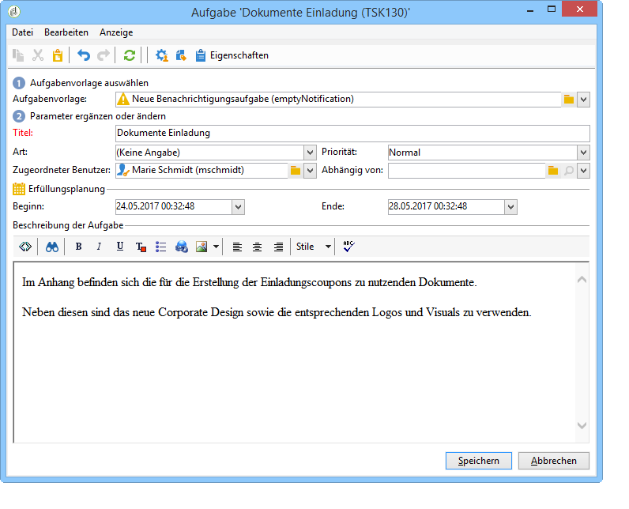

Bei der Erstellung müssen folgende Elemente der Aufgabe eingegeben werden:

* **[!UICONTROL Zugewiesen an]**: Der Benutzer oder die Benutzergruppe, der/die die E-Mail erhalten wird. Wenn Sie die Aufgabe nach dem Versand der E-Mail erneut zuweisen, wird die E-Mail nicht an den neuen Benutzer gesendet (dazu müssen Sie die Aufgabe neu initialisieren und ihr Startdatum ändern).
* **Startdatum der**: Datum, an dem die Benachrichtigungs-E-Mail gesendet wird. Dieses Datum muss zum Zeitpunkt der Aufzeichnung der Aufgabe in der Zukunft liegen.
* **Enddatum der Aufgabe**: Datum, an dem der Aufgabenstatus zu &quot;**[!UICONTROL &quot;]**. Standardmäßig ist das Enddatum mit dem Startdatum identisch. Wenn Sie der Aufgabe jedoch eine Dauer zuweisen, können Sie die Zeit symbolisieren, die der Benutzer im Zeitplan verbringen muss, falls erforderlich.
* **[!UICONTROL Beschreibung]**: Der hier eingegebene Text erscheint im Hauptteil der Benachrichtigungs-E-Mail.

  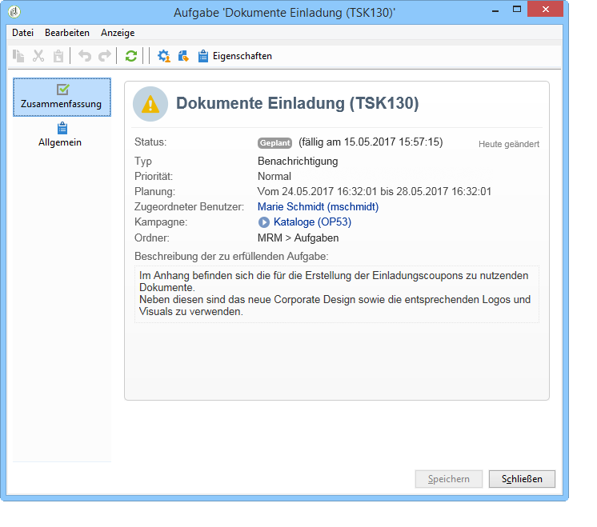

Sie können der Aufgabe und der Benachrichtigungs-E-Mail einen Anhang hinzufügen. Klicken Sie hierzu auf das Symbol **[!UICONTROL Dokumente]** in der Symbolleiste in der rechten oberen Ecke.

## Lebenszyklus {#life-cycle-1}

### Relationen zwischen Aufgaben {#links-between-tasks}

Mit der Schaltfläche **[!UICONTROL Eigenschaften]** in den Aufgaben können Sie die Verknüpfungen zwischen Aufgaben in einer Kampagne definieren. Sie können Aufgaben mithilfe einer Gruppenaufgabe in Unteraufgaben aufteilen (siehe [Gruppierung von Aufgaben &#x200B;](#linked-tasks)) oder Abhängigkeiten zwischen den Aufgaben definieren (siehe [Abhängigkeit von Aufgaben](#grouping-tasks)).

#### Gruppierung von Aufgaben {#linked-tasks}

Verwenden Sie das Feld **[!UICONTROL Verknüpfte Aufgabe]**, um Aufgaben einer Gruppierungsaufgabe zuzuordnen. Siehe [Aufgabenarten](#types-of-task).

Im folgenden Beispiel wird die Validierung der Zielgruppenbestimmung in vier Unteraufgaben aufgeteilt.

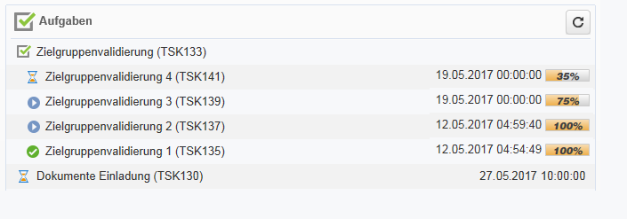

Jede Unteraufgabe ist eine Standardaufgabe, die mit der Hauptaufgabe verknüpft ist.

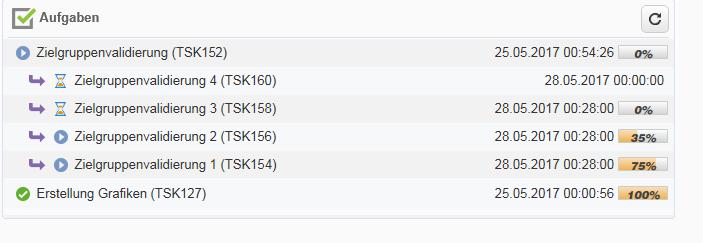

#### Gruppenaufgaben {#grouping-tasks}

Verwenden Sie das Feld **[!UICONTROL Abhängig von]**, um die Erfüllung einer Aufgabe von der einer anderen abhängig zu machen.

Die Abhängigkeit zwischen den Aufgaben wird mithilfe von Pfeilen im Kampagnen-Dashboard dargestellt.

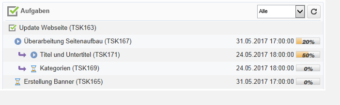

Bei gruppierten Aufgaben weist Adobe Campaign der untergeordneten Aufgabe automatisch das Enddatum der übergeordneten Aufgabe als Startdatum zu. Wenn beispielsweise eine Aufgabe **Einladung erstellen** am 15. Oktober um :30PM endet, beginnt die untergeordnete Aufgabe **Einladungs-E-Mail senden** am 15. Oktober um 3 :30PM.

Wenn Sie das Ende einer übergeordneten Aufgabe verschieben, werden bestimmte ihrer untergeordneten Aufgaben dadurch ebenfalls verschoben: Es handelt sich hierbei um untergeordnete Aufgaben mit dem Status **[!UICONTROL Geplant]** deren Beginndatum vor dem neuen Enddatum der übergeordneten Aufgabe liegt. Die Dauer der Aufgabe bleibt gleich. Wenn das Startdatum einer untergeordneten Aufgabe nach dem neuen Enddatum der übergeordneten Aufgabe liegt, ist die untergeordnete Aufgabe nicht betroffen.

**Beispiel**

Eine übergeordnete Aufgabe, deren Ende für den 9. Oktober um 17 Uhr geplant ist, hat zwei Unteraufgaben: Aufgabe A und Aufgabe B. Der Beginn von Aufgabe A ist für den 10. Oktober um 14 Uhr, der von Aufgabe B für den 12. Oktober um 8 Uhr geplant.

Verschieben wir die übergeordnete Aufgabe: Sie endet nun am 11. Oktober um 13 Uhr. Nur Aufgabe A wird verschoben und beginnt am 11. Oktober um 13 Uhr.

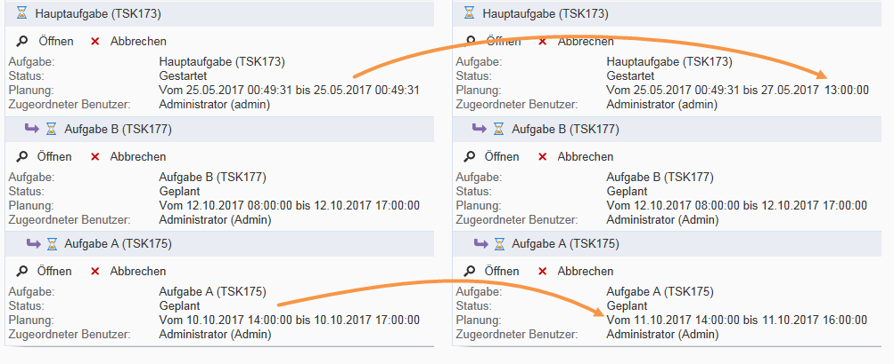

### Ausführungsstatus einer Aufgabe {#execution-status-of-a-task}

Aufgabenstatus können in der Aufgabenkarte angezeigt werden. Der Ausführungsstatus einer Aufgabe wird entsprechend den Benutzeraktionen automatisch aktualisiert.

Eine Aufgabe kann folgende Status haben: **[!UICONTROL Geplant]**, **[!UICONTROL Gestartet]**, **[!UICONTROL Abgeschlossen]**, **[!UICONTROL Abgebrochen]**, **[!UICONTROL Validierung ausstehend]** und **[!UICONTROL Abgelehnt]**.

* Wenn eine Aufgabe erstellt wird **[!UICONTROL wird sie]**, wenn ihr Startdatum in der Zukunft liegt. Er behält diesen Status, bis sein Startdatum erreicht ist.
* Nach dem Start ist die Aufgabe **[!UICONTROL In Bearbeitung]**. Wenn die verantwortliche Person die Aufgabe schließt, ändert sie sich zu **[!UICONTROL Abgeschlossen]**.
* Wurde eine Prüferin oder ein Prüfer bestimmt, erhält die Aufgabe den Status **[!UICONTROL Validierung ausstehend]**, sobald sie von der verantwortlichen Person geschlossen wird und bis sie durch die Prüferin bzw. den Prüfer validiert wird. Wenn die Prüferin bzw. der Prüfer die Aufgabe ablehnt, hat sie den Status **[!UICONTROL Abgelehnt]**.
* Eine Aufgabe kann von ihrem Verantwortlichen über das Aufgaben-Dashboard oder die **[!UICONTROL Aufgabenübersicht]** durch Klick auf die Schaltfläche **[!UICONTROL Abbrechen]** abgebrochen werden.
* Um eine Aufgabe zu planen, geben Sie ein Startdatum in der Zukunft ein. Anschließend können Sie eine erste Benachrichtigung an die Adobe Campaign-Benutzer senden, die an der Ausführung der Aufgabe beteiligt sind. Siehe [Vollständiger Lebenszyklus einer Aufgabe](#complete-task-life-cycle).

>[!NOTE]
>
>* Der Status der Aufgabe wird automatisch aktualisiert.
>* Selbst wenn die Gültigkeitsdauer abgeschlossen ist, werden Aufgaben, die nicht geschlossen wurden, weiterhin in der Liste der laufenden Aufgaben angezeigt. Benutzende werden durch eine Warnung darauf hingewiesen, dass die Aufgabe in Verzug ist.
>

### Fortschritt einer Aufgabe {#progress-status-of-a-task}

Zusätzlich zum Ausführungsstatus kann eine Aufgabe mit einem Fortschrittsstatus verknüpft werden: **[!UICONTROL Verspätet]**, **[!UICONTROL Zu genehmigen]**, **[!UICONTROL Zu heute]** oder **[!UICONTROL Zu erledigen diese Woche]**. Diese Informationen werden automatisch entsprechend der Aufgabenplanung eingegeben.

Sie können die Liste der Aufgaben nach Erfüllungs- oder Fortschrittstatus filtern.

Weitere Informationen hierzu finden Sie unter [Zugriff auf Aufgaben &#x200B;](#accessing-tasks).

### Vollständiger Lebenszyklus einer Aufgabe {#complete-task-life-cycle}

Im Folgenden werden die Etappen des vollständigen Zyklus einer Aufgabe dargestellt, für die der Verantwortliche beteiligte und validerende Benutzer festgelegt hat.

1. Die verantwortliche Person erstellt die Aufgabe und gibt die verschiedenen Felder ein. Weitere Informationen hierzu finden Sie unter [Neue Aufgabe erstellen](#creating-a-new-task).

   Bei Erstellung und Änderung einer **in der Zukunft geplanten** Aufgabe (das Startdatum der Aufgabe darf noch nicht erreicht sein) können der Verantwortliche sowie alle Beteiligten per E-Mail über die Planung einer neuen Aufgabe informiert werden.

   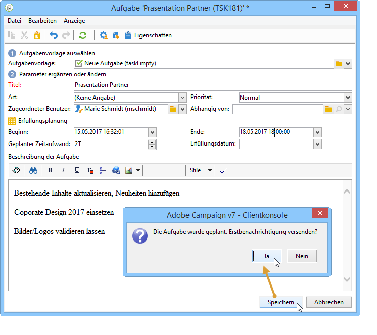

   Um diese erste Benachrichtigung zu senden, klicken Sie auf **[!UICONTROL Ja]**. Diese Benachrichtigung informiert sie über die nächste Aufgabe und enthält Details zum Inhalt und zur Anzahl der Tage bis zum Fristablauf.

   Eine in der Zukunft geplante Aufgabe erhält bei ihrer Erstellung den Status **[!UICONTROL Geplant]**.

1. Wenn das Startdatum der Aufgabe erreicht ist, werden die verantwortliche Person und die Beteiligten mit einer E-Mail hiervon in Kenntnis gesetzt. Der Status ändert sich in **[!UICONTROL In Bearbeitung]**.
1. Wenn ein Beteiligter seinen Teil der Aufgabe abgeschlossen hat, kann er die Aufgabe auf zweierlei Weisen erfüllen:

   * über die Benachrichtigungs-E-Mail;
   * im Dashboard der Aufgabe über die Client-Konsole oder die Web-Schnittstelle.

     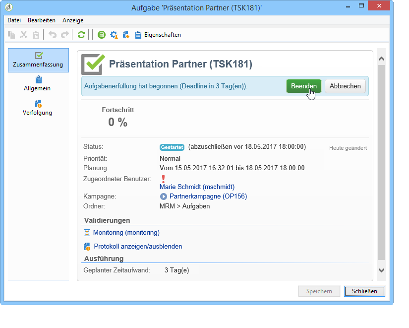

1. Nach jeder neuen Validierung wird der Fortschritt der Aufgabe automatisch aktualisiert.

   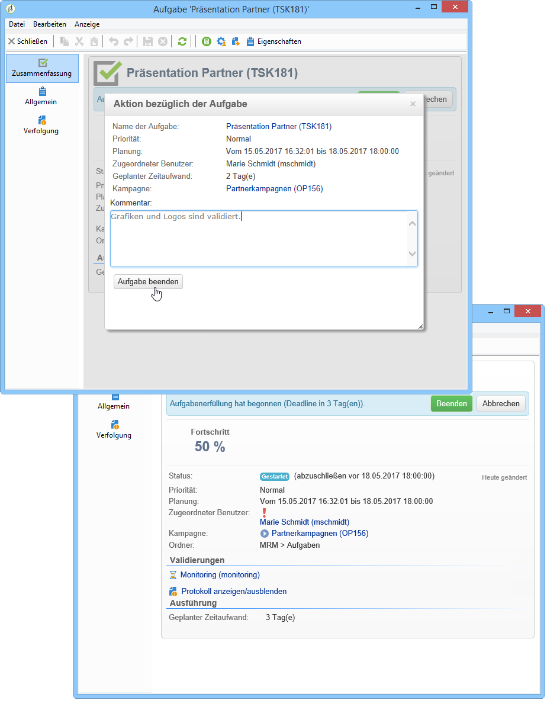

1. Der validierende Benutzer wird jedes Mal per E-Mail benachrichtigt, wenn ein Benutzer einen dem validierenden Benutzer zugewiesenen Abschnitt fertigstellt.

   Er kann den Fortschritt der Aufgabe im Aufgaben-Dashboard verfolgen.

   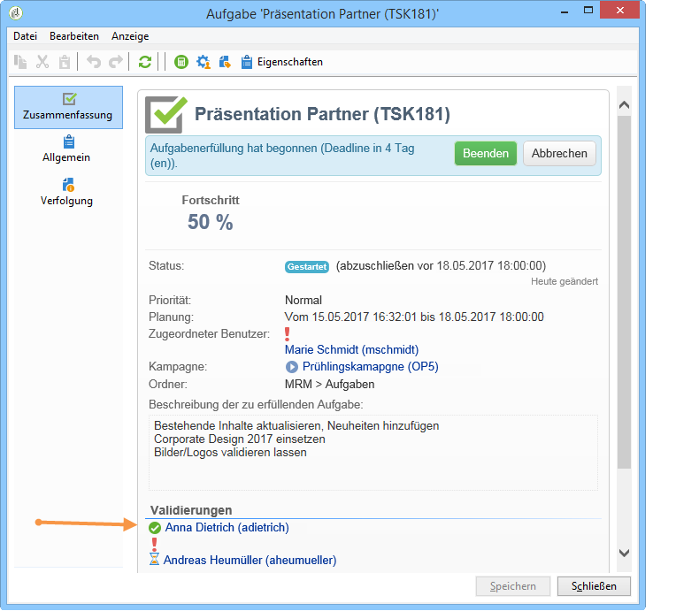

1. Wenn der Verantwortliche die Aufgabe als abgeschlossen erachtet, kann er sie entweder über die Benachrichtigungs-E-Mail, die er zu Beginn der Aufgabe erhalten hat, über die Client-Konsole oder über die Web-Schnittstelle schließen.

   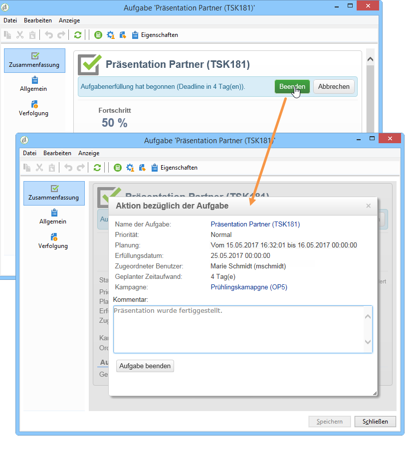

   >[!NOTE]
   >
   >Der Verantwortliche einer Aufgabe kann sie jederzeit schließen, auch wenn Genehmigungen fehlen. Der Fortschrittsstatus ändert sich automatisch in 100 %.

1. Die Aufgabe erhält damit den Status **[!UICONTROL Zu validieren]** und der Validierer wird benachrichtigt.

   Sie genehmigen die Aufgabe über die Benachrichtigungs-E-Mail, die Client-Konsole oder die Web-Schnittstelle.

   Er kann das Kampagnen-Dashboard zur Validierung nutzen:

   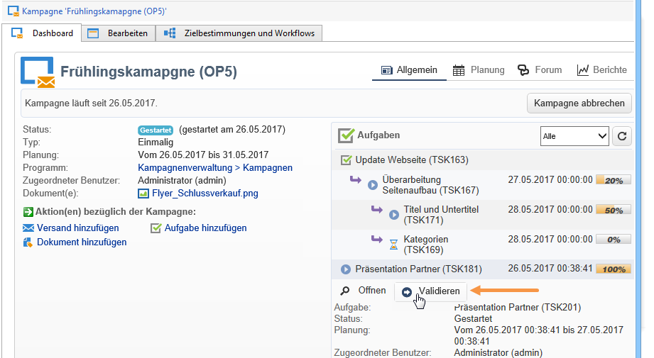

   Er kann die Aufgabe auch direkt über deren Validierungsschaltfläche validieren:

   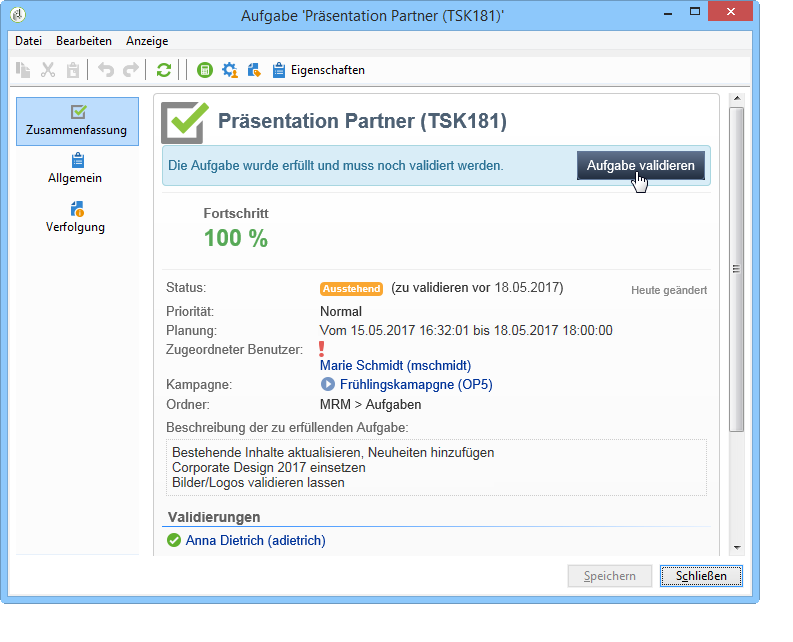

   >[!NOTE]
   >
   >Die Aufgabe erhält den Status **[!UICONTROL Zu validieren]** nur, wenn die Option **[!UICONTROL Aufgabenvalidierung aktivieren]** im **[!UICONTROL Ressourcen]**-Fenster der Aufgabe aktiviert wurde.\
   >Wenn der Validierer die Aufgabe ablehnt, wird ihr Status zu **[!UICONTROL Abgelehnt]** und der Aufgabenzyklus beginnt automatisch von vorn.

1. Der Aufgabenstatus ändert sich in &quot;**[!UICONTROL &quot;]**. An alle Beteiligten wird eine Benachrichtigung gesendet.

   >[!NOTE]
   >
   >Nach Abschluss einer Aufgabe kann ihr Lebenszyklus von der verantwortlichen Person neu initialisiert werden. Öffnen Sie hierzu die Aufgabe und klicken Sie auf den Link **[!UICONTROL Aufgabe zurücksetzen, um sie erneut auszuführen…]** unten im Dashboard.
