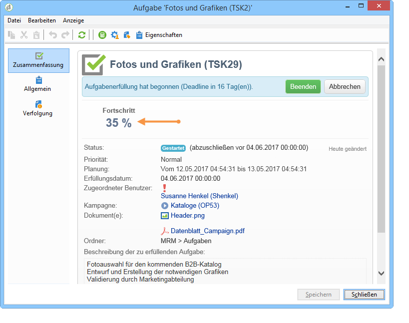
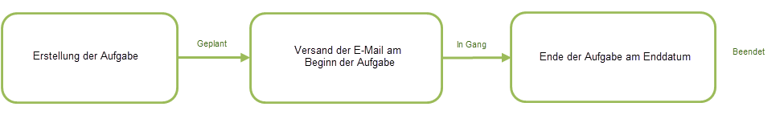
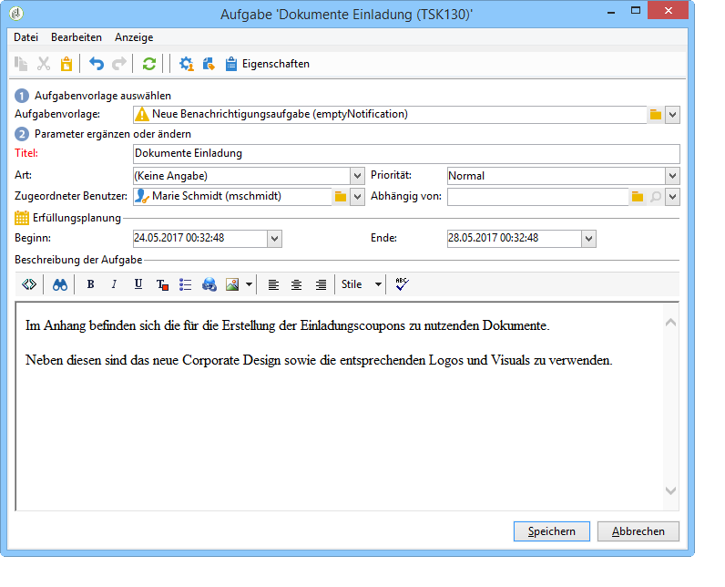
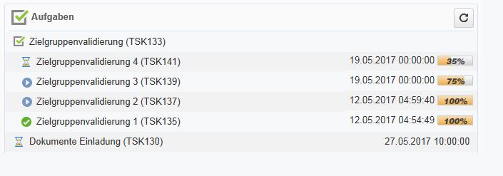

# Aufgaben erstellen und verwalten{#creating-and-managing-tasks}

Adobe Campaign ermöglicht die Erstellung von Aufgaben sowie die Verwaltung ihres gesamten Lebenszyklus innerhalb der Anwendung selbst. Die Ausführung von Programmen und Kampagnen kann in Aufgaben unterteilt werden, die Adobe-Campaign-Benutzern oder externen Dienstleistern zugeordnet werden. Dank dieser Funktionsweise ist eine reibungslose Zusammenarbeit aller internen und externen Projektbeteiligten möglich.

Die Aufgaben können in der Aufgabenliste und über das Dashboard einer Kampagne erstellt, angesehen und verfolgt werden. Ansicht und Verfolgung sind darüber hinaus auch in den Marketingplan-, Programm- und Kampagnenkalendern möglich.

Aufgaben werden Kampagnen zugeordnet und können von anderen Aufgaben abhängig sein. Jede Aufgabe weist einen Status, eine Priorität, einen geplanten Zeitaufwand sowie eventuell verbundene Kosten auf.

Alle Aufgaben sind in einer Liste gruppiert, auf die über den Tab **Kampagnen** zugegriffen werden kann. Weitere Informationen hierzu finden Sie unter [Zugriff auf Aufgaben](#accessing-tasks).

Sie können auch im Kalender des Programms, dem sie angehören, angezeigt werden.

## Zugriff auf Aufgaben {#accessing-tasks}

### Aufgaben anzeigen {#displaying-tasks}

Eine Liste der Aufgaben kann über den Tab **[!UICONTROL Kampagnen]** angezeigt werden.

Sie können alle Aufgaben des aktuellen Benutzers anzeigen.

Weitere Informationen hierzu finden Sie unter [Ausführungsstatus einer Aufgabe](#execution-status-of-a-task) und [Fortschritt einer Aufgabe ](#progress-status-of-a-task).

### Aufgaben filtern {#filtering-tasks}

Wenn Sie diese Ansicht anzeigen, wird sie automatisch gefiltert, um nur die **aktuelle Operatoraufgaben**. Sie können die Aufgaben auch mithilfe der Felder im oberen Bereich des Fensters filtern.

### Aufgaben bearbeiten {#editing-tasks}

Klicken Sie auf eine Aufgabe, um sie zu bearbeiten.

## Neue Aufgabe erstellen {#creating-a-new-task}

Gehen Sie wie folgt vor, um eine Aufgabe zu erstellen:

1. Navigieren Sie zum **[!UICONTROL Aufgaben]** im **[!UICONTROL Kampagnen]** Registerkarte und klicken Sie auf **[!UICONTROL Erstellen]**.

   

1. Geben Sie den Namen der Aufgabe ein und wählen Sie die Kampagne aus, mit der sie verknüpft ist.
1. Legen Sie das Start- und Enddatum fest.
1. Klicken Sie anschließend auf **[!UICONTROL Speichern]**, um die Aufgabe zu erstellen.

   

Aufgaben können zudem über das Dashboard einer Kampagne erstellt werden: In diesem Fall werden sie automatisch der Kampagne zugeordnet, über die sie erstellt wurden.

Nachdem eine Aufgabe erstellt wurde, wird sie zum Kampagnenkalender, zum Kampagnen-Dashboard und zur Aufgabenliste hinzugefügt. Um eine Aufgabe zu bearbeiten, klicken Sie in der Aufgabenliste auf ihren Namen oder wählen Sie sie im Zeitplan- oder Kampagnen-Dashboard aus und klicken Sie auf **[!UICONTROL Öffnen]**.

Nach der Erstellung können Sie die Aufgabe konfigurieren, indem Sie Folgendes definieren:

* Manager und Teilnehmer. [Weitere Informationen](#manager-and-participants)
* Der Erstellungsplan. [Weitere Informationen](#execution-schedule)
* Mittelbindungen. [Weitere Informationen](#expenses-and-revenues)

Sie können auch [validierungsverantwortliche Benutzer](#reviewers) und [Referenzdokumente](#documents-referenced).

Der Lebenszyklus einer Aufgabe wird im Abschnitt [diesem Abschnitt](#life-cycle).

### Verantwortlicher und Teilnehmer {#manager-and-participants}

Die Aufgabe wird standardmäßig dem Benutzer zugewiesen, der sie erstellt hat. Dieser Benutzer wird benachrichtigt, wenn für diese Aufgabe eine Aktion erforderlich ist.

Sie können einen anderen Operator aus dem **[!UICONTROL Zugeordnet zu]** Dropdown-Liste.

>[!NOTE]
>
>Die Benutzerverwaltung wird im Abschnitt [diesem Abschnitt](../../v8/start/gs-permissions.md).
>
>Nur der für eine Aufgabe verantwortliche Benutzer darf diese schließen.

Sie können mehr Benutzer angeben, die an der Ausführung der Aufgabe beteiligt sind. Diese Benutzer dürfen die Aufgabe nicht schließen: sie dürfen nur die ihnen zugewiesene Aufgabe validieren.

Gehen Sie wie folgt vor, um Aufgabenoperatoren hinzuzufügen:

1. Klicken Sie auf **[!UICONTROL Ressourcen]** in der Symbolleiste der Aufgabe.

   

1. Klicken **[!UICONTROL Hinzufügen]** und wählen Sie die betroffenen Benutzer aus.
1. Geben Sie die Nutzungsrate ein: Dies entspricht dem Arbeitsaufwand, der dem Benutzer für die Dauer der Aufgabenausführung zugewiesen wurde. Dieser Satz ist nur ein Hinweis und wird in Prozent ausgedrückt.

   

   Beispiel: Für eine Aufgabe wird eine Erfüllungsplanung von 10 Tagen festgelegt und einem Benutzer eine Auslastung von 50 % zugewiesen. Der Benutzer wird demnach für eine Dauer von 10 Tagen während der Hälfte seiner Arbeitszeit für die Aufgabenerfüllung eingesetzt.

   Zudem ist es möglich, für jeden Benutzer einen geplanten sowie einen realisierten Arbeitsaufwand festzulegen. Diese Angaben dienen ebenfalls nur informativen Zwecken.

1. Sie können eine Erinnerung aus dem **[!UICONTROL Erinnerung hinzufügen...]** Link. Alle an der Aufgabe beteiligten Benutzer werden vor ihrem Enddatum per E-Mail benachrichtigt.

   

1. Sie können auch eine Benachrichtigung senden, bevor die Aufgabe gestartet wird. Um dies einzurichten, wählen Sie das Datum im **[!UICONTROL Erstbenachrichtigung]** -Feld.
1. Wenn das Enddatum erreicht ist und die Aufgabe nicht geschlossen wird, kann eine Benachrichtigung an den Bevollmächtigten oder die Gruppe von Bevollmächtigten gesendet werden, die in der Variablen **[!UICONTROL Bevollmächtigter]** Dropdown-Liste.

Über das Benutzer-Dashboard kann dessen Arbeitslast, d.h. seine anderen Aufgaben, eingesehen werden.

### Aufgabenvalidierung {#reviewers}

Neben den Teilnehmern können Sie auch Benutzer definieren, die die Aufgabe nach Abschluss überprüfen.

Klicken Sie dazu auf die Schaltfläche **[!UICONTROL Aufgabenvalidierung aktivieren]** im unteren Bereich der **[!UICONTROL Ressourcen]** Fenster. Dabei kann es sich um einen einzelnen Benutzer, eine Benutzergruppe oder eine Benutzerliste handeln.

Um eine Benutzerliste zu erstellen, klicken Sie auf den Link **[!UICONTROL Bearbeiten...]** rechts von dem Feld, in dem der erste Validierungsverantwortliche angegeben wird. Fügen Sie nun so viele zusätzliche Benutzer wie nötig hinzu, wie im folgenden Beispiel:

Im unteren Bereich des Konfigurationsfensters können Sie einen Validierungsplan für die Aufgabe definieren. Standardmäßig haben die Validierer drei Tage ab dem Sendedatum Zeit, um die Aufgabe zu genehmigen. Sie können auch eine Erinnerung hinzufügen, die den betroffenen Benutzern automatisch vor Ablauf der Validierungsfrist zugeschickt wird.

Der Aufgabenverantwortliche kann die Validierung selbst vornehmen, selbst wenn andere Benutzer hierfür bereits zugewiesen wurden. Wenn kein validierungsverantwortlicher Benutzer definiert wurde, werden die Benachrichtigungen an den Aufgabenverantwortlichen gesendet. Alle anderen Adobe Campaign-Operatoren mit **[!UICONTROL Administrator]** -Berechtigungen können auch die Aufgabe validieren. Sie erhalten jedoch keine Benachrichtigungen.

### Referenzierte Dokumente {#documents-referenced}

Sie können [Dokumente und Marketing-Ressourcen](managing-marketing-resources.md) einer Aufgabe.

Um dies durchzuführen:

1. Öffnen Sie die Aufgabe und klicken Sie auf die **[!UICONTROL Dokumente]** in der Symbolleiste der Aufgabe.

   

1. Klicken Sie auf **[!UICONTROL Hinzufügen]** und wählen Sie das Dokument aus, das Sie Ihrer Aufgabe hinzufügen möchten. Gehen Sie für die Marketing-Ressourcen genauso vor.

Referenzierte Dokumente werden den Benachrichtigungen hinzugefügt, die an die an der Aufgabe beteiligten Benutzer gesendet werden. Sie werden auch zum Aufgaben-Dashboard hinzugefügt.

### Planung {#execution-schedule}

Der Gültigkeitszeitraum der Aufgabe wird in den Feldern **[!UICONTROL Beginn]** und **[!UICONTROL Ende]** angegeben. Der geplante Zeitaufwand präzisiert die in diesem Zeitraum für die Aufgabe aufzuwendende Arbeitszeit in Stunden oder Tagen.

>[!NOTE]
>
>Der Lebenszyklus einer Aufgabe wird im Abschnitt [Lebenszyklus](#life-cycle) beschrieben.

Im Feld **[!UICONTROL Bereits aufgewendete Zeit]** kann der Fortschritt der Arbeitslast im Vergleich zum geplanten Zeitaufwand manuell aktualisiert werden. Die Angabe erfolgt ebenfalls in Stunden oder Tagen.

Der in Prozent ausgedrückte **[!UICONTROL Fortschritt]** der Aufgabe wird automatisch aktualisiert, entsprechend den von den beteiligten Benutzern ausgeführten Aufgaben. Er kann auch manuell eingegeben werden.

Der Fortschritt wird im Aufgaben-Dashboard angezeigt.

Die gleiche Information ist auch dem Kampagnen-Dashboard zu entnehmen.

Wenn das Enddatum der Erfüllungsplanung erreicht und die Aufgabe nicht beendet ist, ist die Aufgabe **[!UICONTROL überfällig]**. Zudem weist eine Warnmeldung die Benutzer auf die Verspätung hin.

Weitere Informationen hierzu finden Sie unter [Fortschritt einer Aufgabe](#progress-status-of-a-task).

### Ausgaben und Einnahmen {#expenses-and-revenues}

Für jede Aufgabe können verbundene Ausgaben und geplante Einnahmen festgelegt werden. Diese werden berechnet und dann in der Kampagne konsolidert, der die Aufgabe zugeordnet ist.

Klicken Sie zur Angabe dieser Informationen auf das Symbol **[!UICONTROL Ausgaben und Einnahmen]** in der Menüleiste der Aufgabe.

Standardmäßig entspricht das in den Aufgabendetails angezeigte Budget dem der Kampagne, der die Aufgabe zugeordnet ist.

>[!NOTE]
>
>Weitere Informationen zu Ausgaben und Budgets finden Sie unter [diesem Abschnitt](../campaigns/providers--stocks-and-budgets.md#cost-commitment--calculation-and-charging).

Im gleichen Fenster besteht die Möglichkeit, zu erfüllende Zielvorgaben festzulegen. Die Vorgaben entsprechend den geplanten Einnahmen der Aufgabe.

### Dienstleister {#service-providers}

Auch die Beteiligung externer Dienstleister an der Aufgabenverwaltung kann verzeichnet werden.

Öffnen Sie hierzu die Aufgabeneigenschaften und wählen Sie den entsprechenden Dienstleister aus. Die mit dem Dienstleister verbundenen Kostenkategorien werden automatisch im mittleren Abschnitt des Fensters aufgelistet.

Wählen Sie die im Zusammenhang mit der Aufgabe anfallenden Kostenkategorien aus. Geben Sie hierzu den Kostentyp an und fügen Sie gegebenenfalls einen zu belastenden Betrag hinzu.

>[!NOTE]
>
>Die Verwaltung und Kontrolle von Budgets und Kosten wird im Abschnitt [Kosten kontrollieren](controlling-costs.md) beschrieben.

Jeder ausgewählte Dienstleister wird im Aufgaben-Dashboard angezeigt.

### Überfällige Aufgaben {#late-tasks}

Eine Aufgabe ist überfällig, wenn sie beim Erreichen ihres Enddatums nicht den Status **[!UICONTROL Abgeschlossen]** hat. Standardmäßig wird kein Benutzer benachrichtigt, wenn eine Aufgabe überfällig ist. Es können jedoch Benachrichtungs-E-Mails konfiguriert werden, auch für Benutzer, die nicht an der Aufgabe beteiligt sind.

Wählen Sie im Fenster **[!UICONTROL Ressourcen]** den gewünschten Benutzer im Feld **[!UICONTROL Zuweisung]** aus. Wenn mehrere Benutzer benachrichtigt werden sollen, wählen Sie eine Benutzergruppe.

### Erstbenachrichtigungen {#initial-notifications}

Wenn Sie eine Aufgabe erstellen oder verändern, deren Beginn in der Zukunft liegt, bietet Adobe Campaign die Möglichkeit, den Verantwortlichen der Aufgabe zum gegebenen Zeitpunkt per E-Mail zu informieren.

Wenn die Aufgabe, die Sie erstellen, zeitlich weit entfernt liegt, kann der Versand der Benachrichtigungs-E-Mail für einen Zeitpunkt kurz vor dem Beginn der Aufgabe programmiert werden. Wenn die Aufgabe zum Beispiel erst in einem Monat beginnt, können Sie den Verantwortlichen der Aufgabe eine Woche vor dem Beginn benachrichtigen.

Verwenden Sie zur Programmierung dieser E-Mail das Feld **[!UICONTROL Erstbenachrichtigung]** im **[!UICONTROL Ressourcen]**-Fenster.

* Für Aufgaben in Kampagnen sind Datum und Uhrzeit genau festzulegen.
* Für Aufgaben in Kampagnenvorlagen wird der Benachrichtigungszeitpunkt in Form des zeitlichen Abstands vom Aufgabenbeginn angegeben (wenn Sie beispielsweise 2T im Feld **[!UICONTROL Erstbenachrichtigung]** eingeben, wird die E-Mail 2 Tage vor Beginn der Aufgabe gesendet).

Auch wenn eine Benachrichtigung programmiert wurde, schlägt Adobe Campaign beim Speichern der Aufgabe vor, sofort eine Benachrichtigung zu senden. Die programmierte Benachrichtigung wird auch beim Nutzen dieses Vorschlags gesendet.

### Mit einem Programm verknüpfte Aufgabe {#task-linked-to-a-program}

Aufgaben können auch direkt in einem Programm erstellt werden, um Aktionen zu verwalten, die die globale Organisation und keine bestimmte Kampagne betreffen (beispielsweise eine Besprechung über die nächsten Kampagnen innerhalb eines Programms). Die Aufgaben erscheinen dann im Kalender des Programms.

Um eine direkt mit einem Programm verknüpfte Aufgabe zu erstellen, gehen Sie wie folgt vor:

1. Öffnen Sie den Programmkalender: Gehen Sie hierzu von der Startseite aus in **[!UICONTROL Kampagnen > Andere Optionen > Programme]**. Der Programmkalender öffnet sich rechts im Fenster.
1. Klicken Sie im Kalender auf das gewünschte Programm. Es erscheint ein Fenster mit der Beschreibung des Programms.
1. Klicken Sie hier auf **[!UICONTROL Öffnen]**, um den Kalender des Programms zu öffnen.
1. Klicken Sie auf die Schaltfläche **[!UICONTROL Hinzufügen]** rechts über dem Kalender und wählen Sie **[!UICONTROL Aufgabe hinzufügen]** aus.

### Verfügbarkeit der Benutzer {#operator-availability}

Im Aufgaben-Dashboard zeigt ein Symbol neben dem Namen des Benutzers an, dass er während des von der Aufgabe abgedeckten Zeitraums bereits an einer anderen Aufgabe oder einem anderen Ereignis arbeitet. Die Aufgabe, für die der Benutzer verantwortlich ist oder an der er beteiligt ist, wird im Feld **[!UICONTROL Zugeordneter Benutzer]** oder im Feld **[!UICONTROL Ressourcen]** der Aufgabe angezeigt.

### Aufgabe in einem Workflow {#task-in-a-workflow}

Die Nutzung einer **[!UICONTROL Aufgabe]** in einem Kampagnenworkflow ermöglicht zwei unterschiedliche Szenarien, abhängig davon, ob die Aufgabe validiert wurde oder nicht.

Die **[!UICONTROL Aufgabe]**-Aktivität befindet sich im Tab **[!UICONTROL Steuerung]** der Kampagnenworkflows.

## Aufgabenarten {#types-of-task}

Im Zusammenhang mit einer Kampagne können spezifische Aufgaben erstellt werden. Die Art von Aufgabe wird über die Auswahl der Vorlage bestimmt.

Folgende Arten von Aufgaben können geplant werden:

* [Kontrollaufgaben](#control-tasks),
* [Gruppierungsaufgaben](#grouping-task),
* [Gruppierungsaufgaben](#grouping-task),
* [Benachrichtigungsaufgaben](#notification-task).

>[!NOTE]
>
>**[!UICONTROL Kontrollaufgaben]** und **[!UICONTROL Gruppierungsaufgaben]** können **nur** über das Kampagnen-Dashboard erstellt werden.\
>Sie werden in der Aufgabenübersicht des ihnen zugeordneten Benutzers angezeigt. Siehe [Zugriff auf Aufgaben](#accessing-tasks).

### Kontrollaufgaben {#control-tasks}

**[!UICONTROL Kontrollaufgaben]** sind mit der Validierung eines Versands verbunden. Diese beinhaltet die Zielgruppen-, Inhalts-, Extraktionsdatei-, Budget- und BAT-Validierung.

Die erstellte Aufgabe wird dem Kampagnen-Dashboard hinzugefügt.

Von hier aus kann die Aufgabe konfiguriert und bearbeitet werden.

### Aufgaben zur Erstellung von Marketing-Ressourcen {#marketing-resource-creation-task}

Aufgaben zur Erstellung von Marketing-Ressourcen dienen der Erstellung und Veröffentlichung von Marketing-Ressourcen. Wenn eine Ressource über eine Aufgabe und nicht nur über die Ressource selbst verwaltet wird, können Sie:

* den Erstellungsprozess der Ressource von einer Kampagne aus steuern;
* den Erstellungsprozess der Ressource in einem Kalender verfolgen;
* die Erstellungsplanung der Ressource verwalten (Erinnungen, Benachrichtigungen);
* die mit der Erarbeitung der Ressource verbundenen Kosten erfassen und kontrollieren;
* die Ressource über die Aufgabe validieren und veröffentlichen (sofern die entsprechende Option aktiviert ist).

#### Zusammenspiel von Aufgaben und ihnen zugeordneten Ressourcen {#interaction-between-the-task-and-its-linked-resource}

Aufgaben zur Erstellung einer Marketing-Ressource interagieren mit denen ihnen zugeordneten Ressourcen. Dies bedeutet:

* Die Erarbeitungsplanung einer Ressource und die mit ihr verbundenen Kosten werden über die Aufgabe verwaltet, der sie zugordnet ist.
* Die Benutzer können wie gewohnt mit der Ressource weiterarbeiten (sie down- und uploaden, sperren und entsperren), ohne dass sich dies auf die Aufgabe auswirkt.
* Die Validierung und Veröffentlichung der Ressource können über die Aufgabe erfolgen: Wenn die Option **[!UICONTROL Marketing-Ressource veröffentlichen]** aktiv ist, wird die Ressource mit Abschluss der Aufgabe automatisch validiert und veröffentlicht. Wenn die Option nicht aktiv ist, findet keine Interaktion zwischen Aufgabe und Ressource statt: Die Bearbeitung einer von beiden wirkt sich in keiner Weise auf die andere aus.

   Sie können eine Reihe von miteinander verbundenen Aufgaben erstellen, um einen vollständigen Validierungszyklus festzulegen. Aktivieren Sie die Option **[!UICONTROL Marketing-Ressource veröffentlichen]** nur für die letzte Aufgabe: Alle Aufgaben müssen demnach abgeschlossen sein, um die Ressource zu veröffentlichen. Untergeordnete Aufgaben übernehmen automatisch die in der übergeordneten Aufgabe ausgewählte Ressource.

   * **Über die Ressource**: Wenn die Ressource validiert oder zur Validierung unterbreitet wird, hat dies keinerlei Auswirkung auf die Aufgabe.
   * **Über die Aufgabe**: Wenn die Option **[!UICONTROL Marketing-Ressource veröffentlichen]** in der Aufgabe aktiviert wird, wird die Ressource bei Abschluss der Aufgabe automatisch validiert und veröffentlicht (siehe unten). Wenn die Option nicht aktiviert ist, findet keine Interaktion zwischen Aufgabe und Ressource statt: Die Bearbeitung einer von beiden wirkt sich in keiner Weise auf die andere aus.

#### Aufgabe zur Erstellung einer Marketing-Ressource konfigurieren {#configuring-a-marketing-resource-creation-task}

Die Validierung der Aufgabe und die des Inhalts der Ressource müssen nicht vom gleichen Benutzer erfolgen. Wenn die Option **[!UICONTROL Marketing-Ressource veröffentlichen]** aktiviert wurde (siehe unten), ist der Aufgabenvalidierer berechtigt, auch den Inhalt der Ressource zu validieren, da der Abschluss der Aufgabe automatisch die Ressource validiert. Wenn kein Validerer bestimmt ist, fällt die Validierung dem Verantwortlichen der Aufgabe zu.

Bestimmen Sie im Feld **[!UICONTROL Marketing-Ressource]** die Ressource, die Sie über die jeweilige Aufgabe verwalten möchten. Sie haben die Möglichkeit:

* eine bereits existierende Ressource auszuwählen. Die Dropdown-Liste schlägt alle Ressourcen mit dem Status **[!UICONTROL In Bearbeitung]** vor.
* eine Ressource zu erstellen. Klicken Sie hierzu auf das Symbol **[!UICONTROL Verknüpftes Element auswählen]** und anschließend auf das Symbol **[!UICONTROL Erstellen]**.

Die Option **[!UICONTROL Marketing-Ressource veröffentlichen]** ermöglicht die automatische Veröffentlichung einer Ressource: Wenn die Aufgabe **[!UICONTROL Abgeschlossen]** ist, ändert sich der Status der Ressource automatisch in **[!UICONTROL Veröffentlicht]**, auch wenn diese weder validiert noch zur Validierung unterbreitet wurde. Dies gilt auch dann, wenn der Validierer der Aufgabe nicht dem Validierer des Ressourceninhalts entspricht.

Die Schaltfläche **[!UICONTROL Ressource veröffentlichen]** ist verfügbar und der Validierer für die Veröffentlichung der Ressource erhält eine Benachrichtigungs-E-Mail, die ihn darüber informiert, dass die Ressource zur Veröffentlichung bereit ist. Auf der Registerkarte **[!UICONTROL Bearbeiten > Tracking]** werden die Überprüfung und Veröffentlichung durch den Aufgabenvalidierer angezeigt. Wenn ein Nachbearbeitungs-Workflow für Ressourcen definiert wurde, wird er jetzt ausgeführt.

### Gruppenaufgabe {#grouping-task}

**[!UICONTROL Gruppierungsaufgaben]** ermöglichen es, die Verwaltung des Fortschritts und der Validierung verschiedener Aufgaben zu synchronisieren.

Gruppierungsaufgaben haben weder Ausgaben noch mit ihnen verbundene Ressourcen.

Im Dashboard einer Gruppierungsaufgabe können alle in ihr zusammengefassten Aufgaben eingesehen werden. Diese können nach Bedarf gefiltert werden.

Gruppierungsaufgaben verfügen über einen Link, der die Erstellung von enthaltenen Aufgaben erleichtert.

Um innerhalb einer Gruppierungsaufgabe direkt weitere Aufgaben zu erstellen, klicken Sie im Kampagnen-Dashboard auf die Schaltfläche **[!UICONTROL Aufgabe hinzufügen]**.

Eine bereits erstellte Aufgabe kann einer Gruppierungsaufgabe über das Feld **[!UICONTROL Gruppiert mit]** im Fenster **[!UICONTROL Eigenschaften]** der zu gruppierenden Aufgabe zugeordnet werden.

### Benachrichtigungsaufgaben {#notification-task}

Benachrichtigungsaufgaben ermöglichen es, den Versand von E-Mails (an Benutzer, Benutzergruppen, Dienstleister usw.) zu konfigurieren. Es können zum Beispiel E-Mails konfiguriert werden, die eine Person an den bevorstehenden Abschluss einer Kampagne erinnern. Auch Dokumente können vor dem Beginn einer Kampagne zu ihrer Vorbereitung durch die Benutzer versandt werden. Auf diese Weise wird der Informationsaustausch in der entsprechenden Kampagne oder im Programm protokolliert und Sie erhalten eine vollständige Übersicht über ausgeführte Aktionen.

#### Lebenszyklus {#life-cycle}

Benachrichtigungsaufgaben erfordern keine Validierung. Ihr Zyklus ist daher einfacher als der einer Standardaufgabe:

Eine Benachrichtigungsaufgabe kann folgende Status haben:

* **[!UICONTROL Geplant]**, wenn die E-Mail noch nicht versandt wurde;
* **[!UICONTROL Gestartet]**, wenn die E-Mail versandt, das Enddatum jedoch noch nicht erreicht ist;
* **[!UICONTROL Abgeschlossen]**, wenn das Enddatum erreicht ist.

#### Konfiguration {#configuration}

Bei der Erstellung müssen folgende Elemente der Aufgabe erfasst werden:

* **[!UICONTROL Zugeordneter Benutzer]**: Es handelt sich um den Benutzer bzw. die Benutzergruppe, die die E-Mail erhält. Wenn die Aufgabe nach dem Versand neu zugeordnet wird, wird die E-Mail nicht mehr an den neu zugeordneten Benutzer versandt (hierzu muss die Aufgabe zurückgesetzt und ihr Beginn angepasst werden).
* **Beginn der Aufgabe**: Es handelt sich um das Datum, an dem die Benachrichtigungs-E-Mail versandt wird. Dieses Datum muss zum Zeitpunkt der Aufgabenspeicherung zwingend in der Zukunft liegen.
* **Ende der Aufgabe**: Es handelt sich um das Datum, an dem die Aufgabe den Status **[!UICONTROL Abgeschlossen]** annimmt. Standardmäßig entspricht dieses Datum dem Beginn. Die Angabe einer längeren Dauer ermöglicht es gegebenenfalls, in der Planung die Zeit zu symbolisieren, über die der Benutzer zur Bearbeitung verfügt.
* **[!UICONTROL Beschreibung]**: Der hier eingegebene Text erscheint im Body der Benachrichtigungs-E-Mail.

   

Es besteht die Möglichkeit, der Aufgabe und der Benachrichtigungs-E-Mail eine Datei anzuhängen. Klicken Sie hierzu auf das Symbol **[!UICONTROL Dokumente]** in der oberen Symbolleiste.

## Lebenszyklus {#life-cycle-1}

### Relationen zwischen Aufgaben {#links-between-tasks}

Mit der Schaltfläche **[!UICONTROL Eigenschaften]** in den Aufgaben können Sie die Verknüpfungen zwischen Aufgaben in einer Kampagne definieren. Sie können Aufgaben mithilfe einer Gruppenaufgabe in Unteraufgaben aufteilen (siehe [Gruppierung von Aufgaben ](#linked-tasks)) oder Abhängigkeiten zwischen den Aufgaben definieren (siehe [Abhängigkeit von Aufgaben](#grouping-tasks)).

#### Gruppierung von Aufgaben {#linked-tasks}

Verwenden Sie das Feld **[!UICONTROL Verknüpfte Aufgabe]**, um Aufgaben einer Gruppierungsaufgabe zuzuordnen. Siehe [Aufgabenarten](#types-of-task).

Im folgenden Beispiel wird die Validierung der Zielgruppenbestimmung in vier Unteraufgaben aufgeteilt.

Jede Unteraufgabe ist eine Standardaufgabe, die mit der Hauptaufgabe verknüpft ist.

#### Gruppenaufgaben {#grouping-tasks}

Verwenden Sie das Feld **[!UICONTROL Abhängig von]**, um die Erfüllung einer Aufgabe von der einer anderen abhängig zu machen.

Die Abhängigkeit zwischen den Aufgaben wird mithilfe von Pfeilen im Kampagnen-Dashboard dargestellt.

Bei gruppierten Aufgaben weist Adobe Campaign der untergeordneten Aufgabe automatisch das Enddatum der übergeordneten Aufgabe als Startdatum zu. Wenn beispielsweise eine Aufgabe **Einladung erstellen** am 15. Oktober um 15:30 Uhr endet, beginnt die untergeordnete Aufgabe **Einladung per E-Mail senden** am 15. Oktober um 15:30 Uhr.

Wenn Sie das Ende einer übergeordneten Aufgabe verschieben, werden bestimmte ihrer untergeordneten Aufgaben dadurch ebenfalls verschoben: Es handelt sich hierbei um untergeordnete Aufgaben mit dem Status **[!UICONTROL Geplant]**, deren Beginndatum vor dem neuen Enddatum der übergeordneten Aufgabe liegt. Die Dauer der untergeordneten Aufgabe bleibt gleich. Wenn das Beginndatum einer untergeordneten Aufgabe nach dem neuen Enddatum der übergeordneten Aufabe liegt, wird die untergeordnete Aufgabe nicht verschoben.

**Beispiel**

Eine übergeordnete Aufgabe, deren Ende für den 9. Oktober um 17 Uhr geplant ist, hat zwei Unteraufgaben: Aufgabe A und Aufgabe B. Der Beginn von Aufgabe A ist für den 10. Oktober um 14 Uhr, der von Aufgabe B für den 12. Oktober um 8 Uhr geplant.

Nun wird das Ende der übergeordneten Aufgabe auf den 11. Oktober um 13 Uhr verschoben. Dadurch verschiebt sich nur der Beginn von Aufgabe A auf den 11. Oktober um 13 Uhr.

### Ausführungsstatus einer Aufgabe {#execution-status-of-a-task}

Der Status einer Aufgabe kann in der Aufgabenübersicht eingesehen werden. Er wird jeden Tag automatisch enstprechend der ausgeführten Benutzeraktionen aktualisiert.

Eine Aufgabe kann folgende Status haben: **[!UICONTROL Geplant]**, **[!UICONTROL Gestartet]**, **[!UICONTROL Abgeschlossen]**, **[!UICONTROL Abgebrochen]**, **[!UICONTROL Validierung ausstehend]** und **[!UICONTROL Abgelehnt]**.

* Bei ihrer Erstellung ist eine Aufgabe **[!UICONTROL Geplant]**, sofern ihr Beginn in der Zukunft liegt. Nach der Erstellung behält sie diesen Status, bis der Zeitpunkt ihres Beginns erreicht ist.
* Nach Beginn ist die Aufgabe **[!UICONTROL Gestartet]**. Wenn der Verantwortliche die Aufgabe schließt, erhält diese den Status **[!UICONTROL Abgeschlossen]**.
* Wurde ein Validerer bestimmt, erhält die Aufgabe nun den Status **[!UICONTROL Validierung ausstehend]**, bis die Validierung erfolgt. Wenn der Validerer die Aufgabe ablehnt, wird der Aufgabenstatus entsprechend zu **[!UICONTROL Abgelehnt]**.
* Eine Aufgabe kann von ihrem Verantwortlichen über das Aufgaben-Dashboard oder die **[!UICONTROL Aufgabenübersicht]** durch Klick auf die Schaltfläche **[!UICONTROL Abbrechen]** abgebrochen werden.
* Geben Sie zur Aufgabenplanung einen Beginn an, der in der Zukunft liegt. Daraufhin können Sie den an der Aufgabe beteiligten Adobe Campaign-Benutzern eine Erstbenachrichtigung schicken. Siehe [Vollständiger Lebenszyklus einer Aufgabe](#complete-task-life-cycle).

>[!NOTE]
>
>* Der Status der Aufgabe wird automatisch aktualisiert.
>* Eine Aufgabe, die nicht von ihrem Verantwortlichen geschlossen wurde, erscheint auch nach Ablauf ihres Gültigkeitszeitraums in den laufenden Aufgaben. In diesem Fall informiert ein Warnhinweis die Benutzer darüber, dass die Aufgabe überfällig ist.
>

### Fortschritt einer Aufgabe {#progress-status-of-a-task}

Folgende Fortschrittstatus geben neben dem Ausführungsstatus Auskunft über den Stand der Aufgabe: **[!UICONTROL Überfällig]**, **[!UICONTROL Zu validieren]**, **[!UICONTROL Heute zu erledigen]** und **[!UICONTROL Diese Woche zu erledigen]**. Diese Informationen werden automatisch entsprechend der Erfüllungsplanung der Aufgabe angegeben.

Sie können die Liste der Aufgaben nach Erfüllungs- oder Fortschrittstatus filtern.

Weitere Informationen hierzu finden Sie unter [Zugriff auf Aufgaben ](#accessing-tasks).

### Vollständiger Lebenszyklus einer Aufgabe {#complete-task-life-cycle}

Im Folgenden werden die Etappen des vollständigen Zyklus einer Aufgabe dargestellt, für die der Verantwortliche beteiligte und validerende Benutzer festgelegt hat.

1. Die verantwortliche Person erstellt die Aufgabe und gibt die verschiedenen Felder ein. Weitere Informationen hierzu finden Sie unter [Neue Aufgabe erstellen](#creating-a-new-task).

   Bei Erstellung und Änderung einer **in der Zukunft geplanten** Aufgabe (das Beginndatum der Aufgabe darf noch nicht erreicht sein) können der Verantwortliche sowie alle Beteiligten per E-Mail über die Planung einer neuen Aufgabe informiert werden.

   

   Um diese Erstbenachrichtigung zu versenden, klicken Sie auf **[!UICONTROL Ja]**. Diese Benachrichtigung enthält Details über die nächste Aufgabe, ihren Inhalt sowie die Anzahl an für ihre Erfüllung verbleibenden Tagen.

   Eine in der Zukunft geplante Aufgabe erhält bei ihrer Erstellung den Status **[!UICONTROL Geplant]**.

1. Wenn der Zeitpunkt des Aufgabenbeginns erreicht ist, werden der Verantwortliche und die Beteiligten mit einer E-Mail hiervon in Kenntnis gesetzt. Die Aufgabe erhält den Status **[!UICONTROL Gestartet]**.
1. Wenn ein Beteiligter seinen Teil der Aufgabe abgeschlossen hat, kann er die Aufgabe auf zweierlei Weisen erfüllen:

   * über die Benachrichtigungs-E-Mail;
   * im Dashboard der Aufgabe über die Konsole oder die Web-Schnittstelle.

      

1. Nach jeder neuen Validierung wird der Fortschritt der Aufgabe automatisch aktualisiert.

   

1. Der validierende Benutzer wird jedes Mal per E-Mail benachrichtigt, wenn ein Benutzer einen dem validierenden Benutzer zugewiesenen Abschnitt fertigstellt.

   Er kann den Fortschritt der Aufgabe im Aufgaben-Dashboard verfolgen.

   

1. Wenn der Verantwortliche die Aufgabe als abgeschlossen erachtet, kann er sie entweder über die Benachrichtigungs-E-Mail,die er zu Beginn der Aufgabe erhalten hat, über die Konsole oder über die Webschnittstelle beenden.

   

   >[!NOTE]
   >
   >Der Verantwortliche kann die Aufgabe jederzeit beenden, auch wenn noch nicht alle Beteiligten ihre Aufgabenteil erfüllt haben. Der Fortschritt wird dann automatisch auf 100 % gesetzt.

1. Die Aufgabe erhält damit den Status **[!UICONTROL Zu validieren]** und der Validierer wird benachrichtigt.

   Dieser validiert die Aufgabe über die Benachrichtigungs-E-Mail, die Konsole oder die Webschnittstelle.

   Er kann das Kampagnen-Dashboard zur Validierung nutzen:

   

   Er kann die Aufgabe auch direkt über deren Validierungsschaltfläche validieren:

   

   >[!NOTE]
   >
   >Die Aufgabe erhält den Status **[!UICONTROL Zu validieren]** nur, wenn die Option **[!UICONTROL Aufgabenvalidierung aktivieren]** im **[!UICONTROL Ressourcen]**-Fenster der Aufgabe aktiviert wurde.\
   >Wenn der Validierer die Aufgabe ablehnt, wird ihr Status zu **[!UICONTROL Abgelehnt]** und der Aufgabenzyklus beginnt automatisch von vorn.

1. Der Aufgabenstatus wechselt daraufhin zu **[!UICONTROL Abgeschlossen]**. Alle involvierten Benutzer erhalten eine Benachrichtigungs-E-Mail.

   >[!NOTE]
   >
   >Der Verantwortliche kann den Lebenszyklus einer Aufgabe nach ihrem Abschluss neu starten. Öffnen Sie hierzu die Aufgabe und klicken Sie auf den Link **[!UICONTROL Aufgabe zurücksetzen, um sie erneut auszuführen]** im unteren Abschnitt ihres Dashboards.
