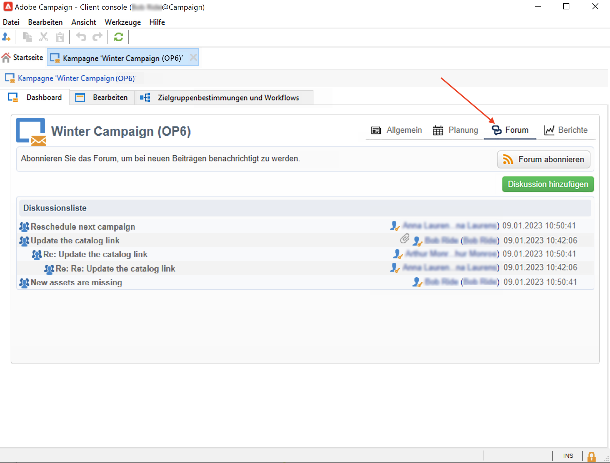
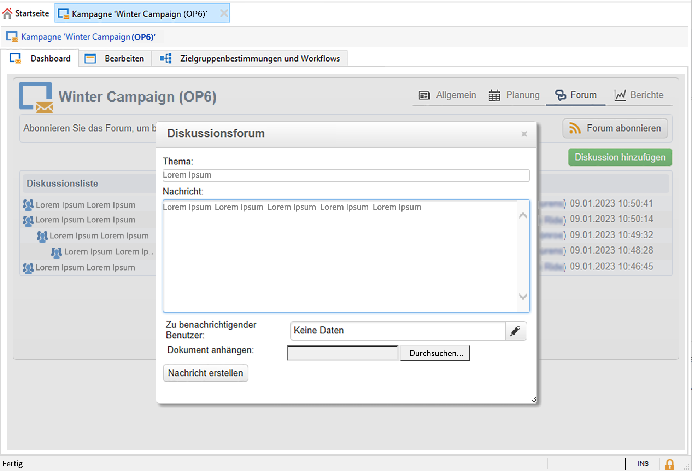
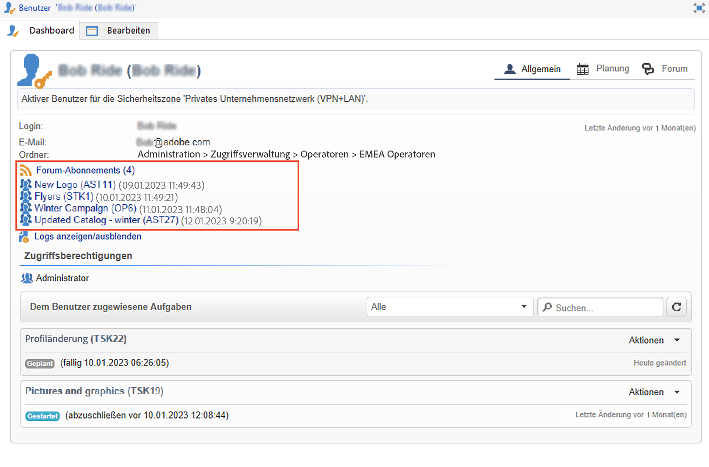

# Diskussionsforen{#discussion-forums}

Adobe Campaign-Benutzende können Diskussionsforen verwenden, um Informationen auszutauschen. Die folgenden Elemente verfügen jeweils über ein eigenes Forum: Pläne, Programme, Kampagnen, Marketing-Ressourcen, Simulationen, Lager. Jeder Benutzer hat auch ein persönliches Forum. Alle Diskussionen sind öffentlich, auch in persönlichen Foren.

Benutzer können Foren abonnieren, um per E-Mail über jede gepostete Nachricht informiert zu werden.

## Zugriff auf ein Forum {#accessing-a-forum}

Um auf ein Forum zuzugreifen, navigieren Sie zu einem Dashboard und klicken Sie auf die Schaltfläche **[!UICONTROL Forum]** links oben rechts.

Nachrichten und Antworten darauf werden chronologisch angezeigt, von neu nach alt.

Um einen neuen Thread zu starten, klicken Sie auf die Schaltfläche **[!UICONTROL Diskussion hinzufügen]** in der oberen rechten Ecke. Das Feld **[!UICONTROL Diskussionsforum]** wird angezeigt (siehe unten).

Geben Sie den gewünschten Text im Feld **[!UICONTROL Nachricht]** und gegebenenfalls einen Diskussionstitel im Feld **[!UICONTROL Thema]** ein.

Benutzer, die bereits eine Nachricht in diesem Forum veröffentlicht haben, werden standardmäßig benachrichtigt. Sie können einen zusätzlichen Benutzer auswählen, der benachrichtigt werden soll. Um mehrere Benutzende zu benachrichtigen, wählen Sie eine Benutzergruppe aus.

Sie können der Nachricht mithilfe der Schaltfläche  **[!UICONTROL Durchsuchen...]** einen Anhang beifügen. Der Anhang wird auch der Benachrichtigungs-E-Mail hinzugefügt. Anhänge dürfen nur einzeln gesendet werden: Um mehrere Dateien zu senden, müssen Sie sie in einer ZIP-Datei komprimieren.

>[!CAUTION]
>
>Wenn eine Nachricht in das Forum gepostet wurde, kann sie nicht mehr geändert oder gelöscht werden.

## Posts im persönlichen Benutzerforum eines Benutzers {#posting-to-the-personal-forum-of-an-operator}

Sie können eine Nachricht im Forum eines Benutzers posten. Persönliche Foren sind öffentlich, und alle Benutzer können Ihre Nachricht sehen. Der Benutzer erhält jedes Mal, wenn jemand etwas in seinem persönlichen Forum postet, eine E-Mail-Benachrichtigung.

Um auf das Forum eines Benutzers zuzugreifen, haben Sie folgende Möglichkeiten:

* Navigieren Sie zum Ordner **[!UICONTROL Administration > Zugriffsverwaltung > Benutzer]** des Campaign-Explorers, wählen Sie den Benutzer aus, um sein Dashboard zu öffnen, und klicken Sie auf den Link **[!UICONTROL Forum]** oben rechts.
* Suchen Sie den Namen des Benutzers in der Benutzeroberfläche von Adobe Campaign (über eine von diesem Benutzer im Forum gepostete Nachricht oder eine ihm zugewiesene Aufgabe) und klicken Sie darauf, um auf sein Dashboard zuzugreifen.

## Abonnieren eines Forums {#subscribing-to-a-forum}

Wenn Sie ein Forum abonnieren, können Sie alle Diskussionen verfolgen. Nach der Anmeldung erhalten Sie jedes Mal eine E-Mail-Benachrichtigung, wenn eine Nachricht im Forum gepostet wird.

Um eine Nachricht zu beantworten, klicken Sie auf den E-Mail-Text und melden Sie sich in der Web-Oberfläche von Adobe Campaign an.

* Um ein Forum zu abonnieren, klicken Sie auf die Schaltfläche **[!UICONTROL Forum abonnieren]** rechts oberhalb der Diskussionsliste.

   Daraufhin erscheint ein blaues Band, in dem ihr Abonnement bestätigt wird.

* Wenn Sie sich von einem Forum abmelden möchten, klicken Sie auf die Schaltfläche **[!UICONTROL Abmelden]** in dem blauen Band.

* In Ihrem persönlichen Dashboard werden die von Ihnen abonnierten Foren aufgelistet. Klicken Sie auf den Link **[!UICONTROL Forum-Abonnements]**, um die Liste anzuzeigen, und anschließend auf das Forum, auf das Sie zugreifen möchten.

   

## Fehlerbehebung beim Benachrichtigungsversand {#checking-notification-delivery}

Falls Abonnenten eines Forums nicht die erwarteten Benachrichtigungen erhalten, empfehlen wir folgende Vorgehensweise:

* Stellen Sie sicher, dass die Benutzer eine E-Mail-Adresse in ihrem Profil angegeben haben.
* Navigieren Sie zum Ordner **[!UICONTROL Administration > Produktion > Technische Workflows > Campaign-Prozesse]** des Campaign-Explorers und überprüfen Sie, dass der Workflow **[!UICONTROL Vorgänge in Diskussionsforen]** ohne Fehler gestartet wird.
* Überprüfen Sie die Versand-Logs:

   * Gehen Sie von der Adobe Campaign-Startseite aus zu **[!UICONTROL Kampagnen > Navigation > Sendungen]** und öffnen Sie den Versand **[!UICONTROL Benachrichtigungen bezüglich Diskussionsforen]**.
   * Gehen Sie im Campaign-Explorer zu **[!UICONTROL Administration > Produktion > Automatisch erstellte Objekte > Technische Sendungen > Workflow-Benachrichtigungen]** und klicken Sie auf **[!UICONTROL Benachrichtigungen bezüglich Diskussionsforen]**.
   Im Fenster **[!UICONTROL Benachrichtigungen bezüglich Diskussionsforen]** befinden sich die Versand-Logs auf der Registerkarte **[!UICONTROL Bearbeiten > Versand]**. Überprüfen Sie ebenfalls die Registerkarten **[!UICONTROL Tracking > Protokoll]** und **[!UICONTROL Ausschlussgründe]**.
