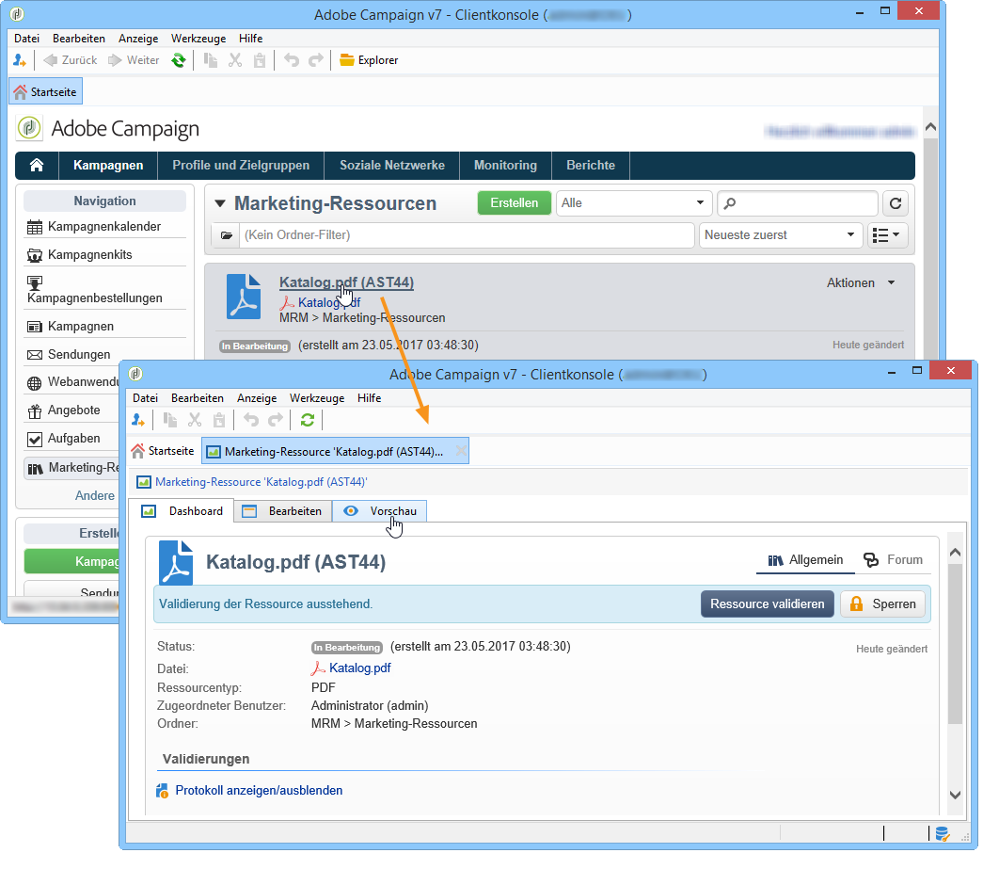
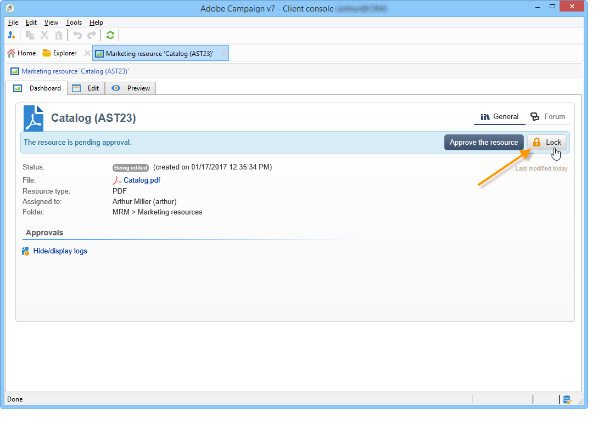
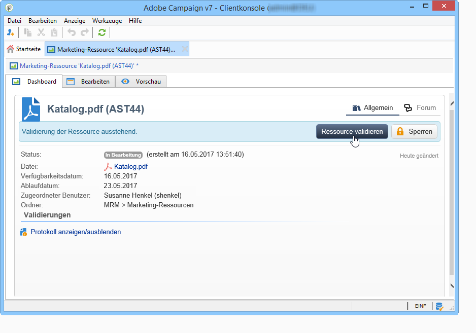
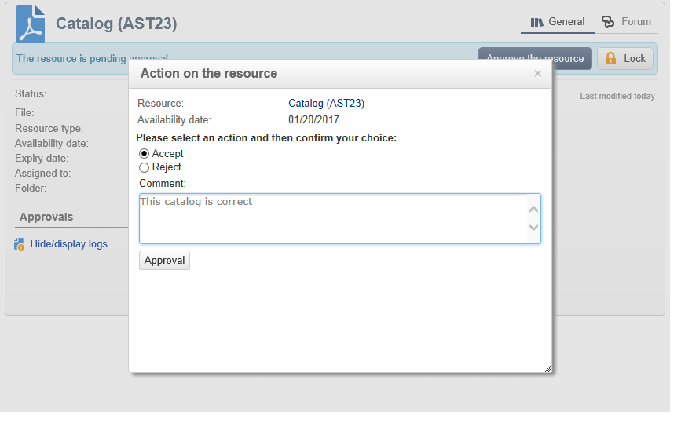
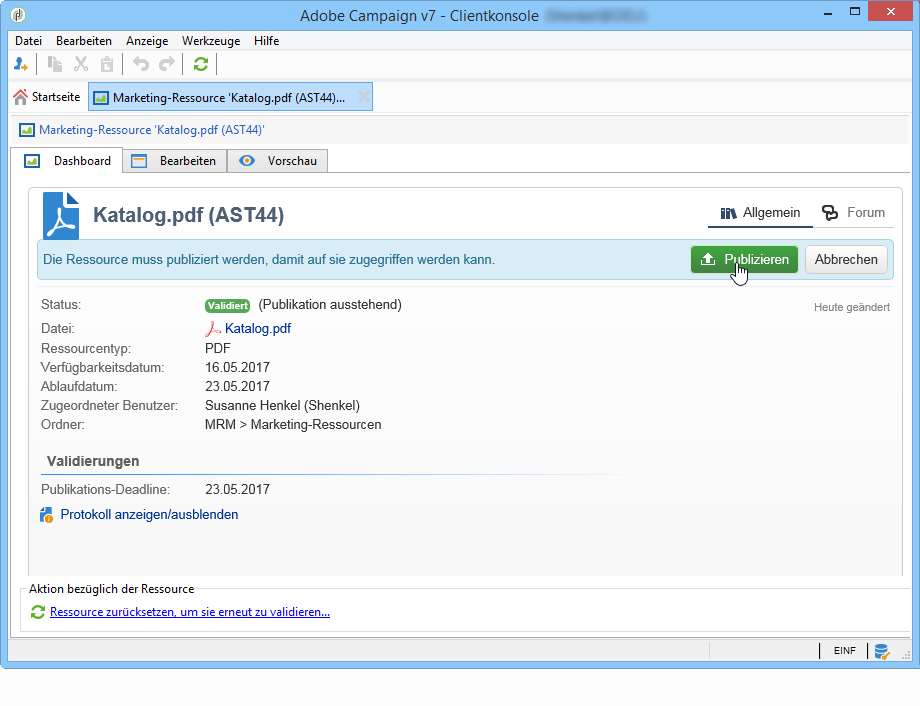
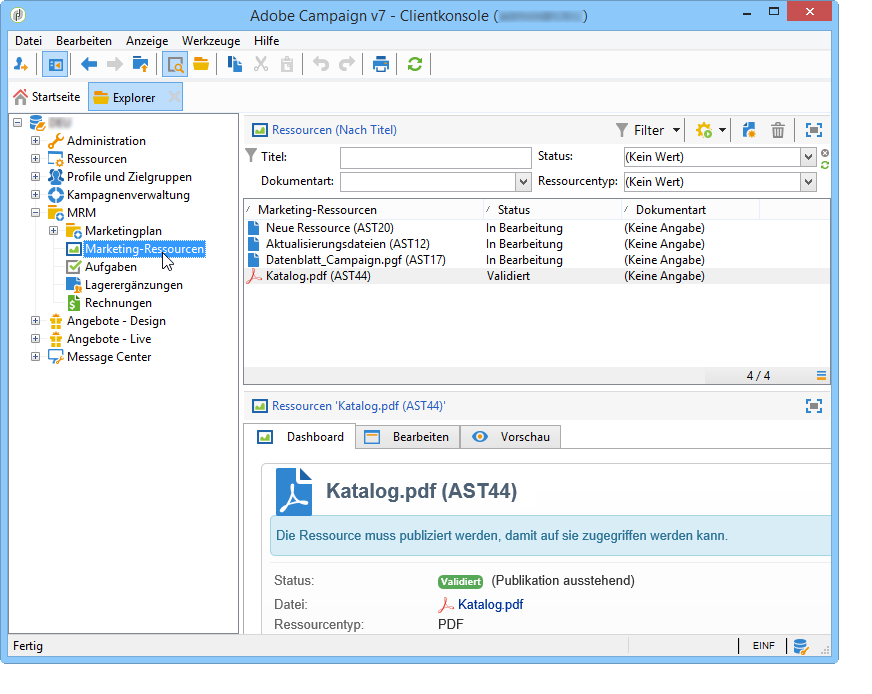

# Marketing-Ressourcen verwalten{#managing-marketing-resources}

Adobe Campaign ermöglicht die Verwaltung und Verfolgung der im Lebenszyklus der Kampagnen eingebundenen Marketing-Ressourcen. Hierbei kann es sich zum Beispiel um Broschüren, Layouts oder andere Kommunikationsträger handeln, die von mehreren Benutzern bearbeitet werden.

Status, Verlauf und aktuelle Version der über Adobe Campaign verwalteten Marketing-Ressourcen können jederzeit angezeigt werden.

## Hinzufügen von Marketing-Ressourcen {#adding-a-marketing-resource}

Marketing-Ressourcen sind über den Tab **[!UICONTROL Kampagnen]** zugänglich.

Um eine Ressource hinzuzufügen, klicken Sie auf die Schaltfläche **[!UICONTROL Erstellen]**.

Um eine Ressource auf dem Adobe-Campaign-Server verfügbar zu machen, legen Sie diese per Drag &amp; Drop im angegeben Bereich des Fensters ab oder klicken Sie auf den Link **[!UICONTROL Datei auf den Server laden...]**, um die Datei auszuwählen.

Über eine Bestätigungsnachricht kann der Upload gestartet werden.

Nach Abschluss des Uploads wird die Ressource der Liste verfügbarer Ressourcen hinzugefügt. Adobe-Campaign-Benutzer können sie über den Tab **[!UICONTROL Vorschau]** ansehen oder über den Tab **[!UICONTROL Bearbeiten]** eine Kopie erstellen, um Änderungen vorzunehmen, bzw. die Datei auf dem Server aktualisieren.

Bestimmen Sie in den Rubriken **[!UICONTROL Allgemein]** und **[!UICONTROL Verfolgung]** des -Tabs die für Kontrolle, Verfolgung und Validierung der Ressource verantwortlichen Benutzer oder Benutzergruppen.

* Der Benutzer, dem die Ressource zugeordnet wurde, ist für ihre Verfolgung verantwortlich.
* Der für die Validierung verantwortliche Benutzer wird benachrichtigt, sobald der Validierungsprozess der Ressource gestartet wurde.

   Wenn kein validierungsverantwortlicher Benutzer ausgewählt wurde, **[!UICONTROL kann]** die Ressource nicht zur Validierung unterbreitet werden.

* Bei Bedarf kann zudem in der Rubrik Verfolgung ein Korrekturleser bestimmt werden.

Sie können ein unverbindliches Verfügbarkeitsdatum für die Ressource festlegen. Nach diesem Datum erscheint die Ressource als **[!UICONTROL überfällig]**.

## Kollaboratives Arbeiten an Ressourcen {#collaborative-work-on-resources}

Sie haben die Möglichkeit, eine Marketing-Ressource jederzeit zu ändern und zu aktualisieren sowie bei Bedarf andere Adobe-Campaign-Benutzer davon in Kenntnis zu setzen. Sie können:

* Ressourcen lokal herunterladen, um sie zu bearbeiten;
* Dateien auf dem Server aktualisieren und für andere Benutzer zugänglich machen;
* Ressourcen sperren, um Änderungen durch andere Benutzer zu verbieten.

>[!NOTE]
>
>Die Registerkarte **[!UICONTROL Verlauf]** enthält das Protokoll der Downloads und Aktualisierungen der Ressource. Über die Schaltfläche **[!UICONTROL Details]** kann die ausgewählte Version angezeigt werden.

### Ressourcen sperren/entsperren {#locking-unlocking-a-resource}

Nach ihrer Erstellung sind die Ressourcen für die Benutzer im Dashboard der Marketing-Ressourcen verfügbar und sie können bearbeitet und verändert werden.

Wenn ein Benutzer an einer Ressource Änderungen vornehmen möchte, empfiehlt es sich, diese zuvor zu sperren, damit andere Benutzer sie nicht zur gleichen Zeit bearbeiten können. Die Ressource wird damit für den Benutzer reserviert: Sie bleibt zugänglich, kann aber von anderen Benutzern weder veröffentlicht noch auf dem Server aktualisiert werden.

Folgende Nachricht informiert Benutzer, die auf eine reservierte Ressource zugreifen möchten:

Im Tab **[!UICONTROL Verfolgung]** können der Name des Benutzers, der die Ressource gesperrt hat, sowie das vorgesehene Freigabedatum nachgelesen werden.

Um eine Ressource zu sperren, klicken Sie auf die Ressource und anschließend auf die Schaltfläche **[!UICONTROL Sperren]** im Ressourcen-Dashboard.

Sie können das geplante Rückgabedatum im Tab **[!UICONTROL Verfolgung]** der Ressource angeben.

Auf diese Weise können andere Adobe-Campaign-Benutzer darüber informiert werden, wann die Ressource wieder entsperrt wird.

Nach der Aktualisierung wird die Ressource automatisch entsperrt, um sie wieder für alle Benutzer verfügbar zu machen.

Sie kann jedoch bei Bedarf auch manuell über das Dashboard entsperrt werden.

>[!NOTE]
>
>Nur der Benutzer, der die Ressource gesperrt hat, und solche mit Administrator-Berechtigungen sind befugt, eine gesperrte Ressource zu entsperren.

### Diskussionsforen {#discussion-forums}

An einer Ressource beteiligte Benutzer haben im Tab **[!UICONTROL Forum]** die Möglichkeit, Informationen austauschen.

Die Funktionsweise von Foren in Adobe Campaign wird im Abschnitt [Diskussionforen](discussion-forums.md) dargestellt.

## Lebenszyklus von Marketing-Ressourcen {#life-cycle-of-a-marketing-resource}

Bei der Erstellung einer Ressource werden Adobe-Campaign-Benutzer für den Entwurf sowie die Korrektur, Validerung und Veröffentlichung der Ressource bestimmt. Für diese Vorgänge kann eine Dauer definiert werden.

Der Tab **[!UICONTROL Verfolgung]** ermöglicht die Überprüfung der an der Ressource vorgenommenen Änderungen: Validierungen, Validierungsablehnungen, Kommentare und Veröffentlichungen.

Im Tab **[!UICONTROL Verlauf]** werden die für die jeweilige Ressource durchgeführten Dateiübertragungen angezeigt.

### Validierungsprozess {#approval-process}

Das erwartete Verfügbarkeitsdatum wird in den Details der Ressource angezeigt, sofern es im Tab **[!UICONTROL Verfolgung]** angegeben wurde. Bei Erreichen des Datums kann der Validierungsprozess im Ressourcen-Dashboard über die Schaltfläche **[!UICONTROL Zur Validierung unterbreiten]** gestartet werden. Der Status der Ressource wechselt zu **[!UICONTROL Validierung in Gang]**.

Eine Ressource kann über die Schaltfläche **[!UICONTROL Ressource validieren]** in ihrem Dashboard validiert werden.

Berechtigte Benutzer können die Validierung daraufhin akzeptieren oder ablehnen. Diese Aktion kann über den Link in der Benachrichtigungs-E-Mail oder über die Schaltfläche **[!UICONTROL Validieren]** in der Konsole ausgeführt werden.

Im Validierungsfenster kann ein Kommentar eingegeben werden.

Im Tab **[!UICONTROL Verfolgung]** können alle Benutzer die unterschiedlichen Etappen des Validierungsprozesses verfolgen.

>[!NOTE]
>
>Neben dem in jeder Marketing-Ressource bestimmten Validierer sind auch Benutzer mit Administrator-Berechtigungen sowie der Ressourcen-Verantwortliche befugt, die jeweilige Ressource zu validieren.

### Ressourcen veröffentlichen {#publishing-a-resource}

Nach bestätigter Validierung muss die Marketing-Ressource veröffentlicht werden. Der Veröffentlichungsprozess ist separat, den jeweiligen Nutzerbedürfnissen entsprechend zu implementieren. So können Ressourcen beispielsweise auf einem Extranet oder einem beliebigen anderen Server veröffentlicht, bzw. einem externen Dienstleister übermittelt werden usw.

Geben Sie den Zugriff auf eine Ressource frei, indem Sie auf die Schaltfläche **[!UICONTROL Veröffentlichen]** in ihrem Dashboard klicken.

Die Ressourcenveröffentlichung kann auch über einen Workflow automatisiert werden.

Eine Ressource zu veröffentlichen bedeutet, sie verfügbar zu machen, zum Beispiel zur Verwendung in einer Aufgabe. Der eigentliche Vorgang der Veröffentlichung hängt von der Art der Ressource ab: Ein Flyer zum Beispiel kann zum Druck als Datei an einen Dienstleister geschickt oder aber auf einer Webseite online gestellt werden.

Damit Adobe Campaign die Veröffentlichung durchführt, muss ein entsprechender Workflow erstellt und dieser mit der Ressource verbunden werden. Öffnen Sie hierzu den Link **[!UICONTROL Erweiterte Parameter]** der Ressource und wählen Sie den gewünschten Workflow im Feld **[!UICONTROL Anschlussvorgang]** aus.

Der Workflow wird ausgeführt, wenn

* der Validierer der Veröffentlichung (oder, wenn dieser nicht definiert wurde, der Ressourcen-Verantwortliche) auf **[!UICONTROL Ressource veröffentlichen]** klickt
* die Ressource über eine Aufgabe zur Erstellung einer Marketing-Ressource verwaltet wird und die Aufgabe den Status **[!UICONTROL Abgeschlossen]** erhält; zudem muss die Option **[!UICONTROL Marketing-Ressource veröffentlichen]** in der Aufgabe aktiviert worden sein (siehe [Aufgabe „Erstellung einer Marketing-Ressource“](creating-and-managing-tasks.md#marketing-resource-creation-task))

Wenn der Workflow nicht unmittelbar gestartet wird (zum Beispiel wenn die Workflow-Engine angehalten ist), erhält die Ressource den Status **[!UICONTROL Veröffentlichung ausstehend]**. Sobald der Workflow startet, wechselt der Status in **[!UICONTROL Veröffentlicht]**. Dieser Status berücksichtigt keine möglichen Fehler im Veröffentlichungsprozess. Überprüfen Sie den Status Ihres Workflows, um sicherzustellen, dass dieser korrekt ausgeführt wurde.

## Verknüpfung von Ressourcen mit einer Kampagne {#linking-a-resource-to-a-campaign}

### Ressourcen referenzieren {#referencing-a-marketing-resource}

Marketing-Ressourcen können mit Kampagnen verknüpft werden, sofern diese Option in der Kampagnenvorlage ausgewählt wurde.

>[!NOTE]
>
>Erstellung und Konfiguration der Kampagnenvorlagen werden im Abschnitt [kampagnenvorlagen](../campaigns/marketing-campaign-templates.md) dargestellt

Gehen Sie hierzu im Dashboard der Kampagne zum Tab **[!UICONTROL Bearbeiten > Dokumente > Ressourcen]** und klicken Sie auf **[!UICONTROL Hinzufügen]**, um eine Ressource auszuwählen.

Sie können die Ressourcen nach Status, Dokumentart und Ressourcentyp filtern oder einen benutzerdefinierten Filter anwenden.

Klicken Sie auf die Schaltfläche **[!UICONTROL OK]**, um die ausgewählte Ressource der Liste der referenzierten Marketing-Ressourcen dieser Kampagne hinzuzufügen.

Über die Schaltfläche **[!UICONTROL Details]** kann die Ressource angesehen und bearbeitet werden.

Die hinzugefügten Ressourcen werden im Dashboard angezeigt. Von dort aus können sie auch bearbeitet werden.

### Ressourcen einem Versandentwurf hinzufügen {#adding-a-marketing-resource-to-a-delivery-outline}

Marketing-Ressourcen können über Versandentwürfe mit Sendungen verknüpft werden.

>[!NOTE]
>
>Weitere Informationen zu Versandentwürfen finden Sie unter [Ressourcen in einem Versandentwurf verknüpfen](../campaigns/marketing-campaign-deliveries.md).

## Lagerverwaltung {#stock-management}

Sie können eine Marketing-Ressource mit einem oder mehreren Lagern verknüpfen, um den Vorrat zu verwalten und bei unzureichendem Vorrat einen Warnhinweis im Dashboard anzuzeigen.

>[!NOTE]
>
>Nähere Informationen zur Lagerverwaltung in Adobe Campaign erhalten Sie im Abschnitt [Lagerverwaltung ](../campaigns/providers--stocks-and-budgets.md#stock-management).

Um eine Marketing-Ressource mit einem Lager zu verknüpfen, öffnen Sie die Lagerübersicht und bearbeiten oder erstellen Sie ein Lager. Fügen Sie eine Lagerposition hinzu und wählen Sie die entsprechende Marketing-Ressource aus.

Bei Bedarf können Sie die Marketing-Ressource nach ihrer Auswahl über das Lupensymbol **[!UICONTROL Verknüpftes Element öffnen]** rechts von der Ressource bearbeiten.

Geben Sie den Anfangsbestand sowie den Meldebestand an und speichern Sie.

Das Lager wird im Detail der Ressource angegeben.

Wenn der Lagerbestand unzureichend ist, wird den zuständigen Benutzern ein Warnhinweis gesendet.

## Erweiterte Funktionen {#advanced-functions}

Über das Dashboard der Marketing-Ressourcen können gängige Prozesse ausgeführt werden: Hinzufügen, Bearbeiten, Sperren/Entsperren, Validieren, Veröffentlichen. Über den Adobe-Campaign-Navigationsbaum können Sie andere Typen von Marketing-Ressourcen erstellen und auf erweiterte Funktionen zugreifen. Klicken Sie hierzu auf der Adobe-Campaign-Startseite auf die **[!UICONTROL Explorer]**-Schaltfläche.

Marketing-Ressourcen werden standardmäßig im Knoten **[!UICONTROL MRM > Marketing-Ressourcen]** des Navigationsbaums gespeichert.

Folgende Ressourcen können über diese Ansicht hinzufügt werden:

* Datei
* HTML
* Text
* URL
