# Marketing-Ressourcen verwalten{#managing-marketing-resources}

Verwenden Sie Adobe Campaign, um die am Lebenszyklus der Kampagne beteiligten Marketing-Ressourcen zu verwalten und zu verfolgen. Bei diesen Marketing-Ressourcen kann es sich um Whitepaper, Datendateien, Logos oder andere Assets handeln, die mit einer Kampagne in Verbindung stehen.

Für jede über Adobe Campaign verwaltete Marketing-Ressource können Sie ihren Status und Verlauf jederzeit verfolgen und die aktuelle Version anzeigen.

Standardmäßig werden Marketing-Ressourcen im **[!UICONTROL MRM > Marketing-Ressourcen]** Ordner des Campaign-Explorers.

## Marketing-Ressource hinzufügen {#adding-a-marketing-resource}

Gehen Sie wie folgt vor, um eine Marketing-Ressource hinzuzufügen:

1. Navigieren Sie zum **[!UICONTROL Kampagnen]** und wählen Sie **[!UICONTROL Marketing-Ressourcen]**.

1. Klicken Sie auf die Schaltfläche **[!UICONTROL Erstellen]**.
   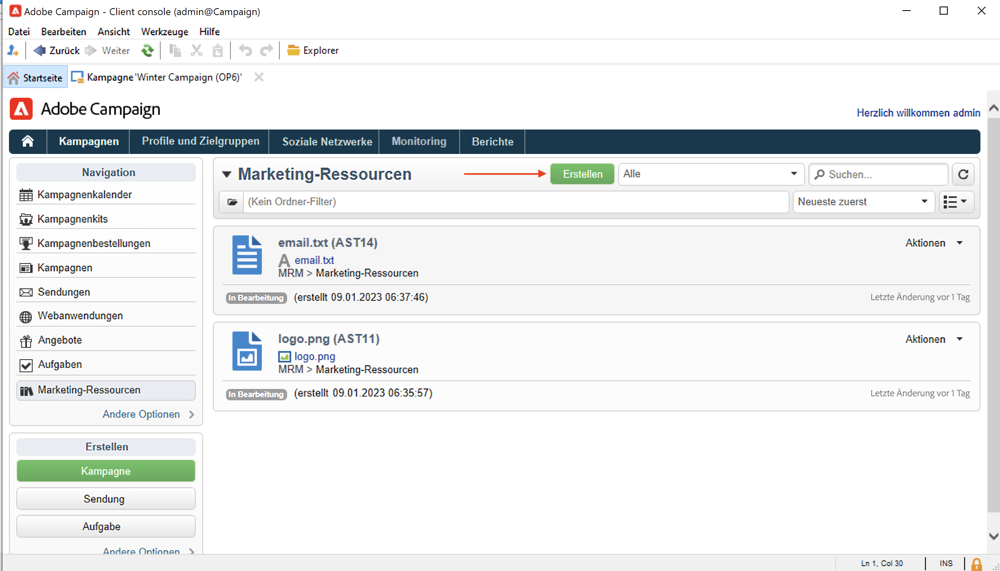
1. Ziehen Sie die Datei in das Fenster Marketing-Ressource , um sie auf den Campaign-Server hochzuladen. Sie können auch die **[!UICONTROL Datei auf den Server laden...]** Link.
   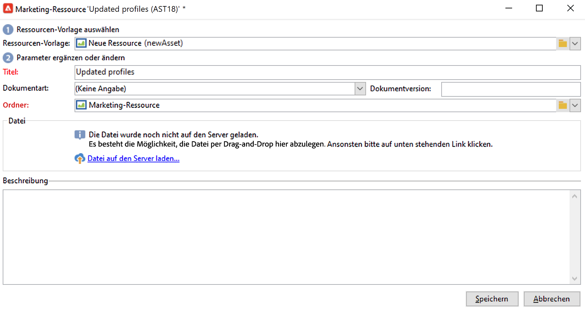

Nach Abschluss des Uploads wird die Ressource der Liste der verfügbaren Ressourcen hinzugefügt.

## Marketing-Ressourcen verwalten {#manage-marketing-resources}

Nach dem Hochladen ist die Marketing-Ressource für alle Adobe Campaign-Benutzer verfügbar. Sie können sie anzeigen, eine Kopie erstellen, um sie zu ändern, oder die Datei auf dem Server aktualisieren.

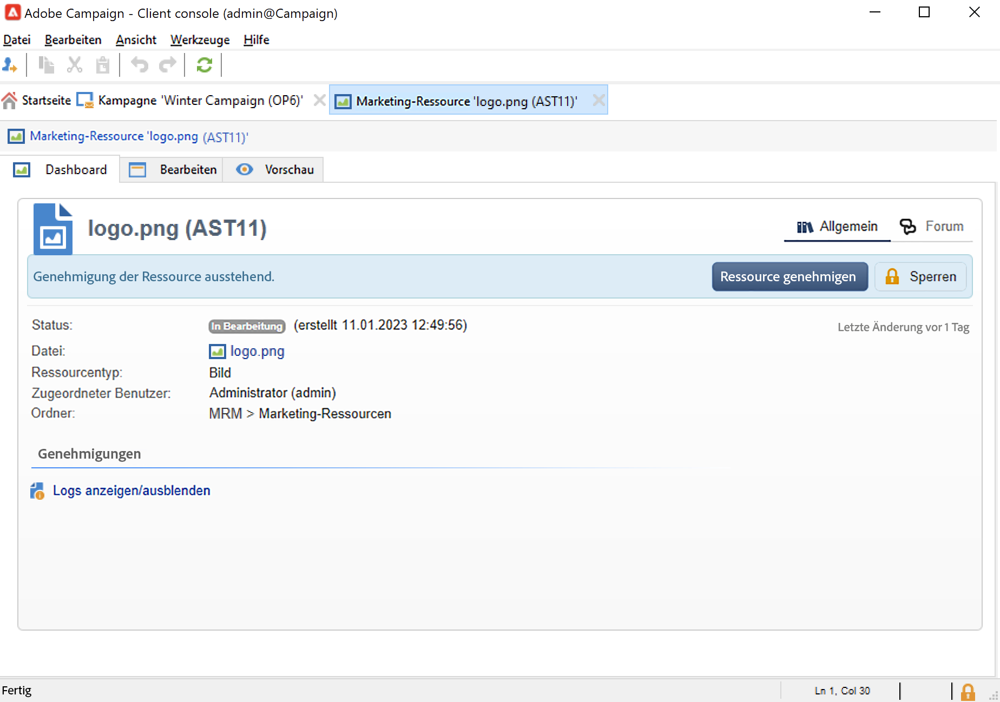

Verwenden Sie die **[!UICONTROL Zugeordnet zu]** Dropdown-Liste im **[!UICONTROL Bearbeiten]** den Benutzer, der für die Ressource verantwortlich ist.

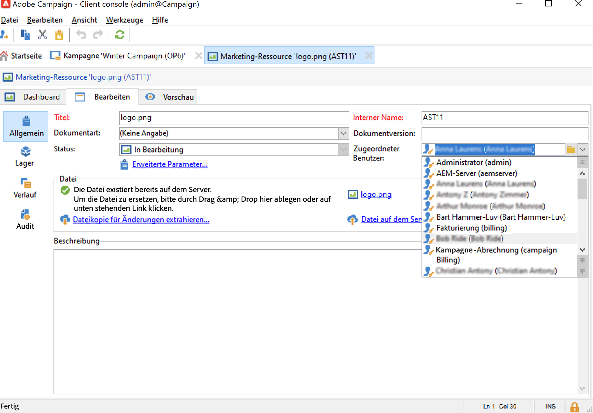

Sie können auch die Benutzer oder Benutzergruppen auswählen, die für die Ressourcenvalidierung und die Ressourcenveröffentlichung zuständig sind. Um auf diese Optionen zuzugreifen, klicken Sie auf das  **[!UICONTROL Erweiterte Parameter]** Link.

Diese Benutzer werden per E-Mail benachrichtigt, wenn der Ressourcenvalidierungsprozess gestartet wird.

Wenn kein validierungsverantwortlicher Benutzer ausgewählt wurde, **[!UICONTROL kann]** die Ressource nicht zur Validierung unterbreitet werden.

Verwenden Sie die **[!UICONTROL Prüfung]** um einen Testversand-Leser hinzuzufügen und ein Verfügbarkeitsdatum für die Ressource festzulegen. Nach diesem Datum wird er mit **[!UICONTROL Verspätet]** Status.

>[!NOTE]
>
>Die Registerkarte **[!UICONTROL Verlauf]** enthält das Protokoll der Downloads und Aktualisierungen der Ressource. Über die Schaltfläche **[!UICONTROL Details]** kann die ausgewählte Version angezeigt werden.
>
>Die **[!UICONTROL Prüfung]** -Tab ermöglicht die Überwachung der an der Ressource vorgenommenen Aktionen: Genehmigungen, Verweigerungen der Genehmigung, Kommentare oder Veröffentlichungen.

### Ressourcen sperren/entsperren {#locking-unlocking-a-resource}

Nach ihrer Erstellung sind die Ressourcen für die Benutzer im Dashboard der Marketing-Ressourcen verfügbar und sie können bearbeitet und verändert werden.

Wenn ein Benutzer mit der Arbeit an einer Ressource beginnt, empfiehlt es sich, diese zu sperren, damit andere Benutzer sie nicht gleichzeitig ändern können. Die Ressource wird dann reserviert: Sie bleibt verfügbar, kann jedoch von einem anderen Benutzer nicht veröffentlicht oder auf dem Server aktualisiert werden.

Eine Marketing-Ressource kann nur gesperrt werden, wenn sie nicht genehmigt wurde.

Um eine Ressource zu sperren, müssen Sie auf die **[!UICONTROL Sperren]** im Ressourcen-Dashboard.

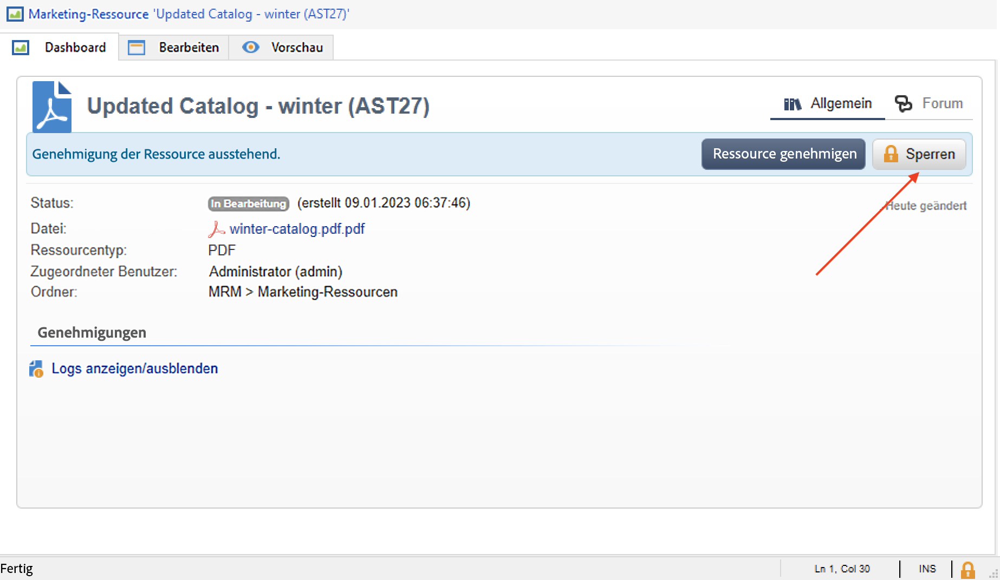

Wenn die Ressource aktualisiert wurde, klicken Sie auf das **[!UICONTROL Sperren]** im Ressourcen-Dashboard, um alle Benutzer erneut verfügbar zu machen.

Folgende Nachricht informiert Benutzer, die auf eine reservierte Ressource zugreifen möchten:

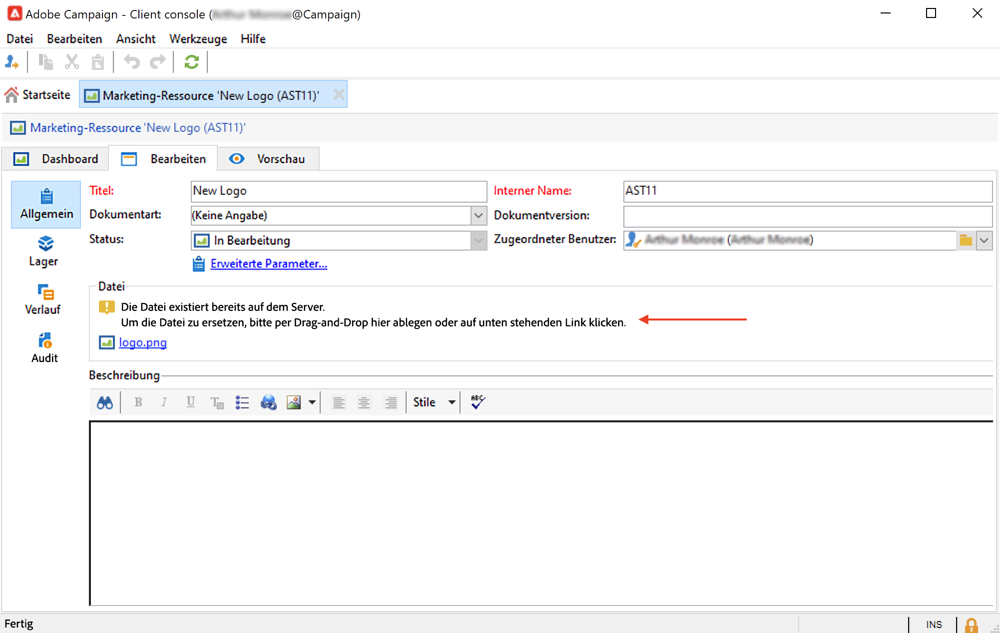

Die **[!UICONTROL Tracking]** gibt den Namen des Benutzers an, der die Ressource gesperrt hat.

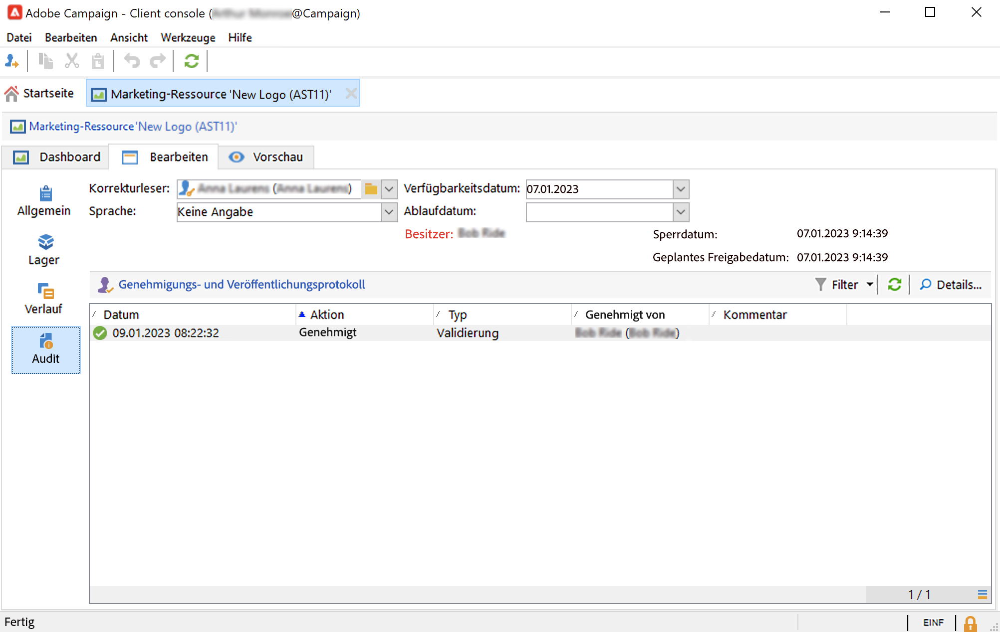

>[!NOTE]
>
>Nur der Benutzer, der die Ressource gesperrt hat, und solche mit Administrator-Berechtigungen sind befugt, eine gesperrte Ressource zu entsperren.

### Diskussionsforen {#discussion-forums}

Für jede Ressource wird die Variable **[!UICONTROL Forum]** können Teilnehmer Informationen austauschen.

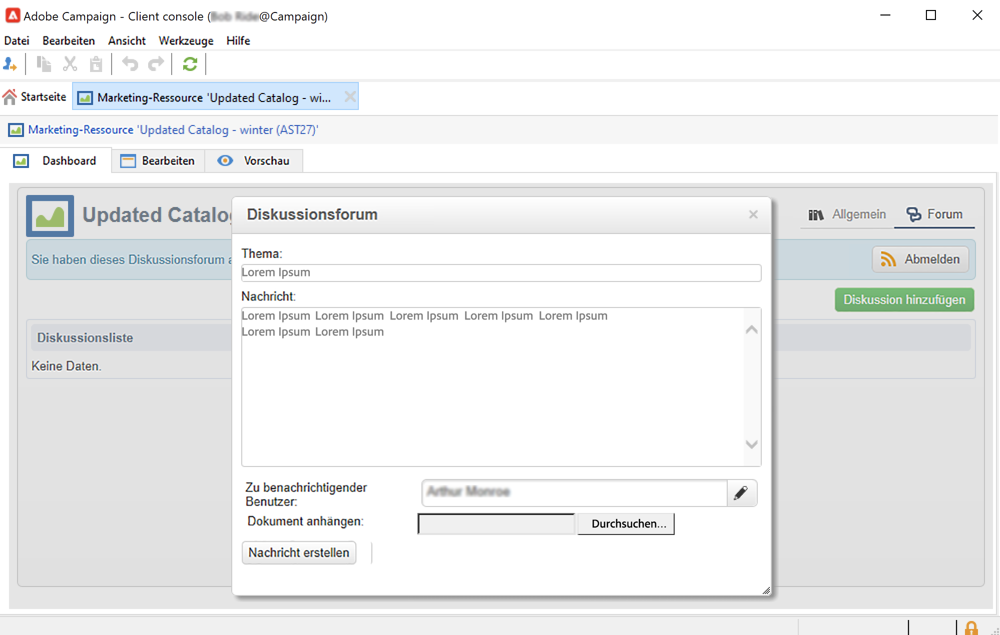

Weitere Informationen finden Sie unter [Diskussionsforen](discussion-forums.md) Abschnitt.

### Validierungsprozess {#approval-process}

Das erwartete Verfügbarkeitsdatum wird in den Details der Ressource angezeigt, sofern es im Tab **[!UICONTROL Verfolgung]** angegeben wurde. Bei Erreichen des Datums kann der Validierungsprozess im Ressourcen-Dashboard über die Schaltfläche **[!UICONTROL Zur Validierung unterbreiten]** gestartet werden. Der Status der Ressource wechselt zu **[!UICONTROL Validierung in Gang]**.

Um eine Ressource zu validieren, klicken Sie auf **[!UICONTROL Ressource validieren]** auf dem Dashboard.

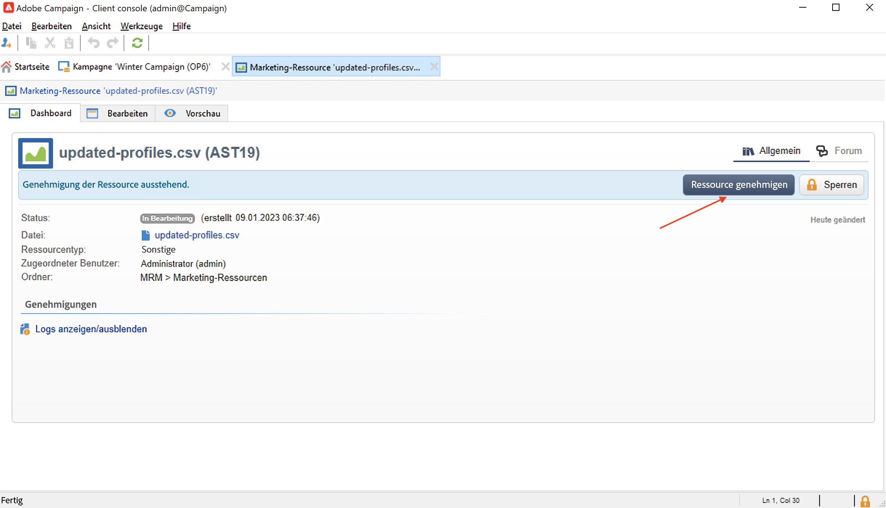

Berechtigte Benutzer können die Validierung daraufhin akzeptieren oder ablehnen. Diese Aktion kann über den Link in der Benachrichtigungs-E-Mail oder über die Schaltfläche **[!UICONTROL Validieren]** in der Konsole ausgeführt werden.

Im Validierungsfenster kann ein Kommentar eingegeben werden.

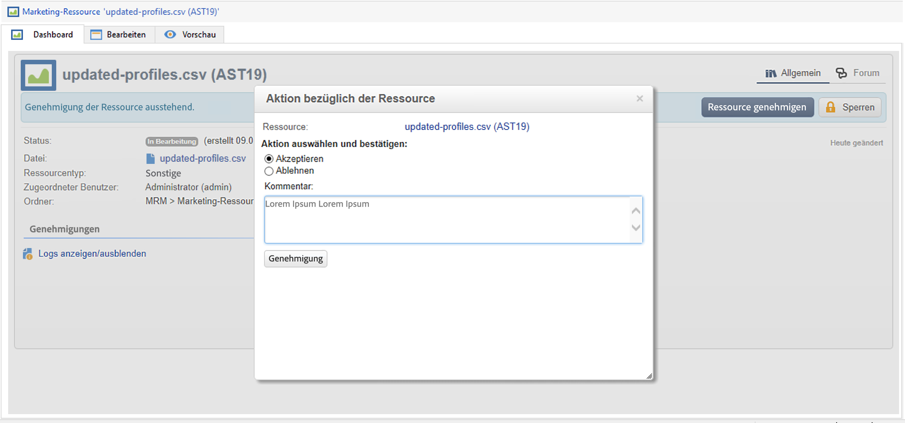

Navigieren Sie zum **[!UICONTROL Tracking]** zur Überprüfung der Genehmigungen.

>[!NOTE]
>
>Neben dem in jeder Marketing-Ressource bestimmten Validierer sind auch Benutzer mit Administrator-Berechtigungen sowie der Ressourcen-Verantwortliche befugt, die jeweilige Ressource zu validieren.

### Ressource veröffentlichen {#publishing-a-resource}

Nach bestätigter Validierung muss die Marketing-Ressource veröffentlicht werden. Der Veröffentlichungsprozess ist separat, den jeweiligen Nutzerbedürfnissen entsprechend zu implementieren. So können Ressourcen beispielsweise auf einem Extranet oder einem beliebigen anderen Server veröffentlicht, bzw. einem externen Dienstleister übermittelt werden usw.

Geben Sie den Zugriff auf eine Ressource frei, indem Sie auf die Schaltfläche **[!UICONTROL Veröffentlichen]** in ihrem Dashboard klicken.

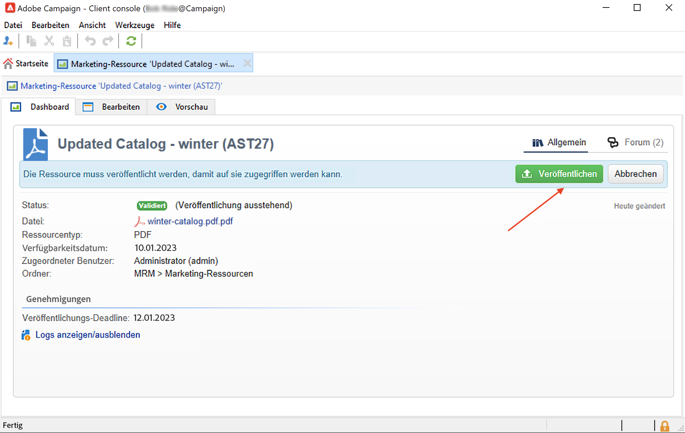

Die Ressourcenveröffentlichung kann auch über einen Workflow automatisiert werden.

Eine Ressource zu veröffentlichen bedeutet, sie verfügbar zu machen, zum Beispiel zur Verwendung in einer Aufgabe. Der eigentliche Vorgang der Veröffentlichung hängt von der Art der Ressource ab: Ein Flyer zum Beispiel kann zum Druck als Datei an einen Dienstleister geschickt oder aber auf einer Webseite online gestellt werden.

Damit Adobe Campaign veröffentlichen kann, müssen Sie einen geeigneten Workflow erstellen und ihn mit der Ressource verknüpfen. Öffnen Sie dazu die **[!UICONTROL Erweiterte Einstellungen...]** und wählen Sie den gewünschten Workflow im **[!UICONTROL Nachbearbeitung]** -Feld.

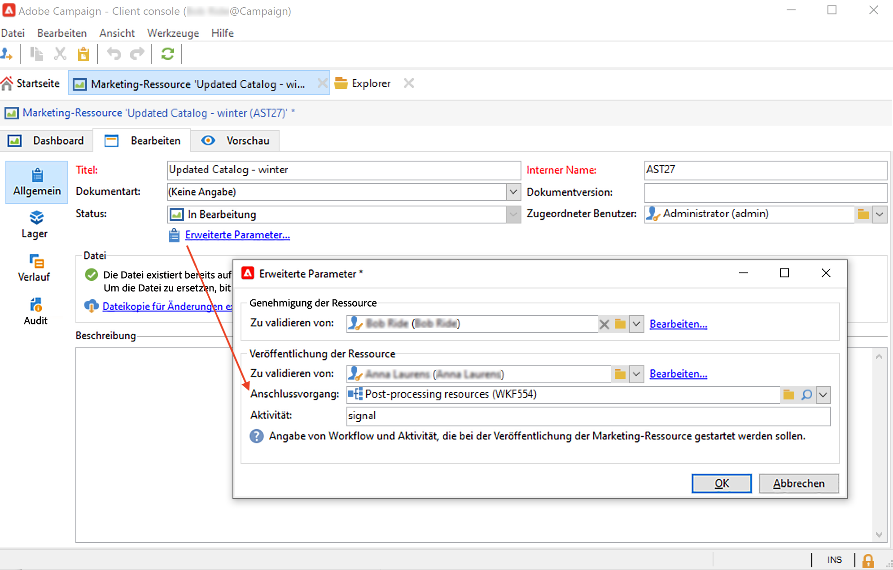

Der Workflow wird ausgeführt:

* der Validierer der Veröffentlichung (oder, wenn dieser nicht definiert wurde, der Ressourcen-Verantwortliche) auf **[!UICONTROL Ressource veröffentlichen]** klickt
* Wenn die Ressource über eine Aufgabe zur Erstellung einer Marketing-Ressource verwaltet wird, wird sie ausgeführt, wenn die Aufgabe auf **[!UICONTROL Abgeschlossen]**, solange die **[!UICONTROL Marketing-Ressource veröffentlichen]** in der Aufgabe aktiviert ist. [Weitere Informationen](creating-and-managing-tasks.md#marketing-resource-creation-task))

Wenn ein Workflow nicht sofort gestartet wird (z. B. wenn der Workflow angehalten wird), ändert sich der Status der Ressource in **[!UICONTROL Veröffentlichung ausstehend]**. Nach dem Start des Workflows ändert sich der Status der Ressource in **[!UICONTROL Veröffentlicht]**. Dieser Status berücksichtigt keine möglichen Fehler im Veröffentlichungsprozess. Überprüfen Sie den Status Ihres Workflows, um sicherzustellen, dass er ordnungsgemäß ausgeführt wurde.

## Ressource mit einer Kampagne verknüpfen {#linking-a-resource-to-a-campaign}

### Marketing-Ressource referenzieren {#referencing-a-marketing-resource}

Marketing-Ressourcen können Kampagnen zugeordnet werden, sofern diese Funktion in der Variablen [Kampagnenvorlage](../campaigns/marketing-campaign-templates.md).

Navigieren Sie zum **[!UICONTROL Bearbeiten > Dokumente > Ressourcen]** im Kampagnen-Dashboard auf und klicken Sie auf **[!UICONTROL Hinzufügen]** um die entsprechende Ressource auszuwählen.

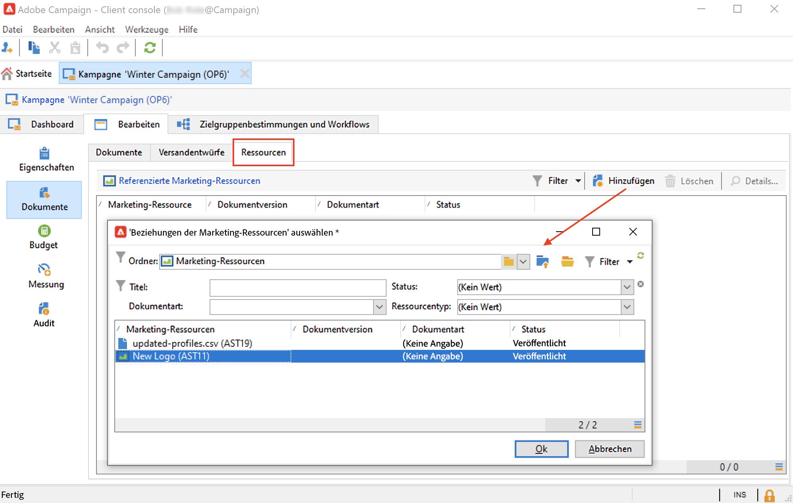

Sie können die Ressourcen nach Status, Dokumentart und Ressourcentyp filtern oder einen benutzerdefinierten Filter anwenden.

Verwenden Sie die **[!UICONTROL Details]** -Schaltfläche, um die Ressource zu bearbeiten und in der Vorschau anzuzeigen.

### Marketing-Ressource zu einem Versandentwurf hinzufügen {#adding-a-marketing-resource-to-a-delivery-outline}

Marketing-Ressourcen können über Versandentwürfe mit Sendungen verknüpft werden.

Weitere Informationen zu Versandentwürfen finden Sie in [diesem Abschnitt](../campaigns/marketing-campaign-deliveries.md).

Klicken Sie dazu mit der rechten Maustaste auf einen Versandentwurf und wählen Sie **Neu > Ressource**.

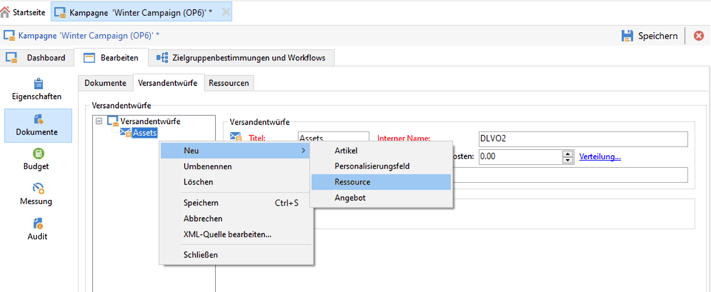

Geben Sie den Namen des Assets ein und wählen Sie es aus dem **Marketing-Ressource** Dropdown-Liste.

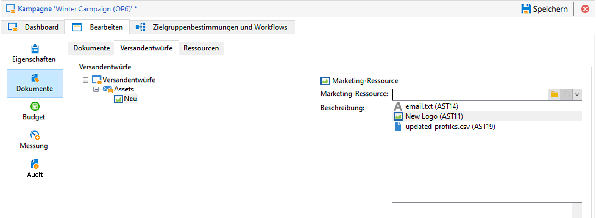

## Lagerverwaltung {#stock-management}

Sie können eine Marketing-Ressource mit einem oder mehreren Lagern verknüpfen, um den Vorrat zu verwalten und bei unzureichendem Vorrat einen Warnhinweis im Dashboard anzuzeigen.

Gehen Sie wie folgt vor, um eine Marketing-Ressource mit einem Lager zu verknüpfen:

1. Bearbeiten Sie ein Lager oder erstellen Sie ein neues Lager. Erfahren Sie mehr über die Lagerbestände in [diesem Abschnitt](../campaigns/providers--stocks-and-budgets.md#stock-management).

1. Fügen Sie eine Lagerposition hinzu und wählen Sie die entsprechende Marketing-Ressource aus.

   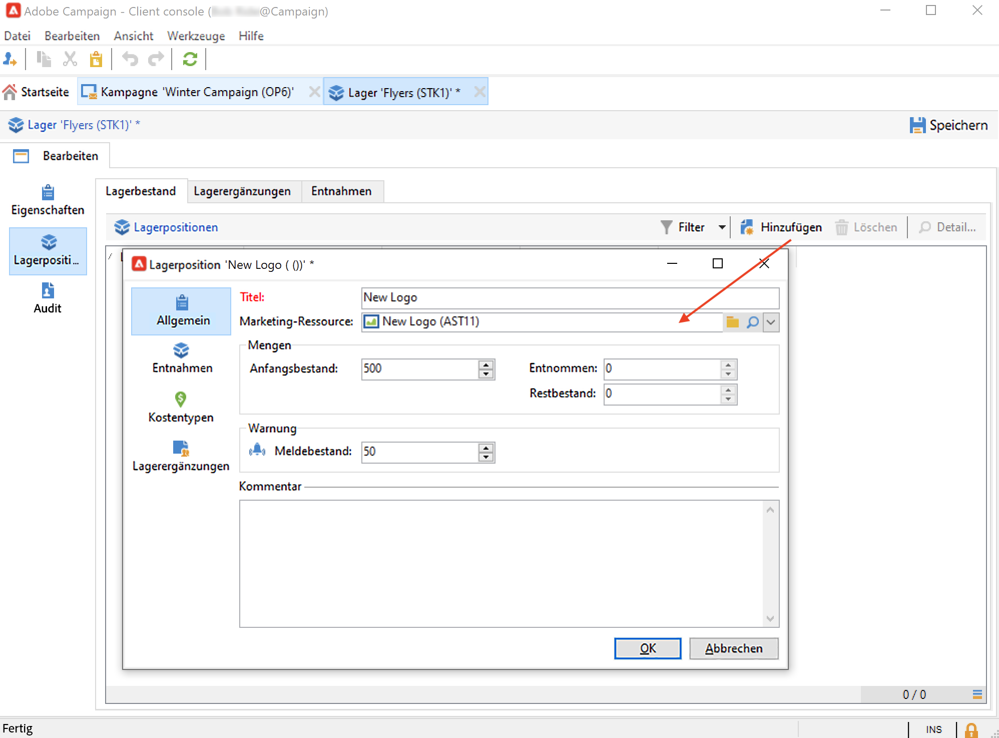

   Sie können die ausgewählte Ressource über die **[!UICONTROL Link bearbeiten]** Symbol rechts neben der Ressource, nachdem sie ausgewählt wurde.

1. Geben Sie den Anfangsbestand sowie den Meldebestand an und speichern Sie.

Der Bestand wird in der Marketing-Ressource angezeigt **Lagerbestände** Registerkarte.
