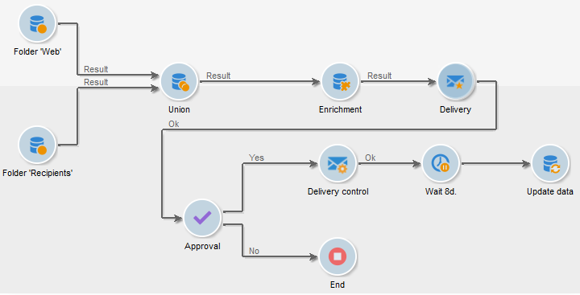

# Erste Schritte mit Workflows{#gs-workflows}

## Über Workflows{#about-workflows}

Adobe Campaign enthält ein Workflow-Modul, mit dem Sie die gesamte Bandbreite von Prozessen und Aufgaben über die verschiedenen Module des Anwendungs-Servers hinweg orchestrieren können. In dieser grafischen Umgebung können Sie Prozesse wie Segmentierung, Kampagnenausführung, Dateiverarbeitung, Beteiligung von Personen usw. entwerfen. Die Workflow-Engine führt diese Prozesse aus und verfolgt sie.

So bieten Workflows beispielsweise die Möglichkeit, Dateien von einem Server herunterladen, sie zu entkomprimieren und die Datensätze in die Adobe Campaign-Datenbank zu importieren.

Ein Workflow kann auch die Benachrichtigung eines oder mehrerer Benutzer umfassen, die eine Auswahl treffen und Prozesse genehmigen können. Auf diese Weise ist es möglich, eine Versandaktion zu erstellen, einem oder mehreren Benutzern eine Aufgabe zuzuweisen, Inhalte zu bearbeiten, Zielgruppen festzulegen und Testsendungen zu validieren, bevor der Versand gestartet wird.

In Adobe Campaign kommen Workflows in unterschiedlichsten Kontexten und zu verschiedenen Zeitpunkten innerhalb der Kampagnenprozesse zum Einsatz.

Adobe Campaign verwendet Workflows für folgende Zwecke:

* Entwerfen von Zielgruppen-Workflows. [Weitere Informationen](#targeting-workflows)
* Orchestrieren von kanalübergreifenden Kampagnen. [Weitere Informationen](#campaign-workflows)
* Durchführen technischer Prozesse wie Bereinigung, Datenerfassung und Berechnungen. [Weitere Informationen](#technical-workflows)

In einem Workflow wird der Ablauf eines Prozesses definiert, der in einem Workflow-Diagramm dargestellt wird. Ein Workflow ist auch eine Instanz dieses Prozesses, da in der Workflow-Instanz der tatsächliche Verlauf darstellt wird.

Die Workflow-Vorlage beschreibt die verschiedenen auszuführenden Aufgaben und ihre Verknüpfung. Die Aufgabenvorlagen werden als Aktivitäten bezeichnet und durch Symbole dargestellt. Sie sind durch Transitionen miteinander verbunden.

## Grundsätze

Jeder Workflow besteht aus:

* **[!UICONTROL Activities]**

  Eine Aktivität beschreibt eine Aufgabenvorlage. Die verschiedenen verfügbaren Aktivitäten werden im Diagramm durch Symbole dargestellt. Jeder Typ verfügt über gemeinsame Eigenschaften und spezifische Eigenschaften. So haben beispielsweise alle Aktivitäten einen Namen und einen Titel, aber nur die Aktivität **[!UICONTROL Validierung]** bietet die Möglichkeit, einem Benutzer eine Aufgabe zuzuweisen.

  In einem Workflow-Diagramm kann eine einzelne Aktivität verschiedene Aufgaben auslösen. Dies ist insbesondere der Fall bei Schleifen oder (periodisch) wiederkehrenden Aktionen.

  Alle Workflow-Aktivitäten einschließlich Anwendungsbeispiele finden Sie in [diesem Abschnitt](activities.md).

* **[!UICONTROL Transitionen]**

  Mit Transitionen können Sie Aktivitäten verknüpfen und ihre Reihenfolge festlegen. Eine Transition verknüpft eine Quellaktivität mit einer Zielaktivität. Es gibt verschiedene Arten von Übergängen, die von der Quellaktivität abhängen. Einige Transitionen verfügen über zusätzliche Parameter wie eine Dauer, eine Bedingung oder einen Filter.

  Transitionen, die nicht mit einer Zielaktivität verbunden sind, werden als schwebend bezeichnet. Schwebende Transitionen sind orangefarben mit einer Raute anstelle der Pfeilspitze.

  >[!NOTE]
  >
  >Ein Workflow, der nicht beendete Transitionen enthält, kann weiterhin ausgeführt werden: Beim Erreichen der Transition wird eine Warnmeldung erzeugt und der Workflow wird angehalten, es wird jedoch kein Fehler ausgegeben. Auf diese Weise ist es möglich, einen Workflow zu starten, ohne dass er abgeschlossen ist, und ihn laufend hinzuzufügen.

  Weiterführende Informationen zur Erstellung eines Workflows finden Sie in [diesem Abschnitt](build-a-workflow.md).

* **[!UICONTROL Arbeitstabellen]**

  Die Arbeitstabelle enthält alle von der Transition übermittelten Informationen. Jeder Workflow verwendet mehrere Arbeitstabellen. Die in diesen Tabellen übermittelten Daten können beschleunigt und während des gesamten Lebenszyklus des Workflows verwendet werden, sofern sie nicht bereinigt werden. Tatsächlich werden nicht benötigte Tabellen jedes Mal bereinigt, wenn der Workflow passiviert wird, und möglicherweise während der Ausführung der größten Workflows, um eine Überlastung des Servers zu vermeiden.

  Weiterführende Informationen zu Workflow-Daten und Tabellen finden Sie in [diesem Abschnitt](use-workflow-data.md).

## Verwandte Abschnitte

In den folgenden Abschnitten finden Sie Anleitungen und Best Practices zur Automatisierung von Prozessen mit Workflows:

* Weiterführende Informationen zu Workflow-Aktivitäten finden Sie auf [dieser Seite](use-workflow-data.md).
* Informationen zum Erstellen eines Workflows finden Sie in [diesem Abschnitt](build-a-workflow.md).
* In [diesem Abschnitt](campaign-workflows.md) erfahren Sie, wie Sie Daten mithilfe von Workflows in Campaign importieren.
* Die Best Practices bei Workflows werden auf [dieser Seite](workflow-best-practices.md) beschrieben.
* Hinweise zur Workflow-Ausführung finden Sie in [diesem Abschnitt](start-a-workflow.md).
* Informationen zum Überwachen von Workflows finden Sie auf [dieser Seite](monitor-workflow-execution.md).
* Erfahren Sie auf [dieser Seite](managing-rights.md), wie Sie Benutzern Zugriff auf Workflows gewähren.
