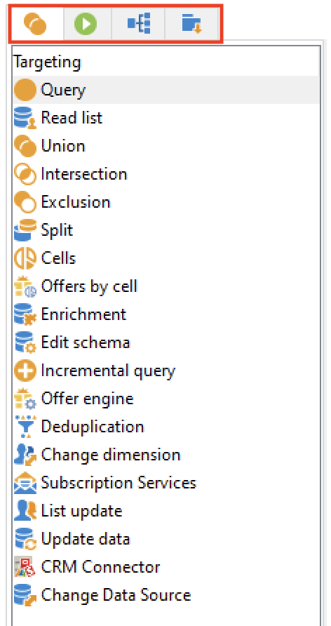
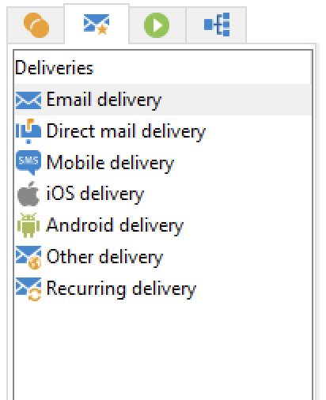
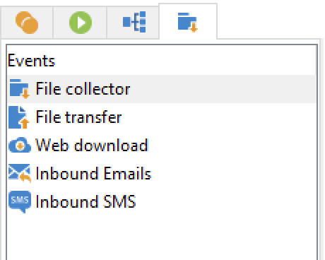

# Workflow-Aktivitäten{#wf-activities}

Workflow-Aktivitäten werden nach Kategorie in vier verschiedenen Registerkarten gruppiert.

Je nach Ihren Berechtigungen, Ihrer Implementierung und dem Kontext, in dem der Workflow erstellt wird, können die verfügbaren Aktivitäten unterschiedlich sein.

Die in einer Kampagne erstellten Workflows weisen beispielsweise für alle Kanäle die Registerkarte **Sendungen** auf. Diese Registerkarte ist in einem [technischen Workflow](technical-workflows.md) nicht verfügbar.

Technische Workflows verfügen wiederum über die Registerkarte **Ereignisse**, die in [Kampagnen-Workflows](campaign-workflows.md) nicht verfügbar ist.

Alle Aktivitäten werden in den folgenden Abschnitten beschrieben:

* [Zielgruppenbestimmungsaktivitäten](targeting-activities.md)
* [Flusssteuerungsaktivitäten](flow-control-activities.md)
* [Aktionsaktivitäten](action-activities.md)
* [Ereignisaktivitäten](event-activities.md)
* [Für einen Kampagnen-Workflow spezifische Aktivitäten](../campaigns/marketing-campaign-deliveries.md)
