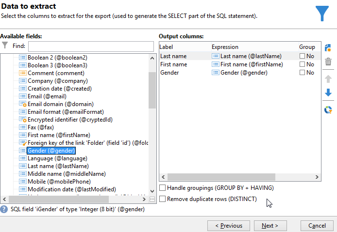
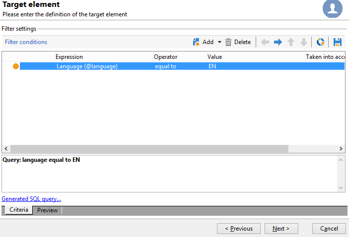
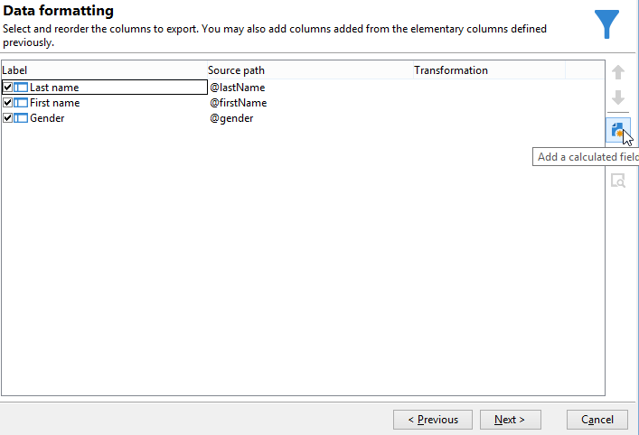
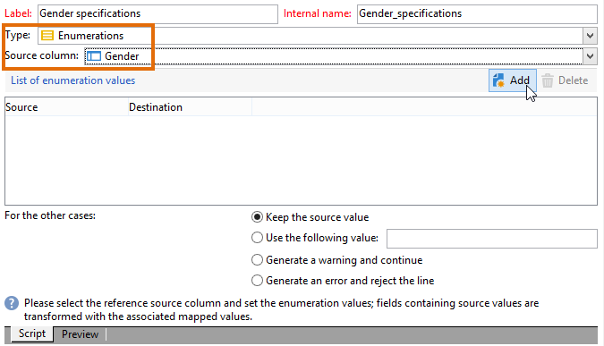
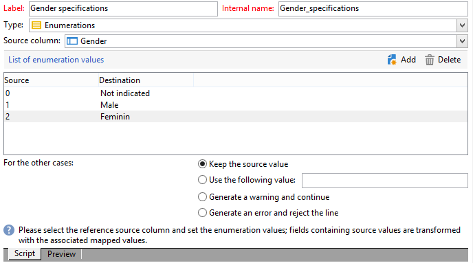
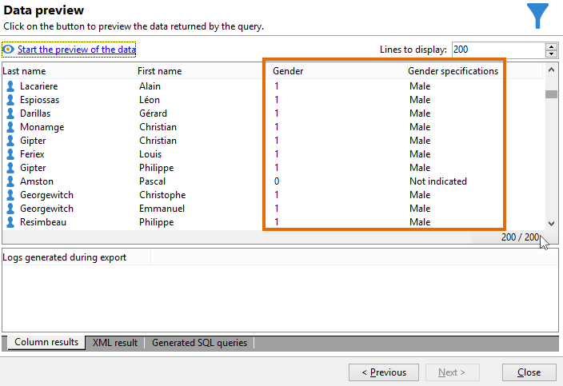
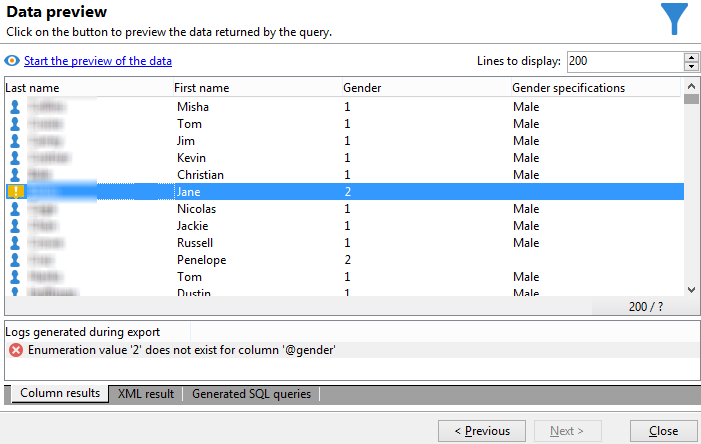
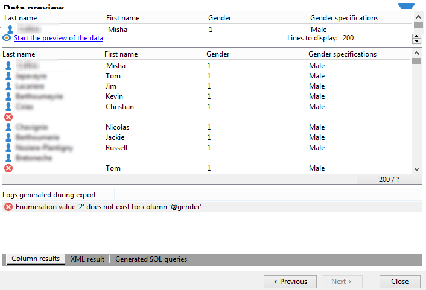

# Hinzufügen eines berechneten Felds vom Typ &quot;Aufzählung&quot; {#adding-an-enumeration-type-calculated-field}

Hier möchten wir eine Abfrage mit einem berechneten Feld vom Typ **[!UICONTROL Auflistungen]** erstellen. Dieses Feld generiert eine zusätzliche Spalte im Datenvorschaufenster. In dieser Spalte werden die numerischen Werte angegeben, die als Ergebnis für jeden Empfänger (0, 1 und 2) zurückgegeben werden. Jedem Wert in der neuen Spalte wird ein Geschlecht zugewiesen: „Männlich“ für „1“, „Weiblich“ für „2“ oder „Nicht angegeben“, wenn der Wert „0“ ist.

* Welche Tabelle soll ausgewählt werden?

  Die Empfängertabelle (nms:recipient)

* Felder, die als Ausgabespalten verwendet werden sollen?

  Nachname, Vorname, Geschlecht

* Nach welchen Kriterien sind die Informationen zu filtern?

  Nach der Sprache der Empfänger

Gehen Sie wie folgt vor:

1. Öffnen Sie den [generischen Abfrage-Editor](../../v8/start/query-editor.md) und wählen Sie die Empfängertabelle (**[!UICONTROL nms:recipient]**) aus.
1. Wählen Sie im Fenster **[!UICONTROL Zu extrahierende Daten]** die Felder **[!UICONTROL Nachname]**, **[!UICONTROL Vorname]** und **[!UICONTROL Geschlecht]**.

   

1. In diesem Beispiel ist keine **[!UICONTROL Sortierung]** erforderlich. Sie können somit direkt auf **[!UICONTROL Weiter]** klicken.
1. Wählen Sie dann im **[!UICONTROL Datenfilter]**-Fenster die Option **[!UICONTROL Filterbedingungen]**.
1. Konfigurieren Sie im Fenster **[!UICONTROL Zielelement]** eine Bedingung, die als Ergebnis alle deutschsprachigen Empfänger ausgibt.

   

1. Klicken Sie dann im Fenster **[!UICONTROL Datenformatierung]** auf die Schaltfläche **[!UICONTROL Berechnetes Feld hinzufügen]**.

   

1. Wählen Sie im Feld **[!UICONTROL Typ]** des Fensters **[!UICONTROL Definition eines berechneten Export-Feldes]** die Option **[!UICONTROL Aufzählungen]** aus.

   Definieren Sie die Spalte, auf die sich das neue berechnete Feld beziehen soll. Wählen Sie hierzu aus der Dropdown-Liste des Felds **[!UICONTROL Quellspalte]** die Spalte **[!UICONTROL Geschlecht]** aus. Die Zielwerte beziehen sich auf diese Spalte **[!UICONTROL Geschlecht]**.

   

   Definieren der **Source**- und **Destination**-Werte: Der Zielwert erleichtert das Lesen des Abfrageergebnisses. Diese Abfrage sollte das Empfängergeschlecht zurückgeben, und das Ergebnis ist entweder 0, 1 oder 2.

   Klicken Sie für jedes Quell- und Zielwertpaar auf **[!UICONTROL Hinzufügen]** rechts oberhalb der **[!UICONTROL Liste der Aufzählungswerte]**:

   * Geben Sie bei **[!UICONTROL Quellwert]** in neue Zeilen jeweils die dem Geschlecht entsprechenden Zahlenwerte ein (0, 1 und 2).
   * Geben Sie bei **[!UICONTROL Zielwert]** die den Zahlen entsprechende Bedeutung ein: &quot;Unbestimmt&quot; bei &quot;0&quot;, &quot;Männlich&quot; bei &quot;1&quot; und &quot;Weiblich&quot; bei &quot;2&quot;.

   Kreuzen Sie die Option **[!UICONTROL Quellwert]** beibehalten an und

   klicken Sie auf **[!UICONTROL OK]**, um die Konfiguration des berechneten Felds abzuschließen.

   

1. Klicken Sie im Fenster **[!UICONTROL Datenformatierung]** auf **[!UICONTROL Weiter]**.
1. Nun können Sie die **[!UICONTROL Datenvorschau starten]**.

   Die berechnete Spalte zeigt an, welchem Geschlecht die drei Werte 0, 1 und 2 entsprechen:

   * 0 für &quot;Unbestimmt&quot;
   * 1 für &quot;Männlich&quot;
   * 2 für &quot;Weiblich&quot;

   

   Wenn Sie beispielsweise in der **[!UICONTROL Liste der Auflistungswerte]** kein Geschlecht „2“ eingeben und die Funktion **[!UICONTROL Warnung erzeugen und fortfahren]** des Felds **[!UICONTROL In anderen]**) ausgewählt ist, erhalten Sie ein Warnprotokoll. Dieses Protokoll gibt an, dass Geschlecht „2“ (Weiblich) nicht eingegeben wurde. Dieser Hinweis wird im Bereich **[!UICONTROL Beim Export erzeugte Logs]** des Datenvorschaufensters angezeigt.

   

   Nehmen wir ein anderes Beispiel und gehen wir davon aus, dass der Aufzählungswert „2“ nicht eingegeben wurde. Wählen Sie die Funktion **[!UICONTROL Fehler erzeugen und Zeile ablehnen]** aus: Alle Empfänger mit „Geschlecht 2“ melden Anomalien und die anderen Informationen in der Zeile (Vor- und Nachname usw.) wird nicht exportiert. Im Feld **[!UICONTROL Beim Export erzeugte Logs]** des Datenvorschaufensters wird eine entsprechende Fehlernachricht ausgegeben. Dieses Protokoll zeigt an, dass der Aufzählungswert „2“ nicht eingegeben wurde.

   
