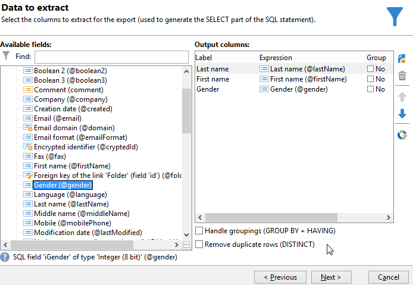

# Hinzufügen eines berechneten Felds vom Typ &quot;Aufzählung&quot; {#adding-an-enumeration-type-calculated-field}

In der folgenden Abfrage wird ein **[!UICONTROL berechnetes Auflistungsfeld]** hinzugefügt. In der Ergebnisanzeige soll eine Spalte erzeugt werden, die das Geschlecht der Empfänger anzeigt: männlich (1), weiblich (2) oder unbestimmt (0).

* Welche Tabelle soll ausgewählt werden?

  Die Empfängertabelle (nms:recipient)

* Felder, die als Ausgabespalten verwendet werden sollen?

  Nachname, Vorname, Geschlecht

* Nach welchen Kriterien sind die Informationen zu filtern?

  Nach der Sprache der Empfänger

Gehen Sie wie folgt vor:

1. Öffnen Sie das **[!UICONTROL generische Abfragetool]** und wählen Sie die Empfängertabelle (nms:recipient).
1. Wählen Sie im Fenster **[!UICONTROL Zu extrahierende Daten]** die Felder **[!UICONTROL Nachname]**, **[!UICONTROL Vorname]** und **[!UICONTROL Geschlecht]**.

   

1. In diesem Beispiel ist keine **[!UICONTROL Sortierung]** erforderlich. Sie können somit direkt auf **[!UICONTROL Weiter]** klicken.
1. Wählen Sie dann im **[!UICONTROL Datenfilter]**-Fenster die Option **[!UICONTROL Filterbedingungen]**.
1. Konfigurieren Sie im Fenster **[!UICONTROL Zielelement]** eine Bedingung, die als Ergebnis alle deutschsprachigen Empfänger ausgibt.

   

1. Klicken Sie dann im Fenster **[!UICONTROL Datenformatierung]** auf die Schaltfläche **[!UICONTROL Berechnetes Feld hinzufügen]**.

   

1. Wählen Sie im Feld **[!UICONTROL Typ]** des Fensters **[!UICONTROL Definition eines berechneten Export-Feldes]** die Option **[!UICONTROL Auflistungen]** aus.

   Definieren Sie die Spalte, auf die sich das neue berechnete Feld beziehen soll. Wählen Sie dazu die **[!UICONTROL Geschlecht]** im Dropdown-Menü des **[!UICONTROL Quellspalte]** -Feld: Die Zielwerte entsprechen dem **[!UICONTROL Geschlecht]** Spalte.

   

   Konfigurieren Sie **Quellwert** und **Zielwert**. Der Zielwert erleichtert die Lesbarkeit des Abfrageergebnisses, d. h. des Geschlechts der Empfänger (0, 1 oder 2).

   Klicken Sie für jedes Quell- und Zielwertpaar auf **[!UICONTROL Hinzufügen]** rechts oberhalb der **[!UICONTROL Liste der Auflistungswerte]**:

   * Geben Sie bei **[!UICONTROL Quellwert]** in neue Zeilen jeweils die dem Geschlecht entsprechenden Zahlenwerte ein (0, 1 und 2).
   * Geben Sie bei **[!UICONTROL Zielwert]** die den Zahlen entsprechende Bedeutung ein: &quot;Unbestimmt&quot; bei &quot;0&quot;, &quot;Männlich&quot; bei &quot;1&quot; und &quot;Weiblich&quot; bei &quot;2&quot;.

   Kreuzen Sie die Option **[!UICONTROL Quellwert]** beibehalten an und

   klicken Sie auf **[!UICONTROL OK]**, um die Konfiguration des berechneten Felds abzuschließen.

   

1. Klicken Sie im Fenster **[!UICONTROL Datenformatierung]** auf **[!UICONTROL Weiter]**.
1. Nun können Sie die **[!UICONTROL Datenvorschau starten]**.

   Die berechnete Spalte zeigt an, welchem Geschlecht die drei Werte 0, 1 und 2 entsprechen:

   * 0 für &quot;Unbestimmt&quot;
   * 1 für &quot;Männlich&quot;
   * 2 für &quot;Weiblich&quot;

   

   Wenn Sie beispielsweise das Geschlecht &quot;2&quot;nicht im **[!UICONTROL Liste der Auflistungswerte]** und die **[!UICONTROL Warnhinweis erzeugen und fortfahren]** Funktion der **[!UICONTROL In anderen Fällen]** ausgewählt ist, wird ein Warnprotokoll angezeigt. Dieses Protokoll zeigt an, dass das Geschlecht &quot;2&quot; (Weiblich) nicht eingegeben wurde. Sie wird im **[!UICONTROL Beim Export erzeugte Protokolle]** -Feld des Datenvorschaufensters.

   

   Nehmen wir ein anderes Beispiel und sagen, dass der Auflistungswert &quot;2&quot; nicht eingegeben wurde. Wählen Sie die **[!UICONTROL Fehler erzeugen und Zeile zurückweisen]** Funktion: Alle geschlechtsspezifischen &quot;2&quot;-Empfänger rufen Anomalien und die anderen Informationen in der Zeile auf (Vor- und Nachname usw.) wird nicht exportiert. Ein Fehlerprotokoll wird im **[!UICONTROL Beim Export erzeugte Protokolle]** -Feld des Datenvorschaufensters. Dieses Protokoll zeigt an, dass der Auflistungswert &quot;2&quot; nicht eingegeben wurde.

   
