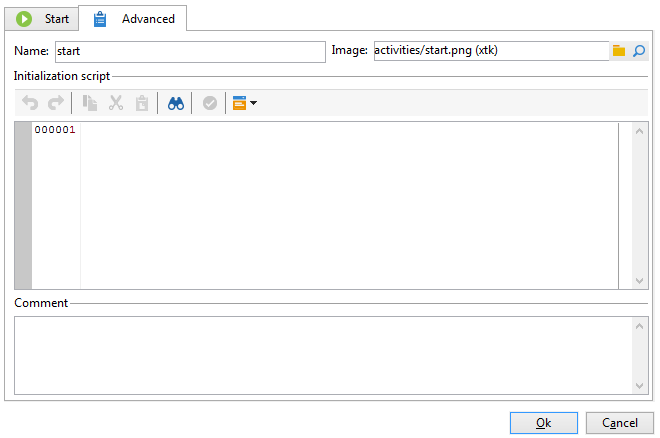
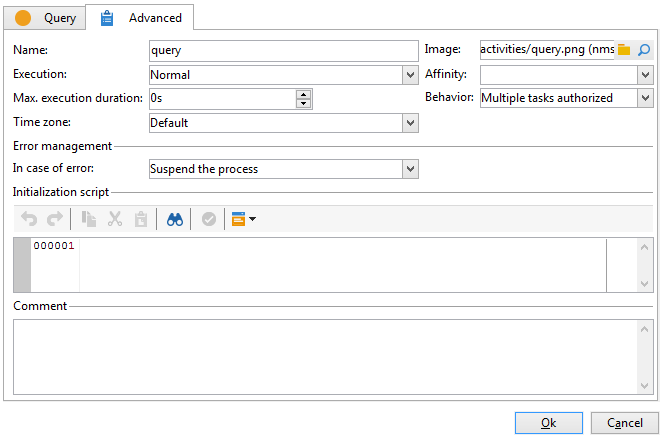

# Erweiterte Parameter{#advanced-parameters}

Der Eigenschaftenbildschirm einer Aktivität enthält die Registerkarte **[!UICONTROL Erweitert]** auf der Sie das Verhalten im Fehlerfall und die Ausführungsdauer der Aktivität festlegen und ein Initialisierungsskript eingeben können. Es gibt zwei Versionen dieser Registerkarte:

* vereinfacht für die Aktivität **[!UICONTROL Start]** und **[!UICONTROL Ende]**;

  

* detailliert für die **[!UICONTROL Abfrageaktivität]**.

  

Im Folgenden werden die im **[!UICONTROL Erweitert]**-Tab jeweils auszufüllenden Felder beschrieben.

## Name {#name}

Dieses Feld enthält den internen Namen der Aktivität.

## Bild {#image}

In diesem Feld können Sie das mit einer Aktivität verknüpfte Bild ändern. Weiterführende Informationen finden Sie unter [Ändern von Aktivitäts-Bildern](change-activity-images.md).

## Ausführung {#execution}

In diesem Feld können Sie festlegen, welche Aktion ausgeführt werden soll, wenn die Aufgabe ausgelöst wird. Es gibt drei mögliche Optionen:

In der Regel werden diese Optionen im Diagramm durch Rechtsklick auf die Aktivität ausgewählt.

* **[!UICONTROL Normal]** - die Aufgabe wird ausgeführt.
* **[!UICONTROL Nicht aktivieren]** - die Aufgabe sowie alle im selben Zweig folgenden Aktivitäten werden nicht ausgeführt.
* **[!UICONTROL Aktivieren, aber nicht ausführen]**: Diese Aufgabe und alle folgenden Aufgaben (in derselben Verzweigung) werden automatisch angehalten. Dies kann nützlich sein, wenn Sie beim Start der Aufgabe dabei sein möchten. Klicken Sie mit der rechten Maustaste auf die Aktivität und wählen Sie **[!UICONTROL Normale Ausführung]**.

## Affinität {#affinity}

Sie können die Ausführung eines Workflows oder einer Workflow-Aktivität auf einem bestimmten Computer erzwingen. Dazu müssen Sie eine oder mehrere Tendenzen auf Workflow- oder Aktivitätsebene definieren.

## Max. Ausführungsdauer {#max--execution-period}

In diesem Feld können Sie eine Warnung festlegen, wenn die Aufgabe zu lange dauert. Dies wirkt sich nicht auf den Workflow-Vorgang aus. Wenn die Aufgabe nicht zum Zeitpunkt der **[!UICONTROL Max. Ausführungsdauer]** vorbei ist, zeigt das **[!UICONTROL Monitoring der Instanz]** einen Warnhinweis bezüglich des Workflows an. Auf diese Seite kann von der Startseite aus über die Rubrik **[!UICONTROL Monitoring]** zugegriffen werden.

## Verhalten {#behavior}

In diesem Feld können Sie das Verhalten definieren, das bei der Verwendung asynchroner Aufgaben angewendet werden soll. Es gibt zwei mögliche Optionen:

* **[!UICONTROL Mehrere autorisierte Aufgaben]** - mehrere Aufgaben können gleichzeitig ausgeführt werden.
* **[!UICONTROL Die aktuelle Aufgabe hat Priorität]**: laufende Aufgaben haben Priorität. Solange eine Aufgabe ausgeführt wird, wird keine andere Aufgabe ausgeführt.

## Zeitzone {#time-zone}

In diesem Feld können Sie die Zeitzone der Aktivität auswählen. Weiterführende Informationen finden Sie unter [Verwalten von Zeitzonen](managing-time-zones.md).

## Fehler {#in-case-of-errors}

In diesem Feld können Sie festlegen, welche Aktion ausgeführt werden soll, wenn bei der Aktivität Fehler auftreten. Es gibt zwei mögliche Optionen:

* **[!UICONTROL Prozess aussetzen]**: Der Workflow wird automatisch angehalten. Der Status ändert sich in **[!UICONTROL Fehlgeschlagen]**. Nach Lösung des Problems kann der Workflow neu gestartet werden.
* **[!UICONTROL Ignorieren]**: Diese Aufgabe und alle folgenden Aufgaben (in derselben Verzweigung) werden nicht ausgeführt. Dies kann für wiederkehrende Aufgaben nützlich sein. Wenn die Verzweigung im Vorfeld eine Planung platziert hat, wird sie wie gewohnt am nächsten Ausführungsdatum gestartet.
* **[!UICONTROL Abbruch bei Fehler]**: Der Workflow wird automatisch angehalten und kann nicht neu gestartet werden. Der Status ändert sich in **[!UICONTROL Fehlgeschlagen]**.

## Initialisierungsskript {#initialization-script}

In diesem Feld können Sie Variablen initialisieren oder Aktivitätseigenschaften ändern. Weiterführende Informationen finden Sie unter [Scripts/JavaScript-Templates](javascript-scripts-and-templates.md).

## Kommentar {#comment}

Hier kann eine Beschreibung eingegeben werden. Es handelt sich um ein freies Textfeld.**&#x200B;**
