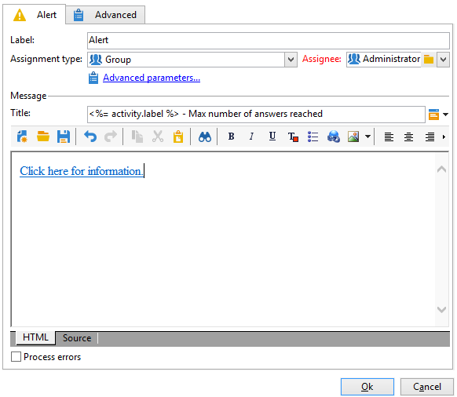

# Warnung{#alert}

Eine **Warnhinweis**-Aktivität sendet eine Nachricht an eine Benutzergruppe. Dies funktioniert genauso wie eine Validierungsaktivität, aber in diesem Fall wird keine Antwort erwartet.

Ein Warnhinweis ist nicht persistent und wird daher nicht in der Client-Konsole angezeigt. Die Benutzerinnen und Benutzer der zugewiesenen Gruppe müssen über eine vollständige E-Mail-Adresse verfügen, um die Benachrichtigung zu erhalten. Die Konfiguration dieser Aktivität ähnelt der einer **Validierung**. Die Standardversandvorlage für die Benachrichtigung der Benutzerinnen und Benutzer ist „alertAssignee“.
