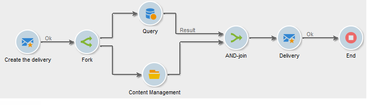

# Und-Verknüpfung{#and-join}

Ein Join gibt seine ausgehende Transition nur dann an, wenn alle eingehenden Transitionen aktiviert wurden, d. h. wenn alle vorherigen Aktivitäten abgeschlossen sind. Auf diese Weise können Sie sicherstellen, dass bestimmte Aktivitäten abgeschlossen sind, bevor Sie mit der Ausführung des Workflows fortfahren.

Beispielsweise können Sie eine Und-Verknüpfungsaktivität bei der Inhaltserstellung und Automatisierung des Versand verwenden, um sicherzustellen, dass ein Versand erst gestartet wird, wenn die Zielgruppe abgefragt und die Schritte zur Inhaltsaktualisierung abgeschlossen sind. Ein spezieller Anwendungsfall ist verfügbar unter

>[!NOTE]
>
>Beachten Sie, dass eingehende Transitionen, die mit verschiedenen Zielgruppendimensionen konfiguriert sind, nicht mit der Aktivität **[!UICONTROL Und-Verknüpfung]** zusammengeführt werden können.

Die an die ausgehende Transition übermittelte Population entspricht der Hauptmenge, die zuvor aus den eingehenden Transitionen der Aktivität bestimmt wurde.

Die ausgehende Transition darf nur eine der Populationen der eingehenden Transition enthalten. Wenn die Aktivität nicht konfiguriert ist, wählt die ausgehende Transition nach dem Zufallsprinzip eine der Eingangspopulationen aus.

>[!CAUTION]
>
>Bei Verwendung einer **UND-Verknüpfung** werden die Ereignisvariablen zusammengeführt. Wenn eine Variable aber mehrmals definiert wurde, entsteht ein Konflikt und es wird ein unbestimmter Wert ausgegeben. Weiterführende Informationen hierzu finden Sie in [diesem Abschnitt](javascript-scripts-and-templates.md#event-variables).
