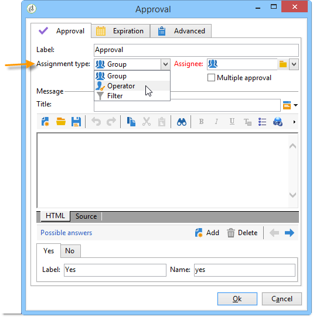
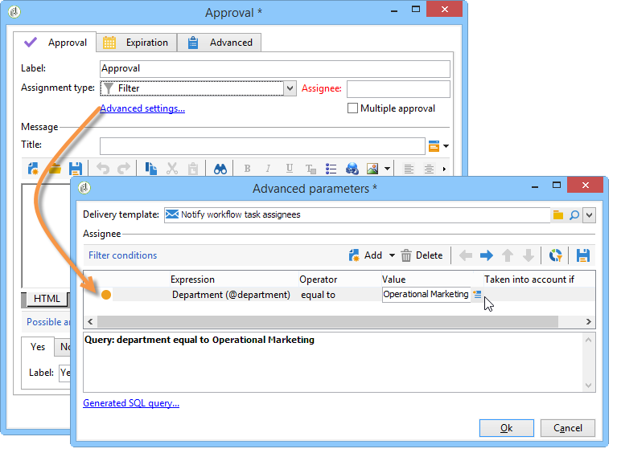
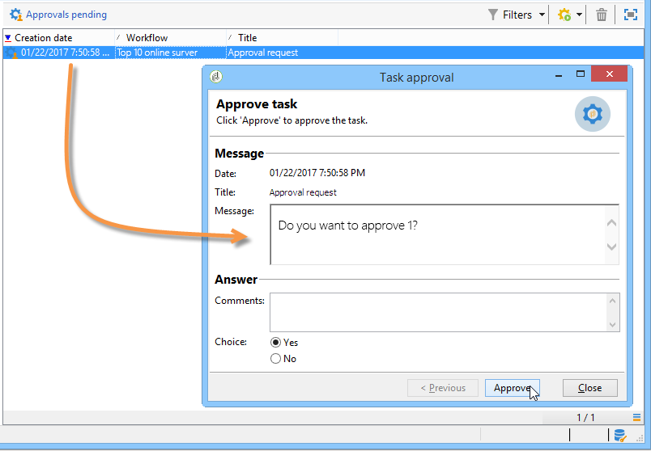
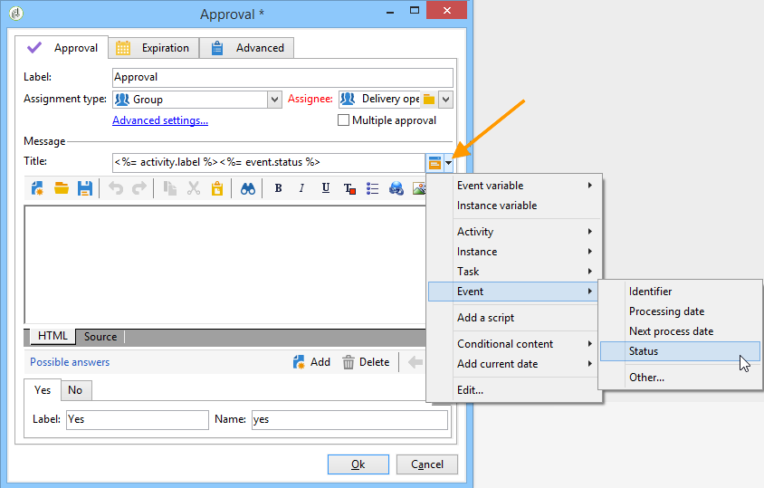

# Validierung{#approval}

Eine **Genehmigungsaufgabe** erfordert die Beteiligung eines Benutzers. Dem Benutzer wird eine Aufgabe zugewiesen und er kann per E-Mail, über die in der E-Mail-Nachricht verlinkte Webseite oder über die Konsole darauf antworten.

## Aufgabenzuweisung {#task-assignment}

Standardmäßig wird die Genehmigung einer Benutzergruppe zugewiesen. Diese Gruppe stellt eine Rolle dar, z. B. „Newsletter-Inhaltsgruppe“ oder „Newsletter-Zielgruppe“. Jeder Benutzer in der Gruppe kann antworten, aber es wird nur die erste Antwort berücksichtigt (außer im Fall von Mehrfachgenehmigungen).

Bei Bedarf kann die Validierung auch einem einzelnen oder durch die Verwendung von Filtern mehreren Benutzern zugewiesen werden.

* Zur Auswahl eines einzelnen Benutzers ist im Feld **[!UICONTROL Zuweisungstyp]** die Option **[!UICONTROL Benutzer]** zu wählen. Wählen Sie dann aus der Dropdown-Liste des Felds **[!UICONTROL Zuweisung]** den gewünschten Benutzer aus.

  

  >[!CAUTION]
  >
  >Nur der ausgewählte Benutzer verfügt über die Berechtigung zur Validierung der Aufgabe.

* Es besteht die Möglichkeit, eine Abfrage zu erstellen, um die für die Validierung verantwortlichen Benutzenden zu filtern. Wählen Sie hierzu im Feld **[!UICONTROL Zuweisungstyp]** die Option **[!UICONTROL Filter]** aus und klicken Sie auf den Link **[!UICONTROL Erweiterte Parameter…]**, um die Filterkriterien zu definieren, wie im unten stehendem Beispiel dargestellt:

  

Im Fall einer einfachen Validierung, wird die der Wahl des Benutzers entsprechende Transition aktiviert und die Aufgabe abgeschlossen. Andere Benutzer können nun die Aufgabe nicht mehr validieren.

Bei Mehrfach-Validierungen werden die der Auswahl des jeweiligen Benutzers entsprechenden Übergänge aktiviert. Die Aufgabe ist beendet, wenn alle Benutzer der Gruppe geantwortet haben oder wenn die Aufgabe abgelaufen ist.

Diese Aktivität betrifft nicht den gesamten Workflow, andere Aufgaben können parallel ausgeführt werden.

Eine Benutzerin bzw. ein Benutzer kann die ihr bzw. ihm zugewiesenen Aufgaben über die Client-Konsole genehmigen. Benutzer bzw. Benutzerinnen mit Administratorrechten können die Aufgaben, die einem Benutzer bzw. einer Benutzerin zugewiesen sind, anzeigen und löschen, aber nicht darauf antworten.

Änderungen in Bezug auf die Titel oder den Nachrichten-Textkörper der Aktivität haben keinen Einfluss auf laufende Aufgaben. Sollten jedoch die möglichen Antworten geändert werden, werden die neuen Optionen automatisch in den laufenden Aufgaben übernommen.

Auf **Validierungsaufgaben** kann im Knoten **[!UICONTROL Administration > Betreibung > Automatisch erstellte Objekte > Ausstehende Validierungen]** zugegriffen werden. Aus dieser Ansicht heraus gelangen die Benutzer direkt in die verschiedenen Validierungsformulare.

## Eigenschaften {#properties}

Anpassungsvariablen können in der Nachricht verwendet werden, die an Validierungsverantwortliche gesendet wird. Sie können in den Titel oder Text der Nachricht eingefügt werden.

Dieses **[!UICONTROL Titel]**-Feld enthält den Titel der Nachricht: Dies ist der Betreff der gesendeten E-Mail-Nachricht. Titel und Nachrichtentext sind JavaScript-Vorlagen und können daher Werte enthalten, die entsprechend dem Kontext des Workflows berechnet werden.

Im unteren Bereich des Editors können Sie die Liste der möglichen Antworten definieren. Zu jeder Antwort gehört eine Transition. Der Name ist die interne Kennung und die Beschriftung ist der Text, der in der Auswahlliste angezeigt wird.

Klicken Sie auf **[!UICONTROL Link Erweiterte Parameter…]**, um die Versandvorlage auszuwählen, die zur Benachrichtigung der Benutzer verwendet werden soll. Die Standardvorlage (interner Name &#39;notifyAssignee&#39;) nimmt den Titel und die Nachricht auf und fügt einen Link zu der für die Antwort verwendeten Web-Seite hinzu.

Diese Vorlage kann geändert werden, um das Nachrichten-Layout zu personalisieren, es ist jedoch besser, eine Kopie zu erstellen. Der Targeting-Mechanismus (externe Datei, Zielgruppen-Mapping) darf nicht geändert werden, da er für die ordnungsgemäße Funktionsweise von Benachrichtigungen erforderlich ist.

Ein Validierungsbeispiel finden Sie im Abschnitt [Validierungen definieren](define-approvals.md).

## Ausgabeparameter {#output-parameters}

* **[!UICONTROL response]**

  Kommentar zur Antwort

* **[!UICONTROL responseOperator]**

  Kennung der Person, die geantwortet hat. Dieses Feld ist ein numerischer Wert, aber ein Feld mit einer **[!UICONTROL Zeichenfolge]**.
