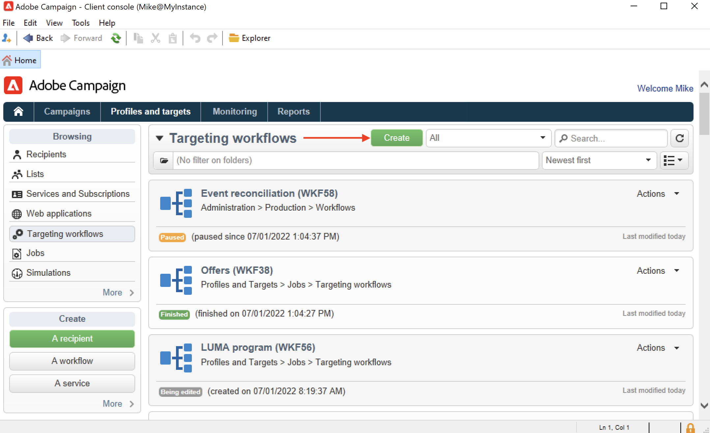
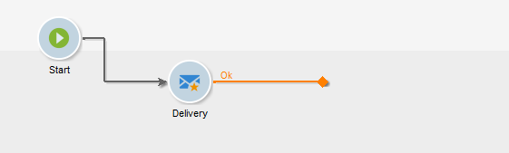

# Erstellen eines Workflows {#build-a-workflow}

## Erstellen eines neuen Workflows {#create-a-new-workflow}

Der Ablauf der Workflow-Erstellung hängt von der Art des Workflows ab. Sie haben folgende Möglichkeiten:

* Erstellen Sie [Zielgruppen-Workflows](#targeting-workflows) über den Knoten **[!UICONTROL Profile und Zielgruppen]** > **[!UICONTROL Vorgänge]** > **[!UICONTROL Zielgruppen-Workflows]** des Explorers oder über die Registerkarte **[!UICONTROL Profile und Zielgruppen]** der Startseite und die Unterregisterkarte **[!UICONTROL Zielgruppen-Workflows]**.

   

* Erstellen von [Kampagnen-Workflows](#campaign-workflows) über die Registerkarte **[!UICONTROL Zielgruppenbestimmungen und Workflows]** einer Kampagne

* Erstellen Sie [Technische Workflows](#technical-workflows) über den Knoten **[!UICONTROL Administration]** > **[!UICONTROL Produktion]** > **[!UICONTROL Technische Workflows]** des Explorers. Es empfiehlt sich, einen speziellen Workflow-Ordner zu erstellen, um Ihre technischen Workflows zu speichern.

Klicken Sie auf die Schaltfläche **[!UICONTROL Neu]** oberhalb der Workflow-Liste.

Benennen Sie den Workflow und klicken Sie auf **[!UICONTROL Speichern]**.

## Hinzufügen und Verknüpfen von Aktivitäten {#add-and-link-activities}

In diesem Schritt werden die Aktivitäten im Diagramm positioniert, konfiguriert und miteinander in Beziehung gesetzt. Bisher zeigt das Workflow-Fenster nur den Titel und den Status des Workflows an (In Bearbeitung). Der untere Bereich des Fensters dient der Konzeption des Diagramms. Er enthält eine Symbolleiste, eine Palette mit den verfügbaren Aktivitäten (links) und das Diagramm selbst (rechts).

>[!NOTE]
>
>Sollte die Palette nicht angezeigt werden, können Sie sie durch Klick auf die erste Schaltfläche in der Workflow-Symbolleiste einblenden.

Auf den einzelnen Registerkarten der Palette werden die Aktivitäten nach Kategorie geordnet angezeigt. Die verfügbaren Tabs und Aktivitäten sind je nach Workflow-Typ unterschiedlich (technischer, Zielgruppen- oder Kampagnen-Workflow).

* Der erste Tab enthält Zielgruppen- und Datenmanipulationsaktivitäten. Diese Aktivitäten werden unter [Zielgruppenbestimmungsaktivitäten](targeting-activities.md) beschrieben.
* Der zweite Tab enthält die Planungsaktivitäten, die in erster Linie der Koordination der anderen Aktivitäten dienen. Diese Aktivitäten werden unter [Steuerungsaktivitäten](flow-control-activities.md) beschrieben.
* Der dritte Tab enthält Tools und Aktionen, die im Workflow verwendet werden können. Diese Aktivitäten werden unter [Aktionsaktivitäten](action-activities.md) beschrieben.
* Der vierte Tab enthält die Aktivitäten, die von einem bestimmten Ereignis abhängen, beispielsweise vom Erhalt einer E-Mail oder dem Empfang einer Datei auf dem Server. Diese Aktivitäten werden unter [Ereignisaktivitäten](event-activities.md) beschrieben.

So erstellen Sie das Diagramm

1. Fügen Sie eine Aktivität hinzu, indem Sie sie in der Palette auswählen und an die gewünschte Stelle im Diagramm ziehen.

   Ziehen Sie zunächst einen **Beginn** und anschließend einen **Versand** in das Diagramm.

   

1. Verbinden Sie die beiden Aktivitäten, indem Sie die Transition des **Beginns** über den **Versand** ziehen und ablegen.

   

   Zwei Aktivitäten werden automatisch miteinander verbunden, wenn Sie die zweite Aktivität direkt am Ende der ersten platzieren.

1. Fügen Sie wie in unten stehender Abbildung weitere benötigte Aktivitäten hinzu und verbinden Sie sie.

   

>[!CAUTION]
>
>Sie können Aktivitäten innerhalb eines Workflows kopieren und einfügen. Wir raten jedoch davon ab, Aktivitäten über verschiedene Workflows hinweg zu kopieren und einzufügen. Einige Einstellungen, die Aktivitäten wie Sendungen und Planung betreffen, können zu Konflikten und Fehlern beim Ausführen des Ziel-Workflows führen. Stattdessen empfehlen wir, Workflows zu **duplizieren**. Weitere Informationen finden Sie unter [Duplizieren von Workflows](#duplicate-workflows).

Die Darstellung und das Layout des Diagramms kann mithilfe der folgenden Elemente angepasst werden:

* **Verwenden der Symbolleiste**

   Über die Symbolleiste des Workflow-Editors besteht Zugriff auf Funktionen zur Formatierung und Ausführung der Workflows.

   

   Sie können den Editor anpassen, indem Sie z. B. die Palette und die Übersicht ein- oder ausblenden oder die Größe und Ausrichtung der grafischen Objekte verändern.

   

   Die Symbole zur Anzeige des Fortschritts und der Protokolle werden in den folgenden Abschnitten beschrieben:

   * [Anzeigen des Fortschritts](monitor-workflow-execution.md#displaying-progress)
   * [Anzeigen der Protokolle](monitor-workflow-execution.md#displaying-logs)

* **Objektausrichtung**

   Um die Symbole der Aktivitäten auszurichten, markieren Sie diese und klicken Sie in der Symbolleiste auf **[!UICONTROL Vertikal ausrichten]** oder **[!UICONTROL Horizontal ausrichten]**.

   Mithilfe der **STRG**-Taste können Sie mehrere Aktivitäten markieren, die im Diagramm nicht unmittelbar nebeneinander positioniert sind, oder die Markierung einzelner Aktivitäten entfernen. Durch Klick in den Diagrammhintergrund werden alle Markierungen entfernt.

* **Hintergrundbild und Symbole**

   Das Hintergrundbild des Diagramms und die Symbole der einzelnen Aktivitäten können personalisiert werden. Siehe [Ändern der Bilder für Aktivitäten](change-activity-images.md).

## Konfigurieren von Aktivitäten {#configure-activities}

Doppelklicken Sie auf eine Aktivität, um sie zu konfigurieren oder klicken Sie mit der rechten Maustaste und wählen Sie im Kontextmenü die Option **[!UICONTROL Öffnen...]** aus.

>[!NOTE]
>
>Aktivitäten des Kampagnen-Workflows werden in [diesem Abschnitt](activities.md) erläutert.

Der erste Tab enthält allgemeine Parameter, während Sie im Tab **[!UICONTROL Erweitert]** den Umgang mit Fehlern und die Ausführungsdauer der Aktivität bestimmen oder ein Initialisierungsscript erfassen können.

Um die Aktivitäten besser zu verstehen und die Lesbarkeit des Workflows zu verbessern, können Sie in die Aktivitäten Kommentare einfügen.

Diese Kommentare werden automatisch angezeigt, wenn Benutzer über die Aktivität scrollen.

## Workflow-Vorlagen {#workflow-templates}

Eine Workflow-Vorlage besteht aus einer Reihe von konfigurierten Eigenschaften und gegebenenfalls aus einem Diagramm mit verbundenen Aktivitäten. Auf Basis derartiger Vorlagen können neue Workflows erstellt werden, die die konfigurierten Parameter übernehmen.

Die Konfiguration neuer Workflow-Vorlagen kann ausgehend von existierenden Vorlagen geschehen oder aber durch die Umwandlung eines existierenden Workflows in eine Vorlage.

Workflow-Vorlagen werden im Knoten **[!UICONTROL Ressourcen > Vorlagen > Workflow-Vorlagen]** des Explorers gespeichert.

Neben den gängigen Workflow-Parametern können Sie in den Eigenschaften der Vorlage auch die Ausführungsdatei der auf Basis der Vorlage erstellten Workflows definieren.

## Duplizieren von Workflows {#duplicate-workflows}

Sie können verschiedene Typen von Workflows duplizieren. Nach dem Duplizieren werden Änderungen des Workflows nicht in die Kopie des Workflows übernommen.

>[!CAUTION]
>
>Die Funktion zum Kopieren/Einfügen ist in den Workflows verfügbar. Es wird jedoch empfohlen, **Duplizieren** zu verwenden. Die Konfiguration der kopierten Aktivitäten bleibt dabei unverändert. Bei Versandaktivitäten (E-Mail, SMS, Push-Benachrichtigung ...) wird auch das der Aktivität angehängte Versandobjekt kopiert, was zu einem Absturz führen kann.

1. Klicken Sie mit der rechten Maustaste auf einen Workflow.
1. Klicken Sie auf **Duplizieren**.

   

1. Ändern Sie den Workflow-Titel im Workflow-Fenster.
1. Wählen Sie **Speichern** aus.

Die duplizierte Funktion steht in der Ansicht einer Kampagne nicht direkt zur Verfügung.

Sie können jedoch eine Ansicht erstellen, die alle Workflows in Ihrer Instanz anzeigt. In dieser Ansicht können Sie Workflows mit **Duplizieren in** duplizieren.

**Erstellen einer Ansicht**

1. Navigieren Sie in **Explorer** zu dem Ordner, in dem Sie Ihre Ansicht erstellen müssen.
1. Klicken Sie mit der rechten Maustaste und gehen Sie zu **Neuen Ordner hinzufügen** > **Prozess**, wählen Sie **Workflows** aus.

   

Der neue Ordner **Workflows** wird erstellt.

1. Klicken Sie mit der rechten Maustaste und wählen Sie **Eigenschaften** aus.
1. Aktivieren Sie auf der Registerkarte **Einschränkung** die Option **Dieser Ordner ist eine Ansicht** und klicken Sie auf **Speichern**.

   

Der Ordner wird nun mit allen Workflows Ihrer Instanz gefüllt.

**Duplizieren von Kampagnen-Workflows**

1. Wählen Sie in der Workflow-Ansicht einen Kampagnen-Workflow aus.
1. Klicken Sie mit der rechten Maustaste auf **Duplizieren in**.
1. Ändern Sie den Titel.
1. Wählen Sie **Speichern** aus.

Ihr duplizierter Workflow wird in der Ansicht „Workflow“ angezeigt.
