# Erstellen eines Workflows {#build-a-workflow}

## Erstellen eines neuen Workflows {#create-a-new-workflow}

Der Ablauf der Workflow-Erstellung hängt von der Art des Workflows ab. Sie haben folgende Möglichkeiten:

* Erstellen Sie [Zielgruppen-Workflows](#targeting-workflows) über den Knoten **[!UICONTROL Profile und Zielgruppen]** > **[!UICONTROL Aufträge]** > **[!UICONTROL Zielgruppen-Workflows]** des Explorers oder über die Registerkarte **[!UICONTROL Profile und Zielgruppen]** der Startseite und die Unterregisterkarte **[!UICONTROL Zielgruppen-Workflows]**.

  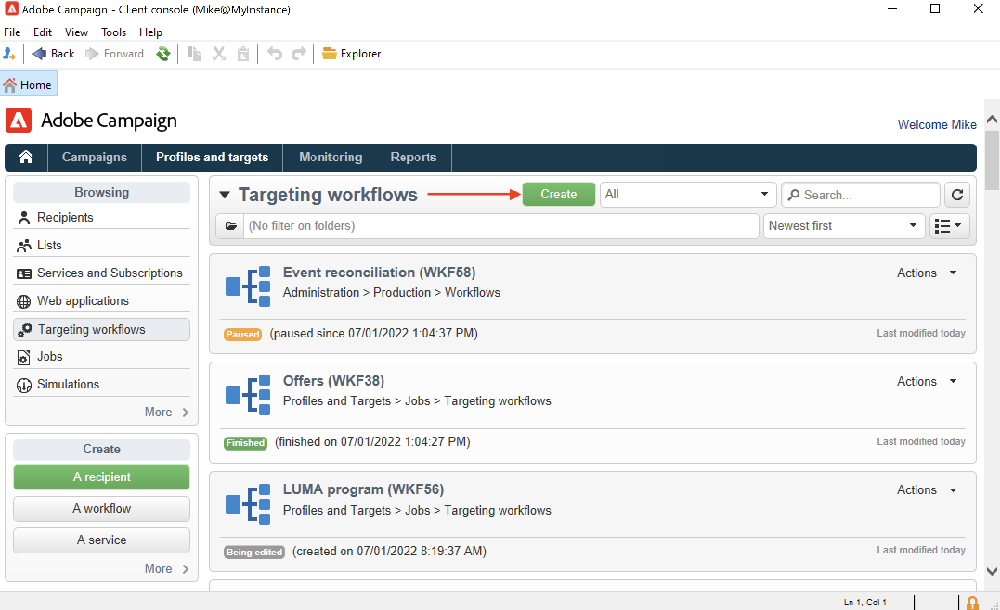

* Erstellen von [Kampagnen-Workflows](#campaign-workflows) über die Registerkarte **[!UICONTROL Zielgruppenbestimmungen und Workflows]** einer Kampagne

* Erstellen Sie [Technische Workflows](#technical-workflows) über den Knoten **[!UICONTROL Administration]** > **[!UICONTROL Produktion]** > **[!UICONTROL Technische Workflows]** des Explorers. Es empfiehlt sich, einen speziellen Workflow-Ordner zu erstellen, um Ihre technischen Workflows zu speichern.

Klicken Sie auf die Schaltfläche **[!UICONTROL Neu]** oberhalb der Workflow-Liste, um einen neuen Workflow zu erstellen.

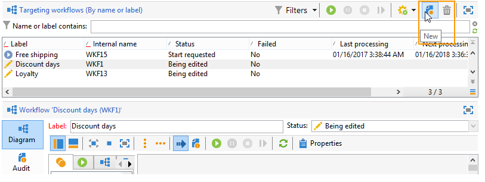

Benennen Sie den Workflow und klicken Sie auf **[!UICONTROL Speichern]**.

## Hinzufügen und Verknüpfen von Aktivitäten {#add-and-link-activities}

Definieren Sie jetzt die verschiedenen Aktivitäten und verbinden Sie sie in einem Diagramm. In diesem Schritt der Konfiguration sehen wir die Diagrammbeschriftung und den Workflow-Status (Bearbeitung läuft). Der untere Bereich des Fensters dient nur zur Bearbeitung des Diagramms. Es enthält eine Symbolleiste, eine Palette von Aktivitäten (links) und das Diagramm selbst (rechts).

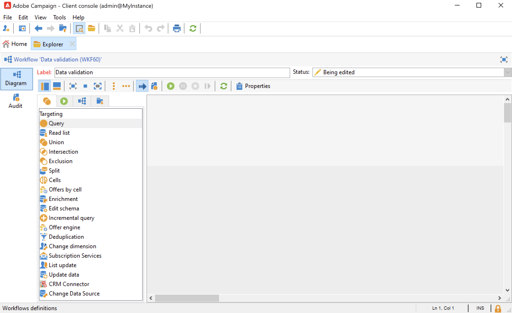

>[!NOTE]
>
>Sollte die Palette nicht angezeigt werden, können Sie sie durch Klick auf die erste Schaltfläche in der Workflow-Symbolleiste einblenden.

Auf den einzelnen Registerkarten der Palette werden die Aktivitäten nach Kategorie geordnet angezeigt. Die verfügbaren Tabs und Aktivitäten sind je nach Workflow-Typ unterschiedlich (technischer, Zielgruppen- oder Kampagnen-Workflow).

* Der erste Tab enthält Zielgruppenbestimmungs- und Datenmanipulationsaktivitäten. Diese Aktivitäten werden unter [Zielgruppenbestimmungsaktivitäten](targeting-activities.md) beschrieben.
* Der zweite Tab enthält die Planungsaktivitäten, die in erster Linie der Koordination der anderen Aktivitäten dienen. Diese Aktivitäten werden unter [Steuerungsaktivitäten](flow-control-activities.md) beschrieben.
* Der dritte Tab enthält Tools und Aktionen, die im Workflow verwendet werden können. Diese Aktivitäten werden unter [Aktionsaktivitäten](action-activities.md) beschrieben.
* Der vierte Tab enthält die Aktivitäten, die von einem bestimmten Ereignis abhängen, beispielsweise vom Erhalt einer E-Mail oder dem Empfang einer Datei auf dem Server. Diese Aktivitäten werden unter [Ereignisaktivitäten](event-activities.md) beschrieben.

So erstellen Sie das Diagramm

1. Fügen Sie eine Aktivität hinzu, indem Sie sie in der Palette auswählen und an die gewünschte Stelle im Diagramm ziehen.

   Ziehen Sie zunächst einen **Beginn** und anschließend einen **Versand** in das Diagramm.

   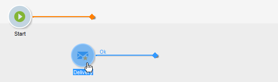

1. Verbinden Sie die beiden Aktivitäten, indem Sie die Transition des **Beginns** über den **Versand** ziehen und ablegen.

   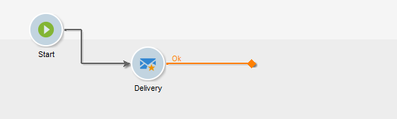

   Zwei Aktivitäten werden automatisch miteinander verbunden, wenn Sie die zweite Aktivität direkt am Ende der ersten platzieren.

1. Fügen Sie wie in unten stehender Abbildung weitere benötigte Aktivitäten hinzu und verbinden Sie sie.

   

>[!CAUTION]
>
>Sie können Aktivitäten innerhalb eines Workflows kopieren und einfügen. Wir raten jedoch davon ab, Aktivitäten über verschiedene Workflows hinweg zu kopieren und einzufügen. Einige Einstellungen, die Aktivitäten wie Sendungen und Planung betreffen, können zu Konflikten und Fehlern beim Ausführen des Ziel-Workflows führen. Stattdessen empfehlen wir, Workflows zu **duplizieren**. Weitere Informationen finden Sie unter [Duplizieren von Workflows](#duplicate-workflows).

Die Darstellung und das Layout des Diagramms kann mithilfe der folgenden Elemente angepasst werden:

* **Verwenden der Symbolleiste**

  Über die Symbolleiste des Workflow-Editors besteht Zugriff auf Funktionen zur Formatierung und Ausführung der Workflows.

  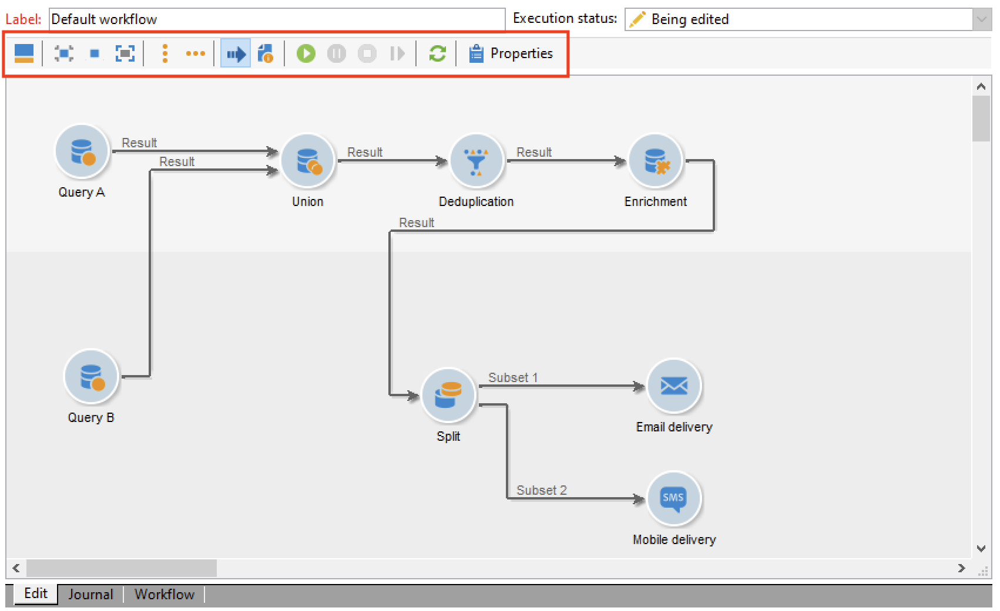

  Sie können den Editor anpassen, indem Sie z. B. die Palette und die Übersicht ein- oder ausblenden oder die Größe und Ausrichtung der grafischen Objekte verändern.

  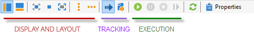

  Die Symbole zur Anzeige des Fortschritts und der Protokolle werden in den folgenden Abschnitten beschrieben:

   * [Anzeigen des Fortschritts](monitor-workflow-execution.md#displaying-progress)
   * [Anzeigen der Protokolle](monitor-workflow-execution.md#displaying-logs)

* **Objektausrichtung**

  Um die Symbole der Aktivitäten auszurichten, markieren Sie diese und klicken Sie in der Symbolleiste auf **[!UICONTROL Vertikal ausrichten]** oder **[!UICONTROL Horizontal ausrichten]**.

  Verwenden Sie die **STRG**-Taste, um mehrere verstreute Aktivitäten auszuwählen oder die Auswahl für eine oder mehrere Aktivitäten aufzuheben. Klicken Sie auf den Hintergrund des Diagramms, um die Auswahl aufzuheben.

* **Hintergrundbild und Symbole**

  Das Hintergrundbild des Diagramms und die Symbole der einzelnen Aktivitäten können personalisiert werden. Siehe [Ändern der Bilder für Aktivitäten](change-activity-images.md).

## Konfigurieren von Aktivitäten {#configure-activities}

Doppelklicken Sie auf eine Aktivität, um sie zu konfigurieren oder klicken Sie mit der rechten Maustaste und wählen Sie im Kontextmenü die Option **[!UICONTROL Öffnen...]** aus.

>[!NOTE]
>
>Aktivitäten des Kampagnen-Workflows werden in [diesem Abschnitt](activities.md) erläutert.

Die erste Registerkarte enthält die grundlegende Konfiguration. Die Registerkarte **[!UICONTROL Erweitert]** enthält zusätzliche Parameter, die insbesondere für die Bestimmung des Verhaltens bei auftretenden Fehlern, die Angabe der Ausführungsdauer einer Aktivität und die Eingabe eines Initialisierungsskripts verwendet werden.

Um die Aktivitäten besser zu verstehen und die Lesbarkeit des Workflows zu verbessern, können Sie in die Aktivitäten Kommentare einfügen.

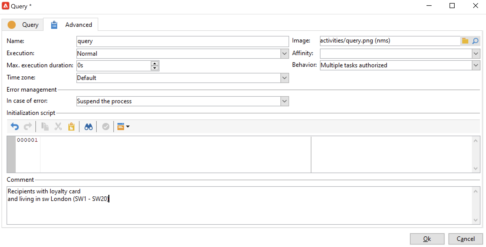

Diese Kommentare werden automatisch angezeigt, wenn Benutzer über die Aktivität scrollen.

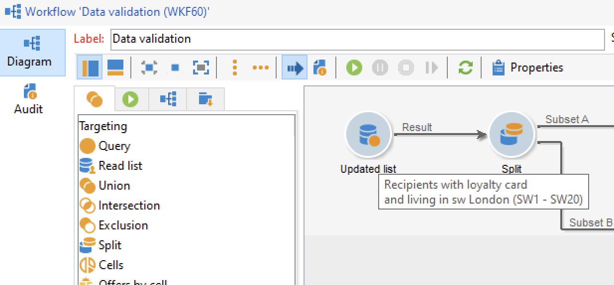

## Workflow-Vorlagen {#workflow-templates}

Workflow-Vorlagen enthalten die Gesamtkonfiguration von Eigenschaften und möglicherweise eine Reihe von Aktivitäten, die innerhalb eines Diagramms verkettet sind. Diese Konfiguration kann für die Erstellung neuer Workflows mit einer bestimmten Anzahl vorkonfigurierter Elemente wiederverwendet werden

Die Konfiguration neuer Workflow-Vorlagen kann ausgehend von existierenden Vorlagen geschehen oder aber durch die Umwandlung eines existierenden Workflows in eine Vorlage.

Workflow-Vorlagen werden im Knoten **[!UICONTROL Ressourcen > Vorlagen > Workflow-Vorlagen]** des Explorers gespeichert.

Neben den gängigen Workflow-Parametern können Sie in den Eigenschaften der Vorlage auch die Ausführungsdatei der auf Basis der Vorlage erstellten Workflows definieren.

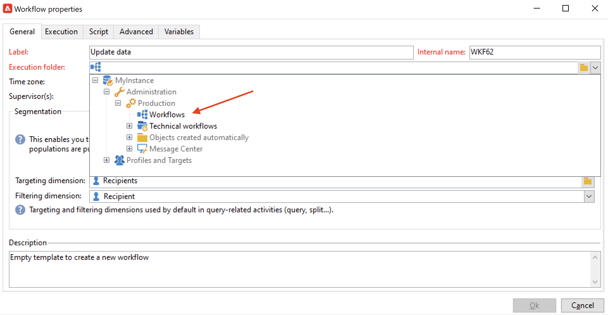

## Duplizieren von Workflows {#duplicate-workflows}

Sie können verschiedene Typen von Workflows duplizieren. Nach dem Duplizieren werden Änderungen des Workflows nicht in die Kopie des Workflows übernommen.

Adobe empfiehlt, einen Workflow zu duplizieren, anstatt Aktivitäten zu kopieren und einzufügen. Beim Kopieren einer Aktivität werden alle zugehörigen Einstellungen beibehalten. Bei Kanalaktivitäten wird auch das der Aktivität zugeordnete Versandobjekt kopiert, was zu größeren Problemen führen kann.

1. Klicken Sie mit der rechten Maustaste auf einen Workflow.
1. Klicken Sie auf **Duplizieren**.

   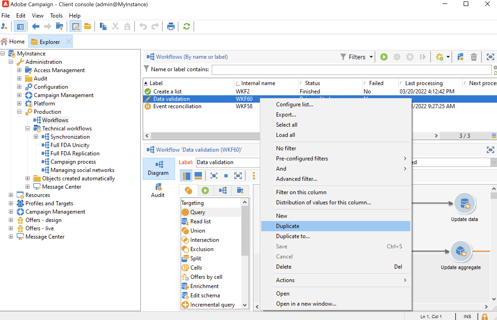

1. Ändern Sie den Workflow-Titel im Workflow-Fenster.
1. Klicken Sie auf **Speichern**.

